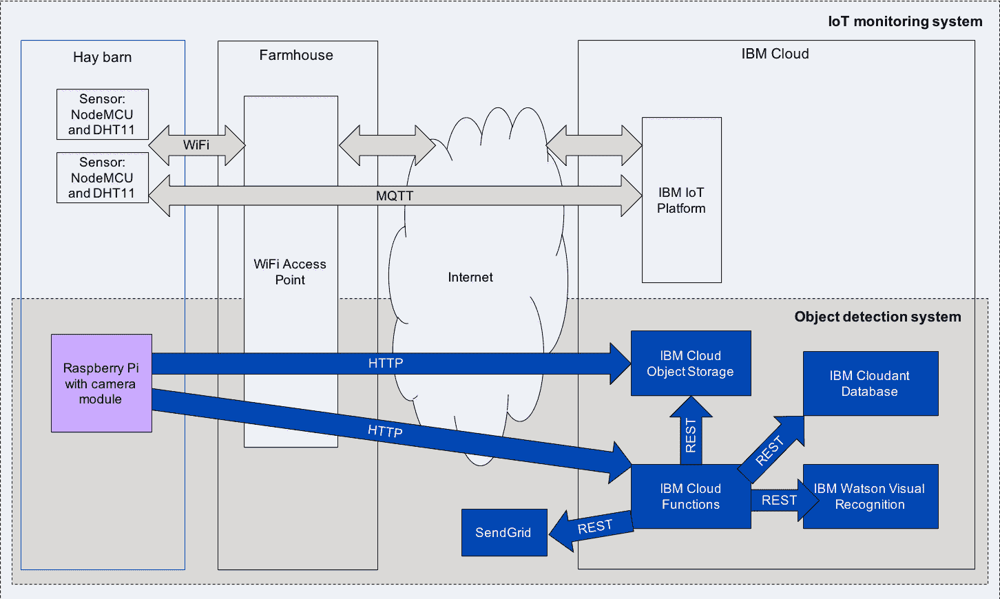
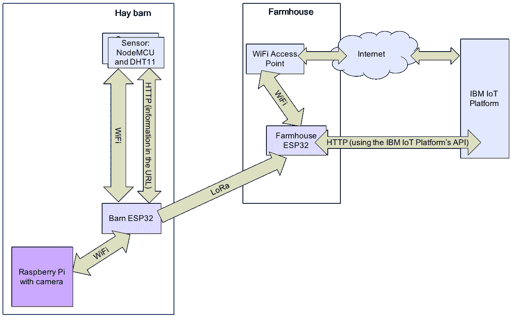

# 将人工智能集成到 IoT 解决方案中

> 原文：[`developer.ibm.com/zh/tutorials/iot-edge4/`](https://developer.ibm.com/zh/tutorials/iot-edge4/)

在本文中，您将了解如何使用人工智能（或至少使用机器学习）在假定的静态环境（例如，收获后干草变干的干草仓）中发生变化时发出警报。我使用两种方法来实现此目的：视觉识别和图像比较。

视觉识别需要进行更多处理，而在 Raspberry Pi 上可以轻松完成这些处理。此处的解决方案是上传 IBM Cloud 的照片，并请求 IBM Watson Visual Recognition 识别其中的对象。如果出现一个新对象，或者预期的对象消失（并且一整天都不显示，因为某些物品可能只能在特定的照明条件下才能识别出对象），那么此 AI 系统将发出警报。

由于使用 IBM Watson Visual Recognition 进行对象识别时需要大量带宽来将照片上传到 IBM Cloud，因此我设计了一个可以在低带宽网络连接（例如 LoRa 连接）上工作的 AI 系统。为了检测此类环境中的变化，本文的第二部分将使用图像比较。每十分钟拍摄一次图像，每次都将该图像与 24 小时前拍摄的图像进行比较。这样可保证照明条件几乎无变化，从而防止误报。

## 构建应用程序所需的物品

*   一个 Raspberry Pi
*   一个 Raspberry Pi Camera 模块
*   一个 HDMI 监视器
*   一套 USB 键盘和鼠标（无线或有线 USB）
*   一张微型 SD 卡（8 GB 就足够了）

[获得代码](https://github.com/qbzzt/IoT/blob/master/201801/Hay_Bale_Fire)

## 架构

### 短程架构

为了在云中实施视觉识别，我们将以第一篇文章中的短程架构为基础。干草仓中的设备使用 WiFi 与连接到因特网的农舍中的接入点进行通信。除了该文章中的 NodeMCU 和 DHT11 传感器外，干草仓还具有一个 Raspberry Pi 和一个 Raspberry Camera 模块（用于检测对象）。

*图 1：短程架构*



请注意，由于数据速率问题，远程架构不适用于此用例。 Raspberry Camera 模块拍摄的每张照片大约为 3.5 MB。[LoRa 的数据速率约为 50 kbps](https://arxiv.org/pdf/1607.08011.pdf)。3.5 MB 等于 3584 KB（1 兆字节等于 1024 KB）或 28,672 Kb（每字节 8 位）。因此，传输单张图像大约需要 570 秒（接近 10 分钟）。这耗时太长了，尤其是在需要传输其他信息（例如，传感器读数）的环境中。

因此，在我的解决方案中，Raspberry Pi 使用因特网访问以下两个 IBM Cloud 服务：Object Storage 和 Cloud Functions。在拍照后，Raspberry Pi 将照片上传到 IBM Cloud Object Storage。然后，它在 IBM Cloud Functions 上调用相应操作以向其通知有关新照片的情况。然后，该操作会访问 IBM Watson Visual Recognition 服务来识别对象，访问 IBM Cloudant 数据库以将当前对象与其过去看到的对象进行比较。如果检测到重大更改，那么将使用 SendGrid 向相关人员发送消息。

我们本可以使用 IBM Watson IoT Platform 来存储照片，但是它会要求我们完成更多复杂处理（将 Raspberry Pi 注册为设备），并且不会为我们提供额外的价值。传感器将使用 IoT Platform，因为这是用于上传和存储传感器读数的高可用的基础架构。但是，IBM Cloud Object Storage 也是高可用的基础架构，并且与 IoT Platform 相比，它已针对容量较大的信息（如相机拍摄的照片）进行了优化。

### 远程架构（在边缘上）

为了在边缘上实施视觉识别，我们将以第一篇文章中的远程架构为基础。其中一个区别是增加了带有相机的 Raspberry Pi。此 Raspberry Pi 使用 WiFi 连接到 Barn ESP32，而 Barn ESP32 使用 LoRa 将警报发送到 Farmhouse ESP32，再发送到 IBM IoT Platform。

*图 2：远程架构*



## 源代码

我使用了一种迭代式开发模型。GitHub 上提供了该软件的多个版本。

第一组程序用于在云中构建视觉识别：

*   [31_take_picture.js](https://github.com/qbzzt/IoT/blob/master/201801/Hay_Bale_Fire/31_take_picture.js)：这是在 Raspberry Pi 上运行且使用 Raspberry Camera 进行拍照的 Node.js 代码。
*   [32_upload_picture.js](https://github.com/qbzzt/IoT/blob/master/201801/Hay_Bale_Fire/32_upload_picture.js)：添加相关代码，以将照片上传到 IBM Cloud Object Storage。
*   [33_visual_recognition.js](https://github.com/qbzzt/IoT/blob/master/201801/Hay_Bale_Fire/33_visual_recognition.js)：添加相关代码，以调用 IBM Watson Visual Recognition 来识别照片中的对象。为简单起见，整个程序此时仍在 Raspberry Pi 上运行。
*   [34_classifier_output.json](https://github.com/qbzzt/IoT/blob/master/201801/Hay_Bale_Fire/34_classifier_output.json)：这不是程序，而是 IBM Watson Visual Recognition 生成的输出示例。
*   [35_action.js](https://github.com/qbzzt/IoT/blob/master/201801/Hay_Bale_Fire/35_action.js)：这是一种 IBM Cloud Functions 操作，用于调用 IBM Watson Visual Recognition 并使用 IBM Cloudant Database 来识别更改。
*   [36_raspberry_final.js](https://github.com/qbzzt/IoT/blob/master/201801/Hay_Bale_Fire/36_raspberry_final.js)：这是 Raspberry Pi Node.js 程序的最终版本。它不会调用 IBM Watson Visual Recognition，而是调用 IBM Cloud Functions 操作。
*   [37_action_with_email.js](https://github.com/qbzzt/IoT/blob/master/201801/Hay_Bale_Fire/37_action_with_email.js)：这是 IBM Cloud Functions 操作的最终版本，其中还包括调用 SendGrid 在必要时向相关人员发送电子邮件。

最后两个程序用于在边缘上构建视觉识别：

*   [38_compare_images.js](https://github.com/qbzzt/IoT/blob/master/201801/Hay_Bale_Fire/38_compare_images.js)：拍摄图像并将此图像与 [31_take_picture.js](https://github.com/qbzzt/IoT/blob/master/201801/Hay_Bale_Fire/31_take_picture.js) 之前拍摄的图像进行比较。
*   [39_send_alerts.js](https://github.com/qbzzt/IoT/blob/master/201801/Hay_Bale_Fire/39_send_alerts.js)：这是适用于通过 LoRa 连接的干草仓的完整解决方案。

## 在云中实施视觉识别

该架构使用 IBM Watson Visual Recognition。为此，我们先使用 Raspberry Pi 在本地拍摄照片，随后使用因特网将照片上传到 IBM Cloud，然后在 IBM Watson Visual Recognition 中使用 AI 识别照片中的对象。一旦识别出对象，就可以将它们与同一相机中之前看到的对象进行比较。

1

### 设置 Raspberry Pi

现在，将 Raspberry Pi 连接到您自己的网络，以便对其进行设置。在您准备好部署时，请根据需要更改网络参数，并将其连接到干草仓。

#### 1a 设置 Raspberry Pi、Camera 模块和操作系统

下面是配置 Raspberry Pi 以使其可用作监视摄像机的步骤。

1.  下载 [NOOBS](https://www.raspberrypi.org/documentation/installation/noobs.md)（精简版即可）并将其安装在 microSD 卡上。
2.  将 microSD 卡插入 Raspberry Pi 中。连接 HDMI、键盘、鼠标和电源（Micro-USB 接头）。
3.  连接 Raspberry Pi Camera 模块。
4.  将 WiFi 网络配置为连接到因特网。
5.  选择 Raspbian 并单击 Install（只需图形即可确认相机正在拍照，如果要复制图像文件并从其他位置将其打开，那么可以改为选择 Raspian Lite）。
6.  完成安装后，重新启动 Raspberry Pi。
7.  在您看到登录提示时，使用 pi 和密码 raspberry 进行登录。注意，不需要更改 WiFi 设置，因为已保留了您提供给 NOOBS 的 WiFi 值。
8.  更改默认密码：`passwd pi`。
9.  启用 sshd，[如此处所述](https://www.raspberrypi.org/documentation/remote-access/ssh/)。
10.  使用 SSH 客户端（[我在 Windows 上最喜欢使用的是 Bitvise](https://www.bitvise.com/ssh-client-download)）连接到 Raspberry Pi。您可能需要连接到路由器来确定 IP 地址。

#### 1b 在 Raspberry Pi 上安装拍照软件

在硬件和操作系统都在运行的情况下，下一步是下载您需要的软件。

1.  安装 NodeJS。此环境允许我们使用 JavaScript 进行编程。请注意，虽然可以使用标准存储库中的 `apt-get` 来安装 NodeJS，但该版本非常旧。

    ```
     sudo apt-get update
     sudo apt-get dist-upgrade
     curl -sL https://deb.nodesource.com/setup_10.x | sudo \
     -E bash –
     sudo apt-get install -y nodejs
     node -v 
    ```

2.  安装 `npm`（即 NodeJS Package Manager）。

    ```
     sudo apt-get install npm 
    ```

3.  安装此项目需要的 NodeJS 模块。

    ```
     npm install pi-camera ibm-cos-sdk watson-developer-cloud 
    ```

4.  [下载](https://github.com/qbzzt/IoT/blob/master/201801/Hay_Bale_Fire/31_take_picture.js)并运行该程序。

5.  在 Raspberry Pi 上的浏览器中，打开 file:///tmp/test.png 以查看您刚拍摄的照片。

第一行将针对 [pi-camera 模块](https://www.npmjs.com/package/pi-camera)创建一个对象。该引用不会更改（它始终指向同一个对象），因此我们可以使用 [`const` 关键字](https://developer.mozilla.org/en-US/docs/Web/JavaScript/Reference/Statements/const)来声明该引用。

```
const PiCamera = require('pi-camera'); 
```

注意：`const` 关键字不会保护变量中对象的值。要验证此语句，请运行以下行：

```
const c = {a:1}; c.b=2; console.log(c); 
```

以下行指定要拍照的对象：

```
const myCamera = new PiCamera({
    mode: 'photo',
    output: '/tmp/test.png',
    nopreview: true
}); 
```

最后，此代码拍摄了照片：

```
myCamera.snap()
    .then(result => console.log('Success ' + result))
    .catch(err => console.log('Error ' + err)); 
```

2

### 上传图像

在对图像执行任何操作之前，我们需要让它们可以在互联网上使用。IBM Cloud Object Storage 提供了一个可执行此操作的位置。

#### 2a 创建 IBM Cloud Object Storage 存储区

1.  登录到 [IBM Cloud Console](https://console.bluemix.net/dashboard/apps/)。
2.  单击 **Create resource**。
3.  选择 **Storage** > **Object Storage**。
4.  向下滚动，将服务命名为 `BarnImages`，然后单击 **Create**。
5.  单击 **Create Bucket**。
6.  为存储区命名，然后单击 **Create bucket**（我选择了 `images4detection`，但您可以使用其他名称）。
7.  创建用于 Raspberry Pi 的服务凭证。
    1.  单击左侧边栏中的 Service credentials。
    2.  单击 New credential。
    3.  将凭证命名为 `RaspberryUploadCred`。
    4.  选择 Select Service ID > Create New Service ID。
    5.  将服务 ID 命名为 `RaspberryUploadCred`。
    6.  单击 Add。
    7.  单击 View credentials，并将凭证复制到剪贴板。
8.  单击左侧边栏上的 **Buckets**，然后单击 **images4detection**。
9.  单击 **Endpoint**。
10.  选择适当的位置（us-geo、eu-geo 或 ap-geo）
11.  复制某个公共端点。您的代码中将需要使用此端点。

#### 2b 从 Raspberry Pi 上传照片

下载[此程序](https://github.com/qbzzt/IoT/blob/master/201801/Hay_Bale_Fire/32_upload_picture.js)，将 `serviceAcctCred`、`bucket` 和 `storageEndpoint` 常量替换为您自己的值。运行此程序，然后转至您创建的存储器。其中应包含一个 picture.png 对象（这是 Raspberry Pi 拍摄的照片），下载并查看该对象。

下面是用于通过此库连接到 IBM Cloud Object Storage 的代码。

```
const ObjectStorageLib = require("ibm-cos-sdk");
const objectStorage = new ObjectStorageLib.S3({
    endpoint: storageEndpoint,
    apiKeyId: serviceAcctCred.apikey,
    ibmAuthEndpoint: 'https://iam.ng.bluemix.net/oidc/token',
        serviceInstanceId: serviceAcctCred.resource_instance_id
}); 
```

相机控制代码将照片写入文件（这是命令行界面的包装器）。因此，我们需要使用[文件系统模块](https://www.w3schools.com/nodejs/nodejs_filesystem.asp)从文件中读取照片。

```
const fs = require("fs"); 
```

可使用两种方法将对象放入 IBM Cloud Object Storage 中。其中较简单的方法是进行单部分上传，但上传的文件大小仅限于 5 MB。较复杂的方法是将文件分成多个块上传，但幸运的是，在此处我们不需要使用这种方法，因为这些图像的大小都小于 5 MB。

```
// The image file size is less than 5 MB, so there's no need
// for a multi-part upload 
```

文件名、存储区名称和对象存储配置都是常量。但是，键可能会有所变化。如果有多个 Raspberry Pi 实例正在运行，那么可能需要区分照片的不同来源。如果保存过照片，那么可能还需要按时间区分照片。

```
const uploadImage = (key, callback) => {
    fs.readFile(fname, (err, data) => {
        if (err) { 
```

读取该文件。如果失败，那么将异常终止该进程。这种情况不应该发生。

```
 console.log(`Error reading file ${fname}: ${err}`);
             process.exit();
        } 
```

将对象放入 IBM Cloud Object Storage 中。该数据是从文件中读取的数据。

```
 objectStorage.putObject({
             Bucket: bucket,
             Key: key, 
```

访问控制表允许任何人读取该信息。这样，我们就无需与 IBM Watson Visual Recognition 共享任何身份验证令牌，从而简化了程序。

```
 ACL: "public-read",
             Body: data
        }).promise()
        .then(callback) 
```

应谨慎处理此处的错误，这一点尤为重要。出现这种错误很可能是因为因特网连接出现问题（例如无法上传）。

```
 .catch(e => console.log("Image upload error: " + e))
    });
}; 
```

拍摄照片并上传（如果成功）。

```
myCamera.snap()
    .then(uploadImage("picture.png", () => {
        console.log("Done"); 
```

由于某种原因，IBM Cloud Object Storage 库在完成上传后会使该应用程序保持运行状态。为避免此情况，请调用 `process.exit()` 以退出该应用程序。

```
 process.exit();
    }))
    .catch(err => console.log('myCamera.snap error ' + err)); 
```

#### 2c 从 URL 下载照片

根据[文档](https://console.bluemix.net/docs/services/cloud-object-storage/api-reference/api-reference-objects.html#object-operations)，用于读取对象的 URL 为 `https://<endpoint>/<bucket-name>/<object-name>`。浏览到照片的相应 URL。请注意，浏览器并不知道这是照片，因为未设置 Content-Type，因此会将其视为文件并进行保存。

### 对图像中的对象进行分类

现在，我们已从云上的照片中获取了图像，下一步是实际使用 IBM Watson Visual Recognition。

1.  登录到 [IBM Cloud Console](https://console.bluemix.net/dashboard/apps/)。
2.  单击 **Create resource**。
3.  选择 **AI** > **Visual Recognition**。
4.  将其命名为 `barnImages`，然后单击 **Create**。
5.  单击 **Show** 以查看 API 密钥，然后复制凭证。
6.  复制[此程序](https://github.com/qbzzt/IoT/blob/master/201801/Hay_Bale_Fire/33_visual_recognition.js)，对其进行编辑以添加自己的凭证（`serviceAcctCred` 和 `visualRecognitionCred`）以及存储端点 (`storageEndpoint`)。
7.  运行该程序并查看结果。

也可以通过 API 进行图像分类。下面是使用 API 的方式：

第一步是获取 API 的对象类。该库还包含属于 IBM Watson 的其他 API。

```
const VisualRecognitionV3 =
require('watson-developer-cloud/visual-recognition/v3'); 
```

接下来，创建实际的 API 对象。考虑到将来的升级，API 对象需要知道要使用的 API 版本（在撰写本文时，最新版本的日期为 2018 年 3 月 19 日）。它还需要 API 密钥，以便了解要使用的帐户并在必要时进行计费。

```
const visualRecognition = new VisualRecognitionV3({
    version: '2018-03-19',
    iam_apikey: visualRecognitionCred.apikey   
  }); 
```

下面是用于拍摄照片、上传照片并调用视觉识别 API 的代码。

```
myCamera.snap()
    .then(uploadImage(objName, () => {
        console.log("Done uploading"); 
```

视觉识别的参数。我们仅使用一个参数，即用于提供照片的 URL。您可能会发现其他一些有用的参数。

```
 const params = {
            url:
    `https://${storageEndpoint}/${bucket}/${objName}`
        };

        console.log(`Picture located at ${params.url}`); 
```

该代码实际上称为分类器。将提供 JSON 格式的响应。

```
 visualRecognition.classify(params, (err, response) => {
            if (err)
                console.log(err);
            else
                console.log(JSON.stringify(response,
                  null, 2));

            process.exit();
        });
    }))
    .catch(err => console.log('myCamera.snap error ' + err)); 
```

[您可以在此处查看通过图像分类生成的样本 JSON](https://github.com/qbzzt/IoT/blob/master/201801/Hay_Bale_Fire/34_classifier_output.json)。对于单个图像，可以在 `.images[0].classifiers[0].classes` 中找到已发现的对象的类。

4

### 检测更改

相机和视觉分类的目的是确定干草仓中何时发生需要通知相关人员的更改。这里有一个算法，可以识别这种变化，而不受大多数干草谷仓只受到阳光的照射，阳光在白天会改变角度，而在晚上根本不会发光等事实的影响。

1.  Raspberry Pi 定期拍摄照片并将其上传到 IBM Cloud Object Storage。
2.  Raspberry Pi 通知在 IBM Cloud Functions 上运行的服务器代码。
3.  该服务器代码调用 IBM Watson Visual Recognition 来识别对象。
4.  该服务器代码使用 IBM Cloudant 数据库将所识别的对象与最近看到的对象进行比较。
5.  如果添加或删除了对象，请告知相关人员并提供上传的照片
6.  如果未更改任何对象，请删除照片以节省存储空间
7.  根据需要更新 IBM Cloudant 数据库。

#### 4a 配置 IBM Cloudant 数据库

下一步是配置数据存储器以及要使用该存储器的服务器代码。

我们需要一个数据库来存储每个设备上识别的对象。

1.  登录到 [IBM Cloud Console](https://console.bluemix.net/dashboard/apps/)。
2.  单击 **Create resource**。
3.  选择 **Databases** > **Cloudant**。
4.  将服务命名为 `barnImages`，然后选择身份验证方法 **Use both legacy credentials and IAM**。
5.  单击 **Create**。
6.  在配置 Cloudant 数据库之后，单击资源列表中的 **Services** > **barnImages**。
7.  创建用于数据库的服务凭证。
    1.  单击左侧边栏中的 **Service credentials**。
    2.  单击 **New credential**。
    3.  将凭证命名为 `deviceObjects`。
    4.  将角色保留为 Manager。
    5.  单击 **Add**。
8.  单击 **View credentials**，然后将凭证复制到剪贴板。
9.  单击左侧边栏中的 **Manage**，然后单击 **LAUNCH CLOUDANT DASHBOARD**。
10.  单击左侧边栏中的 **Databases**（或图标： ）。
11.  单击 **Create Database**，将数据库命名为 `device_objects`，选择 **Non-partitioned**，然后单击 **Create**。

#### 4b 配置 IBM Cloud Functions

服务器代码将在 IBM Cloud Functions 中运行。这样，我们仅在实际需要资源时才使用这些资源。我们将只创建一个操作来运行服务器代码。

1.  登录到 [IBM Cloud Console](https://console.bluemix.net/dashboard/apps/)。
2.  单击 **Create resource**。
3.  选择 **Compute** > **Serverless Compute** > **Functions**。
4.  单击 **Start Creating**。
5.  单击 **Actions**，然后单击 **Create**。
6.  单击 **Create Action**。
7.  为该操作创建一个包：
    1.  单击 **Create Package**。
    2.  将包命名为 `barnImages`，然后单击 Create。
8.  将操作命名为 `processBarnImage`。
9.  验证运行时环境是否为 Node.js 10 或更高版本。
10.  单击 **Create**。
11.  将默认程序替换为来自 GitHub 的程序。下面解释了该程序以及用于调用该程序的 Raspberry Pi 代码。
12.  单击左侧边栏中的 **APIs**。
13.  单击 **Create Managed API**。
14.  将 API 命名为 `Process Barn Images`。
15.  单击 **Create operation**。
16.  使用以下参数创建一个操作：

    *   Path：`/image`
    *   Verb：GET
    *   Package containing action：barnImages
    *   Action：processBarnImages
    *   Response content type：`application/json`
17.  保留选项的默认值，然后单击 **Create**。

18.  复制该路径，以供以后使用。

IBM Cloud Function 代码的某些部分与我们在 Raspberry Pi 上使用 Node.js 所实现的部分相同。在此处，我将解释新增的部分。

我们连接到 IBM Cloudant 数据库。如果支持旧凭证，那么 URL 包括用户名和密码。与使用 IAM 凭证相比，这更简单一些。

```
// Credential for the IBM Cloudant database
const cloudantCred = {
… redacted …
}

const cloudant = require('@cloudant/cloudant')({
    url: cloudantCred.url
}); 
```

接下来，我们指定要使用的数据库。

```
const database = "device_objects";

const db = cloudant.db.use(database); 
```

`main` 函数通过 params 接收单个参数，即上传到 IBM Cloud Object Storage 的对象的名称。此名称包含 deviceID 和 timestamp。

```
const main = params => { 
```

此代码将解析对象名称。对象名称为 `pict_<device id>_<timestamp>.png`，因此我们先移除扩展名，然后使用下划线 `(_)` 字符对其进行拆分。

```
// Parse the object name to get the information encoded in it
const splitObjName = params.objName.split(".")[0].split("_");
const devID = splitObjName[1];
const timestamp = splitObjName[2]; 
```

当 IBM Cloud Function 无法立即返回结果时，它将返回 [`Promise` 对象](https://developer.mozilla.org/en-US/docs/Web/JavaScript/Guide/Using_promises)，该对象包含一个供系统调用的函数。此函数本身具有两个函数（success 和 failure），可以分别在过程成功或失败时予以调用。

在此例中，预期至少有三个缓慢的过程：识别图像中的对象、读取设备的当前数据库条目以及编写已更新的条目。这样，我们就可以在不占用太多资源的情况下运行这些过程。

```
// Classification takes time, so we need to return a
// Promise object.        
 return new Promise((success, failure) => { 
```

这是我们识别对象的方式，与我们在 Raspberry Pi 上所做的一样。

```
visualRecognition.classify(visRecParams,
    (err, response) => {
  if (err) { 
```

如果发生错误，请调用 `failure` 函数。此函数需要一个结构，我们在此结构中提供错误位置和具体错误。提供错误位置很有用，因为有多个步骤可能出错，从而导致调用 `failure`。

```
failure({
  errLoc: "visualRecognition.classify",
  err: err
});
  return;  // Exit the function
} 
```

我们仅使用对象名称，而不使用置信度或对象类型层次结构中的位置，因此请移除这些信息以保留对象名称数组。

```
const objects = response.images[0].classifiers[0].classes.map(x => x.class); 
```

获取设备条目。这是一个关联数组，包含对象名称以及上次从该设备中的图像中识别出这些对象的时间。

```
db.get(devID, (err, result) => { 
```

错误状态 404 表示该设备没有对应的条目。如果设备为新设备，那么这是预期的结果，因此请执行如下处理：创建对象并将其插入数据库中。

```
// Not really an error, this is just a new device without an entry yet
                if (err && err.statusCode == 404) {
                    var dataStruct = {};  // Data structure
// to write to database
                    objects.map(obj =>
dataStruct[obj] = timestamp);

                    db.insert({_id: devID, data: dataStruct},
 (err, result) => {
                        if (err) {
                            failure({
                                errLoc: "db.insert (new entry)",
                                err: err
                            });
                            return;  // Exit the function
                        } 
```

如果我们想让用户知道添加了新设备，可以在此处执行此操作。

```
// Send message to the user here 
```

调用 `success` 函数。运行成功，并且未报告任何信息，因为先前的状态未发生任何更改。

```
 success({});

}); // end of db.insert 
```

此时处于 `db.get` 回调内。我们要退出该函数以停止进一步处理，如果这是新设备，则不需要这样做。

```
 return;
} 
```

如果 `db.get` 因任何其他错误而失败，那么这是一个真正的错误，我们需要进行报告。

```
// If we got here, it's a real error
if (err) {
  failure({
    errLoc: "db.get",
    err: err
  });
  return;  // Exit the function
} 
```

为了便于阅读，其余的处理位于另一个函数 `compareData` 中。

```
 // Compare the old data with the new one,
        // update as needed and update the database
        // (also, inform the user if needed)
        compareData(objects, result,
          timestamp, success, failure);
    });   // end of db.get
  });  // end of visualRecognition.classify
 });  // end of new Promise
}; // end of main

// Compare the old data with the new one, update as needed
// and update the database
// (also, inform the user if needed)
const compareData = (objects, result, timestamp,
        success, failure) => { 
```

这不是函数式编程的理想选择，但是我们构建了要写入数据库的更新数据以及这些变量中新的和缺失的对象数组的列表。

```
var data = result.data;  
var newObjects = [];
var missingObjects = [];
var informHuman = false; 
```

遍历 IBM Visual Recognition 中的对象列表。如果对象为新对象，请将其添加到新对象列表中。将最后一次看到的时间更新为时间戳。

```
objects.map(object => {
        // The object is new, insert it to the new object list
        if (!result.data[object])
            newObjects.push(object);

        // Either way, update the time it was last seen
        data[object] = timestamp;
    }); 
```

现在，遍历数据库具有的对象列表，并查看是否在 24 小时前最后一次看到了任何对象。如果是这样，请将它们添加到缺失的对象列表并删除其时间戳（这样，它们在以后的每次调用中都不会显示为缺失，直到它们再次出现）。

```
// Look for objects that haven't been seen in 24 hours
const deadline = new Date(new Date(timestamp) – 24*60*60*1000);
Object.keys(data).map(object => {
  const lastSeen = new Date(data[object]);
  if (lastSeen < deadline) {
    missingObjects.push(object);
    delete data[object];
  }
});  // end of Object.keys(data).map 
```

如果存在新对象或缺失对象，则需要通知相关人员。本文后面会实施此功能。

```
// Do we need to inform a human?
if (newObjects.length > 0 || missingObjects.length > 0)
  informHuman = true; 
```

请注意，要更新 Cloudant 数据库文档，需要输入文档修订版 (`_rev`)。此要求允许 Cloudant 通过拒绝基于过时数据的更改来保持一致性。

```
// Update the data in the database (that will always
// be required
    // because if nothing else the timestamps changed)
    const newEntry = {
        _id: result._id,
        _rev: result._rev,
        data: data
    };

    db.insert(newEntry, (err, result) => {

        if (err) {
            failure({
                errLoc: "db.insert",
                err: err
                });
            return;  // Exit the function
        };

        success({
            new: newObjects,
            missing: missingObjects,
            data: data
        });
    });  // end of db.insert
}; // end of compareData 
```

#### 4c 将对象进行分类

[从 GitHub 复制 Raspberry Pi 的最终版本](https://github.com/qbzzt/IoT/blob/master/201801/Hay_Bale_Fire/36_raspberry_final.js)。将 `APIUrl` 设置为您在先前步骤中在 IBM Cloud Functions 上创建的 API 的路径。将 `serviceAcctCred` 设置为 IBM Cloud Object Storage 凭证。将 `storageEndpoint` 修改为适用于您所在位置的正确值。如果您希望使用每十分钟一次之外的更新频率，请更改 `freq` 值。

这是 Raspberry Pi 程序的最终版本。它会进行拍照、上传照片，然后调用服务器代码以进行进一步处理。该程序的大多数部分与我们之前在 Raspberry Pi 上所实现的部分相同。在此处，我将解释新增的部分：

用于处理照片的代码现在包装在一个函数中，以便于调用。

```
const processPicture = () => {
    ...

            uploadImage(currentObjName, () => {
                console.log("uploaded " + currentObjName); 
```

在完成上传后，使用 [https.get](https://nodejs.org/api/https.html) 调用 IBM Cloud Functions 代码。我们本可以使用 POST 并将参数写入 HTTP 标头中，但是，当只有几个参数时，将这些参数作为[查询字符串](https://en.wikipedia.org/wiki/Query_string)发送会更容易一些。此处只有一个参数（即，已上传对象的名称）。

```
https.get(`${APIUrl}${funcPath}?objName=${currentObjName}`, 
```

在收到 IBM Cloud Functions 的响应后调用此回调，这样做实际上没有必要。仅出于调试目的才将它放在此处，以便您知道为该对象运行了服务器代码。

```
 (res) => {
        console.log(
    `Done with ${currentObjName}`);
        console.log("-----------------------");
    }); // end of https.get
...
};  // end of processPicture 
```

立即运行一次 `processPicture`，然后再每隔几分钟运行一次（由 `freq` 变量确定）。JavaScript 使用毫秒来跟踪时间，即分钟数乘以 60,000。

```
processPicture();

// Process a picture every freq minutes
setInterval(processPicture, 1000*60*freq); 
```

5

### 通知相关人员

仍然缺少的一项功能是，在过去 24 小时内发现新对象或缺失对象时如何通知相关人员。要执行此操作，可以使用 [SendGrid 提供的电子邮件服务](https://console.bluemix.net/catalog/services/sendgrid?bss_account=5aa16d43d02e6aec9a3ee46954d11fbb)：

1.  浏览至 [`sendgrid.com/free/`](https://sendgrid.com/free/)。
2.  单击 **Try for Free** 并为自己创建一个帐户。
3.  找到 Integrate using out Web API 磁贴，然后单击 **Start**。
4.  选择 **Web API**。
5.  选择 **cURL**。我们的操作将使用 Node.js 运行时环境，但是向 IBM Cloud Functions 添加另一个库并非易事。虽然可以添加库，但是过程有点复杂。如果您想了解如何执行此操作，请[阅读本文中的开发工具链](https://www.ibm.com/developerworks/cloud/library/cl-clojure-openwhisk1/index.html)。
6.  为 API 密钥命名（例如，`informPeople`），然后单击 **Create Key**。
7.  从 Create Key 按钮下面的文本字段中复制密钥。
8.  转至您的电子邮件并确认您的帐户。

该操作直接使用 HTTPS 来调用 SendGrid 服务。

此函数将列表转换为 HTML 无序列表。它使用 [map 函数](https://developer.mozilla.org/en-US/docs/Web/JavaScript/Reference/Global_Objects/Array/map)将列表项（例如，[“`it`“, “`ems`“]）转换为 HTML 列表 ([“

*   it“, “*   ems“])。然后，它使用 reduce 函数将该列表转换为单个 HTML 表达式 (“`<ul><li>it</li><li>ems</li></ul>`“)。

```
const list2HTML = (lst) => {
    if (lst.length == 0)
        return "None";

    return `<ul>${lst.map(x => "<li>"+x+"</li>").
reduce((a,b) => a+b, " ")}</ul>`;
}; 
```

此函数创建要在消息主体中发送的整个 HTML。这包括更改本身以及用于显示这些更改的照片。

```
const makeMsg = (newObjs, missingsObjs, pictureURL) => {
    return `
        <H2>Changes</H2>
        <h4>New objects:</h4>
        ${list2HTML(newObjs)}

        <h4>Missing objects:</h4>
        ${list2HTML(missingsObjs)}

        <H2>Picture</H2>
        
    `;
};   // makeMsg 
```

此函数向用户发送一封电子邮件，其中包含有关服务器识别的对象中所发生更改的所有信息：

```
const informUserFunc = (newObjs, missingObjs,
  devID, pictureURL, success) => { 
```

要使用 [SendGrid API 调用发送电子邮件](https://sendgrid.com/docs/API_Reference/api_v3.html)，我们将发送 HTTPS POST 请求。标头必须包含内容类型和我们的授权才能使用该服务。

```
const req = https.request({
        method: "POST",
        hostname: "api.sendgrid.com",
        path: "/v3/mail/send",
        headers: {
            "Content-Type": "application/json",
            "Authorization": `Bearer ${SendGridAPIKey}`
        }
    },   // end of options for https.request 
```

这是在处理请求后调用的函数。这是针对此照片执行的最后一步操作。

```
(res) => {
        success({loc: "informUserFunc",
                statusCode: res.statusCode,
                statusMessage: res.statusMessage
        });
    });  // end of https.request 
```

这是 SendGrid 期望的对象。`content.value` 字段是通过 `makeMsg` 创建的 HTML。

```
const mailToSend =
        {"personalizations": [{"to": [{"email": destEmail}]}],
            "from": {"email": sourceEmail},
            "subject": `Changes in device ${devID}`,
            "content": [{
                "type": "text/html",
                "value": makeMsg(newObjs, missingObjs, pictureURL)
            }]
        }; 
```

这是用于将邮件对象的 JSON 写入 POST 请求主体的代码。因为它是主体（而不是标头字段），因此它位于此处，而不是位于上面的 `https.request` 调用中。

```
 req.write(JSON.stringify(mailToSend));
    req.end();

}; // end of informUserFunc 
```

6

### 准备部署

这是为教学而编写的原型，而不是为实际部署而编写的功能齐全的程序。如果打算在生产环境中实际部署此原型，那么应添加以下这些功能：

1.  **删除未使用的照片**。如果视觉识别未发现任何需要通知用户的信息，请使用 [`deleteBucket`](https://ibm.github.io/ibm-cos-sdk-js/AWS/S3.html#deleteBucket-property) 从 IBM Cloud Object Storage 中删除照片对象。存储很便宜，但不是免费的。
2.  **确定设备何时脱机**。如果在一定时间内未收到来自设备的消息，请发送警报。要执行此操作，可以使用[定期触发器](https://console.bluemix.net/openwhisk/create/trigger/periodic)来运行相应操作以读取所有 IBM Cloudant 数据库条目并检查每个条目的最新更新日期。例如，如果条目在一个多小时内没有更新，那么将通知用户。
3.  **为设备提供可用标识**。在 Cloudant 上使用单独的数据库以在 MAC 地址标识（例如，`b8:27:eb:5f:aa:73`）和有用标识（例如，“Barn #5, the one next to the Creek”）之间进行转换。

## 在边缘上实施视觉识别

在本系列中，我们还使用了一个远程架构，该架构使用 LoRa 进行网络连接。 在此情况下，将无法上传照片。可以[在 Raspberry Pi 上运行 Tensor Flow 库来识别对象](https://github.com/EdjeElectronics/TensorFlow-Object-Detection-on-the-Raspberry-Pi)。但是，这是一个非常复杂的过程。即使在完成后，Raspberry Pi 的低 RAM（[最大 1 GB](https://en.wikipedia.org/wiki/Raspberry_Pi#RAM)）也会限制可使用的视觉识别模型，从而限制检测的准确性。

更合适的解决方案是拍摄照片，然后使用[结构相似性](https://en.wikipedia.org/wiki/Structural_similarity)将这些照片与以前的照片进行比较。这样做可以弥补因不同照明条件（晴天、阴天和雨天）造成的差距，同时还能识别出明显的变化。

1

### 设置 Raspberry Pi

现在，将 Raspberry Pi 连接到您自己的网络，以便对其进行设置。在您准备好部署时，请根据需要更改网络参数，并将其连接到干草仓。如果您使用第一篇文章中的配置，那么 SSID 为 `barn-net`，而且无密码。

#### 1a 设置 Raspberry Pi、Camera 模块和操作系统

下面是用于配置 Raspberry Pi 以使其可用作监视摄像机的步骤。

1.  下载 [NOOBS](https://www.raspberrypi.org/documentation/installation/noobs.md)（精简版即可）并将其安装在 microSD 卡上。
2.  将 microSD 卡插入 Raspberry Pi 中。连接 HDMI、键盘、鼠标和电源（Micro-USB 接头）。
3.  连接 Raspberry Pi Camera 模块。
4.  配置 WiFi 网络来连接到因特网。
5.  选择 **Raspbian** 并单击 **Install**（您只需要图形即可确认相机是否正在拍照，如果要复制图像文件并从其他位置将其打开，那么可以改为选择 **Rasberry Lite**）。
6.  完成安装后，重新启动 Raspberry Pi。
7.  在您看到登录提示时，使用 `pi` 和密码 `raspberry` 进行登录。请注意，不需要更改 WiFi 设置，因为已保留了您提供给 NOOBS 的 WiFi 值。
8.  更改默认密码：`passwd pi`。
9.  启用 sshd，[如此处所述](https://www.raspberrypi.org/documentation/remote-access/ssh/)。
10.  使用 SSH 客户端（[我在 Windows 上最喜欢使用的是 Bitvise](https://www.bitvise.com/ssh-client-download)）连接到 Raspberry Pi。您可能需要连接到路由器来确定 IP 地址。

#### 1b 在 Raspberry Pi 上安装拍照软件

在硬件和操作系统都在运行的情况下，下一步是下载您需要的软件。

1.  安装 NodeJS。此环境允许我们使用 JavaScript 进行编程。请注意，虽然可以使用标准存储库中的 `apt-get` 来安装 NodeJS，但该版本非常旧。

    ```
     sudo apt-get update
     sudo apt-get dist-upgrade
     curl -sL [`deb.nodesource.com/setup_10.x`](https://deb.nodesource.com/setup_10.x) | sudo -E bash –
     sudo apt-get install -y nodejs
     node -v 
    ```

2.  安装 npm（即 NodeJS Package Manager）。

    ```
     sudo apt-get install npm 
    ```

3.  安装此项目需要的 NodeJS 模块。

    ```
     npm install pi-camera 
    ```

4.  从 [`github.com/qbzzt/IoT/blob/master/201801/Hay_Bale_Fire/31_take_picture.js`](https://github.com/qbzzt/IoT/blob/master/201801/Hay_Bale_Fire/31_take_picture.js) 下载并运行该程序。上面将该程序作为视觉识别架构的一部分进行了说明。

5.  在 Raspberry Pi 上的浏览器中，打开 file:///tmp/test.png 以查看您刚拍摄的照片。

2

### 比较图像

用于比较图像的软件包是 img-ssim。下面是我们使用它的方式：

1.  安装图像比较 Node.js 软件包。请注意，这是一个漫长的过程。在 Raspberry Pi 3 Model B 上，大约需要 17 分钟。该过程将编译用于执行相似度计算的 C 代码。这会产生很多警告消息，但是您可以忽略这些消息。

    ```
     npm install img-ssin 
    ```

2.  将[此文件](https://github.com/qbzzt/IoT/blob/master/201801/Hay_Bale_Fire/38_compare_images.js)下载为 compare_img.js，然后运行此文件：

    ```
     node compare_img.js
     ` 
    ```

图像比较是一种非常复杂的算法，但是调用它却非常简单。您只需提供几个要比较的文件名和一个带有两个参数（错误和相似度得分）的回调函数。相似度得分在 0 到 1 之间。

```
imgSSIM(
    "/tmp/pict1.png",
    "/tmp/pict2.png",
        (err, similarity) => console.log(err || similarity);
);  // end of imgSSIM 
```

3

### 在比较图像后发送警报

在一天中的不同时间，拍摄的照片看起来会有所不同。干草仓不太可能使用人工照明，而且阳光自然会从不同角度射进来。这可能是一个问题，但在每天的同一时间进行拍照就可以解决这个问题。

[该程序](https://github.com/qbzzt/IoT/blob/master/201801/Hay_Bale_Fire/39_send_alerts.js)设计为每十分钟运行一次。每次拍摄照片时，如果有前一天的照片，就会将这两者进行比较，如果这两者相差很大，则会发出警报。无论使用哪种方式，都会用新照片替换旧照片。这样做可以弥补因日照强度和方向的季节性变化而造成的差距。

该程序从配置参数开始。第一个参数是 `timeDiff`，用于指定将 24 小时时间段分为 144 个 10 分钟片段。如果两张照片来自同一时间片段，那么会将它们进行比较。

```
// Divide time into ten minute slices
const timeDiff = 10*60*1000; 
```

下面是相似度得分，该程序会根据此得分来确定是否应该触发警报。

```
// Threshold at which there's an alarm
const threshold = 0.75; 
```

用于存储照片的目录。

```
// Directory to store pictures
const pictDir = "/tmp"; 
```

以及该特定干草仓的设备标识。它是一个负数，这使它有别于始终为正数的 NodeMCU 传感器。

```
// Identifier for this device
const devID = -1; 
```

该程序的下一部分是所需的库。除了 `node-webcam` 和 `img-ssim` 外，还需要 [`fs` 模块](https://nodejs.org/api/fs.html)。此模块使我们可以处理文件（例如照片）。我们会使用它将旧照片替换为新照片。要将警报发送到 ESP32 并从那里通过 LoRa 发送到因特网，需要[适用于 Node.js 的 HTTP 库](https://nodejs.org/api/http.html)。

```
const NodeWebcam = require( "node-webcam" );

// Takes about 20 minutes to install
const imgSSIM = require("img-ssim");

// File manipulation
const fs = require("fs");

// HTTP client code
const http = require('http'); 
```

此函数获取当前时间片段的时间戳。

```
// Get a timestamp for the current slice of time
const getTimeStamp = () => {
    const now = Date.now();   // msec from start of epoch
    const dateObj = new Date(); 
```

使用 `Math.floor(x/y)*y`，我们得到 y 的最大倍数的值，该值仍然小于 x。在此情况下，它是当前时间片段开始的时间（从纪元开始算起的毫秒数）。

```
dateObj.setTime(Math.floor(now / timeDiff) * timeDiff); 
```

时间戳字符串为 `<hour>_<minute>`。我已尝试使用传统分隔符（即冒号 (:)），但它却混淆了图像比较库。它可以接受 URL 格式的照片（例如，[`upload.wikimedia.org/wikipedia/commons/thumb/5/51/IBM_logo.svg/800px-IBM_logo.svg.png`](https://upload.wikimedia.org/wikipedia/commons/thumb/5/51/IBM_logo.svg/800px-IBM_logo.svg.png)）。因此它将 /tmp/pict_1:20.png 解释为[具有方案的 URL](https://en.wikipedia.org/wiki/URL#Syntax) /tmp/pict_1。它不知道该如何处理此方案。

```
 return `${dateObj.getHours()}_${dateObj.getMinutes()}`;
}; 
```

以下两个定义是针对文件名的。`getFname` 函数提供当前时间片段的文件名，`newPictFname` 是所拍摄照片的名称。它不能是时间片段名称，因为这样会删除现有照片，以致无法对其进行比较。

```
// Get the filename for a picture taken at this time
const getFname = () => `${pictDir}/pict_${getTimeStamp()}.png`;

// The filename of the new picture, the one in processing
const newPictFname = `${pictDir}/new_pict.png`; 
```

`processPicture` 函数完成了该程序的大部分工作。它拍摄新照片，将其与旧照片进行比较，然后重命名新照片以使其覆盖旧照片。如果这两者有明显区别，它也会向控制台写入一条消息。

```
const processPicture = () => { 
```

getFname() 的返回值可能会更改正在运行的函数，因为它与时间有关。这样，我们就具有一致的值。

```
const currentPict = getFname();

// Take new picture
Webcam.capture(newPictFname, (err, data) => {
  if (err) {
    console.log(`Webcam.capture error: ${err}`);
    return ;  // Exit the function call
  } 
```

`fs.existsSync` 函数将检查文件是否存在。后缀 `-Sync` 表示它是一个同步函数，它将返回结果，而不是运行回调。 在服务器进程中，通常不推荐使用此类函数，因为它会阻止所有其他请求。但是，在此情况下，该程序仅执行一项工作，并且在得到结果之前无法继续执行该工作，因此无需再添加回调来增加复杂性。

```
if (fs.existsSync(currentPict)) { 
```

如果文件存在，请将新图像与旧图像进行比较。

```
imgSSIM(currentPict, newPictFname, {
  enforceSameSize: false,
  resize: true
}, (err, score) => {
  if (err) {
    console.log(`imgSSIM error: ${err}`);
    return ;
  }; 
```

如果这两个图像不相似，那么将发出警报。为了使警报有意义，需要通过 LoRa 将其传递到因特网。

远程架构使用 LoRa 的方式是在干草仓中设置一个 ESP32 接入点，该接入点将在 [`10.0.0.1/`](http://10.0.0.1/)<chip id="id">/<temperature>/ <humidity>上接收 HTTP 请求，所有三个值均为十进制数字（请参阅 [将 LPWAN 网络集成到 IoT 解决方案中](https://developer.ibm.com/zh/tutorials/iot-lpwan-lora-nodemcu-dhtsensors/)，步骤 2c）。然后，通过 LoRa 将这些值传递到农舍 ESP32，再从那里传递到 IBM Watson IoT Platform（可以连接到 Node-RED 应用程序，请参阅本系列第 3 部分）。</humidity></temperature></chip>

如果不要求修改 ESP32 程序，那么过程会简单得多。NodeMCU 芯片 ID 始终为正数。我们可以使用负芯片 ID 号来标识不同干草仓的 Raspberry Pi。这样，在云上，只要有来自负芯片 ID 的传感器读数，就会通过发出警报来区分负芯片 ID 并以不同的方式处理负芯片 ID。

```
// If the score is too low, raise the alarm.
if (score < threshold) 
```

[`http.get` 函数](https://nodejs.org/api/http.html#http_http_get_url_options_callback)实际上会通知 ESP32。温度和湿度均为 99，这可确保即使云上的应用程序尚未更新，也会发出警报。这样的温度（几乎沸腾）和湿度（几乎满值）将会触发警报。我们不需要结果，因此不使用回调函数。

```
http.get(`http://10.0.0.1/${devID
  }/99/99`); 
```

我们需要将 `currentPict` 中的旧照片替换为新照片。需要调用此操作两次：此处以及 `fs.existsSync()` 的 else 部分。虽然将其放在 if 语句之外（无论文件当前是否存在，或是否需要重命名）是不错的选择，但是需要在明显不同的时间调用两个重命名操作。此处的一次调用是在图像比较的回调函数中发生，并且仅在对旧照片进行图像比较之后才会调用。另一次调用是在没有供比较的旧照片时发生，因此是在拍摄新照片之后调用。

```
 // Replace the picture with the new one.
          fs.rename(newPictFname, currentPict, (err) =>
          {
            if (err)
              console.log(`Rename to   ` +
                `${currentPict} error: ` +
               ` ${err}`);
          });  // fs.rename

        });  // imgSSIM
      } else {  // if (fs.existsSync())
            fs.rename(newPictFname, currentPict, (err) => {
              if (err)
                console.log(`NO ${currentPict} yet,` +
                  ` rename error: ${err}`);
            });  // fs.rename
      } // if (fs.existsSync())

    });  // Webcam.capture
};  // processPicture definition 
```

最后，运行 `processPicture` 函数。

```
processPicture(); 
```

要每十分钟运行一次该程序，请运行 [crontab -e](https://help.ubuntu.com/community/CronHowto) 并添加以下行：

```
*/10 * * * * /usr/bin/node.js ~pi/<directory>/app.js 
```

## 结束语

在本文中，您了解了如何使用 Raspberry Pi 拍摄照片。您还掌握了两种用于识别照片中的变化的方法。

*   第一种方法是将照片上传到 IBM Cloud Object Storage，使用 IBM Visual Recognition 识别对象，使用 IBM Cloud Functions 和 IBM Cloudant 数据库识别更改，最后使用 SendGrid 电子邮件向用户通知此类更改。

*   第二种方法是在 Raspberry Pi 上本地存储照片，并比较不同日期同一时间的图像。第二种方法的信息准确性较低，但是它可以使用无法上传照片的低带宽连接。

本教程翻译自：[Integrating artificial intelligence into your IoT solutions](https://developer.ibm.com/tutorials/iot-edge4/)（2019-12-05）