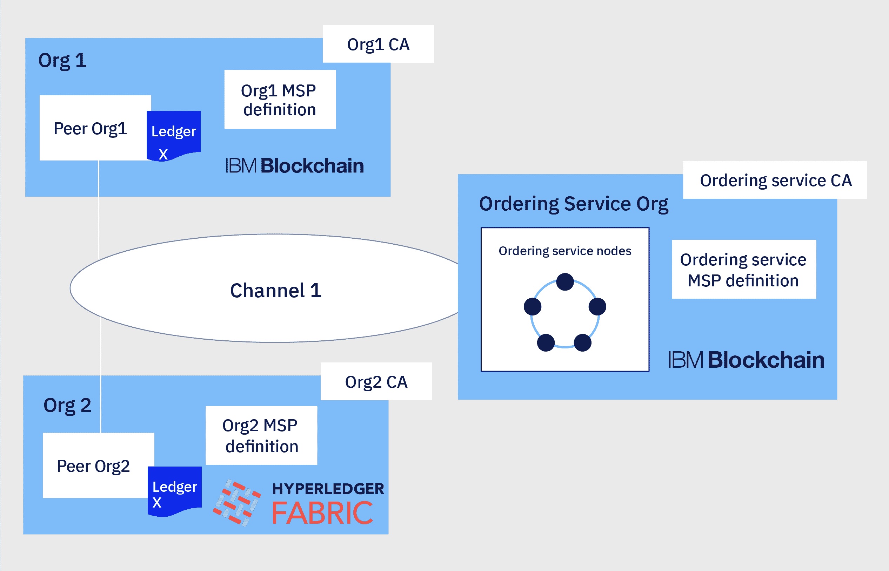
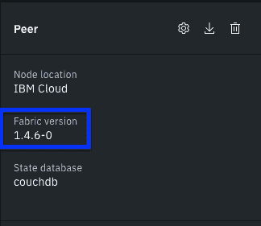
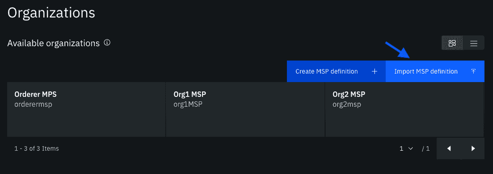
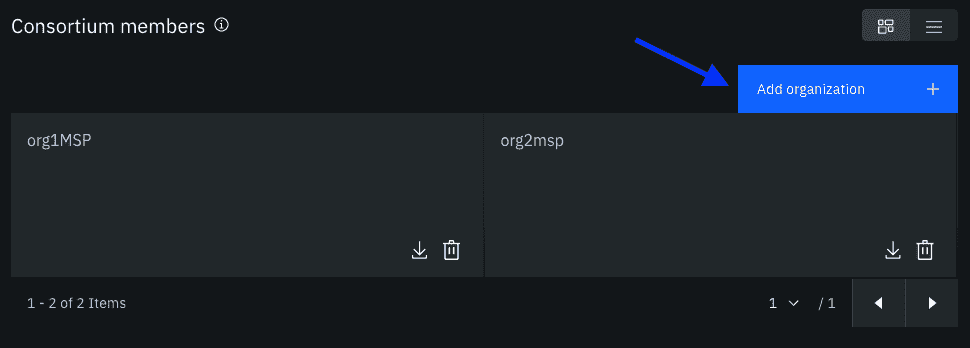
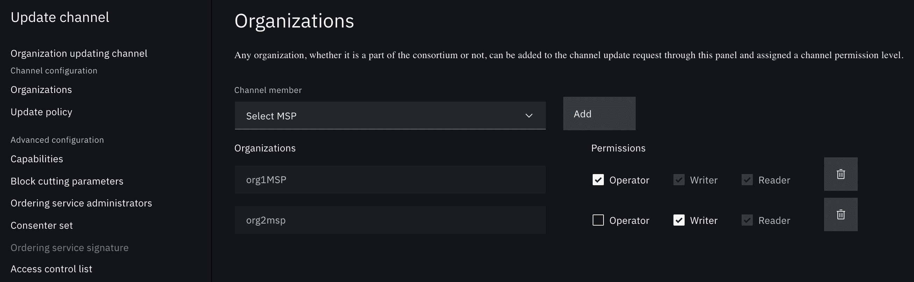
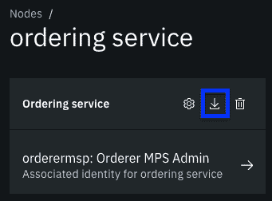

# 将 Fabric 同级加入 IBM Blockchain Platform 上的通道

> 原文：[`developer.ibm.com/zh/tutorials/join-a-fabric-peer-to-a-channel-on-the-ibm-blockchain-platform/`](https://developer.ibm.com/zh/tutorials/join-a-fabric-peer-to-a-channel-on-the-ibm-blockchain-platform/)

本教程是关于如何将 IBM Blockchain Platform 上部署的节点与其他 Hyperledger Fabric 网络连接的一系列教程中的第二篇。[第一篇教程](https://developer.ibm.com/zh/tutorials/hyperledger-fabric-and-ibm-blockchain-peer-interoperability/)介绍了如何将 IBM Blockchain Platform 上的同级加入到使用开源 Hyperledger Fabric 创建的通道。本教程介绍了如何完成相反的任务：将 Hyperledger Fabric 同级加入在 IBM Blockchain Platform 上创建的通道。IBM Blockchain Platform 上的组织可以将其他 Hyperledger Fabric 同级添加到其通道中，并允许平台外的组织参与资产转移和交易背书过程。

因为我们将使用开源工具将同级加入通道，所以已使用由另一云提供商部署的开源 Hyperledger Fabric 或 Hyperledger Fabric 网络部署同级的组织也可以使用本教程中的说明。基本假设是网络中的所有节点均基于 Linux 基金会 Hyperledger Fabric 项目提供的未作更改的代码。

我们将假设 IBM Blockchain Platform 上的网络由一个排序服务和一组同级组织构成，其中的排序服务由单个排序组织操作，而同级组织则至少部署了一个通道。同级组织希望将一个组织添加到使用开源 Hyperledger Fabric 部署了其同级的通道。


**注**：本教程中的步骤介绍了如何将由 Org2 运行的 Hyperledger Fabric 同级加入由 Org1 和 IBM Blockchain Platform 上的排序服务组织创建的通道。

IBM Blockchain Platform 上的排序者组织和同级组织可以使用其控制台将新组织添加到该通道。然后，Hyperledger Fabric 同级组织可以使用 Hyperledger Fabric 工具加入该通道。本教程演示了每个组织都需要完成的步骤：

*   **Fabric 同级组织**：创建 MSP JSON 文件
*   **IBM Blockchain Platform 上的组织**：导入 Hyperledger Fabric 组织的 MSP JSON 文件
*   **IBM Blockchain Platform 排序者组织**：将 Hyperledger Fabric 组织添加到联盟
*   **IBM Blockchain Platform 同级组织**：将 Hyperledger Fabric 组织添加到通道中
*   **IBM Blockchain Platform 排序者组织**：导出排序服务 JSON 文件
*   **Hyperledger Fabric 同级组织**：设置 Hyperledger Fabric 工具
*   **Hyperledger Fabric 同级组织**：将您的同级加入通道中

如果您正在运行分布式 Hyperledger Fabric 网络，则需要参与该过程的所有组织均可使用本教程，每个组织按照各自相关步骤进行操作。如果您正在使用本教程进行开发和培训，则还可以自行遍历每个步骤来测试过程。

## 注意事项

使用 Hyperledger Fabric 工具管理节点比使用 IBM Blockchain 控制台管理节点要难得多。本主题适用于经验丰富的 Hyperledger Fabric 用户。

## 前提条件

*   现有的 IBM Blockchain Platform 网络，其中包括排序服务和至少一个应用程序通道。如果您尚未部署 IBM Blockchain Platform 网络，并且正在按照本教程进行开发或测试，可以完成此[构建网络教程](https://cloud.ibm.com/docs/blockchain?topic=blockchain-ibp-console-build-network)来创建一个包含单节点排序服务、同级组织和一个通道的网络。

*使用开源 Hyperledger Fabric 二进制文件或其他云提供商部署了至少一个 Hyperledger Fabric 同级的组织。

*   为避免兼容性问题，建议在两个网络上使用相同版本的 Hyperledger Fabric。您可以使用控制台在 IBM Blockchain Platform 上找到您的节点的 Hyperledger Fabric 版本。在您要加入 Hyperledger Fabric 通道的同级节点左上角中查看：

    

*   Hyperledger Fabric 组织已经安装了 [Hyperledger Fabric 必备软件](https://hyperledger-fabric.readthedocs.io/en/release-1.4/prereqs.html)。

*   安装 [jq 工具](https://stedolan.github.io/jq/)。

*   IBM Blockchain Platform 提供两种产品，一种用于 IBM Cloud，另一种用于在开源的 Kubernetes、Openshift Container Platform 和 IBM Cloud Private 上部署区块链组件。本教程中的说明同时适用于这两种产品。

## 限制

*   **支持：**IBM 不支持开源的 Hyperledger Fabric 组件，即使这些组件连接到了 IBM Blockchain Platform 网络。如果您要运行您自己的 Hyperledger Fabric 网络并且希望获取 IBM 的支持，则需要购买 [IBM Blockchain Platform 镜像](https://cloud.ibm.com/docs/blockchain-sw-213?topic=blockchain-sw-213-blockchain-images)产品。

*   **节点管理：**控制台若要与 Hyperledger Fabric 节点通信，就需要使用由 IBM Blockchain Platform 提供的 gRPC Web 代理。由于开源 Hyperledger Fabric 中不含 gRPC Web 代理，因此您需要使用开源 Hyperledger Fabric 工具来管理节点。您需要使用 Hyperledger Fabric 工具而非控制台来完成以下操作：

    *   跟踪节点和组织：用户必须跟踪其他成员的节点和组织。

    *   签名管理：IBM Blockchain 控制台会收集提交通道更新请求所需的签名。如果使用 Hyperledger Fabric，就需要了解通道策略需要哪些组织来签署通道更新。管理员需要通过电子邮件或其他手动过程，与带外的通道管理员协调通道配置更新工件的共享和签名情况。

在本教程中，您使用 IBM Blockchain 控制台将新的同级组织添加到通道中。但是，如果没有 gRPC Web 代理，就无法使用控制台来操作 Hyperledger Fabric 同级。同级组织需要使用 Hyperledger Fabric 工具来操作同级。

1

## 创建 MSP JSON 文件

IBM Blockchain Platform 的每个成员都有一个组织 MSP 定义。MSP 定义是一个 JSON 文件，其中包含 Hyperledger Fabric 节点用于标识组织信任根的证书。要加入在 IBM Blockchain Platform 上创建的通道，最简单的方法就是使用 Hyperledger Fabric 网络中的证书来创建 MSP JSON 文件。然后，平台上的组织可以将文件导入其控制台，并使用该控制台将您的组织添加到通道中。

Hyperledger Fabric 使用 MSP 文件夹结构来定义用户、节点和组织。查找用于创建组织通道 MSP 的 MSP 文件夹。使用 tree 命令检查组织 MSP 时，应看到类似如下的结构：

```
msp
├── admincerts
│   └── cert.pem
├── cacerts
│   └── cacert.pem
├── config.yaml
├── keystore
│   └── key.pem
├── signcerts
│   └── cert.pem
└── tlscacerts
    └── tlscacert.pem 
```

虽然您的 MSP 可能并不具有所有这些文件夹，但是创建 MSP JSON 文件需要以下文件夹：

*   **cacerts**：包含组织 CA 的根证书，并定义组织的信任根。

*   **tlscacerts**：包含 TLS CA 的根证书。

*   **admincerts**：如果您的网络未启用节点 OU，则 `admincerts` 文件夹需要包含组织管理员的签名证书。

将以下 JSON 文件保存在与 MSP 文件夹相同的目录中。该文件用于在 IBM Blockchain Platform 上定义您的组织。

```
{
    "display_name": "Org1 MSP",
    "msp_id": "<MSP ID>",
    "type": "msp",
    "admins": [
        "<admin_certs_base64>"
    ],
    "root_certs": [
        "<ca_root_base64>"
    ],
    "tls_root_certs": [
        "<tls_root_base64>"
    ],
    "fabric_node_ous": {
        "admin_ou_identifier": {
            "certificate": "<ca_root_base64>",
            "organizational_unit_identifier": "admin"
        },
        "client_ou_identifier": {
            "certificate": "<ca_root_base64>",
            "organizational_unit_identifier": "client"
        },
        "enable": true,
        "orderer_ou_identifier": {
            "certificate": "<ca_root_base64>",
            "organizational_unit_identifier": "orderer"
        },
        "peer_ou_identifier": {
            "certificate": "<ca_root_base64>",
            "organizational_unit_identifier": "peer"
        }
    },
    "host_url": "url.com"
} 
```

将 `<MSP ID>` 替换为您组织的 MSP ID。要将文件导入控制台，就必须使用 `"host_url"` 字段，但是该字段的值仅用于 IBM Blockchain Platform 上的组织。要完成 MSP 文件，您需要将证书从 MSP 文件夹传输到 JSON 文件中。虽然 Hyperledger Fabric 使用的证书必须采用 `pem` 格式，但是上传到 IBM Blockchain Platform 的证书需要采用 `base64` 格式进行编码。

1.  运行以下命令，将您的 CA 根证书转换为 base64 格式：

    ```
    export FLAG=$(if [ "$(uname -s)" == "Linux" ]; then echo "-w 0"; else echo "-b 0"; fi)
    cat msp/cacerts/* | base64 $FLAG 
    ```

    使用命令的输出替换 `<ca_root_base64>`。

2.  使用以下命令对您的 TLS CA 的根证书进行 base64 编码：

    ```
     cat msp/tlscacerts/* | base64 $FLAG 
    ```

    使用命令的输出替换 `<tls_root_base64>`。

3.  如果您的 MSP 中有一个 `admincerts` 文件夹，可以使用以下命令对管理员证书进行编码。如果您有多个组织管理员，则可以修改此命令：

    ```
    cat msp/admincerts/* | base64 $FLAG 
    ```

    使用命令的输出替换 `<admin_certs_base64>`。如果您为网络启用了节点 OU，无需提供管理员证书即可替换 `<admin_certs_base64>`。如果您未启用节点 OU，那么从文件中删除 `"fabric_node_ous"` 部分。

完成组织 MSP JSON 文件后，可以将该文件发送给 IBM Blockchain Platform 上的排序服务管理员和同级组织。

2

## 导入 Hyperledger Fabric 组织 MSP

您可以使用 Hyperledger Fabric 组织发送给您的组织 MSP JSON 文件，将新组织导入到 IBM Blockchain 控制台中。如果您是排序服务或通道的管理员，则应将此文件导入控制台中。



登录到控制台，并导航至 **Organizations** 选项卡。然后，您可以使用 **Import MSP definition** 按钮将文件导入控制台中。

3

## 将 Hyperledger Fabric 组织添加到联盟中

为了加入在 IBM Blockchain Platform 上创建的通道，需要将 Hyperledger Fabric 组织添加到由排序服务托管的同级组织的联盟中。排序服务的管理员需要将新组织添加到联盟中。



登录到您的 IBM Blockchain 控制台。导航到 **Nodes** 选项卡，然后转到排序服务的概述页面。向下滚动到排序服务管理员集合下的联盟成员列表。您可以使用 **Add organization** 按钮将 Hyperledger Fabric 组织添加到联盟成员列表中。

4

## 将 Hyperledger Fabric 组织添加到通道中

将组织 MSP 文件导入控制台后，可以使用控制台将新组织添加到通道中。



登录到控制台，然后导航至 **Channel** 选项卡。打开要将新组织添加到的通道，然后单击通道名称下的 **Settings**。在 **Update Channel** 流中，使用 **Organizations** 选项卡选择 Hyperledger Fabric 组织的 MSP，并将其添加为通道成员。您可以将新组织添加为通道阅读者、编写者或操作者：

*   **阅读者**只能查询通道账本。

*   **编写者**可以通过调用智能合约来更新账本。编写者还可以在通道上实例化智能合约。

*   **操作者**相当于成为 Hyperledger Fabric 通道的管理员。通道操作者有权创建和签署通道更新。

您可以使用 Policies 页面将 Hyperledger Fabric 组织添加到需要批准通道更新的通道成员集中。须注意，IBM Blockchain 控制台使用的[通道更新过程](https://cloud.ibm.com/docs/services/blockchain?topic=blockchain-ibp-console-govern#ibp-console-govern-update-channel)不能与开源 Hyperledger Fabric 工具互换。因此，如果要添加 Hyperledger Fabric 组织，通道成员具有两个选项：

*   使新组织成为通道的编写者或阅读者。然后，通道成员可以继续使用控制台来创建和签署通道更新。

*   使 Hyperledger Fabric 组织成为通道操作者，并将其添加到通道更新策略中。如果选择此选项，每个通道管理员（包括 IBM Blockchain Platform 上的同级组织）都需要使用 Hyperledger Fabric 工具来创建和签署通道更新。有关如何使用 Hyperledger Fabric 工具更新通道的更多信息，可参阅 Hyperledger Fabric 文档中的[更新通道配置](https://hyperledger-fabric.readthedocs.io/en/release-1.4/config_update.html)教程。

如果您的网络成员不熟悉如何使用 Hyperledger Fabric 工具，建议让未使用 IBM Blockchain Platform 的所有组织成为该通道的编写者或阅读者，并继续使用控制台进行任何通道更新。

5

## 导出排序服务信息

要连接到通道， Hyperledger Fabric 组织需要来自其中一个排序服务节点的端点 URL 和 TLS 证书。要向新组织提供此信息，最简单的方法就是从控制台中导出排序服务 JSON 文件。



登录到控制台，然后从 **Nodes** 选项卡导航到您的排序服务。您可以使用排序服务名称下的 **Export** 按钮将 JSON 文件下载到文件系统上。然后，您可以采用带外操作通过电子邮件或其他手动共享文件的方式，将该文件发送给新的 Hyperledger Fabric 同级组织。

6

## 设置 Hyperledger Fabric 工具

因为 Hyperledger Fabric 同级没有用来与 IBM Blockchain 控制台进行通信的 gRPC Web 代理，所以新组织需要使用 Hyperledger Fabric 工具将同级加入通道。如果本地计算机上还没有 Hyperledger Fabric CLI 二进制文件，则可以按照以下说明在您选择的计算机上下载二进制文件。为简单起见，我们使用在此步骤中创建的环境将您的同级加入通道并设置锚点同级。各组织还可以在其集群上部署 Hyperledger Fabric 工具容器，并从容器内部按照本教程中的步骤进行操作。

创建一个新目录来存储 Hyperledger Fabric 二进制文件。您还可以使用此目录存储所有 MSP 材料以及用于完成本教程的工件。使用以下命令创建新目录，然后导航到该新目录：

```
mkdir interop
cd interop 
```

[Hyperledger Fabric 文档](https://hyperledger-fabric.readthedocs.io/en/release-1.4/install.html)提供了可以用来下载库的命令。为方便起见，我们在本教程中为您提供了此命令。需要先[安装 cURL](https://hyperledger-fabric.readthedocs.io/en/release-1.4/prereqs.html#install-curl)。然后您可以从 `interop` 目录中运行以下命令：

```
curl -sSL https://bit.ly/2ysbOFE | bash -s -- 1.4.6 -d -s 
```

cURL 命令会在 `interop` 目录中创建的 `bin` 文件夹中安装二进制文件。它还会下载 `config` 目录，其中包含使用 `peer` CLI 所需的配置文件。

设置以下环境变量，将 ~bin~ 文件夹中的二进制文件添加到路径中，并将 ~FABRIC_CFG_PATH~ 设置为配置文件：

```
export PATH=${PWD}/bin:${PWD}:$PATH
export FABRIC_CFG_PATH=${PWD}/config/ 
```

您可以运行 `peer version` 命令来确认二进制文件已下载并成功添加到路径中。此命令还确认您正在使用与 Hyperledger Fabric 网络相同的版本。

```
Usage:
  peer [command]

Available Commands:
  chaincode   Operate a chaincode: install|instantiate|invoke|package|query|signpackage|upgrade|list.
  channel     Operate a channel: create|fetch|join|list|update|signconfigtx|getinfo.
  help        Help about any command
  logging     Logging configuration: getlevel|setlevel|getlogspec|setlogspec|revertlevels.
  node        Operate a peer node: start|status|reset|rollback.
  version     Print fabric peer version.

Flags:
  -h, --help   help for peer

Use "peer [command] --help" for more information about a command. 
```

7

## 将您的同级加入通道

将组织添加到 IBM Blockchain Platform 上的应用程序通道后，可以使用 Hyperledger Fabric 工具将您的同级加入到通道中。要使用 `peer` CLI 二进制文件与同级建立连接，就需要使用组织管理员的 MSP 文件夹以及同级节点的 TLS 证书。在 `interop` 目录中运行以下命令，为 MSP 文件夹和 TLS 证书创建一个新文件夹。

```
mkdir admin
mkdir -p peer/tls 
```

将同级节点的 TLS 证书移动到 `peer/tls` 文件夹中。将组织管理员身份的 MSP 文件夹移动到 `admin` 目录中。该身份需要具有从排序服务中获取区块的权限，以及与同级进行交互的权限。组织管理员的 MSP 文件夹可以与用于创建组织 MSP JSON 文件的 MSP 文件夹相同，但是不一定取决于您的网络设置。该文件夹需要包含管理员身份的私钥。

您还需要 IBM Blockchain Platform 上排序节点的终端 URL 和 TLS 证书，才能获取通道配置。创建一个可用于存储排序者 TLS 证书的文件夹：

```
mkdir orderer 
```

切换到 `orderer` 目录。将从 IBM Blockchain Platform 导出的排序服务 JSON 文件复制到此文件夹中。重命名 `orderer.json` 文件，使其更便于使用。可以从排序者文件中获取排序者 URL 和 TLS 证书：

1.  运行以下命令，从 base64 格式解码排序者 TLS 证书，并将其转换为 PEM 格式：

    ```
    export FLAG=$(if [ "$(uname -s)" == "Linux" ]; then echo "-w 0"; else echo "-b 0"; fi)
    cat orderer.json | jq --raw-output '.[0].pem' | base64 --decode $FLAG > tls.pem 
    ```

2.  可以使用以下命令来打印排序节点 URL：

    ```
    cat orderer.json | jq --raw-output '.[0].api_url' | sed 's~grpcs*://~~g' 
    ```

您需要使用与每个排序节点 URL 关联的 TLS 证书。这些命令用于在 `orderer.json` 文件中检索第一个排序节点的 TLS 证书和 URL。如果您具有多节点排序服务，并且希望使用命令来定位特定节点，可以在上面的命令中更新 `[0]` 以引用文件中的另一个节点。

现在，我们拥有了将您的同级加入通道所需的信息。设置以下环境变量以操作 `peer` CLI。重新导航到 `interop` 文件夹，然后设置以下环境变量：

```
export CORE_PEER_TLS_ENABLED=true
export CORE_PEER_LOCALMSPID="<IBP_MSP_ID>"
export CORE_PEER_TLS_ROOTCERT_FILE=${PWD}/peer/tls/<tls_cert>.pem
export CORE_PEER_MSPCONFIGPATH=${PWD}/admin/msp
export CORE_PEER_ADDRESS=<peer_address> 
```

*   将 `<IBP_MSP_ID>` 替换为您的组织的 MSP ID。
*   将 `<peer_address>` 替换为您要加入通道的同级的 URL。
*   将 `<tls_cert>.pem` 替换为您的同级 TLS 证书的名称。

要加入通道，您需要从 IBM Blockchain Platform 上的排序服务中获取通道创始块，然后将创始块提供给您的同级。您的同级随后从排序服务中检索通道中的其他块。

您可以使用 `peer channel fetch` 命令来检索通道创始块。将 `<orderer_address>` 替换为从 `orderer.json` 文件返回的值。将 `<channel_name>` 替换为您要加入的应用程序通道的名称。`--cafile` 标志需要指向排序节点的 TLS 证书的位置。

```
peer channel fetch 0 genesis.block -c <channel_name> -o <orderer_address> --tls --cafile ${PWD}/orderer/tls.pem 
```

该命令会以 `genesis.block` 文件形式返回通道创始块。现在，您可以通过将此块传递给 `peer channel join` 命令，将同级加入通道。

```
peer channel join -b genesis.block 
```

如果您要将多个同级加入到通道中，则需要为每个同级设置运行的 `CORE_PEER_ADDRESS` 和 `CORE_PEER_TLS_ROOTCERT_FILE`。

8

## 设置锚点同级

将同级加入通道之后，您需要选择一个同级成为锚点同级。锚点同级使用 gossip 引导与通道上其他同级的通信。通过锚点同级，您可以利用重要的 Hyperledger Fabric 功能，例如服务发现和私有数据。

您需要通过更新通道配置来选择锚点同级。因为我们将按照[更新通道配置](https://hyperledger-fabric.readthedocs.io/en/release-2.0/config_update.html)教程中概述的步骤进行操作，所以我们将快速完成这些步骤，而不提供太多背景信息。我们假设在您将同级加入通道时，仍然设置了环境变量。

我们使用 `peer channel fetch` 命令来获取最新的通道配置。将 `<channel_name>` 替换为通道名称：

```
peer channel fetch config config_block.pb -o <orderer_address> -c <channel_name> --tls ${PWD}/orderer/tls.pem 
```

然后，您可以解码并复制配置块：

```
configtxlator proto_decode --input config_block.pb --type common.Block --output config_block.json
jq .data.data[0].payload.data.config config_block.json > config.json
cp config.json config_copy.json 
```

可以使用 `jq` 将锚点同级添加到通道配置中。将 `<peer_url>` 和 `<peer_port>` 分别替换为您希望成为锚点同级的同级 URL 和端口。将 `<MSP_ID>` 替换为您的 MSP ID 的值：

```
jq '.channel_group.groups.Application.groups.<MSP_ID>.values += {"AnchorPeers":{"mod_policy": "Admins","value":{"anchor_peers": [{"host": "<peer_url>","port": <peer_port>}]},"version": "0"}}' config_copy.json > modified_config.json 
```

现在，我们已经更新了通道配置，我们可以将原始和修改后的通道配置都转换回 protobuf 格式，并计算它们之间的差异。将 `<channel_name>` 替换为应用程序通道的名称，然后运行以下命令：

```
configtxlator proto_encode --input config.json --type common.Config --output config.pb
configtxlator proto_encode --input modified_config.json --type common.Config --output modified_config.pb
configtxlator compute_update --channel_id <channel_name> --original config.pb --updated modified_config.pb --output config_update.pb 
```

名为 `channel_update.pb` 的新 protobuf 包含需要应用于通道配置的锚点同级更新。现在，我们可以创建最终配置更新，用于更新通道：

```
configtxlator proto_decode --input config_update.pb --type common.ConfigUpdate --output config_update.json
echo '{"payload":{"header":{"channel_header":{"channel_id":"<channel_name>", "type":2}},"data":{"config_update":'$(cat config_update.json)'}}}' | jq .> config_update_in_envelope.json
configtxlator proto_encode --input config_update_in_envelope.json --type common.Envelope --output config_update_in_envelope.pb 
```

现在，您可以通过将更新提交到通道来更新锚点同级。因为此更新仅影响您的组织，所以该更新不需要由该通道的其他成员签名。`--cafile` 标志需要指向排序节点的 TLS 证书的位置：

```
peer channel update -f config_update_in_envelope.pb -c <channel_name> -o <orderer_address> --tls --cafile ${PWD}/orderer/tls.pem 
```

## 后续步骤

加入应用程序通道后，您可以开始与 IBM Blockchain Platform 上的组织进行交易。如果尚未更新应用程序以利用服务发现的优势，就需要获取加入通道的同级的终端信息，并更新您的连接配置文件。要获取此信息，可让 IBM Blockchain Platform 上的同级组织从其控制台中导出同级节点 JSON 文件，并采用带外方式发送给您。

虽然您可以使用任何 Hyperledger Fabric 同级参与 IBM Blockchain Platform 上的通道，但是 IBM Blockchain 控制台使用的[通道更新过程](https://cloud.ibm.com/docs/services/blockchain?topic=blockchain-ibp-console-govern#ibp-console-govern-update-channel)不能与 Hyperledger Fabric 工具互换。因此，如果需要 Hyperledger Fabric 组织批准通道的更新，则所有通道管理员都需要使用 Hyperledger Fabric 工具来创建和签署通道配置的任何更新。有关如何使用 Hyperledger Fabric 工具更新通道的更多信息，可参阅 Hyperledger Fabric 文档中的[更新通道配置](https://hyperledger-fabric.readthedocs.io/en/release-1.4/config_update.html)教程。

使用开源工具对通道配置进行的某些更新，可能并不会显示在 IBM Blockchain 控制台中。

本文翻译自：[Join a Fabric peer to a channel on the IBM Blockchain Platform](https://developer.ibm.com/tutorials/join-a-fabric-peer-to-a-channel-on-the-ibm-blockchain-platform/)（2020-06-09）