# 使用 OpenShift secrets 轻松、安全地将数据库连接到应用程序

> 原文：[`developer.ibm.com/zh/tutorials/deploy-flask-app-to-openshift-db2-secret/`](https://developer.ibm.com/zh/tutorials/deploy-flask-app-to-openshift-db2-secret/)

如今的应用程序是通过多种不同源代码并在众多组件中构建的。因此，微服务的概念很重要：您可以按照不同的小片段（容器）构建应用程序，然后借助某种能够简单编排流程的工具，确保所有任务都按正确的顺序进行。

将数据库连接到您的应用程序或网站可能相当麻烦，特别是在不断变化的情况下。如果您可以在不同的数据库和工作环境（如开发、测试和部署）之间无缝切换，事情会容易得多。您需要一种简单而又安全的方法来做到这一点，通过 OpenShift secrets，您可以在几秒钟内创建与数据库的连接，同时确保凭证的隐私。

RedHat 的 OpenShift 已经成为一个领先的混合云、企业 Kubernetes 应用程序平台，可以帮助容器化、部署和监控您的应用程序。它是一种自我管理平台，提供了类似云的体验，可以在各个混合云环境之间自动进行软件更新和生命周期管理。

本教程展示了可以使用 OpenShift secrets 非常简单地部署应用程序并将其安全地连接到其他位置的数据库，在这个过程中凭证是进行加密的，但仍可供我们的应用程序轻松访问。OpenShift 会自动检测您的框架，并在几分钟内容器化、部署和管理您的应用程序。您将了解如何将 [Flask](https://flask.palletsprojects.com) 应用部署到 OpenShift，并使用 secrets 连接到 Db2 数据库。

## 前提条件

要完成本教程，您应该具有以下环境：

*   一个有效的 IBM Cloud 帐户。如果没有，请在 [IBM Cloud](https://cocl.us/IBM_CLOUD_GCG) 上创建一个帐户。
*   一个已经置备的 OpenShift 4.2 集群。您可以在[此处](https://cloud.ibm.com/kubernetes/landing?platformType=openshift&cm_sp=ibmdev-_-developer-tutorials-_-cloudreg)置备您的集群。
*   OpenShift 命令行界面 (CLI)。在[此处](https://cloud.ibm.com/docs/openshift?topic=openshift-openshift-cli)进行下载。

## 预估时间

完成本教程大约需要 45 分钟。

## 步骤

1.  在 IBM Cloud 上创建一个 Db2 数据库

    *   单击 **Catalog**，然后从左侧导航面板中选择服务。
    *   选中数据库复选框，然后选择 Db2。
    *   创建 Db2 数据库的 Lite 套餐实例，更改位置，并根据需要命名。
    *   单击 **Create**

        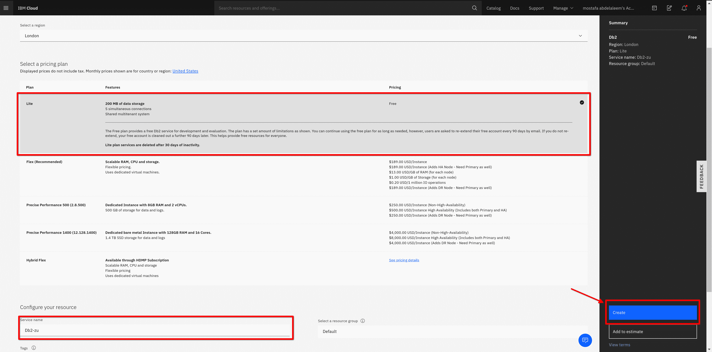

2.  创建 Db2 数据库的凭证。

    *   单击 **Service credentials** 和 **New credentials**。
    *   展开您创建的凭证并记下数据库 URI。

        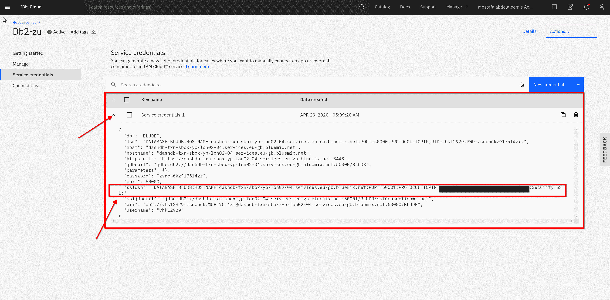

    *   可选：打开控制台以跟踪数据库中的更改。

3.  创建 OpenShift 项目。

    *   从终端登录到 OpenShift 客户端 (`oc`) 集群并创建一个新项目：

        ```
        oc new-project flask-db-project 
        ```

    *   或者，从 OpenShift 客户端 Web 控制台中，切换到开发者模式以显示面向开发者的视图，并创建一个项目：

        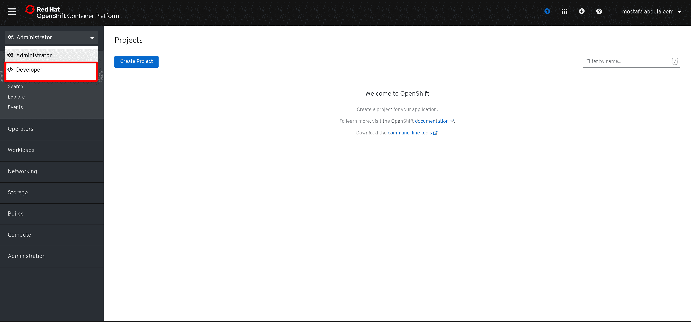

4.  创建 OpenShift secret。

    *   从终端创建要存储的机密，并对数据库凭证进行加密，以便之后使用环境变量来访问 secret。确保 secret 名称和密钥是 `dbcred`，因为应用程序通过密钥名称访问环境变量。

        ```
        oc create secret generic dbcred --from-literal=dbcred="your Db2 ssldsn value" 
        ```

        例如，您可以键入 `oc create secret generic dbced --from-literal=dbcre="DATABASE=*;HOSTNAME=*;PORT=50001;PROTOCOL=TCPIP;UID=*;PWD=*;"`

    *   或者，从 Web 控制台中，转至高级下面的搜索，并过滤服务以找出 secret。然后创建一个密钥值 secret：

        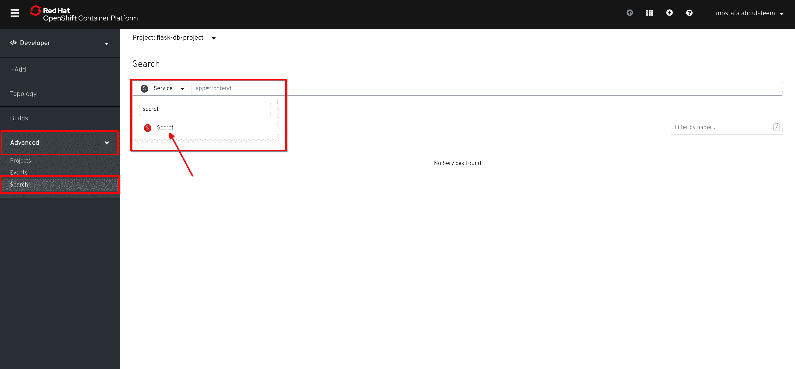

5.  部署 Flask 应用并将其连接到 Db2 数据库。

    *   通过单击 **Add**，然后选择 **From Catalog** 来创建应用。

        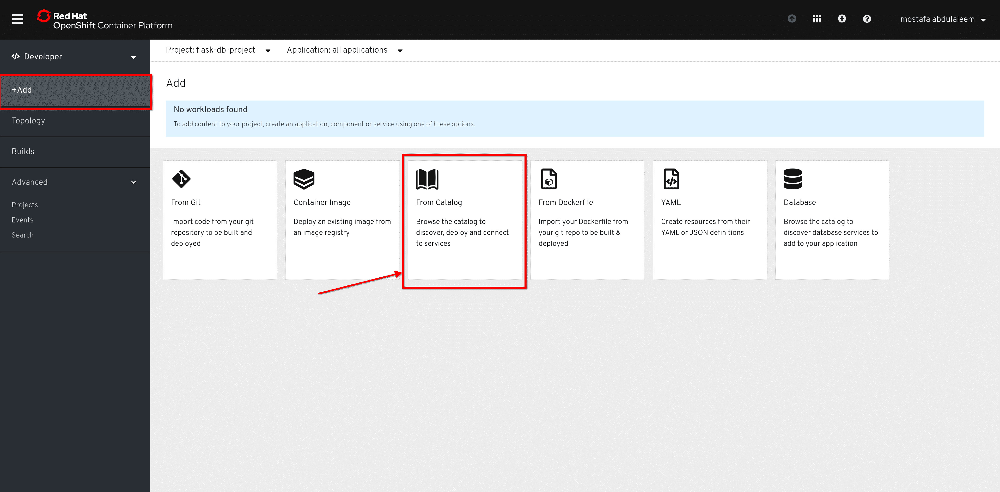

    *   选择 **Languages**，然后单击 **Python**。选择 Python 应用，然后单击 **Create application**。

        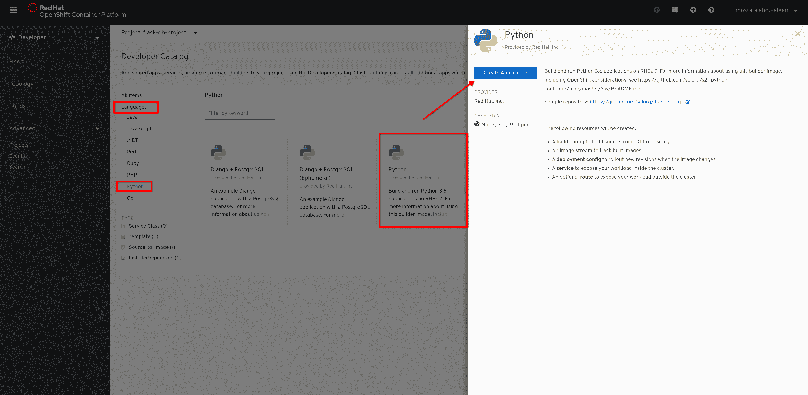

    *   在其字段中添加 GitHub 代码库 URL `https://github.com/mostafa3m/Flask-db-oc.git`，单击 **Show Advanced Option**，然后在 **Context Dir** 字段中添加 `/flask-app`。为您的应用选择名称，然后单击 **Deployment Configuration**。

        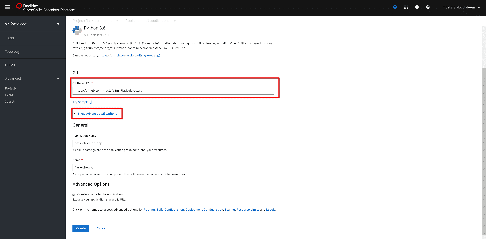

    *   在 **Deployment Configuration** 下，单击 **Add from config map or secret** 并添加您的 secret 值。

    *   在名称中添加 `dbcred`，然后选择 `dbcred` 资源和 `dbcred` 密钥。
    *   删除空白环境变量，然后单击 **Create**。

        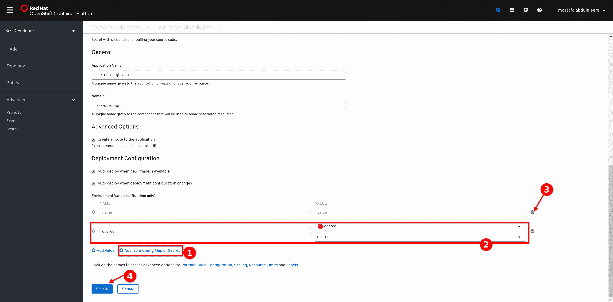

6.  监控构建和部署过程。

    *   可以监控构建过程和部署过程，直到它们完成。
    *   还要注意应用路径，这是一个 URL：

        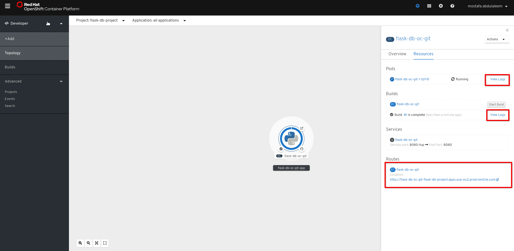

7.  验证应用是否能够正常运作并连接到 Db2 数据库。

    可选：如有必要，请记得打开 Db2 控制台以监控更改。请注意，Db2 Lite 套餐为您提供了一个可在其中创建表的模式，它与您在服务凭证中的用户同名，因此请留意其中的更改。

    等待应用完全部署，然后点击路径部分中的应用程序 URL 来尝试该应用。

    应用有四个 URL：

    *   主要 URL：*应用公开的路径* 它显示应用程序是在线的，并且还在 Db2 数据库中创建了一个名为 values 的表。

    *   插入名称 URL：*应用公开的路径*`/insertname` 此 URL 在您在 Db2 数据库上创建的表中插入一个名称。

        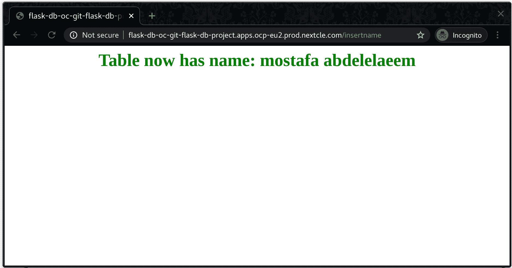

    *   表内容 URl：*应用公开的路径*`/db2`
        此 URL 显示 values 表中的数据。

    *   删除表 URl：*应用公开的路径*`/deletetable`
        此 URL 从 Db2 数据库中删除 values 表。

        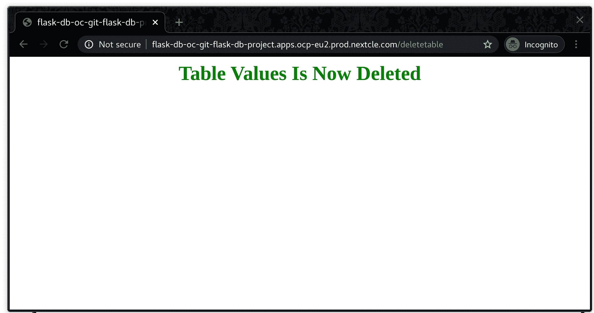

## 结束语

在本教程中，您看到了只需几分钟，就可非常轻松地部署应用程序并将其连接到 IBM Cloud 上的 Db2 数据库。OpenShift 识别、容器化、构建并部署了您的应用程序。

现在您已经知道了如何使用不同的源代码构建应用程序，并将其安全地连接到其他服务。有了 OpenShift secrets，您完全无需担心敏感数据会被泄露（本示例中为 Db2 凭证）。

在 [OpenShift 学习门户网站](https://learn.openshift.com/)中深入学习 Red Hat OpenShift，或者在 [OpenShift 入门](https://www.openshift.com/try)中进行试用。要深入学习 OpenShift on IBM Cloud，请参阅 [IBM Developer 上的 Red Hat OpenShift on IBM Cloud 页面](https://developer.ibm.com/zh/components/redhat-openshift-ibm-cloud/)。

本文翻译自：[Connect databases to your app easily and securely with OpenShift secrets](https://developer.ibm.com/tutorials/deploy-flask-app-to-openshift-db2-secret/)（2020-05-18）