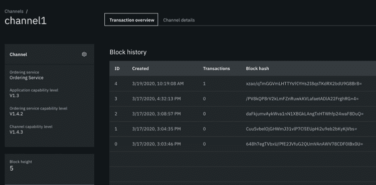

# 将 IBM Blockchain Platform 连接到 Hyperledger Fabric 组件

> 原文：[`developer.ibm.com/zh/tutorials/hyperledger-fabric-and-ibm-blockchain-peer-interoperability/`](https://developer.ibm.com/zh/tutorials/hyperledger-fabric-and-ibm-blockchain-peer-interoperability/)

## 连接 IBM Blockchain Platform 和 Hyperledger Fabric 组件

区块链网络需要许多不同的组织一起工作，并且网络成员经常使用不同的云平台来托管其数据和应用程序。IBM Blockchain Platform 提供了跨多个云部署和连接组件的功能。但是，组织可能希望从使用开源 Hyperledger Fabric 或其他服务提供商部署的节点加入 IBM Blockchain Platform 网络。IBM Blockchain Platform 平台的核心原则之一是不修改 Hyperledger Fabric 的核心组件即可保持互操作性。使用 IBM Blockchain Platform 部署和操作其区块链节点的客户仍可以连接到其他 Fabric 网络。

本教程是关于如何使用 Hyperledger Fabric 提供的工具将使用 IBM Blockchain Platform 部署的节点与其他网络连接的一系列主题中的第一篇。因为我们使用的是开源工具，所以您可以按照本教程中的说明将 IBM Blockchain Platform 同级连接到使用开源 Hyperledger Fabric 部署的网络，或者由其他云提供商部署的 Hyperledger Fabric 网络。基本假设是网络中的所有节点均基于 Linux 基金会 Hyperledger Fabric 项目提供的未作更改的代码。

## 从 IBM Blockchain Platform 加入 Hyperledger Fabric 网络

在 IBM Blockchain Platform 上部署了同级的组织可以参与使用其他 Hyperledger Fabric 网络创建的通道。本教程介绍了将同级组织添加到由 Hyperledger Fabric 排序服务和 Hyperledger Fabric 通道托管的系统通道所需的步骤。完成这些步骤后，IBM Blockchain Platform 上的同级组织可以查询数据并对现有通道上的交易进行背书，然后加入网络上创建的任何新通道。

我们将假设 Hyperledger Fabric 网络由单个排序组织运作的排序服务和单独同级组织部署的同级所组成。IBM Blockchain Platform 上的组织包含一个已部署了同级但不操作任何排序节点的组织。


本教程中的步骤介绍了如何将由 Org2 在 IBM Blockchain Platform 上运行的同级加入由 Org1 和排序服务组织创建的通道。同级 Org1 和排序服务节点都是使用开源 Hyperledger Fabric 部署的。

要将 IBM Blockchain 组织添加到 Hyperledger Fabric 网络，Hyperledger Fabric 网络的排序者组织和同级组织都需要采取操作。同级组织 IBM Blockchain Platform 还需要使用 Hyperledger Fabric 工具来完成该过程。本教程演示了每个组织都需要完成的步骤：

*   **IBM Blockchain Platform 同级组织：**从 IBM Blockchain Platform 控制台中导出您的组织 MSP 定义
*   **所有组织：**设置 Hyperledger Fabric 工具
*   **Hyperledger Fabric 排序者组织：**将新组织添加到系统通道
*   **Hyperledger Fabric 同级组织：**将新组织添加到应用程序通道
*   **IBM Blockchain Platform 同级组织：**将您的同级加入通道中

如果您正在运行分布式 Hyperledger Fabric 网络，则该过程中涉及的所有组织均可使用本教程，每个组织按照各自相关步骤进行操作。如果您正在使用本教程进行开发和培训，则还可以自行遍历每个步骤来测试过程。

## 注意事项

使用 Hyperledger Fabric 工具管理节点比使用 IBM Blockchain 控制台管理节点要难得多。本主题适用于经验丰富的 Hyperledger Fabric 用户。

## 前提条件

*   现有的 Hyperledger Fabric 网络，其中包括排序服务和至少一个应用程序通道。
*   IBM Blockchain Platform 上的同级组织。如果您尚未部署 IBM Blockchain Platform 网络，并且正在按照本教程进行开发或测试，则需要完成[第一步：创建一个同级组织和一个同级](https://cloud.ibm.com/docs/blockchain?topic=blockchain-ibp-console-build-network#ibp-console-build-network-create-peer-org1)，以创建一个 CA、组织 MSP 定义和一个同级节点。
*   为避免兼容性问题，建议在两个网络上使用相同版本的 Hyperledger Fabric。您可以使用控制台在 IBM Blockchain Platform 上找到您的节点的 Hyperledger Fabric 版本。在您要加入 Hyperledger Fabric 通道的同级节点左上角中查看：

    

*   已经安装了 [Hyperledger Fabric 必备软件](https://hyperledger-fabric.readthedocs.io/en/release-1.4/prereqs.html)。

*   IBM Blockchain Platform 提供两种产品，一种用于 IBM Cloud，另一种用于在开源的 Kubernetes、OpenShift Container Platform 和 IBM Cloud Private 上部署区块链组件。本教程中的说明同时适用于这两种产品。
*   已经安装了 [jq 工具](https://stedolan.github.io/jq/)。

## 限制

*   **支持：**IBM 不支持开源的 Hyperledger Fabric 组件，即使这些组件连接到了 IBM Blockchain Platform 网络。如果您要运行您自己的 Hyperledger Fabric 网络并且希望获取 IBM 的支持，则需要购买 [IBM Blockchain Platform 镜像](https://cloud.ibm.com/docs/blockchain-sw-213?topic=blockchain-sw-213-blockchain-images)产品。

*   **节点管理：**控制台若要与 Hyperledger Fabric 节点通信，就需要使用由 IBM Blockchain Platform 提供的 gRPC Web 代理。由于开源 Hyperledger Fabric 中不含 gRPC Web 代理，因此您需要使用开源 Hyperledger Fabric 工具来管理节点。您需要使用 Hyperledger Fabric 工具而非控制台来完成以下操作：

    *   跟踪节点和组织：用户必须通过带外过程跟踪其他成员的节点和组织。

    *   签名管理：用户必须知道使用 Hyperledger Fabric 工具在何处发送签名请求和签名通道更新。Org1 和 Org2 需要签署某些内容。我如何让他们知道？排序者组织是否需要签署联盟更新？如何进行签名？我如何知道何时收集了足够的签名，可以提交请求？该逻辑在哪里编码？是在应用程序级别，还是别的地方？

## 导出您的组织 MSP 定义

您需要通过带外操作将组织 MSP 定义提供给 Hyperledger Fabric 管理员，然后同级组织才可以加入 Hyperledger Fabric 网络。您的 MSP 定义包含其他 Hyperledger Fabric 节点用来标识您的组织的证书。在您将 IBM Blockchain Platform 使用的组织 MSP 发送给 Hyperledger Fabric 管理员后，管理员便可以使用证书将您的组织添加到网络中的通道。

登录到您的 IBM Blockchain 控制台。导航到 **Organizations** 选项卡，然后单击您的组织的 MSP 定义。单击控制台中的 **Export** 图标下载您的 MSP 定义，如下所示：


您的浏览器将下载一个 JSON 文件，该文件类似如下所示：

```
json
{
    "display_name": "Org1 MSP",
    "msp_id": "org1msp",
    "type": "msp",
    "admins": [
        "LS0tLS1CR...LS0tLQo="
    ],
    "root_certs": [
        "LS0tL...LS0K"
    ],
    "tls_root_certs": [
        " LS0tLS1CR...LS0tLQo= "
    ],
    "fabric_node_ous": {
        "admin_ou_identifier": {
            "certificate": " LS0tL...LS0K ",
            "organizational_unit_identifier": "admin"
        },
        "client_ou_identifier": {
            "certificate": " LS0tL...LS0K ",
            "organizational_unit_identifier": "client"
        },
        "enable": true,
        "orderer_ou_identifier": {
            "certificate": " LS0tL...LS0K ",
            "organizational_unit_identifier": "orderer"
        },
        "peer_ou_identifier": {
            "certificate": " LS0tL...LS0K ",
            "organizational_unit_identifier": "peer"
        }
    },
    "host_url": "https://sw0317-ibpconsole-console.ibp20openshifttestcluster-a1-0001.us-south.containers.appdomain.cloud:443"
} 
```

通过带外操作将组织 MSP JSON 文件发送给 Hyperledger Fabric 网络的管理员。对于加入的每个通道，您至少要将文件发送给一位排序服务管理员和一位同级组织管理员。

您还需要使用组织管理员身份将您的同级加入通道。下载组织 MSP 定义后，导航至 **Wallet** 选项卡并导出组织管理员身份：


控制台会导出一个类似以下文件所示的 JSON 身份：

```
json
{
    "name": "Org1 MSP Admin",
    "type": "identity",
    "private_key": "LS0tLS1CR...LS0tLQ0K",
    "cert": "LS0d1CR...LS0tLQo="
} 
```

IBM Blockchain 控制台中的管理员身份包含操作同级所需的证书和私钥。由于此文件包含可以操作网络的私钥，因此您需要将此文件保存在安全的地方。

## 设置 Hyperledger Fabric 工具

该过程中涉及的所有组织都必须先下载 Hyperledger Fabric 工具，然后才能开始操作。在本教程中，我们提供有关如何安装 Hyperledger Fabric CLI 二进制文件以及从所选计算机上操作网络的说明。各组织还可以在其集群上部署 Hyperledger Fabric 工具容器，并从容器内部按照本教程中的步骤进行操作。

如果本地计算机上还没有 Hyperledger Fabric 二进制文件，则可以按照以下说明下载二进制文件，并将其添加到 CLI 路径中。为简单起见，我们假定您在本教程的其余部分使用本部分中所创建的设置。

创建一个新目录来存储 Hyperledger Fabric 二进制文件。您还可以使用此目录存储所有 MSP 材料以及用于完成本教程的工件。使用以下命令创建新目录，然后导航到该新目录：

```
mkdir interop
cd interop 
```

[Hyperledger Fabric 文档](https://hyperledger-fabric.readthedocs.io/en/release-1.4/install.html)提供了可用来下载二进制文件的命令。为方便起见，我们在本教程中为您提供了此命令（需要先[安装 cURL](https://hyperledger-fabric.readthedocs.io/en/release-1.4/prereqs.html#install-curl)）。然后您可以从 `interop` 目录中运行以下命令：

```
curl -sSL https://bit.ly/2ysbOFE | bash -s -- 1.4.6 -d -s 
```

cURL 命令会在 `interop` 目录中创建的 `bin` 文件夹中安装二进制文件。它还会下载 `config` 目录，其中包含使用 `peer` CLI 所需的配置文件。

设置以下环境变量，将 `bin` 文件夹中的二进制文件添加到路径中，并将 `FABRIC_CFG_PATH` 设置为配置文件：

```
export PATH=${PWD}/bin:${PWD}:$PATH
export FABRIC_CFG_PATH=${PWD}/config/ 
```

您可以运行 peer version 命令来确认二进制文件已下载并成功添加到路径中。此命令还确认您正在使用与 Hyperledger Fabric 网络相同的版本。

```
Usage:
  peer [command]

Available Commands:
  chaincode   Operate a chaincode: install|instantiate|invoke|package|query|signpackage|upgrade|list.
  channel     Operate a channel: create|fetch|join|list|update|signconfigtx|getinfo.
  help        Help about any command
  logging     Logging configuration: getlevel|setlevel|getlogspec|setlogspec|revertlevels.
  node        Operate a peer node: start|status|reset|rollback.
  version     Print fabric peer version.

Flags:
  -h, --help   help for peer

Use "peer [command] --help" for more information about a command. 
```

## 将新组织添加到系统通道

在将同级组织从 IBM Blockchain Platform 添加到网络中时，您可以选择将新组织添加到排序者系统通道托管的同级组织联盟中。加入应用程序通道无需执行此步骤；但是，加入联盟将允许同级组织在创建新通道时成为通道成员。加入该联盟还允许新组织使用 Hyperledger Fabric 工具在网络上创建新通道。

您可以使用本节中的说明，以排序服务管理员的身份更新排序者系统通道。在上一部分中，您已经按照说明设置 Hyperledger Fabric 工具，并导航到 `interop` 目录。为了更新系统通道，您需要使用排序者组织管理员的 MSP 文件夹和排序者节点的 TLS 证书。在 MSP 文件夹和 TLS 证书的 `interop` 目录中运行以下命令：

```
mkdir -p organizations/ordererOrganizations/ordererOrg/admin/
mkdir -p organizations/ordererOrganizations/ordererOrg/orderer/tls 
```

将排序者组织管理员身份的 MSP 文件夹复制到 `admin` 目录。将排序节点的 TLS 证书移动到 `orderer/tls` 文件夹中。现在，您就具有了更新排序者系统通道所需的加密材料。

### 为新的同级组织创建一个 MSP 文件夹

您需要为要添加到系统通道的同级组织创建一个 MSP 文件夹。可以使用 IBM Blockchain Platform 使用的 MSP 定义来创建 Hyperledger Fabric 使用的 MSP 文件夹。确保新组织的管理员向您发送了他们从 IBM Blockchain Platform 控制台导出的 MSP JSON 文件。然后，再次从 `interop` 文件夹中，创建一个将用来创建 MSP 文件夹的目录，并切换到该目录：

```
mkdir -p organizations/peerOrganizations/ibporg
cd organizations/peerOrganizations/ibporg 
```

将 MSP 定义从 IBM Blockchain Platform 复制到此目录，然后重命名 `msp.json` 文件，这样就更便于使用。从 `ibporg` 目录运行以下命令来创建 MSP 文件夹结构：

```
mkdir -p msp/admincerts
mkdir -p msp/cacerts
mkdir -p msp/tlscacerts 
```

现在，您可以将证书从 `msp.json` 文件复制到 MSP 文件夹结构中。从 `ibporg` 目录运行以下命令以复制证书，进行解码，然后将其放入 MSP 文件夹中：

```
export root_cert=$(cat msp.json | jq --raw-output '.root_certs[]')
export tls_root_cert=$(cat msp.json | jq --raw-output '.tls_root_certs[]')
export admin_certs=$(cat msp.json | jq --raw-output '.admins[]')
export FLAG=$(if [ "$(uname -s)" == "Linux" ]; then echo "-w 0"; else echo "-b 0"; fi)
echo $root_cert | base64 --decode $FLAG > msp/cacerts/cacert.pem
echo $tls_root_cert | base64 --decode $FLAG > msp/tlscacerts/tlscacert.pem
echo $admin_certs  | base64 --decode $FLAG > msp/admincerts/cert.pem 
```

如果您的网络已为您的管理员身份启用节点 OU，则将以下 yaml 文件复制到 `msp` 目录中，并将其命名为 `config.yaml`：

```
NodeOUs:
Enable: true
ClientOUIdentifier:
    Certificate: cacerts/cacert.pem
    OrganizationalUnitIdentifier: client
PeerOUIdentifier:
    Certificate: cacerts/cacert.pem
    OrganizationalUnitIdentifier: peer
AdminOUIdentifier:
    Certificate: cacerts/cacert.pem
    OrganizationalUnitIdentifier: admin
OrdererOUIdentifier:
    Certificate: cacerts/cacert.pem
    OrganizationalUnitIdentifier: orderer 
```

完成 MSP 文件夹的构建后，可以使用 tree 命令来验证是否正确创建了 MSP 文件夹。

```
tree msp/
msp/
├── admincerts
│   └── cert.pem
├── cacerts
│   └── cacert.pem
├── config.yaml
└── tlscacerts
    └── tlscacert.pem 
```

现在，我们可以创建通道 MSP，用于将组织添加到通道配置中。回到 `interop` 目录，并将以下文件另存为 `configtx.yaml`。

```
yaml
Organizations:

    - &Org1
        # DefaultOrg defines the organization which is used in the sampleconfig
        # of the fabric.git development environment
        Name: <IBP_MSP_ID>

        # ID to load the MSP definition as
        ID: <IBP_MSP_ID>

        MSPDir: organizations/peerOrganizations/ibporg/msp

        # Policies defines the set of policies at this level of the config tree
        # For organization policies, their canonical path is usually
        #   /Channel/<Application|Orderer>/<OrgName>/<PolicyName>
        Policies:
            Readers:
                Type: Signature
                Rule: "OR('<IBP_MSP_ID>.admin', '<IBP_MSP_ID>.peer', '<IBP_MSP_ID>.client')"
            Writers:
                Type: Signature
                Rule: "OR('<IBP_MSP_ID>.admin', '<IBP_MSP_ID>.client')"
            Admins:
                Type: Signature
                Rule: "OR('<IBP_MSP_ID>.admin')"
            Endorsement:
                Type: Signature
                Rule: "OR('<IBP_MSP_ID>.peer')" 
```

将 `<IBP_MSP_ID>` 替换为 IBM Blockchain Platform 上同级组织的 MSP ID。您可以在从控制台导出的 MSP JSON 文件的 `msp_id` 字段中找到 MSP ID。

现在，您可以使用编辑后的 `configtx.yaml` 和 `configtxgen` 工具来创建通道 MSP。将 <ibp_msp_id>替换为同级组织的 MSP ID，然后从 `interop` 目录运行以下命令：</ibp_msp_id>

```
export FABRIC_CFG_PATH=${PWD}
configtxgen -printOrg <IBP_MSP_ID> > ibporg.json 
```

### 获取系统通道配置

现在，您可以使用 `peer` CLI 来获取最新的系统通道配置块，并将新组织添加到通道中。设置以下环境变量以操作同级 CLI。将 `<OrdererMSP>` 替换为您的组织的 MSP ID，并将 `<orderer_address>` 替换为排序节点的地址。

```
export FABRIC_CFG_PATH=${PWD}/config/
export CORE_PEER_LOCALMSPID="<OrdererMSP>"
export CORE_PEER_TLS_ROOTCERT_FILE=${PWD}/organizations/ordererOrganizations/ordererOrg/orderer/tls/cert.pem
export CORE_PEER_MSPCONFIGPATH=${PWD}/organizations/ordererOrganizations/ordererOrg/admin/msp
export CORE_PEER_ADDRESS=<orderer_address> 
```

现在可以使用 ``peer channel fetch` 命令来检索系统通道配置。将 `<system-channel-name>` 替换为系统通道的名称：

```
peer channel fetch config config_block.pb -o $CORE_PEER_ADDRESS -c <system-channel-name> --tls --cafile $CORE_PEER_TLS_ROOTCERT_FILE 
```

如果命令成功执行，您应该看到一条消息，指出正在接收块：

```
2017-11-07 17:17:57.383 UTC [channelCmd] readBlock -> DEBU 011 Received block: 4 
```

通道配置块在本地文件系统上名为 `config_block.pb`。

### 更新系统通道配置

我们现在可以使用 Hyperledger Fabric CLI 工具 `configtxlator` 和 `jq` 工具，通过更新通道配置将新组织添加到系统通道联盟中。在本教程中，我们将执行通道配置更新过程，[更新通道配置](https://hyperledger-fabric.readthedocs.io/en/release-2.0/config_update.html)教程中更详细地记录了此过程。不过，我们提供了使用 `jq` 的特定命令，用于将通道 MSP 添加到系统通道托管的联盟中的组织列表中。

第一步是将通道配置块从 Hyperledger Fabric 使用的 protobuf 格式解码为可以由人类读取和编辑的 JSON。我们还从通道配置中剥离了与进行更新无关的不必要元数据。

```
configtxlator proto_decode --input config_block.pb --type common.Block --output config_block.json
jq .data.data[0].payload.data.config config_block.json > config.json 
```

该命令为我们提供了经过修剪的 JSON 对象 `config.json`，这将作为配置更新的基准。让我们来复制此文件，然后使用该副本更新通道。在以后的步骤中，我们将使用原始通道配置。

```
cp config.json config_copy.json 
```

现在我们可以使用 `jq` 工具将 IBM Blockchain Platform 上同级组织的通道 MSP 附加到联盟。

```
jq -s '.[0] * {"channel_group":{"groups":{"Consortiums":{"groups":{"<consortium-name>":{"groups": {"<IBP_MSP_ID>":.[1]}}}}}}}' config_copy.json ./ibporg.json > modified_config.json 
```

将 `<IBP_MSP_ID>` 替换为同级组织的 MSP ID。将 `"<consortium-name>"` 替换为您的联盟的名称。您可以使用以下命令找到联盟的名称：

```
cat config.json | jq '.channel_group.groups.Consortiums.groups | keys' 
```

该命令会输出联盟名称：

```
[
  "SampleConsortium"
] 
```

完成此步骤后，我们已在 `modified_config.json` 文件中以 JSON 格式更新了通道配置。现在，我们可以将原始和修改后的通道配置都转换回 protobuf 格式，并计算它们之间的差异。将 `<system-channel-name>` 替换为您的系统通道的名称，然后运行以下命令：

```
configtxlator proto_encode --input config.json --type common.Config --output config.pb
configtxlator proto_encode --input modified_config.json --type common.Config --output modified_config.pb
configtxlator compute_update --channel_id <system-channel-name> --original config.pb --updated modified_config.pb --output system_channel_update.pb 
```

名为 `system_channel_update.pb` 的新 protobuf 包含对 protobuf 中系统通道的更新，我们需要将这些更新应用于通道配置。现在，我们需要将元数据重新添加到通道配置，并创建新的通道配置块。您需要再次将 `<system-channel-name>` 替换为系统通道的名称。

```
configtxlator proto_decode --input system_channel_update.pb --type common.ConfigUpdate --output system_channel_update.json
echo '{"payload":{"header":{"channel_header":{"channel_id":"'<system-channel-name>'", "type":2}},"data":{"config_update":'$(cat system_channel_update.json)'}}}' | jq .> system_channel_update_in_envelope.json
configtxlator proto_encode --input system_channel_update_in_envelope.json --type common.Envelope --output system_channel_update_in_envelope.pb 
```

我们已经有了所需的最终工件 `system_channel_update_in_envelope.pb`，它可用于更新系统通道。

### 签署并提交系统通道更新

我们可以通过签署新通道配置块并将其提交给排序服务来更新系统通道。如果您使用 Hyperledger Fabric 提供的默认策略，则需要大多数排序服务管理员都签署通道更新。确保您以排序服务管理员身份运行 `peer` CLI：

```
env | grep CORE 
```

该命令将打印用于连接到网络的环境变量：

```
CORE_PEER_TLS_ROOTCERT_FILE=/usr/interop/organizations/ordererOrganizations/ordererOrg/orderer/tls/cert.pem
CORE_PEER_LOCALMSPID=OrdererMSP
CORE_PEER_MSPCONFIGPATH=/usr/interop/organizations/ordererOrganizations/ordererOrg/admin/msp
CORE_PEER_ADDRESS=169.55.231.137:30732 
```

您可以使用 `peer` CLI 来签署通道更新：

```
export FABRIC_CFG_PATH=${PWD}/config/
peer channel signconfigtx -f system_channel_update_in_envelope.pb 
```

如果通道更新需要由多个组织签名，则将签名后的 `system_channel_update_in_envelope.pb` 对象传递给其他带外管理员。我们所说的带外，是指您应该在不使用 Fabric 的情况下将对象手动发送给其他组织（例如，通过电子邮件）。需要签署更新的最后一个组织也可以使用 `peer channel update` 来提交新的通道配置：

```
peer channel update -f system_channel_update_in_envelope.pb -c <system-channel-name> -o <orderer_address> --tls --cafile <orderer_tls_certificate> 
```

将 `<orderer_address>` 和 `<orderer_tls_certificate>` 替换为排序节点的端点和 TLS 证书。将 `<system-channel-name>` 替换为系统通道的名称。如果已成功更新通道，您将在日志中看到类似如下的消息：

```
2020-01-09 21:30:45.791 UTC [channelCmd] update -> INFO 002 Successfully submitted channel update 
```

## 将新组织添加到应用程序通道

Hyperledger Fabric 网络中的同级组织可以将 IBM Blockchain Platform 上的同级组织添加到现有应用程序通道中。当新组织成为通道成员时，它们便可以从 IBM Blockchain Platform 上的同级访问通道账本并验证新交易。如果您完成了上一部分中的步骤，则将同级组织添加到应用程序通道的步骤与将组织添加到系统通道所需的步骤类似。您需要为组织将加入的每个通道重复本部分中的步骤。

要添加新成员，作为该通道管理员的同级组织就需要更新该通道。按照设置 Hyperledger Fabric 工具的说明进行操作，然后导航至 `interop` 目录。要更新系统通道，就需要使用组织管理员的 MSP 文件夹，同级节点的 TLS 证书以及排序服务节点的 TLS 证书。在 MSP 文件夹和 TLS 证书的 `interop` 目录中运行以下命令：

```
mkdir -p organizations/peerOrganizations/fabricPeerOrg/admin/
mkdir -p organizations/peerOrganizations/fabricPeerOrg/peer/tls
mkdir -p organizations/ordererOrganizations/ordererOrg/orderer/tls 
```

将组织管理员身份的 MSP 文件夹移动到 `admin` 目录。将同级节点的 TLS 证书移动到 `peer/tls` 文件夹中。将排序节点的 TLS 证书移动到 `orderer/tls` 文件夹中。现在，您就具有了更新通道所需的加密材料。

### 为新的通道成员创建一个 MSP 文件夹

您需要为要添加到通道的同级组织创建一个 MSP 文件夹。如果您还是排序服务的管理员，那么在完成了将组织添加到系统通道的步骤时，您可能已经完成了这些步骤。您可以使用已经创建的名为 `ibporg.json` 的通道 MSP，然后继续获取通道配置。您也可以让排序者管理员在带外通过 `ibporg.json` 将通道 MSP 发送给您。

可以使用 IBM Blockchain Platform 使用的 MSP 定义来创建 Hyperledger Fabric 使用的 MSP 文件夹。确保新组织的管理员向您发送了他们从 IBM Blockchain Platform 控制台导出的 MSP JSON 文件。然后，创建一个可以用来创建 MSP 文件夹的目录，并切换到该目录：

```
mkdir -p organizations/peerOrganizations/ibporg
cd organizations/peerOrganizations/ibporg 
```

将 MSP 定义从 IBM Blockchain Platform 复制到此目录，然后重命名 `msp.json` 文件，这样就更便于使用。从 `ibporg` 目录运行以下命令来创建 MSP 文件夹结构：

```
mkdir -p msp/admincerts
mkdir -p msp/cacerts
mkdir -p msp/tlscacerts 
```

现在，您可以将证书从 `msp.json` 文件复制到 MSP 文件夹结构中。从 `ibporg` 目录运行以下命令以复制证书，进行解码，然后将其放入 MSP 文件夹中：

```
export root_cert=$(cat msp.json | jq --raw-output '.root_certs[]')
export tls_root_cert=$(cat msp.json | jq --raw-output '.tls_root_certs[]')
export admin_certs=$(cat msp.json | jq --raw-output '.admins[]')
export FLAG=$(if [ "$(uname -s)" == "Linux" ]; then echo "-w 0"; else echo "-b 0"; fi)
echo $root_cert | base64 --decode $FLAG > msp/cacerts/cacert.pem
echo $tls_root_cert | base64 --decode $FLAG > msp/tlscacerts/tlscacert.pem
echo $admin_certs  | base64 --decode $FLAG > msp/admincerts/cert.pem 
```

如果您的网络已为您的管理员身份启用节点 OU，则将以下 yaml 文件复制到 `msp` 目录中，并将其命名为 `config.yaml`：

```
yaml
echo 'NodeOUs:
Enable: true
ClientOUIdentifier:
    Certificate: cacerts/cacert.pem
    OrganizationalUnitIdentifier: client
PeerOUIdentifier:
    Certificate: cacerts/cacert.pem
    OrganizationalUnitIdentifier: peer
AdminOUIdentifier:
    Certificate: cacerts/cacert.pem
    OrganizationalUnitIdentifier: admin
OrdererOUIdentifier:
    Certificate: cacerts/cacert.pem
    OrganizationalUnitIdentifier: orderer' 
```

完成 MSP 文件夹的构建后，可以使用 tree 命令来验证是否正确创建了 MSP 文件夹。

```
tree msp/
msp/
├── admincerts
│   └── cert.pem
├── cacerts
│   └── cacert.pem
├── config.yaml
└── tlscacerts
    └── tlscacert.pem 
```

现在，我们可以创建通道 MSP，用于将组织添加到通道配置中。回到 `interop` 目录，并将以下文件另存为 `configtx.yaml`。

```
yaml
Organizations:

    - &Org1
        # DefaultOrg defines the organization which is used in the sampleconfig
        # of the fabric.git development environment
        Name: <IBP_MSP_ID>

        # ID to load the MSP definition as
        ID: <IBP_MSP_ID>

        MSPDir: organizations/peerOrganizations/ibporg/msp

        # Policies defines the set of policies at this level of the config tree
        # For organization policies, their canonical path is usually
        #   /Channel/<Application|Orderer>/<OrgName>/<PolicyName>
        Policies:
            Readers:
                Type: Signature
                Rule: "OR('<IBP_MSP_ID>.admin', '<IBP_MSP_ID>.peer', '<IBP_MSP_ID>.client')"
            Writers:
                Type: Signature
                Rule: "OR('<IBP_MSP_ID>.admin', '<IBP_MSP_ID>.client')"
            Admins:
                Type: Signature
                Rule: "OR('<IBP_MSP_ID>.admin')"
            Endorsement:
                Type: Signature
                Rule: "OR('<IBP_MSP_ID>.peer')" 
```

将 `<IBP_MSP_ID>` 替换为 IBM Blockchain Platform 上同级组织的 MSP ID。您可以在从控制台导出的 MSP JSON 文件的 `msp_id` 字段中找到 MSP ID。

现在，您可以使用编辑后的 `configtx.yaml` 和 `configtxgen` 工具来创建通道 MSP。将 <ibp_msp_id>替换为同级组织的 MSP ID，然后从 `interop` 目录运行以下命令：</ibp_msp_id>

```
export FABRIC_CFG_PATH=${PWD}
configtxgen -printOrg <IBP_MSP_ID> > ibporg.json 
```

### 获取通道配置

现在，您可以使用 `peer` CLI 来获取最新的通道配置块，并将新组织添加到通道中。 设置以下环境变量，以组织管理员身份运行 `peer` CLI。将 `<peerOrgMSP>`替换为组织的 MSP ID，并将 `<peer_address>` 替换为同级的地址。我们假设 TLS 证书名为 `cert.pem`。

```
export FABRIC_CFG_PATH=${PWD}/config/
export CORE_PEER_LOCALMSPID="<peerOrgMSP>"
export CORE_PEER_TLS_ROOTCERT_FILE=${PWD}/organizations/peerOrganizations/fabricPeerOrg/peer/tls/cert.pem
export CORE_PEER_MSPCONFIGPATH=${PWD}/organizations/peerOrganizations/fabricPeerOrg/admin/msp
export CORE_PEER_ADDRESS=<peer_address> 
```

现在可以使用 ``peer channel fetch` 命令来检索通道配置。将 `<channel_name>` 替换为应用程序通道的名称。

```
peer channel fetch config config_block.pb -o <orderer_address> -c <channel_name> --tls --cafile ${PWD}/organizations/ordererOrganizations/ordererOrg/orderer/tls/cert.pem 
```

如果命令成功执行，您应该看到一条消息，指出正在接收块：

```
2017-11-07 17:17:57.383 UTC [channelCmd] readBlock -> DEBU 011 Received block: 6 
```

在本地文件系统上，通道配置块将名为 `config_block.pb`。

### 更新通道配置

我们现在可以使用 Hyperledger Fabric CLI 工具 `configtxlator` 和 `jq` 工具，通过更新通道配置使新组织成为通道成员。在本教程中，我们将执行通道配置更新过程，[更新通道配置](https://hyperledger-fabric.readthedocs.io/en/release-2.0/config_update.html)教程中更详细地记录了此过程。不过，我们提供了使用 `jq` 的特定命令，用于将通道 MSP 添加到通道成员列表中。

第一步是将通道配置块从 Hyperledger Fabric 使用的 protobuf 格式解码为可以由人类读取和编辑的 JSON。我们还从通道配置中剥离了与进行更新无关的不必要元数据。

```
configtxlator proto_decode --input config_block.pb --type common.Block --output config_block.json
jq .data.data[0].payload.data.config config_block.json > config.json 
```

该命令为我们提供了经过修剪的 JSON 对象 `config.json`，这将作为配置更新的基准。让我们来复制此文件，然后使用该副本更新通道。在以后的步骤中，我们将使用原始通道配置。

```
cp config.json config_copy.json 
```

现在我们可以使用 `jq` 工具将 IBM Blockchain Platform 上同级组织的通道 MSP 附加到联盟。将 `<IBP_MSP_ID>` 替换为 IBM Blockchain Platform 上同级组织的 MSP ID。

```
jq -s '.[0] * {"channel_group":{"groups":{"Application":{"groups": {"<IBP_MSP_ID>":.[1]}}}}}' config_copy.json ./ibporg.json > modified_config.json 
```

我们假定您的通道使用 Hyperledger Fabric 提供的默认策略。如果您使用默认策略，则会自动以通道的管理员和编写者身份添加新组织。如果为通道创建了自定义策略，则可能必须更新策略才能添加新组织。新的同级组织需要成为通道的编写者，才能获取通道的创始块并将他们的同级加入通道。有关更多信息，可参阅 [Hyperledger Fabric 中的策略](https://hyperledger-fabric.readthedocs.io/en/release-2.0/policies/policies.html)。

完成此步骤后，我们已在 `modified_config.json` 文件中以 JSON 格式更新了通道配置。现在，我们可以将原始和修改后的通道配置都转换回 protobuf 格式，并计算它们之间的差异。将 `<channel_name>` 替换为应用程序通道的名称，然后运行以下命令：

```
configtxlator proto_encode --input config.json --type common.Config --output config.pb
configtxlator proto_encode --input modified_config.json --type common.Config --output modified_config.pb
configtxlator compute_update --channel_id <channel_name> --original config.pb --updated modified_config.pb --output config_update.pb 
```

名为 `channel_update.pb` 的新 protobuf 包含对 protobuf 中通道的更新，我们需要将这些更新应用于通道配置。现在，我们需要将元数据重新添加到通道配置，并创建新的通道配置块。您需要再次将 `<channel_name>` 替换为通道的名称。

```
configtxlator proto_decode --input config_update.pb --type common.ConfigUpdate --output config_update.json
echo '{"payload":{"header":{"channel_header":{"channel_id":"<channel_name>", "type":2}},"data":{"config_update":'$(cat config_update.json)'}}}' | jq .> config_update_in_envelope.json
configtxlator proto_encode --input config_update_in_envelope.json --type common.Envelope --output config_update_in_envelope.pb 
```

我们已经有了所需的最终工件 `config_update_in_envelope.pb`，它可用于更新通道。

### 签署并提交通道更新

我们可以通过签署新通道配置块并将其提交给排序服务来更新通道。如果您使用 Hyperledger Fabric 提供的默认策略，则需要大多数排序成员都签署通道更新。确保您以同级组织管理员身份运行 `peer` CLI：

```
env | grep CORE 
```

该命令会打印用于连接网络的核心环境变量：

```
CORE_PEER_TLS_ROOTCERT_FILE=/usr/interop/organizations/peerOrganizations/fabricPeerOrg/peer/tls/cert.pem
CORE_PEER_LOCALMSPID=FabricPeerMSP
CORE_PEER_MSPCONFIGPATH=/usr/interop/organizations/peerOrganizations/fabricPeerOrg/admin/msp
CORE_PEER_ADDRESS=169.55.231.137:30420 
```

您可以使用 `peer` CLI 来签署通道更新：

```
export FABRIC_CFG_PATH=${PWD}/config/
peer channel signconfigtx -f config_update_in_envelope.pb 
```

如果通道更新需要由多个组织签名，则将签名后的 `config_update_in_envelope.pb` 对象传递给其他带外管理员。需要签署更新的最后一个组织也可以使用 `peer channel update` 来提交新的通道配置：

```
peer channel update -f config_update_in_envelope.pb -c <channel_name> -o <orderer_address> --tls --cafile ${PWD}/organizations/ordererOrganizations/ordererOrg/orderer/tls/cert.pem 
```

将 `<orderer_address>` 和 `<orderer_tls_certificate>` 替换为排序节点的端点和 TLS 证书。将 `<channel_name>` 替换为系统通道的名称。如果已成功更新通道，您将在日志中看到类似如下的消息：

```
2020-03-31 21:33:32.267 EDT [channelCmd] InitCmdFactory -> INFO 004 Endorser and orderer connections initialized
2020-03-31 21:33:32.615 EDT [channelCmd] update -> INFO 005 Successfully submitted channel update 
```

## 将您的同级加入通道

将组织添加到应用程序通道后，可以在 IBM Blockchain Platform 上使用 Fabric 工具将您的同级加入该通道。虽然您可以使用 IBM Blockchain 控制台来管理同级，但 Hyperledger Fabric 排序服务并不包含与控制台进行通信所需的 gRPC Web 代理。因此，您需要使用 Fabric `peer` CLI 将同级加入通道。

### 为组织管理员创建 MSP 文件夹

您需要使用组织管理员身份来运行 `peer` CLI。这需要将管理员身份从 IBM Blockchain 控制台使用的 JSON 格式转换为 Hyperledger Fabric 使用的 MSP 文件夹结构。按照设置 Hyperledger Fabric 工具的说明进行操作，然后导航至 `interop` 目录。创建一个文件夹，它将用于创建 MSP 文件夹，然后导航到该目录：

```
mkdir -p organizations/peerOrganizations/ibporg/admin
cd organizations/peerOrganizations/ibporg/admin 
```

将您从控制台中导出的 MSP 定义和管理员身份复制到 `admin` 文件夹中。重命名 `msp.json` 和 `admin.json` 文件，使其更便于使用。尽管您的管理员身份包含您的证书和私钥，但是您仍然需要使用 MSP 文件中的证书才能运行 `peer` CLI。在 ``admin` 目录中，运行以下命令创建 MSP 文件夹：

```
mkdir -p msp/admincerts
mkdir -p msp/cacerts
mkdir -p msp/tlscacerts
mkdir -p msp/keystore
mkdir -p msp/signcerts 
```

现在，您可以将证书和密钥从 `msp.json` 和 `admin.json` 文件复制到 MSP 文件夹结构中。从 `admin` 目录运行以下命令以复制证书，进行解码，然后将其放入 MSP 文件夹中：

```
export root_cert=$(cat msp.json | jq --raw-output '.root_certs[]')
export tls_root_cert=$(cat msp.json | jq --raw-output '.tls_root_certs[]')
export admin_certs=$(cat msp.json | jq --raw-output '.admins[]')
export privateKey=$(cat admin.json | jq --raw-output '.private_key')
export cert=$(cat admin.json | jq --raw-output '.cert')
export FLAG=$(if [ "$(uname -s)" == "Linux" ]; then echo "-w 0"; else echo "-b 0"; fi)
echo $root_cert | base64 --decode $FLAG > msp/cacerts/cacert.pem
echo $tls_root_cert | base64 --decode $FLAG > msp/tlscacerts/cert.pem
echo $admin_certs  | base64 --decode $FLAG > msp/admincerts/cert.pem
echo $privateKey | base64 --decode $FLAG > msp/keystore/key.pem
echo $cert | base64 --decode $FLAG > msp/signcerts/cert.pem 
```

如果您的网络已为您的管理员身份启用节点 OU，则将以下 yaml 文件复制到 `msp` 目录中，并将其命名为 `config.yaml`：

```
echo 'NodeOUs:
Enable: true
ClientOUIdentifier:
    Certificate: cacerts/cacert.pem
    OrganizationalUnitIdentifier: client
PeerOUIdentifier:
    Certificate: cacerts/cacert.pem
    OrganizationalUnitIdentifier: peer
AdminOUIdentifier:
    Certificate: cacerts/cacert.pem
    OrganizationalUnitIdentifier: admin
OrdererOUIdentifier:
    Certificate: cacerts/cacert.pem
    OrganizationalUnitIdentifier: orderer' 
```

完成 MSP 文件夹的构建后，可以使用 tree 命令来验证是否正确创建了 MSP 文件夹。

```
$ tree msp/
msp/
├── admincerts
│   └── cert.pem
├── cacerts
│   └── cacert.pem
├── config.yaml
├── keystore
│   └── key.pem
├── signcerts
│   └── cert.pem
└── tlscacerts
    └── cert.pem 
```

现在，我们有了管理 MSP，可用于运行 `peer` CLI。重新导航到 `interop` 文件夹，然后设置以下环境变量：

```
export CORE_PEER_TLS_ENABLED=true
export CORE_PEER_LOCALMSPID="<IBP_MSP_ID>"
export CORE_PEER_TLS_ROOTCERT_FILE=${PWD}/organizations/peerOrganizations/ibporg/admin/msp/tlscacerts/cert.pem
export CORE_PEER_MSPCONFIGPATH=${PWD}/organizations/peerOrganizations/ibporg/admin/msp
export CORE_PEER_ADDRESS=<peer_address> 
```

1.  将 `<IBP_MSP_ID>` 替换为您的组织的 MSP ID。
2.  将 `<peer_address>` 替换为您要加入通道的同级的 URL。您可以通过登录 IBM Blockchain 控制台找到有关同级终端的信息。在 **Nodes** 选项卡中导航到同级，然后导出同级信息。您可以在 `peer` CLI 的 `api_url` 字段中找到目标同级的 URL 和端口。移除 URL 开头的 `grpcs://`。
3.  因为您可以使用根证书完成 TLS 握手，所以我们将使用组织 MSP 的根 TLS 证书与同级进行通信。您还可以使用同级信息的 `tls_cert` 字段中的 TLS 证书。

要加入通道，您需要从 Hyperledger Fabric 排序服务中获取通道创始块，然后将创始块提供给您的同级。然后，您的同级将从 Hyperledger Fabric 排序服务中检索通道中的其他块。

您可以使用 `peer channel fetch` 命令来检索通道创始块。将 `<channel_name>` 替换为应用程序通道的名称，并将 `<orderer_address>` 替换为 Hyperledger Fabric 排序服务节点的地址。`--cafile` 需要指向排序节点的 TLS 证书。

```
peer channel fetch 0 genesis.block -c <channel_name> -o <orderer_address> --tls --cafile ${PWD}/organizations/ordererOrganizations/ordererOrg/orderer/tls/cert.pem 
```

如果成功，该命令会以 `genesis.block` 文件形式返回创始块。现在，您可以通过将此块传递给 `peer channel join` 命令，将同级加入通道。

```
peer channel join -b genesis.block 
```

如果您要将多个同级加入到通道中，则需要为每个同级设置运行的 `CORE_PEER_ADDRESS` 和 `CORE_PEER_TLS_ROOTCERT_FILE`。您的同级加入通道后，您的控制台中将会显示该通道。



## 设置锚点同级

将同级加入通道之后，您需要选择一个同级成为锚点同级。锚点同级使用 gossip 引导与通道上其他同级的通信。锚点同级允许您利用重要的 Hyperledger Fabric 功能，例如服务发现和私有数据。

您需要通过更新通道配置来选择锚点同级。我们将遵循[更新通道配置](https://hyperledger-fabric.readthedocs.io/en/release-2.0/config_update.html)教程中概述的步骤为您的组织创建锚点同级。但是，由于此过程类似于将组织添加到通道的过程，这次我们将更快地完成这些步骤。我们假设在您将同级加入通道时，仍然设置了环境变量。

我们需要使用 `peer channel fetch` 命令来检索最新的通道配置。将 `<channel_name>` 替换为通道名称。

```
peer channel fetch config config_block.pb -o <orderer_address> -c <channel_name> --tls --cafile ${PWD}/organizations/ordererOrganizations/ordererOrg/orderer/tls/cert.pem 
```

然后，您可以解码并复制配置块。

```
configtxlator proto_decode --input config_block.pb --type common.Block --output config_block.json
jq .data.data[0].payload.data.config config_block.json > config.json
cp config.json config_copy.json 
```

可以使用 `jq` 将锚点同级添加到通道配置中。将 `<peer_url>` 和 `<peer_port>` 分别替换为您希望成为锚点同级的同级 URL 和端口。将 `<MSP_ID>` 替换为您的 MSP ID 的值。

```
jq '.channel_group.groups.Application.groups.<MSP_ID>.values += {"AnchorPeers":{"mod_policy": "Admins","value":{"anchor_peers": [{"host": "<peer_url>","port": <peer_port>}]},"version": "0"}}' config_copy.json > modified_config.json 
```

现在，我们已经更新了通道配置，我们可以将原始和修改后的通道配置都转换回 protobuf 格式，并计算它们之间的差异。将 `<channel_name>` 替换为应用程序通道的名称，然后运行以下命令：

```
configtxlator proto_encode --input config.json --type common.Config --output config.pb
configtxlator proto_encode --input modified_config.json --type common.Config --output modified_config.pb
configtxlator compute_update --channel_id <channel_name> --original config.pb --updated modified_config.pb --output config_update.pb 
```

名为 `channel_update.pb` 的新 protobuf 包含需要应用于通道配置的锚点同级更新。现在，我们可以创建最终配置块，用于更新通道。

```
configtxlator proto_decode --input config_update.pb --type common.ConfigUpdate --output config_update.json
echo '{"payload":{"header":{"channel_header":{"channel_id":"<channel_name>", "type":2}},"data":{"config_update":'$(cat config_update.json)'}}}' | jq .> config_update_in_envelope.json
configtxlator proto_encode --input config_update_in_envelope.json --type common.Envelope --output config_update_in_envelope.pb 
```

现在，您可以通过将更新提交到通道来更新锚点同级。因为此更新仅影响您的组织，所以该更新不需要由该通道的其他成员签名。`--cafile` 需要指向排序节点的 TLS 证书。

```
peer channel update -f config_update_in_envelope.pb -c <channel_name> -o <orderer_address> --tls --cafile ${PWD}/organizations/ordererOrganizations/ordererOrg/orderer/tls/cert.pem 
```

## 后续步骤

加入应用程序通道后，您可以开始与 Hyperledger Fabric 网络的其他成员进行交易。您可以使用 IBM Blockchain 控制台或 `peer` CLI 来安装在通道上实例化的链码。但是，不能使用控制台来实例化或升级通道上的链码。

您可以使用控制台下载连接配置文件，客户端应用程序将使用该配置文件将交易提交到通道。您可以从 Hyperledger Fabric 通道上实例化的链码旁边的溢出菜单上的 **Smart contracts** 选项卡中访问连接配置文件。Hyperledger Fabric 通道的链码会在控制台 UI 中显示。但是，如果未启用服务发现，则需要收集加入该通道的排序节点和同级节点的节点终端信息和 TLS 证书。

## 结束语

在本教程中，我们描述了将 IBM Blockchain Platform 同级连接到 Hyperledger Fabric 网络上的应用程序通道的过程。通过使用 IBP 控制台创建同级，并使用 Hyperledger Fabric CLI 界面将其加入到现有的 Hyperledger Fabric 通道，我们演示了配置两个区块链网络之间的互操作性所需的步骤。

本文翻译自：[Connect the IBM Blockchain Platform to Hyperledger Fabric components](https://developer.ibm.com/tutorials/hyperledger-fabric-and-ibm-blockchain-peer-interoperability/)（2020-04-28）