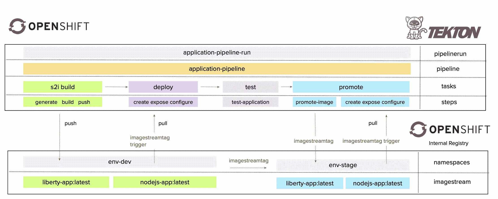
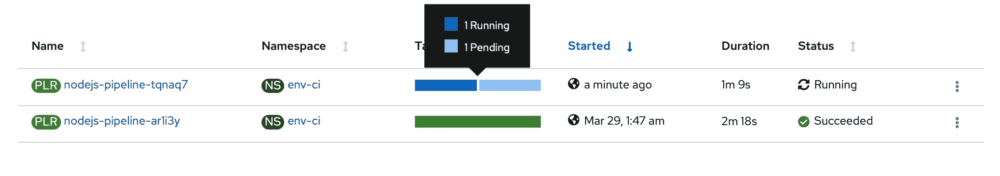
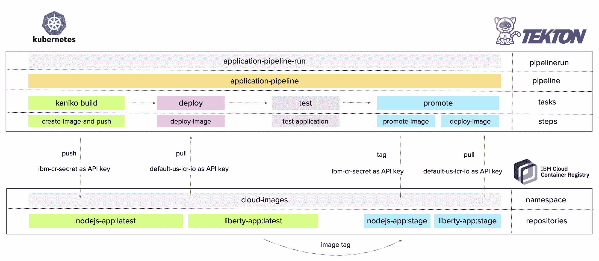
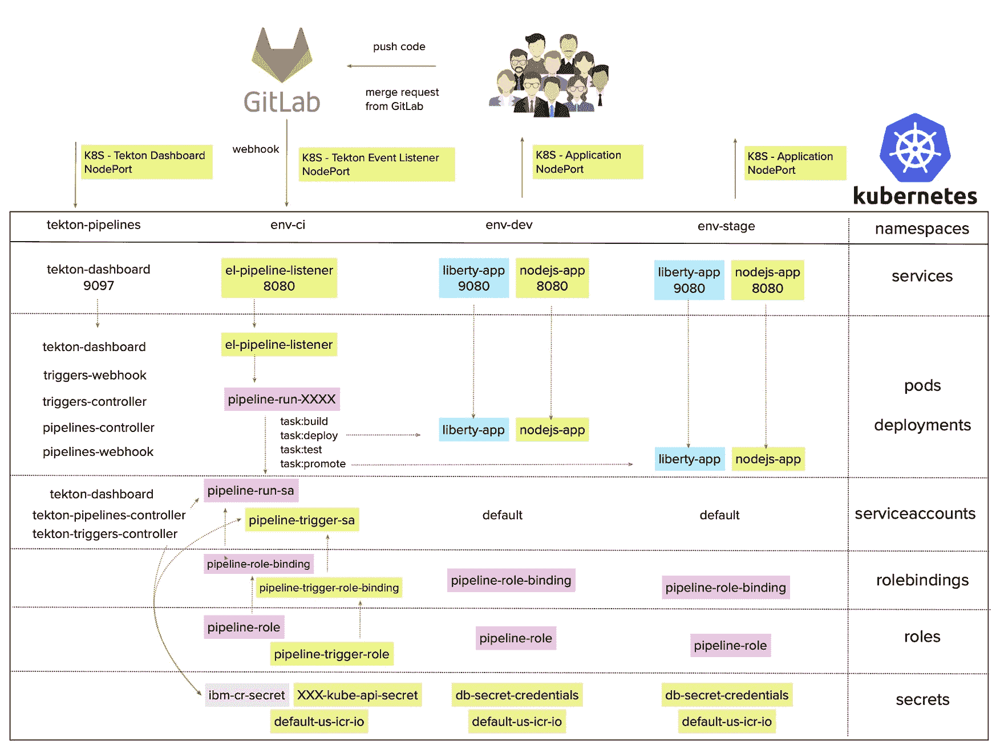
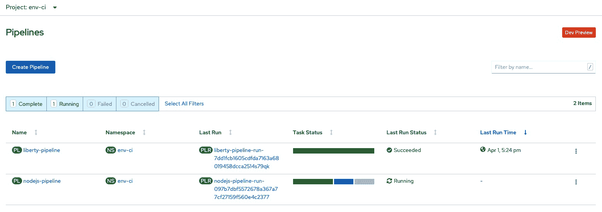
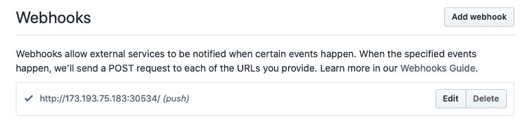
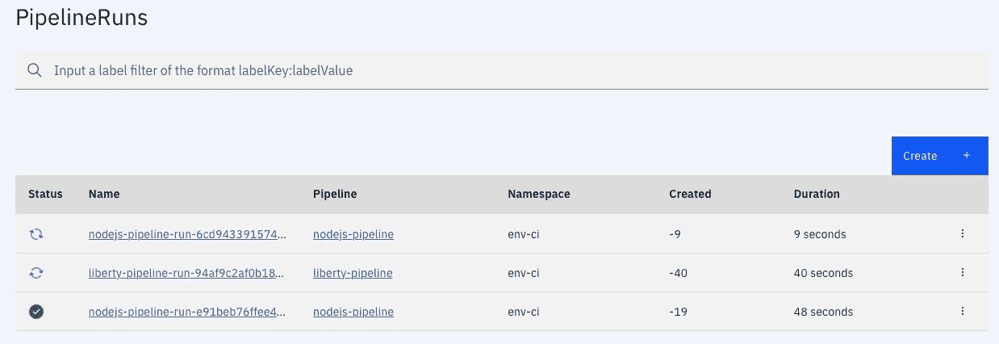

# 构建 CI/CD Tekton Pipeline 以部署 Node.js 应用程序

> 原文：[`developer.ibm.com/zh/tutorials/build-a-cicd-tekton-pipeline-for-deploying-a-nodejs-application/`](https://developer.ibm.com/zh/tutorials/build-a-cicd-tekton-pipeline-for-deploying-a-nodejs-application/)

[Red Hat OpenShift on IBM Cloud](https://www.ibm.com/cn-zh/cloud/openshift) 是 IBM Cloud Kubernetes Service 的一个扩展，IBM 通过这个扩展为您管理 OpenShift Container Platform。

[Tekton Pipeline](https://developer.ibm.com/videos/what-is-tekton/) 是一种开源框架，用于创建在 Kubernetes 上运行的云原生持续集成和持续交付 (CI/CD) 流水线。Tekton Pipeline 专为容器环境而构建，支持整个软件生命周期，并且使用无服务器方法。

在本教程中，您将熟悉使用 Tekton Pipeline 在 Red Hat OpenShift 4.3 和 Kubernetes 1.17 或更高版本上创建 CI/CD 流水线和 webhook。

## 前提条件

在开始本教程之前，请完成以下步骤：

1.  注册一个 [IBM Cloud 帐户](https://cocl.us/IBM_CLOUD_GCG)。
2.  [在 IBM Cloud 上创建一个免费的 Kubernetes 集群](https://cloud.ibm.com/docs/containers?topic=containers-getting-started#clusters_gs)。
3.  [在 IBM Cloud 上创建一个 OpenShift 4.3 集群](https://cloud.ibm.com/docs/openshift?topic=openshift-openshift_tutorial)。
4.  安装和配置 [IBM Cloud CLI](https://cloud.ibm.com/docs/cli?topic=cloud-cli-getting-started#overview)。
5.  配置标准 [IBM Cloud Container Registry](https://www.ibm.com/cn-zh/cloud/container-registry)。

*可选：下载 [Visual Studio Code IDE](https://code.visualstudio.com) 用于编辑 Node.js 项目。您也可以下载 [`tkn` command-line](https://github.com/tektoncd/cli)，以便与 Tekton 轻松进行命令行交互。*

现在您已完成环境设置，请注意，IBM Cloud 提供用于测试的 Kubernetes 1.17 集群，可免费使用一个月。您还将获得免费的 IBM Cloud Image Registry，每月提供 512MB 的存储空间和 5GB 的拉取流量。

## 预估时间

完成本教程大约需要 1 小时。

## 步骤

1.  在 OpenShift 4.3 上创建云原生 CI/CD 流水线

2.  在 Kubernetes 1.17 或更高版本上创建云原生 CI/CD 流水线

3.  创建从 Git 到 Tekton CI/CD 流水线的 webhook 连接

在开始之前，了解如何构建应用程序镜像非常重要。使用 Tekton Pipeline 需要在 OpenShift/Kubernetes 集群内构建应用程序镜像。使用 OpenShift 时，需要使用标准 [S2I Build 任务](https://github.com/openshift/pipelines-catalog)，而对于 Kubernetes，需要使用 Kaniko Build 任务。

了解每个 Git 文件夹所包含的内容也很重要：

*   `nodejs` 是 Node.js 应用程序的上下文根目录，基于 [Red Hat DO101 演示应用程序](https://github.com/RedHatTraining/DO101-apps/tree/master/weather)。

*   `tekton-openshift` 包含 [OpenShift Pipeline](https://www.openshift.com/learn/topics/pipelines) 实现和 YAML 资源。

*   `tekton-kubernetes` 包含 [Kubernetes Pipeline](https://github.com/tektoncd/pipeline) 实现和 YAML 资源。

*   `tekton-triggers` 包含 [Tekton Triggers](https://github.com/tektoncd/triggers) 实现，用于创建到 OpenShift/Kubernetes 的 Git webhook。

如果您想使用 Visual Studio Code 在本地编辑和运行 Node.js 应用程序，那也可以。从 repo 根文件夹运行：

```
npm install .
node ./nodejs/bin/www/
curl http://localhost:8080/nodejs 
```

很好！ 现在我们开始吧。

## 在 OpenShift 4.3 上创建云原生 CI/CD 流水线

[OpenShift Pipeline](https://docs.openshift.com/container-platform/4.4/pipelines/understanding-openshift-pipelines.html) 是一种基于 Kubernetes 资源的云原生 CI/CD 解决方案。它通过提取底层实现细节，使用 Tekton 构建块来自动执行跨多个平台的部署。Tekton 引入了许多标准的自定义资源定义 (CRD)，用于定义可跨 Kubernetes 发行版移植的 CI/CD 流水线。

1.  按照 [OpenShift 文档](https://docs.openshift.com/container-platform/4.4/pipelines/installing-pipelines.html#op-installing-pipelines-operator-in-web-console_installing-pipelines)中的说明，从 Web 控制台或 CLI 安装 OpenShift Pipelines Operator。

    安装成功后，您将获得在“openshift-pipelines”项目中创建的与 Tekton 相关的必要构建块。

    ```
     oc get pods -n openshift-pipelines 
    ```

2.  创建 `env-ci`、`env-dev` 和 `env-stage` 项目。在 `env-ci` 中，您将存储 CI/CD 流水线和所有流水线资源。在 `env-dev` 和 `env-stage` 中，您将通过镜像提升来部署应用程序。

    ```
     oc new-project env-ci
     oc new-project env-dev
     oc new-project env-stage 
    ```

3.  创建 ImageStream `nodejs-tekton` 以将 Node.js 镜像存储在 `env-dev` 和 `env-stage` 项目中：

    ```
     oc create is nodejs-tekton -n env-dev
     oc create is nodejs-tekton -n env-stage 
    ```

4.  允许 `pipeline` ServiceAccount 在其他 `env-dev` 和 `env-stage` 项目上进行部署：

    ```
     oc adm policy add-scc-to-user privileged system:serviceaccount:env-ci:pipeline -n env-ci
     oc adm policy add-scc-to-user privileged system:serviceaccount:env-ci:pipeline -n env-dev
     oc adm policy add-scc-to-user privileged system:serviceaccount:env-ci:pipeline -n env-stage
     oc adm policy add-role-to-user edit system:serviceaccount:env-ci:pipeline -n env-ci
     oc adm policy add-role-to-user edit system:serviceaccount:env-ci:pipeline -n env-dev
     oc adm policy add-role-to-user edit system:serviceaccount:env-ci:pipeline -n env-stage 
    ```

    下图显示了 OpenShift Pipeline 设计的外观。

    

### 创建 CI/CD 流水线

1.  克隆 Git 项目：

    ```
     git clone https://github.com/vladsancira/nodejs-tekton.git
     cd nodejs-tekton 
    ```

2.  创建 Tekton 资源、任务和流水线：

    ```
     oc create -f ci-cd-pipeline/tekton-openshift/resources.yaml        -n env-ci
     oc create -f ci-cd-pipeline/tekton-openshift/task-build-s2i.yaml   -n env-ci
     oc create -f ci-cd-pipeline/tekton-openshift/task-deploy.yaml      -n env-ci
     oc create -f ci-cd-pipeline/tekton-openshift/task-test.yaml        -n env-ci
     oc create -f ci-cd-pipeline/tekton-openshift/task-promote.yaml     -n env-ci
     oc create -f ci-cd-pipeline/tekton-openshift/pipeline.yaml         -n env-ci 
    ```

3.  创建一个应用程序密钥，该密钥将作为环境变量挂载在 Node.js pod 中：

    ```
     oc create -f ci-cd-pipeline/tekton-openshift/secrets.yaml   -n env-dev
     oc create -f ci-cd-pipeline/tekton-openshift/secrets.yaml   -n env-stage 
    ```

4.  执行流水线：

    ```
     tkn t ls -n env-ci
     tkn p ls -n env-ci
     tkn p start nodejs-pipeline -n env-ci 
    ```

    

5.  从 CI 环境中列出 `PipelineRun`：

    ```
     tkn pr ls -n env-ci
     NAME                                         STARTED        DURATION    STATUS
     nodejs-pipeline-run-4fe564430272f1ea78cad   15 hours ago   2 minutes   Succeeded 
    ```

## 在 Kubernetes 1.17 或更高版本上创建云原生 CI/CD 流水线

1.  克隆 Git 项目：

    ```
     git clone https://github.com/vladsancira/nodejs-tekton.git
     cd nodejs-tekton 
    ```

2.  在默认的 `tekton-pipelines` 命名空间中安装 Tekton Pipeline

    ```
     kubectl apply --filename https://storage.googleapis.com/tekton-releases/pipeline/latest/release.yaml
     kubectl get pods --namespace tekton-pipelines 
    ```

3.  创建新的 `env-stage`、`env-dev` 和 `env-ci` 命名空间。在 `env-ci` 中，您将存储 CI/CD 流水线和所有流水线资源。在 `env-dev` 和 `env-stage` 命名空间中，您将通过镜像提升来部署应用程序。

    ```
     kubectl create namespace env-stage
     kubectl create namespace env-dev
     kubectl create namespace env-ci 
    ```

4.  为 IBM Cloud Registry 创建一个 API 密钥，并从 `default` 命名空间中导出 PullImage 密钥。API 密钥用于将镜像推送到 IBM Cloud Registry 中。创建 Kubernetes 集群时，将在 `default` 命名空间（针对所有区域）中创建一个 IBM Cloud Registry 拉取密钥，用于从 IBM Cloud Registry 中拉取镜像。

    ```
     ibmcloud iam api-key-create MyKey -d "this is my API key" --file key_file.json
     cat key_file.json | grep apikey

     kubectl create secret generic ibm-cr-secret  -n env-ci --type="kubernetes.io/basic-auth" --from-literal=username=iamapikey --
     from-literal=password=<API_KEY>
     kubectl annotate secret ibm-cr-secret  -n env-ci tekton.dev/docker-0=us.icr.io

     kubectl get secret default-us-icr-io --export -o yaml > default-us-icr-io.yaml
     kubectl create -f  default-us-icr-io.yaml -n env-dev
     kubectl create -f  default-us-icr-io.yaml -n env-stage 
    ```

5.  创建一个新的 ServiceAccount，以使流水线能够运行并部署到 `env-dev` 命名空间。您需要在流水线定义中指定此 ServiceAccount。此外，您还需要将一个自定义角色绑定到此 ServiceAccount，以使其能够在 `env-dev` 和 `env-stage` 命名空间中创建、删除或编辑资源。

    ```
     kubectl apply -f ci-cd-pipeline/tekton-kubernetes/service-account.yaml         -n env-ci
     kubectl apply -f ci-cd-pipeline/tekton-kubernetes/service-account-binding.yaml -n env-dev
     kubectl apply -f ci-cd-pipeline/tekton-kubernetes/service-account-binding.yaml -n env-stage 
    ```

    以下是 Kubernetes Pipeline 设计的图像。

    

### 创建 CI/CD 流水线

1.  创建 Tekton 资源、任务和流水线：

    ```
     kubectl create -f ci-cd-pipeline/tekton-kubernetes/resources.yaml          -n env-ci
     kubectl create -f ci-cd-pipeline/tekton-kubernetes/task-build-kaniko.yaml  -n env-ci
     kubectl create -f ci-cd-pipeline/tekton-kubernetes/task-deploy.yaml        -n env-ci
     kubectl create -f ci-cd-pipeline/tekton-kubernetes/task-test.yaml          -n env-ci
     kubectl create -f ci-cd-pipeline/tekton-kubernetes/task-promote.yaml       -n env-ci
     kubectl create -f ci-cd-pipeline/tekton-kubernetes/pipeline.yaml           -n env-ci 
    ```

2.  创建一个应用程序密钥，该密钥将作为环境变量挂载在 Node.js pod 中：

    ```
     kubectl apply -f ci-cd-pipeline/tekton-kubernetes/secrets.yaml -n env-dev
     kubectl apply -f ci-cd-pipeline/tekton-kubernetes/secrets.yaml -n env-stage 
    ```

3.  通过 `kubectl` 使用 `PipelineRun` 来执行流水线：

    ```
     kubectl create -f ci-cd-pipeline/tekton-kubernetes/pipeline-run.yaml -n env-ci
     kubectl get pipelinerun -n env-ci
     NAME                                 SUCCEEDED    REASON      STARTTIME   COMPLETIONTIME
     nodejs-pipeline-run-4fe564430272f1e   True        Succeeded   15h         15h 
    ```

    或通过 `tkn` 命令：

    ```
     tkn p start nodejs-pipeline -n env-ci
     tkn pr ls -n env-ci

     NAME                                      STARTED        DURATION    STATUS
     nodejs-pipeline-run-4fe564430272f1ea78   15 hours ago   2 minutes   Succeeded 
    ```

4.  检查 pod 和日志：

    ```
     kubectl get pods                            -n env-dev
     kubectl get pods                            -n env-stage

     kubectl logs nodejs-app-76fcdc6759-pjxs7 -f -n env-dev 
    ```

5.  通过使用以下命令检索 Kubernetes 集群 `EXTERNAL-IP` 以查看 Node.js 应用程序 UI：

    ```
     kubectl get nodes -o wide 
    ```

6.  然后，在 Web 浏览器中打开以下 URL 以查看 Node.js 应用程序 UI：

    *   从 `DEV` 环境打开：`http://<EXTERNAL-IP>:32426/nodejs`
    *   从 `STAGE` 环境打开：`http://<EXTERNAL-IP>:32526/nodejs`

## 创建从 Git 到 Tekton CI/CD 流水线的 webhook 连接

要创建从 Git 到 Tekton Pipeline 的 webhook，您需要在 Kubernetes 集群中安装 [Tekton Triggers](https://github.com/tektoncd/triggers)。

Tekton Triggers 是 Kubernetes CRD 控制器，允许您从事件有效负载中提取信息以创建 Kubernetes 资源。请记住，您可以使用 [Tekton Dashboard](https://developer.ibm.com/components/tekton/blogs/why-nows-a-great-time-to-use-the-tekton-dashboard) 作为 Web 控制台来查看所有 Tekton 资源。

在 OpenShift 4.3 上，Tekton Triggers 已作为 OpenShift Pipelines Operator 的一部分安装在 `openshift-pipelines` 项目（命名空间）中。但 Tekton Dashboard 并未安装。您可以使用 OpenShift Web 控制台。

通过 webhook 触发构建的机制是相同的，都需要创建 EventListener，并向外部公开 EventListener 服务。EventListener 处理外部事件并接收 Git 有效负载。这些有效负载可通过 TriggerBinding 资源进行解析以获取某些信息，例如 `gitrevision` 或 `gitrepositoryurl`。然后，将这些变量发送到通过 PipelineRun 定义（带有可选参数）调用 Tekton Pipeline 的 TriggerTekTemplate 资源。



### 对于 OpenShift：

1.  创建 `TriggerTemplate`、`TriggerBinding` 和 EventListener 流水线：

    ```
     oc create -f ci-cd-pipeline/tekton-triggers/webhook-event-listener-openshift.yaml -n env-ci 
    ```

2.  为 EventListener 服务创建路由：

    ```
     oc expose svc/el-nodejs-pipeline-listener -n env-ci
     oc get route -n env-ci 
    ```

3.  将该路由添加到 Git webhook，然后执行推送。这将自动触发新的 `PipelineRun`，并在流水线控制台 `ci-env` 项目中可见。

    

### 对于 Kubernetes：

1.  安装 Tekton Dashboard 和 Tekton Triggers：

    ```
     kubectl apply -f https://github.com/tektoncd/dashboard/releases/download/v0.6.1.2/tekton-dashboard-release.yaml
     kubectl apply -f https://storage.googleapis.com/tekton-releases/triggers/latest/release.yaml
     kubectl apply -f ci-cd-pipeline/tekton-triggers/tekton-dashboard.yaml -n tekton-pipelines 
    ```

2.  创建一个新的 `ServiceAccount`、`Role` 和 `RoleBinding`。在 Kubernetes 中，这个新的 ServiceAccount 将用于运行 EventListener，并通过 TriggerTemplate 启动 PipelineRun。实际流水线仍将按照其中定义的 ServiceAccount 运行。

    ```
     kubectl apply -f ci-cd-pipeline/tekton-triggers/webhook-service-account.yaml  -n env-ci 
    ```

3.  创建 `TriggerTemplate`、`TriggerBinding` 和 EventListener 流水线。默认情况下，EventListener 服务类型为 ClusterIP。但是，您需要将其设置为 NodePort，以便可以从集群外部将其触发。

    ```
     kubectl apply -f ci-cd-pipeline/tekton-triggers/webhook-event-listener-kubernetes.yaml -n env-ci 
    ```

4.  检索 `el-nodejs-pipeline-listener` 端口和 EXTERNAL-IP 集群：

    ```
     kubectl get svc el-nodejs-pipeline-listener -n env-ci
     kubectl get nodes -o wide 
    ```

5.  将“http://<cluster_ip>>:<event_listner_port>”作为 webhook 添加到 GitHib 中。然后执行推送。</event_listner_port></cluster_ip>

    

6.  打开 Tekton Dashboard `http://<CLUSTER_IP>>:32428/#/pipelineruns`，确保更改成功。您的输出应如下所示：



## 结束语

恭喜您！您已成功创建云原生 CI/CD Tekton Pipeline，可用于在 OpenShift/Kubernetes 集群中构建和部署 Node.js 应用程序。如果您想继续使用 Tekton 和 Red Hat OpenShift，请尝试其他教程，通过其他教程学习如何[构建 Tekton Pipeline 以将移动应用后端部署到 OpenShift 4](https://developer.ibm.com/components/tekton/tutorials/tekton-pipeline-deploy-a-mobile-app-backend-openshift-4)。

本文翻译自：[Build a CI/CD Tekton Pipeline for deploying a Node.js application](https://developer.ibm.com/technologies/devops/tutorials/build-a-cicd-tekton-pipeline-for-deploying-a-nodejs-application)（2020-06-18）