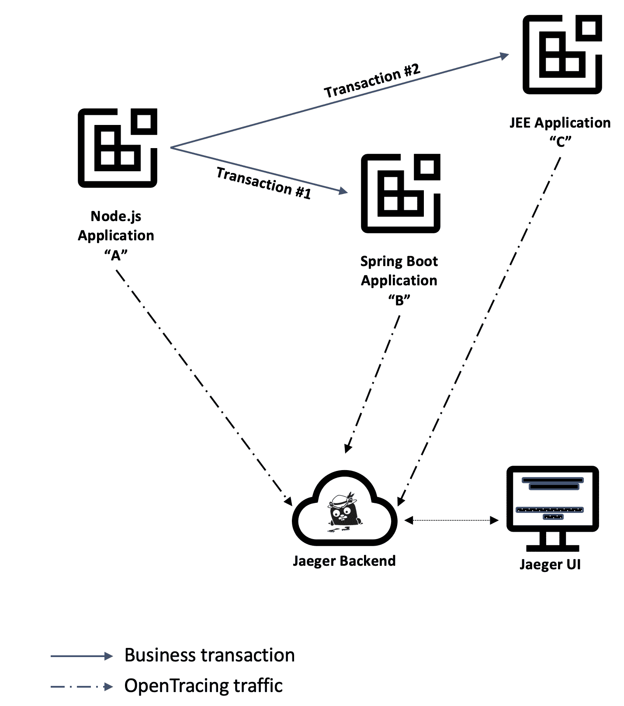
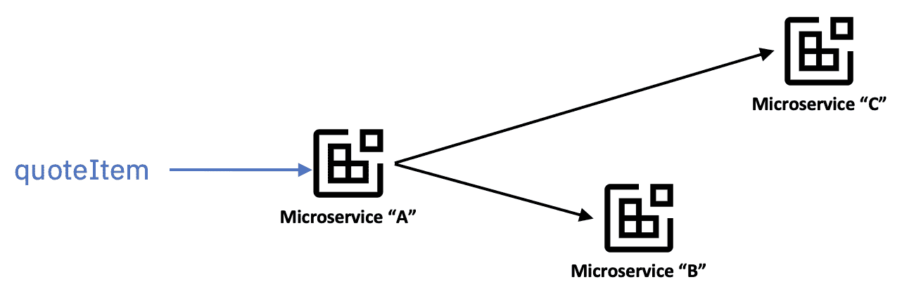
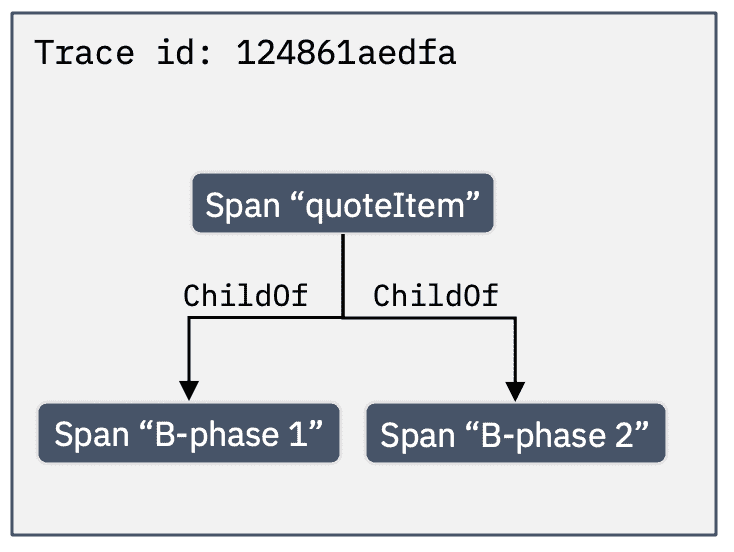
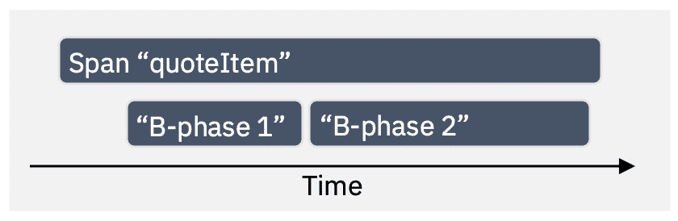
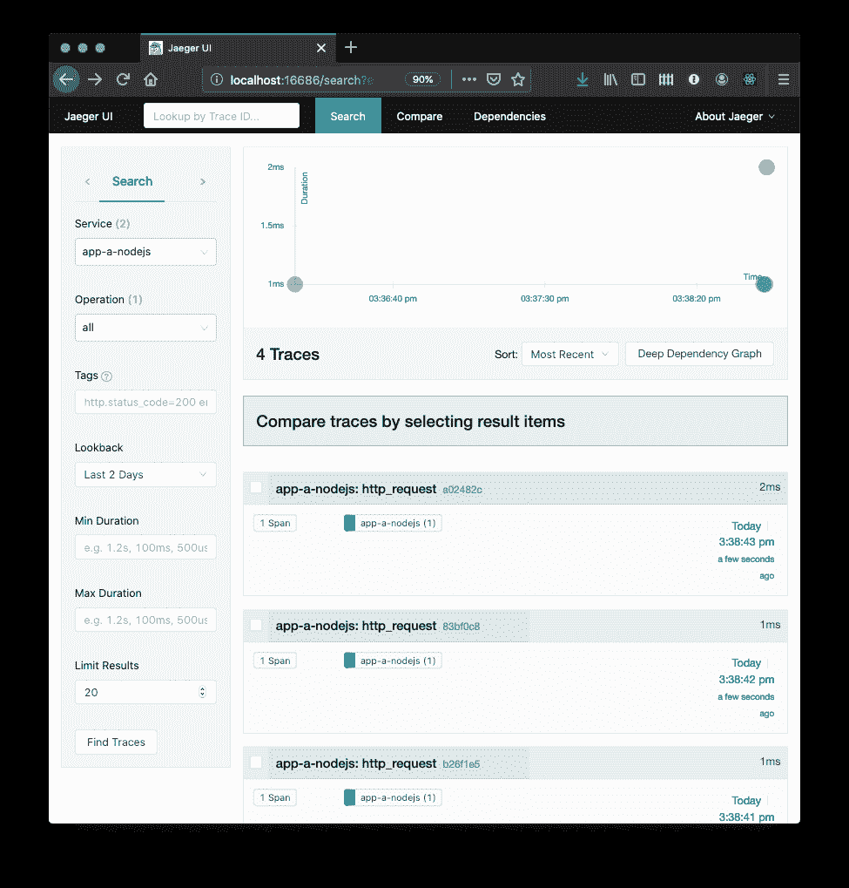
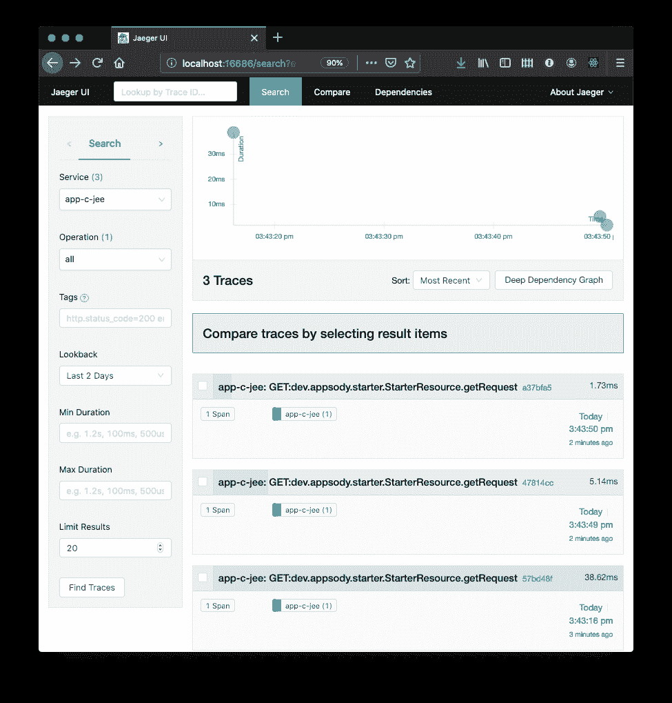
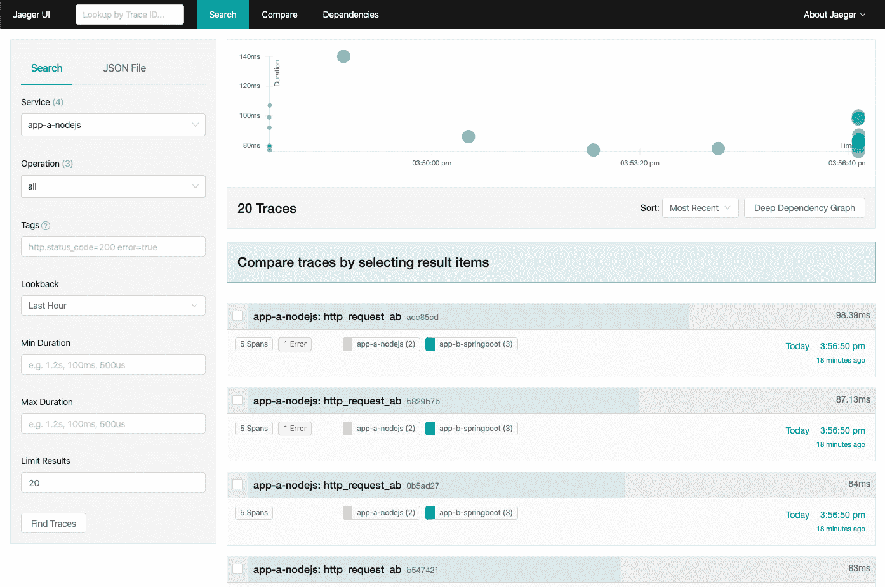
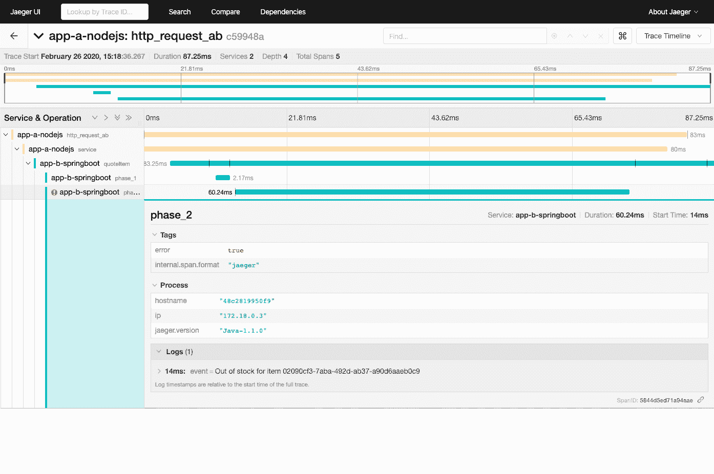
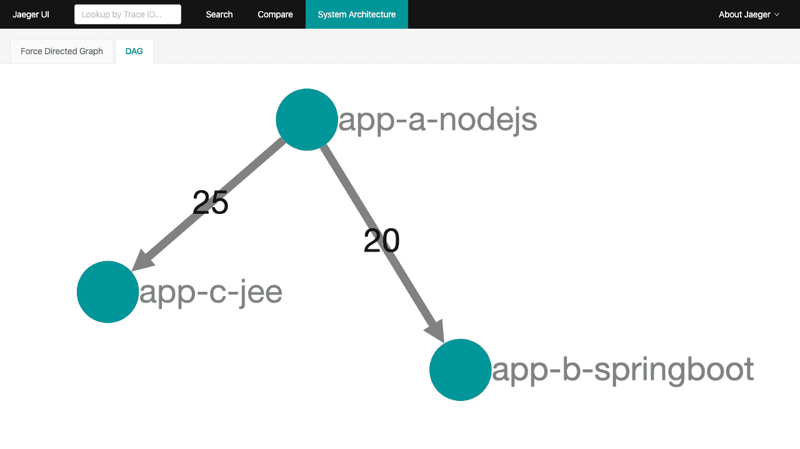

# Archived | 针对微服务的分布式跟踪，第 1 部分

> 原文：[`developer.ibm.com/zh/tutorials/distributed-tracing-for-microservices-1/`](https://developer.ibm.com/zh/tutorials/distributed-tracing-for-microservices-1/)

**本文已归档**

**归档日期：:** 2021-02-25

此内容不再被更新或维护。 内容是按“原样”提供。鉴于技术的快速发展，某些内容，步骤或插图可能已经改变。

在这个由三部分组成的教程中，您将构建一个包含各种互连微服务的小型系统，并研究该系统内部的流量。

*   第 1 部分（本部分）重点介绍了如何对应用程序进行检测以将其流量发送到中心位置，并在仪表板中研究结果。
*   [第 2 部分](https://developer.ibm.com/zh/tutorials/distributed-tracing-for-microservices-part-2/)重点介绍了如何将生成的服务部署到用服务网格进行了扩展的 Kubernetes 集群，然后探讨了在潜在生产环境中使用分布式跟踪的所有好处。
*   第 3 部分重点介绍了如何通过最少的修改量来将服务部署到 Red Hat OpenShift 安装，并完成整个开发周期以创建可观察且可部署在实际环境中的云原生微服务。

流量分析是确定架构的各个组件之间功能的理想划分以及了解各个组件内部动态的一项基本活动。

本教程适用于熟悉 [Appsody](https://developer.ibm.com/zh/blogs/introduction-to-appsody/) 以及分布式跟踪（使用 [OpenTracing](https://opentracing.io/) API 和流行的 [Jaeger 客户端库](https://www.jaegertracing.io/docs/latest/client-libraries/)）的概念的开发者。

[Appsody](https://appsody.dev/) 项目是 [IBM Cloud Pak for Applications](https://www.ibm.com/cn-zh/cloud/cloud-pak-for-applications) 包含的上游开源项目之一，本教程中使用了它的一些功能来加快创建和测试微服务。

在本教程结束时，您会完成以下工作：创建多个微服务，对它们进行检测以将其遥测发送到 [Jaeger](https://www.jaegertracing.io) 后端（分布式跟踪服务器），并在 Jaeger UI 中研究结果：



完成所有步骤后，最终应用程序的副本将放在 [GitHub](https://github.com/IBM/icpa-opentracing) 中，您可以在整个教程中使用此副本作为参考。

## OpenTracing 中的跟踪和跨度

本教程不能用作分布式跟踪或 OpenTracing 的入门，但是本节介绍了以下各节中使用的关键概念。[OpenTracing 语义规范](https://github.com/opentracing/specification/blob/master/specification.md)仍然是所有术语及其定义的权威来源。

### 核心概念

在继续阅读之前，请考虑先阅读 [OpenTracing 规范](https://github.com/opentracing/specification/blob/master/specification.md)。但如果时间紧迫，可以先了解以下三个基本的分布式跟踪概念：“跟踪”、“跨度”和“引用”。从最基本的层面上讲，“跨度”表示限时操作，而“跟踪”定义为跨度的任意集合。

另一个相关的概念是“引用”，用于表示两个跨度之间的关系，例如，一个跨度具有对另一个跨度的“ChildOf”引用。

该规范的“[OpenTracing 数据模型](https://github.com/opentracing/specification/blob/master/specification.md#the-opentracing-data-model)”部分从跟踪与跨度之间的关系以及它们在时间线中的概念可视化方面说明了这种安排。

### 具体示例

在我们的示例中，假定 Jaeger 是一个跟踪后端，并考虑使用微服务“A”，该微服务代表请求采购订单估值的用户从 Web 浏览器接收请求。

此外，还要考虑微服务“A”如何调用微服务“B”以引用订单中的每个项目。



微服务“A”可以向 Jaeger 后端报告涵盖整个操作的跨度，还可以将该跨度的上下文标识传递给微服务“B”，以便当微服务“B”决定创建跨度来表示其在该业务事务中的工作时，它可以在新跨度和微服务“A”创建的“parent”跨度之间创建类型为“ChildOf”的引用。



如果在时间线上观察，跨度中的开始和结束时间戳记允许可视化应用程序绘制该时间线上跨度的分布图。



由这两个微服务创建的代表一个事务的整个跨度集合将在 Jaeger 后端逻辑分组为单个跟踪，并在 Jaeger UI 中以这种方式呈现（如后面的部分中所详述）。

### OpenTracing 融合到 OpenTelemetry 中

随着 [OpenTracing](https://opentracing.io/) 融合到 [OpenTelemetry](https://opentelemetry.io) 中，分布式跟踪工具和检测领域正在迅速发生变化。

本教程（当前）基于更稳定的 OpenTracing 客户端库，可一旦 OpenTelemetry 客户端库变得更广泛可用，它将立即进行更新。

下面是一些不错的参考文章，有助于您进一步了解融合路线图及其对本教程中使用的 Jaeger 基础架构的影响：

*   “[合并 OpenTracing 和 OpenCensus：融合路线图](https://medium.com/opentracing/a-roadmap-to-convergence-b074e5815289)”（Medium，2019 年 4 月）

*   “[Jaeger 和 OpenTelemetry](https://medium.com/jaegertracing/jaeger-and-opentelemetry-1846f701d9f2)”（Medium，2019 年 5 月）

## 前提条件

安装：

*   [Docker](https://docs.docker.com/get-started/)。如果使用 Windows 或 macOS，那么 Docker Desktop 可能是最佳选择。如果使用 Linux 系统，那么 [Minikube](https://github.com/kubernetes/minikube) 及其内部 Docker 注册表是备选项。
*   [Appsody CLI](https://appsody.dev/docs/getting-started/installation)。

## 预估时间

满足这些前提条件后，您应该可以在 1 小时内完成本教程。

## 步骤

在本教程中，您将执行以下步骤：

1.  设置本地开发环境
2.  创建 Node.js 应用程序
3.  创建 Spring Boot 应用程序
4.  创建 Open Liberty 应用程序
5.  创建微服务依赖项
6.  对分布式事务实现可视化
7.  拆除安装

1

### 设置本地开发环境

在执行本教程中的步骤时，首先需要安装一个本地的 [Jaeger 多合一服务器](https://www.jaegertracing.io/docs/getting-started/)。

该多合一服务器将充当后端，用于从参与分布式事务的各个服务器以及 Jaeger UI 控制台（您可以在其中检查每个事务的结果）所在的主机接收遥测数据。

#### 将自定义堆栈中心添加到堆栈存储库列表

本教程使用了 [Kabanero](https://kabanero.io/) 项目（IBM Cloud Pak for Applications 的上游项目之一）中的受管堆栈。注意，此存储库仅用作可访问的稳定参考，但使用 Cloud Pak for Applications 的组织可通过“Accelerators for Team”支持来部署自己的存储库，其中包含这些堆栈的自定义版本。

使用以下命令注册堆栈存储库：

```
stack_hub_url=https://github.com/kabanero-io/kabanero-stack-hub/releases/latest/download/kabanero-stack-hub-index.yaml

appsody repo add kabanero ${stack_hub_url} 
```

使用以下命令验证是否成功添加了堆栈存储库：

```
appsody list kabanero 
```

该命令应生成与下面类似的输出（较新版本或其他堆栈可能例外）。

```
REPO        ID                   VERSION      TEMPLATES            DESCRIPTION                                              
kabanero    java-microprofile    0.2.26       *default             Eclipse MicroProfile on Open Liberty & OpenJ9 using Maven
kabanero    java-openliberty     0.2.3        *default             Open Liberty & OpenJ9 using Maven                        
kabanero    java-spring-boot2    0.3.24       *default, kotlin     Spring Boot using OpenJ9 and Maven                       
kabanero    nodejs               0.3.3        *simple              Runtime for Node.js applications                         
kabanero    nodejs-express       0.2.10       scaffold, *simple    Express web framework for Node.js 
```

#### 创建自定义 Docker 网络

本教程包含的许多应用程序都需要通过名称查找来找到彼此，而在使用自定义 Docker 网络（而不是默认桥接网络）时更容易进行名称查找。

从命令行终端中执行以下命令：

```
docker network create opentrace_network 
```

#### 启动本地 Jaeger 服务器

本教程中的说明将多合一服务器命名为“jaeger-collector”（在创建容器时需要将其指定为参数）。

从命令行终端中输入以下启动命令，观察是否存在 `network` 参数，交叉引用您刚创建的 Docker 网络：

```
docker run --name jaeger-collector \
  --detach \
  --rm \
  -e COLLECTOR_ZIPKIN_HTTP_PORT=9411 \
  -p 5775:5775/udp \
  -p 6831:6831/udp \
  -p 6832:6832/udp \
  -p 5778:5778 \
  -p 16686:16686 \
  -p 14268:14268 \
  -p 9411:9411 \
  --network opentrace_network \
  jaegertracing/all-in-one:latest 
```

您可以使用以下命令来验证该操作是否成功：

```
docker logs jaeger-collector 
```

该命令应生成与下面类似的输出：

```
...
2020/03/19 20:26:10 maxprocs: Leaving GOMAXPROCS=6: CPU quota undefined
{"level":"info","ts":1584649570.6110163,"caller":"app/server.go:146","msg":"Starting CMUX server","port":16686}
{"level":"info","ts":1584649570.6110344,"caller":"app/server.go:123","msg":"Starting HTTP server","port":16686}
{"level":"info","ts":1584649570.6110544,"caller":"app/server.go:136","msg":"Starting GRPC server","port":16686} 
```

#### Jaeger 跟踪选项

Jaeger 客户端库的配置在 Jaeger [客户端库功能](https://www.jaegertracing.io/docs/latest/client-features/)页面上有详细记录，您需要定义其中几个属性来提供微服务。

为 Jaeger 客户端属性创建一个名为 `jaeger.properties` 的文件：

```
cat > jaeger.properties << EOF
JAEGER_ENDPOINT=http://jaeger-collector:14268/api/traces
JAEGER_REPORTER_LOG_SPANS=true
JAEGER_SAMPLER_TYPE=const
JAEGER_SAMPLER_PARAM=1
JAEGER_PROPAGATION=b3
EOF 
```

注意此配置文件的内容：

*   在您阅读了 [Jaeger 架构](https://www.jaegertracing.io/docs/latest/architecture/)页面后，`JAEGER_ENDPOINT` 变量将指示客户端库直接将跨度数据发送到 Jaeger 收集器进程，而不是将其发送到调解代理进程。这是本教程随意决定的，对 Jaeger 数据库中的结果没有影响。在实际的生产环境中，有些原因可能会导致通过 Jaeger 代理的流量聚集在一起，但这不在本教程的讨论范围内。

*   `JAEGER_SAMPLER_TYPE` 和 `JAEGER_SAMPLER_PARAM` 值的组合将指示 Jaeger 客户端库将每个跨度发送到 Jaeger 后端。 对于希望检查每个跟踪的教程，适合使用此方法，但此方法可能会对实际生产环境中的系统性能产生负面影响。请参阅有关[采样](https://www.jaegertracing.io/docs/sampling/)的 Jaeger 文档，以便明智地决定适合您环境的理想采样设置。

2

### 创建 Node.js 应用程序

使用 Appsody 命令行界面创建 Node.js 应用程序。Appsody 支持 [Express](https://expressjs.com/) 和 [LoopBack](https://loopback.io/) 框架。对于本教程，您将使用 Express 框架。

在命令行界面中输入以下命令：

```
tutorial_dir=$(PWD)
mkdir nodejs-tracing
cd nodejs-tracing
appsody init kabanero/nodejs-express 
```

该 `tutorial_dir` 变量将在本教程的后面部分中进行引用和复用，因此请将其设置为易访问的位置，以便于引用 `jaeger.properties` 文件。

用一点时间来查看由 Appsody 创建的模板应用程序的结构：

```
nodejs-tracing
├── app.js
├── package-lock.json
├── package.json
└── test
    └── test.js 
```

#### 为应用程序指定名称

由于您想要标识跟踪中跨度的贡献者，因此对该应用程序的第一处修改是在新生成的 `package.json` 文件中更改其名称。

将 `package.json` 中包含 `"name": "nodejs-express-simple",` 的行修改为以下行：

```
 "name": "app-a-nodejs", 
```

#### 使用 Jaeger 客户端库启用 OpenTracing

在本节中，您将遵循与 [Jaeger 文档](https://github.com/jaegertracing/jaeger-client-node)中类似的说明。

第一处更改是在应用程序中包含 `jaeger-client` 程序包，您需要在 Node.js 应用程序的 `package.json` 文件中包含[程序包依赖项](https://www.npmjs.com/package/jaeger-client)，如下所示：

```
 "dependencies": {
    "jaeger-client": "³.17.1"
  }, 
```

Node.js Express 框架不会自动检测用于跟踪的 RESTful 调用，因此您需要对 `app.js` 文件进行一些更改以便初始化 OpenTracing `tracer` 对象，此对象可用于对分布式跟踪后端进行调用。

所做的更改汇总如下：

1.  为 OpenTracing 跟踪器对象插入全局初始化块。
2.  在请求开始时启动跟踪跨度。
3.  在要跟踪的 RESTful 请求的处理程序内添加跟踪语句。

`app.js` 文件清单中列出的更改位于以下代码清单中标记为“Tutorial begin”和“Tutorial end”的注释块内。

在文件系统中的本地 `app.js` 中重现这些更改，或者将以下内容复制并粘贴到该文件中。

```
const app = require('express')()

//
// Tutorial begin: Global initialization block
//
var initTracerFromEnv = require('jaeger-client').initTracerFromEnv;
var config = {
  serviceName: 'app-a-nodejs',
};
var options = {
};
var tracer = initTracerFromEnv(config, options);
//
// Tutorial end: Global initialization block
//

app.get('/', (req, res) => {
  //
  // Tutorial begin: OpenTracing new span
  //
  const span = tracer.startSpan('http_request');
  //
  // Tutorial end: OpenTracing new span
  //

  // Use req.log (a pino instance) to log JSON:
  res.send('Hello from Appsody!');

  //
  // Tutorial begin: Send span information to Jaeger
  //
  span.log({'event': 'request_end'});
  span.finish();
  //
  // Tutorial end: Send span information to Jaeger
  //
});

module.exports.app = app; 
```

您可以在 [OpenTracing API](https://github.com/opentracing/opentracing-javascript/) 页面上找到有关 `tracer` 接口的更多信息。

#### 启动应用程序

完成对 `package.json` 和 `app.js` 的修改后，启动应用程序，并验证其是否可用于跟踪分布式事务。

在单独的命令行窗口中输入以下命令：

```
appsody run \
  --name "nodejs-tracing" \
  --publish "8081:8080" \
  --docker-options="--env-file ../jaeger.properties" \
  --network opentrace_network 
```

注意 `network` 参数的用法，它可将容器放在本教程开始时创建的自定义 Docker 网络 (`opentrace_network`) 中。另须注意 `publish` 选项的用法，它可消除与 Spring Boot 应用程序稍后所需的端口 8080 的最终冲突。

您应该会看到如下消息，表明服务器已准备好接受请求：

`[Container] App started on PORT 3000`

在看到此消息后，您应该打开一个新的命令行终端，并对 `app.js` 中的样本资源发出一些请求。

```
curl http://localhost:3000 
```

然后，您可以通过打开以下 URL 在所选浏览器中启动 Jaeger UI：

[`localhost:16686`](http://localhost:16686)

在 Service 菜单中选择 `app-a-nodejs` 应用程序，然后单击“Find Traces”按钮，这应该会显示您从命令行启动的事务：



3

### 创建 Spring Boot 应用程序

现在可以再次使用 Appsody 命令行界面来创建 Spring Boot 应用程序了。打开另一个命令行终端，将其切换到在第一步中用于创建 `jaeger.properties` 文件的目录，然后在命令行界面中输入以下命令：

```
cd "${tutorial_dir}"
mkdir springboot-tracing
cd springboot-tracing
appsody init kabanero/java-spring-boot2 
```

在对应用程序进行修改之前，用一点时间查看由 Appsody 创建的模板应用程序：

```
springboot-tracing
├── mvnw
├── mvnw.cmd
├── pom.xml
└── src
    ├── main
    │   ├── java
    │   │   └── application
    │   │       ├── LivenessEndpoint.java
    │   │       └── Main.java
    │   └── resources
    │       ├── application.properties
    │       └── public
    │           └── index.html
    └── test
        └── java
            └── application
                └── MainTests.java 
```

#### 为应用程序指定名称

由于您想要在检查跟踪跨度时标识此应用程序，因此第一处修改是在新生成的 `pom.xml` 文件中更改应用程序名称。

将 `pom.xml` 中包含 `<artifactId>default-application</artifactId>` 的行修改为以下行：

```
 <artifactId>app-b-springboot</artifactId> 
```

#### 启用 OpenTracing

需要在源代码中初始化 Jaeger 客户端库一次，您将在程序执行开始时执行此操作。

对 Spring Boot 应用程序的源树中的 `./src/main/java/application/Main.java` 重复进行以下完全修改的示例中所列的更改：

```
package application;

import org.springframework.boot.SpringApplication;
import org.springframework.boot.autoconfigure.SpringBootApplication;

//
// Tutorial: Begin import statements for Jaeger and OpenTracing
//
import org.springframework.context.annotation.Bean;
import io.jaegertracing.Configuration;
import io.opentracing.Tracer;
//
// Tutorial: End import statements for Jaeger and OpenTracing
//

@SpringBootApplication
public class Main {

        //
        // Tutorial: Begin initialization of OpenTracing tracer
        //
        @Bean
        public Tracer initTracer() {
          return Configuration.fromEnv("app-b-springboot").getTracer();
        }
        //
        // Tutorial: End initialization of OpenTracing tracer
        //

        public static void main(String[] args) {
                SpringApplication.run(Main.class, args);
        }

} 
```

#### 启动应用程序

Spring Boot 堆栈已经包含 Jaeger 客户端库和 OpenTracing 库，因此无需对 `pom.xml` 文件进行进一步修改。

完成修改后，启动应用程序，并验证其是否可用于跟踪分布式事务。

在单独的命令行窗口中输入以下命令：

```
appsody run \
  --name springboot-tracing \
  --docker-options="--env-file ../jaeger.properties" \
  --network opentrace_network 
```

请再次注意 `network` 参数的用法，它可将容器放在本教程开始时创建的自定义 Docker 网络中。

您应该会看到如下消息，表明服务器已准备好接受请求：

`[Container] ...INFO ...[ restartedMain] application.Main : Started Main...`

在看到该消息后，向应用程序发出一些请求。现在，可以使用任意 URL，因为其目的是在继续创建新端点之前先验证 OpenTracing 启用操作是否生效，以便您使用已预先构建到应用程序模板中的 `actuator` 端点。

在命令行终端中输入以下命令，并重复几次：

```
curl http://localhost:8080/actuator 
```

现在，在 Web 浏览器中返回到 [Jaeger UI](http://localhost:16686)。您需要刷新屏幕，才能在“Service”菜单中看到应用程序 (`app-b-springboot`) 的新服务条目。

在“Service”菜单中选择 `app-b-springboot` 应用程序，然后单击“Find Traces”按钮，这将显示作为从命令行启动的事务的一部分而创建的跨度：


4

### 创建 Open Liberty 应用程序

作为示例微服务架构中的最后一个应用程序，创建一个 Open Liberty 应用程序并使用跟踪功能对其进行检测。

使用 Open Liberty 服务器为该应用程序创建工作框架。打开一个新的命令行终端，切换到之前在本教程中用于创建 `jaeger.properties` 文件的目录，然后输入以下命令：

```
cd "${tutorial_dir}"
mkdir jee-tracing
cd jee-tracing
appsody init kabanero/java-openliberty 
```

在对该应用程序进行任何修改之前，用一点时间查看由 Appsody 创建的模板应用程序：

```
java-openliberty
├── pom.xml
└── src
    ├── main
    │   ├── java
    │   │   └── dev
    │   │       └── appsody
    │   │           └── starter
    │   │               ├── StarterApplication.java
    │   │               ├── StarterResource.java
    │   │               └── health
    │   │                   ├── StarterLivenessCheck.java
    │   │                   └── StarterReadinessCheck.java
    │   ├── liberty
    │   │   └── config
    │   │       └── server.xml
    │   └── webapp
    │       ├── WEB-INF
    │       │   └── beans.xml
    │       └── index.html
    └── test
        └── java
            └── it
                └── dev
                    └── appsody
                        └── starter
                            └── HealthEndpointTest.java 
```

#### 为应用程序指定名称

由于您想要在检查跟踪跨度时轻松标识此应用程序，因此对此应用程序的第一处修改是在新生成的 `pom.xml` 文件中更改应用程序名称。

将 `pom.xml` 中包含 `<artifactId>starter-app</artifactId>` 的行修改为以下行：

```
 <artifactId>app-c-jee</artifactId> 
```

#### 使用 Jaeger 客户端启用 OpenTracing

下一处修改是在 Open Liberty 运行时中启用 OpenTracing，这需要对 `pom.xml` 和 `src/main/liberty/config/server.xml` 文件进行几处本地化更改。

这些更改的性质在表明支持 Jaeger 作为跟踪后端的 Open Liberty 博客条目“[MicroProfile 3.2 is now available on Open Liberty 19.0.0.12](https://openliberty.io/blog/2019/12/06/microprofile-32-health-metrics-190012.html#jmo)”（Open Liberty，2019 年 12 月）中有更详细的说明。

第一处更改是在最终应用程序中包含 [Jaeger Java 客户端库](https://github.com/jaegertracing/jaeger-client-java)依赖项。

将 [Maven jaeger-client 依赖项](https://mvnrepository.com/artifact/io.jaegertracing/jaeger-client) XML 元素插入到 `pom.xml` 文件的 `<dependencies>` 元素内：

```
 <dependency>
            <groupId>io.jaegertracing</groupId>
            <artifactId>jaeger-client</artifactId>
            <version>0.34.0</version>
        </dependency> 
```

注意，此版本的 Jaeger 客户端库不是最新版本，而是使用在编写本教程时与 Appsody `java-openliberty` 堆栈捆绑在一起的 Open Liberty 版本进行测试的版本。有关尝试使用不同版本时遇到的常见问题，请参阅本教程的“故障排除”部分中的说明。

下一步是将 OpenTracing 功能添加到 Open Liberty 服务器。在 `src/main/liberty/config/server.xml` 文件的 `featureManager` 部分内添加以下元素：

```
 <feature>mpOpenTracing-1.3</feature> 
```

将 `src/main/liberty/config/server.xml` 文件中的 `webApplication` 元素替换为以下片段：

```
 <webApplication location="app-c-jee.war" contextRoot="/" >
        <classloader apiTypeVisibility="+third-party" />
    </webApplication> 
```

最后一处更改是您按照 Open Liberty 文档的指示来创建一个新的共享库，该共享库可供在 Open Liberty 服务器中运行的所有应用程序使用。但是，对于本教程中创建的微服务，根本不需要这种级别的复杂性，因为该服务器内部只有一个应用程序。

这对 JEE 应用程序的基本检测进行了补充，Open Liberty 堆栈为分布式跟踪提供了坚实的基础，在不更改代码的情况下对每个远程请求进行检测。

可以通过 [Eclipse MicroProfile OpenTracing 规范](https://github.com/eclipse/microprofile-opentracing/blob/master/spec/src/main/asciidoc/microprofile-opentracing.asciidoc)中的 Java 注释来更改这种默认行为，本教程稍后将探讨其中的一些注释。

#### 启动应用程序

完成对 `pom.xml` 和 `server.xml` 的修改后，启动应用程序，并验证其是否可用于跟踪分布式事务。

在单独的命令行窗口中输入以下命令：

```
appsody run \
  --name jee-tracing \
  --publish "9444:9443" \
  --docker-options="--env-file ../jaeger.properties" \
  --network opentrace_network 
```

请再次注意 `network` 参数的用法，它可将容器放在本教程开始时创建的自定义 Docker 网络中。您可以在 [Java 客户端库的 Jaeger 文档](https://github.com/jaegertracing/jaeger-client-java/blob/master/jaeger-core/README.md)中查看其他 Jaeger 配置参数。

另须注意 `--publish` 参数的用法，它可将端口 9444（而不是 9443）导出到本地主机。在 Docker 启用了 Kubernetes 集群且已在使用端口 9443 的开发环境中，需要进行此更改才能绕过常见的网络端口冲突。

您应该会看到如下消息，表明服务器已准备好接受请求：

```
[Container] [INFO] [AUDIT   ] CWWKF0011I: The defaultServer server is ready to run a smarter planet...
...
[Container] [INFO] Integration tests finished. 
```

在看到此消息后，向与应用程序一起创建的样本资源发出一些请求。

```
curl http://localhost:9080/starter/resource 
```

现在，在浏览器中返回到 [Jaeger Ui](http://localhost:16686)，再次刷新浏览器屏幕以查看该应用程序 (`app-c-jee`) 的新服务条目。

在 Service 菜单中选择 `app-a-nodejs` 应用程序，然后再次单击“Find Traces”按钮，这应该会显示您从命令行启动的事务：



5

### 创建微服务依赖项

此时，您已经在本教程中运行了三个独立的微服务，并使它们能够将其跟踪信息发送到 Jaeger 多合一服务器。您可以继续在这些微服务之间创建依赖项，以实现本教程开始时描述的微服务拓扑。

#### Open Liberty 应用程序中的服务端点

这个新端点实现了典型的 JAX-RS REST 资源，并添加了 OpenTracing API 调用以在处理请求时创建跨度。其中一个跨度是外部 REST 处理程序调用中的隐式跨度，而另外两个跨度是在该方法内部显式创建的，用于说明分布式跟踪的全部潜力，并将整个分布式事务的进程间和进程内跨度桥接在一起。

在 Spring Boot 应用程序的 `src/main/java/dev/appsody/starter` 文件夹中创建名为 `ServiceResource.java` 的新 Java 类，其中包含以下源代码：

```
package dev.appsody.starter;

import javax.inject.Inject;
import javax.json.Json;
import javax.json.JsonObject;
import javax.ws.rs.GET;
import javax.ws.rs.Path;
import javax.ws.rs.Produces;
import javax.ws.rs.core.Context;
import javax.ws.rs.core.HttpHeaders;
import javax.ws.rs.core.MediaType;
import javax.ws.rs.core.MultivaluedMap;
import javax.ws.rs.core.Response;

import io.opentracing.Scope;
import io.opentracing.Tracer;
import io.opentracing.tag.Tags;

@Path("/service")
public class ServiceResource {

    @Inject
    Tracer tracer;

    @GET
    @Produces(MediaType.APPLICATION_JSON)
    public Response completeOrder(JsonObject orderPayload, @Context HttpHeaders httpHeaders) {
        try (Scope childScope = tracer.buildSpan("phase_1").startActive(true)) {
            MultivaluedMap<String, String> requestHeaders = httpHeaders.getRequestHeaders();
            requestHeaders.forEach((k, v) -> System.out.println(k + ":"+ v.toString()));
            System.out.println(orderPayload);
            System.out.println("baggage item: " + tracer.activeSpan().getBaggageItem("baggage"));
        }

        try (Scope childScope = tracer.buildSpan("phase_2").startActive(true)) {
            double orderTotal = orderPayload.getJsonNumber("total").doubleValue();
            if (orderTotal > 6000) {
                childScope.span().setTag(Tags.ERROR.getKey(), true);
                childScope.span().log("Order value " + orderTotal + " is too high");
            }
            // Simulation of long stretch of work
            Thread.sleep(60);
        } catch (InterruptedException e) {
            // no-op
        }

        JsonObject response = Json.createObjectBuilder().add("status", "completed")
                .add("order", orderPayload.getString("order")).build();
        return Response.ok(response).build();
    }
} 
```

无需对已在运行该应用程序的 `appsody run` 命令执行任何操作，因为 `appsody` 会自动检测新代码更改，重新编译该应用程序，然后在同一容器中使用新代码重新启动该应用程序。

在启动应用程序的终端中监视日志条目。

#### 在 Spring Boot 应用程序中创建服务端点

该端点在概念上与为 Open Liberty 应用程序创建的端点相似，通过按预期修改 REST 注释以与 Spring Boot 编程模型匹配。同样，其中一个跨度是外部 REST 处理程序调用中的隐式跨度，而另外两个跨度是在该处理程序内部显式创建的。

在 Spring Boot 应用程序的 `src/main/java/application` 文件夹中创建名为 `ServiceResource.java` 的新 Java 类，其中包含以下源代码：

```
package application;

import java.util.Map;
import java.util.Random;

import org.springframework.beans.factory.annotation.Autowired;
import org.springframework.http.HttpHeaders;
import org.springframework.http.MediaType;
import org.springframework.http.ResponseEntity;
import org.springframework.web.bind.annotation.GetMapping;
import org.springframework.web.bind.annotation.RequestBody;
import org.springframework.web.bind.annotation.RequestHeader;
import org.springframework.web.bind.annotation.RestController;

import io.opentracing.Span;
import io.opentracing.Tracer;
import io.opentracing.tag.Tags;

@RestController
public class ServiceResource {

    @Autowired
    private Tracer tracer;

    @GetMapping(value = "/resource", consumes = "application/json", produces = "application/json")
    public ResponseEntity<Object> quoteItem(@RequestBody Map<String, Object> quotePayload,
        @RequestHeader HttpHeaders  httpHeaders) {

        Span parentSpan = tracer.scopeManager().activeSpan();
        Span spanPhase1 = tracer.buildSpan("phase_1").asChildOf(parentSpan).start();
        try {
            httpHeaders.forEach((k, v) -> System.out.println(k + ":"+ v.toString()));
            quotePayload.forEach((k, v) -> System.out.println(k + ":"+ v.toString()));
            System.out.println("baggage:"+ parentSpan.getBaggageItem("baggage"));
        } finally {
            spanPhase1.finish();
        }

        Span spanPhase2 = tracer.buildSpan("phase_2").asChildOf(parentSpan).start();
        try {
            int orderTotal = (Integer) quotePayload.getOrDefault("count", 0);
            if (orderTotal > 7) {
                spanPhase2.setTag(Tags.ERROR.getKey(), true);
                spanPhase2.log("Out of stock for item " + quotePayload.get("itemId"));
            }
            try {
                // Simulate long stretch of work
                Thread.sleep(60);
            } catch (InterruptedException e) {
                // no-op
            }
        } finally {
            spanPhase2.finish();
        }

        return ResponseEntity
          .ok().contentType(MediaType.APPLICATION_JSON)
          .body("{ \"quote\", " + new Random().nextFloat() + " }");
    }
} 
```

#### 在 Node.js 应用程序中创建顶级服务端点

根据本教程的最初目标，可以开始在 Node.js 应用程序中创建顶级服务端点了，该端点将对其他应用程序进行下游调用。

第一步是修改先前在 `package.json` 文件中创建的 `dependencies` 元素，并包含实际服务端点源代码中所需的其他 Node.js 程序包。

修改 `package.json` 中的 `dependencies` 元素，使其如下所示：

```
 "dependencies": {
    "jaeger-client": "³.17.1",
    "opentracing": "latest",
    "request-promise": "⁴.2.0",
    "uuid-random": "latest"
  }, 
```

在解决 [GitHub 问题 #583](https://github.com/appsody/stacks/issues/583) 之前，Appsody 不会在更改 `package.json` 文件时自动重新启动 Node.js 应用程序，因此您需要通过在启动了 Node.js 应用程序的命令行终端中按 **Ctrl+C** 组合键来手动停止该应用程序。

在停止该应用程序后，从同一终端中重新发出 `appsody start` 命令：

```
appsody run \
  --name "nodejs-tracing" \
  --publish "8081:8080" \
  --docker-options="--env-file ../jaeger.properties" \
  --network opentrace_network 
```

现在，在用于创建 Node.js 项目的目录中，使用以下内容创建名为 `serviceBroker.js` 的新文件：

```
// serviceBroker.js
// ================

const request = require('request-promise');
const { Tags, FORMAT_HTTP_HEADERS } = require('opentracing');

var serviceTransaction = function(serviceCUrl, servicePayload, parentSpan) {
    const tracer = parentSpan.tracer();
    const span = tracer.startSpan("service", {childOf: parentSpan.context()});
    var callResult = callService(serviceCUrl, servicePayload, span)
        .then( data => {
            span.setTag(Tags.HTTP_STATUS_CODE, 200)
            span.finish();
        })
        .catch( err => {
            console.log(err);
            span.setTag(Tags.ERROR, true)
            span.setTag(Tags.HTTP_STATUS_CODE, err.statusCode || 500);
            span.finish();
        });
    return callResult;
}

async function callService(serviceCUrl, servicePayload, parentSpan) {
    const tracer = parentSpan.tracer();
    const url = serviceCUrl;
    const body = servicePayload

    const span = parentSpan;
    const method = 'GET';
    const headers = {};
    span.setTag(Tags.HTTP_URL, serviceCUrl);
    span.setTag(Tags.SPAN_KIND, Tags.SPAN_KIND_RPC_CLIENT);
    span.setBaggageItem("baggage", true);
    tracer.inject(span, FORMAT_HTTP_HEADERS, headers);

    var serviceCallOptions = {
        uri: url,
        json: true,
        headers: headers,
        body: servicePayload
    };
    try {
        const data = await request(serviceCallOptions);
        span.finish();
        return data;
    }
    catch (e) {
        span.setTag(Tags.ERROR, true)
        span.finish();
        throw e;
    }

}

module.exports = serviceTransaction; 
```

该服务调用将创建一个分布式跟踪跨度（名为 `service`），以用于定界远程应用程序的出站调用。注意该出站调用之前的 [tracer.inject](https://opentracing-javascript.surge.sh/classes/tracer.html#inject) 调用，其中填充了 HTTP 头，这样可以将跨度上下文传播到远程应用程序。

对 `app.js` 文件所做的后续修改会分散在整个文件中，因此，使用以下代码替换该文件的全部内容会更容易一些，您需要用一点时间来查看“Tutorial begin”和“Tutorial end”注释之间的代码块，以便了解这些更改的目的：

```
const app = require('express')()

//
// Tutorial begin: Remote requests to other applications
//
const uuid = require('uuid-random')
const serviceTransaction = require('./serviceBroker.js')
//
// Tutorial end: Remote requests to other applications
//

//
// Tutorial begin: OpenTracing initialization
//
const opentracing = require('opentracing')
var initTracerFromEnv = require('jaeger-client').initTracerFromEnv
var config = { serviceName: 'app-a-nodejs' }
var options = {}
var tracer = initTracerFromEnv(config, options)

// This block is required for compatibility with the service meshes
// using B3 headers for header propagation
// https://github.com/openzipkin/b3-propagation
const ZipkinB3TextMapCodec = require('jaeger-client').ZipkinB3TextMapCodec
let codec = new ZipkinB3TextMapCodec({ urlEncoding: true });
tracer.registerInjector(opentracing.FORMAT_HTTP_HEADERS, codec);
tracer.registerExtractor(opentracing.FORMAT_HTTP_HEADERS, codec);

opentracing.initGlobalTracer(tracer)
//
// Tutorial end: OpenTracing initialization
//

app.get('/', (req, res) => {
  res.send('Hello from Appsody!')
})

// Tutorial begin: Transaction A-B
app.get('/node-springboot', (req, res) => {
  const baseUrl = 'http://springboot-tracing:8080'
  const serviceCUrl = baseUrl + '/resource'
  const spanName = 'http_request_ab'

  // https://opentracing-javascript.surge.sh/classes/tracer.html#extract
  const wireCtx = tracer.extract(opentracing.FORMAT_HTTP_HEADERS, req.headers)
  const span = tracer.startSpan(spanName, { childOf: wireCtx })
  span.log({ event: 'request_received' })

  const payload = { itemId: uuid(),
                    count: Math.floor(1 + Math.random() * 10)}
  serviceTransaction(serviceCUrl, payload, span)
    .then(() => {
      const finishSpan = () => {
        span.log({ event : 'request_end'})
        span.finish()
      }

      res.on('finish', finishSpan)

      res.send(payload)
    })
})
// Tutorial end: Transaction A-B

// Tutorial begin: Transaction A-C
app.get('/node-jee', (req, res) => {
  const baseUrl = 'http://jee-tracing:9080'
  const serviceCUrl = baseUrl + '/starter/service'
  const spanName = 'http_request_ac'

  const wireCtx = tracer.extract(opentracing.FORMAT_HTTP_HEADERS, req.headers)
  const span = tracer.startSpan(spanName, { childOf: wireCtx })
  span.log({ event: 'request_received' })

  const payload = { order: uuid(),
                    total: Math.floor(1 + Math.random() * 10000)}
  serviceTransaction(serviceCUrl, payload, span)
    .then(() => {
      const finishSpan = () => {
        span.log({ event : 'request_end'})
        span.finish()
      }

      res.on('finish', finishSpan)

      res.send(payload)
    })
})
// Tutorial end: Transaction A-C

module.exports.app = app; 
```

在您创建新的 `serviceBroker.js` 文件并替换 `app.js` 的内容时，须注意 Appsody 如何自动重新启动应用程序以反映实际服务中所做的更改。

上述步骤总结了在教程开始时建议的在分布式架构中创建微服务的过程，因此您可以继续验证结果并与业务事务附带生成的跟踪数据进行交互。

6

### 对分布式事务实现可视化

向 Node.js 应用程序中的新端点发出多个请求，并从命令行终端中重复以下指令几次：

```
for i in {1..20}
do
  curl -s http://localhost:3000/node-jee
  sleep 1
  curl -s http://localhost:3000/node-springboot
  sleep 1
done 
```

现在返回到 [Jaeger UI](http://localhost:16686) 以检查新跟踪。从“Service”菜单中选择 `app-a-nodejs`，然后单击“Find Traces”按钮。

您应该会看到从命令行发出的每个请求的跟踪。



现在单击其中一个跟踪条目，最好是单击一个带有 `1 Error` 标记（在 Spring Boot 和 JEE 服务端点中进行设置）的跟踪条目，具体取决于请求的输入值。用一些时间来扩展跨度段并查看其内容。



注意，跨度内容（例如标记和日志条目）如何与端点中发出的 OpenTracing 调用相对应。

单击 **System Architecture** > **DAG**（针对有向无环图）选项卡，以显示我们的小型微服务架构的拓扑。



#### 查看用于分布式跟踪的 HTTP 头

对 Spring Boot 和 Open Liberty 微服务进行了检测，以打印出其服务点的所有传入头。您可以更仔细地查看这两个微服务的输出，并查看从源应用程序传递的跟踪 HTTP 头。

Spring Boot 应用程序的终端窗口应包含每个请求的如下输出（各字段的顺序可能会有所不同）：

```
[Container] host:[springboot-tracing:8080]
[Container] accept:[application/json]
[Container] content-type:[application/json]
[Container] content-length:[59]
[Container] connection:[close]
[Container] uberctx-baggage:[true]
[Container] x-b3-traceid:[d9fb3e70bfecee44]
[Container] x-b3-parentspanid:[d9fb3e70bfecee44]
[Container] x-b3-spanid:[958c39d355a34341]
[Container] x-b3-sampled:[1] 
```

Open Liberty 应用程序的终端窗口应包含每个请求的如下输出（各字段的顺序可能会有所不同）：

```
[Container] [INFO] Accept:[application/json]
[Container] [INFO] connection:[close]
[Container] [INFO] Content-Length:[61]
[Container] [INFO] content-type:[application/json]
[Container] [INFO] Host:[jee-tracing:9080]
[Container] [INFO] uberctx-baggage:[true]
[Container] [INFO] x-b3-parentspanid:[a2e3fee65e0826c7]
[Container] [INFO] x-b3-sampled:[1]
[Container] [INFO] x-b3-spanid:[c3324648c101b7c9]
[Container] [INFO] x-b3-traceid:[a2e3fee65e0826c7] 
```

7

### 拆除安装

从命令行终端中使用以下命令来停止本教程中到目前为止创建的所有正在运行的进程，然后移除这些进程所创建的资源：

```
appsody stop --name nodejs-tracing
appsody stop --name springboot-tracing
appsody stop --name jee-tracing
docker stop jaeger-collector
docker network rm opentrace_network 
```

## 结束语

您已经回顾了有关分布式跟踪及其用途的基本概念，对一组互连的微服务进行了检测以在其常规业务逻辑中生成分布式跟踪信息，并使用专用的用户界面查看了事务内容。

在此过程中，您无需专门的 Docker 知识即可使用 Appsody 项目作为支持工具来创建微服务，从而通过少数几种编程语言和框架来创建优化的容器。

将在本教程的[第 2 部分](https://developer.ibm.com/zh/tutorials/distributed-tracing-for-microservices-part-2/)中利用此基础，而第 1 部分中构建的小型微服务架构将转换为 Docker 镜像，并放在 Kubernetes 集群内运行的服务网格之后，从而提供更强大的机制来研究应用程序拓扑及其在环境中的行为（更可能在实际生产环境中发现）。

## 后续步骤

*   在检测应用程序时，浏览 [OpenTracing API 存储库](https://github.com/opentracing)中的各种代码样本，以获取有关 OpenTracing 功能的增强示例。

*   查看“[了解分布式跟踪 101](https://ibm-cloud-architecture.github.io/learning-distributed-tracing-101/docs/index.html)”实验，以更深入地了解 Node.JS、Spring Boot 和 Open Liberty 应用程序中 OpenTracing API 的用法。

*   对于要创建 Open Liberty 应用程序的开发者，请浏览教程“[使用 Appsody、OpenShift 和 Open Liberty 配置可观察的微服务](https://developer.ibm.com/zh/tutorials/configure-an-observable-microservice-with-appsody-openshift-open-liberty/)”（IBM Developer，2020 年 4 月），以了解如何进一步增强应用程序的可观察性。

## 故障排除

下面是您可能会发现的一些最常见的问题，以防您错过某个步骤或想要改进本教程中提到的某些代码和打包过程。

### 为 Open Liberty 微服务选择其他版本的 Jaeger 客户端

Jaeger 客户端依赖于与 Open Liberty 捆绑在一起的 OpenTracing 库，而 Open Liberty 又是 Appsody java-openliberty 堆栈的核心。在撰写本教程时，[推荐的版本](https://openliberty.io/blog/2019/12/06/microprofile-32-health-metrics-190012.html#jmo)为 0.34.0。

在编写应用程序代码的过程中，选择较高版本的依赖项库是一个很好的开发实践，但是当 Jaeger 客户端版本与和 Open Liberty 捆绑在一起的 OpenTracing 库发生冲突时，请提防这些常见问题。

例如，Jaeger 客户端 0.35.0 版本与 Open Liberty 19.0.0.12 不兼容。症状是出现了失败的 RESTful 请求，并伴随以下消息：

`Error 500: java.lang.NoSuchMethodError: io/opentracing/ScopeManager.activeSpan()Lio/opentracing/Span; (loaded from file:/opt/ol/wlp/lib/../dev/api/third-party/com.ibm.websphere.appserver.thirdparty.opentracing.0.31.0_1.0.35.jar by org.eclipse.osgi.internal.loader.EquinoxClassLoader@377a1965[com.ibm.websphere.appserver.thirdparty.opentracing.0.31.0:1.0.35.cl191220191120-0300(id=216)]) called from class io.jaegertracing.internal.JaegerTracer$SpanBuilder (loaded from file:/mvn/repository/io/jaegertracing/jaeger-core/0.35.0/jaeger-core-0.35.0.jar by com.ibm.ws.classloading.internal.AppClassLoader@bb1ae24d).`

如果您尝试使用版本 1.1.0，那么 RESTful 请求也会失败，但是这一次出现了有关类加载违例的更隐秘的错误消息：

`java.lang.LinkageError: loading constraint violation: loader "org/eclipse/osgi/internal/loader/EquinoxClassLoader@233ffde8" previously initiated loading for a different type with name "io/opentracing/Tracer" defined by loader "com/ibm/ws/classloading/internal/AppClassLoader@ef963440"`

总而言之，当您尝试在应用程序中使用 Jaeger 客户端的最新版本时，请留意这些类型的错误消息。

## 致谢

*   感谢我的同事 Carlos Santana，他撰写的“[了解分布式跟踪 101](https://ibm-cloud-architecture.github.io/learning-distributed-tracing-101/docs/index.html)”教程非常精彩，为我撰写本教程的 Node.js 部分提供了极大的帮助。

*   感谢 Yuri Shkuro（Jaeger 之父）和 Junmin Liu，OpenTracing 教程的 [Node.js 章节](https://github.com/yurishkuro/opentracing-tutorial/tree/master/nodejs)能够如此精彩，离不开他们的帮助。

本文翻译自：[Distributed tracing for microservices, Part 1](https://developer.ibm.com/tutorials/distributed-tracing-for-microservices-1/)（2020-06-10）