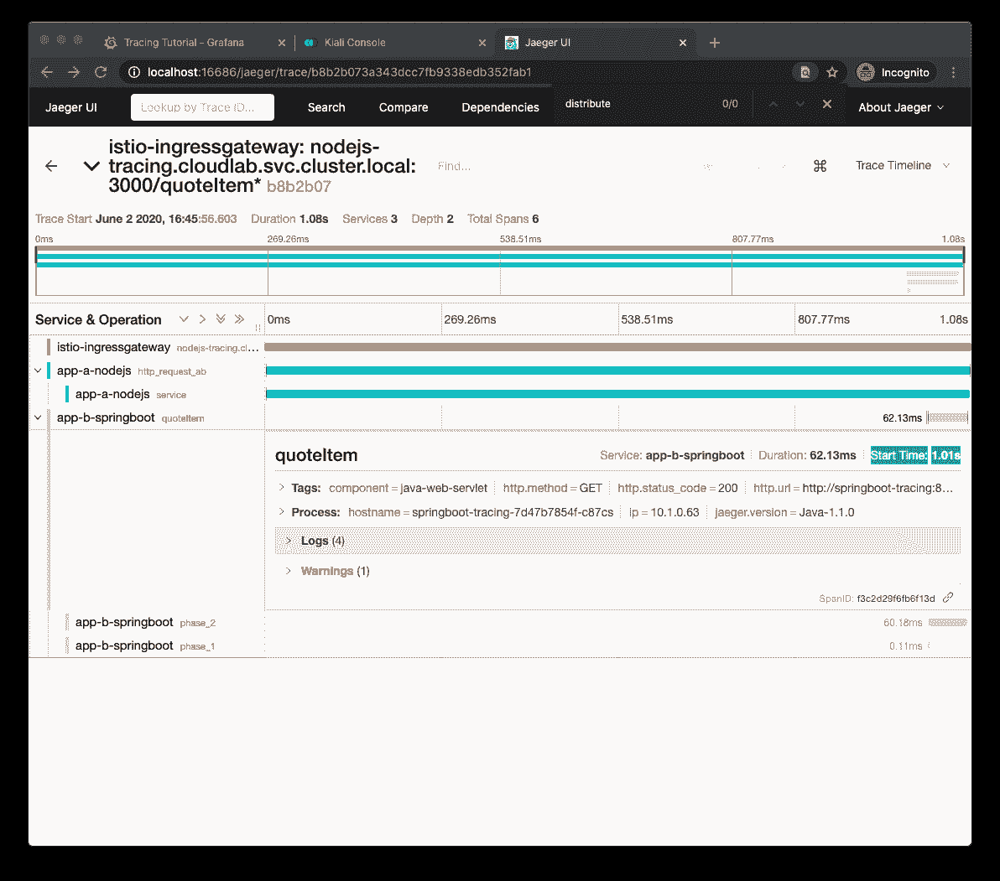

# Archived | 针对微服务的分布式跟踪，第 2 部分

> 原文：[`developer.ibm.com/zh/tutorials/distributed-tracing-for-microservices-part-2/`](https://developer.ibm.com/zh/tutorials/distributed-tracing-for-microservices-part-2/)

**本文已归档**

**归档日期：:** 2021-02-25

此内容不再被更新或维护。 内容是按“原样”提供。鉴于技术的快速发展，某些内容，步骤或插图可能已经改变。

本教程是由三部分组成的教程系列的第 2 部分，其介绍了如何将您在[第 1 部分](https://developer.ibm.com/zh/tutorials/distributed-tracing-for-microservices-1/)中创建的微服务部署在 Kubernetes 集群中的服务网格后面。然后，您可以使用流行的流量分析工具来观察和检查分布式服务的内部状态。本教程适用于熟悉分布式跟踪（使用 OpenTracing [OpenTracing](https://opentracing.io/) API 和 [Istio 服务网格](https://istio.io)）的概念的开发者。

如本教程的[第 1 部分](https://developer.ibm.com/zh/tutorials/distributed-tracing-for-microservices-1/)中所述，[Appsody](https://appsody.dev/) 是 [IBM Cloud Pak for Applications](https://www.ibm.com/cn-zh/cloud/cloud-pak-for-applications) 中包含的上游开源项目之一。在本教程系列中将使用此项目来加快创建和部署微服务。在本教程中，您将对现有的微服务进行检测，使其在通过 Istio 服务网格进行了扩充的 Kubernetes 集群中工作，并通过该微服务架构生成了一些流量。然后，您可以使用 Grafana、Kiali 和 Jaeger 等工具逐步了解整个系统的状态。


最终应用程序的副本将放在 [GitHub](https://github.com/IBM/icpa-opentracing) 中，您可以在整个教程中使用此副本作为参考。

## 与服务网格有关的内容

微服务的潜力完全取决于通信中的灵活性和弹性，因此可以引入和删除新服务或现有服务的新版本，而不会对整个系统造成负面影响。服务网格（如 [Istio](https://istio.io)）通常与微服务相配以调解它们之间的流量，从而注入诸如负载均衡、安全性和流量指标自动生成之类的功能。如果您不熟悉服务网格，并且想要在继续之前进一步了解服务网格，那么 [Red Hat 微服务主题](https://www.redhat.com/en/topics/microservices/what-is-a-service-mesh)页面是一个很好的起点，而 [Istio 概念](https://istio.io/docs/concepts/what-is-istio/)页面将这些概念扩展为 Istio 功能的更详细视图。如果您想在完成本教程后更深入地了解服务网格，那么可以尝试有指导的[服务网格实验](https://learn.openshift.com/servicemesh/)，其中的动手练习涵盖了从基础到高级的课程。

## 前提条件

*   [安装 Docker](https://docs.docker.com/get-started/)。如果您使用 Windows 或 macOS，那么 Docker Desktop 可能是最佳选择。如果使用 Linux 系统，那么 [minikube](https://github.com/kubernetes/minikube) 及其内部 Docker 注册表是备选项。
*   [安装 Appsody CLI](https://appsody.dev/docs/getting-started/installation)。
*   如果您无权访问 Kubernetes 或 OpenShift 集群，请在本地安装 Kubernetes。[Minikube](https://github.com/kubernetes/minikube) 可在大多数平台上运行，但如果您使用的是 Docker Desktop，那么从 Docker Desktop Preferences (macOS) 或 Settings 面板 (Windows) 中启用的内部 Kubernetes 是一种更方便的选择。

## 预估时间

满足这些前提条件后，您应该可以在 1 小时内完成本教程。

## 步骤

本教程的步骤分为两大组：首先构建并检测基本的微服务应用程序，然后逐步在 Istio 服务网格中完成更复杂的部署。使用服务网格反映了生产环境中更常见的部署拓扑，尤其是当您将 Appsody 与项目 Kabanero(`https://kabanero.io`)（IBM Cloud Pak for Applications 的上游开源项目）的其他组件结合使用时。执行以下步骤来完成本教程：

1.  设置本地开发环境
2.  部署服务网格
3.  为微服务创建名称空间
4.  为微服务创建 Docker 镜像
5.  创建应用程序配置
6.  配置 sidecar 注入
7.  标记工作负载
8.  部署微服务
9.  为应用程序创建入口路由
10.  检查遥测
11.  拆除部署

### 1\. 设置本地开发环境

如果您完成了本教程系列的[第 1 部分](https://developer.ibm.com/zh/tutorials/distributed-tracing-for-microservices-1/)，那么可以直接导出 `tutorial_dir` 环境变量：

```
export tutorial_dir=<same location where you started the first part of the series> 
```

如果您跳过了本教程系列的第 1 部分，请克隆[此 GitHub 存储库](https://github.com/IBM/icpa-opentracing.git)并通过输入以下命令来导出 `tutorial_dir` 环境变量：

```
git clone https://github.com/IBM/icpa-opentracing.git
cd icpa-opentracing
export tutorial_dir=$(PWD) 
```

### 2\. 部署服务网格

本教程针对前面步骤中完成的微服务架构使用 Istio 作为服务网格。

由于 Istio 中也使用了 *sidecar* 架构模式，因此可以将新流量调解容器添加到正在运行服务的每个 pod 中，这意味着微服务不需要更改即可受益于服务网格功能。

后续步骤假定您使用的是 Istio *演示*配置文件，该配置文件将添加到 minikube 上或添加到与 Docker Desktop 捆绑在一起的 Kubernetes 集群中。虽然可以使用其他提供者，但是 Istio 演示配置文件中提供的所有内容的安装涉及面非常广，并且已经超出了本教程的范围。

如果您遵循了使用 minikube 或与 Docker Desktop 捆绑在一起的 Kubernetes 集群的建议，请继续遵循 [Istio 安装说明](https://istio.io/docs/setup/getting-started/)（总结如下）。

**要点：**此 [Appsody 问题](https://github.com/appsody/appsody-operator/issues/227)当前会阻止使用 Istio 1.5 及更高版本，因此在修复该问题之前，请勿更新以下命令中的 `ISTIO_VERSION`：

```
curl -L https://istio.io/downloadIstio | ISTIO_VERSION=1.5.0 sh -
cd istio-1.5*
export PATH="$PATH:$(PWD)/bin"

istioctl verify-install

istioctl manifest apply \
  --set profile=demo \
  --set values.tracing.enabled=true \
  --set values.grafana.enabled=true \
  --set values.kiali.enabled=true 
```

输出应类似于以下文本：

```
Detected that your cluster does not support third party JWT authentication.Falling back to less secure first party JWT.See https://istio.io/docs/ops/best-practices/security/#configure-third-party-service-account-tokens for details.
- Applying manifest for component Base...
✔ Finished applying manifest for component Base.
- Applying manifest for component Pilot...
✔ Finished applying manifest for component Pilot.
- Applying manifest for component EgressGateways...
- Applying manifest for component IngressGateways...
- Applying manifest for component AddonComponents...
✔ Finished applying manifest for component EgressGateways.
✔ Finished applying manifest for component IngressGateways.
✔ Finished applying manifest for component AddonComponents.

✔ Installation complete 
```

### 3\. 为微服务创建名称空间

本教程将在目标集群中创建多个资源，最好是将这些资源与容器中可能存在的其他资源分离开。通过在命令行终端中输入以下命令，为本教程创建一个名为 `cloudlab` 的新名称空间：

```
kubectl get namespace cloudlab || \
kubectl create namespace cloudlab 
```

### 4\. 为微服务创建 Docker 镜像

在部署微服务之前，请求为每个微服务构建 Docker 镜像。在此步骤中，您可以复用本教程第 1 部分中的命令行或创建新的命令行。

假设已将环境变量 `tutorial_dir` 设置为首次启动本教程时用于创建 `jaeger.properties` 文件的目录，请在命令行终端中输入以下命令：

```
cd "${tutorial_dir}"
cd nodejs-tracing
appsody build 
```

```
cd "${tutorial_dir}"
cd springboot-tracing
appsody build 
```

```
cd "${tutorial_dir}"
cd jee-tracing
appsody build 
```

在构建完所有镜像后，请检查以下命令的输出：

```
docker images dev.local/* 
```

您应该会看到如下结果：

```
REPOSITORY                     TAG                 IMAGE ID            CREATED             SIZE
dev.local/nodejs-tracing       latest              597adcbeb47e        3 minutes ago       192MB
dev.local/springboot-tracing   latest              c2ccb43475e1        4 minutes ago       412MB
dev.local/jee-tracing          latest              138f3c5276d6        4 minutes ago       708MB 
```

此外，您应该可以在每个项目的根目录下找到一个新的 `app-deploy.yaml` 文件。此部署文件包含 `AppsodyApplication` 定义（如 [Appsody Operator GitHub](https://github.com/appsody/appsody-operator/tree/master/doc) 页面中所详述）。

本教程提供了一些有关修改该文件的说明，但如果您打算进一步自定义微服务部署，那么可以参考 [Appsody Operator User Guide](https://github.com/appsody/appsody-operator/blob/master/doc/user-guide.md)。

### 5\. 创建应用程序配置

使用与本教程第 1 部分的 `jaeger.properties` 中类似的 Jaeger 配置设置来[创建 ConfigMap](https://kubernetes.io/docs/tasks/configure-pod-container/configure-pod-configmap/#create-a-configmap)：

```
cat <<EOF | kubectl apply -n cloudlab -f -
apiVersion: v1
kind: ConfigMap
metadata:
  name: jaeger-config
data:
  JAEGER_ENDPOINT: http://jaeger-collector.istio-system.svc.cluster.local:14268/api/traces
  JAEGER_PROPAGATION: b3
  JAEGER_REPORTER_LOG_SPANS: "true"
  JAEGER_SAMPLER_PARAM: "1"
  JAEGER_SAMPLER_TYPE: const
EOF

kubectl get configmap jaeger-config -n cloudlab -o yaml 
```

将新的 `ConfigMap` 添加到应用程序中，将 `envFrom` 片段插入到每个应用程序的 `app-deploy.yaml` 文件的 `spec` 部分中，如下所示：

```
spec:
...
  envFrom:
  - configMapRef:
      name: jaeger-config
  ... 
```

### 6\. 配置 sidecar 注入

Istio sidecar 是 Istio 在整个环境中添加的代理，可在微服务执行流量管理功能之前拦截微服务之间的通信。您可以在 [Istio sidecar 配置](https://istio.io/docs/reference/config/networking/sidecar/)页面中阅读有关所有可能性的更多信息。本教程重点介绍了该代理将跟踪工具添加到 pod 内的应用程序中的能力。

可以使用两种方法将 Istio sidecar 注入到应用程序中：

1.  使用 `istio kube-inject` 命令。
2.  对添加到名称空间的所有应用程序启用 sidecar 自动注入功能。

第二个选项对于本教程来说更容易实现，因为它只需在终端中输入更少的指令。

在 Istio 文档的[安装 Sidecar](https://istio.io/docs/setup/additional-setup/sidecar-injection/) 部分中介绍了如何启用自动注入功能。该文档主要介绍如何将标签 `istio-injection=enabled` 注释添加到要自动注入 Istio sidecar 的名称空间。在命令行中输入以下指令：

```
kubectl label namespace cloudlab istio-injection=enabled 
```

您可以通过输入以下命令来验证结果：

```
kubectl get namespace -L istio-injection 
```

将 `sidecar.istio.io/inject` 注释添加到每个应用程序的 `app-deploy.yaml` 文件的 `metadata.annotations` 部分中。

```
metadata:
  annotations:
    ...
    sidecar.istio.io/inject: "true"
    ...
  ...
... 
```

注意，即使为目标名称空间启用了自动注入功能，也可以将 `sidecar.istio.io/inject` 注释设置为 `"false"` 以关闭个别应用程序的注入功能。

（可选）在 `app-deploy.yaml` 中将 `service.type` 值替换为 `ClusterIP`。此更改将移除微服务的外部端口，从而确保没有端口会意外绕过 Istio 流量管理。

### 7\. 标记工作负载

Istio 提供了一些必须在部署中进行设置的标签，用于向服务网格指示应用程序的名称和版本。

在 Istio 文档的 [Pod 和服务](https://istio.io/docs/ops/deployment/requirements/)页面中定义了这些标签。将以下标签添加到 `nodejs-tracing` 应用程序的 `app-deploy.yaml` 文件：

```
metadata:
  ...
  labels:
     app: nodejs-tracing
     version: v1
     ...
... 
```

最后一个必需标签是 [protocol selection](https://istio.io/docs/ops/configuration/traffic-management/protocol-selection/) 字段，它可将流量类型分类为 HTTP 流量：

```
spec:
  service:
    ...
    portName: http 
```

### 8\. 部署微服务

到目前为止，您对集群和每个应用程序的部署描述符进行了以下更改：

*   创建了用于部署应用程序的名称空间 (`cloudlab`)。
*   对该名称空间启用了 Istio sidecar 自动注入功能。
*   创建了一个包含 Jaeger 端点信息的 `ConfigMap` 资源。
*   在每个应用程序的 `app-deploy.yaml` 部署描述符中添加了 `envFrom` 条目来引用 `ConfigMap` 资源。
*   已向每个应用程序的 `app-deploy.yaml` 部署描述符中的 `service` 添加了 `sidecar.istio.io/inject` 注释。
*   向每个应用程序的 `app-deploy.yaml` 部署描述符的 `metadata` 部分添加了 `app` 和 `version` 标签，并向 `service` 部分添加了 `portName` 字段。

如果已进行了这些更改并将环境变量 `tutorial_dir` 设置为首次启动本教程时所用的目录，请在命令行终端中输入以下命令：

```
cd "${tutorial_dir}"
cd nodejs-tracing
appsody deploy --namespace cloudlab 
```

```
cd "${tutorial_dir}"
cd springboot-tracing
appsody deploy --namespace cloudlab 
```

```
cd "${tutorial_dir}"
cd jee-tracing
appsody deploy --namespace cloudlab 
```

具体来说，对于实际部署，*sidecar 注入*意味着 Istio 向运行微服务的每个 pod 都添加一个代理容器。本教程中，这是在注入前查看正在运行的容器的极佳时刻。在命令行终端中输入以下指令：

```
kubectl get pods -n cloudlab -l app.kubernetes.io/managed-by=appsody-operator 
```

您应该会看到类似于以下文本的输出（每个 pod 内都有两个容器，这表明已添加了 sidecar）：

```
NAME                                  READY   STATUS    ...
jee-tracing-6cd5784b57-hm65c          2/2     Running   ...
nodejs-tracing-5cf9f655db-kl4gl       2/2     Running   ...
springboot-tracing-5f7b7fb74f-hzxl5   2/2     Running   ... 
```

#### 在应用程序级别注入 sidecar 的注意事项

前面的部分已经对名称空间中的所有部署启用了 sidecar 注入功能。您可能有充分的理由避免引入该默认行为，并对各个应用程序单独应用检测。为了便于您参考，您可以对在部署后具有 Istio sidecar 的基于 Appsody 的应用程序进行检测：

```
application_name=<<name of your Appsody application, such as "nodejs-tracing" >>
kubectl get deployment ${application_name}  -o yaml | istioctl kube-inject -f - | kubectl apply -f - 
```

注意，`kube-inject` 命令将直接在集群中修改部署描述符，而原始的 `app-deploy.yaml` 文件保持不变。对 `appsody deploy` 的后续调用将覆盖这些修改。

#### （可选）跟踪微服务日志

您可以在三个单独的终端窗口中输入以下命令，以在继续学习本教程的其余部分时跟踪每个应用程序的控制台输出：

```
kubectl logs -n cloudlab -f -l app.kubernetes.io/name=nodejs-tracing --all-containers | grep -vi "live\|ready\|inbound\|metrics" 
```

```
kubectl logs -n cloudlab -f -l app.kubernetes.io/name=springboot-tracing --all-containers | grep -vi "live\|ready\|inbound" 
```

```
kubectl logs -n cloudlab -f -l app.kubernetes.io/name=jee-tracing --all-containers | grep -vi "live\|ready\|inbound" 
```

### 9\. 为应用程序创建入口路由

将事务发送到 Node.js 微服务之前的最后一步是配置 Istio `Gateway` 和 `VirtualService` 资源以将流量路由到应用程序：

```
cat <<EOF | kubectl apply -n cloudlab -f -
apiVersion: networking.istio.io/v1alpha3
kind: Gateway
metadata:
  name: tutorial-gateway
spec:
  selector:
    istio: ingressgateway # use istio default controller
  servers:
  - port:
      number: 80
      name: http
      protocol: HTTP
    hosts:
    - "*"
---
apiVersion: networking.istio.io/v1alpha3
kind: VirtualService
metadata:
  name: tutorial-service
spec:
  hosts:
  - "*"
  gateways:
  - tutorial-gateway
  http:
  - match:
    - uri:
        prefix: "/quoteOrder"
    rewrite:
      uri: "/node-jee"
    route:
    - destination:
        host: nodejs-tracing
  - match:
    - uri:
        prefix: "/quoteItem"
    rewrite:
      uri: "/node-springboot"
    route:
    - destination:
        host: nodejs-tracing
EOF 
```

注意，将 `/node-springboot` 和 `/node-jee` 虚拟端点重新映射到 `VirtualService` 中的 `/quoteItem` 和 `/quoteOrder`。这说明了如何对微服务端点进行重组而不必考虑这些端点在原始应用程序中的命名方式。

现在发出以下命令几次：

```
curl localhost/quoteItem
curl localhost/quoteOrder 
```

也可以使用以下内容来使这些命令连续运行：

```
while true; do
  curl -s localhost/quoteItem; sleep 2
  curl -s localhost/quoteOrder; sleep 2
done 
```

### 10\. 检查遥测

您可以在通过与 Istio 捆绑在一起的任何遥测附加组件处理请求时，验证从应用程序收集的跟踪数据的结果。

#### 使用 Grafana 查看 Istio 仪表板

[Grafana](https://grafana.com/) 是市场上最出色的分析和监视工具之一，并与 Istio 部署捆绑在一起。Grafana 仪表板通常是观察应用程序生成的数据的最重要的途径。您可以使用 Grafana 仪表板查看本教程中生成的一些数据。

首先，通过在命令行中输入以下指令来启动 Grafana 仪表板：

```
istioctl dashboard grafana & 
```

在默认浏览器中显示 Grafana 用户界面 (UI) 的新选项卡后，在导航栏上选择 **Explore**。通过单击 **Dashboards** 菜单并选择 **Manage**，检查某些预打包的 Istio 仪表板。

在出现的 **Manage** 选项卡中，单击 **istio** 文件夹，然后选择 **Istio Service Dashboard**。在呈现仪表板后，在 **Service** 字段中选择 `nodejs-tracing.cloudlab.svc.cluster.local`，然后按 Enter 键。根据前面各节中仍在产生的流量，您应该会看到如下屏幕：


#### 使用 Grafana 浏览指标

在介绍如何参考 Istio 服务网格指标来构建仪表板的练习中，单击 **Explore** 菜单，然后在标记有 `<Enter a PromQL query>` 的字段中输入以下 [PromQL 查询](https://prometheus.io/docs/prometheus/latest/querying/basics/)：

```
avg by (destination_service_name, destination_version, response_code)(rate(istio_requests_total{destination_service_namespace="cloudlab"}[5m])) 
```

本教程并不是 PromQL 的入门，但您可以按照如下方式阅读查询的细分：*Istio 网格中每个服务的平均请求率，这些请求以 5 分钟为时间间隔进行分组，然后按服务名称、服务版本和 HTTP 响应代码进行分组。*

下图中出现的可视化是观察在成功响应与失败响应之间拆分的请求量的简单有效的方法。


如果您在图表中看不到某些响应错误（这是预期结果，因为教程中的步骤序列会一直等到所有微服务都启动并运行后才执行），那么可以模拟系统崩溃，这样所有 pod 会同时重新启动。

如果您让 `while` 循环在后台运行并将请求发送到 Node.js 应用程序，请使用 Istio [故障注入](https://istio.io/docs/tasks/traffic-management/fault-injection/)支持来模拟系统崩溃。

通过为 `jee-tracing` 微服务创建 Istio `VirtualService` 来注入故障：

```
cat <<EOF | kubectl apply -n cloudlab -f -
apiVersion: networking.istio.io/v1alpha3
kind: VirtualService
metadata:
  name: jee-tracing
spec:
  hosts:
  - jee-tracing
  http:
  - fault:
      abort:
        httpStatus: 502
        percentage:
          value: 70
    route:
    - destination:
        host: jee-tracing
  - route:
    - destination:
        host: jee-tracing
EOF 
```

将立即进行此更改，在从 Node.js 应用程序传入的调用中有 70% 的调用会生成 HTTP `502` 网关错误。

单击标题上的手动刷新图标，您应该会看到一些新错误显示在图形中。

#### （可选）使用 Grafana 查看导入仪表板

在 Grafana 仪表板的最后一个练习中，您可以导入和研究[本教程的 GitHub 存储库](https://github.com/IBM/icpa-opentracing/blob/master/grafana/GrafanaTutorialDashboard.json)中包含的仪表板。

再次从导航菜单中选择 **Dashboards**，单击 **Manage**，然后单击 **Import**。在 Import 窗格中，将该文件的内容粘贴到表单中，然后单击 **Load**，这将显示类似于以下截屏的仪表板：


#### 使用 Kiali 查看微服务连接

[Kiali](https://docs.openshift.com/container-platform/latest/service_mesh/service_mesh_arch/ossm-kiali.html) UI 通过显示服务网格中的微服务及其连接方式来提供可视性。

您可以使用[网络配置说明](https://istio.io/docs/tasks/observability/gateways/#option-2-insecure-access-http)将 Kiali UI 公开给本地主机中的固定端口，但是使用 `istioctl dashboard` 命令会更方便一些。

在命令行界面中输入以下指令：

```
istioctl dashboard kiali 
```

将在默认 Web 浏览器中以选项卡形式打开该仪表板。 默认用户和密码为 `admin:admin`。

在您处于 Kiali UI 中后，在导航窗格中浏览可视化。本教程重点介绍了 Graph 视图，您可以在其中查看在本教程中创建的微服务的拓扑。

打开该 Graph 视图，然后在 **Namespace** 字段中选择 `cloudlab`，这与本教程中使用的 Kubernetes 名称空间匹配。您应该会看到与以下示例类似的视图：


注意，由于 [Appsody 问题](https://github.com/appsody/appsody-operator/issues/227)，可视化的侧边窗格中仍缺少某些特定于 HTTP 的数字。但是，您可以发现服务网格的潜力，它可以帮助您了解应用程序拓扑，以及各个服务中的流量分配的数量和可靠性。

#### 使用 Jaeger 对其他跨度实现可视化

本教程的第 1 部分已经介绍了 Jaeger UI，因此，本部分将只重点介绍如何对 Istio 向整个分布式事务引入的其他[跨度](https://opentracing.io/docs/overview/spans/)实现可视化。

使用以下命令启动 Jaeger UI：

```
istioctl dashboard jaeger 
```

在 Service 菜单中选择 `istio-ingressgateway`，单击 **Find Traces**，然后单击某个跟踪，这应该会显示如下屏幕：


在此跟踪中，您可以看到 Istio 将流量管理注入到业务事务中的点，并在此过程中调解入站流量和组件间流量。

在对系统进行的最后一处修改中，您可以使用 Istio 的故障注入支持来引入微服务响应延迟。这对于研究整个系统对给定组件响应速度慢的容忍度很有用。

通过为 `springboot-tracing` 微服务创建 Istio `VirtualService` 来注入延迟：

```
cat <<EOF | kubectl apply -n cloudlab -f -
apiVersion: networking.istio.io/v1alpha3
kind: VirtualService
metadata:
  name: springboot-virtual-service
spec:
  hosts:
  - springboot-tracing
  http:
  - fault:
      delay:
        fixedDelay: 1s
        percentage:
          value: 50
    route:
    - destination:
        host: springboot-tracing
  - route:
    - destination:
        host: springboot-tracing
EOF 
```

搜索与名为 `quoteItem` 的操作相关的跟踪，并注意其中有 50% 的跟踪所用的时间都超过 1 秒钟。展开其中一个跟踪，并注意从服务 *A* 到服务 *B* 的调用（由 Spring Boot 应用程序执行）的延迟：



另一种类型的故障注入是在服务请求的响应中模拟故障。当您尝试了解部分中断期间的系统行为时，这也很有用。

通过在名称空间中创建另一个 Istio `VirtualService` 对象，将故障注入 `jee-tracing` 微服务中：

```
cat <<EOF | kubectl apply -n cloudlab -f -
apiVersion: networking.istio.io/v1alpha3
kind: VirtualService
metadata:
  name: jee-virtual-service
spec:
  hosts:
  - jee-tracing
  http:
  - fault:
      abort:
        httpStatus: 502
        percentage:
          value: 80
    route:
    - destination:
        host: jee-tracing
  - route:
    - destination:
        host: jee-tracing
EOF 
```

搜索与名为 `quoteOrder` 的操作相关的跟踪，并注意现在其中有 80% 的跟踪都带有 Error 标记。展开其中一个跟踪，并注意在对 `jee-tracing` 应用程序端点的调用结果中是否存在 HTTP 状态代码 `"502"`：


这些示例概述了使用 Jaeger 控制台了解服务间的通信并对其进行故障排除的过程。

### 11\. 拆除部署

要删除在本教程中创建的所有内容，请从包含每个应用程序的目录中输入以下指令：

```
kubectl delete namespace cloudlab 
```

如果在本教程中部署了 Istio，那么可以通过在命令行终端中输入以下指令来从集群中将其移除：

```
kubectl delete namespace istio-system 
```

## 结束语

您以本教程系列第 1 部分的分布式跟踪示例为基础，将其插入 Kubernetes 集群内运行的服务网格中。在此过程中，您还探索了与 Istio 服务网格捆绑在一起的核心监视仪表板，并使用这些仪表板来分析发送到分布式跟踪数据库和 Prometheus 遥测数据库的流量。

*   在本教程系列的第 3 部分中将会利用此基础，在通过最少的修改量将服务部署到 OpenShift 安装时，完成整个开发周期以创建可观察且可部署在实际环境中的云原生微服务。

## 后续步骤

*   了解其他 [Istio 遥测附加组件](https://istio.io/docs/tasks/observability/gateways/)。
*   尝试 Istio 中的其他[流量管理](https://istio.io/docs/tasks/traffic-management/)功能，例如，故障注入、流量转移和断路。
*   尝试[服务网格动手实验](https://learn.openshift.com/servicemesh/)，其中包含基本课程和高级课程的列表。

## API 参考

*   [跨度](https://opentracing.io/docs/overview/spans/)
*   [OpenTracing 语义规范](https://github.com/opentracing/specification/blob/master/specification.md)
*   [OpenTracing API Javadoc](https://javadoc.io/doc/io.opentracing/opentracing-api/latest/index.html)
*   [MicroProfile OpenTracing](https://github.com/eclipse/microprofile-opentracing)
*   [Java Spring Jaeger](https://github.com/opentracing-contrib/java-spring-jaeger)

## 致谢

感谢我的同事 Carlos Santana，他撰写的“[了解分布式跟踪 101](https://ibm-cloud-architecture.github.io/learning-distributed-tracing-101/docs/index.html)”教程非常精彩，为我撰写本教程的 Node.js 部分提供了极大的帮助。

感谢 Yuri Shkuro（Jaeger 之父）和 Junmin Liu，OpenTracing 教程的 [Node.js 章节](https://github.com/yurishkuro/opentracing-tutorial/tree/master/nodejs)能够如此精彩，离不开他们的帮助。

本文翻译自：[Distributed tracing for microservices, Part 2](https://developer.ibm.com/tutorials/distributed-tracing-for-microservices-part-2/)（2020-06-02）