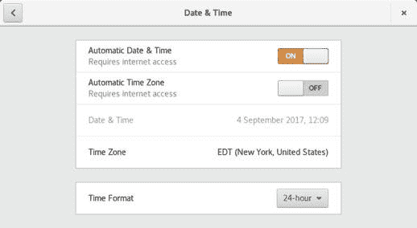
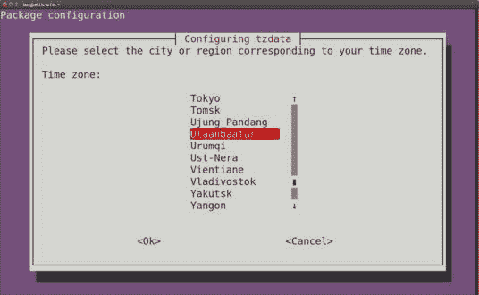
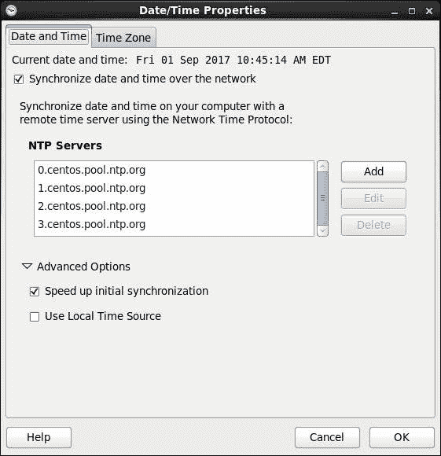

# 学习 Linux 101：维护系统时间

> 原文：[`developer.ibm.com/zh/tutorials/l-lpic1-108-1/`](https://developer.ibm.com/zh/tutorials/l-lpic1-108-1/)

## 概述

在本教程中，您将学习如何：

*   设置系统日期和时间
*   将硬件时钟设置为 UTC 的正确时间
*   配置正确的时区
*   执行基本 NTP 配置
*   使用 pool.ntp.org 服务
*   理解 `ntpq` 命令

## 进入系统时钟

以图形方式安装 Linux® 系统时，需要设置时钟并根据需求选择时区。您还可以选择使用网络时间协议 (NTP) 来自动设置时钟，而且可以选择让系统时钟使用协调世界时 (UTC)，而非本地时间。本教程将介绍如何深入图形界面，配置 Linux 系统中与时间相关的各个方面。

##### 关于本系列教程

本系列教程可帮助您学习 Linux 系统管理任务。您还可以使用这些教程中的资料来准备参加 [Linux Professional Institute 的 LPIC-1：Linux 服务器专业认证考试](https://www.lpi.org)。

参阅“ [*学习 Linux 101*：LPIC-1 学习路线图](https://developer.ibm.com/zh/tutorials/l-lpic1-map/)”，获得本系列中每个教程的描述和链接。这个路线图正在完善中，反映了 2015 年 4 月 15 日更新的 LPIC-1 V4.0 考试目标。在教程完成后，会将它们添加到路线图中。

本教程将帮助您为 Linux Server Professional (LPIC-1) 考试 102 的主题 108 中的目标 108.1 做好应考准备。该目标的权重为 3。

### 前提条件

要想最充分地利用本系列教程，您应该掌握 Linux 的基本知识，还应该有一个正常工作的 Linux 系统，您可以在这个系统上练习本教程中涵盖的命令。您应熟悉 GNU 和 UNIX® 命令。有时候，程序的版本不同会导致不同的输出格式，所以您的结果可能并不总是与这里显示的清单完全相同。

除非另有说明，否则本教程中的示例将使用运行 Wayland 的 Fedora 26 和运行 X11 的 Ubuntu 16.04 LTS 或 CentOS 6。

## 日期和时间

人类早在数千年前就发明了历法，主要是基于太阳和月亮的运动规律。自古以来，人们就使用日晷来记录一天中时间的流逝。有时还会通过敲钟来告知人们祈祷时间已到。机械钟的动力一直都是水、弹簧和钟摆等等。石英晶体振荡器的使用让钟表的精度大大提高。原子钟（由镱元素制成）是现在最精准的时钟。参考源由国家标准组织维护。现在使用 NTP 将时间从这些主要源传达至计算机。

## 显示并设置系统日期和时间

Linux 系统上的系统时间十分重要。Cron 和 anacron 工具根据时间执行任务，因此它们需要准确的时钟作为决策依据。大多数备份和恢复工具以及开发工具（例如 `make`）也依赖于可靠的时间度量。自 1980 年左右构建的计算机通常内置了某种时钟机制，而自 1984 年左右构建的大多数计算机已经有了持久的时钟机制，即使计算机关闭也能保持时间同步。

如果您的系统具备图形界面（例如 Wayland 或 X Window System），那么可以使用图形工具来显示或设定时钟。图 1 显示了来自 GNU 网络对象模型环境 (GNOME) 桌面的一个示例。

##### Figure 1\. 以图形方式更新日期和时间



在本教程的剩余部分中，我将介绍如何深入了解并使用命令行工具来管理时间和时区设置以及硬件时钟。

### 显示日期和时间

无论您居住在纽约、布达佩斯、纳霍德卡、乌兰巴托（以前称为 Ulan Bator）、曼谷还是堪培拉，大多数 Linux 时间计算都与协调世界时或 UTC 有关。清单 1 显示了如何使用 `date` 命令来显示当前日期和时间。默认显示始终为本地时间，即使硬件时钟保持为 UTC。使用 `-u` 选项来显示 UTC。除 UTC 外，`date` 命令还支持各种各样的输出格式。如果要了解有关各种日期格式的更多信息，可参阅 `date` 的手册页。

##### 清单 1\. 显示当前日期和时间

```
 [ian@atticf26 ~]$ date
Wed Sep  6 23:04:40 EDT 2017
[ian@atticf26 ~]$ date ‑u
Thu Sep  7 03:04:43 UTC 2017 
```

使用 `-d`（或 `--date`）选项显示某些特定时间（如下周二）或某个特定时区的日期。尽管目前仅限于与语言环境无关的格式，但输入格式十分灵活。如果需要，可使用 LC_TIME=C。清单 2 给出了几个示例。

##### 清单 2\. 显示其他日期和时间

```
 [ian@atticf26 ~]$ #Date tomorrow
[ian@atticf26 ~]$ date ‑d tomorrow
Fri Sep 15 13:33:10 EDT 2017
[ian@atticf26 ~]$ #Date 8 months ago ‑ note timezone
[ian@atticf26 ~]$ date ‑‑date "8 months ago"
Sat Jan 14 12:34:20 EST 2017
[ian@atticf26 ~]$ #Display it in French
[ian@atticf26 ~]$ LC_TIME=fr_FR date ‑‑date '8 months ago'
sam. janv.14 12:35:44 EST 2017
[ian@atticf26 ~]$ #French string doesn't work as input
[ian@atticf26 ~]$ date "$(LC_TIME=fr_FR date ‑‑date '8 months ago')"
date: invalid date ‘sam. janv.14 12:36:47 EST 2017’
ian@atticf26 ~]$ #Use LC_TIME=C
[ian@atticf26 ~]$ LC_TIME=fr_FR date ‑d "$(LC_TIME=C date ‑‑date '8 months ago')"
sam. janv.14 12:38:25 EST 2017 
```

使用 `date` 命令的输出格式选项来控制如何显示输出。清单 3 给出了几个示例。`Date` 命令的信息页中包含使用 `date` 命令的其他几个示例及更多信息。

##### 清单 3\. 日期输出格式

```
 [ian@atticf26 ~]$ #Date in ISO 8601 format
[ian@atticf26 ~]$ date "+%F"
2017‑09‑14
[ian@atticf26 ~]$ #Day of year (‘001’...‘366’)
[ian@atticf26 ~]$ date "+%j"
257
[ian@atticf26 ~]$ date ‑d "jan 1" "+%j"
001
[ian@atticf26 ~]$ #Next month's date, day of week and month name in German
[ian@atticf26 ~]$ LC_TIME=de_DE date ‑d "+1  month" "+%F %A %B"
2017‑10‑14 Samstag Oktober 
```

### 设置日期和时间

如果需要设置日期，可以将日期和时间字符串作为参数提供。要求的格式较为古老，即使是美国人也会觉得有些奇怪，世界其他地方的人感觉更是如此。您必须至少以 MMDDhhmm 格式指定月、日、小时和分钟，还可以附加两位或四位数的年份（CCYY 或 YY）以及可选的句点 (.)，后面跟上两位的秒数。清单 4 给出了一个将系统日期更改 5 分钟的示例。注意，您需要拥有根用户权限才能更改日期或时间。

##### 清单 4\. 设置系统日期和时间

```
 [root@atticf26 ~]##Show date in date input format
[root@atticf26 ~]#date +%m%d%H%M%Y.%S
091416592017.45
[root@atticf26 ~]##Add 5 minutes
[root@atticf26 ~]#date ‑d "+5 min" +%m%d%H%M%Y.%S
091417052017.08
[root@atticf26 ~]##Set time ahead by 5 minutes
[root@atticf26 ~]#date;date "$(date ‑d "+5 min" +%m%d%H%M%Y.%S)";date
Thu Sep 14 17:01:09 EDT 2017
Thu Sep 14 17:06:09 EDT 2017
Thu Sep 14 17:06:09 EDT 2017 
```

在 GNU 系统上，还可以使用 `date` 命令的 `-d` 选项可接受的日期字符串来设置系统时钟。使用 `-s`（或 `--set`）选项。例如，您可以通过以下命令将时钟设置为提前 5 分钟：
`date --set='+5 minutes'`
注意：`-S` 和 `-d` 选项均不接受上述 MMDDhhmm 格式。

## 将硬件时钟设置为 UTC

大多数 Linux 系统和其他主流操作系统实际上都有两个时钟。第一个是内部软件时钟，它通过对系统中断进行计数来驱动。系统负载较高或中断延迟所带来的变化可能会给此类时钟带来影响。第二个是硬件时钟，有时称为实时时钟 (RTC)，它通常绑在震荡的石英晶体上，每天只有几秒的误差。它会受到环境温度等变化的影响。系统通常会在启动时读取硬件时钟，然后使用软件时钟。您刚刚学到的 `date` 命令可用于设置软件时钟，而非硬件时钟。

注意：当系统关闭时，硬件时钟需要耗费电池电源来维持状态。这类电池一般是常见的纽扣电池。有些系统没有硬件时钟，但也可以运行 Linux，例如 Raspberry Pi。这类系统通常会连接到因特网来更新时间。我将在本教程的后面部分介绍有关因特网时间协议的更多内容。

如果运行的是专用 Linux 系统，通常要将硬件时钟设置为 UTC，但如果还启动了另一个操作系统（例如 Microsoft® Windows®），可能需要将硬件时钟设置为本地时间。大多数情况下，这对于 Linux 而言无关紧要，但硬件时钟不识别夏令时 (DST) 的情况除外。因此，如果进行 DST 更改时 Linux 系统未运行，那么系统下次启动时可能会关闭时间，除非启用了自动时区设置。

如果使用 NTP，在首次安装系统时设置硬件时钟，便可一劳永逸。如果不是，本教程的这一部分将介绍如何显示和设置硬件时钟（如有）。

`Hwclock` 命令（无任何选项）可显示硬件时钟的当前值。清单 5 中显示了系统时钟和硬件时钟的当前值。

##### 清单 5\. 系统和硬件时钟值

```
 [root@atticf26 ~]#date;hwclock
Fri Sep 15 11:52:21 EDT 2017
2017‑09‑15 11:47:22.224275‑0400 
```

注意，这两个值相差 5 分钟。使用 `date` 命令更新系统时间时，硬件时钟不会受到影响。因此出现了 5 分钟的差值。

您可以使用 `hwclock` 命令的 `-w` 或 `--systohc` 选项从系统时钟同步到硬件时钟，也可以使用 `--set` 或 `--hctosys` 选项从硬件时钟同步到系统时钟，如清单 6 中所示。

##### 清单 6\. 从硬件时钟设置系统时钟

```
 [root@atticf26 ~]#date;hwclock;hwclock ‑s;date
Fri Sep 15 11:54:28 EDT 2017
2017‑09‑15 11:49:29.557339‑0400
Fri Sep 15 11:49:31 EDT 2017 
```

您可以将 `--set` 选项和 `--date` 选项一起使用，然后通过一个日期字符串，为硬件时钟指定一个绝对或相对日期。

设置硬件时钟时，指定 `--utc` 选项可将硬件时钟保持为 UTC，或指定 `--localtime` 选项可将硬件时钟保持为本地时间。如果均未指定，那么该值将从 /etc/adjtime（如果该文件存在）的第三行获取。

Linux 内核拥有一种模式，可以每隔 11 分钟将系统时间复制到硬件时钟。这个模式默认为关闭状态，但可通过 NTP 开启。运行以传统方式设置时间的任何命令（例如 hwclock –hctosys`hwclock--hctosys`）会关闭此模式，因此使用 NTP 时最好不要干扰 NTP 的工作。参阅 `adjtimex` 的手册页，了解如何查看时钟是否每隔 11 分钟更新一次。您可能需要安装 adjtimex 包，因为它不会总是默认安装。

`hwclock` 命令可以持续跟踪对硬件时钟所做的更改，以补偿时钟频率的不准确性。必要的数据点保存在 /etc/adjtime 中，这是一个 ASCII 文件。如果没有使用 NTP，可以使用 `adjtimex` 命令来补偿时钟漂移。否则，NTP 将大约每 11 分钟调整一次硬件时钟。除了显示硬件时钟为本地时间还是 UTC 外，/etc/adjtime 中的第一个值还将显示每天的硬件时钟漂移量（按秒计算）。清单 7 给出了一个示例。

##### 清单 7\. /etc/adjtime 显示时钟漂移和本地时间或 UTC

```
 [[ian@atticf26 ~]$ cat /etc/adjtime 
0.000000 1504469764 0.000000
1504469764
UTC 
```

注意，本系统将硬件时钟保持为 UTC。

## 配置时区

时区是对本地时间与 UTC 的差值的度量。有关可配置的可用时区的信息保存在 /usr/share/zoneinfo 中。传统上，/etc/localtime 是指向此目录树中某个时区文件的链接，例如 /usr/share/zoneinfo/Eire 或 /usr/share/zoneinfo/Australia/Hobart。某些系统（例如 Ubuntu）会使用该文件的副本，而非链接。

许多国家/地区或区域还会使用夏令时。每年不同地方的夏令时日期更改可能各不相同。因此，让时钟相对于 UTC 的设置保持正确变得相当复杂。

另一文件 /etc/timezone 传统上是指向 /etc/default/init 的链接，用于设置时区环境变量 `TZ` 和一些与语言环境相关的环境变量。您的系统中可能存在也可能不存在此文件。如果存在，它可能只包含当前时区的名称。最后，某些系统在 /etc/sysconfig/clock 中也包含时区信息。

清单 8 给出了 Ubuntu 16.04 系统上的 /etc/timezone 和 /etc/localtime 链接。

注意：Fedora 系统没有 /etc/timezone 文件。

##### 清单 8\. /etc 中的时区信息

```
 ian@attic‑u16:~$ #Ubuntu 16.04 LTS
ian@attic‑u16:~$ cat /etc/timezone 
America/New_York
ian@attic‑u16:~$ ls ‑l /etc/localtime 
lrwxrwxrwx 1 root root 36 Dec 23  2016 /etc/localtime ‑> /usr/share/zoneinfo/America/New_York 
```

要正确设置时区，需要了解相应的时区名称。使用 `txselect` 命令以交互方式确定时区名称，如清单 9 中所示。

##### 清单 9\. 以交互方式使用 tzselect

```
 ian@attic‑u16:~$ tzselect
Please identify a location so that time zone rules can be set correctly.
Please select a continent, ocean, "coord", or "TZ".
 1) Africa
 2) Americas
 3) Antarctica
 4) Asia
 5) Atlantic Ocean
 6) Australia
 7) Europe
 8) Indian Ocean
 9) Pacific Ocean
10) coord ‑ I want to use geographical coordinates.
11) TZ ‑ I want to specify the time zone using the Posix TZ format.
#? 4
Please select a country whose clocks agree with yours.
 1) Afghanistan    18) Israel      35) Palestine
 2) Armenia          19) Japan            36) Philippines
 3) Azerbaijan          20) Jordan            37) Qatar
 4) Bahrain          21) Kazakhstan        38) Russia
 5) Bangladesh          22) Korea (North)        39) Saudi Arabia
 6) Bhutan          23) Korea (South)        40) Singapore
 7) Brunei          24) Kuwait            41) Sri Lanka
 8) Cambodia          25) Kyrgyzstan        42) Syria
 9) China          26) Laos            43) Taiwan
10) Cyprus          27) Lebanon            44) Tajikistan
11) East Timor          28) Macau            45) Thailand
12) Georgia          29) Malaysia            46) Turkmenistan
13) Hong Kong          30) Mongolia            47) United Arab Emirates
14) India          31) Myanmar (Burma)        48) Uzbekistan
15) Indonesia          32) Nepal            49) Vietnam
16) Iran          33) Oman            50) Yemen
17) Iraq          34) Pakistan
#? 30
Please select one of the following time zone regions.
1) Mongolia (most areas)
2) Bayan‑Ölgii, Govi‑Altai, Hovd, Uvs, Zavkhan
3) Dornod, Sükhbaatar
#? 1

The following information has been given:

    Mongolia
    Mongolia (most areas)

Therefore TZ='Asia/Ulaanbaatar' will be used.
Local time is now:     Sat Sep 16 11:16:34 ULAST 2017.
Universal Time is now:     Sat Sep 16 02:16:34 UTC 2017.
Is the above information OK?
1) Yes
2) No
#? 1

You can make this change permanent for yourself by appending the line
    TZ='Asia/Ulaanbaatar'; export TZ
to the file '.profile' in your home directory; then log out and log in again.

Here is that TZ value again, this time on standard output so that you
can use the /usr/bin/tzselect command in shell scripts:
Asia/Ulaanbaatar 
```

现在已经知道了您所在的时区，您可以按清单 9 中所示的输出末尾所述，为单个用户更改时区。如果要更改系统时区，那么针对不同的系统类型有不同的方法，我将在下面介绍。

对于基于 Debian 的系统（例如 Ubuntu），建议方法是使用 dpkg-reconfigure tzdata `dpkg-reconfiguretzdata`，它会通过交互式对话首先询问所在大洲，然后询问要为其设置时区的城市。清单 10 显示了将我的 Ubuntu 系统时区重置为 Asia/Ulaanbaatar 后的控制台输出，以及 /etc/timezone 和 /etc/localtime 的值。图 2 显示了部分对话。

##### 清单 10\. 使用 dpkg-reconfiguretzdata

```
 ian@attic‑u16:~$ sudo dpkg‑reconfigure tzdata

Current default time zone: 'Asia/Ulaanbaatar'
Local time is now:      Sat Sep 16 12:04:45 ULAST 2017.
Universal Time is now:  Sat Sep 16 03:04:45 UTC 2017.

ian@attic‑u16:~$ cat /etc/timezone
Asia/Ulaanbaatar
ian@attic‑u16:~$ ls ‑l /etc/localtime 
lrwxrwxrwx 1 root root 36 Sep 16 12:04 /etc/localtime ‑> /usr/share/zoneinfo/Asia/Ulaanbaatar 
```

##### Figure 2\. Selecting a city using dpkg-reconfigure tzdata



对于基于 RPM 但不使用 systemd 初始化的系统（例如 CentOS 6），可以手动更新 /etc/localtime。回想一下，这通常是指向 /usr/share/zoneinfo 树中某个文件的链接。此链接可以是硬链接，也可以是符号链接。如果 /etc 和 /usr 安装在同一文件系统上时，则只能是硬链接。如果查看长目录清单中时区文件的链接数，会发现许多时区已经有了多个链接。这些链接代表同一时区的不同名称，例如 /usr/share/zoneinfo/Asia/Calcutta 和 /usr/share/zoneinfo/Asia/Kolkata 是印度标准时间的两个名称。清单 11 浏览了我当前的时区，并显示了如何使用硬链接将其更改为 Kolkata 时间。

##### 清单 11\. 更新 /etc/localtime 的链接

```
 [root@attic4‑cent ~]##Display current localtime link
[root@attic4‑cent ~]#ls ‑l /etc/localtime
‑rw‑r‑‑r‑‑.4 root root 3519 Apr  3 10:15 /etc/localtime
[root@attic4‑cent ~]##What files are hard links to this?
[root@attic4‑cent ~]#find /usr/share/zoneinfo/ ‑samefile /etc/localtime
/usr/share/zoneinfo/America/New_York
/usr/share/zoneinfo/posixrules
/usr/share/zoneinfo/US/Eastern
[root@attic4‑cent ~]##Which files ahre Kolkata time?
[root@attic4‑cent ~]#find /usr/share/zoneinfo/ ‑samefile /usr/share/zoneinfo/Asia/Kolkata 
/usr/share/zoneinfo/Asia/Calcutta
/usr/share/zoneinfo/Asia/Kolkata
[root@attic4‑cent ~]##Verify only two hard links
[root@attic4‑cent ~]#ls ‑l /usr/share/zoneinfo/Asia/Kolkata
‑rw‑r‑‑r‑‑.2 root root 267 Apr  3 10:15 /usr/share/zoneinfo/Asia/Kolkata
[root@attic4‑cent ~]##Check current time
[root@attic4‑cent ~]#date
Tue Sep 26 15:16:21 EDT 2017
[root@attic4‑cent ~]##Backup localtime and set Kolkata time
[root@attic4‑cent ~]#mv /etc/localtime /etc/localtime.bak
[root@attic4‑cent ~]#ln /usr/share/zoneinfo/Asia/Kolkata /etc/localtime 
[root@attic4‑cent ~]##Check number of links and current time
[root@attic4‑cent ~]#ls ‑l /etc/localtime
‑rw‑r‑‑r‑‑.3 root root 267 Apr  3 19:45 /etc/localtime
[root@attic4‑cent ~]#date
Wed Sep 27 00:49:53 IST 2017 
```

对于基于 RPM 且使用 systemd 初始化的系统（例如 Fedora 26），使用本节中讨论的 `datetimectl` 命令。

## 配置网络时间协议

*Network Time Protocol* (*NTP*) 是一个通过网络同步计算机时钟的协议。同步的对象通常为 UTC。NTP V4 是一个在 RFC 5905 中制定的因特网标准。

时间同步通过向时间服务器发送消息来完成。有限数量的主服务器与国家标准时间源同步。辅助服务器从主服务器或其他辅助服务器获取时间。客户端系统从辅助服务器获取时间。高速 LAN 上的辅助服务器和客户机可精确到几百微秒。简单网络时间协议 (SNTP) 适用于配备单一参考时钟的主服务器，以及具有单一上游服务器且无从属客户端的客户机。完整 NTP 实现适用于具有多个上游服务器和多个下游服务器或客户机的辅助服务器。NTP 和 SNTP 服务器和客户机可互操作，也可混合使用。

一般操作是客户机向服务器发送一个包，并标记发送时间。服务器标记接收到包的时间，以及发送返回包的时间。客户机标记接收到响应的时间。然后客户机从总计往返时间中扣除服务器延迟。将一半往返时间假设为客户机时间和服务器时间的差值。因此，时间的准确性取决于网络延迟以及两个方向上延迟的一致程度。到达时间服务器的路径越短，时间可能越准确。

因特网上的计算机不计其数，因此时间服务器可组织成 *strata*。数量相对较少的 stratum 1 服务器保持与原子时钟等源同步得非常准确的时间。这些服务器通常为主服务器。数量较多的 stratum 2 服务器（辅助服务器）从 stratum 1 服务器获取时间，并将该时间提供给数量更多的 stratum 3 服务器，以此类推。[Pool.ntp.org](https://www.pool.ntp.org/) 项目是一个时间服务器虚拟集群，为大多数主流 Linux 发行版和许多联网设备提供默认的时间服务器。轮询 DNS 服务器通过将 NTP 服务器请求分发到多个可用服务器来实现 NTP 负载均衡。

NTP 配置和本节剩余部分中的示例将使用带有 upstart 系统初始化的 CentOS 6。许多系统（例如我的 Fedora 26 或 Ubuntu 16.04 LTS 工作站）使用 systemd 初始化，管理时间同步的方式有所不同，我将在下一节中展示。

如果使用图形界面，则可以使用类似图 3 中的对话框来设置 NTP 时间服务器。

##### Figure 3\. 以图形方式设置 NTP 服务器



NTP 配置信息保存在 /etc/ntp.conf 中，因此您也可以编辑此文件，并在保存后重新启动 ntpd 守护进程。清单 12 给出了使用图 3 中的时间服务器的一个示例 /etc/ntp.conf 文件。

##### 清单 12\. 示例 /etc/ntp.conf

```
 #For more information about this file, see the man pages
#ntp.conf(5), ntp_acc(5), ntp_auth(5), ntp_clock(5), ntp_misc(5), ntp_mon(5).

driftfile /var/lib/ntp/drift

#Permit time synchronization with our time source, but do not
#permit the source to query or modify the service on this system.
restrict default kod nomodify notrap nopeer noquery
restrict ‑6 default kod nomodify notrap nopeer noquery

#Permit all access over the loopback interface.  This could
#be tightened as well, but to do so would effect some of
#the administrative functions.
restrict 127.0.0.1 
restrict ‑6 ::1

#Hosts on local network are less restricted.
#restrict 192.168.1.0 mask 255.255.255.0 nomodify notrap

#Use public servers from the pool.ntp.org project.
#Please consider joining the pool (https://www.pool.ntp.org/join.html).
server 0.centos.pool.ntp.org iburst
server 1.centos.pool.ntp.org iburst
server 2.centos.pool.ntp.org iburst
server 3.centos.pool.ntp.org iburst 
```

您的发行版应该已设置主机名（例如 0.vendor.pool.ntp.org、1.vendor.pool.ntp.org、2.vendor.pool.ntp.org 和 3.vendor.pool.ntp.org），以便使用 pool.ntp.org 中的时间服务器。这些服务器可能分散在世界任何地方。NTP 旨在为您找到合适的服务器。

池中的每个主机名通常会解析为使用 IPV4 或 IPV6 协议的几个不同服务器。这些服务器会频繁变更以帮助均衡负载。清单 13 显示了我在特定时间运行命令并在几小时后再次运行命令时 2.centos.pool.ntp.org 的 DNS 响应。

##### 清单 13\. 轮询 NTP 服务器池

```
 [ian@attic4‑cent ~]$ #First query
[ian@attic4‑cent ~]$  dig 2.centos.pool.ntp.org  ANY +noall +answer

; <<>> DiG 9.8.2rc1‑RedHat‑9.8.2‑0.62.rc1.el6_9.4 <<>> 2.centos.pool.ntp.org ANY +noall +answer
;; global options: +cmd
2.centos.pool.ntp.org.    149    IN    AAAA    2001:67c:24c:1::21
2.centos.pool.ntp.org.    149    IN    AAAA    2620:10a:800f::13
2.centos.pool.ntp.org.    149    IN    AAAA    2001:628:21f0:80::80:160
2.centos.pool.ntp.org.    149    IN    AAAA    2001:bc8:2bf2:100::
2.centos.pool.ntp.org.    149    IN    A    88.99.87.132
2.centos.pool.ntp.org.    149    IN    A    195.154.253.69
2.centos.pool.ntp.org.    149    IN    A    5.20.0.20
2.centos.pool.ntp.org.    149    IN    A    193.225.126.78
[ian@attic4‑cent ~]$  dig 2.centos.pool.ntp.org  ANY +noall +answer

[ian@attic4‑cent ~]$ #A few hours later
; <<>> DiG 9.8.2rc1‑RedHat‑9.8.2‑0.62.rc1.el6_9.4 <<>> 2.centos.pool.ntp.org ANY +noall +answer
;; global options: +cmd
2.centos.pool.ntp.org.    149    IN    A    193.4.58.44
2.centos.pool.ntp.org.    149    IN    A    23.227.184.157
2.centos.pool.ntp.org.    149    IN    A    86.59.80.170
2.centos.pool.ntp.org.    149    IN    A    88.99.174.22
2.centos.pool.ntp.org.    149    IN    AAAA    2600:3c03::f03c:91ff:fe08:894c
2.centos.pool.ntp.org.    149    IN    AAAA    2600:3c03::f03c:91ff:fe6e:1470
2.centos.pool.ntp.org.    149    IN    AAAA    2a02:2290::16
2.centos.pool.ntp.org.    149    IN    AAAA    2a01:4f8:171:1e68::2 
```

### NTP 命令

`ntpdate` 命令可根据 NTP 时间服务器设置系统时间，如清单 14 中所示。如果 ntpd 服务已在运行，您会看到一个错误。在这种情况下，如我在此处所示，首先停止 ntpd 服务。

##### 清单 14\. 使用 ntpdate 根据 NTP 服务器设置系统时间

```
 [root@attic4‑cent ~]#ntpdate 2.centos.pool.ntp.org
18 Sep 21:50:37 ntpdate[11724]: the NTP socket is in use, exiting
[root@attic4‑cent ~]#service ntpd stop
Shutting down ntpd:                                          OK  [root@attic4‑cent ~]#ntpdate 2.centos.pool.ntp.org
18 Sep 21:50:56 ntpdate[11757]: step time server 192.154.108.74 offset 0.741883 sec
[root@attic4‑cent ~]##restart ntpd
[root@attic4‑cent ~]#service ntpd start
Starting ntpd:                                               OK 
```

现在不建议使用 `ntpdate` 命令。实际上，`man` 页面一般会显示：“适当停留后，ntpdate 程序将从此发行版中退出。”建议使用带有 `-q` 选项的 `ntpd` 命令来执行同等功能。这将启动 ntpd 守护进程，并在设置时钟后退出该进程。注意，如果 ntpd 守护进程已在运行，ntpd -q`ntpd-q` 将静默退出，并在 /var/log/messages 中留下一条失败消息，如清单 15 中所示。

##### 清单 15\. 使用 ntpd-q 设置系统时间

```
 [root@attic4‑cent ~]#service ntpd stop
Shutting down ntpd:                                          OK  [root@attic4‑cent ~]#ntpd ‑q
ntpd: time set +0.650151s
[root@attic4‑cent ~]#service ntpd start
Starting ntpd:                                               OK 
```

`ntpd` 命令使用来自 /etc/ntp.conf 的时间服务器信息，或命令行上提供的配置文件。参阅手册页了解更多信息和有关 `ntpd` 的详细信息。

另一条相关命令是 `ntpq`，该命令允许您查询 NTP 守护进程，主要用于调试目的。`-P` 选项便于输出 NTP 服务器目前已知的对等节点以及关于它们的一些基本信息。清单 16 给出了使用数字（点分十进制）格式的服务器名称的一个示例。参阅手册页了解更多详细信息。

##### 清单 16\. 使用 ntpq 列出对等时间服务器

```
 [root@attic4‑cent ~]#ntpq ‑pn
     remote           refid      st t when poll reach   delay   offset  jitter
==============================================================================
+129.250.35.251  249.224.99.213   2 u    2   64  377   20.071  275.063 393.086
*74.117.214.3    .PPS.            1 u   64   64  177   84.016  278.482 316.834
‑45.77.99.195    19.50.153.240    3 u    1   64  377   20.401  542.667 331.001
+152.2.133.53    .PPS.            1 u   62   64  177   20.886  150.999 386.669 
```

‘refid’ 列显示了对等节点正在使用的源，而 ‘st’ 列显示了该源的 stratum。’reach’ 是一个八进制数，表示查询成功次数，377 为最佳值。获取有关 NTP 调试的更多信息，可安装 ntp-doc 包。在我的 CentOS 6 系统上，此操作会安装一系列根目录位于 /usr/share/doc/ntp-4.2.6p5/html 的 HTML 文件。

## 使用 systemd 的时间和时区管理

与 Linux 的许多内部组件一样，如果您的系统使用 systemd 系统和服务管理器，那么我所介绍的一些信息会有所更改或替换。在最后一节中，我将介绍关于更改您应该了解的内容，尽管这些并不属于 2015 年 4 月的 LPI 目标的一部分。

本节中的示例来自 Ubuntu 16.04 LTS。

systemd 默认包含 systemd-timesyncd.service。您可以使用 `systemctl` 命令查看这些服务是否正在运行，如清单 17 中所示。

##### 清单 17\. 使用 systemctl status systemd-timesyncd.service

```
 iian@attic‑u16:~$ systemctl status systemd‑timesyncd.service
● systemd‑timesyncd.service ‑ Network Time Synchronization
   Loaded: loaded (/lib/systemd/system/systemd‑timesyncd.service; enabled; vendor preset: enabled
  Drop‑In: /lib/systemd/system/systemd‑timesyncd.service.d
           └─disable‑with‑time‑daemon.conf
   Active: active (running) since Mon 2017‑09‑18 22:24:50 EDT; 16h ago
     Docs: man:systemd‑timesyncd.service(8)
 Main PID: 751 (systemd‑timesyn)
   Status: "Synchronized to time server 91.189.89.198:123 (ntp.ubuntu.com)."
   CGroup: /system.slice/systemd‑timesyncd.service
           └─751 /lib/systemd/systemd‑timesyncd

Sep 18 22:24:50 attic‑u16 systemd[1]: Starting Network Time Synchronization...
Sep 18 22:24:50 attic‑u16 systemd[1]: Started Network Time Synchronization.
Sep 18 22:25:21 attic‑u16 systemd‑timesyncd[751]: Synchronized to time server 91.189.89.198:123 ( 
```

Systemd-timesyncd.service 可实现简单 NTP (SNTP) 客户机。systemd 移植指南建议系统从 pool.ntp.org 请求一个供应商 NTP 池，默认 NTP 服务器将在该池中进行编译。参阅 DISTRO_PORTING 文件（通常位于 /usr/share/doc/systemd/DISTRO_PORTING）。清单 18 中所示的小型配置文件允许您覆盖默认时间服务器，以及提供备份服务器。

##### 清单 18\. 使用 timesyncd.conf

```
 ian@attic‑u16:~$ cat /etc/systemd/timesyncd.conf
# This file is part of systemd.
#
# systemd is free software; you can redistribute it and/or modify it
# under the terms of the GNU Lesser General Public License as published by
# the Free Software Foundation; either version 2.1 of the License, or
# (at your option) any later version.
#
#Entries in this file show the compile time defaults.
#You can change settings by editing this file.
#Defaults can be restored by simply deleting this file.
#
#See timesyncd.conf(5) for details.

Time#NTP=
#FallbackNTP=ntp.ubuntu.com 
```

使用 `timedatectl` 命令与 systemd-timesyncd.service 交互。您可以使用 `timedatectl` 的 `status` 命令获取状态信息，如清单 19 中所示。

##### 清单 19\. 使用 timedatectl 获取状态信息

```
 ian@attic‑u16:~$ timedatectl status
      Local time: Tue 2017‑09‑19 15:18:05 EDT
  Universal time: Tue 2017‑09‑19 19:18:05 UTC
        RTC time: Tue 2017‑09‑19 19:18:05
       Time zone: America/New_York (EDT, ‑0400)
 Network time on: yes
NTP synchronized: yes
 RTC in local TZ: no 
```

其他 `timedatectl` 命令允许您设置时间或时区，以及列出可用时区。您还可以使用 `timedatectl` 启用或禁用 NTP 时间同步。

尽管 systemd-timesyncd.service 对于大部分系统来说已足够准确，但其准确性不及完整 NTP 守护进程。您可以在 timesyncd.conf 文件中使用特定服务器来提高准确性，或者也可以安装一个 NTP 守护进程，例如 openntpd。如果要这样做，您将需要禁用 systemd-timesyncd.service。另外，如果无意中停止了 ntpd 守护进程，不要使用 `timedatectl`。

对 Linux 上时间设置的介绍到此结束。过去要靠城市广场上的钟楼来看时间，而现在早已今非昔比。

本文翻译自：[Learn Linux, 101: Maintain system time](https://developer.ibm.com/tutorials/l-lpic1-108-1/)（2017-09-27）