# 在整个 API 生命周期内管理 API

> 原文：[`developer.ibm.com/zh/tutorials/create-and-manage-apis-using-api-connect/`](https://developer.ibm.com/zh/tutorials/create-and-manage-apis-using-api-connect/)

IBM API Connect for IBM Cloud 是一个集成的 API 管理产品，可在其中执行 API 生命周期中的所有步骤，包括创建、运行、管理和保护 API。使用 API Connect 服务，您可以通过一个安全的开发者平台轻松服务您的 API。开发者可以专注于 API，而将其他工作交给 API Connect 处理。

## 前提条件

*   [IBM Cloud 帐户](https://cloud.ibm.com/register?cm_sp=ibmdev-_-developer-tutorials-_-cloudreg)

*   创建一个 [API Connect 服务实例](https://cloud.ibm.com/catalog/services/api-connect?cm_sp=ibmdev-_-developer-tutorials-_-cloudreg)

## 预估时间

完成本教程大约需要 45 分钟。

## 步骤

## 第 1 步：在 IBM Cloud 上部署您的服务

可以使用任何编程语言（例如 Java、Node.js、JavaScript、PHP、Ruby 或 Python）来实现服务。在本教程中，我们将通过部署一项使用 Node.js 构建的服务来创建 API。

您可以在 IBM Cloud 上以多种方式部署服务。在本教程中，我们向您展示如何使用 Cloud Foundry 运行时以及使用 Kubernetes Service on IBM Cloud 来部署您的服务。

### 使用 Cloud Foundry 运行时在 IBM Cloud 上部署您的服务

1.  登录到您的 [IBM Cloud 帐户](https://cloud.ibm.com/login?cm_sp=ibmdev-_-developer-tutorials-_-cloudreg)。

2.  从导航菜单中选择 **Cloud Foundry > Overview**。

3.  向下滚动页面，然后在“Application Runtimes”部分中，选择您的运行时。对于本教程，我们选择 `.js` 运行时 (SDK for Node.js)。

4.  在服务创建页面上，提供所需的详细信息，然后单击 **Create** 按钮。

    服务将被创建，您可以通过单击 **Visit App URL** 链接来访问服务。

或者，如果您有应用程序代码，可以安装并使用 [Cloud Foundry 命令](https://cloud.ibm.com/docs/cli?topic=cloud-cli-getting-started)，然后使用以下命令推送应用程序（服务）。

```
 $ ibmcloud login        ## Login to IBM Cloud
  $ ibmcloud target --cf  ## Set the target Cloud Foundry org and space
  $ ibmcloud cf push      ## Push the application to IBM Cloud 
```

记下应用程序 URL。它将用作服务的端点，并将在 API Connect 中使用。

### 使用 IBM Kubernetes Service on IBM Cloud 部署您的服务

要在 Kubernetes 集群中部署您的服务，请遵循 [IBM Cloud Kubernetes 服务研讨会](https://github.com/IBM/kube101/tree/master/workshop)中的步骤：

1.  安装 [Lab 0](https://github.com/IBM/kube101/blob/master/workshop/Lab0) 设置中的 CLI 和插件。

2.  按照 [Lab 1](https://github.com/IBM/kube101/blob/master/workshop/Lab1) 说明中的步骤来创建和部署您的应用程序。

在 Kubernetes 上成功部署服务后，可以通过以下地址访问服务：

```
 http://<public-ip-of-kubernetes-cluster>:<port>/ 
```

此 URL 将用作服务的端点，并将在 API Connect 中使用。

## 第 2 步：使用 IBM API Connect 管理您的 API

IBM API Connect on IBM Cloud 在 API 生命周期内提供统一的用户体验，并通过设置不同级别的安全性和可见性来帮助您通过业务级控件创建和管理 API，同时与应用程序开发者共享 API。（您还可以使用 IBM Cloud Pak for Integration 中包含的 IBM API Connect 来管理您的 API。）

下图展示了共享 API 之前需要完成的工作流程步骤。

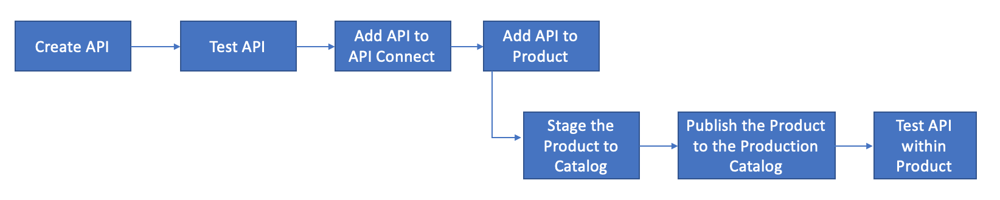

将 API 推送到 IBM Cloud 之后，您可以控制使用情况，提高采用率并跟踪 API 的统计信息。在步骤 1 中已经介绍了工作流程的前两个步骤。本节将帮助您了解如何使用 API Connect 执行工作流程的其他步骤。我们开始吧。

首先，创建 [API Connect 服务实例](https://cloud.ibm.com/catalog/services/api-connect?cm_sp=ibmdev-_-developer-tutorials-_-cloudreg)（如果还没有创建）。

在 IBM Cloud Dashboard 的 Cloud Foundry Services 列表中，单击 API Connect 服务实例。此时将显示 API Connect 仪表板。

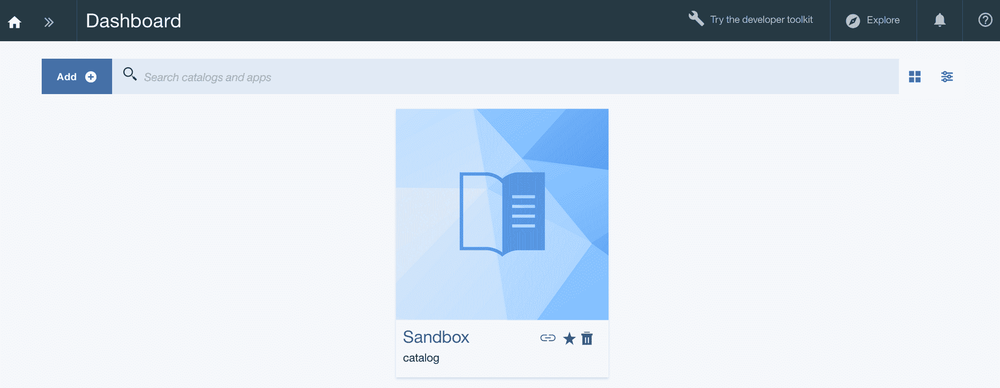

API Connect 仪表板显示默认提供的 `Sandbox` 目录。在本教程中，我们将使用 sandbox 目录来提供 API，但您也可以创建自己的目录。

### 识别 API Connect 中的端点 URL

1.  在 API Connect Dashboard 中，单击 Sandbox 目录。
2.  单击 **Settings**。
3.  单击 **Gateways**。

记下您的服务的 **Endpoint** URL。

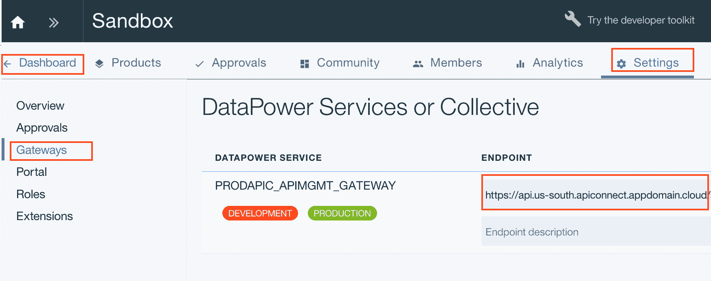

### 在 API Connect 中添加 API

1.  单击 Dashboard 选项卡。

2.  从 Home 图标旁边的 **>>** 按钮中，单击 **Drafts**。

3.  单击 APIs 选项卡。

4.  选择 **Add > New API**。

    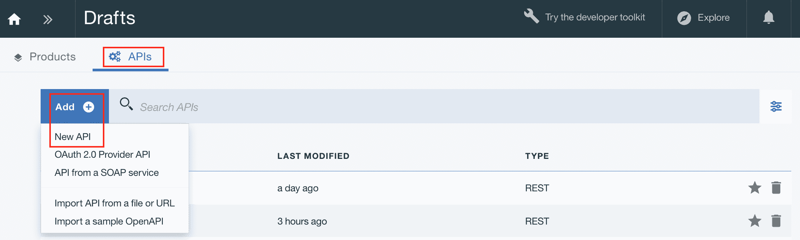

5.  提供 API 的所需详细信息。

    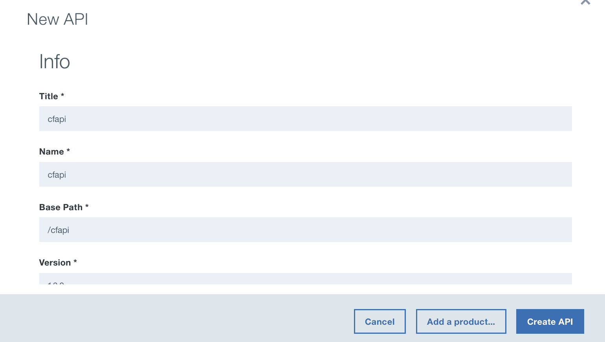

    展开 **Additional Properties**，然后在 **Security** 部分下面选择 **None**。

    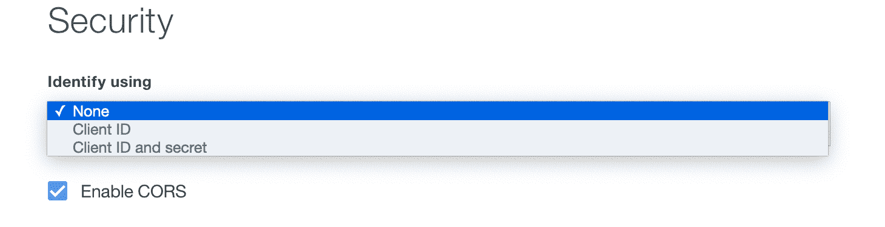

    在某些情况下，服务端不允许跨域请求，此时您也可以禁用 CORS。

    注意：对于安全性，另外两个可用的选项是 **Client ID** 和 **Client ID and Secret**。如果选择 **Client ID** 选项，那么需要创建 API 密钥安全性定义以指定凭据要求。如果选择 **Client ID and Secret** 选项，那么必须创建两个 API 密钥安全性定义，每种凭据类型对应一个定义。有关更多详细信息，参阅 [API Connect 文档](https://www.ibm.com/support/knowledgecenter/SSFS6T/com.ibm.apic.toolkit.doc/tapim_sec_api_config_scheme_create_apikey.html)。

6.  单击 **Create API**。API 将在 Drafts 页面中列出。

7.  单击您的 API，然后转到 Paths 部分。

    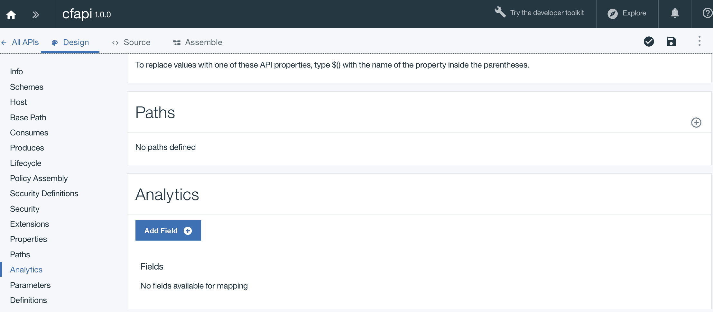

8.  添加路径。对于服务，路径添加为 `/path-1`。保存 API。

    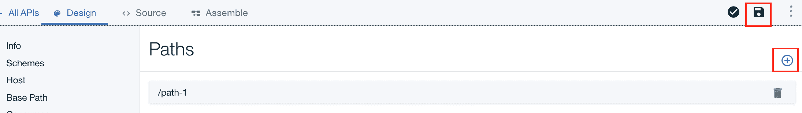

### 将服务绑定到 API

1.  单击 Assemble 选项卡。

2.  单击 `invoke` 节点。

3.  在屏幕右侧打开的面板中，提供以下信息，然后单击 **save the API**：

    *   提供您的服务 URL。
    *   提供您的服务的 HTTP 方法。 在本教程中是 `GET`。
    *   为缓存类型选择一个值。 在本教程中，我们使用了 `No cache`。
    *   其他可选参数使用默认值。

    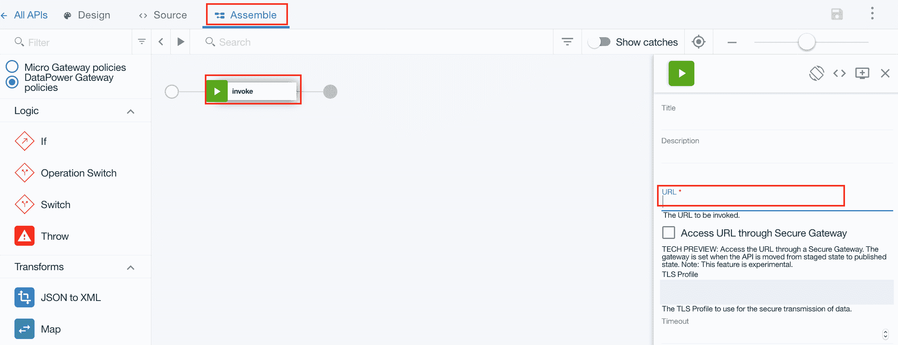

4.  单击 Design 选项卡。保存 API，并验证位于 Save 按钮附近的 API 设计。

### 在 API Connect 中添加产品

您将创建一个产品，用于将一组 API 收集到一个您可以提供给其他开发者使用的产品服务中。

1.  回到 Drafts 页面。

2.  单击 Products 选项卡。然后单击 **Add > New Product**。

    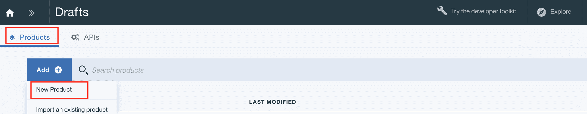

3.  指定标题、名称和版本，然后单击 **Create product**。

4.  单击您的产品。回到 APIs 部分。

    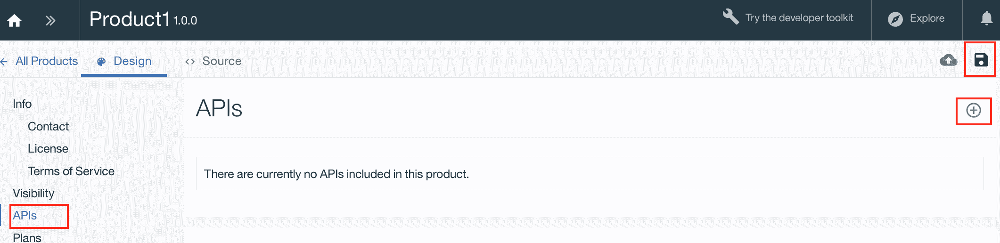

5.  单击位于 APIs 部分右上角的 Add API 按钮。从已保存 API 中选择要与该产品绑定的 API，然后单击 **Apply**。

6.  单击 **Save** 按钮。

7.  单击 Save 按钮旁边的 **Stage** 按钮。选择 `Sandbox` 目录。

    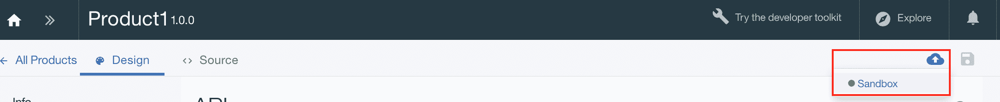

    在 Catalog Dashboard 中，产品将显示为 `Staged` 状态。

### 在 IBM Cloud 上发布产品

在将产品登台后，您需要将其发布。

1.  从 Home 图标旁边的 **>>** 按钮中，选择 Dashboard，然后单击 **Sandbox catalog**。

2.  选中已登台的产品，并使用右侧的三个点菜单发布该产品。

产品版本的可能生命周期状态为 `staged`、`published`、`deprecated`、`retired` 和 `archived`。产品管理操作将产品版本从一种生命周期状态转移到另一种生命周期状态。例如，Retire（引退）操作会将产品版本从 `published` 状态转为 `retired` 状态。

### 在 API Connect 中测试 API

1.  从 Home 图标旁边的 **>>** 按钮中，单击 **Drafts > APIs**。

2.  单击您的 API，然后单击 Assemble 选项卡。

3.  单击 **Search** 栏旁边的 **play** 按钮。

    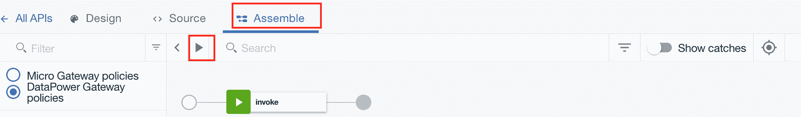

4.  在屏幕左侧的 Test 面板中，验证 Setup 部分中的信息。如果本节中显示的产品名称不是您要测试的产品名称，请单击 **Change Setup**，然后选择要测试的正确目录和产品名称。单击 **Next**。

5.  在 Operation 部分的下拉菜单中选择您的路径，然后单击 **Invoke**。

    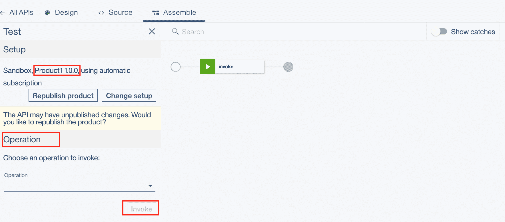

6.  在 Response 部分中，您将看到状态代码和响应时间，类似于以下屏幕截图：

    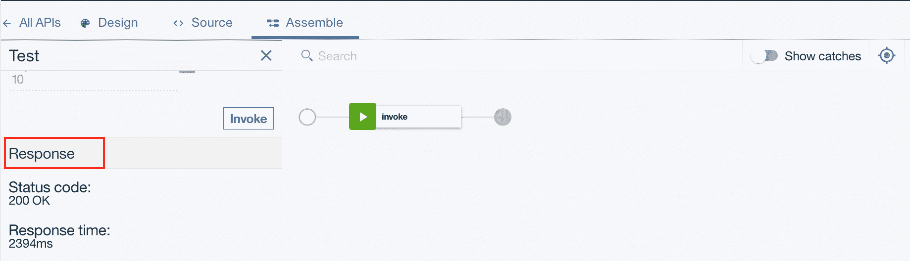

    状态码 `200` 表明已经成功调用了服务。

    有时，您可能会收到状态码为 `-1` 的响应，以及消息“*Causes include a lack of CORS support on the target server*”。如果在服务器（服务）和 API Connect 上启用了 CORS，那么 CORS 错误应该会消失。

### 共享 API 目标 URL

API 测试成功后，您可以与其他开发者共享服务的 API 目标 URL。

服务的 API 目标 URL 将遵循以下格式：

`https://<Endpoint URL of your API Connect>/<api name>/<path added>`

例如，我的服务的 API 目标 URL 如下：

`https://api.us-south.apiconnect.appdomain.cloud/xxxx/sb/cfapi/path-1`

## 结束语及后续步骤

您现在可以将许多服务连接到您的 API Connect 平台。在本教程中，我们只是创建了一个服务，将其绑定到 API Connect，对其进行了测试，并通过 API Connect 进行访问，而没有公开其实际端点。

下一步，您应该尝试通过 API Connect 保护您的 API。您可以在此[教程](https://developer.ibm.com/tutorials/securing-apis-oauth2-api-connect/)中了解如何使用 OAuth 2.0 保护 API。

本文翻译自：[Managing your APIs throughout the API lifecycle](https://developer.ibm.com/tutorials/create-and-manage-apis-using-api-connect/)（2020-04-30）