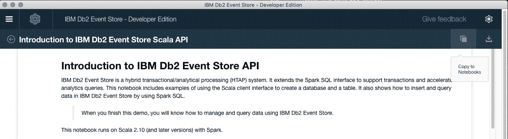
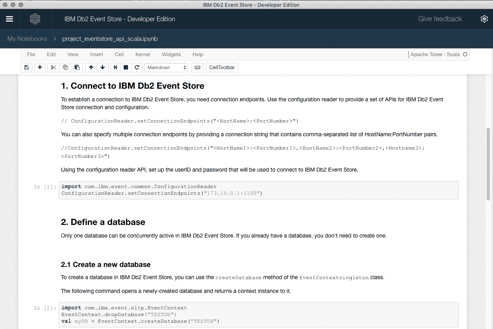
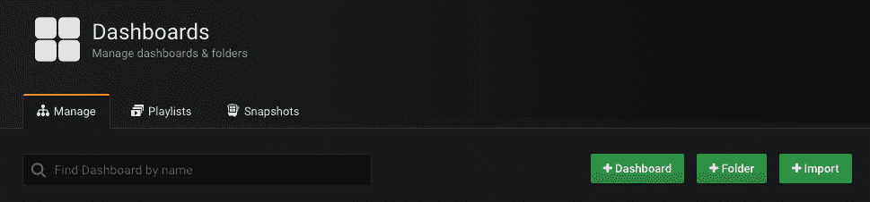
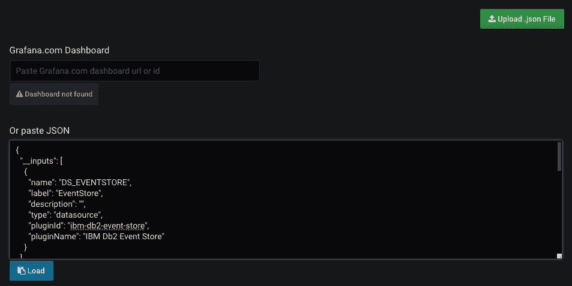
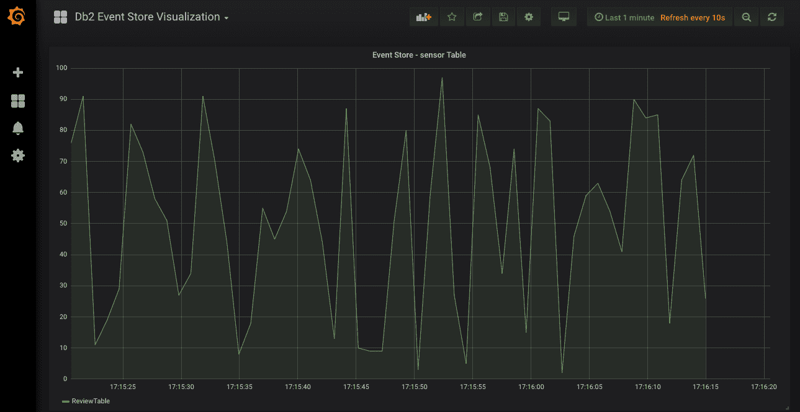

# 通过 Apache Kafka 将数据传输到 IBM Db2 Event Store 中

> 原文：[`developer.ibm.com/zh/tutorials/stream-and-visualize-data-with-the-ibm-db2-event-store/`](https://developer.ibm.com/zh/tutorials/stream-and-visualize-data-with-the-ibm-db2-event-store/)

IBM Db2 Event Store 是一种内存型数据库，旨在快速摄入和分析事件驱动应用程序中的流数据。它提供了一种快速数据结构，能够实时处理大量事件，并优化流数据性能，以便获得高级分析和可操作的洞察。

在本教程中，我们将运行一个在 IBM Db2 Event Store 之上编写的端到端应用程序。该应用程序代表一个简化的 IoT 用例，其中传感器数据被传输到 Event Store 并可视化。

## 您将学到的知识

除了运行 IBM Db2 Event Store 之外，您还将完成以下任务：

*   使用 sbt 运行一个 Scala 应用程序
*   创建一个 Kafka 集群
*   了解 IBM Db2 Event Store Scala API
*   安装并使用 Grafana

## 前提条件

在本教程中，我们将利用可在各种平台上使用的 Docker：Windows、MacOS 或 Linux。尽管本教程是基于 MacOS 而构建的，但可以轻松调整本教程，以适应 IBM Db2 Event Store Developer Editor 所支持的其他平台，无论是 Windows 还是 Linux。

具体来讲，需要满足以下要求：

*   IBM Db2 Event Store Developer Edition 1.1.4
*   sbt 0.13.16
*   Docker Version 18.06.1-ce-mac73 (26764)
*   运行 Docker 的足够 CPU 和内存，具体来讲至少需要 6 个 CPU 和 8 GB 内存。
*   [Grafana 5.3.2](https://grafana.com/grafana/download?platform=mac)

## 预估时间

完成本教程大约需要 1 小时。

## 步骤

**安装 IBM Db2 Event Store Developer Edition**

第一步是安装 IBM Db2 Event Store。Event Store 可作为 Desktop Electron App 在 Docker 上运行。

*   [下载特定于平台的最新安装程序](https://github.com/IBMProjectEventStore/EventStore-DeveloperEdition/releases)
*   备注：对于 MacOS，可在以下地方获取该文件：`https://github.com/IBMProjectEventStore/EventStore-DeveloperEdition/releases/download/1.1.4/IBM.Db2.Event.Store.-.Developer.Edition-1.1.4.dmg`
*   MacOS 或 Windows
*   启动安装程序（dmg 或 exe 格式）并接受所有默认设置
*   根据您的带宽，此操作可能会花一些时间

**安装依赖项**

在运行该应用程序之前，让我们首先安装 Kafka 和 Grafana 的流连接器。

**克隆适用于 Kafka 的 IBM Db2 Event Store 流连接器**

*   [安装 sbt V0.13.16](https://www.scala-sbt.org/download.html)
    *   通过修改 ‘/etc/paths’，可以选择将 sbt 添加到 ‘PATH’，以验证 SBT 是否与正确的 0.13.16 版本一致。

```
./bin/sbt sbt-version 
```

*   克隆适用于 Kafka 的 IBM Db2 Event Store 流连接器

```
git clone git@github.com:IBMProjectEventStore/db2eventstore-kafka.git
cd db2eventstore-kafka 
```

**安装 Grafana**

*   [安装 Grafana 5.3.2](https://grafana.com/grafana/download?platform=mac)

```
brew update
brew install grafana
brew services restart grafana 
```

*   安装适用于 Grafana 的 IBM Db2 Event Store 数据源

```
wget https://github.com/IBMProjectEventStore/db2eventstore-grafana/releases/download/ReactiveSummit2018/db2-event-store-grafana-1.1.tar
mkdir -p /usr/local/var/lib/grafana/plugins/db2-event-store
mv db2-event-store-grafana-1.1.tar /usr/local/var/lib/grafana/plugins/db2-event-store
cd /usr/local/var/lib/grafana/plugins/db2-event-store
tar -zxvf db2-event-store-grafana-1.1.tar
brew services restart grafana 
```

**编译适用于 Kafka 的 IBM Db2 Event Store 流连接器**

```
cd db2eventstore-kafka
sbt clean
sbt compile 
```

**初始化 IBM Db2 Event Store Developer Edition**

*   打开 IBM Db2 Event Store Developer Edition
    *   打开 Scala notebook“Introduction to IBM Db2 Event Store Scala API”
    *   选择图标“Copy to Notebooks”
    *   运行前两个单元来创建 TESTDB 数据库

在运行创建数据库的 Jupyter notebook 单元后，IBM Db2 Event Store 就可以供我们的传感器使用了。

 

*   通过 Grafana 仪表板运行 REST Server 初始化

这一步将初始化 Event Store 来支持 Grafana 数据源。它使得 IBM Db2 REST Server 能够接受外部请求。

```
curl -X POST -H "Content-Type: application/json" -H "authorization: Bearer token" 'http://0.0.0.0:9991/com/ibm/event/api/v1/init/engine?engine=173.19.0.1:1100&rContext=Desktop' 
```

终端将返回 {“code”:”ES100″,”message”:”Engine initialization succeeded”}

**Grafana 仪表板**

*   登录到 Grafana
    *   使用默认凭证“admin”和“admin”
*   向 IBM Db2 Event Store 添加一个新数据源
*   添加一个 Db2 Event Store 数据源
*   将主机端口更改为 9991
*   选择“Refresh”和“Save & Test”

**向 IBM Db2 Event Store 添加一个新数据源** 

打开提供的 JSON 仪表板 `./Db2 Event Store Visualization.json` 并将其内容复制到您的仪表板。

**通过粘贴该 JSON 来导入仪表板**  

**运行样本代码**

为了将数据摄入到 Event Store 中，我们首先将 JSON 有效负载分批发布到一个 Kafka 集群的主题中。流连接器 Event Store 扩展可以创建自己的本地 Kafka 集群，或者可以针对一个外部集群进行配置。

为了运行样本代码，我们将执行两个应用程序：

*   JSON 生成器 `dataLoad/run`。该生成器模拟一个受传感器驱动的最小有效负载，并将每批有效负载发布到一个 Kakfa 主题上
*   主要的流连接器组件 `eventStream/run`。该连接器利用 Spark 流和 Kakfa 集成库来使用 Kafka 消息，并使用可配置的批次大小将它们摄入到 Event Store 中。

*   运行适用于 Kafka 的 IBM Db2 Event Store 流连接器

    *   localBroker [Boolean]- true 表示使用一个内部的单节点 Kafka 代理。False 表示使用一个外部配置的代理

    *   kafkaBroker [String]- Kafka 代理的位置，为本地设置传入“localhost:9092”，为外部设置传入 ip:port 位置

    *   topic [String]- 将用于流的 Kafka 主题
    *   eventStore [String]- IBM Db2 Event Store 的 IP 配置
    *   database [String]- 将创建或使用的 Db2 Event Store 数据库
    *   user [String]- 将使用的 Db2 Event Store 用户名
    *   password [String]- 将使用的 Db2 Event Store 密码
    *   metadata [String]- 此 IoT 设备的元数据类型，例如“sensor”、“appliance”或“weatherstation”
    *   streamingInterval [Long]- Long 值定义了 Apache Spark 传输窗口的长度（以毫秒为单位）
    *   batchSize [Int] – 将发送到 IBM Db2 Event Store 的批次大小
*   运行 JSON 生成器

    *   localBroker [Boolean]- true 表示使用一个内部的单节点 Kafka 代理。False 表示使用一个外部配置的代理
    *   kafkaBroker [String]- Kafka 代理的位置，为本地设置传入“localhost:9092”，为外部设置传入 ip:port 位置
    *   tableName [String] – 将在 IBM Db2 Event Store 内创建的表名
    *   topic [String]- 将用于流的 Kafka 主题
    *   group [String]- 将用于流的 Kafka 组
    *   metadata [String]- 此模拟 IoT 设备的元数据类型，例如“sensor”、“appliance”或“car”等
    *   metadataId [Long]- 可标识此 IoT 设备的 Long 值，例如“238”或“002”等
    *   batchSize [Int]- 将发送给 Kafka 队列的批次大小。它最小可以为 1。

```
sbt "eventStream/run -localBroker true -kafkaBroker localhost:9092 -topic estopic -eventStore localhost:1100 -database TESTDB -user admin -metadata sensor -password password -metadata ReviewTable -streamingInterval 5000 -batchSize 10"
sbt "dataLoad/run -localBroker true -kafkaBroker localhost:9092 -tableName ReviewTable -topic estopic -group group -metadata sensor -metadataId 238 -batchSize 10" 
```

**可视化数据**

应用程序启动时，grafana 仪表板会开始可视化传入的传感器数据。

**传感器数据** 

**后续行动：了解 IBM Fast Data Platform**

IBM Db2 Event Store 支持存储库中提供了一个更完整的教程，包括一个可使用 IBM Fast Data Platform 部署的完整的端到端应用程序。[访问此高级教程](https://github.com/IBMProjectEventStore/db2eventstore-enablement/blob/master/Labs/Stream-ML-Visualize/README.md)。

**停止 IBM Db2 Event Store 并删除数据库**

要删除 IBM Db2 Event Store 数据库，请关闭 IBM Db2 Event Store Developer Edition 并发出以下命令：

```
docker stop $(docker ps -aq)
docker rm $(docker ps -aq)
cd ~/Library/Application\ Support/ibm-es-desktop
rm -rf zookeeper alluxio ibm 
```

## 结束语

在本教程中，我们首先安装了 IBM Db2 Event Store Developer Edition。接下来，我们生成了代表传感器有效负载的 JSON 有效负载，并在 Apache Kafka 集群上分批发布。在 Kafka 中提供这些有效负载后，我们使用了 Apache Spark Streaming 和 Kafka 集成来访问各批有效负载，并将它们摄入到 IBM Db2 Event Store 中。摄入到 IBM Db2 Event Store 中后，我们将 Grafana 连接到 IBM Db2 Event Store 的 REST 服务器，以便运行一些简单的谓词并将结果可视化。

## 参考资料

*   [Spark Streaming + Kafka 集成指南](https://spark.apache.org/docs/2.2.0/streaming-kafka-0-10-integration.html)
*   [Watson Studio](https://www.ibm.com/cloud/watson-studio)
*   [Watson Studio Local](https://www.ibm.com/support/knowledgecenter/SSAS34_current/local/welcome.html)
*   [快速数据](https://www.ibm.com/analytics/fast-data)
*   [Apache Spark](http://spark.apache.org)
*   [Apache Kafka](http://kafka.apache.org)
*   [Akka](https://akka.io)
*   [Grafana](https://grafana.com)

本文翻译自 [Stream data with Apache Kafka into the IBM Db2 Event Store](https://developer.ibm.com/tutorials/stream-and-visualize-data-with-the-ibm-db2-event-store/)(2018-12-10)