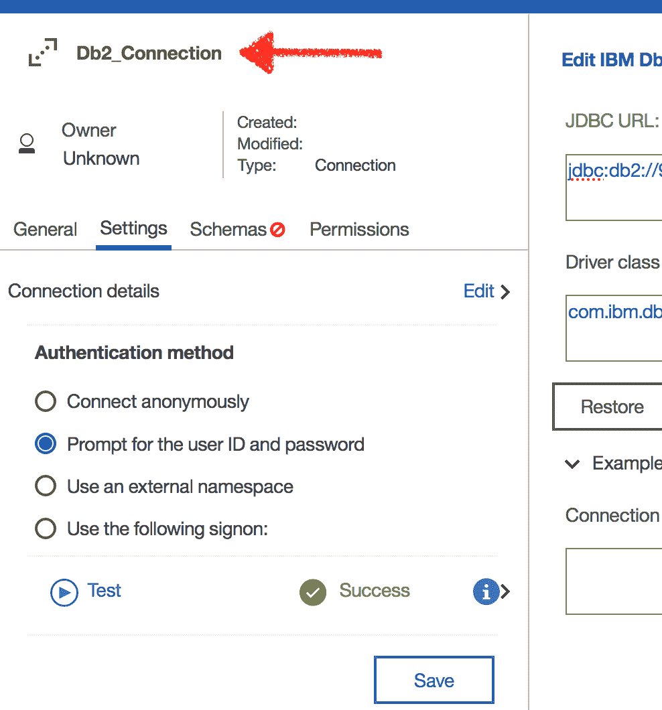
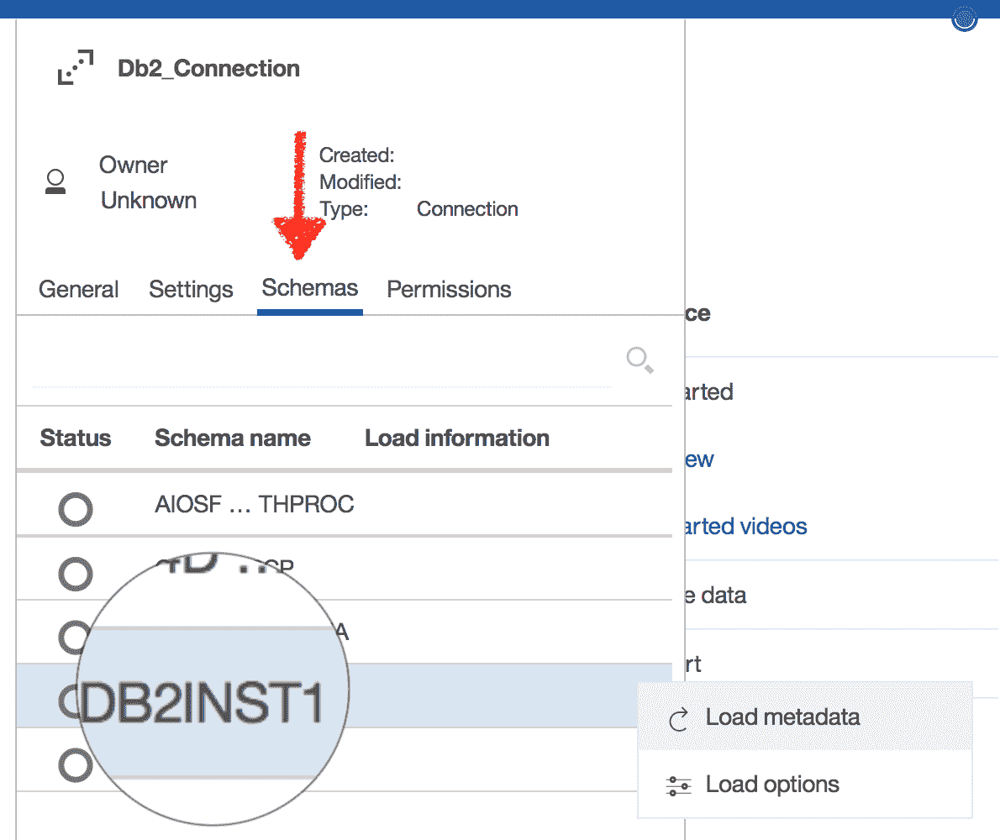
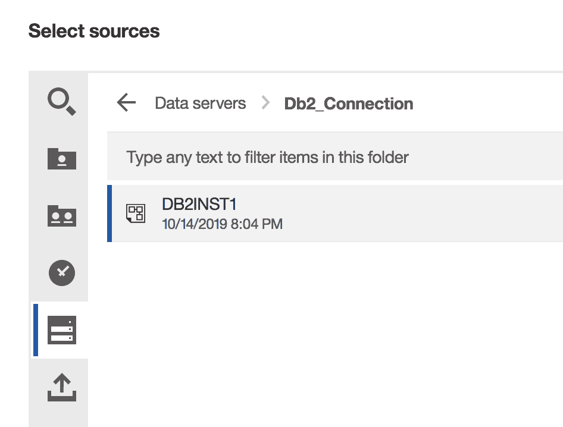
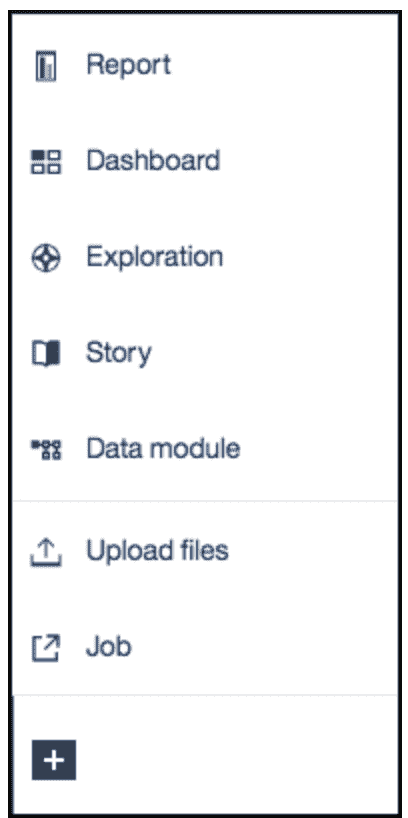

# 在 IBM Cloud Pak for Data 上的 Cognos Analytics 中构建仪表板

> 原文：[`developer.ibm.com/zh/tutorials/build-dashboards-in-cognos-analytics-on-ibm-cloud-pak-for-data/`](https://developer.ibm.com/zh/tutorials/build-dashboards-in-cognos-analytics-on-ibm-cloud-pak-for-data/)

本教程是使用 IBM Cloud Pak for Data、Data Virtualization、Watson OpenScale 和 Cognos Analyics 探索电信呼叫中断预测的系列教程的一部分。

| 级别 | 主题 | 类型 |
| --- | --- | --- |
| 101 | [在 IBM Cloud Pak for Data 上的 Cognos Analytics 中构建仪表板](https://www.ibm.com/developerworks/cn/analytics/library/build-dashboards-in-cognos-analytics-on-ibm-cloud-pak-for-data//index.html) | 教程 |
| 201 | [在 IBM Cloud Pak for Data 中使用 Watson OpenScale 监视机器学习模型](https://developer.ibm.com/cn/patterns/monitor-and-deploy-open-source-ml-models-with-wml-and-watson-openscale-on-icp4d) | Pattern |
| **201** | **[将多个分布式数据源作为一体进行查询：用于数据分析的数据虚拟化](https://www.ibm.com/developerworks/cn/analytics/library/query-across-distributed-data-sources-as-one-data-virtualization-for-data-analytics/index.html)** | **教程** |
| 301 | [使用 IBM Cloud Pak for Data 预测、管理和监视手机信号塔的呼叫中断](https://developer.ibm.com/cn/patterns/predict-manage-and-monitor-the-call-drops-of-cell-tower-using-cloud-pack-for-data/) | Pattern |

IBM Cloud Pak for Data 上的 IBM Cognos Analytics 集成了报告、建模、分析和探索功能，以便您可以了解自己组织的数据，并制定有效的业务决策。这是一个经过验证的、自助式的可靠分析解决方案，提供了可扩展性和分析治理方法。IBM Cognos Analytics 可以帮助您在不具备数据科学背景的情况下也可以实现可视化及创建仪表板。

借助 IBM Cloud Pak for Data 中的 IBM Cognos Analytics 附加组件，您可使用以下功能来更轻松地从相关数据中获得洞察：

*   自动准备数据
*   自动建模
*   自动可视化和仪表板
*   数据探索

通过该附加组件，您还可以使用可视化、仪表板、报告和交互式案例来与其他人共享您的发现结果。

在本教程中，我们将演示如何使用 IBM Cloud Pak for Data 上的 IBM Cognos Analytics 来创建仪表板。

**本教程考虑的场景：**

在本教程中，假设您是电信服务提供商，负责弄清楚所选信号塔为何经常发生呼叫中断。您需要了解呼叫中断的原因以及导致所选信号塔发生呼叫中断的因素。您将从 Python 模型输出中获得这些洞察。通过使用这些详细信息以及 IBM Cognos Analytics 仪表板功能，您应该能够构建一个可描绘未来 24 小时呼叫中断预测的仪表板。

## 学习目标

在完成本教程后，您将掌握如何：

*   在 IBM Cloud Pak for Data 上构建 IBM Cognos Analytics 仪表板。
*   在 IBM Cloud Pak for Data 上启动 IBM Cognos Analytics。
*   在 IBM Cloud Pak for Data 环境中导入和导出 IBM Cognos Analytics 仪表板二进制文件。

## 前提条件

*   [已启用 Cognos Analytics 的 IBM Cloud Pak for Data](https://www.ibm.com/support/producthub/icpdata/docs/content/SSQNUZ_current/com.ibm.icpdata.doc/zen/admin/install-cognos-analytics.html)

*   一个或多个 csv 文件（作为数据源）。**注意：**在本教程中，我们将使用以下内容进行演示：

    *   Telco_Time_Series_DataSet

## 预估时间

完成本教程大约需要 30 分钟。

## 步骤

### 第 1 步：启动 IBM Cloud Pak for Data 实例

*   要启动 IBM Cloud Pak for Data 实例，请使用实例 URL `CP4D`。

样本 URL 如下所示：`'https://IP:port/zen/#/gettingStarted'`

*   在使用凭证登录之后，您应该会看到下面的欢迎页面。

*   确保 IBM Cloud Pak for Data 版本为 2.1.0.2 或更高版本。

### 第 2 步：在 IBM Cloud Pak for Data 中打开 IBM Cognos Analytics 附加组件

要从 IBM Cloud Pak for Data 中打开 Cognos Analytics，请完成以下步骤：

*   在欢迎屏幕上，单击该附加组件图标。

*   单击导航菜单。在 Analytics 类别下，您应该会看到 Cognos Analytics 处于启用状态。如果该附加组件**未**启用，可使用此链接[在 IBM Cloud Pak for Data 上启用 IBM Cognos Analytics](https://www.ibm.com/support/producthub/icpdata/extend/com.ibm.icpdata.doc/zen/admin/install-cognos-analytics.html)。

仅当管理员配置了 Cognos Analytics 附加组件后，此工具才可用。

*   在选择 Cognos Analytics 后，单击浏览图标并打开 Cognos Analytics。

*   单击 `Provisioned instance` 下的 Cognos Analytics。

*   Cognos Analytics 欢迎界面类似于下面的截图。

### 第 3 步：连接到 Db2 或将 .csv 文件上载到 Cognos Analytics 以构建仪表板

*   让我们从获取本教程的数据开始。

**连接到 Db2 数据库（属于用于构建仪表板的 IBM Cloud Pak for Data 集群的一部分）**

*   从 Cognos Analytics 欢迎界面中转至 Manage，然后单击 ‘Data Server Connections’ 以创建到 Db2 数据库的新连接。

*   现在，单击数据服务器“+”图标以创建新的数据服务器连接。

*   选择类型 `IBM Db2`，然后编辑 JDBC 详细信息，并添加以下项的详细信息：

    *   HostName（即，属于 IBM Cloud Pak for Data 集群一部分的数据库服务器的 IP）
    *   Port
    *   DatabaseName

*   在 `Authentication method` 下，选中 `Prompt the user ID and password` 单选按钮，然后单击 `Test`。

*   现在，将提示您提供数据库凭证，如下面的截屏所示。提供数据库凭证。如果您遵循了 [Code Pattern](https://developer.ibm.com/cn/patterns/predict-manage-and-monitor-the-call-drops-of-cell-tower-using-cloud-pack-for-data)，那么应该会获得这些凭证。

*   根据命名约定，提供 Db2 连接名称。在成功连接后，会向数据库发送相应的消息，然后单击 save。

*   在同一个窗口的 Schemas 选项卡下，选择实际装入您数据的模式的名称。接下来，单击 `Load metadata`。在此例中，我们已在 `DB2INST1` 模式中装入数据。该模式下的所有数据库表及其元数据都将装入到 Cognos Analytics 内容存储库中。

**遵循以下步骤来创建数据模块，以使数据源可用于 Cognos Analytics 仪表板**

*   通过单击左下方屏幕上的 `+` 图标，从 Cognos Analytics 欢迎页面中启动 `Data Module`。参阅下面的截屏。

*   在 `Select Sources` 窗口下，单击 `Data Servers and Schemas` 选项卡。

*   现在，选择 `Db2_connection` 作为源（基于先前步骤创建的）。

*   选择 `DB2INST1` 模式，然后单击 OK。

*   现在，将表添加到要用于构建仪表板的数据模块中。单击 `Select tables` 图标，然后单击 `Next`。

*   选择表 `Times Series Data`，单击 `Refresh` 按钮，然后单击 OK。

*   已创建一个新的未保存数据模型，单击 `Save As`。

*   接下来，在 Team Content 选项卡下创建名为 `Data Module` 的新文件夹。

*   在 Data Module 文件夹下，将数据模块另存为 `TimeSeriesDataModule`

*   在创建完数据模块后，转至第 4 步（创建仪表板）。

注意：谨记，从仪表板添加数据源时，必须选择 `Team Content` 的 `Data Module` 文件夹下的源 `TimeSeriesDataModule`。

**将 .csv 文件上载到 Cognos Analytics 以构建仪表板**

1.  转至数据文件夹 `data/Telco_Time_Series_DataSet.csv`，并将文件下载到您的本地机器。

2.  您还可以单击 `New` 图标，然后单击 `Upload files`。

1.  转至 `Telco_Time_Series_DataSet.csv` 的保存位置并将其选中。

在成功上载该文件之后，您应该会看到与下面相同的界面。

1.  检查数据资产是否显示在 My content 文件夹中。

### 第 4 步：创建仪表板

*   在主页上，单击窗口底部的 `New` 图标，然后单击 `Dashboard`

*   您将看到一些预定义的模板，您可使用这些模板在仪表板上轻松排列和对齐可视化。

选择空白模板，然后单击 OK。

*   现在，将数据资产添加到该仪表板中，以便我们可以通过可视化来构建一些洞察。

    *   在 `Data` 面板中，单击 `Add a source` 图标。

    

    *   转至 My content 文件夹，然后选择 Telco_Time_Series_DataSet.csv。单击 Add。

        

    *   展开该数据资产以查看可用列。

    

**创建基于纬度和经度的地图：`Near by Towers - Call Drop Analysis`**

*   从数据源中选择 `lat` 和 `long` 列，然后将其拖放至左上方的窗格中。

    

*   展开图表以添加其他数据项。

    

*   现在，在标签、大小和颜色的 Latitude/Longitude 区域下，选择 `outgoing_site_id` 和 `Call Dropped` 字段。

*   接下来，最小化图表。

*   选择 Map 图表，然后单击 properties 图标以自定义该图表的属性。

*   按如下所示设置图表的属性，以实现更佳的可视化。

*   在 `General` 选项卡下，启用标题并将相应的标题添加到图表中。

**创建时间序列折线图：`24 Hour Call Drop Prediction`**

*   选择 Charts 图标，然后将其拖放至仪表板窗格中。

*   将 `Start_Time` 添加到 x 轴，将 `Predicted_Call_Drop_Perc` 添加到 y 轴，如以下截屏中所示。

*   现在，选择折线图并单击 properties 图标以自定义该图表，从而实现更佳的可视化。

**创建条形图：`Historical Trends - Call Drop by Weather & Traffic(Co-Relation)`**

*   选择 Bar chart 图标，然后将其拖放至仪表板窗格区域。参阅下面的截图。

*   将 `traffic` 列添加到 bars 字段，将 `Predicted_Call_Drop_Perc` 添加到 #Length 字段，如以下截图中所示。

## 样本输出

## 故障排除

*   如果用户尝试上载错误的文件（非 csv 文件），那么会看到以下错误。

    

要解决上述错误，请确保**仅**上载 csv 文件。

## 结束语

在本教程中，您学习了如何在 IBM Cloud Pak for Data 上使用 IBM Cognos Analytics 创建仪表板。数据和分析项目的典型流程通常始于了解数据、构建数据模型、构建 AI 或数据科学模型以及构建可视化（针对最终用户）以从数据中获取洞察。本教程向您展示了 IBM Cloud Pak for Data 中的 IBM Cognos Analytics 如何帮助您快速无缝地构建仪表板。

本文翻译自：[Build dashboards in Cognos Analytics on IBM Cloud Pak for Data](https://developer.ibm.com/technologies/analytics/tutorials/build-dashboards-in-cognos-analytics-on-ibm-cloud-pak-for-data)（2019-10-15）