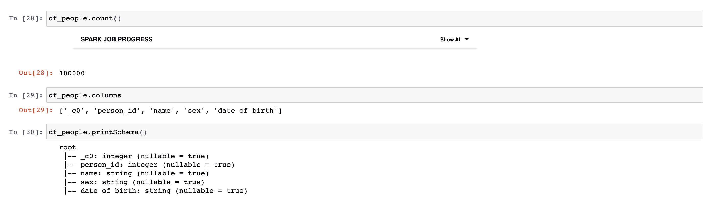

# PySpark 入门

> 原文：[`developer.ibm.com/zh/tutorials/getting-started-with-pyspark/`](https://developer.ibm.com/zh/tutorials/getting-started-with-pyspark/)

Apache Spark 是一个快速而强大的框架，它提供 API 来对弹性数据集执行大规模分布式处理。Spark 提供的主要抽象是弹性分布式数据集 (RDD)，RDD 是该引擎的基础和骨干数据类型。Spark SQL 是 Apache Spark 的一个模块，用于处理结构化数据，MLlib 是 Apache Spark 的可扩展机器学习库。Apache Spark 是用 Scala 编程语言编写的。为了支持 Spark 使用 Python，Apache Spark 社区发布了一个名为 PySPark 的工具。PySPark 的计算速度和能力与 Scala 相似。PySpark 是一个并行的分布式引擎，用于运行大数据应用程序。利用 PySPark，您可以使用 Python 编程语言来处理 RDDs。

本教程介绍了如何在 IBM® Watson™ Studio 中设置和运行 Jupyter Notebook。我们将使用两个不同的数据集：[5000_points.txt](https://s3.us.cloud-object-storage.appdomain.cloud/developer/default/tutorials/getting-started-with-pyspark/static/5000_points.txt) 和 [people.csv](https://s3.us.cloud-object-storage.appdomain.cloud/developer/default/tutorials/getting-started-with-pyspark/static/people.csv)。数据集包含对应的 [Notebook](https://s3.us.cloud-object-storage.appdomain.cloud/developer/default/tutorials/getting-started-with-pyspark/static/getting_started_with_pyspark.ipynb)。

## 学习目标

在本教程中，您将学习如何：

1.  使用 PySpark 执行大数据分析
2.  通过利用 Spark SQL 模块，将 sql 查询与 DataFrames 配套使用
3.  将机器学习与 MLlib 库一起使用

## 前提条件

要完成本教程，您需要一个 [IBM Cloud 帐户](https://cocl.us/IBM_CLOUD_GCG)。您可以获得一个免费的试用帐户，支持您访问 [IBM Cloud](https://cloud.ibm.com/login?cm_sp=ibmdev-_-developer-tutorials-_-cloudreg) 和 [IBM Watson Studio](https://www.ibm.com/cloud/watson-studio)。

## 预估时间

完成本教程大约需要 60 分钟。

## 步骤

### 创建 IBM Cloud Object Storage 服务

要在 Watson Studio 中创建项目，需要 Object Storage 服务。如果您尚未配置存储服务，请遵循以下步骤：

1.  在您的 IBM Cloud 帐户中，在 IBM Cloud Catalog 中搜索“object storage”。然后单击 **Object Storage** 卡片。

    

2.  选择 Lite 套餐，然后单击 **Create** 按钮。

    

### 创建 Watson Studio 服务

1.  在您的 IBM Cloud 帐户中，在 IBM Cloud Catalog 中搜索“watson studio”。然后单击 Watson Studio 卡片。

    

2.  选择 Lite 套餐，然后单击 **Create** 按钮。

    

### 创建 Watson Studio 项目

1.  单击 **Get Started**。

2.  单击 **Create a project** 或 **New project**。

3.  选择 **Create an empty project**。

    

4.  在 New project 窗口中，并为该项目命名（例如“Getting Started with PySpark”）。

    

5.  对于 Storage，您应选择在之前的步骤中创建的 IBM Cloud Object Storage 服务。如果该服务是您配置的唯一存储服务，那么将自动分配该服务。

6.  单击 Create。

### 上传数据集

接下来，您将下载数据集并将其上传到 Watson Studio 中。

1.  选择数据集：[5000_points.txt](https://s3.us.cloud-object-storage.appdomain.cloud/developer/default/tutorials/getting-started-with-pyspark/static/5000_points.txt) 和 [people.csv](https://s3.us.cloud-object-storage.appdomain.cloud/developer/default/tutorials/getting-started-with-pyspark/static/people.csv) 并将文件下载到您的本地桌面。

2.  在 Watson Studio 中，选择 **Assets**。

3.  如果尚未打开，则单击面板右上角的 **1001** 数据图标以打开 **Files** 子面板。然后单击 **Load**。

    

4.  将文件拖到拖放区或单击 **browse** 浏览文件，从而将数据上传到 Watson Studio。

5.  等待直至文件上传完成。

### 创建 Notebook

创建一个 Jupyter Notebook，并将其更改为使用已经上传到项目中的数据集。

1.  在 **Asset** 选项卡中，单击 **Add to Project**。

    

2.  选择 **Notebook** 资产类型。

3.  在 New Notebook 页面上，按如下所示配置 Notebook：

    1.  选择 **From URL** 选项卡：

        

    2.  输入 Notebook 的名称（例如 ‘getting-started-with-pyspark’）。

    3.  选择 Spark Python 3.6 运行时系统。

    4.  为 Notebook 输入以下 URL：

        ```
         static/getting_started_with_pyspark.ipynb 
        ```

    5.  单击 Create Notebook。这将在 IBM Watson Studio 中加载和运行 Notebook。

### 运行 Notebook

应该会显示 Notebook 页面。

如果 Notebook 当前没有打开，您可以通过单击项目资产页面中 Notebook 旁边显示的 Edit 图标来启动。


### 什么是 SparkContext？

Spark 附带了一个已经安装了 PySpark 的交互式 Python shell。PySpark 将在 PySpark Shell 中自动为您创建一个 SparkContext。SparkContext 是进入 Spark 世界的入口点。入口点是连接到 Spark 集群的一种方法。我们可以通过 sc.variable 来使用 SparkContext。在下面的示例中，我们检索 SparkContext 版本和 Python 版本的 SparkContext。


### 在 Python 中将 map 和 filter 方法与 Lambda 函数一起使用。

Lambda 函数在 Python 中是匿名函数。匿名函数在运行时不绑定任何名称，并且返回没有任何名称的函数。它们通常与 map 和 filter 方法一起使用。Lambda 函数将创建要在之后调用的函数。在以下示例中，我们将 lambda 函数与 map 和 filter 方法配合使用。


### 从对象创建 RDD

RDDs 是分布在整个计算机集群中的数据堆栈。每个堆栈在集群中的不同计算机上计算。RDDs 是 Spark 的最基本数据结构。要创建 RDDs，我们可以将诸如 Python 列表这样的现有对象提供给 SparkContext 的并行化方法。在下面的示例中，我们创建一个包含数字的列表，并从这个列表创建一个 RDD。


### RDD 上的转换和执行

转换和执行是 Spark 中的两种操作类型。转换将创建新的 RDD。而执行将对 RDD 进行计算。RDD 基本转换包括 map、filter、flatMap 和 union。RDD 基本操作包括 collect、take、first 和 count。在下面的示例中，我们通过列表创建一个名为 numRDD 的 RDD，然后使用 map 转换从 numRDD 创建一个名为 cubeRDD 的新 RDD。最后，我们使用 collect 执行来返回一个列表，其中包含了此 RDD 中的所有元素。


### Pair RDD 的转换和执行

PairRDD（键值对）是一种特殊类型的 RDD，适用于包含键值对的数据集。所有常规转换都适用于 pairRDD。在以下示例中，我们创建一个 pairRDD，其中包含 4 个元组，每个元组含两个数字。在每个元组中，第一个数字是键，第二个数字是值。然后，我们对 pairRDD 应用 reduceByKey 转换。ReduceByKey 转换将值与相同的键组合起来。因此，该转换将添加带有相同键的元组的值。


我们可以使用 sortByKey 转换对元组的键进行排序，如以下示例中所示。


我们可以计算带有相同键的元组的数量。在以下示例中，我们看到了 (3,2)，这是因为 pairRDD 中有两个包含键 3 的元组。


### 什么是 SparkSession？

SparkContext 是创建 RDD 的主要入口点，而 SparkSession 则提供了一个与 Spark DataFrames 交互的入口点。SparkSession 用于创建 DataFrames，注册 DataFrames 以及执行 SQL 查询。我们可以使用 spark 变量在 PySpark 中访问 SparkSession。在下面的示例中，我们检索 SparkSession 版本以及有关 SparkSession 的其他信息。


### 从 RDD 创建 PySpark DataFrames

Spark SQL 是一个用于结构化数据处理的 Spark 模块，提供了一个名为 DataFrame 的编程抽象，也可以充当分布式 SQL 查询引擎。在下面的示例中，我们通过列表创建 RDD，并使用 SparkSession 的 createDataFrame 方法创建 PySpark DataFrame。在查看 DataFrame 的类型时，我们可以看到输出是 pyspark.sql.dataframe。此外，我们还可以使用 show 方法来输出 DataFrame。


### 添加数据集

我们可以在 Notebook 中使用外部数据集，为此，请选择下方的单元格。如果尚未打开，则单击页面上方的 **1001** 数据图标以打开 Files 子面板。在页面右侧，选择 people.csv 数据集。单击 insert to code，然后单击 Insert SparkSession DataFrame。


您可以删除 df_data_1.take(5) 部分，然后复制其上方的 cos.url(‘file_name’, ‘bucket_name’)，然后将 cos.url(‘file_name’, ‘bucket_name’) 分配给 path_people 变量并注释掉此变量。cos.url(‘file_name’, ‘bucket_name’) 是指您可以使用此变量访问的文件的路径。


也可以应用相同过程来添加 5000_points.txt 数据集，然后单击 insert to code，然后单击 insert credentials，然后在 “path_5000 = cos.url(‘file_name’, ‘bucket_name’)” 表达式中写入“file”和“bucket”值并注释掉 path_5000。


### 从外部文件创建 PySpark DataFrame

我们可以使用 SparkSession 的 read.csv 方法来创建 PySpark DataFrame。为此，我们应将 csv 文件的路径作为该方法的参数。Show 执行可以输出 DataFrame 的前 20 行。Count 执行可以输出 DataFrame 中的行数。Columns attribute 可以输出 DataFrame 中列的列表。PrintSchema 执行可以输出 DataFrame 中的列类型，并告诉您列中是否存在空值。




我们可以使用 select 方法来选择 DataFrame 的一些列。如果我们为 show 方法提供一个参数，它将输出行作为参数的数量。在以下示例中，将输出 10 行。dropDuplicates 方法将删除 DataFrame 的重复行。我们可以使用 count 执行来查看删除了多少行。


我们可以使用 filter 转换，根据某个条件来过滤掉行，如以下示例中所示。


我们可以使用 group by 转换，根据列的值来对列进行分组，如以下示例中所示。

 我们可以使用 withColumnRenamed 转换来重命名 DataFrame 中的列。


### 利用 Spark SQL 模块，将 SQL 查询与 DataFrames 配合使用

我们还可以使用 SQL 查询，通过 DataFrames 来实现相同的目的。首先，我们应该使用 createOrReplaceTempView 方法创建临时表。我们应该将临时表的名称作为该方法的参数。然后，我们可以将要执行的任何查询作为参数提供给 SparkSession 的 sql 方法。请看下面的例子。


### 从外部文件创建 RDD

要创建 RDD，第二种方法，也是最常见的方法是通过外部数据集。为此，我们可以使用 SparkContext 的 textFile 方法。在以下示例中，我们使用 5000_points.txt 数据集。为此，我们使用数据集的路径作为 textFile 方法的参数。


我们还可以进一步转换拆分的 RDD，为这两列创建一个整数列表。


### 使用 PySpark Mllib 进行机器学习

PySpark MLlib 是 Python 中 Apache Spark 的可扩展机器学习库，其中包含常用学习算法和实用工具。我们使用 MLlib 库的 K-means 算法来聚集 5000_points.txt 数据集中的数据。首先，我们应该定义误差法，来计算每个点与其所属于的集群的中心之间的距离。


我们用 4 种不同的集群数（从 13 到 16）对模型进行训练，然后计算出它们的误差。正如您在输出中看到的，16 个集群给出了最小误差。我们使用误差最小的集群的编号来重新训练模型。我们随后使用 clusterCenters 属性来查看所有集群的中心。


我们可以再次使用 SparkSession 的 createDataFrame 方法来通过 RDD 创建 DataFrame。必须将 PySpark DataFrame 转换为 Pandas DataFrame 才能将数据可视化。为此，我们可以使用 toPandas 方法。我们通过集群中心列表创建另一个 Pandas DataFrame。然后使用 matplotlib 的 scatter 方法，我们可以绘制集群及其中心的图像。


## 结束语

本教程通过 PySpark（一种用于 Spark 编程的 Python 包）介绍了大数据。我通过在 Python 中将 map 和 filter 方法与 Lambda 函数配合使用介绍了 SparkContext。我们还通过对象和外部文件创建 RDD，在 RDD 和 pair RDD 上进行转换和执行，了解了 SparkSession，以及通过 RDD 和外部文件创建 PySpark DataFrames。然后，我利用 Spark SQL 模块，将 sql 查询与 DataFrame 配套使用。最后，我使用 PySpark MLlib 库进行了机器学习。

本文翻译自：[Getting started with PySpark](https://developer.ibm.com/technologies/data-science/tutorials/getting-started-with-pyspark)（2020-01-20）