# 将 Java 微服务与区块链集成

> 原文：[`developer.ibm.com/zh/tutorials/integrate-java-microservices-with-blockchain-using-hyperledger-fabric-and-open-liberty/`](https://developer.ibm.com/zh/tutorials/integrate-java-microservices-with-blockchain-using-hyperledger-fabric-and-open-liberty/)

在本教程中，您将学习如何：

*   安装 IBM Blockchain Platform extension for Visual Studio (VS) Code
*   安装 Open Liberty Tools for VS Code
*   使用该 IBM Blockchain Platform 扩展来创建本地区块链网络并部署样本智能合约（与汽车相关）
*   使用该 Open Liberty Tools 扩展来启动一个可与区块链网络通信的 Web 服务器
*   在该 Web 服务器上使用 REST API 对区块链网络执行事务

了解在区块链网络外部的客户端应用程序与数据进行交互、查询数据和更新数据时如何使用区块链网络来存储数据。这是大多数区块链项目中的常见模式，通过 Open Liberty 可更容易实现此模式。

您可以从 Open Liberty 服务器上执行各种事务的不同 HTTP 方法，并且区块链网络将向 Web 浏览器返回一个响应。因此，您将体验 IBM 开发者工具如何轻松地启动区块链网络，以及 Open Liberty 如何迅速地作为应用程序服务器启动，同时体验 Open Liberty 中免费提供的一些出色功能。

## 前提条件

*   Java
*   Git
*   Maven
*   Docker
*   VS Code

## 区块链简介

区块链是一种用于在多个相关方之间实现不可改变的共享账本的技术。某些类型的区块链是向所有人开放（例如，以太坊主网或比特币），但许多区块链用例所需要的网络只允许已知实体访问。

如果多家公司因为使用完全相同的数据而受益，但 *不*宜同意其中一家公司拥有主副本，那么像 [Hyperledger Fabric](https://www.hyperledger.org/projects/fabric) 这样的许可式区块链就是一个很好的解决方案。IBM Blockchain Platform 开发者工具和其他产品使用 Hyperledger Fabric 作为底层区块链技术。

在此示例中，将使用简单样本 `network` 和 `smart contract`：

*   示例网络只有一个成员，它将在您的笔记本电脑上运行。在实际场景中，通常有多个成员，您将使用诸如 [IBM Blockchain Platform](https://www.ibm.com/cn-zh/cloud/blockchain-platform) 之类的服务在容器或云平台上运行网络。
*   该示例智能合约的底层操作是将汽车的基本相关信息记录到账本中。

## Open Liberty 简介

[Open Liberty](https://openliberty.io/) 是一个轻量级、开源的云原生 Java 运行时。它是一个 Web 服务器，用于处理对来自 Web 应用程序的动态内容（如 servlet）的请求。

Open Liberty 功能包括 [Jakarta EE](http://jakarta.ee) 和 [Eclipse MicroProfile](https://microprofile.io/)。Open Liberty 可谓是轻量级的，因为您只需要按需运行即可。

## 步骤

*   获得开发工具
*   将 Open Liberty 项目导入到 VS Code 中
*   将 FabCar 样本智能合约项目导入到 VS Code 中
*   启动区块链网络并部署该合约
*   导出用于与区块链网络通信的凭证。
*   启动 Open Liberty 服务器
*   查询账本中的所有项目
*   查询账本中的特定项目
*   将汽车添加到账本中
*   更新账本中汽车的所有者
*   可选 – 查看 Open Liberty 指标
*   停止 Open Liberty 服务器
*   停止区块链网络

1

## 获得开发工具

1.  下载并安装 [Visual Studio Code](https://code.visualstudio.com/download)（如果您尚未安装）。

2.  安装 [IBM Blockchain Platform extension for VS Code](https://marketplace.visualstudio.com/items?itemName=IBMBlockchain.ibm-blockchain-platform)。

    安装后，如果需要任何其他必备软件，该扩展将指导您安装它们。确保您选择了 Docker 必备软件，因为它们将用于创建您的 Fabric 网络。

3.  安装 [Open Liberty Tools for VS Code](https://marketplace.visualstudio.com/items?itemName=Open-Liberty.liberty-dev-vscode-ext)。

2

## 将 Open Liberty 项目导入到 VS Code 中

1.  打开一个终端窗口，然后在克隆 GitHub 中的[样本项目](https://github.com/IBM/Open-Liberty-Blockchain)：

    `git clone https://github.com/IBM/Open-Liberty-Blockchain.git`

2.  要将当前项目添加到 VS Code 中，请选择 **File** > **Open** > **Open-Liberty-Blockchain**，然后单击 **Open**。

    这会将项目添加到工作区中，并自动将 `Liberty Dev Dashboard` 添加到 VS Code 扩展中。

3

## 将 FabCar 样本智能合约项目导入到 VS Code 中

1.  单击右上角中的 IBM Blockchain Platform 图标（像一个正方形）。

    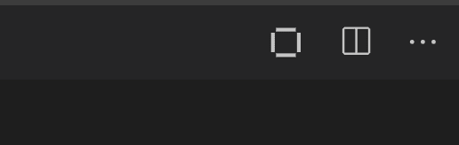

    可能需要片刻时间。在底部的紫色条中，将显示 “Activating extension”（激活扩展）。

2.  从 “Explore sample code” 部分中选择 **FabCar**。

3.  单击 **Clone** 按钮以对 FabCar 样本的样本代码执行 git clone 命令，然后选择一个便利位置用于克隆 Fabric 样本。

4.  选择 **Clone**。

    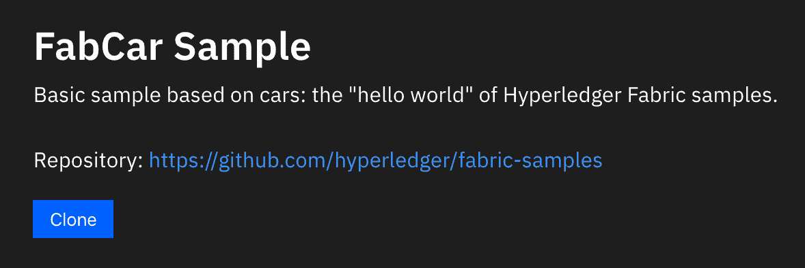

5.  从选项列表中，选择 **FabCar v1.0.0 Java**。

6.  单击 **Open Locally**。

    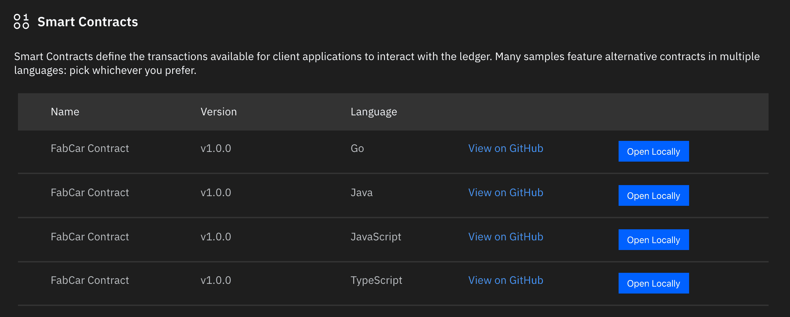

7.  在命令面板中，单击 **Add to workspace**。

8.  *可选*：单击左上角的 **File explorer** 按钮，您将看到 `fabcar-contract-java`，也就是用于创建区块链网络的项目。

9.  单击左侧的 IBM Blockchain Platform 图标以导航回 IBM Blockchain Platform extension for VS Code。

4

## 启动区块链网络并部署合约

1.  在 **FABRIC ENVIRONMENTS** 下面，选择 **1 Org Local Fabric o (click to start)**。

    这将启动 Docker 容器并配置区块链网络的启动。第一次将花费大约 3-5 分钟，因为将拉取 Docker 镜像，启动容器，并配置区块链网络。

2.  一旦连接到 “LocalFabric” 环境（启动后自动连接），在 **Smart Contracts** > **Instantiated** 下，单击 **+Instantiate**。

3.  选择 **fabcar-contract-java Open Project**（在命令面板中）。

4.  系统出现 “Enter a name for your Java Package” 提示时，请输入 `fabcar`，然后按 **Enter**。

5.  系统出现 “Enter a version for your Java package” 提示时，请输入 `1.0.0`。

6.  显示 “Optional functions” 时，请输入 `initLedger`。这将初始化包含汽车的账本。不输入函数将导致块链网络为空。

    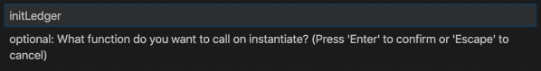

7.  对于所有其他的 “Optional functions”，按 **Enter** 跳过。

8.  当系统询问 “Do you want to provide a private data collection configuration file?” 时，选择 **No**，因为您不需要任何私有数据配置文件。

左下角的通知窗口将显示 “IBM Blockchain Platform extension: Instantiating Smart Contract”。实例化智能合约将花费大约 2 到 5 分钟的时间。

5

## 导出用于与区块链网络通信的凭证

为了使 Open Liberty 能够与区块链网络通信，除非您有特定的概要文件和证书颁发机构，否则 Hyperledger Fabric 提供的安全功能会阻止应用程序试图执行事务。

1.  导出本地 Fabric 网关：

    1.  在 “FABRIC GATEWAYS” 面板中，选择 `1 Org Local Fabric - Org1`。

    2.  命令面板中将显示 “Choose an identity to connect with”。选择 **admin**。

        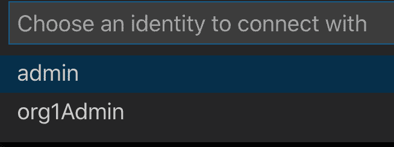

    3.  将鼠标悬停在 **FABRIC GATEWAYS** 标题上，单击 **…**> **Export connection profile**。

        

    4.  将打开 `finder` 窗口。

    5.  导航到 `Users/Shared/`。

    6.  创建新文件夹 `FabConnection`。

        完整的目录路径应该为 `Users/Shared/FabConnection`。

    7.  将 `.json` 文件另存为 `1-Org-Local-Fabric-Org1_connection.json`。

2.  导出 Fabric 钱包：

    1.  在 “FABRIC WALLETS” 面板中，选择 **1 Org Local Fabric**，然后右键单击 **Org1** 并选择 **Export Wallet**。

        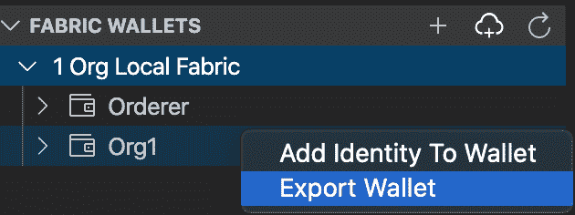

    2.  将该文件夹另存为 `wallet` 并保存到 `/Users/Shared/FabConnection/` 目录中。

6

## 启动 Open Liberty 服务器

1.  由于我们已经为 Open Liberty 安装了 `Dev Tool`，因此单击 **Liberty Dev Dashboard** 图标，然后该扩展将显示以下项目：`ol-blockchain`。

2.  右键单击 **ol-blockchain** 并选择 **Start**。

    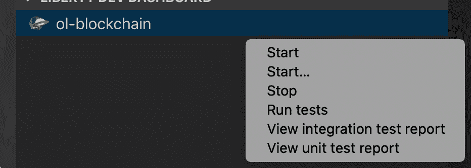

    这将快速启动应用程序服务器，通常在 2 到 5 秒内启动。

    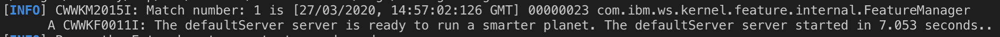

## 7\. 查询所有账本状态

我们要着重介绍的一项功能是 MicroProfile OpenAPI。您可以执行 HTTP 方法，例如 `POST`、`GET` 和 `PUT`。您将在示例中使用这三个方法。

1.  打开 Web 浏览器，导航到：

    `http://localhost:9080/openapi/ui/`

    这将显示可对区块链网络执行的所有可能操作。

    OpenAPI 功能会显示要展示的 HTTP 响应。可使用 `GET` 请求来查询账本中的所有汽车。

    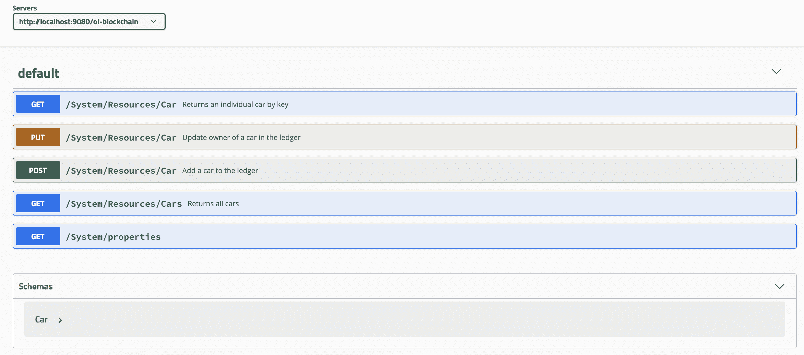

    如果您感兴趣，可以在 VS Code 的终端窗口中看到输出（输出相同）。这对于确定请求是否未生效非常有用，因为您可以看到 `stack trace` 错误。

2.  导航到 **GET /System/Resources/Cars Returns all cars** > **Try it out** > **Execute**。

    将针对账本发送一个请求，并返回所有的汽车。

    成功的响应应如下所示：

    ```
    Queried all Cars Successfully.
    Cars:
    [{"make":"Toyota","model":"Prius","colour":"blue","owner":"Tomoko"}}] 
    ```

8

## 将汽车添加到账本

1.  导航到 **POST /System/Resources/Car Add a car to the ledger**。

2.  单击 **Try it out**。

3.  用以下值填写示例模式，如图所示：

    ```
    {
      "make": "Audi",
      "model": "A1",
      "colour": "White",
      "owner": "Tom"
      "key": "CAR40"
    } 
    ```

    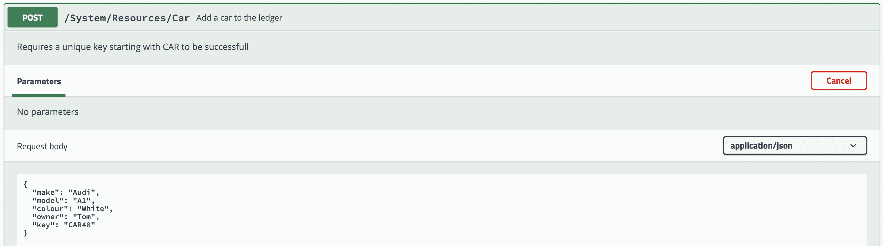

9

## 在账本中查询特定汽车

账本中的每个项目都有一个 ID，这使得该项目具有唯一性。如果您想在账本中查询特定项目，这将非常有用。在账本中查询特定汽车：

1.  在 OpenAPI UI 中，选择 **GET /System/Resources/Car Returns an individual car by key**。

    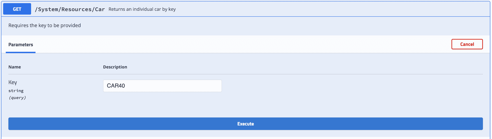

2.  通过插入 ID 并单击 **Execute** 来查询最近添加的汽车。

成功的响应应如下所示：

```
 Queried car Successfully.
   Key = CAR40
   Details = {"make":"Audi","model":"A1","colour":"White","owner":"Tom"} 
```

10

## 更新账本中汽车的所有者

1.  导航到 **PUT /System/Resources/Car Update owner of a car in the ledger**。

2.  单击 **Try it out**。

3.  用以下值填写示例模式，如图所示：

    ```
    {
      "make": "string",
      "model": "string",
      "colour": "string",
      "owner": "David"
      "key": "CAR40"
    } 
    ```

    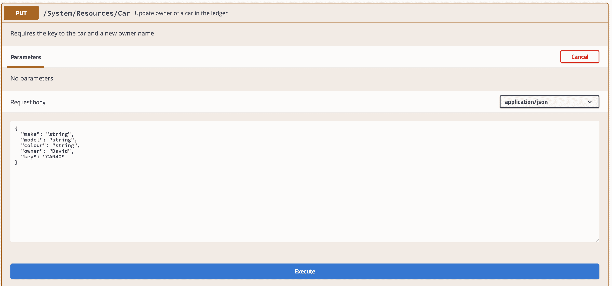

4.  重新查询 `CAR40` 以查看更新后的所有者

11

## 可选：查看 Open Liberty 指标

您可以使用另一个有用的 MicroProfile 功能来监视指标，以确定服务的性能。

查看执行事务所需的时间：

1.  导航到：

    `https://localhost:9443/metrics/application`

2.  需要进行认证才能查看指标。出现提示时，输入用户名和密码。

    用户名：`admin`
    密码：`adminpwd`

在代码中，将实现 `@Timed` 注解，以便在执行事务时启动一个计时器。这个计时器非常有用，因为它可以让您了解在执行 `QueryAllCars` 时从区块链网络中检索汽车的速度。

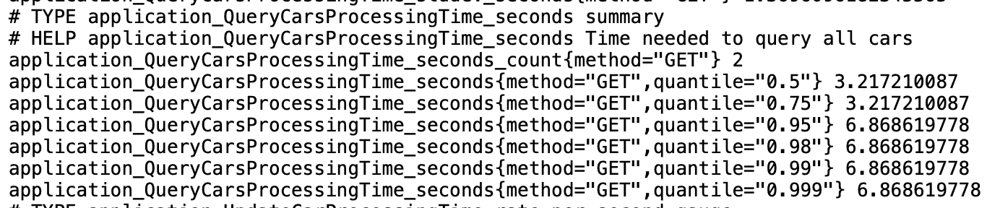

此列表为您提供了一个摘要。例如，`application_QueryCarsProcessingTime_seconds_count{method="GET"} 2` 表示已经调用了 `GET` 方法两次。执行事务所需的时间（以 `seconds` 为单位）将列在事务的下方。

您可以在 `# Help` 摘要下查看其他事务指标。

例如，用于更新汽车所有者的指标：

`# HELP application_UpdateCarProcessingTime_seconds Time needed to update car in the inventory`

```
application_UpdateCarProcessingTime_seconds_count{method="put"} 1
application_UpdateCarProcessingTime_seconds{method="put",quantile="0.5"} 5.347197288
application_UpdateCarProcessingTime_seconds{method="put",quantile="0.75"} 5.347197288
application_UpdateCarProcessingTime_seconds{method="put",quantile="0.95"} 5.347197288
application_UpdateCarProcessingTime_seconds{method="put",quantile="0.98"} 5.347197288
application_UpdateCarProcessingTime_seconds{method="put",quantile="0.99"} 5.347197288
application_UpdateCarProcessingTime_seconds{method="put",quantile="0.999"} 5.347197288 
```

12

## 停止 Open Liberty 服务器

完成后，返回到 VS Code > Liberty Dev Dashboard，然后按 **Stop**。这会停止 Open Liberty 服务器。

现在，该服务器已关闭，应用程序不再运行。如果您试图点击其中一个端点，您将找不到该端点。

13

## 拆卸区块链网络

*可选*：如果您决定之后还要继续使用区块链网络，则可以停止区块链网络，并将状态保存在账本中。单击左侧的 IBM Blockchain Platform 图标。在 Fabric Environments 中，选择 **…**> **Stop Fabric Environment**。

1.  只需单击 `1 Org Local Fabric` 便可轻松地再次启动。

要移除正在运行区块链网络的 Docker 镜像，请在 Fabric Environments 中单击 **…**> **Teardown Fabric Environment**。

## 结束语

在本教程中，您掌握了如何使用两个 IBM 有开源贡献的产品（即 Hyperledger Fabric 和 Open Liberty）。您已经了解了区块链和应用程序服务器的概念。您还掌握了如何对账本执行事务以及将事务添加到账本中。

本文翻译自：[Integrate Java microservices with blockchain](https://developer.ibm.com/tutorials/integrate-java-microservices-with-blockchain-using-hyperledger-fabric-and-open-liberty/)（2020-05-15）