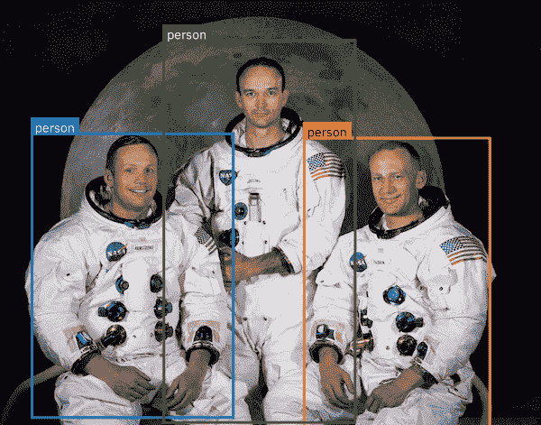

# AI in Node.js 简介

> 原文：[`developer.ibm.com/zh/tutorials/an-introduction-to-ai-in-nodejs/`](https://developer.ibm.com/zh/tutorials/an-introduction-to-ai-in-nodejs/)

人工智能 (AI) 的最新发展已经改变了许多服务，并有望在不久的将来普及到计算系统中。许多以前需要人工交互或专业知识的任务现在可以在机器学习模型或深度学习模型中捕获和自动完成。在本教程中，您将概括了解如何使用 TensorFlow.js 在 Node.js 应用程序中使用 AI。

要完成此学习路径，您必须获得执行应用程序所需任务的深度学习模型。许多开源预训练模型都可以供您使用。您可以在 [IBM Model Asset eXchange](https://developer.ibm.com/zh/exchanges/models/) 上找到几个模型，也可以训练自己的模型。

对于开发者来说，如何部署深度学习模型以供应用程序使用绝对是一个需要考虑的事项。有两种方法可以部署这些模型：

1.  可以通过应用程序中的 API 调用来访问的 Web 服务
2.  嵌入到应用程序本身中

请注意，还有其他方法可以将 AI 集成到 Node.js 中，例如 [TorchJS](https://blog.chainintel.com/torchjs-running-pytorch-models-in-nodejs-348022b0d291) 或 [ONNX.js](https://github.com/microsoft/onnxjs)，它们都提供了不同程度的支持。在本教程中，我们将重点介绍 [TensorFlow.js](https://www.tensorflow.org/js)，因为它在客户端和服务器上都提供了更好的支持。因为我们对 Node.js 感兴趣，所以我们关注如何在 Node 应用程序中嵌入模型。

## 为何要采用 JavaScript 进行 AI 编程？

尽管数据科学家倾向于使用 Python 进行 AI 开发，但 JavaScript 在客户端和服务器上都提供了以下几项优势：

*   众多 JavaScript 开发者组成的社区可以助力大规模使用 AI。
*   Node.js 占用空间更小，启动时间更短，部署在容器和 IoT 设备中时很有优势。
*   AI 模型处理语音、书面文本和图像，当在云中提供模型时，必须将数据发送到远程服务器。最近，数据隐私已经成为一个重要的关注点，因此能够使用 JavaScript 在客户端本地运行模型有助于缓解这种担忧。
*   在客户端本地运行模型有助于提高浏览器应用的交互性。

## TensorFlow.js 简介

[TensorFlow.js](https://www.tensorflow.org/js) 是一个开源软件库，供 JavaScript 开发者直接在浏览器或 Node.js 应用程序中创建和使用机器学习或深度学习模型。[TensorFlow](https://www.tensorflow.org/) 是一个更广泛的开源软件，支持不同编程语言（如 Python）和不同平台（如服务器、移动和物联网）。

使用 TensorFlow.js，您可以：

*   轻松创建模型，并从头开始训练模型。
*   复用预训练的模型。特别是对于 Node.js 来说，可以用 Python 编写一个模型，以对巨型数据集使用分布式训练功能。然后，可以在 Node.js 应用程序中加载并使用经过训练的模型。
*   使用 GPU 进行更快的处理。

# 前提条件

要学习本教程，您需要：

*   [Node.js](https://developer.ibm.com/technologies/node-js/series/learn-node-learning-path) 的基本知识
*   熟悉 [AI 和机器学习概念](https://developer.ibm.com/zh/series/learning-path-machine-learning-for-developers)
*   运行最新版本 Linux®、MacOS 或 Windows® 的工作站，其中：

    *   [安装了 Node.js](https://developer.ibm.com/zh/tutorials/learn-nodejs-installing-node-nvm-and-vscode/)
    *   [安装了 Visual Studio Code](https://developer.ibm.com/zh/tutorials/learn-nodejs-installing-node-nvm-and-vscode/#install-vs-code)
    *   带有 [Python 环境](https://www.python.org/)
    *   [安装了 Xcode](https://developer.apple.com/xcode/) *(MacOS only)*
        *   `xcode-select --install`

# 预估时间

完成本教程大约需要 30 分钟。

# 步骤

在本教程中，我们将执行以下操作，以演示如何在 Node.js 中开始使用 AI：

1.  设置一个 TensorFlow.js Node 项目
2.  运行一个打包的模型
3.  运行一个 TensorFlow.js Web 模型

## 设置一个 TensorFlow.js Node 项目

在开始使用 TensorFlow.js 之前，首先要确保您的开发环境已经准备就绪。如果您还没有安装 Node.js，可以按照这些[操作说明](https://developer.ibm.com/zh/tutorials/learn-nodejs-installing-node-nvm-and-vscode/)设置一个通用环境。

对于代码编辑器，我们建议使用 [Node.js 教程](https://developer.ibm.com/tutorials/learn-nodejs-installing-node-nvm-and-vscode/#install-vs-code)中所介绍的 [Visual Studio Code](https://code.visualstudio.com/)。当然，使用您喜欢的任何编辑器都是可以的。

### 创建项目

现在，为本教程创建一个 Node.js 项目。

```
mkdir tfjs-project
cd tfjs-project
npm init -y
npm install @tensorflow/tfjs-node 
```

这段代码将初始化一个新的 Node 项目，并为 Node.js 包安装 CPU TensorFlow.js。但是，如果您的 Linux 或 Windows 机器搭载了支持 CUDA 的 NVIDIA GPU，那么您可以*选择*安装 GPU 版本。

```
npm install @tensorflow/tfjs-node-gpu 
```

**注**：对于 GPU 版本，您还需要安装 [CUDA Toolkit](https://developer.nvidia.com/cuda-toolkit) 和 [cuDNN SDK](https://developer.nvidia.com/rdp/cudnn-download)。您可以在这个 [GitHub TensorFlow 链接](https://github.com/tensorflow/tfjs/tree/master/tfjs-node#installing)中找到所需的版本。

在本教程中，我们假设您已经安装了 CPU 版本 `@tensorflow/tfjs-node`。

## 运行打包的模型

在深入研究 `tfjs` 及其 API 之前，有一些可以提供热门预训练模型和简化 API 的资源，它们可以帮助您快速入门。Google 的 TensorFlow.js 团队在 [tfjs-models](https://github.com/tensorflow/tfjs-models) 存储库中提供了几种预训练的模型。通过简单易用的 API，可以在 NPM 包中使用这些预训练的模型。IBM 开源数据和人工智能技术中心 (CODAIT) 团队还在 [max-tfjs-models](https://github.com/CODAIT/max-tfjs-models) 存储库中提供了一些预训练的模型。

在本教程中，我们使用对象检测 (COCO-SSD) 包 [@tensorflow-models/coco-ssd](https://github.com/tensorflow/tfjs-models/tree/master/coco-ssd)。您将使用其 API 来识别单个图像中的多个对象。

### 创建项目

1.  在您之前创建的 `tfjs-project` 目录中安装 `@tensorflow-models/coco-ssd` 包。

    ```
     npm install @tensorflow-models/coco-ssd 
    ```

2.  在 Node.js 中为以下任务编程。

    1.  使用预打包的 API 加载预训练的模型 COCO-SSD。
    2.  使用 `tfjs-node` 将图像解码为 `tf.Tensor3D`。
    3.  将图像 tf.Tensor3D 传递到加载的模型以进行推理。
    4.  输出预测结果。
3.  确保您在项目文件夹中，然后将以下代码复制并粘贴到名为 `index.js` 的文件中。

    ```
     const cocoSsd = require('@tensorflow-models/coco-ssd');
     const tf = require('@tensorflow/tfjs-node');
     const fs = require('fs').promises;

     // Load the Coco SSD model and image.
     Promise.all([cocoSsd.load(), fs.readFile('image1.jpg')])
     .then((results) => {
       // First result is the COCO-SSD model object.
       const model = results[0];
       // Second result is image buffer.
       const imgTensor = tf.node.decodeImage(new Uint8Array(results[1]), 3);
       // Call detect() to run inference.
       return model.detect(imgTensor);
     })
     .then((predictions) => {
       console.log(JSON.stringify(predictions, null, 2));
     }); 
    ```

4.  要运行对象检测模型，需要一个图像作为输入。对于测试图像，请将[此图像](https://developer.ibm.com/developer/default/tutorials/an-introduction-to-ai-in-nodejs/images/image1.jpg)下载到项目文件夹中。可以使用以下命令运行程序。

```
node . 
```

您已经成功地使用 `Object Detection` 模型来识别图片中的对象。现在看一下代码，这样您就可以更好地理解代码的各个部分了。

### 代码解释

使用预打包的 API 很简单。可以查看 [COCO-SSD NPM 包](https://github.com/tensorflow/tfjs-models/tree/master/coco-ssd)的详细文档，还可以在此处 (`run-prepacked-model.js`)获得完整的应用程序。首先，我们使用 `require()` 来获得 COCO-SSD 模块。

```
const cocoSsd = require('@tensorflow-models/coco-ssd'); 
```

我们还需要一个图像解码器，它包含在 `tfjs-node` 模块中。可参阅[文档](https://js.tensorflow.org/api_node/1.5.1/#node.decodeImage)中提供的详细信息。

```
const tf = require('@tensorflow/tfjs-node'); 
```

最后，我们需要 `fs` 模块从文件系统加载图像文件。因为大多数 COCO-SSD API 返回 `Promise` 对象而不是使用回调，所以我们也可以使用 `fs` 模块中的 Promise API。

```
const fs = require('fs').promises 
```

在加载所有必要的模块后，您可以同时加载 COCO-SSD 预训练的模型和图像文件。

```
Promise.all([cocoSsd.load(), fs.readFile('image1.jpg')]) 
```

`cocoSsd.load()` 加载预训练的模型，`fs.readFile()` 加载图像。这两者都返回 Promise 对象，结果在 `then()` 回调函数中返回。第一个对象是加载的模型实例，第二个对象是作为 Buffer 的图像内容。

接下来，我们使用 `tfjs-node` 提供的图像解码器 API 将原始图像数据解码为 `tf.Tensor3D` 对象。张量是 *n* 维数组，作为 TensorFlow 的基本数据结构，用于传递和操作数据。

```
const imgTensor = tf.node.decodeImage(new Uint8Array(results[1]), 3); 
```

`tf.Tensor3D` 可以传递到 `loadedModel` 的 `detect()` 以进行推理。

```
return model.detect(imgTensor); 
```

`return` 对象也是一个 Promise 对象，其 `fulfill` 对象是预测。我们将预测输出到控制台。

```
console.log(JSON.stringify(predictions, null, 2)); 
```

### 其他预训练的模型

有许多预打包的 TensorFlow.js 模块，它们都提供类似的 API 来加载预训练的模型并运行推理。通常，它们还提供数据预处理 API，以将原始数据转换为适当的数据格式。然后，您需要将处理过的数据传递给它们的预测函数。

## 运行一个 TensorFlow.js Web 模型

在上一节中，您运行了一个 TensorFlow.js 模型，该模型打包为带有一个简单 API 的 NPM 模块。该模块负责整个模型生命周期。它加载模型并对输入和输出执行处理。这使得模型易于使用，让您无需深入了解模型也能执行机器学习任务。

但是，您可能希望使用尚未打包为模块的模型。在这种情况下，您需要自己加载模型并处理数据。在本节中，您将学习如何使用 TensorFlow.js 模型。加载模型并将输入数据预处理为模型所需的张量格式。您可能还必须将模型输出后处理为更容易理解的格式。

本节中使用的模型与在上一节中运行的 COCO-SSD NPM 模块中打包的模型相同。此处提供的代码是 [NPM 模块代码](https://github.com/tensorflow/tfjs-models/blob/master/coco-ssd/src/index.ts)的修改版本。

### TensorFlow.js 模型

TensorFlow.js 支持几种模型类型：

*   [`tf.LayersModel`](https://js.tensorflow.org/api/latest/#class:LayersModel)：这是在使用 TensorFlow.js Layers API 构建模型时创建的。该模型还会在使用 `tensorflowjs_converter` 工具转换 Keras 模型时生成。LayersModel 可用于训练和推理。

*   [`tf.GraphModel`](https://js.tensorflow.org/api/latest/#class:GraphModel)：这是在使用 `tensorflowjs_converter` 工具转换 TensorFlow SavedModel 时创建的。GraphModel 可以用于推理，但不能用于训练。

*   [`tf.node.TFSavedModel`](https://js.tensorflow.org/api_node/latest/#class:node.TFSavedModel)：在 Node.js 中，TensorFlow.js 提供了对 TensorFlow SavedModel 的原生支持。您可以直接在 Node.js 环境中加载和运行 SavedModel，无需转换。目前，Node.js 中的 SavedModel 只用于推断，不用于训练。

您使用的模型类型确定了用于加载和运行模型的 API。

### 加载模型

模型的定义包含若干个文件，无论该模型是 GraphModel 还是 LayersModel。您可以找到包含数据流程图和二进制权重文件分片的文件 (`model.json`)。要使用模型，必须调用适当的 API，并提供 `model.json` 文件的 URL 或路径。

您还可以从 [TensorFlow Hub](https://tfhub.dev/) 加载模型，方法是提供其 TensorFlow Hub URL 并包含设置为 `true` 的 `fromTFHub` 选项。

*   对于 `tf.LayersModel`，请使用 [`loadLayersModel`](https://js.tensorflow.org/api/latest/#loadLayersModel) 加载模型。
*   对于 `tf.GraphModel`，请使用 [`loadGraphModel`](https://js.tensorflow.org/api/latest/#loadGraphModel)。
*   对于 SavedModel，请使用 [`tf.node.loadSavedModel`](https://js.tensorflow.org/api_node/latest/#node.loadSavedModel) 将路径中现有的模型加载到 SavedModel 目录中。

对于此处的练习，您可以使用 [TensorFlow Hub 中托管的](https://tfhub.dev/tensorflow/ssdlite_mobilenet_v2/1)版本来加载 COCO-SSD 模型。因为这是一个转换后的 TensorFlow SavedModel，所以需要用 GraphModel API 来加载。

现在，我们编写一些代码来加载模型。

1.  在前面创建的 `tfjs-project` 中创建一个名为 `run-tfjs-model.js` 的新文件。
2.  将以下代码添加到此文件中。

    ```
     const tf = require('@tensorflow/tfjs-node');

     const modelUrl = 'https://tfhub.dev/tensorflow/tfjs-model/ssdlite_mobilenet_v2/1/default/1';

     let model;

     // load COCO-SSD graph model from TensorFlow Hub
     const loadModel = async function () {
       console.log(`loading model from ${modelUrl}`);

       model = await tf.loadGraphModel(modelUrl, {fromTFHub: true});

       return model;
     }

     // run
     loadModel().then(model => {
       console.log(model);
     }) 
    ```

3.  运行应用。

    ```
     node run-tfjs-model.js 
    ```

运行该应用后，您可以在控制台日志中看到一些有关加载的 TensorFlow.js 模型的信息。

### 输入预处理

要对模型运行推断，必须提供图像作为输入。由于模型需要图像像素值的四维张量，因此必须将图像处理成适当形式的张量，然后才能将其传递给模型。

我们将添加一些代码以使用 [`tf.node.decodeImage`](https://js.tensorflow.org/api_node/latest/#node.decodeImage) API 来转换图像。然后，我们会使用 [`tf.expandDims`](https://js.tensorflow.org/api/latest/#tf.Tensor.expandDims) 将三维张量增加为四维。

1.  向 `run-tfjs-model.js` 文件中添加以下预处理代码。

    ```
     const fs = require('fs');

     // convert image to Tensor
     const processInput = function (imagePath) {
       console.log(`preprocessing image ${imagePath}`);

       const image = fs.readFileSync(imagePath);
       const buf = Buffer.from(image);
       const uint8array = new Uint8Array(buf);

       return tf.node.decodeImage(uint8array, 3).expandDims();
     } 
    ```

2.  更新 **run** 代码，以允许传入图像文件的路径。

    ```
     // run
     if (process.argv.length < 3) {
       console.log('please pass an image to process. ex:');
       console.log('  node run-tfjs-model.js /path/to/image.jpg');
     } else {
       // e.g., /path/to/image.jpg
       let imagePath = process.argv[2];

       loadModel().then(model => {
         const inputTensor = processInput(imagePath);
         inputTensor.print();
       })
     } 
    ```

3.  运行应用。

    ```
     node run-tfjs-model.js image1.jpg 
    ```

运行代码时，将加载模型，对图像进行预处理，并显示生成的图像张量。

### 运行模型

对模型运行推理时，根据模型类型，有很多选项。所有模型 API 都提供了一个预测函数（即 [`tf.GraphModel.predict`](https://js.tensorflow.org/api/latest/#tf.GraphModel.predict)、[`tf.LayersModel.predict`](https://js.tensorflow.org/api/latest/#tf.LayersModel.predict) 和 [`tf.node.TFSavedModel.predict`](https://js.tensorflow.org/api_node/latest/#tf.node.TFSavedModel.predict))。`predict` 函数接受输入张量和可选的预测配置。

还有一个 `execute` 函数，但仅 GraphModel 和 SavedModel 支持此函数（例如 [`tf.GraphModel.execute`](https://js.tensorflow.org/api/latest/#tf.GraphModel.execute) 和 [`tf.node.TFSavedModel.execute`](https://js.tensorflow.org/api_node/latest/#tf.node.TFSavedModel.execute)）。

`execute` 函数接受输入张量和可选的输出节点名。输出节点名称允许请求中间张量。

要运行 COCO-SSD 模型并获得预测，请将图像张量传递到 `tf.GraphModel.executeAsync`。其执行效果与 `execute` 函数类似，但以异步方式执行。当模型包含控制流程操作时，您必须使用 `executeAsync` 以避免运行时错误。

1.  向 `run-tfjs-model.js` 文件中添加以下预处理代码。

    ```
     // run prediction with the provided input Tensor
     const runModel = function (inputTensor) {
       console.log('runnning model');

       return model.executeAsync(inputTensor);
     } 
    ```

2.  更新 `run` 代码，将图像张量传递给模型并得到预测。

    ```
     // run
     if (process.argv.length < 3) {
       console.log('please pass an image to process. ex:');
       console.log('  node run-tfjs-model.js /path/to/image.jpg');
     } else {
       // e.g., /path/to/image.jpg
       let imagePath = process.argv[2];

       loadModel().then(model => {
         const inputTensor = processInput(imagePath);
         return runModel(inputTensor);
       }).then(prediction => {
         console.log(prediction);
       })
     } 
    ```

3.  运行应用。

    ```
     node run-tfjs-model.js image1.jpg 
    ```

通过这些更改，图像张量将发送到模型进行推理，并显示预测结果。

### 输出预处理

COCO-SSD 模型返回的预测是具有两个张量的数组。对于找到的每个边界框，第一个张量包含每个类的分数，第二个张量包含找到的每个边界框的坐标。这些张量需要一些处理才能以更有意义的格式表示。处理根据预测来计算边界框、分数和标签。

1.  添加一个辅助功能以抽取类和分数。注意对输入张量使用 `dataSync()`。这样便可以将张量值转换成一个 `TypedArray`，我们可以通过常规 JavaScript 来使用。`scores` 常量最终成为一个平面化 `Float32Array`，其中包含每个边界框的每个可能类的分数。这里的目标是遍历此数组，并针对每个边界框确定哪个类的分数最高。

    ```
     // determine the classes and max scores from the prediction
     const extractClassesAndMaxScores = function (predictionScores) {
       console.log('calculating classes & max scores');

       const scores = predictionScores.dataSync();
       const numBoxesFound = predictionScores.shape[1];
       const numClassesFound = predictionScores.shape[2];

       const maxScores = [];
       const classes = [];

       // for each bounding box returned
       for (let i = 0; i < numBoxesFound; i++) {
         let maxScore = -1;
         let classIndex = -1;

         // find the class with the highest score
         for (let j = 0; j < numClassesFound; j++) {
           if (scores[i * numClassesFound + j] > maxScore) {
             maxScore = scores[i * numClassesFound + j];
             classIndex = j;
           }
         }

         maxScores[i] = maxScore;
         classes[i] = classIndex;
       }

       return [maxScores, classes];
     } 
    ```

2.  添加一个辅助功能函数以执行边界框的非极大值抑制 (NMS)。这种技术可确保特定对象只识别一次。

    ```
     const maxNumBoxes = 5;

     // perform non maximum suppression of bounding boxes
     const calculateNMS = function (outputBoxes, maxScores) {
       console.log('calculating box indexes');

       const boxes = tf.tensor2d(outputBoxes.dataSync(), [outputBoxes.shape[1], outputBoxes.shape[3]]);
       const indexTensor = tf.image.nonMaxSuppression(boxes, maxScores, maxNumBoxes, 0.5, 0.5);

       return indexTensor.dataSync();
     } 
    ```

3.  添加一个辅助功能函数，以根据框、分数和类构建 JSON 对象。代码将引用 `labels.js` 文件。此文件包含对象标签到模型返回的索引值/ID 的映射。获取 labels.js 文件，然后将此文件添加到您的项目目录中。

    ```
     const labels = require('./labels.js');

     let height = 1;
     let width = 1;

     // create JSON object with bounding boxes and label
     const createJSONresponse = function (boxes, scores, indexes, classes) {
       console.log('create JSON output');

       const count = indexes.length;
       const objects = [];

       for (let i = 0; i < count; i++) {
         const bbox = [];

         for (let j = 0; j < 4; j++) {
           bbox[j] = boxes[indexes[i] * 4 + j];
         }

         const minY = bbox[0] * height;
         const minX = bbox[1] * width;
         const maxY = bbox[2] * height;
         const maxX = bbox[3] * width;

         objects.push({
           bbox: [minX, minY, maxX, maxY],
           label: labels[classes[indexes[i]]],
           score: scores[indexes[i]]
         });
       }

       return objects;
     } 
    ```

4.  添加以下输出处理代码。

    ```
     // process the model output into a friendly JSON format
     const processOutput = function (prediction) {
       console.log('processOutput');

       const [maxScores, classes] = extractClassesAndMaxScores(prediction[0]);
       const indexes = calculateNMS(prediction[1], maxScores);

       return createJSONresponse(prediction[1].dataSync(), maxScores, indexes, classes);
     } 
    ```

5.  更新 `run` 代码以处理预测。

    ```
     // run
     if (process.argv.length < 3) {
       console.log('please pass an image to process. ex:');
       console.log('  node run-tfjs-model.js /path/to/image.jpg');
     } else {
       // e.g., /path/to/image.jpg
       let imagePath = process.argv[2];

       loadModel().then(model => {
         const inputTensor = processInput(imagePath);
         height = inputTensor.shape[1];
         width = inputTensor.shape[2];
         return runModel(inputTensor);
       }).then(prediction => {
         const output = processOutput(prediction);
         console.log(output);
       })
     } 
    ```

6.  运行应用。

    ```
     node run-tfjs-model.js image1.jpg 
    ```

恭喜！现在您拥有一个使用 Node.js 的正常运作的 TensorFlow.js 应用程序。该应用的输入是图像文件的路径。输出是一个 JSON 对象，其中包含检测到的每个对象、其分数及其在图像中的位置。以下代码显示了一个示例。

```
[
  {
    bbox: [
      35.42379140853882,
      148.18407735228539,
      223.39171171188354,
      314.645888954401
    ],
    label: 'person',
    score: 0.9464929103851318
  },
  {
    bbox: [
      337.3498320579529,
      152.96796306967735,
      205.84774017333984,
      321.53918293118477
    ],
    label: 'person',
    score: 0.9131661653518677
  },
  {
    bbox: [
      181.7181944847107,
      44.92521911859512,
      212.15811967849731,
      423.26776707172394
    ],
    label: 'person',
    score: 0.7019169926643372
  }
] 
```

### 其他增强功能（可选）

如果要进一步增强应用程序，可以尝试在图像上绘制边界框和标签。有许多方法和工具可用于帮助完成这项任务。一个工具是 [`@codait/max-vis`](https://www.npmjs.com/package/@codait/max-vis) 模块。给定一个图像和一个 JSON 格式的预测，该模块会尝试创建输入图像的新版本，并将预测可视化在图像上。

1.  安装 **max-vis** 工具（例如 `npm install @codait/max-vis`）。
2.  将以下 max-vis 注解代码添加到应用中。

    ```
     const maxvis = require('@codait/max-vis');
     const path = require('path');

     const annotateImage = function (prediction, imagePath) {
       console.log(`annotating prediction result(s)`);

       maxvis.annotate(prediction, imagePath)
         .then(annotatedImageBuffer => {
           const f = path.join(path.parse(imagePath).dir, `${path.parse(imagePath).name}-annotate.png`);

           fs.writeFile(f, annotatedImageBuffer, (err) => {
             if (err) {
               console.error(err);
             } else {
               console.log(`annotated image saved as ${f}\r\n`);
             }
           });
         })
     } 
    ```

3.  更新 `run` 代码以注解 JSON 响应。

    ```
     // run
     if (process.argv.length < 3) {
       console.log('please pass an image to process. ex:');
       console.log('   node run-tfjs-model.js /path/to/image.jpg');
     } else {
       // e.g., /path/to/image.jpg
       let imagePath = process.argv[2];

       loadModel().then(model => {
         const inputTensor = processInput(imagePath);
         height = inputTensor.shape[1];
         width = inputTensor.shape[2];
         return runModel(inputTensor);
       }).then(prediction => {
         const jsonOutput = processOutput(prediction);
         console.log(jsonOutput);
         annotateImage(jsonOutput, imagePath);
       })
     } 
    ```

使用此部分代码运行将生成一个新的带注解的图像。此时会创建新图像并保存在与源图像相同的目录中。



您可以获得完整的 Node.js 应用程序 (`run-tfjs-model.js`)。

# 结束语

在本教程中，您了解了如何使用 JavaScript 作为使用 TensorFlow.js 进行 AI 开发的工具。您看到了如何采用两种方法在 Node.js 应用中引导 AI 功能：

1.  将预打包的 TensorFlow.js 模块与一个简单的 API 一起使用
2.  使用 TensorFlow.js API 直接加载模型，并执行为了获得所需输出而需要的预处理和后处理步骤。

在本例中，我们使用了对象检测模型，并能够开发 Node 应用来识别图像中的对象及其位置。在本系列的下一部分中，我们将更深入地研究有关深度学习的概念，并将介绍如何从头开始构建模型。而且是完全采用 JavaScript 来构建。

## 视频

[https://cdnapisec.kaltura.com/p/1773841/sp/177384100/embedIframeJs/uiconf_id/44854321/partner_id/1773841?iframeembed=true&playerId=kplayer&entry_id=1_k8lelrzz&flashvars[streamerType]=auto](https://cdnapisec.kaltura.com/p/1773841/sp/177384100/embedIframeJs/uiconf_id/44854321/partner_id/1773841?iframeembed=true&playerId=kplayer&entry_id=1_k8lelrzz&flashvars[streamerType]=auto)

本文翻译自：[An introduction to AI in Node.js](https://developer.ibm.com/technologies/artificial-intelligence/tutorials/an-introduction-to-ai-in-nodejs)（2020-04-17）