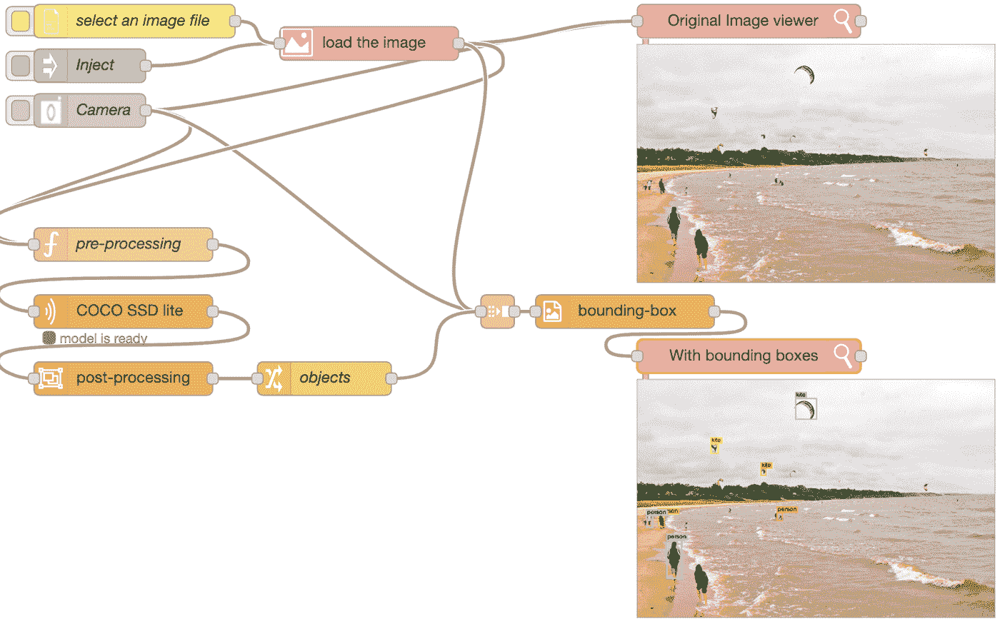
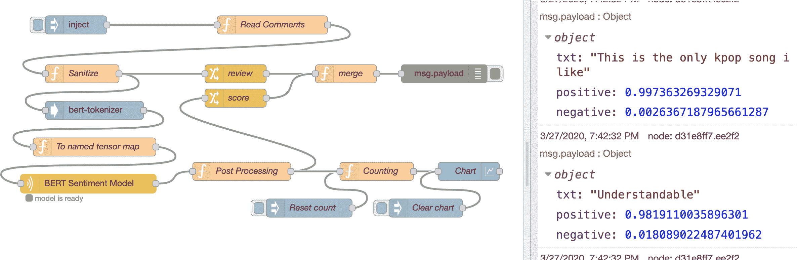
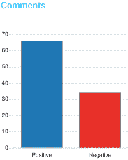
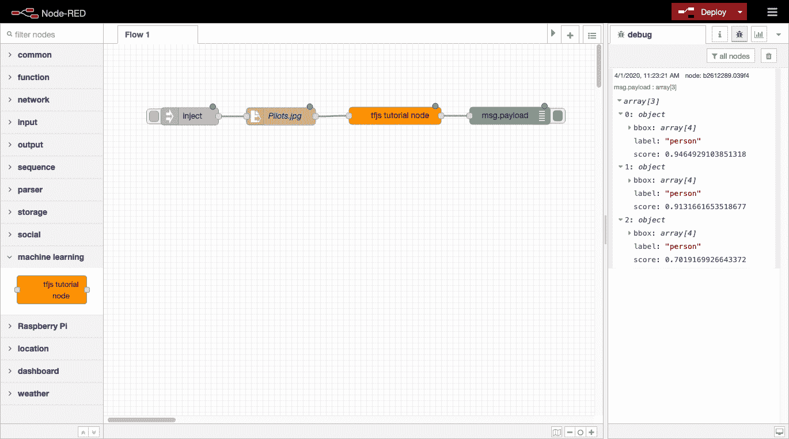
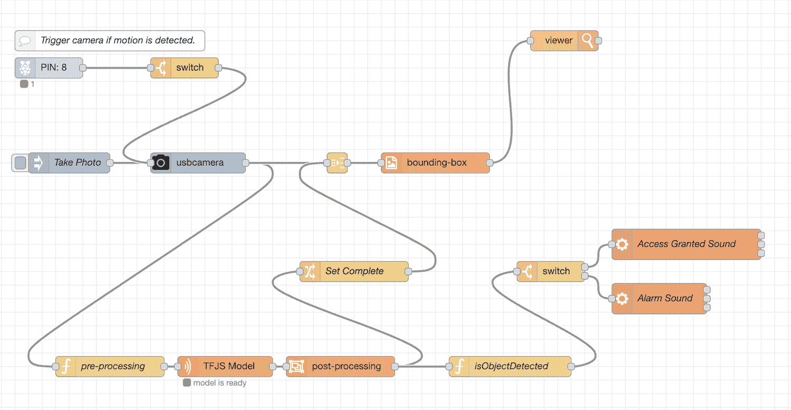
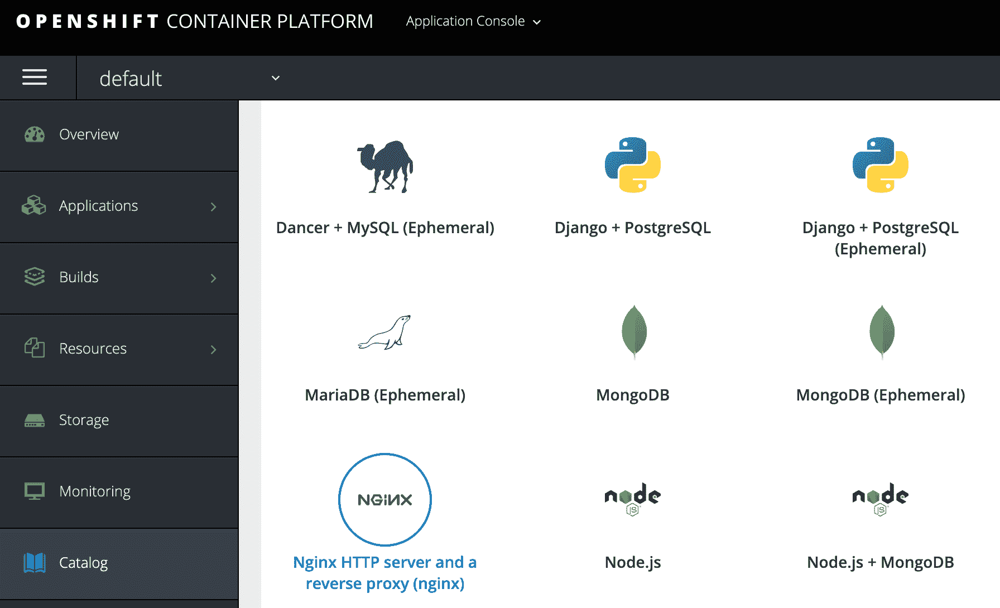
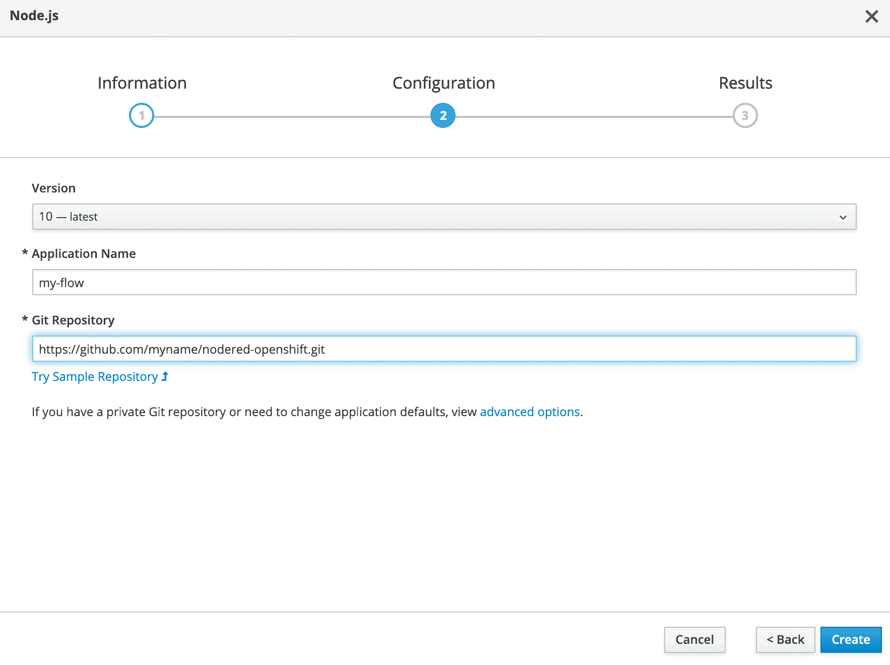
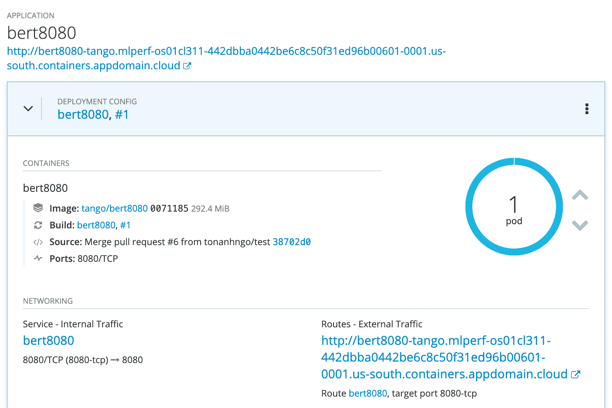

# 使用 TensorFlow.js 为 Node-RED 构建机器学习节点

> 原文：[`developer.ibm.com/zh/tutorials/building-a-machine-learning-node-for-node-red-using-tensorflowjs/`](https://developer.ibm.com/zh/tutorials/building-a-machine-learning-node-for-node-red-using-tensorflowjs/)

降低人工智能 (AI) 的门槛是人们一直在不断追求的目标。让 AI 更加普及，不仅会增加 AI 实际使用人数，还将有助于扩大 AI 在许多不同领域的传播和 采用范围。机器学习世界起初可能会令人生畏，但是有几种方法可以简化整个 AI 应用的开发过程。其中的一种方法就是将 TensorFlow.js 与 Node-RED 结合使用。本教程向您展示如何在各种环境中使用此方法来创建 AI 支持的 Node-RED 应用程序。

### 什么是 Node-RED？

[Node-RED](https://nodered.org/) 是一种开源可视化编程工具，它提供基于浏览器的流编辑器，用于将设备、API 和服务连接在一起。它可以帮助用户直观呈现和设计其事件驱动的应用程序。通过提供低代码风格的应用程序开发，Node-RED 可以缩短开发时间，并更便于编码人员和非编码人员进行应用开发。基于 Node.js，您可以通过创建自己的节点或利用 JavaScript 和 NPM 生态系统来扩展其功能。

尽管 Node-RED 能够在 Raspberry Pi 等设备上运行，确实能够很好地处理物联网工作负载，但对于任何事件驱动的应用程序场景，它也可以在笔记本电脑和云环境中运行。Node-RED 的核心组件之一就是节点，其中许多节点都是[由社区提供](https://flows.nodered.org/)的。每个 Node-RED 节点都有一个明确定义的用途，并充当构造流程的基本构建块。它们通常接受一些输入并生成一些输出以供其他节点使用。将足够多的节点串在一起，就可以创造出成熟的应用程序。了解有关使用 [Node-RED](https://developer.ibm.com/components/node-red/gettingstarted/) 的更多信息。

### 添加 TensorFlow.js

Node-RED 提供了开发环境，而将机器学习整合到您的应用中则是另一个关键组件。TensorFlow.js 填补了这一缺口。匹配的 Node.js 生态系统使这两种技术能够无缝集成，可以轻松地创建和打包 TensorFlow.js Node-RED 节点，并将其上传到 npm 进行共享。

TensorFlow.js 还提供如下优势：让模型直接在设备上运行，而无需与外部服务器或云交互。这样可以缓解大多数的数据安全问题或互联网连接问题。此外，随着社区提供的 TensorFlow.js Node-RED 节点的可用性不断提高，无需编写一行代码即可实现多种不同的 AI 应用。

在本教程中，我们着重介绍以下方面：

*   使用正式发布的 TensorFlow.js Node-RED 软件包
*   构建您自己的 TensorFlow.js Node-RED 软件包
*   在 IoT 设备上启用 TensorFlow.js
*   将 Node-RED 部署到云环境

# 前提条件

要学习本教程，您必须：

*   基本了解：
    *   [Node.js](https://developer.ibm.com/technologies/node-js/series/learn-node-learning-path)
    *   [Node-RED](https://developer.ibm.com/components/node-red/gettingstarted/)
*   熟悉 [AI 和机器学习概念](https://developer.ibm.com/zh/technologies/artificial-intelligence/series/learning-path-machine-learning-for-developers)
*   运行最新版本 Linux®、MacOS 或 Windows™ 的笔记本电脑或工作站，并且：
    *   已安装 [Node.js](https://developer.ibm.com/zh/tutorials/learn-nodejs-installing-node-nvm-and-vscode/)
    *   已安装 [VS Code](https://developer.ibm.com/zh/tutorials/learn-nodejs-installing-node-nvm-and-vscode/#install-vs-code)
    *   已安装 [Node-RED](https://nodered.org/docs/getting-started/)

# 步骤

使用以下步骤来完成本教程。

1.  使用现有的 TensorFlow.js Node-RED 节点
2.  构建自定义的 TensorFlow.js Node-RED 节点
3.  在 IoT 设备上使用 TensorFlow.js 运行 Node-RED
4.  在云中使用 TensorFlow.js 部署 Node-RED

## 使用现有的 TensorFlow.js Node-RED 节点

为方便起见，我们已将几个常用函数实现为 Node-RED 自定义节点。我们将通过示例流程简要说明它们的用法，帮助您快速体验 TensorFlow.js Node-RED。须注意，这些自定义节点中的大多数节点都需要 `@tensorflow/tfjs-node` 作为对等依赖项，因此在安装这些自定义节点软件包之前，应确保先将其安装在 Node-RED 节点环境中。

### 自定义节点

*   [`node-red-contrib-tf-function`](https://flows.nodered.org/node/node-red-contrib-tf-function) 会模拟核心 Node-RED [`Function`](https://nodered.org/docs/user-guide/writing-functions) 节点，但也会在全局上下文中包含 TensorFlow.js 变量 (`tf`)。
*   [`node-red-contrib-tf-model`](https://flows.nodered.org/node/node-red-contrib-tf-model) 可加载 TensorFlow 模型并执行推理。当前，该节点仅支持 Web 友好型 JSON 模型格式，但是很快将添加 `SavedModel` 支持。

*   [`node-red-contrib-post-object-detection`](https://flows.nodered.org/node/node-red-contrib-post-object-detection)

    *   `post-object-detection` 可处理对象检测模型的输出。
    *   `bbox-image` 会用边框注解原始图像。
*   [`node-red-contrib-bert-tokenizer`](https://flows.nodered.org/node/node-red-contrib-bert-tokenizer) 可将文本转换为 BERT 模型的输入特征。

### 示例流程

#### 对象检测

[对象检测](https://github.com/yhwang/node-red-contrib-tf-model/tree/master/examples/object-detection)流程可识别图像中的对象，并用边框注解对象。可以从内置相机、文件系统或通过注入默认图像来加载图像。确保已经安装 [`node-red-contrib-browser-utils`](https://www.npmjs.com/package/node-red-contrib-browser-utils) 软件包，以便所有这些输入节点正常工作。此流程使用上面提到的三个自定义节点（`tf-function`、`tf-model` 和 `post-object-detection`）。

加载的图像将作为 `msg.payload` 传递到 `pre-processing` 节点。`msg` 对象是一个 JavaScript 对象，用于在节点之间传递消息。按照惯例，它有一个有效负载属性，其中包含前一个节点的输出。`Pre-processing` 函数节点是 [`tf-function`](https://flows.nodered.org/node/node-red-contrib-tf-model) 的示例，它将直接使用预定义的 `tf` 变量来调用 [`tf.node.decodeImage`](https://js.tensorflow.org/api_node/latest/#node.decodeImage) 方法。该节点将生成 Tensor4D 图像表示形式作为有效负载，然后将其传递到 `COCO SSD lite` 节点，该节点是 [`tf-model`](https://flows.nodered.org/node/node-red-contrib-tf-model) 自定义节点的实例。这将从外部 URL 加载 COCO-SSD 精简版 `model.json`，并在模型上运行推理。

模型的结果经过 `post-process` 节点，该节点将返回包含 `bbox`、`className` 和 `score` 属性的对象数组。`objects` 节点将已设置为 true 的附加属性 `complete` 与带有图像对象的 `msg` 结合在一起。然后，[`bounding-box`](https://flows.nodered.org/node/node-red-contrib-post-object-detection) 节点会在输入图像上绘制边框，并将其显示在浏览器中。



#### BERT 情感分析

[BERT 情感分析](https://github.com/yhwang/node-red-contrib-tf-model/tree/master/examples/bert-sentiment-analysis)示例流程使用 BERT 情感模型对某个 YouTube 视频的评论进行分类，并绘制结果图表。除了 `tf-function` 和 `tf-model` 节点之外，我们还使用了另一个自定义节点 [`bert-tokenizer`](https://flows.nodered.org/node/node-red-contrib-bert-tokenizer)，用于将文本转换为输入张量。 此流程需要的其他软件包为 [`node-red-dashboard`](https://www.npmjs.com/package/node-red-dashboard) 和 [`youtube-comments-stream`](https://www.npmjs.com/package/youtube-comments-stream)。须注意，此处加载的 `BERT sentiment model` 模型是从 [`MAX-Text-Sentiment-Classifier`](https://github.com/IBM/MAX-Text-Sentiment-Classifier/tree/master/) SavedModel 转化而来，该模型以指定张量图作为输入，如以下代码所示。

```
{
    input_ids_1 : tensor([1,128], "int32"),
    segment_ids_1 : tensor([1,128], "int32"),
    input_mask_1 : tensor([1,128],"int32")
} 
```

该模型将返回 softmax 输出，表示张量数组中输入为肯定和否定的可能性。然后，该流程会计算肯定和否定评论的数量，并将该计数输出到条形图节点。该条形图节点来自 [node-red-dashboard](https://flows.nodered.org/node/node-red-dashboard) 软件包，该软件包允许用户创建实时数据仪表板和窗口小部件。可以从 `/ui/` 端点（例如，`http://localhost:1880/ui/`）访问仪表板。

 

**注意：**为了使 `Read Comments` 函数节点正常工作，应确保 Node-RED [settings.js](https://nodered.org/docs/user-guide/runtime/configuration) 文件中具有以下代码。

```
functionGlobalContext: {
  commentsStream:require('youtube-comments-stream')
}, 
```

## 构建自定义的 TensorFlow.js Node-RED 节点

在本教程的上一部分，您运行了预先打包的 TensorFlow.js Node-RED 节点。这些节点可让您快速入门，只需具有模型、TensorFlow.js 和 Node-RED 的基础知识即可执行许多机器学习任务。

这些节点很有用，但它们只能解决一些用例。如果您的用例不在现有节点范围内，那么可以创建自定义节点。用于创建自定义 Node-RED 节点的完整文档在[其他地方](https://nodered.org/docs/creating-nodes/)提供，此处不再赘述，但是以下步骤展示了足够的详细信息，强调如何集成 TensorFlow.js API。您的节点将为 Node.js 导入 TensorFlow.js 库，加载 TensorFlow.js Web 模型，并在该模型上运行推理。

为了保持一致性，我们使用并扩展了您在本[系列](https://developer.ibm.com/zh/series/learning-path-get-started-with-ai-in-nodejs)的第一篇教程“[Node.js 中 AI 的简介](https://developer.ibm.com/zh/technologies/artificial-intelligence/tutorials/an-introduction-to-ai-in-nodejs)”中学习的 COCO-SSD 模型。我们将创建一个自定义 Node-RED 节点，以使用 COCO-SSD TensorFlow.js 模型执行对象检测。

### Node-RED 节点的组件

Node-RED 节点是由三个主要文件组成的 Node.js 模块/npm 软件包。

*   一个 [JavaScript 文件](https://nodered.org/docs/creating-nodes/node-js)，用于定义节点行为
*   一个 [HTML 文件](https://nodered.org/docs/creating-nodes/node-html)，用于列出节点的属性、编辑对话框和帮助文本
*   一个 [`package.json`](https://nodered.org/docs/creating-nodes/packaging#packagejson) 文件，用于描述 Node.js 模块的元数据

JavaScript 文件中将包含您的 TensorFlow.js 代码。它将加载 TensorFlow.js 模型并运行预测。 捆绑并安装所有文件后，自定义节点将显示在编辑器中，可将其连接到流程中并进行部署。

### 初始化自定义节点模块

首先，您必须设置一个 Node-RED 开发环境。您通过此环境开发自定义节点并运行 Node-RED，以避免可能与其他自定义节点发生冲突，并且在开发过程中必须将自定义节点安装到全局 Node-RED 环境中。

从终端窗口：

1.  创建新的 Node-RED 项目目录，然后进入该新目录。

    ```
     mkdir nodered-dev
     cd nodered-dev 
    ```

2.  初始化项目的 npm 软件包，并根据提示回答问题（例如，**软件包名称** `nodered-dev`）。

    ```
     npm init 
    ```

3.  安装 `node-red` 和 `@tensorflow/tfjs-node` 依赖项。

    ```
     npm install node-red @tensorflow/tfjs-node 
    ```

4.  使用 VS Code 或您喜欢的 IDE 编辑新创建的 `package.json` 文件。

5.  添加用于启动 Node-RED 的 `start` 脚本。

    ```
     {
       "name": "nodered-dev",
       ...
       "scripts": {
         "start": "node-red"
       }
       ...
     } 
    ```

在准备好 Node-RED 项目文件夹后，就可以开始操作自定义节点。

1.  在新的 Node-RED 项目目录中为自定义节点创建一个目录，然后进入该目录。

    ```
     mkdir node-red-contrib-tfjs-tutorial
     cd node-red-contrib-tfjs-tutorial 
    ```

    > **注**：如果您选择在节点名称中使用 **node-red**，那么建议在其前面加上 `node-red-contrib-` 前缀，使其与 Node-RED 项目维护的节点区分开来。

2.  初始化自定义节点的 npm 软件包，并根据提示回答问题（例如，**软件包名称** `node-red-contrib-tfjs-tutorial`）。

    ```
     npm init 
    ```

3.  使用 VS Code 或您喜欢的 IDE 编辑新创建的 `package.json` 文件。

4.  添加 `node-red` 节，告知运行时模块中包含的节点文件，同时为 `@tensorflow/tfjs-node` 模块添加 `peerDependecies` 节。

    ```
     {
       "name": "node-red-contrib-tfjs-tutorial",
       ...
       "peerDependencies": {
         "@tensorflow/tfjs-node": "¹.7.2"
       },
       "node-red": {
         "nodes": {
           "tfjs-tutorial-node": "index.js"
         }
       }
     } 
    ```

`package.json` 文件是标准的 Node.js 模块软件包文件，唯一的区别是增加了 `node-red` 一节。在初始化并配置 `package.json` 文件后，下一步就是定义节点的行为。

### 描述自定义节点的外观

节点的外观是在具有三个 `script` 标签的 HTML 文件中定义的。该文件向 Node-RED 编辑器注册该节点，并为该节点的 Edit 对话框和帮助文本提供模板。

在节点的目录中：

1.  创建新的 HTML 文件（即 `index.html`），并在您的 IDE 中将其打开。

2.  添加代码，为节点的 Edit 对话框定义模板。可以在模板中使用来自 [Font Awesome 4.7](https://fontawesome.com/v4.7.0/icons/) 的图标类（例如，`fa-tag`）。`<div class="form-row">` 应该用于布置对话框的每一行。要传递到节点的每个属性都应具有一个格式为 `node-input-<propertyname>` 的 `id`。

    ```
     <script type="text/html" data-template-name="tfjs-tutorial-node">
       <div class="form-row">
         <label for="node-input-name"><i class="fa fa-tag"></i> Name</label>
         <input type="text" id="node-input-name" placeholder="Name">
       </div>
       <div class="form-row">
         <label for="node-input-name"><i class="fa fa-globe"></i> Model Url</label>
         <input type="text" id="node-input-modelUrl" placeholder="https://modelurl/model.json">
       </div>
       <div class="form-row">
         <label for="node-input-name">Is a TFHub model url?</label>
         <input type="checkbox" id="node-input-fromHub" checked>
       </div>
     </script> 
    ```

3.  添加代码以向编辑器注册该节点。`category` 定义要将节点放置在编辑器选用板窗口中的哪个组下。`inputs` 和 `outputs` 描述节点包含多少个输入和输出。`defaults` 为节点所使用并在模板中定义的参数设置默认值。

    ```
     <script type="text/javascript">
       RED.nodes.registerType('tfjs-tutorial-node', {
         category: 'machine learning',
         defaults: {
           name: { value: 'tfjs tutorial node' },
           modelUrl: { value: 'https://tfhub.dev/tensorflow/tfjs-model/ssdlite_mobilenet_v2/1/default/1' },
           fromHub: { value: 'checked' }
         },
         inputs: 1,
         outputs: 1,
         paletteLabel: 'tfjs tutorial node',
         color: '#ff9100',
         label: function() {
           return this.name || 'tfjs tutorial node';
         }
       });
     </script> 
    ```

4.  添加节点的帮助文本。当用户查看节点的信息窗格时，将显示此文本。

    ```
     <script type="text/html" data-help-name="tfjs-tutorial-node">
       <p>A TensorFlow.js node to run prediction using the Coco SSD model for object detection.</p>
       <p>Provide a <strong>Model URL</strong> and indicate whether the URL points to a TFHub hosted model.</p>
       <p>The node accepts an image buffer and outputs a JSON prediction object with detected objects and their bounding box and confidence score.</p>
     </script> 
    ```

### 定义自定义节点行为

接下来，定义节点的行为（在需要向运行时注册的函数中）。每当创建节点的新实例并为该实例传递流程编辑器和 Edit 对话框中设置的属性时，都会调用该函数。该函数应该会调用 `RED.nodes.createNode` 来初始化所有节点共享的功能。

该节点函数包装在 Node.js 模块中。该模块将导出运行时在启动后加载节点时调用的函数。将为导出的函数传递一个参数，提供模块对 Node-RED 运行时 API 的访问权限。

在节点的目录中：

1.  在您的 IDE 中打开 `index.js` 文件。

2.  将以下代码添加到新创建的 JavaScript 文件中，以创建节点函数、注册节点函数并导出节点。

    ```
     // export the node module
     module.exports = function(RED) {
       // define the node's behavior
       function TfjsTutorialNode(config) {
         // initialize the features
         RED.nodes.createNode(this, config);

         // register a listener to get called whenever a message arrives at the node
         node.on('input', function (msg) {
           // handle incoming message
         });
       }

       // register the node with the runtime
       RED.nodes.registerType('tfjs-tutorial-node', TfjsTutorialNode);
     } 
    ```

3.  创建新的 JavaScript 文件（即 `tfjs-tutorial-util.js`），并在您的 IDE 中将其打开。该文件使用先前教程中编写的大多数代码（用于加载模型、预处理输入和处理输出）。要了解有关代码的更多信息，请访问本系列中的[第一个教程](https://developer.ibm.com/zh/technologies/artificial-intelligence/tutorials/an-introduction-to-ai-in-nodejs)。

4.  将代码添加到该新文件以加载 `tfjs-node` 库并预处理输入。该代码还将引用 `labels.js` 文件。该文件包含对象标签到模型所返回的索引值/ID 的映射。您可以在[此处](https://github.com/pvaneck/ai-in-nodejs/blob/master/building-a-machine-learning-node-for-node-red-using-tensorflow.js/nodered-dev/node-red-contrib-tfjs-tutorial/labels.js)找到 `labels.js` 文件。

    ```
     const tf = require('@tensorflow/tfjs-node');
     const labels = require('./labels.js');

     // load COCO-SSD graph model from TensorFlow Hub
     const loadModel = async function (modelUrl, fromTFHub) {
       console.log(`loading model from ${modelUrl}`);

       if (fromTFHub) {
         model = await tf.loadGraphModel(modelUrl, {fromTFHub: true});
       } else {
         model = await tf.loadGraphModel(modelUrl);
       }

       return model;
     }

     // convert image to Tensor
     const processInput = function (imageBuffer) {
       console.log(`preprocessing image`);

       const uint8array = new Uint8Array(imageBuffer);

       return tf.node.decodeImage(uint8array, 3).expandDims();
     } 
    ```

5.  继续编辑文件以添加代码，处理模型预测输出并导出函数。

    ```
     const maxNumBoxes = 5;

     // process the model output into a friendly JSON format
     const processOutput = function (prediction, height, width) {
       console.log('processOutput');

       const [maxScores, classes] = extractClassesAndMaxScores(prediction[0]);
       const indexes = calculateNMS(prediction[1], maxScores);

       return createJSONresponse(prediction[1].dataSync(), maxScores, indexes, classes, height, width);
     }

     // determine the classes and max scores from the prediction
     const extractClassesAndMaxScores = function (predictionScores) {
       console.log('calculating classes & max scores');

       const scores = predictionScores.dataSync();
       const numBoxesFound = predictionScores.shape[1];
       const numClassesFound = predictionScores.shape[2];

       const maxScores = [];
       const classes = [];

       // for each bounding box returned
       for (let i = 0; i < numBoxesFound; i++) {
         let maxScore = -1;
         let classIndex = -1;

         // find the class with the highest score
         for (let j = 0; j < numClassesFound; j++) {
           if (scores[i * numClassesFound + j] > maxScore) {
             maxScore = scores[i * numClassesFound + j];
             classIndex = j;
           }
         }

         maxScores[i] = maxScore;
         classes[i] = classIndex;
       }

       return [maxScores, classes];
     }

     // perform non maximum suppression of bounding boxes
     const calculateNMS = function (outputBoxes, maxScores) {
       console.log('calculating box indexes');

       const boxes = tf.tensor2d(outputBoxes.dataSync(), [outputBoxes.shape[1], outputBoxes.shape[3]]);
       const indexTensor = tf.image.nonMaxSuppression(boxes, maxScores, maxNumBoxes, 0.5, 0.5);

       return indexTensor.dataSync();
     }

     // create JSON object with bounding boxes and label
     const createJSONresponse = function (boxes, scores, indexes, classes, height, width) {
       console.log('create JSON output');

       const count = indexes.length;
       const objects = [];

       for (let i = 0; i < count; i++) {
         const bbox = [];

         for (let j = 0; j < 4; j++) {
           bbox[j] = boxes[indexes[i] * 4 + j];
         }

         const minY = bbox[0] * height;
         const minX = bbox[1] * width;
         const maxY = bbox[2] * height;
         const maxX = bbox[3] * width;

         objects.push({
           bbox: [minX, minY, maxX, maxY],
           label: labels[classes[indexes[i]]],
           score: scores[indexes[i]]
         });
       }

       return objects;
     }

     module.exports = {
       loadModel: loadModel,
       processInput: processInput,
       processOutput: processOutput
     } 
    ```

6.  更新 `index.js` 文件，导入 `tfjs-tutorial-util.js` 文件，加载模型，然后在收到输入消息时运行预测。

    ```
     // export the node module
     module.exports = function(RED) {
       // import helper module
       const tfmodel = require('tfjs-tutorial-util.js');

       // load the model
       async function loadModel (config, node) {
         node.model = await tfmodel.loadModel(config.modelUrl, config.fromHub);
       }

       // define the node's behavior
       function TfjsTutorialNode(config) {
         // initialize the features
         RED.nodes.createNode(this, config);
         const node = this

         loadModel(config, node)

         // register a listener to get called whenever a message arrives at the node
         node.on('input', function (msg) {
           // preprocess the incoming image
           const inputTensor = processInput(msg.payload);
           // get image/input shape
           const height = inputTensor.shape[1];
           const width = inputTensor.shape[2];

           // get the prediction
           node.model
             .executeAsync(inputTensor)
             .then(prediction => {
               msg.payload = tfmodel.processOutput(prediction, height, width);
               // send the prediction out
               node.send(msg);
             });
         });
       }

       // register the node with the runtime
       RED.nodes.registerType('tfjs-tutorial-node', TfjsTutorialNode);
     } 
    ```

### 测试您的自定义节点

在定义了自定义节点的行为和外观之后，就可以安装该节点，将其添加到流程中并进行测试。您可以在开发节点时，通过将其链接到本地 Node-RED 环境对其进行测试。这使您可以继续开发节点，并且仅通过重新启动 Node-RED 即可获取更改。

从终端窗口：

1.  转至您的 Node-RED 项目目录（即 `nodered-dev`）。

2.  安装您的自定义 `node-red-contrib-tfjs-tutorial` 节点。

    ```
     npm install node-red-contrib-tfjs-tutorial 
    ```

3.  启动 Node-RED。

    ```
     npm start 
    ```

4.  在 Palette 窗口中，应该会找到您的自定义节点（即 `tfjs tutorial node`），可用于创建将图像缓冲区传递到自定义节点的流程。例如，您可以将配置的 `File in` 节点连接到本地图像文件（并将输出设置为 Buffer 对象）。

5.  部署并运行流程以查看自定义节点的输出。

    

**注意**：如果您现有 Node-RED 环境，并且想要将本地 Node-RED 自定义节点安装到该环境中，那么使用 [`yalc`](https://www.npmjs.com/package/yalc) 软件包。要使用本地包而不将任何内容发布到远程注册表，推荐使用 Yalc 方法。

```
# Install.
npm i -g yalc

# In the custom node directory (i.e. node-red-contrib-tfjs-tutorial/), run the following.
yalc publish

# In Node-RED environment directory, add the custom node as a dependency.
yalc add node-red-contrib-tfjs-tutorial 
```

您可以在[此存储库](https://github.com/pvaneck/ai-in-nodejs/tree/master/building-a-machine-learning-node-for-node-red-using-tensorflow.js/nodered-dev/node-red-contrib-tfjs-tutorial)中找到完整的自定义节点 (`tfjs tutorial node`)。在 [Node-RED 文档](https://nodered.org/docs/creating-nodes/)中了解有关创建自定义 Node-RED 节点的更多信息。

## 在 IoT 设备上使用 TensorFlow.js 运行 Node-RED

现在，许多边缘设备都具有足够的硬件计算能力来运行 Node-RED，某些设备还配备了功能强大的图形处理单元 (GPU)，并适用于机器学习应用程序。TensorFlow.js 的 Node.js 后端可用于集成原生 TensorFlow 共享库，并充分利用多个设备的功能。

根据设备的硬件规格，提供了两个可用选项：CPU 或 GPU 加速。这两个选项都依赖于相同的基本组件：TensorFlow 共享库。但是，在边缘设备上，目前对 TensorFlow.js 存在一些警告，我们将在下面讨论。

### 获取 TensorFlow 共享库

当您安装 `@tensorflow/tfjs-node` 软件包时，它会根据设备上的 CPU 架构安装相应的 TensorFlow 共享库。目前，TensorFlow.js 支持以下主要服务器配置：X86_64 上的 Ubuntu、x86_64 上的 MacOS X 以及 x86_64 上的 Win 7 或更高版本。有关受支持平台的更多详细信息，可查看[此文档](https://github.com/tensorflow/tfjs/tree/master/tfjs-node#installing)。如果您尝试在不支持的平台上安装 npm 软件包，会收到以下错误消息。

```
UnhandledPromiseRejectionWarning: Error: Unsupported system: cpu-linux-arm64 
```

在此情况下，npm 软件包未完全安装。JavaScript 库*已*安装，但是缺少原生共享库和 Node.js 绑定。在以下各部分中，我们会介绍如何为这些架构启用原生 TensorFlow 共享库支持：

*   ARM32 – armv71
*   带有 Nvidia GPU 的 ARM64 – aarch64

### CPU 方法 – 在 Raspberry Pi 上

边缘设备中通常使用 ARM 32 位架构，最流行的设备是 Raspberry Pi。尽管 Raspberry Pi 4 使用 64 位 Cortex-A72 (ARM v8)，但 Raspbian Buster OS 是 32 位。V1.4.0 之前的 `@tensorflow/tfjs-node` 不支持 ARM 32 位。但是，V1.4.0 之后未继续提供此支持。要解决 V1.4.0 之后版本存在的这一问题，可以安装社区支持的 TensorFlow 共享库的 ARM 32 位二进制构建。

1.  安装必备软件。

    ```
    sudo apt update && sudo apt install python2 build-essential 
    ```

    您需要这些软件包中的工具和编译器来构建 Node.js 绑定。

2.  找到 `@tensorflow/tfjs-node` 软件包。通常，它位于 `node_modules/@tensorflow/tfjs-node` 下，所具有的目录用于运行 `npm install` 命令。在此例中，它是您创建 Node-RED 项目的目录。

3.  切换至 `@tensorflow/tfjs-node` 软件包的目录。

    ```
    cd node_modules/@tensorflow/tfjs-node 
    ```

4.  您必须在 `scripts` 目录下提供具有以下内容的名为 `custom-binary.json` 的文件。

    ```
    {
      "tf-lib": "https://s3.us.cloud-object-storage.appdomain.cloud/tfjs-cos/libtensorflow-cpu-linux-arm-1.15.0.tar.gz"
    } 
    ```

    先前代码中的 URL 指向预编译的 TensorFlow 共享库，这些库为 V1.15.0，适用于 ARM 32 位架构。

5.  运行以下命令以访存预构建的共享库并构建 Node.js 绑定。

    ```
    npm install 
    ```

现在，`@tensorflow/tfjs-node` 包即使用原生 TensorFlow 共享库。

**注意：**在本教程编写之时，`@tensorflow/tfjs-node` 的最新版本为 V1.7.1，仍依赖于 TensorFlow V1.15.0。您可以检查 `scripts/deps-constants.js` 文件中的 `LIBTENSORFLOW_VERSION` 变量，以查看需要使用哪个 TensorFlow 版本。V1.4.0 到 V1.7.1 中的 `@tensorflow/tfjs-node` 包依赖于 TensorFlow V1.15.0。

### GPU 方法 – 在 Jetson Nano 上

Jetson Nano 是一款功能强大的小型计算机，适用于嵌入式应用程序和 AI IoT。它由 NVIDIA 提供，旨在使用四核 ARM A57 CPU 和 128 核 Maxwell GPU 并行运行多个神经网络。通过使用 NVIDIA JetPack SDK，您可以使用适当的 GPU 驱动程序、CUDA 和 cuDNN 库将设备引导到 Ubuntu 18.04。要充分利用其 GPU 进行模型计算，可参阅以下有关将 TensorFlow.js 链接到原生 TensorFlow 共享库的说明。

1.  找到 `@tensorflow/tfjs-node` 软件包。通常，它位于用于运行 `npm install` 命令的目录中的 `node_modules/@tensorflow/tfjs-node` 下。在此例中，它是您创建 Node-RED 项目的目录。

2.  切换至 `@tensorflow/tfjs-node` 软件包的目录。

    ```
    cd node_modules/@tensorflow/tfjs-node 
    ```

3.  您必须在 `scripts` 目录下提供具有以下内容的名为 `custom-binary.json` 的文件。

    ```
    {
      "tf-lib": "https://s3.us.cloud-object-storage.appdomain.cloud/tfjs-cos/libtensorflow-gpu-linux-arm64-1.15.0.tar.gz"
    } 
    ```

    先前代码中的 URL 指向预编译的 TensorFlow 共享库，这些库为 V1.15.0、ARM 64 位，且链接到 CUDA 库。

4.  运行以下命令以访存预构建的共享库并构建 Node.js 绑定。

    ```
    npm install 
    ```

    您可以在 `lib` 目录下找到 Node.js 绑定 `tfjs_binding.node`。

    ```
    find lib -name tfjs_binding.node 
    ```

现在，`@tensorflow/tfjs-node` 使用 Node.js 绑定在 CPU 和 GPU 上运行模型计算。

### TensorFlow 共享库构建概述

如果 TensorFlow.js 不支持您的设备，并且在开源社区中找不到任何预编译的 TensorFlow 共享库，那么只有一个选项：自行构建共享库。以下说明是此操作的通用概述。

1.  确定您使用的 TensorFlow.js 版本需要哪个 TensorFlow 版本。您需要检查 `@tensorflow/tfjs-node` npm 软件包中的 `scripts/deps-constants.js` 文件。在该文件中，您将会看到以下代码行。

    ```
    /** Version of the libtensorflow shared library to depend on.*/
    const LIBTENSORFLOW_VERSION = '1.15.0'; 
    ```

    这里意味着您需要使用 TensorFlow V1.15.0。

2.  通过源代码构建 TensorFlow 共享库。

    在构建共享库之前，您必须安装构建工具 Bazel。您可以查看[文档](https://docs.bazel.build/versions/master/install.html)以安装 Bazel。但是，您可能找不到适用于您的架构和平台的预构建软件包。如果是这种情况，那么您必须通过源代码构建 Bazel，或者[引导 Bazel](https://docs.bazel.build/versions/master/install-compile-source.html#bootstrap-bazel)。

    TensorFlow 提供[详细文档](https://www.tensorflow.org/install/source)以通过源代码构建 TensorFlow pip 软件包。共享库软件包的构建过程与之相同，唯一的区别就是要将构建目标更改为 `//tensorflow/tools/lib_package:libtensorflow`。从 GitHub 存储库获取源代码后，务必要确认标签所含的具体版本就是您的 TensorFlow.js 版本所需的版本。

3.  在完成构建后，将生成一个 `bazel-bin/tensorflow/tools/lib_package/libtensorflow.tar.gz` 文件，需要手动将该文件解压缩到 `@tensorflow/tfjs-node` 软件包的 `deps` 目录。

    ```
    tar xf bazel-bin/tensorflow/tools/lib_package/libtensorflow.tar.gz -C <path-to-my-project>/node_modules/@tensorflow/tfjs-node/deps 
    ```

4.  构建 Node.js 绑定以链接到共享库。切换到 `@tensorflow/tfjs-node` 软件包的目录，然后运行以下命令来构建 Node.js 绑定。

    ```
    cd path-to-my-project/node_modules/@tensorflow/tfjs-node
    npm run build-addon-from-source 
    ```

    您可以在 `lib` 目录下找到 Node.js 绑定 `tfjs_binding.node`。

    ```
    find lib -name tfjs_binding.node 
    ```

步骤 2 通常最具挑战性，也最为耗时。例如，在 Jetson Nano 上构建 Bazel 和 TensorFlow 共享库大约需要 24 小时。您可能需要调整一些工具链设置才能成功构建共享库包。

具有原生 TensorFlow 集成的 TensorFlow.js 通过新增的硬件加速功能为您提高了性能，但是启用该功能可能需要耗费大量精力。您应该尝试查找预构建的二进制文件，将从头开始构建作为最后的选择。

### AI-IoT 流程示例

在 IoT 设备上也可以运行前面提到的流程示例。但是，像 Raspberry Pi 这样的许多设备都可以通过使用传感器来实现其他功能。可以在[此处](https://s3.us.cloud-object-storage.appdomain.cloud/developer/default/tutorials/building-a-machine-learning-node-for-node-red-using-tensorflowjs/static/raspberrypi-flow.json)找到流程示例。



该流程类似于使用上述 TensorFlow.js 自定义节点的对象检测流程。但是，该流程中还添加了一些其他节点来支持连接的外围设备和传感器。该流程期望 Raspberry Pi 连接 USB 摄像头、3.5 毫米插孔扬声器和 GPIO 运动传感器（例如，HC-SR501 PIR 运动传感器）。

在此处，如果传感器检测到运动，那么输出将为 1，这将触发 [`usbcamera`](https://flows.nodered.org/node/node-red-contrib-usbcamera) 节点生成快照，并将图像发送到 `tf-function`、`tf-model` 和 `post-object-detection` 节点进行对象检测。 函数节点使用 JavaScript 来检查检测到的任何类是否为感兴趣的类。如果是，则会通过连接的扬声器播放具体的音频片段。通过[使用 Node-RED 和 TensorFlow.js 开发机器学习 IoT 应用](https://github.com/IBM/node-red-tensorflowjs) Code Pattern，了解有关运行此类流程的更多信息。

## 在云中使用 TensorFlow.js 部署 Node-RED

您已经了解了如何对 TensorFlow.js 及 Node-RED 使用 IoT 设备的硬件功能。接下来，您将了解如何通过容器将这些 Node-RED 流部署到云中。在流程作为大型微服务系统的一部分运行的企业环境中，这特别有用。云部署使您可以使用所有可用的云自动化功能，例如扩展、高可用性和滚动更新。尽管 Node-RED 流程的云部署与深度学习无关，但是嵌入深度学习的功能可以启用许多新的云应用程序。

由于流程是自包含的，因此对流程进行容器化处理通常是为满足特定云环境的需求而进行的一项打包操作。以下各部分描述了创建容器镜像并在各种环境中运行的几种方法。

### 部署 Node-RED 容器

您可以从 Docker Hub 直接部署 [Node-RED Docker 镜像](https://hub.docker.com/r/nodered/node-red)。这将在启用编辑器的情况下运行 Node-RED 会话，以便您可以开始创建和运行流程。须注意，在云上运行将需要连接一个持久存储卷，以便在容器重新启动时，该流程可以持久存在。如果要在工作站的 Docker 上本地运行容器，只需将本地目录安装到容器即可保存流程。要创建您的自定义镜像，可参阅 [GitHub 存储库](https://github.com/node-red/node-red-docker)以了解更多详细信息。

### 构建包含流程的自定义镜像

本[教程](https://developer.ibm.com/zh/components/node-red/series/learning-path-workshop-node-red-production)提供了有关将流程打包到容器镜像中以进行部署的详细说明。所提供的 Dockerfile 会创建一个轻量级镜像，其中不包括用于构建镜像的工具链。准备好镜像后，可以将其部署在任何容器编排系统（例如 Kubernetes）上。

### 在 OpenShift 上部署流程

[OpenShift](https://www.openshift.com/) 构建在 Kubernetes 之上，提供了其他容器管理功能。OpenShift 目录确实包含对 Node.js 的支持，这使您可以轻松部署 Node-RED 流程，如下所述。

当您在目录中选择 Node.js 时，对话框窗口会请求提供 Git 存储库 URL，该 URL 应包含典型的 Node.js 工件（选择 `Advanced Options` 可支持更多选择）。在部署应用时，OpenShift 会构建一个新镜像，其中包含来自 `/opt/app-root/src/` 目录中 Git 存储库的源。然后，它会在新 pod 中启动该镜像，并在 pod 中调用 `npm run start`。

因此，要按照 OpenShift 的要求打包 Git 存储库，就需要将以下四个文件收集在一起。

1.  `flow.json`： 该文件是由 Node-RED 创建的，用于保存描述您的流程的图形。 当您在编辑器中部署流程时，将保存该文件。该文件通常以系统主机名命名，其位置在 `userDir` 属性中指示，通常为 `~/.node-red`。

2.  `flow_cred.json`： 该文件是由 Node-RED 创建的，用于单独保存流程中的加密凭证。当您在编辑器中部署流程时，将保存该文件。该文件位置在 `userDir` 属性中指示，通常为 `~/.node-red`。

3.  `settings.js`： 该文件包含 Node-RED 运行时的各种选项。您可以复制 Node-RED 在 `~/.node-red/settings.js` 文件中创建的默认文件。编辑此文件以更改默认设置（根据需要取消注释属性）。要在容器中进行部署，应考虑修改以下属性：

    *   **userDir**：设置为 pod 中的工作目录。您可能需要设置为 `/opt/app-root/src/`，您的 Git 源将驻留在 OpenShift 容器中。
    *   **credentialSecret**：设置为任何字符串以加密或解密 `flow_cred.json` 文件中的凭证。确保在容器中使用的加密字符串与在 Node-RED 编辑器中编辑流程时所使用的加密字符串相同。否则，容器将无法解密凭证。
    *   **httpRoot**：设置为 **false** 以在无头方式下运行。即，禁用编辑器，因而无法修改流程。
4.  `package.json`： 创建此文件并指定依赖项，其中包括 Node-RED 软件包以及用于深度学习模型和预处理的任何软件包。对于 `scripts` 中的 `start` 目标，指定以下命令以使用自定义的 `settings.js` 文件启动 Node-RED：

    ```
     node-red --settings settings.js flow.json 
    ```

参阅[此处](https://s3.us.cloud-object-storage.appdomain.cloud/developer/default/tutorials/building-a-machine-learning-node-for-node-red-using-tensorflowjs/static/package-sample.json)的示例。

要使用 OpenShift Web 控制台进行部署，可单击 **Catalog**，然后单击 **Node.js**。



在 `Git Repository` 的对话框中，输入 Git 存储库的 URL，然后单击 **Create**。



OpenShift 会构建一个包含 Git 源的自定义镜像，然后创建 pod，以运行 Node-RED 流程以及服务和路由来访问该 Pod。如果将 Node-RED 配置为以无头方式运行，那么可以忽略服务和路由。您可以通过单击上/下图标来缩放容器实例的数量。如果需要更改流程，那么可以通过在 OpenShift 应用和 Git 存储库之间设置 Webhook 来自动更新容器。当在 Git 存储库中合并新的拉取请求时，OpenShift 会收到通知，重建镜像，然后重新启动 pod。



由于云部署可以自动执行许多操作，因此可以通过考虑如何在流程中加载模型来提高性能。每次启动 pod 时，嵌入模型的流程中的节点都会下载模型文件。这包括以下情况：第一次部署流程、pod 崩溃并自动重新部署，以及手动或通过自动缩放向上扩展 pod。许多模型很小（大约 50 MB），但某些模型可能非常大（大型 BERT 模型大约为 450 MB），因此重复下载会影响性能。在此情况下，将模型嵌入容器镜像中可能会很有利。您可以遵循本[教程](https://developer.ibm.com/components/node-red/series/learning-path-workshop-node-red-production)中的说明来构建自定义容器镜像，并将模型复制到镜像中。随后，对 Node-RED 节点中模型的引用就可以指向模型中的本地副本。

Node-RED 软件包 [`tf-model`](https://www.npmjs.com/package/node-red-contrib-tf-model) 在缓存模型和检查是否有新版本方面提供了更大的灵活性。在本地工作站中使用时，`tf-model` 通常会将缓存保留在 `~/.node-red/tf-model` 目录中。缓存目录使用模型 URL 的散列作为目录名。

```
ls -l tf-model
total 8
drwxr-xr-x  108 user  staff  3456 Mar 24 10:24 684586768
-rw-r--r--    1 user  staff   246 Mar 23 16:49 models.json 
```

您可以复制容器镜像中的缓存目录，并使用模型的常规 URL。当 `tf-model` 启动时，它会检查本地缓存和模型 URL。如果新版本可用，`tf-model` 就会下载新版本。否则，它就会自动从缓存加载，并避免重新下载模型。

# 结束语

本[系列](https://developer.ibm.com/zh/series/learning-path-get-started-with-ai-in-nodejs)的前两个教程展示了如何使用 JavaScript 开发深度学习模型，以及如何轻松地将它们嵌入代码中。在本教程中，我们更进一步，介绍了 Node-RED 以及如何将其用作图形工具，从而以交互方式将 Node.js 中的复杂 AI 应用连接在一起。现在，大量基于社区的软件包中都包括对深度学习模型的支持，这为所有用户提供了新的可能性。您学习了如何构建自己的 TensorFlow.js Node-RED 节点，如何在 IoT 设备上使用 TensorFlow.js，以及如何在云上的容器中部署 Node-RED 流程。您的 Node.js AI 应用程序现在可以在边缘运行以处理大量数据，也可以在企业环境中与其他微服务一起运行。

查找下一个教程，我们将在这个教程中学习采用一些技术来监视和优化 JavaScript AI 应用程序的性能。

## 视频

[https://cdnapisec.kaltura.com/p/1773841/sp/177384100/embedIframeJs/uiconf_id/44854321/partner_id/1773841?iframeembed=true&playerId=kplayer&entry_id=1_68ks7fbc&flashvars[streamerType]=auto](https://cdnapisec.kaltura.com/p/1773841/sp/177384100/embedIframeJs/uiconf_id/44854321/partner_id/1773841?iframeembed=true&playerId=kplayer&entry_id=1_68ks7fbc&flashvars[streamerType]=auto)

本文翻译自：[Build a machine learning node for Node-RED using TensorFlow.js](https://developer.ibm.com/tutorials/building-a-machine-learning-node-for-node-red-using-tensorflowjs/)（2020-05-28）