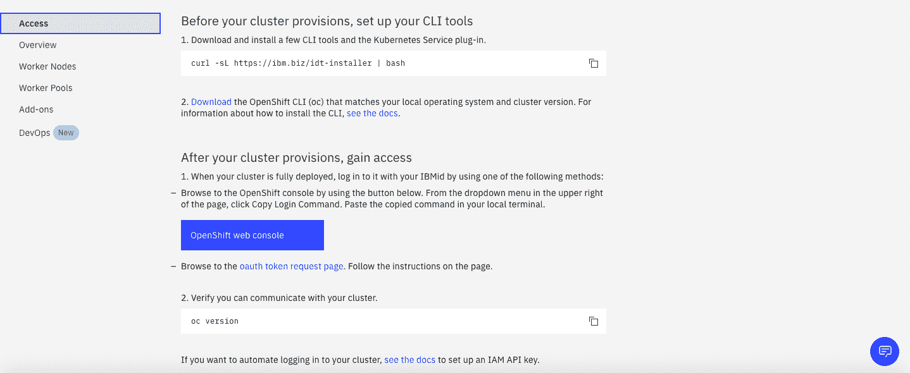
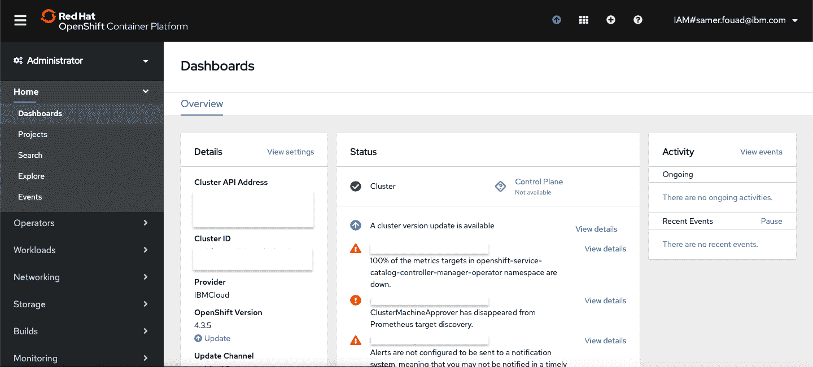
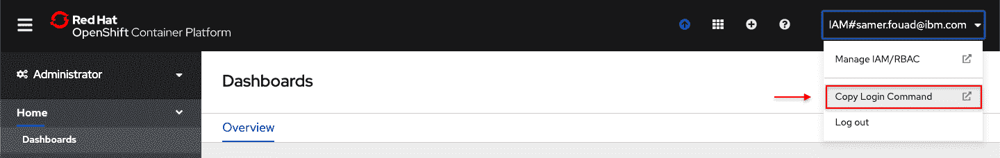
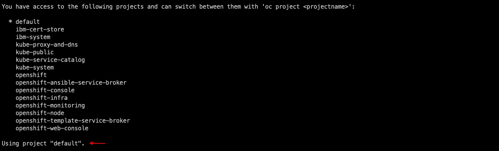
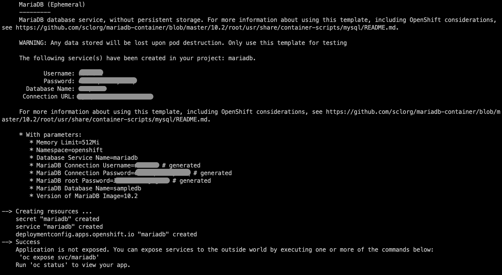
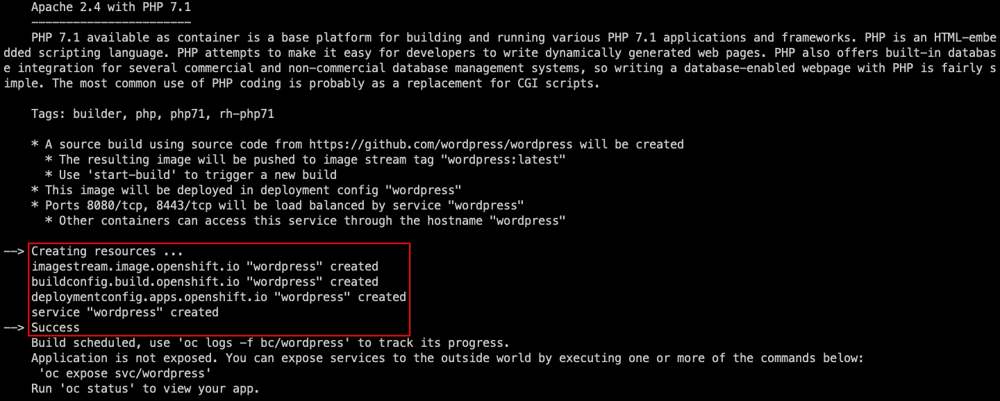
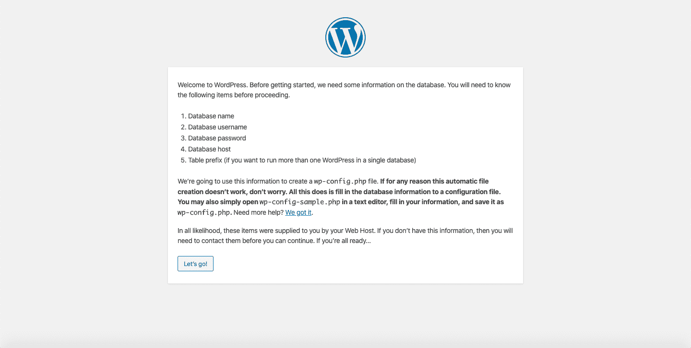
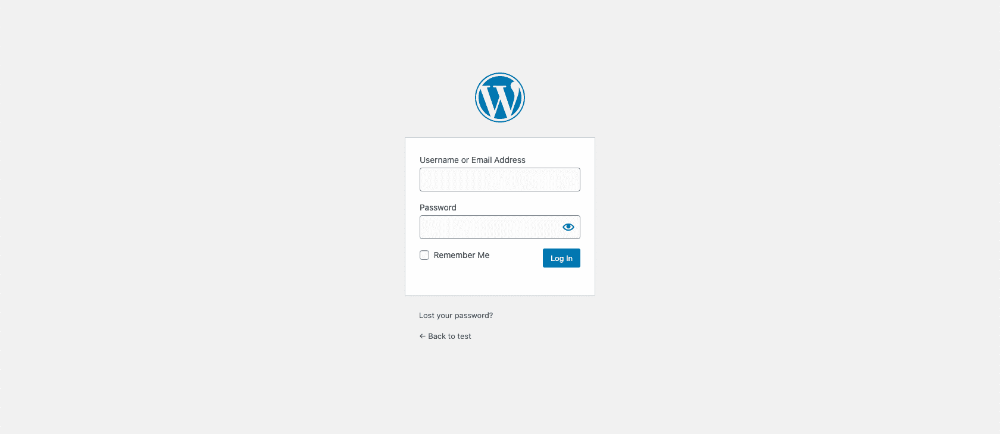
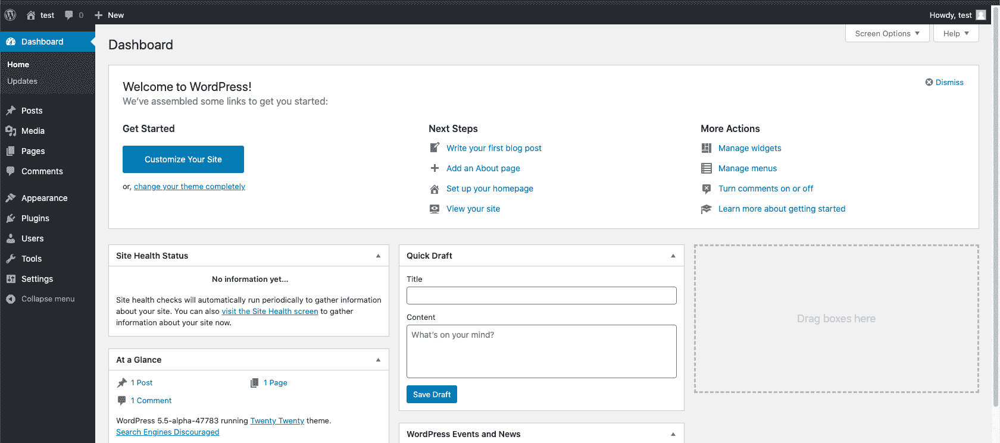
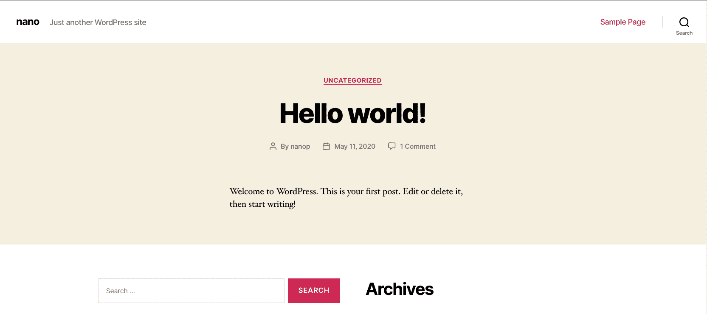

# 使用 MariaDB 在 OpenShift 上构建和部署 WordPress 应用

> 原文：[`developer.ibm.com/zh/tutorials/build-deploy-wordpress-on-openshift/`](https://developer.ibm.com/zh/tutorials/build-deploy-wordpress-on-openshift/)

在当今时代，大多数公司都需要采用一种快捷的方法来部署其基于容器的应用程序，以便以云友好的方式进行操作，并在将来轻松扩展。您可以选择普通的旧 Kubernetes，也可以选择其他几个基于 Kubernetes 构建的平台。使用 Red Hat® OpenShift® 的好处是速度足够快，能够提供免费的自定义域、大磁盘空间和大量的 MySQL 存储空间。它是一个功能强大的平台即服务 (PaaS) 产品，而不是使用速度可能很慢且效率不高的传统托管服务器。

全面的企业 Kubernetes 平台 [Red Hat OpenShift 4](https://www.redhat.com/en/openshift-4) 由 Kubernetes Operator 创新成果所驱动，可提供全栈自动化。Kubernetes 是一项重要而基础的 OpenShift 技术，因为它有助于在集群中的自动伸缩功能之间推动 Docker 镜像的部署和管理。

本教程将引导您使用 OpenShift 命令行界面 (CLI) 工具和 Web 控制台，在 IBM Cloud 的 OpenShift 管理集群上启动并运行您的第一个 WordPress 应用程序实例。

[WordPress](https://wordpress.com/) 是一种使用 PHP 编程语言编写的在线免费开源工具。它可能是当今最简单、功能最强大的博客和网站内容管理系统 (CMS)。个人、大型企业以及介于两者之间的每个人均可使用。WordPress 使用 MySQL 或 MariaDB 作为后端数据库引擎。如今，WordPress 由庞大的贡献者社区来构建和维护。

## 前提条件

本教程假定已经创建 OpenShift 4 集群。

另外，最好对 Kubernetes 和微服务软件架构的概念有个基本的了解。

确保所需的一切准备就绪：

*   创建一个 [IBM Cloud 帐户](https://cocl.us/IBM_CLOUD_GCG)。

*   [安装 OpenShift CLI](https://mirror.openshift.com/pub/openshift-v4/clients/oc/)。

*   （可选）一个活动的 [Git 帐户](https://github.com/)。

本教程采用以下技术：

*   [IBM Cloud](https://cloud.ibm.com/?cm_sp=ibmdev-_-developer-tutorials-_-cloudreg)：一整套云计算服务，提供平台即服务 (PaaS) 和基础架构即服务 (IaaS) 功能。

*   [Red Hat OpenShift Container Platform](https://cloud.ibm.com/kubernetes/catalog/about?platformType=openshift&cm_sp=ibmdev-_-developer-tutorials-_-cloudreg)：开发者友好型和操作友好型 Kubernetes 分发版。它可以在 Kubernetes 上运行（OpenShift 的先前版本使用与此不同的机制处理容器编排）。OpenShift 提供各类工具，帮助开发者和运维团队运行容器化的工作负载。

*   [MariaDB](https://mariadb.org/)：MariaDB 是全球最流行的数据库服务器之一。它是由 MySQL 的原始开发者开发的，并且保证一直开源

*   [Docker](https://www.docker.com/)：一个开源的容器化平台，用于在笔记本电脑、数据中心、虚拟机或云上构建、传输和运行分布式应用程序。

*   [oc](https://cloud.ibm.com/docs/openshift?topic=openshift-openshift-cli#cli_oc)：OpenShift Origin CLI (oc) 公开了用于管理应用程序的命令，并包含用于与系统的每个组件进行交互的低级工具。

## 预计花费时间

完成本教程大约需要 20 分钟。

## 在 OpenShift 上部署 WordPress 网站并连接到 MariaDB 实例

先注册并登录 [IBM Cloud](https://cocl.us/IBM_CLOUD_GCG)。

在 **Resource List** 下，您会看到 **clusters** 部分。展开此部分，查看您最近创建的 OpenShift 集群。选择该集群。

集群的控制台在 IBM Cloud 上还具有 **Access** 选项卡，其中提供了有关如何设置本教程中所用 OpenShift CLI 工具的信息和说明。



以下各部分将引导您完成本教程的步骤。

### 步骤 1：访问 OpenShift 用户界面

单击蓝色按钮，如以下截屏所示：


在集群的 Web 控制台中，您会在右上角看到您现在已自动进行身份验证、已经登录，并且已使用您的凭证与 OpenShift Container Platform 服务器建立了会话：



在成功下载并安装 OpenShift CLI 后，可以使用它登录并创建项目。

在服务目录页面右上角 OpenShift 集群的 Web 用户界面上，单击您的凭证，然后选择 **Copy Login Command**。它会使用您在 OpenShift Container Platform 服务器上登录时所用的凭证生成实时会话令牌。



注意：生成的令牌是一种密码。请勿与他人分享。

### 步骤 2：从 CLI 登录

打开您的 CMD/ 终端并粘贴登录凭证。该命令包含 `oc login + the server URL attached with the live session generated token`。



您现在已使用 oc CLI 成功登录至 OpenShift Container Platform 服务器。这会显示可用 OpenShift 项目的列表。

### 步骤 3：创建一个项目

创建一个项目来托管您的部署和资源。

从 CMD/ 终端，运行以下命令：

```
oc new-project <project-name>

oc new-project wordpress 
```

### 步骤 4：在 OpenShift 上部署您的数据库和 WordPress 应用

在创建项目后，您需要部署 WordPress 应用程序。

首先，您需要创建后端数据库实例，在本例中为 MariaDB。从 CMD/ 终端，运行以下命令：

```
oc new-app mariadb-ephemeral 
```

注：MariaDB 未使用持久存储。因此，当销毁 pod 时，存储的所有数据都会丢失。您可以在本教程中使用样本数据库进行测试。

记录 MariaDB 生成的信息：MariaDB 连接用户名、MariaDB 连接密码和 MariaDB 数据库名称。对于 DB 主机，使用 **mariadb**。



由于您将要部署 WordPress，因此使用 PHP 镜像在 Apache 上构建项目。

从 CMD/ 终端运行以下命令：

```
oc new-app php~https://github.com/wordpress/wordpress 
```

您可以通过查看日志来跟踪部署情况：

```
oc logs -f dc/wordpress 
```



在成功部署 WordPress 之后，您需要对其进行访问。使用以下命令将其公开为服务：

```
oc expose svc/<service>

oc expose svc/wordpress 
```

接下来，在服务路由中查询所生成的主机 URL。运行以下命令：

```
oc get routes 
```

从终端复制生成的主机名，并将其粘贴到任何浏览器中。您应该会看到已部署的 WordPress 应用程序的欢迎屏幕，等待数据库配置完成其设置。它应该类似于下面的截屏:



现在，您已经在一个项目下部署了两个资源：MariaDB 和 WordPress。

您可以通过返回至 Redhat OpenShift 控制台 Web 用户界面获得直观的视图。单击 **Refresh**，您将成功地看到新创建的项目列示在 **My Projects** 选项卡上，包括两个已创建的资源。

使用您先前创建的数据库信息来完成 WordPress 安装。完成所需的信息，然后单击 **Install WordPress**。

在成功设置 WordPress 后，会打开 WordPress 的登录屏幕。使用先前设置的用户名和密码登录：



您可以从 WordPress 仪表板开始构建自己的 WordPress 网站：



在左上角，单击带有主页图标的网站名称。单击 **View Site** 预览您的网站。以下截屏显示了所构建的 WordPress 网站已经部署：



## 结束语

恭喜！您学习了如何使用 Red Hat OpenShift on IBM Cloud 从容器内部部署与 MariaDB 实例连接的 WordPress 应用程序。

如果想了解有关如何开始使用 OpenShift 的更多信息，可查看 [Red Hat OpenShift on IBM Cloud](https://developer.ibm.com/zh/components/redhat-openshift-ibm-cloud/) 处的技术内容。例如，[Kubernetes 与 OpenShift 101：本地 OpenShift 环境入门练习](https://developer.ibm.com/zh/tutorials/kubernetes-openshift-minishift-101-labs/)展示了如何使用 MiniShift 在本地计算机上安装本地 OpenShift 环境。您还将了解有关部署和管理应用程序的基础知识。

本文翻译自：[Build and deploy a WordPress app on OpenShift using MariaDB](https://developer.ibm.com/tutorials/build-deploy-wordpress-on-openshift/)（2020-05-23）