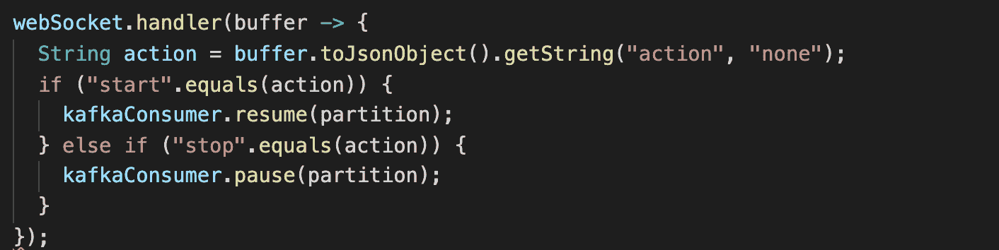

# 反应式 Kafka 应用程序的编写经验

> 原文：[`developer.ibm.com/zh/tutorials/transforming-a-kafka-application-to-be-reactive/`](https://developer.ibm.com/zh/tutorials/transforming-a-kafka-application-to-be-reactive/)

Apache Kafka 是一个功能非常强大的工具，用于流式处理大量数据并支持系统内的异步非阻塞通信。但是，在使用 Kafka 构建应用程序时，很难立即测试 Kafka 是否能够正常工作。为了帮助简化此过程，我们创建了一个 Kafka 启动应用，旨在使您能够使用一套功能齐全的 UI 来测试 Kafka 部署情况。

该应用程序的第一个版本是使用 Kafka Java [生产者（Producer）](https://kafka.apache.org/25/javadoc/org/apache/kafka/clients/producer/KafkaProducer.html)和[消费者（Consumer）](https://kafka.apache.org/25/javadoc/org/apache/kafka/clients/consumer/KafkaConsumer.html)客户端编写的。

[反应式系统](https://developer.ibm.com/articles/reactive-systems-getting-started)最近风头正盛。这些系统在弹性、灵活性和响应能力方面更加强大。在一定程度上，这是通过反应式系统中使用异步消息传递通信的应用程序来实现的。由于 Kafka 通常用作促进此异步消息传递的平台，因此我们决定探索以反应式理念重写 Kafka 应用程序的可选方案。

在本教程中，您将了解我们采用 [Vert.X Kafka 客户端](https://vertx.io/docs/vertx-kafka-client/java/)过渡到反应式编程样式的经验。同时还将了解反应式框架如何让我们简化代码并轻松构建反应式 Kafka 应用程序。最后，您可以按照本文结尾处的步骤试用我们的应用程序。

## 为什么在明确使用 Kafka 时要使用反应式工具包？

在编写与 Apache Kafka 集成的反应式应用程序时，使用基本的 Java [生产者](https://kafka.apache.org/25/javadoc/org/apache/kafka/clients/producer/KafkaProducer.html)和[消费者](https://kafka.apache.org/25/javadoc/org/apache/kafka/clients/consumer/KafkaConsumer.html)客户端可能是个不错的起点。但是，这些客户端尚未针对反应式系统进行优化。因此，您应该考虑使用反应式框架或工具包。针对 Kafka 应用程序使用反应式框架或工具包具有以下优点：

*   简化的 Kafka API 是反应式的
*   内置背压
*   支持异步的单个记录处理

包括 Kafka 客户端的开源反应式框架和工具包有以下几种：

*   [Vert.x Kafka 客户端](https://vertx.io/docs/vertx-kafka-client/java/)
*   [MicroProfile Reactive Messaging Kafka Connector](https://github.com/eclipse/microprofile-reactive-messaging)
*   [Project Reactor Kafka](https://projectreactor.io/docs/kafka/release/reference/)
*   [Alpakka Kafka Connector](https://doc.akka.io/docs/alpakka-kafka/current/home.html)

在我们的应用程序中，我们选择使用 Vert.x Kafka 客户端主要出于以下三个原因：用于协调的内部事件循环；面向消费者的背压支持；在我们已经使用和处理的项目中广为使用。

Vert.x 是一个开源项目，其中包括一个内部事件总线，允许您的应用程序的不同部分通过异步消息传递进行通信。另外，Vert.x 还为消费来自 Kafka 的记录提供了一个 [Java 客户端](https://vertx.io/docs/guide-for-java-devs/)，这个客户端可以轻松暂停和恢复使用。Vert.x 是一个非常流行的开源工具包，可用于 [Strimzi](https://strimzi.io/) 等项目，后者也是一个开源项目，可提供容器镜像和操作器（operators），以在 Kubernetes 上运行 Apache Kafka。

首先创建此应用程序的主要动机是，为开发者提供一种快速简便的方法来测试新的 Kafka 安装。我们还想用它作为一种途径，让开发者开始接触 Kafka 中使用的术语（例如主题、偏移量和分区），并探索如何在实践中使用这些术语。最后，我们需要一种机制允许开发者将自定义记录发送到 Kafka，并观察这些记录的再次消费情况。

为了实现这些目标，我们决定编写一个包含 JavaScript 前端和 Java 后端的应用程序。该前端将允许用户指定要发送给 Kafka 的有效负载，控制何时发送有效负载，以及何时从 Kafka 再次进行消费。然后，后端应用将获取此有效负载，并完成针对 Kafka 生成和消费记录的实际工作。我们决定将 WebSocket 用于前端，以将命令发送至后端，并让后端返回在 WebSocket 中生成或消费的任何记录的详细信息，以供前端显示。

下图代表了样本应用程序的架构。


## 代码的效率提升

如上所述，本应用程序的后端最初是使用 Apache Kafka 项目所提供的[生产者](https://kafka.apache.org/25/javadoc/org/apache/kafka/clients/producer/KafkaProducer.html)和[消费者](https://kafka.apache.org/25/javadoc/org/apache/kafka/clients/consumer/KafkaConsumer.html)客户端编写的。在编写应用程序时，我们原本希望通过改用反应式框架可以使工作变得更容易，但实际上却遇到了很多困难。这些问题包括：处理从 Kafka 返回的记录，解决与前端的信息交换，以及如何配置应用程序。

### 生成记录

在我们应用程序的原始版本和 Vert.x 版本中，记录生成流程十分简单：

1.  将启动命令发送到 WebSocket 的后端。
2.  后端启动生产者，该生产者每 2 秒发送一条新记录。
3.  将停止命令发送到 WebSocket 的后端。
4.  后端停止生产者，并且不再生成新记录。

在使用标准生产者客户端的原始应用程序中，生成记录的调用是阻塞调用。切换到 Vert.x 生产者意味着我们现在可以从 send 函数返回 Future。这使得应用程序可以在等待 Kafka 确认正在处理的记录的同时异步生成新记录。这是一个微小的代码更改，而反应式系统的一个重要功能就是在与外部服务（例如 Kafka）通信时更改为非阻塞。这样可以在这些外部服务不可用的情况下更轻松地构建弹性应用程序。

## 消费和处理记录

在应用程序的原始版本中，我们不得不在 `while` 循环内使用 `for`循环，从而在消费记录时产生以下流程：

1.  轮询记录。
2.  Poll 函数返回一批记录。
3.  迭代遍历批处理中的每条记录。
4.  对于每条记录，将 WebSocket 上的记录发送到前端。
5.  完成迭代后，返回到步骤 1。

因此，当我们处理当前的记录批次时，无法获取新的记录。


而在使用 Vert.x 客户端的新应用程序中，您只需编写一个 handler 函数，每次新记录到达时都将调用此函数。这支持异步消费和处理记录，也更适合反应式范式。


这一更改让流程更加简单。Vert.x 现在处理新记录的轮询步骤。应用程序代码执行以下操作：

1.  接收新记录。
2.  将 WebSocket 上的记录发送到前端。

这不仅支持应用程序按单个记录进行处理，而且使开发者可以专注于记录的处理，而不是从 Kafka 消费记录的工作。

### 流控制

我们希望能够从前端暂停和恢复记录的生成和消费。在使用默认 Java Kafka 客户端的原始应用程序中，需要根据前端中的命令退出和恢复用于轮询消费者的 `while` 循环。由于此客户端是单线程的，因此必须在与应用程序主流程不同的线程中执行循环。由于我们想生成有关某个计时器的记录，因此生产者需要在单独的线程中有类似的 `while` 循环。我们因而不得不解决这样一个难题，也就是编写逻辑来控制线程生命周期并在线程之间同步数据，以便对记录流进行控制。

在 Vert.x 应用程序中，我们能够结合使用 Vert.x 功能和 Vert.x Kafka 客户端功能，从而使此流控制更加轻松。对于生产者，我们使用了 Vert.x 中的一项功能，支持在[计时器基础上](https://vertx.io/docs/apidocs/io/vertx/core/TimeoutStream.html)调用处理程序。该处理程序可以调用一次，也可以多次调用，当来自 WebSocket 的启动和停止请求到达时，我们很容易就能暂停和恢复计时器。

对于 Vert.x 应用程序中的消费者，我们可以使用内置的[背压支持](https://vertx.io/docs/vertx-kafka-client/java/#_message_flow_control)来暂停和恢复消费者。当 WebSocket 发出停止命令时，将暂停消费者，并且 Vert.x 客户端将会停止从 Kafka 轮询新记录。稍后，消费者可以恢复，Vert.x 客户端将恢复轮询，并且现有处理程序将开始接收新记录。



为了将命令发送给客户端以开始或停止生成或消费记录，我们使用了 Vert.x 内部事件总线。来自 WebSocket 的消息可以轻松地传递到沿事件总线运行生产者和消费者的“Verticle”。这样一来，对于应用程序的 Vert.x 版本，我们就不必编写任何线程处理逻辑。

## 其他有用的 Vert.x 功能

Vert.x 是提供大量库的模块化工具箱，您只需要使用所需要的模块即可构建应用程序。对于我们的应用程序，我们发现一个很有用的库就是 [Vert.x Config 库](https://vertx.io/docs/vertx-config/java/)，该库支持从多个位置加载配置和使用各种语法。

编写现代的云原生应用程序时，对您的配置进行外部化很重要。在原始应用程序中我们在一定程度上做到了这一点，但是保留了诸如键/值序列化器和反序列化器以及安全协议硬编码之类的选项。这样，我们便可以在不同的 Kafka 安装之间移动应用程序，但是仅在它们的配置相同的情况下进行。

对于 Vert.x 应用程序，我们决定更进一步，在外部提供所有的 Kafka 连接配置。然后就可以对任何 Kafka 使用该应用程序，并且在安全和不安全 Kafka 端点之间进行切换也会容易得多。

Vert.x Config 库支持我们提供一个 `kafka.properties` 文件，其中包含在运行时加载的所有配置。我们发现的唯一细微差别在于，检索到的配置通常会转换为 Java 原语。第一次尝试此操作时，我们发现 Vert.x 将名为“acks”([`kafka.apache.org/documentation/#acks`](https://kafka.apache.org/documentation/#acks)) 的 Kafka 生产者设置转换为 Double，而不是将其保留为 String。我们发现关闭转换后，Kafka 便会停止与配置值的格式有关的报错。

这只是我们选择包括在应用程序中的一项功能，以便为应用程序启用云原生方法，您也可以在 [Vert.x 文档](https://vertx.io)中探索其他众多出色的 Vert.x 库。

## 结束语及后续步骤

最后，将我们的应用程序更新为使用 Vert.x，这样我们就能够编写本质上更接近反应式的异步应用程序。现在，我们无需在单独的线程中调用生产者和消费者客户端来实现流控制，这也极大简化了我们的代码库。总体而言，我们发现在我们的用例中，一般性使用 Vert.x 和具体使用 Vert.x Kafka 客户端能够更轻松地与 Kafka 进行集成。

### 应用程序的运行步骤

我们的应用程序在 [GitHub](https://github.com/ibm-messaging/kafka-java-vertx-starter.git) 上提供，您可以自己尝试一下。在本文撰写之时，UI 尚不可用，希望很快就会发布，不过您仍然可以在没有 UI 的情况下试用该应用程序。

您将需要启动并运行 Kafka。要在本地计算机上运行 Kafka，可以执行 [Kafka 快速入门指南](https://kafka.apache.org/quickstart)的前两个步骤，以启动 Zookeeper 和 Kafka。如果要在 Kubernetes 上运行 Kafka，建议使用 [Strimzi 操作器](https://strimzi.io)。

ZooKeeper 和 Kafka 运行之后，按照以下步骤运行该应用程序：

1.  克隆样本应用的代码库：

    ```
     git clone https://github.com/ibm-messaging/kafka-java-vertx-starter.git 
    ```

2.  将目录更改为克隆了样本应用的目录：

    ```
     cd kafka-java-vertx-starter 
    ```

3.  构建样本应用：

    ```
     mvn package 
    ```

4.  如果无法通过 `localhost:9092` 来访问 Kafka，或者已开启安全性，则需要编辑 `kafka.properties` 文件。如果您根据快速入门指南启动了 Kafka，则无需更改 `kafka.properties`。

5.  运行样本应用：

    ```
     java -jar target/demo-0.0.2-SNAPSHOT-all.jar 
    ```

6.  连接到生产者：`ws://localhost:8080/demoproduce`。您可以在终端中使用 [`websocat`](https://github.com/vi/websocat)，也可以在浏览器中使用 [websocket.org 回显测试](https://www.websocket.org/echo.html)。

7.  通过将以下消息发送到 websocket，开始将记录发送到 Kafka：`{"action":"start"}`。只要应用程序向 Kafka 发送新记录，websocket 就会收到通知。

8.  通过将以下消息发送到 websocket，停止发送记录：`{"action":"stop"}`。

9.  断开与生产者 websocket 的连接。

10.  连接到消费者：`ws://localhost:8080/democonsume`

11.  断开与消费者 websocket 的连接。

您还可以观看我们运行该应用以及演示如何使用该应用：

[https://cdnapisec.kaltura.com/p/1773841/sp/177384100/embedIframeJs/uiconf_id/39954662/partner_id/1773841?iframeembed=true&playerId=kaltura_player&entry_id=0_e9njtrm3&flashvars[akamaiHD.loadingPolicy]=preInitialize&flashvars[akamaiHD.asyncInit]=true&flashvars[twoPhaseManifest]=true&flashvars[streamerType]=hdnetworkmanifest&flashvars[localizationCode]=en&flashvars[leadWithHTML5]=true&flashvars[sideBarContainer.plugin]=true&flashvars[sideBarContainer.position]=left&flashvars[sideBarContainer.clickToClose]=true&flashvars[chapters.plugin]=true&flashvars[chapters.layout]=vertical&flashvars[chapters.thumbnailRotator]=false&flashvars[streamSelector.plugin]=true&flashvars[EmbedPlayer.SpinnerTarget]=videoHolder&flashvars[dualScreen.plugin]=true&flashvars[Kaltura.addCrossoriginToIframe]=true&&wid=0_t8caag8m](https://cdnapisec.kaltura.com/p/1773841/sp/177384100/embedIframeJs/uiconf_id/39954662/partner_id/1773841?iframeembed=true&playerId=kaltura_player&entry_id=0_e9njtrm3&flashvars[akamaiHD.loadingPolicy]=preInitialize&flashvars[akamaiHD.asyncInit]=true&flashvars[twoPhaseManifest]=true&flashvars[streamerType]=hdnetworkmanifest&flashvars[localizationCode]=en&flashvars[leadWithHTML5]=true&flashvars[sideBarContainer.plugin]=true&flashvars[sideBarContainer.position]=left&flashvars[sideBarContainer.clickToClose]=true&flashvars[chapters.plugin]=true&flashvars[chapters.layout]=vertical&flashvars[chapters.thumbnailRotator]=false&flashvars[streamSelector.plugin]=true&flashvars[EmbedPlayer.SpinnerTarget]=videoHolder&flashvars[dualScreen.plugin]=true&flashvars[Kaltura.addCrossoriginToIframe]=true&&wid=0_t8caag8m)

您可以在我们的 [GitHub 代码库](https://github.com/ibm-messaging/kafka-java-vertx-starter)中探索应用程序的源代码。

### 深入探索反应式系统

如果您想深入了解反应式系统，可以下载免费电子书“[反应式系统解读](https://ibm.biz/reactivereport)”，也可以查看“[反应式系统入门](https://developer.ibm.com/articles/reactive-systems-getting-started)”一文。

如果您已经熟悉反应式系统的概念，但想要探索如何让自己的应用程序反应更迅速，可以在 openliberty.io（我们的轻量级开源 Web 应用程序服务器）上阅读我们的指南“[创建反应式 Java 微服务](https://openliberty.io/guides/microprofile-reactive-messaging.html)”。本指南向您介绍了 [MicroProfile Reactive Messaging 规范](https://download.eclipse.org/microprofile/microprofile-reactive-messaging-1.0/microprofile-reactive-messaging-spec.pdf)。您也可以查看“[反应式编程实战](https://developer.ibm.com/series/reactive-in-practice)”系列教程，其中一步步记录了将 Stock Trader 应用程序转换为反应式系统的过程。

如果您希望开始构建反应式系统，但又希望为企业应用程序使用受支持的运行时，我们通过 Red Hat 运行时产品提供了几种选项，包括来自 [OpenLiberty](https://openliberty.io/) 和 [MicroProfile](https://microprofile.io/) 的反应式 API，以及 [Vert.x](https://vertx.io/) 和 [Quarkus](https://quarkus.io/)。这些都已纳入我们的 [IBM Cloud Pak for Application](https://www.ibm.com/cn-zh/cloud/cloud-pak-for-applications) 产品。

### 深入探索 Kafka

如果您已阅读本文，现在希望进一步探索 Kafka，请查看我们在 IBM Developer 上的 Apache Kafka 专区，获取有用的文章、教程和 Code Pattern。您也可以直接转至我们的“Apache Kafka 简介”一文开始学习。

如果您正在寻找完全受支持的 Apache Kafka 产品，请查看 IBM 提供的 Kafka 产品 [IBM Event Streams](https://www.ibm.com/cn-zh/cloud/event-streams)。[IBM Cloud Pak for Integration](https://www.ibm.com/cn-zh/cloud/cloud-pak-for-integration) 中的 Event Streams 为 Apache Kafka 增添了一些宝贵的功能，包括强大的操作工具、模式注册表、屡获殊荣的的用户体验，以及可连接到各种核心企业系统的广泛连接器目录。”

本文翻译自：[Experiences writing a reactive Kafka application](https://developer.ibm.com/tutorials/transforming-a-kafka-application-to-be-reactive/)（2020-06-01）