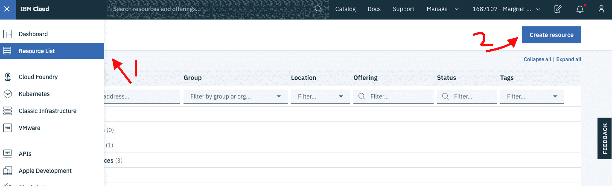
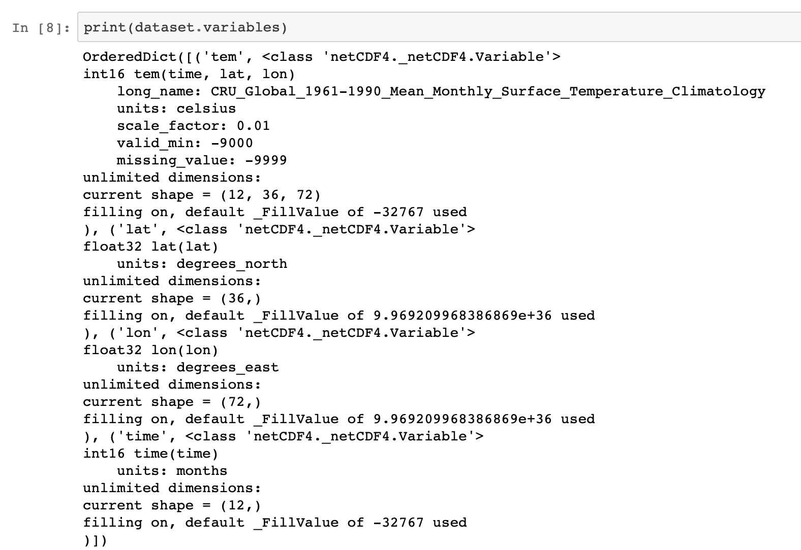
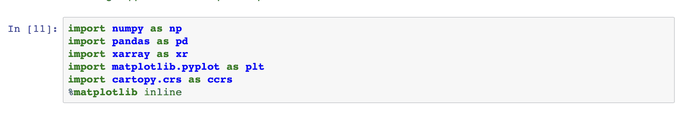

# 在 Python 中处理地理空间栅格数据

> 原文：[`developer.ibm.com/zh/tutorials/working-with-geospatial-raster-data-in-python/`](https://developer.ibm.com/zh/tutorials/working-with-geospatial-raster-data-in-python/)

本教程已纳入[使用 Python 执行数据分析](https://developer.ibm.com/zh/series/learning-path-data-analysis-using-python/)学习路径。

| 级别 | 主题 | 类型 |
| --- | --- | --- |
| 100 | [在 Python 中使用 pandas 执行数据分析](https://developer.ibm.com/zh/tutorials/data-analysis-in-python-using-pandas) | 教程 |
| 101 | [使用 Python 处理地理空间数据的简介](https://developer.ibm.com/zh/articles/introduction-to-geospatial-data-using-python/) | 文章 |
| 201a | [在 Python 中处理地理空间矢量数据](https://developer.ibm.com/zh/tutorials/working-with-geospatial-vector-data-in-python/) | 教程 |
| **201b** | **[在 Python 中处理地理空间栅格数据](https://developer.ibm.com/zh/tutorials/working-with-geospatial-raster-data-in-python/)** | 教程 |

栅格数据是一种地理空间数据，其中包含网格和矩阵形式的几何位置相关信息。根据属性的类型和数量，这些矩阵可以是多维的，每个维度表示一个特性，并且其中的每个像素都包含表示特性的值。例如，以多维数组形式表示的城市天气信息的数据集可以包含有关温度、相对湿度和风速的详细信息。卫星图像或任何表示地理位置的图像都是栅格数据形式。


netCDF、PNG、JPEG、TIFF 和二进制文件都是栅格数据类型的示例。可以在[此处](https://www.igismap.com/raster-data-file-format/)找到大量的数据类型列表。“[使用 Python 处理地理空间数据的简介](https://developer.ibm.com/zh/articles/introduction-to-geospatial-data-using-python/)”一文中介绍了有关栅格数据以及使用 Python 表示和访问栅格数据的不同方法的详细信息。在本教程中，我们提供代码示例来解释如何在 Python 中处理栅格数据。

## 前提条件

要完成本教程，您需要：

*   一个 [IBM Cloud](https://cocl.us/IBM_CLOUD_GCG) 帐户
*   [Watson Studio](https://dataplatform.cloud.ibm.com/docs/content/wsj/getting-started/overview-ws.html)

## 步骤

### 设置

1.  注册或登录至 IBM Cloud。

2.  单击 Resources 页面顶部的 **Create resource**。您可以在左上角的汉堡菜单下看到资源。

    

3.  搜索 **Watson Studio**，然后单击该卡片。

    

4.  选择 Lite 套餐，然后单击 **Create**。

5.  返回到 Resources 列表，单击 Watson Studio 服务，然后单击 **Get Started**。

    

    您现在应该已经进入 Watson Studio 中了。

6.  单击 **Create a project** 或 **New project**。

7.  选择 **Create an empty project**。
8.  为项目提供一个名称。
9.  选择现有的对象存储服务实例或创建一个新实例。这用于存储 Notebook 和数据。注意：返回到 Project 页面后，别忘了单击刷新。
10.  单击 **Create**。

### 创建项目访问令牌

要将数据载入 Notebook，您需要一个访问令牌。

1.  转至项目顶部的 Settings 选项卡，然后向下滚动至 **Access tokens**。
2.  单击 **New token**。
3.  命名新令牌，选择 **Editor**，然后单击 **Create**。

    

    稍后在 Notebook 中需要此访问令牌。

### 创建定制 Python 环境

由于默认 Python 环境中未安装所需的库，因此必须使用 `conda create` 创建定制环境。但是，由于该环境正在 IBM Cloud 中运行，因此需要执行一些步骤。

1.  转至项目顶部的 environments 选项卡。
2.  单击 **New environment definition**。

    

3.  命名您的新环境。

4.  保留默认值，选择免费硬件配置 **Free – 1 vCPU and 4 GB RAM**、**Default Python 3.6**，然后单击 **Create**。

    

5.  定制新环境。向下滚动，然后单击 Customization 下的 **Create** 链接

    

6.  这将打开您可以编辑的文本字段。删除所有文本，然后将以下代码复制粘贴到该文本字段中。

    ```
     channels:
     - defaults
     - conda-forge

     # Please add conda packages here
     dependencies:
     - mapclassify==1.0.1
     - netcdf4
     - xarray
     - numpy=1.16.4
     - tensorboard=1.13.0
     - basemap=1.2.1
     - cartopy

     # Please add pip packages here
     # To add pip packages, please comment out the next line
     #- pip: 
    ```

7.  单击 **Apply**。

现在，您可以使用该新环境来运行 Notebook

## 载入并运行一个 Notebook

添加新的 Notebook：

1.  单击 **Add to project**，然后选择 **Notebook**。

    

2.  选择 **New notebook from URL**。

3.  命名您的 Notebook，然后复制 URL [`github.com/IBM/data-analysis-using-python/blob/master/notebooks/raster-data-using-python.ipynb`](https://github.com/IBM/data-analysis-using-python/blob/master/notebooks/raster-data-using-python.ipynb)。
4.  选择您创建的 **Custom runtime environment**，然后单击 **Create Notebook**。

此时将加载 Notebook。遵循 Notebook 中的指示信息，然后运行所有单元。接着返回至本教程。

## Notebook 概述

### 关于数据集

[数据集](https://crudata.uea.ac.uk/cru/data/temperature/#datdow)包含一个 5° x 5° 的网格，其中具有 1961 到 1990 年的绝对温度。采用 [NetCDF](https://pro.arcgis.com/en/pro-app/help/data/multidimensional/what-is-netcdf-data.htm) 格式表示数据。

## netCDF4 和 matplotlib

### 使用 netCDF 执行数据分析

在本教程的前半部分，您将了解如何使用 Python 的 [netCDF4](https://unidata.github.io/netcdf4-python/netCDF4/index.html) 模块从数据集中抽取数据。以下代码样本显示了我们在整个 Notebook 中使用的导入内容的显式列表。


首先，我们使用 helper 函数导入数据集，该函数使用了先前步骤中创建的项目令牌。


然后，我们使用 netCDF4 *Dictionary* 集合来分析数据以及构成 netCDF 文件的字段之间的关系。


为提取 netCDF 文件的数据模型版本，我们使用了 `data_model` 变量。数据模型可以是 NETCDF3_CLASSIC、NETCDF4、NETCDF4_CLASSIC、NETCDF3_64BIT_OFFSET 或 NETCDF3_63BIT_DATA 数据模型版本之一。


`dimensions` 将返回一个字典，其中包含来自映射到 `Dimensions` 类实例的数据集的变量名称。它提供变量的名称及其大小。


`variables` 将返回一个字典，用于将来自数据集的变量名称映射为 `Variable` 类的实例。



以下代码示例演示了如何将来自数据集的变量作为 `variables` 代码样本中所返回字典的键进行访问。


### 使用 matplotlib 绘图

现在，让我们看看如何在 Python 中使用 matplotlib 及其扩展来绘制 2D 地图。我们在此处使用 matplotlib [basemap](https://matplotlib.org/basemap/users/intro.html) 工具包。为在 2D 平面上绘制点，`basemap` 类支持 24 种不同类型的[投影](https://matplotlib.org/basemap/users/mapsetup.html)。在此示例中，我们使用[米勒圆柱投影](https://matplotlib.org/basemap/users/mill.html)，该投影方法通常用于墙面挂图而非导航地图。`llcrnrlon` 和 `llcrnrlat` 表示所需地图域左下角的经度和纬度（以度为单位）。


`addcyclic` 将经度列添加到一组数据。在代码中，您看到经度数组已添加到包含温度条目的数组中。`shiftgrid` 将所有经度和数据向东或向西移动。`meshgrid` 方法将从一维坐标数组返回坐标矩阵。在代码中，我们使用 `meshgrid` 将经度和纬度数组转换为 *x* 和 *y* 坐标数组。

## xarray 和 Cartopy

### 使用 xarray 执行数据分析

本部分内容将介绍如何使用 [xarray](http://xarray.pydata.org/en/stable/) 来处理 netCDF 数据。`xarray` 可用于分析多维数组并共享来自 pandas 和 NumPy 的函数。`xarray` 已被证实是可用于处理 netCDF 文件的强大库。

以下代码示例列举了必需的导入，需要完成这些导入才能运行 Notebook。



然后，我们使用 `xarray` 打开并载入数据集。


`xarray` 支持以下数据结构：

*   `DataArray` – 多维数组
*   `Dataset` – 包含多个 DataArray 对象的字典

netCDF 数据将在 `xarray` 中表示为 Dataset。

`values` 将返回一个 n 维数组，用于表示数据集中的值。您可以看到该数据集包含三个坐标：lat、lon 和 time。它还包含一个数据变量温度，该温度是一个浮点值。


`dims` 将返回 *x*、*y* 和 *z* 坐标的值。


`coords` 仅从 `values` 变量返回坐标部分。


由于 `xarray` 是 pandas 的扩展，因此它提供了一种方法，可以将数据集转换为 DataFrame。


### 使用 xarray 绘图

`Xarray` 还通过扩展 matplotlib 库来支持绘图功能。可以使用 `xarray` 库来绘制 DataArray 对象。要绘制 Dataset 对象，就需要访问相关的 DataArray 或维度。


### 使用 Cartopy 绘制

[Cartopy](https://scitools.org.uk/cartopy/docs/latest/) 是与 `xarray` 兼容的多个绘图应用程序之一。其他应用程序有 Seaborn、HoloViews 和 GeoViews。

以下示例是使用 cartopy 创建可视化效果的简单示例。我们将[摩尔威德投影](https://scitools.org.uk/cartopy/docs/latest/crs/projections.html#mollweide)与米勒圆柱投影做了对比。[Cartopy 投影列表](https://scitools.org.uk/cartopy/docs/latest/crs/projections.html)提供了投影的完整列表。


以下示例是一个热图，用于比较一月和六月之间的温度强度。


## 结束语

本教程向您介绍了地理空间栅格数据的基础知识。文中概述了如何使用两组 Python 库来分析 NetCDF 数据。第一个示例展示了如何使用 netCFF4 Python 库提取数据，以及使用 matplotlib 实现可视化效果。第二个示例展示了如何使用 `xarray` 处理数据，以及使用 Cartopy 绘制图形。本教程已纳入[使用 Python 执行数据分析](https://developer.ibm.com/zh/series/learning-path-data-analysis-using-python/)学习路径。您现在应该对使用 Python 处理数据有了更多的了解。

本文翻译自：[Working with geospatial raster data in Python](https://developer.ibm.com/tutorials/working-with-geospatial-raster-data-in-python/)（2020-04-09）