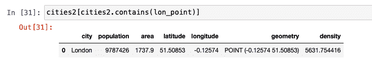

# 在 Python 中处理地理空间矢量数据

> 原文：[`developer.ibm.com/zh/tutorials/working-with-geospatial-vector-data-in-python/`](https://developer.ibm.com/zh/tutorials/working-with-geospatial-vector-data-in-python/)

本教程已纳入[使用 Python 执行数据分析](https://developer.ibm.com/zh/series/learning-path-data-analysis-using-python/)学习路径。

| 级别 | 主题 | 类型 |
| --- | --- | --- |
| 100 | [在 Python 中使用 pandas 执行数据分析](https://developer.ibm.com/zh/tutorials/data-analysis-in-python-using-pandas) | 教程 |
| 101 | [使用 Python 处理地理空间数据的简介](https://developer.ibm.com/zh/articles/introduction-to-geospatial-data-using-python/) | 文章 |
| **201a** | **[在 Python 中处理地理空间矢量数据](https://developer.ibm.com/zh/tutorials/working-with-geospatial-vector-data-in-python/)** | 教程 |
| 201b | [在 Python 中处理地理空间栅格数据](https://developer.ibm.com/zh/tutorials/working-with-geospatial-raster-data-in-python/) | 教程 |

矢量数据是一种地理空间数据，其中包含坐标形式的几何位置相关信息。这些坐标可以是点、线或多边形。矢量数据可用于推断地理信息。例如，使用两个不同城市的纬度和经度，就可以计算它们之间的距离。


[使用 Python 处理地理空间数据的简介](https://developer.ibm.com/zh/articles/introduction-to-geospatial-data-using-python/)一文中介绍了有关矢量数据以及使用 Python 表示和访问矢量数据的不同方法的更多信息。在本教程中，我们使用代码片段来解释如何处理矢量数据。

## 前提条件

要完成本教程，您需要：

*   一个 [IBM Cloud](https://cocl.us/IBM_CLOUD_GCG) 帐户
*   [Watson Studio](https://dataplatform.cloud.ibm.com/docs/content/wsj/getting-started/overview-ws.html)

## 步骤

### 设置

1.  注册或登录至 IBM Cloud。

2.  单击 Resources 页面顶部的 **Create resource**。您可以在左上角的汉堡菜单下看到资源。

    

3.  搜索 **Watson Studio**，然后单击该卡片。

    

4.  选择 Lite 套餐，然后单击 **Create**。

5.  回到 Resources 列表，单击 Watson Studio 服务，然后单击 **Get Started**。

    

    您现在应该已经进入 Watson Studio 中了。

6.  单击 **Create a project** 或 **New project**。

7.  选择 **Create an empty project**。
8.  指定项目名称。
9.  选择现有的对象存储服务实例或创建一个新实例。这用于存储 Notebook 和数据。注意：返回到 Project 页面后，别忘了单击刷新。
10.  单击 **Create**。

### 创建项目访问令牌

要将数据载入 Notebook，您需要一个访问令牌。

1.  转至项目顶部的 Settings 选项卡，然后向下滚动至 **Access tokens**。
2.  单击 **New token**。
3.  命名新令牌，选择 **Editor**，然后单击 **Create**。

    

    稍后在 Notebook 中需要此访问令牌。

### 创建定制 Python 环境

由于所需的库未安装在默认 Python 环境中，因此必须使用 `conda create` 创建定制环境。但是，由于该环境正在 IBM Cloud 中运行，因此需要执行一些步骤。

1.  转至项目顶部的 environments 选项卡。
2.  单击 **New environment definition**。

    

3.  命名您的新环境。

4.  保留默认值，选择免费硬件配置 **Free – 1 vCPU and 4 GB RAM**、**Default Python 3.6**，然后单击 **Create**。

    

5.  定制新环境。向下滚动，然后单击 Customization 下的 **Create** 链接

    

6.  将打开一个文本字段，您可以对其进行编辑。删除所有文本，然后将以下代码复制粘贴到该文本字段中。

    ```
     channels:
     - defaults
     - conda-forge

     # Please add conda packages here
     dependencies:
     - geopandas=0.4.1
     - geoplot=0.2.4
     - pysal=2.0.0
     - folium=0.9.1
     - python=3.6.8

     # Please add pip packages here
     # To add pip packages, please comment out the next line
     #- pip: 
    ```

7.  单击 **Apply**。

现在，您可以使用该新环境来运行 Notebook

## 加载并运行一个 Notebook

添加新的 Notebook：

1.  单击 **Add to project**，然后选择 **Notebook**。

    

2.  选择 **New notebook from URL**。

3.  命名您的 Notebook，然后复制 URL [`github.com/IBM/data-analysis-using-python/blob/master/notebooks/vector-data-using-geopandas.ipynb`](https://github.com/IBM/data-analysis-using-python/blob/master/notebooks/vector-data-using-geopandas.ipynb)。
4.  选择您创建的 **Custom runtime environment**，然后单击 **Create Notebook**。

此时将加载 Notebook。遵循 Notebook 中的指示信息，运行所有单元。接着返回至本教程。

## Notebook 概述

### 关于数据集

起初，我们先创建一个简单的矢量数据集，其中包含有关英国五个城市的信息。在了解了基础知识之后，我们使用了包含伦敦行政区域相关信息的数据集。然后，我们继续分析 [Open Street Map(OSM)](https://www.openstreetmap.org/about) 中的矢量数据。

以下列表提供了您在 Python 中使用 GeoPandas 探究矢量数据的一些功能。

*   属性和方法
*   点、线与多边形
*   覆盖
*   缓冲区
*   空间关系（包含、内部、相交、交叉、不相交）
*   融合
*   合并

与本教程关联的 [notebook](https://github.com/IBM/data-analysis-using-python/blob/master/notebooks/vector-data-using-geopandas.ipynb) 显示了 GeoPandas 的这些功能。

### 初始化 GeoDataFrame

除了使用 [GeoPandas](https://geopandas.org)（pandas 的扩展）之外，我们还使用 [Shapely](https://shapely.readthedocs.io/en/latest/) 来定义几何对象，并使用 [matplotlib](https://matplotlib.org) 来可视化某些特性。下图显示了使用的 `import` 的列表。


我们首先使用 pandas 创建一个简单的 DataFrame。下图显示了包含不同城市纬度和经度信息的样本矢量数据。


然后，我们创建一个名为 *point* 的附加列，该列结合了先前定义的 DataFrame 中的经度和纬度列。通过使用 Shapely 初始化此列中的条目，可以将其转换为 `Point` 对象。该列名为 *geometry*。


#### GeoSeries 和 GeoDataFrame

GeoPandas 通过 pandas 扩展了它的两个主要数据结构：GeoSeries 和 GeoDataFrame。与 pandas Series 非常类似，GeoSeries 是一种矢量，其中每个条目都表示一个或多个与一行对应的形状。GeoDataFrame 与 pandas DataFrame 非常类似，是一个二维数据结构，具有一个 GeoSeries 列以及其他信息。GeoDataFrame 中的 GeoSeries 列被称为 *geometry*。

下图的代码片段展示了如何通过扩展现有的 DataFrame 来创建 GeoDataFrame。现在删除 point 列，因为不再需要该列。


### 属性和方法

这个新的 GeoDataFrame 定义了与 pandas DataFrame 相同的属性和方法。例如，下图中的代码展示了如何计算 population 列的平均值和 area 列的最小值。


下图展示的代码演示了如何使用人口和面积计算密度。到目前为止，此 GeoDataFrame 在其 pandas DataFrame 的属性方面没有任何改变。


但是，此 GeoDataFrame 附带了多个其他属性和方法。在应用方法或属性时，会将其应用到 *geometry* 列。可以在[此处](https://geopandas.org/reference.html)找到完整的函数列表。让我们先来看一些流行的内置属性。它们是 `area`、`bounds`、`total_bounds` 和 `geom_type`。

由于我们的城市 DataFrame 仅包含点，因此 `area` 返回的 GeoSeries 为 0。


`total_bounds` 返回 DataFrame 中条目之间 x 和 y 坐标的最小和最大范围。


`geom_type` 返回每个条目的几何类型。GeoDataFrame 可以具有多种几何类型。


在以下示例中，`distance` 可帮助计算其他四个城市到伦敦的距离。


现在，我们创建另一个 GeoDataFrame，它是原始城市数据集的子集。通过从原始数据集中删除两行，让我们尝试其他一些属性和方法，以进一步了解 GeoPandas 的功能。


`area` 返回一个与我们之前看到的有些类似的 DataSeries。


`Bounds` 与 `total-bounds`（参见上文）有所不同，因为 `bounds` 返回的是 DataFrame 中每个条目的 x 和 y 的最小值和最大值的数组，而 `total-bounds` 返回的是整个 DataFrame 的一个集合。


`geom-type` 与我们之前在城市数据集中看到的相同。


`centroid` 方法将返回每个几何的中心点的 GeoSeries。如果是点，将移除点本身。但是，“线”或“多边形”几何上的行为将有所不同。


`Representative-point` 方法将返回一个保证在几何图形内的点。它可以是质心，但不一定就是质心。与质心类似，对于点几何，将返回点本身。


### 点、线与多边形

由于我们使用 Shapely 预先定义了城市 GeoDataFrame 中的点，因此可以使用 `squeeze` 方法来提取表示每个城市的点。下图显示了相应的代码。


通过组合两个点并应用 Shapely 的 `LineString` 对象，构建表示线条的 GeoSeries。以下代码片段展示了如何使用此方法在城市之间构造多条线。


可以通过类似方式组合三个或更多点以形成多边形。Shapely 具有 Polygon 接口，用于定义此多边形并创建 GeoSeries。


上图中显示的图形用不同的颜色展示了每个城市之间的线条，以及通过连接三个城市而形成的两个多边形。我们使用内置的 `plot` 方法来表示图形。

### 覆盖

为了观察多个数据集之间的相互作用，我们使用了覆盖库。`union`、`difference`、`symmetrical difference` 和 `intersection` 是可以执行的一些操作。

下图显示了上图中展示的两个多边形的并集。


### 缓冲区

缓冲区是在对象周围添加缓冲区以标识区域的方法。缓冲区的单位和度量因使用情况而异。缓冲区可以应用于点、线或多边形，结果始终是多边形。

在下面的代码中，我们创建了只有一行的 DataFrame，以展示缓冲区大小如何因每次提供给同一条目的距离而异。


下图中的内部红点表示实际点。围绕此点的其他三个同心环表示不同的缓冲区大小。确定从病毒震中起需要隔离的面积，就是应用缓冲区的一个示例。


### 空间关系

GeoPandas 提供了多个二进制谓词，可以将它们应用于 GeoDataFrame，以了解两个数据集之间的关系。例如，考虑一下我们在本教程中设置的两个数据集：cities 和 cities2。下图可帮助您更直观地呈现结果。


`contains` 是最受欢迎的关系测试方法之一。我们提供了四个不同的 `contains` 示例，可用于发现地理空间特性或几何图形之间的关系。

为计算 cities 数据集中存在的 cities2 的点，我们使用以下代码。


为查明 cities2 数据集中哪些几何图形包含伦敦，我们使用以下代码。


为显示上一个查询的条目，我们按如下所述调用条目。



下图显示了类似的代码，用于发现哪个条目包含曼彻斯特数据点。


`within` 是另一个关系测试，用于发现一个点是否位于另一个点之内。下图展示了如何使用 `within` 的输入和输出示例。`intersects`、`crosses` 和 `disjoint` 的使用方式也是相同的，如下所示。


### 融合

当我们要组合同一数据集中一行或多行的地理位置时，我们使用 `dissolve` 方法。这对于从子集或整个数据集中获取几何对象的宏观视图很有用。为展示`dissolve` 的工作方式，我们通过从 URL 加载 JSON 文件来创建以下 GeoDataFrame。


然后，我们继续绘制行政区域图，显示这些行政区域在融合之前的外观。


我们创建一个名为 *all* 的列并将其设置为 1，以便将所有行聚合为一行。聚合函数参数 `aggfunc` 可以是 *first*、*last*、*min*、*max*、*sum*、*mean* 或 *median* 之一，以指示需要如何聚合数字字段。以下示例指示需要添加所有行的信息。


须注意如何将所有单个多边形组合成一个 Multipolygon。如图所示，分隔这些行政区域的细线在图中并不存在。轴标签被关闭，并且增加了图形大小，使内容更加清晰。


### 合并

`join` 用于将多个数据集中的行合并为一个。

我们先通过导入 .csv 文件来创建 pandas DataFrame。须注意，此 DataFrame 上的行数是 5，列数是 84。最初的行政区域 DataFrame 只有 6 列。


在将索引列设置为 *code* 并应用 `join` 之后，我们注意到新的 GeoDataFrame 包含相同行数，即 5，但是列数现在为 89，这是两个 DataFrame 中的列数之和。


以下代码展示了伦敦内部和外部行政区域的分类和可视化效果。这是通过在 *Inner/_Outer_London* 列上应用 dissolve 并将 mean 用作聚合函数来完成的。


在以下示例中，我们创建了平均性别薪酬差距图。为此，我们创建了一个名为 *paygap* 的列，该列保存平均薪酬差距。然后，我们在行政区域图上绘制薪酬差距信息。


### Open Street Map 数据

Open Street Map (OSM) 是由地图绘制者社区提供的开源地图信息。在 [Notebook](https://github.com/IBM/data-analysis-using-python/blob/master/notebooks/vector-data-using-geopandas.ipynb) 的最后一部分，我们使用了 OSM 中的数据以及伦敦及其周边地区的兴趣点 (POI) 相关信息。 将这些信息与上一节中的行政区域数据集结合起来，可以得出有趣的推断并构造出可视化的地图。我们鼓励您运行 Notebook 的这一部分，以获取有关地理空间矢量数据的更多练习。

## 结束语

本教程向您介绍了地理空间矢量数据的基础知识。文中概述了在 Python 中使用 GeoPandas, Shapely 和 matplotlib 分析数据的方法。同时还为您提供了用于定义 Shapely 对象以及使用不同属性和方法的代码片段。我们讨论了覆盖、缓冲区、空间关系、`dissolve` 和 `join`。最后，概述了如何在 Notebook 中使用 OSM 数据。本教程已纳入[使用 Python 执行数据分析](https://developer.ibm.com/zh/series/learning-path-data-analysis-using-python/)学习路径。要继续学习，可查看下一步：[在 Python 中处理地理空间栅格数据](https://developer.ibm.com/zh/tutorials/working-with-geospatial-raster-data-in-python/)。

本文翻译自：[Working with geospatial vector data in Python](https://developer.ibm.com/tutorials/working-with-geospatial-vector-data-in-python/)（2020-04-09）