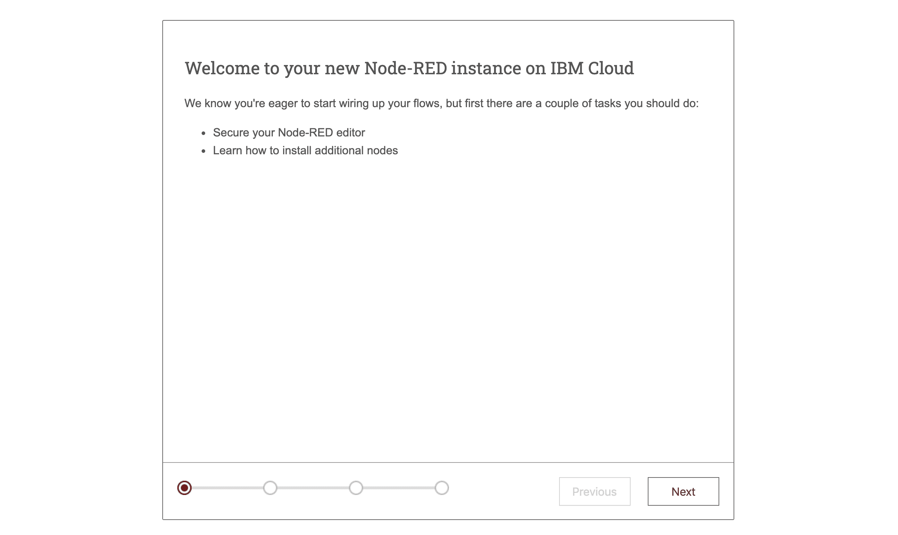
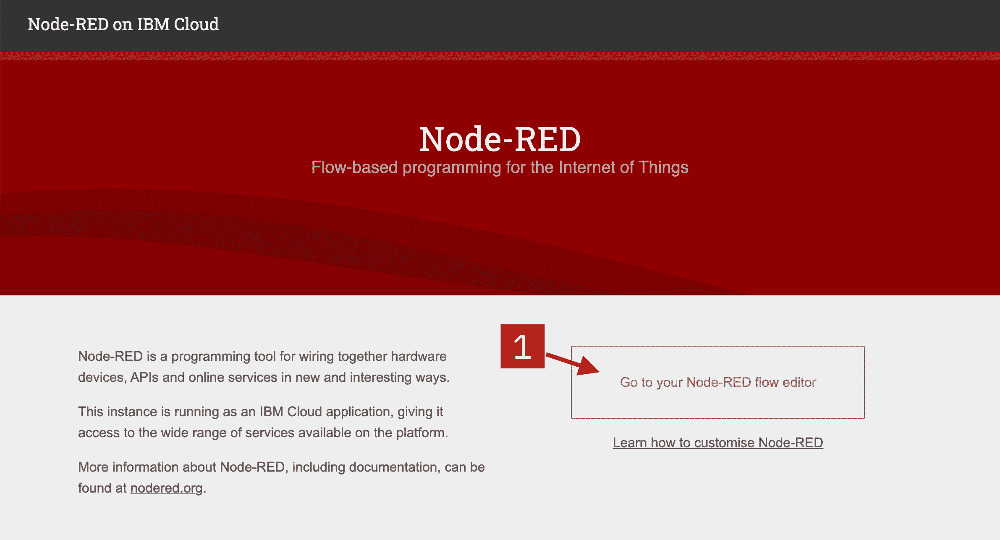
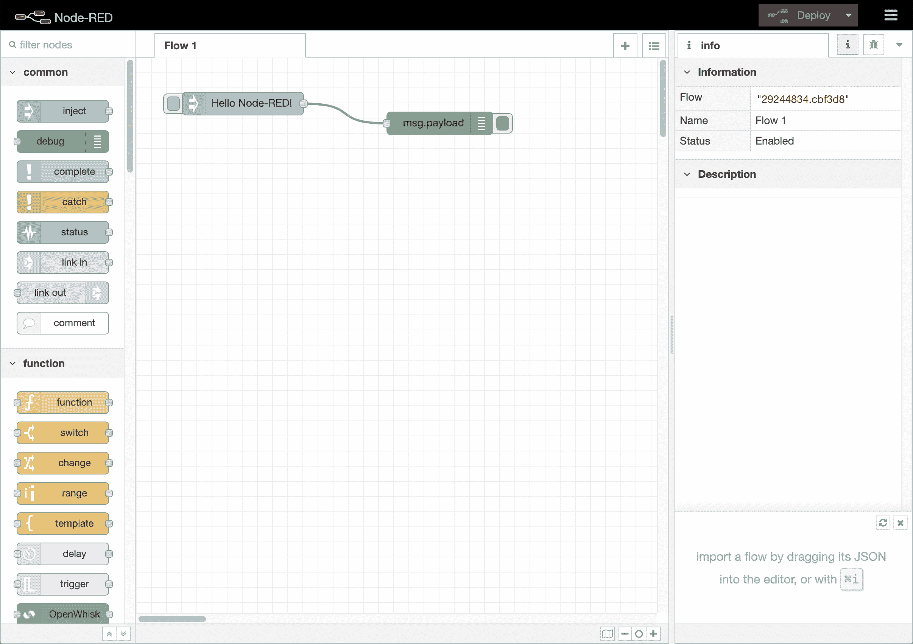
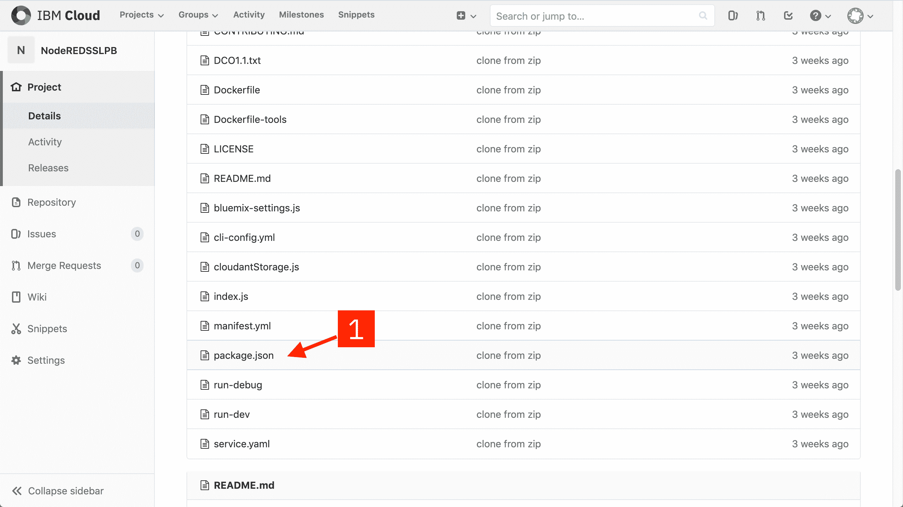
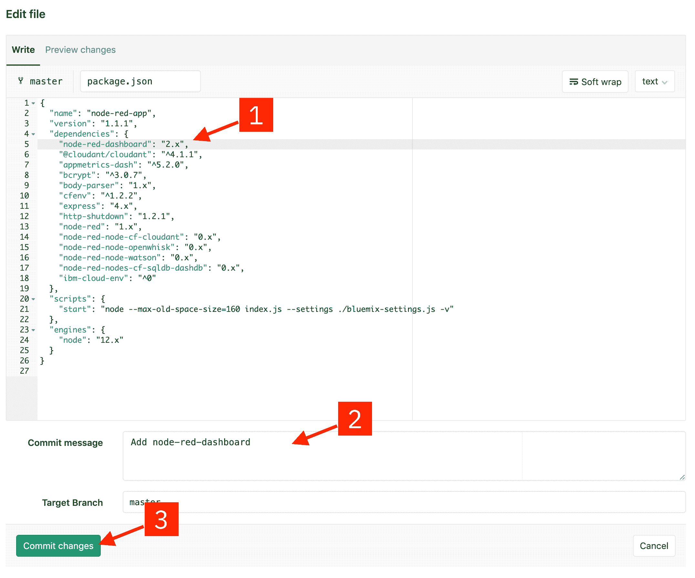
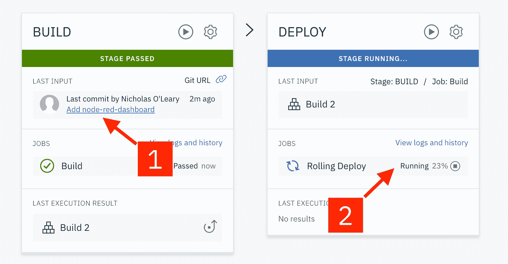

# 创建 Node-RED Starter 应用程序

> 原文：[`developer.ibm.com/zh/tutorials/how-to-create-a-node-red-starter-application/`](https://developer.ibm.com/zh/tutorials/how-to-create-a-node-red-starter-application/)

在本教程中，您将学习如何在 IBM Cloud 中创建 Node-RED Starter 应用程序，以及用于存储应用程序流程配置的 Cloudant 数据库。

## 学习目标

在本教程中，您将学习如何：

*   创建要在 IBM Cloud 中运行的 Node-RED Starter 应用程序
*   保护应用程序
*   通过添加其他节点来自定义 Node-RED Starter Kit

## 前提条件

要完成本教程，您需要一个 [IBM Cloud 帐户](https://cocl.us/IBM_CLOUD_GCG)（IBM Cloud Lite 帐户、试用帐户或付费帐户）。

## 预估时间

您可以在 20 分钟内学完本教程。

## 步骤

1.  在 IBM Cloud 目录中找到 Node-RED Starter
2.  创建应用程序
3.  启用 Continuous Delivery 功能
4.  打开 Node-RED 应用程序
5.  配置 Node-RED 应用程序
6.  将其他节点添加到 Node-RED 选用板

### 第 1 步：在 IBM Cloud 目录中找到 Node-RED Starter

1.  登录到 [IBM Cloud](https://cloud.ibm.com/login?cm_sp=ibmdev-_-developer-tutorials-_-cloudreg)。

2.  打开目录并搜索 **node-red**。

3.  单击 **Node-RED App** 卡片。

    此时会向您展示 Starter Kit 及其所提供内容的概览。

### 第 2 步：创建应用程序

现在，您需要创建 Node-RED Starter 应用程序。

1.  在 *Create* 标签上，会生成一个随机名称。接受默认名称，或者为应用程序提供唯一名称。这将成为应用程序 URL 的一部分。 ***注意：***如果该名称不是唯一的，您会看到一条错误消息，并且必须输入不同的名称才能继续。

2.  Node-RED Starter 应用程序需要一个 **Cloudant 数据库服务**实例来存储应用程序流程配置。选择要创建该服务的区域，以及该服务要使用的定价套餐。 ***注意：***使用 Lite 套餐只能有一个 Cloudant 实例。如果您已经有一个实例，那么可从 **Pricing plan** 选择框中选择该实例。可以有多个 Node-RED Starter 应用程序使用同一个 Cloudant 服务实例。

3.  单击 **Create** 按钮以继续操作。此时会创建您的应用程序，但是尚未将其部署到 IBM Cloud 中。

### 第 3 步：启用 Continuous Delivery 功能

此时，您已创建该应用程序及其所需的资源，但是尚未将其部署到任何环境中。此步骤将展示如何设置 Continuous Delivery 功能，此功能可将应用程序部署到 IBM Cloud 的 **Cloud Foundry** 空间。

1.  单击 **Deploy your app** 按钮以对应用程序启用 *Continuous Delivery* 功能。

2.  您将需要创建一个 **IBM Cloud API** 密钥，以允许部署过程访问您的资源。单击 **New** 按钮以创建该密钥。此时会显示一个消息对话框。阅读所显示的内容，默认接受并关闭该对话框。

3.  将 **Memory allocation per instance** 至少增至 128MB。如果未增大分配的内存，那么可能没有足够的内存来成功运行您的 Node-RED 应用程序。

4.  Node-RED Starter Kit 仅支持部署到 IBM Cloud 的 **Cloud Foundry** 空间。针对 **deploy your application to**，选择 **region**。这应该与用于创建 Cloudant 实例的区域相匹配。Lite 用户可能只能部署到您的默认区域。

    单击 **Next** 继续。

5.  选择应该在其中创建的 **region** 创建 **DevOps 工具链**。

6.  单击 **Create**。此时会转至应用程序详细信息页面。

7.  片刻之后，Deployment Automation 部分将使用新创建的 Delivery Pipeline 的详细信息进行刷新。Delivery Pipeline 的 Status 字段最终将显示 **In progress**。这表明您的应用程序仍在构建和部署中。

    单击 **Status** 字段以查看 Delivery Pipeline 的完整状态。

8.  Deploy 阶段需要几分钟时间才能完成。您可以单击 **View logs and history** 链接以查看其进度。最终，Deploy 阶段将变为绿色，表明已通过此阶段。这表明您的 Node-RED Starter 应用程序现在正在运行中。

### 第 4 步：打开 Node-RED 应用程序

现在，您已部署了 Node-RED 应用程序，我们来将其打开！

1.  返回到应用详情页面，你现在可以看到 **App URL**，**Source** 和 **Deployment target** 字段已经被填充。

2.  单击 **App URL** 以在一个新的浏览器选项卡中打开您的 Node-RED Starter 应用程序。

### 第 5 步：配置 Node-RED 应用程序

首次打开 Node-RED 应用程序时，您需要对其进行配置，并设置安全性。

1.  将打开一个新的浏览器选项卡，其中显示 Node-RED 起始页面。

    

2.  在初始页面上，单击 **Next** 以继续操作。

3.  通过提供 **username** 和 **password** 来保护您的 Node-RED 编辑器。如果您需要随时更改这些值，那么可以在 Cloudant 数据库中编辑这些值，也可以使用*环境变量*来覆盖这些值。[nodered.org](https://nodered.org/docs/getting-started/ibmcloud) 上的文档描述如何执行此操作。单击 **Next** 以继续操作。

4.  最后一个屏幕汇总了您所做的选择，并突出显示了将来可用于更改这些选择的环境变量。单击 **Finish** 以继续操作。

5.  Node-RED 将保存您的更改，然后加载主应用程序。您可以在此处单击 **Go to your Node-RED flow editor** 按钮以打开编辑器。

    

    此时会打开 Node-RED 编辑器，其中显示默认流程。

    

### 第 6 步：将其他节点添加到 Node-RED 选用板

Node-RED 提供了选项板管理器功能，使您可以直接从基于浏览器的编辑器中安装其他节点。这可方便试用节点，但是由于默认 Node-RED Starter 应用程序的内存有限，因此可能会导致问题。

建议编辑应用程序的 `package.json` 文件以包含其他节点模块，然后重新部署该应用程序。

此步骤展示了如何执行此操作以添加 **[node-red-dashboard](https://flows.nodered.org/node/node-red-dashboard)** 模块。

1.  在你应用程序详情页面，单击 **Source** 的 URL。访问该 URL，你可以通过浏览器编辑应用程序源码库。

2.  向下滚动文件列表，并单击 **package.json**。该文件将列出应用程序的模块依赖项。

    

3.  单击 **Edit** 按钮

    

4.  将以下条目添加到 `dependencies` 部分 (1) 的顶部：

    ```
     "node-red-dashboard": "2.x", 
    ```

    ***注意***：请勿忘记行末的逗号（“,”），用于将此条目与下一个条目分隔开。

    添加 **Commit message** (2)，然后单击 **Commit changes** (3)

    

5.  此时，将自动运行 Continuous Delivery 管道，以进行该更改并将其部署到应用程序中。如果查看 Delivery Pipeline，那么可以看到其进度。Build 部分会展示最后一次提交 (1)，Deploy 部分会展示重新部署应用程序的进度 (2)。

    

6.  在 Deploy 阶段完成后，您的应用程序将重新启动，并且现在已预安装了 node-red-dashboard 节点。

***注意:***如果您有 **Lite** 帐户，您的运行应用程序的总内存限制为 256Mb。管道的默认行为是在移动 URL 并删除旧实例之前启动应用程序的第二个实例。这将最小化部署期间的停机时间，但它确实需要两倍的内存。如果最初用 256Mb 内存创建应用程序，那么需要在管道运行之前停止应用程序。为此，请单击应用程序详细信息页面上的 **Deployment Target** 链接。这将打开云计算应用程序详细信息页面。从该页面选择 **Actions** 菜单下的 **Stop** 选项。

## 结束语

恭喜！现在，您已经创建了一个在 IBM Cloud 中托管的 Node-RED 应用程序。您还学习了如何编辑该应用程序的源代码以及如何自动部署更改。

本文翻译自：[Create a Node-RED starter application](https://developer.ibm.com/tutorials/how-to-create-a-node-red-starter-application/)（2020-05-22）