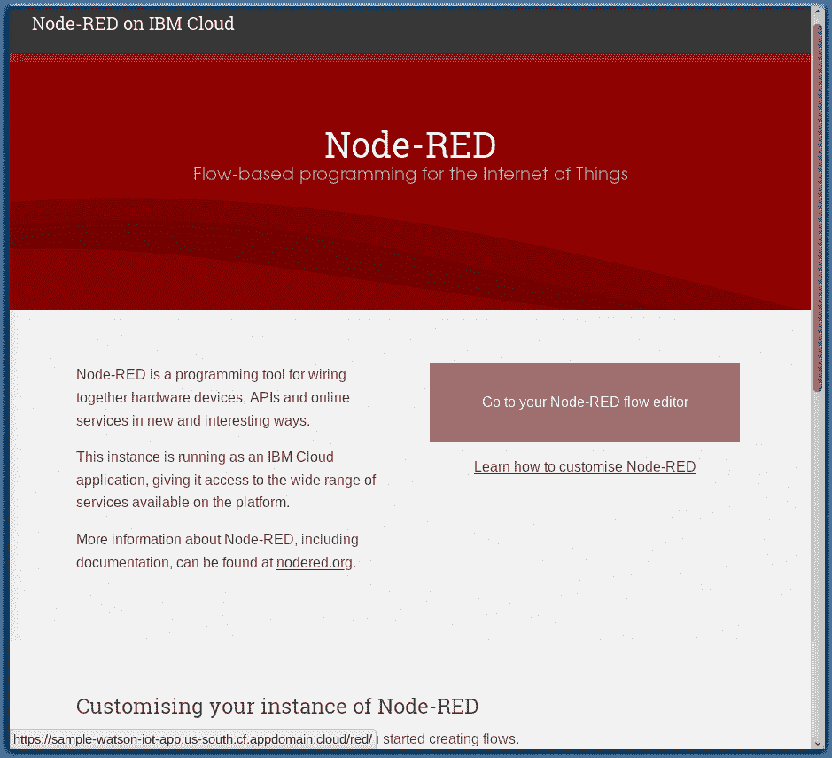
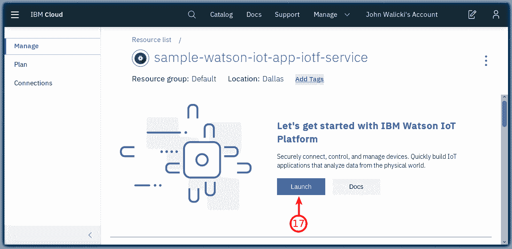

# 创建一个 Internet of Things Platform Starter 应用程序

> 原文：[`developer.ibm.com/zh/tutorials/how-to-create-an-internet-of-things-platform-starter-application/`](https://developer.ibm.com/zh/tutorials/how-to-create-an-internet-of-things-platform-starter-application/)

在本教程中，学习如何创建一个 Node-RED 和 Watson IoT Platform Starter 应用程序，以用于将 IoT 设备和模拟的 IoT 设备连接到 Watson IoT Platform。这些服务将组合在一起以协同运行，包括一个 Node-RED Node.js Web 服务器、一个存储传感器数据的 Cloudant 数据库，以及 IoT Platform 服务，以便您可以轻松连接 IoT 设备。

## 学习目标

在本教程中，您将学习如何：

*   创建一个在 IBM Cloud 中运行的 Node-RED Starter Kit 应用程序
*   创建一个 Internet of Things Platform 服务实例
*   将 Internet of Things Platform 服务实例连接到 Node-RED Cloud Foundry 应用程序
*   重新载入 Node-RED Starter Cloud Foundry 应用程序
*   打开 Watson IoT Platform，以便可以从 IoT 设备和设备模拟器发送数据
*   配置 Node-RED 可视编程编辑器

## 前提条件

要完成本教程，您需要一个 [IBM Cloud 帐户](https://cocl.us/IBM_CLOUD_GCG)（IBM Cloud Lite、试用或付费帐户）。

## 预估时间

您可以在 20 分钟内学完本教程。

## 步骤

1.  创建 Node-RED Starter 应用程序
2.  创建 Internet of Things Platform 服务
3.  将 Internet of Things Platform 服务连接到 Node-RED Starter 应用程序
4.  打开 Node-RED 可视编程编辑器
5.  启动 Watson IoT Platform

### 第 1 步：创建 Node-RED Starter 应用程序

按照以下步骤在 IBM Cloud 中创建一个 Node-RED Starter 应用程序。

1.  登录到 [IBM Cloud](https://cloud.ibm.com/login?cm_sp=ibmdev-_-developer-tutorials-_-cloudreg)。

2.  单击 Catalog (1)，然后搜索 **Node-RED Starter** (2)。

3.  单击 **Software** 面板（3）。

4.  在 **Starter Kits** (3) 下面，单击 [**Node-RED Starter**](https://cloud.ibm.com/catalog?search=Node-RED%20Starter&cm_sp=ibmdev-_-developer-tutorials-_-cloudreg) (4) 卡片。

    

5.  为您的应用程序输入一个*唯一名称*(5)。这个名称将是**应用程序 URL (6)**的一部分。 ***备注：***如果该名称不是唯一的，您会看到一条错误消息，并且必须输入不同的名称才能继续。

6.  **Domain** (7)、**Organization** (8) 和 **Space** (9) 将使用您的 IBM Cloud 帐户的有效选项进行预先填充。如果您有一个 Lite 帐户，那么可以接受默认设置。如果您有一个试用或付费帐户，或者如果您属于其他组织，那么可以选择部署到任何对您可用的地区、组织和空间。

7.  在“精选套餐”中，您可以使用 IBM Cloud Lite 套餐 (10) 来配备 Node-RED Starter 应用程序。

1.单击 **Create** 按钮 (11)。

### 第 2 步：创建 Internet of Things Platform 服务

下一步是创建 Internet of Things Platform 服务实例。

1.  返回到 **IBM Cloud Catalog**
2.  搜索 **Internet of Things**
3.  单击 [**Internet of Things Platform**](https://cloud.ibm.com/catalog?search=label%3Alite%20Internet%20of%20Things&category=iot&cm_sp=ibmdev-_-developer-tutorials-_-cloudreg) 卡片 (12)。

    

4.  指定唯一的服务名称，例如：**discover-iot-try-service**。

    

5.  单击**Create**按钮。

### 第 3 步：将 Internet of Things Platform 服务连接到 Node-RED Starter 应用程序

到目前为止，您已经按照指定的步骤在 IBM Cloud 区域配置了 IoT Platform 服务和 Node-RED Starter 应用程序。在下一步骤中，您需要将两者绑定在一起。

1.  一旦创建了 Internet of Things Platform 服务实例，**Manage** 页面就会描述这些套餐。 Lite 层是免费的，但在 30 天不活动之后将被删除。
2.  单击左侧导航菜单中的 **Connections** (13)。
3.  单击 **Create connection** (14) 按钮。

    

4.  单击 **Connect** 按钮以连接到在第 1 步中创建的 Node-RED Cloud Foundry 应用程序。

    

5.  单击 **Connect & restage app** 按钮来重新载入 Node-RED Cloud Foundry 应用程序，以将其绑定到 Internet of Things 服务。

    

6.  单击 **Restage** 按钮以确认 Node-RED Starter 已重新载入。

    

7.  单击应用程序名称以打开 Node-RED Starter 应用程序的 **Overview** 页面。

    

    

8.  等待 Cloud Foundry 应用程序重新启动，状态显示“此应用程序已唤醒”。然后单击 **Visit App URL** 链接。

    

### 第 4 步：打开 Node-RED 可视编程编辑器

一个新的浏览器选项卡将会在 Node-RED 首页中打开。 [Node-RED](https://nodered.org/) 是一个开源 Node.js 应用程序，它提供了一个可视编程编辑器，可以轻松地将流连接在一起。

一些面板对在 Watson IoT Platform 应用程序中设置 Node-RED 很有帮助。

1.  在看到欢迎面板时，请单击 **Next** 按钮继续后面的操作。（第 1 步，共 4 步）

    

2.  设置一个用户名和密码来保护您的 Node-RED 编辑器。 请记住您的用户名和密码。单击 **Next** 按钮继续后面的操作。（第 2 步，共 4 步）

    

3.  如果忘记了用户名和密码，可以在 Cloudant DB 中或通过设置 IBM Cloud 环境变量来重置它们。 单击 **Finish** 按钮继续后面的操作。（第 3 步，共 4 步）

    

4.  单击 **Go to your Node-RED flow editor** 按钮启动 Node-RED 流编辑器。（第 4 步，共 4 步）

    

5.  使用您的新用户名和密码进行**登录**。

    

**Node-RED Visual Programming Editor** 打开一个默认流。左侧是一个**节点面板**，您可以将其拖动到流上。可以**将节点连在一起**来创建程序。

### 第 5 步：启动 Watson IoT Platform

由于您已经将这两个应用程序绑定在一起，并配置了 Node-Red 可视编程编辑器，所以您可以启动 Watson IoT Platform 了。

1.  返回到 [IBM Cloud Application Details](https://cloud.ibm.com/resources?groups=cf-application?cm_sp=ibmdev-_-developer-tutorials-_-cloudreg) 页面。

2.  单击左侧导航菜单中的 **Overview** 项 (15)。

3.  在 **Connections** 卡片中，单击您的 *iotf-service* (16)。

    

4.  单击 **Alias of …** 链接。

    

5.  **Internet of Things** 服务登录页面将会打开。从 **Manage** 页面中，单击 **Launch** (17) 按钮。

    

**Watson IoT Platform** 服务将在浏览器的新标签页中打开。您现在可以创建 IoT 设备了。

## 结束语

恭喜您。您现在已在 IBM Cloud 中创建了一个 Node-RED 和 Watson Internet of Things Platform Starter 应用程序。

本文翻译自: [Create an Internet of Things Platform Starter application](https://developer.ibm.com/tutorials/how-to-create-an-internet-of-things-platform-starter-application/)（2019-11-01）