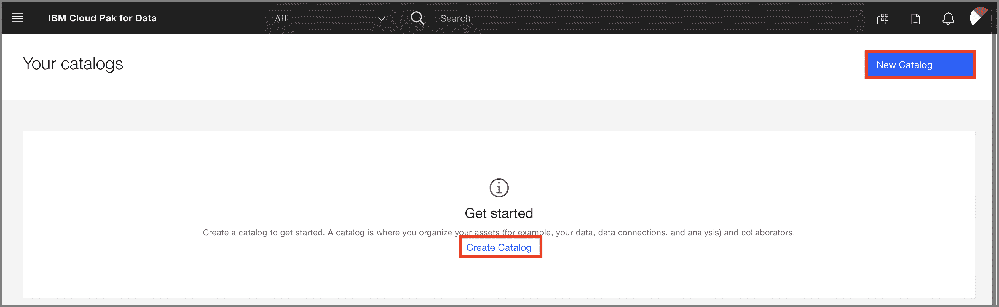
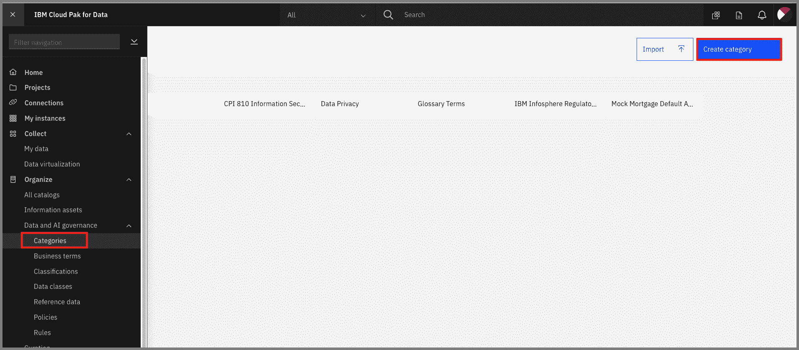
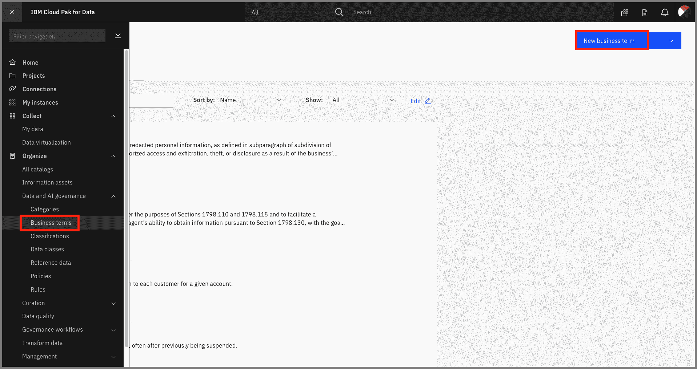
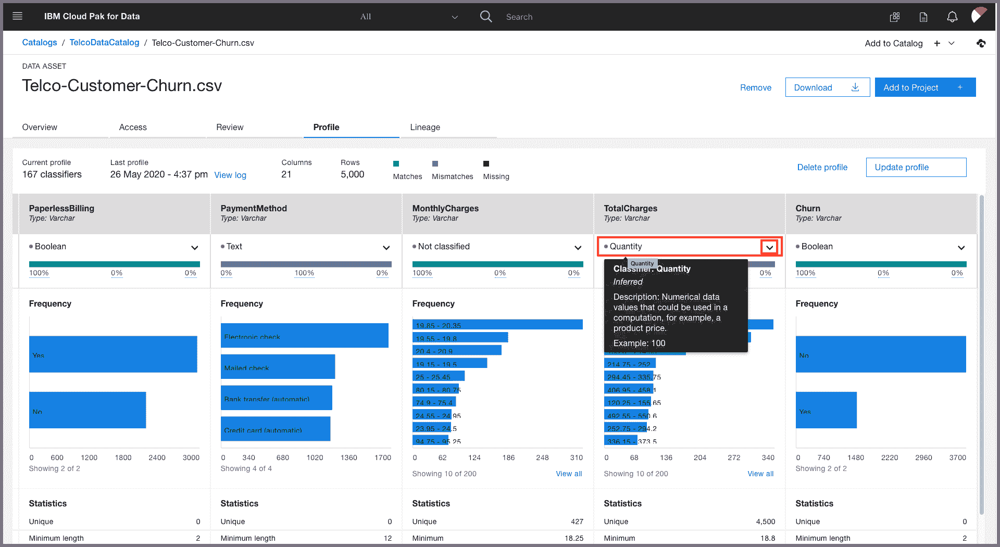

# 使用 Watson Knowledge Catalog 查找、准备和理解数据

> 原文：[`developer.ibm.com/zh/tutorials/find-prepare-and-understand-data-with-watson-knowledge-catalog/`](https://developer.ibm.com/zh/tutorials/find-prepare-and-understand-data-with-watson-knowledge-catalog/)

本教程纳入 [IBM Cloud Pak for Data 快速入门学习路径](https://developer.ibm.com/zh/series/cloud-pak-for-data-learning-path/)。

| 级别 | 主题 | 类型 |
| --- | --- | --- |
| 100 | [IBM Cloud Pak for Data 简介](https://developer.ibm.com/zh/articles/intro-to-cloud-pak-for-data) | 文章 |
| 101 | [利用 Data Virtualization 实现 Db2 Warehouse 数据虚拟化](https://developer.ibm.com/zh/tutorials/virtualizing-db2-warehouse-data-with-data-virtualization) | 教程 |
| 201 | [利用 Data Refinery 实现数据可视化](https://developer.ibm.com/zh/tutorials/data-visualization-with-data-refinery) | 教程 |
| **202** | **[使用 Watson Knowledge Catalog 查找、准备和理解数据](https://developer.ibm.com/zh/tutorials/find-prepare-and-understand-data-with-watson-knowledge-catalog)** | **教程** |
| 301A | [借助内置 Notebook 的 Watson Machine Learning 进行数据分析、建模以及部署](https://developer.ibm.com/zh/patterns/data-analysis-model-building-and-deploying-with-wml) | Pattern |
| 301B | [使用 AutoAI 自动构建模型](https://developer.ibm.com/zh/tutorials/automate-model-building-with-autoai) | 教程 |
| 301C | [使用 IBM SPSS Modeler 快捷构建预测机器学习模型](https://developer.ibm.com/zh/tutorials/build-an-ai-model-visually-with-spss-modeler-flow) | 教程 |
| 401 | [利用 Watson OpenScale 监视模型](https://developer.ibm.com/zh/patterns/watson-openscale-with-watson-machine-learning-engine-on-icp4d) | Pattern |

本教程演示如何在 IBM Cloud Pak for Data 平台上使用 Watson Knowledge Catalog 解决企业数据治理问题。我们将展示如何使用治理、数据质量和主动策略管理来帮助您保护和管理敏感数据、跟踪数据沿袭和管理数据湖。这些知识可以帮助您快速发现和监管数据资产、数据集、分析模型及其与组织中其他人员的关系，并进行分类和共享。

## 学习目标

在本教程中，您将学习如何：

1.  设置目录和数据
2.  添加协作者并控制访问
3.  添加类别
4.  添加数据类
5.  添加业务术语
6.  为策略添加规则

## 前提条件

*   [IBM Cloud Pak for Data](https://www.ibm.com/cn-zh/products/cloud-pak-for-data)
*   [Watson Knowledge Catalog](https://www.ibm.com/support/producthub/icpdata/docs/content/SSQNUZ_current/wsj/catalog/overview-wkc.html)
*   管理用于创建和管理目录的访问权限

## 预估时间

完成本教程大约需要 30 到 45 分钟。

## 步骤

**注意：** 默认目录是您的企业目录。该目录是在安装 Watson Knowledge Catalog 服务后自动创建的，是高级数据监管工具适用的唯一目录。默认目录接受治理，因此会强制实行数据保护规则。信息资产视图显示默认目录中资产的其他属性，帮助进行监管。您随后创建的任何目录都可以接受治理或不接受治理，没有信息资产视图，只提供基本的数据监管工具。

## 1\. 设置目录和数据

首先，我们将创建一个目录并加载一些数据。

### 创建目录

单击主页右上角的*服务*图标以打开 Watson Knowledge Catalog：

在 *Data Governance* 部分下，单击 *Watson Knowledge Catalog* 卡片上的 3 个垂直的点，然后单击 `Open`：

在 *Your catalogs* 页面中，单击 `Create catalog` 或 `New Catalog`：

为您的目录提供一个名称和描述（可选），然后单击 `create`：

### 添加数据资产

在 *Browse Assets* 选项卡下的“Now you can add assets!”下面，单击 `here` 添加数据：

*或者*也可以单击右上角的 `+ Add to catalog`，然后选择 `Local files`：

浏览到 `data/Telco-Customer-Churn.csv` 文件，然后双击或单击 `Open`。添加一个描述（可选），然后单击 `Add`：

**注意：** 在加载完成之前不要退出目录！如果您退出目录，将会删除不完整的资产。

新添加的 *Telco-Customer-Churn.csv* 文件将显示在目录的 *Browse Assets* 选项卡下：

### 添加连接

您可以通过选择 `+ Add to catalog` -> `Connection`，添加与远程数据库（如 *IBM Cloud 中的 Db2 Warehouse*）的连接：

选择远程数据库并单击：

输入连接详细信息，然后单击 `Create`：

连接现在显示在目录中：

### 添加虚拟化数据

对 *Default* 目录具有“管理员”或“编辑者”访问权限的用户可以将虚拟化数据添加到该目录中。

转到左上角的汉堡菜单 (☰)，然后选择 `Organize` -> `All catalogs`。单击 `+Add to Catalog` -> `Connected asset`：

单击 *Source* -> `Select source`。在 `DV` 下浏览到您的模式（即 UserXYZW）并选择连接表。单击 `Select`。

用户现在可以将此项添加到项目中，就像目录中的其他任何资产一样。

## 2\. 添加协作者并控制访问

在 *Access Control* 选项卡下，您可以单击 `Add Collaborator`，让其他用户能够访问您的目录：

您可以搜索用户，单击名称进行选择，然后单击 `Add`：

[搜索用户并添加为协作者](https://developer.ibm.com/developer/default/tutorials/find-prepare-and-understand-data-with-watson-knowledge-catalog/images/wkc-choose-user-and-add.png)

您可以选择用户的角色：Admin、Editor 或 Viewer：

要访问目录中的数据，可单击数据的名称：

将打开数据预览视图，其中包含元数据和前几行内容：

您可以单击 `Review` 选项卡并对数据进行评分，也可以对其进行评论，以便为您的队友提供反馈：

## 3\. 添加类别

可以采用多种方法来标记数据的特征和列。其中之一便是分类。

要为您的资产添加类别，可转到左上角的汉堡菜单 (☰)，选择 `Organize` -> `Data and AI Governance` -> `Categories`，然后单击 `Create category`：

为您的类别指定一个名称，例如 *Billing*，并提供描述（可选），然后单击 `Save`：

现在，如果在 *Billing* 类别屏幕上再次单击 `Create category`，就会创建一个子类别，例如 *Total Charges*：

对于 *Billing* 类别，可以选择 *Type*，例如 `Business term`：

我们还可以通过转到左上角的汉堡菜单 (☰)，选择 `Organize` -> `Data and AI Governance` -> `Classifications`，然后单击 `+Create classification`，以相似的方式为资产创建分类，类似于 *Confidential*、*Personally Identifiable Information* 或 *Sensitive Personal Information*。然后，可以将这些分类作为 *Type* 添加到类别中：

## 4\. 添加数据类

剖析资产时，可能的情况下会从内容中推断出数据类。我们稍后再详细介绍这个方面。您还可以添加自己的数据类。

要为您的资产添加数据类，可转到左上角的汉堡菜单 (☰)，选择 `Organize` -> `Data and AI Governance` -> `Categories`，然后单击 `Create data class`：

为新数据类指定一个名称（如 *numerical*）以及可选的主类别和/或描述，然后单击 `Save as draft`：

一旦创建了数据类，我们就可以为该类添加*专员*，还可以关联*分类*和*业务术语*。就绪后，单击 `Publish`：

## 5\. 添加业务术语

您可以使用[业务术语](https://dataplatform.cloud.ibm.com/docs/content/wsj/governance/dmg16.html)来标准化业务概念的定义，以便在整个企业中以一致且易于理解的方式来描述您的数据。

您已经了解了如何创建类别，并将其定义为一个*业务术语*。您还可以创建业务术语作为其自身的实体。

从左上角的汉堡菜单 (☰) 中选择 `Organize` -> `Data and AI Governance` -> `Business terms`：

单击右上角的 `+ Create Business term` 按钮：

为新的业务术语提供名称（如 *Billing*）和描述（可选），然后单击 `Save as draft`。注意：平台上的其他人也会为这个工作空间创建业务术语，因此，或许您可以在自己的术语前附加一些特有的内容，例如，*scottda-Billing*：

创建术语后，将会出现一个窗口。您会看到一组丰富的选项，用于创建相关术语和添加其他元数据。此时，单击 `Publish` 以将此术语提供给平台用户：

添加注释（可选），然后在新窗口中单击 `Publish`：

现在返回到您的 Telco 目录并将其打开，直至显示列视图（汉堡菜单 (☰) `Organize` -> `All catalogs`，然后选择 `Telco catalog`）。在 *Browse assets* 选项卡下，单击数据集 *Telco-Customer-Churn.csv* 以获得列/行预览。向右滚动，直至显示 *TotalCharges* 列，然后单击*列信息*图标（像一只眼睛）：

在打开的窗口中，单击 *Business terms* 旁边的*编辑*图标（像一支铅笔）：

在 *Business terms* 下面输入 *Billing*（或者您指定的唯一术语，如 *scottda-Billing*），然后系统将搜索该术语。单击找到的 `Billing` 术语，然后单击 `Apply`：

在应用了术语之后关闭此窗口。 现在，执行同样的操作，将 *Billing* 业务术语添加到 *MonthlyCharges* 列中。

您现在就能够在这个平台中搜索这些术语。例如，返回到您的顶级 *Telco Catalog*，在包含注释“What assets are you searching for?”的搜索栏中输入您的唯一术语 *<unique_string>Billing</unique_string>*：

这样将会显示 *Telco-Customer-Churn.csv* 数据集，因为它包含了带有 *Billing* 业务术语标记的列。

## 6\. 为策略添加规则

我们现在可以创建规则来控制用户访问数据的方式。

创建一个名为 *CustomerID* 的业务规则，然后按照以上说明将其分配给数据集中的 *CustomerID* 列。

从左上角的汉堡菜单 (☰) 中选择 `Organize` -> `Data and AI Governance` -> `Rules`，然后单击 `Create rule`。

对于 *New rule* -> *Select the type of rule to create*，选择 `Data protection rule`。

在 *Details* 下面，为您的规则提供 *Name*、*Type*（为 *Access*）和 *Business definition*。

现在，在 *Rule builder* *Condition1* 下面，填写 If *Business term* *Contains any* *CustomerID*，然后在 Action 下面填写 then *mask data* *in columns containing* *Customer number*。选择 `Substitute` 卡片，这将生成一个不可识别的散列。这会掩盖实际的 CustomerID，但像数据库连接这样的操作仍然有效。

现在，如果我们回到目录中 *Telco-Customer-Churn.csv* 资产的 *CustomerID* 列，就会看到“锁”图标，还会看到 customerID 现已被替换为散列值：

现在回到 `Profile` 选项卡，然后滚动到 *TotalCharges* 列。您可以看到数据经过推断被分类为 *Quantity*：

如果推断出的分类不是您想要的分类，可以在这里更改分类。

您可以构建一条规则来*模糊处理* *TotalCharges* 列：

现在，该列中的数据将被替换为格式相似的数据：

## 结束语

在本教程中，您了解了 IBM Cloud Pak for Data 平台上一些强大的数据处理工具。借助 Watson Knowledge Catalog，团队成员可以各司其职、协同工作，为企业带来数据和 AI 技术。

本教程纳入 [IBM Cloud Pak for Data 快速入门学习路径](https://developer.ibm.com/zh/series/cloud-pak-for-data-learning-path)。要继续学习本系列课程并了解有关 IBM Cloud Pak for Data 的更多信息，可查看下一个 Code Pattern [借助含 Notebook 的 Watson Machine Learning 进行数据分析、建模以及部署](https://developer.ibm.com/zh/patterns/data-analysis-model-building-and-deploying-with-wml)、下一个教程[使用 AutoAI 自动构建模型](https://developer.ibm.com/zh/tutorials/automate-model-building-with-autoai)，或者查看下一个教程[使用 IBM SPSS Modeler 快捷构建预测机器学习模型](https://developer.ibm.com/zh/tutorials/build-an-ai-model-visually-with-spss-modeler-flow)。

本文翻译自：[Find, prepare, and understand data with Watson Knowledge Catalog](https://developer.ibm.com/tutorials/find-prepare-and-understand-data-with-watson-knowledge-catalog/)（2020-02-25）