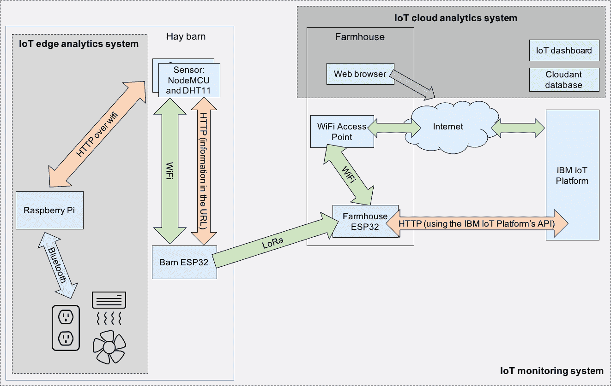
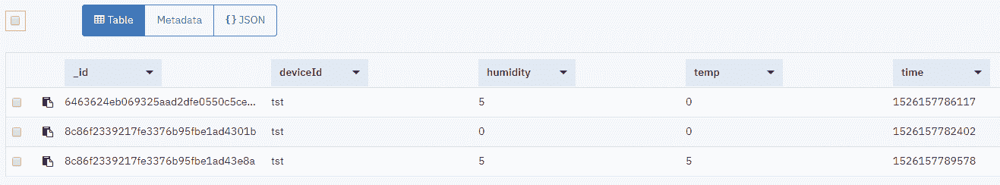

# 将云分析和仪表板应用程序集成到 IoT 解决方案中

> 原文：[`developer.ibm.com/zh/tutorials/iot-edge3/`](https://developer.ibm.com/zh/tutorials/iot-edge3/)

在本系列的第一篇文章“将 LPWAN 网络集成到 IoT 解决方案中”中，您了解了如何监视干草仓的湿度和温度来识别危险情况。您了解了如何将从 NodeMCU 设备获取的关于温度和湿度的传感器读数发送到 IBM Watson IoT Platform。在本文中，您将了解如何将这些读数保存在数据库中，如何在 IoT 仪表板中显示这些读数，以及如何生成警报。

要了解关于预防干草堆火灾问题的更多信息，请查阅文章“[预防干草和稻草堆火灾](https://ag-safety.extension.org/preventing-fires-in-baled-hay-and-straw/)”。

## 构建应用程序所需的物品

因为您是以本系列第一篇教程中构建的 IoT 系统为基础，所以您需要完成第一篇教程，才能构建这个系统。为此，您需要：

*   一个*免费* [IBM Cloud 帐户](https://console.bluemix.net/)（如果没有，[点击此处](https://cocl.us/IBM_CLOUD_GCG)）。
*   一个 [NodeMCU 开发板](http://amzn.to/2DGwfg1)。
*   一个 [DHT11 传感器](https://amzn.to/2WkkUhY)（DHT 代表数字湿度和温度）。此传感器不适合用作安全设备；这里仅将它用作示例，如果您真的有满满一谷仓的易燃干草，应该考虑采用其他传感器类型。
*   2 个 [MakerFocus ESP32 开发板](http://amzn.to/2CMfCn0)，用于 LPWAN 网络（仅在本文中不需要）。
*   [如果没有电路试验板，还需要提供一个电路试验板来创建电路](http://amzn.to/2EqbaaT)
*   [若干电线](http://amzn.to/2q4tenA)。
*   3 条 Micro-USB 电缆。

## 架构

该图展示了如何将 IoT 云分析系统（包括 IoT 仪表板）添加到整个 IoT 监控系统（还包括 IoT 边缘分析系统）中。

##### 架构图



## 创建 IoT 仪表板应用程序

我们将使用 Node-RED 构建 IoT 仪表板应用程序，它将显示已发送到 Watson IoT Platform 且存储在 Cloudant 数据库中的数据。我们已具有 [Watson IoT Platform](https://internetofthings.ibmcloud.com/)，因此只需创建 Node-RED 应用程序和 Cloudant 数据库。

### 创建 IBM Cloud 应用程序

1.  登录到您的 [IBM Cloud 帐户](https://console.bluemix.net/)。
2.  在仪表板中，单击 **Create resource**。
3.  单击 **Starter Kits > Node-RED Starter**。
4.  为应用程序命名（名称应该是唯一的，例如：haybale-< *your name* >），然后单击 **Create**。
5.  等到该应用程序启动，然后单击 **Visit App URL**。
6.  单击 **Next**。
7.  为 Node-RED 仪表板配置用户名和密码。我选择了让所有人都能查看编辑器，因为这是一个演示；您不必这样做。
8.  单击两次 **Next**，然后单击 **Finish**。
9.  请*勿*关闭浏览器窗口（很快就需要使用此窗口）。

## 将传感器数据存储在数据库中

下一步是在 Node-RED 流程中接收事件。然后，此流程将格式化事件消息并将信息存储在 Cloudant 数据库中。

请遵循以下说明来自行创建流程。如果要复制流程并自定义流程，请[从此处复制 JSON 文件](https://github.com/qbzzt/IoT/blob/master/201801/Hay_Bale_Fire/21_IoT_to_debug.json)到剪贴板，然后在 Node-RED 编辑器中，单击汉堡菜单中的 **Import > Clipboard**，然后粘贴流程。要查看[已创建的流程，单击此处](https://haybale-ori-201910.us-south.cf.appdomain.cloud/red/#flow/4b55c450.04f00c)。

### 创建用于访问 IBM Watson IoT Platform 的 API 密钥

1.  打开您在第一篇文章中创建的 IBM Watson IoT Platform。
2.  单击 **Apps > Browse**。
3.  单击 **Generate API Key**。
4.  描述密钥（例如，`Key for Node-RED dashboard`），然后单击 **Next**。
5.  选择角色 **Backend Trusted Applications**，然后单击 **Generate Key**。
6.  将 API 密钥和身份验证令牌复制到安全的位置。
7.  单击 **Close**。

### 将传感器信息读取到 Node-RED

1.  打开您的应用程序的 Node-RED 编辑器（您可以转至[云资源](https://cloud.ibm.com/resources?cm_sp=ibmdev-_-developer-tutorials-_-cloudreg)，在 Cloud Foundry Apps 下找到它，单击它，然后单击 **Visit App URL**）。
2.  单击汉堡菜单，然后单击 **Manage palette**（您可能需要先登录）。
3.  单击 **Palette**，然后单击 **Install**。
4.  搜索软件包 `node-red-contrib-scx-ibmiotapp` 并选中该软件包。
5.  单击 **Install**，然后确认，再次单击 **Install**。
6.  在安装结束后，单击 **Close**。
7.  将 **input > ibmiot in** 节点从左侧的选用板拖到流程（大空白区域）中。
8.  双击新项。
9.  指定以下属性：

    *   Authentication：API Key
    *   API Key：Add new ibmiot
    *   Input Type：Device Event
    *   Device Type：All
    *   Device Id：All
    *   Event：All
    *   Format：All
10.  单击画笔图标。

11.  使用以下参数创建一个 IoT：

    *   Name：Hay Bale IoT Platform
    *   API Key and API Token：您先前为 API 密钥创建的值
    *   Server-Name：您在前一篇文章中使用的主机名（特定 ID 的六个字符后跟 `.messaging.internetofthings.ibmcloud.com`）
12.  单击 **Add**，然后单击 **Done**。

13.  将 **common > debug** 拖到流程中，并在 IoT Platform 的输出与 Debug 的输入之间画一条线。
14.  双击新节点并将输出设置为 **complete msg object**。
15.  单击 **Deploy**。
16.  将几个传感器读数发送到 Watson IoT Platform。
17.  返回到编辑器并查看右侧边栏中的调试选项卡。展开其中一条消息；它应该包含温度和湿度。

注意：如果您当前没有运行传感器，那么可以[转至此处](https://reqbin.com/)来提交 HTTP 请求。如果要这样做，请使用以下参数：

*   Method：POST
*   URL：https://<six character="character" platformid="platformid">.messaging.internetofthings.ibmcloud.com:8883/api/v0002/device/types/Hay-Sensor/devices/<device id="id">/events/sensorReading</device></six>
*   Authorization：Basic Auth
*   Username：use-token-auth
*   Password：该特定设备的身份验证令牌
*   Content：{ “temp”: 0, “humidity” : 0}

### 修改消息

在数据库中，我们需要时间戳和设备标识符。因此，我们需要向所收到的消息添加两个参数。

1.  拖动 **function > function**，在 IoT 节点与 debug 节点之间进行连接。选中并删除现有连接。
2.  将 function 节点命名为 `add params`。
3.  编写此函数以将设备 ID 和时间添加到有效负载中：

    ```
     msg.payload.time = new Date().getTime();
     msg.payload.deviceId = msg.deviceId;
     return msg; 
    ```

4.  完成部署和测试，然后您会看到 msg.payload 现在包含时间和设备 ID。

### 将消息写入 Cloudant 数据库

现在我们具有消息有效负载了，可以将其写入数据库中。 您可以[从此处](https://github.com/qbzzt/IoT/blob/master/201801/Hay_Bale_Fire/22_IoT_to_database.json)下载本节末尾的流程。您可以[在此处](https://haybale-ori-201910.us-south.cf.appdomain.cloud/red/#flow/9838894b.04d428)查看该流程。

1.  添加 **storage > cloudant out** 节点。将其连接到 add params 节点的后面，使其与 debug 节点并列。
2.  在新节点中，将数据库命名为 `events`，然后选择 **Only store msg.payload object**。
3.  部署并发送更多事件。
4.  返回到 [IBM Cloud Console](https://cloud.ibm.com/resources?cm_sp=ibmdev-_-developer-tutorials-_-cloudreg)。
5.  打开 Cloud Foundry Services 下的 **<application name="name">-cloudantNoSQLDB</application>** 数据库服务。
6.  这是 **Cloudant-** 的别名。单击此别名。
7.  单击 **Manage**，然后单击 **Launch Cloudant Dashboard**。
8.  单击左侧边栏上的数据库图标，然后单击 **events** 数据库。
9.  单击 **Table** 以查看事件信息以及您输入的所有参数，如下所示：

##### 查看事件信息



## 生成警报

您希望在温度或湿度超出阈值时发出警报。 您可以[从此处](https://github.com/qbzzt/IoT/blob/master/201801/Hay_Bale_Fire/23_alerts.json)下载流程。 您可以[在此处](https://haybale-ori-201910.us-south.cf.appdomain.cloud/red/#flow/f6d720d9.aaf2e)查看流程。

查看[有关干草堆火灾的文章](https://ag-safety.extension.org/preventing-fires-in-baled-hay-and-straw/)，以下是警报条件（假定您的系统*未*使用本系列第二篇文章中的边缘分析来自动处理问题）。本文将使用华氏度，因此该表既包含华氏度 (⁰F) 也包含摄氏度 (⁰C)。

| **条件** | **警报** |
| --- | --- |
| 湿度 > 20% | 干草太湿，需要干燥（低优先级）。 |
| 温度 > 150 ⁰F (~65 ⁰C) | 进入危险区域，翻开干草堆以促进空气流通（中等优先级）。 |
| 温度 > 175 ⁰F (~79 ⁰C) | 就可能发生的危险致电消防部门，停止所有空气流通，以免扇动火焰（高优先级）。 |
| 温度 > 190 ⁰F (~88 ⁰C) | 在消防部门的帮助下清除发热的干草。预期会发生火灾（紧急优先级）。 |

如果您的系统*使用*边缘分析（[如此处所示](https://developer.ibm.com/zh/tutorials/iot-edge2/)），那么前两个警报条件不需要发出警报。边缘分析通过控制加热器和风扇来自动解决这些警报。仅当温度高于 175 ⁰F 时才需要发出警报，因为您需要致电消防部门。

### 将温度传感器数据从摄氏度转换为华氏度

用于生成温度读数的 DHT11 采用中文显示内容。它使用摄氏度。但是，有关干草堆火灾的文章使用华氏度来表示数据。因此，第一步是添加用于计算华氏度温度的节点。

1.  返回到 Node-RED 编辑器。
2.  将 function 节点拖至流程。
3.  双击 function 节点，将其命名为 CtoF，然后使用此函数：

    ```
     msg.payload.tempF = msg.payload.temp*9/5+32;
     return msg; 
    ```

4.  将 add params 节点的左侧连接到 CtoF 节点的右侧。

### 计算状态

接下来，我们将计算状态字符串。这一点很重要，因为我们只想在状态发生更改时才生成警报。

1.  拖动 **function > switch**。
2.  将 CtoF 节点的右侧连接到 switch 节点。
3.  双击 switch 节点以对其进行配置。

    1.  将 switch 节点命名为 `tempAlerts`。
    2.  将属性设置为 msg.payload.tempF。
    3.  将顶部规则的运算符设置为 >=，将数据类型设置为 number，并将值设置为 190。
    4.  单击 **Add** 以再创建两个规则，这两个规则都使用运算符 >= 和数据类型 number。第一个规则的值为 175，第二个规则的值为 150。
    5.  单击 **Add** 以创建运算符为 **otherwise** 的第四个规则。
    6.  将底部值更改为 **stopping after first match**。
    7.  单击 **Done**。
4.  拖动 **function > template** 节点以使用以下参数创建节点：

    *   Name：On fire
    *   Set property：**msg.**`payload.status`
    *   Format：Plain text
    *   Template：Call fire services now! Fire expected!
5.  复制并粘贴刚创建的 template 节点，以再创建两个节点并更改一些参数：

    *   Name：
        *   For Template Node #2：Stop air movement
        *   For Template Node #3：Start air movement
    *   Template：
        *   For Template Node #2：Fire likely, stop air movement to avoid fanning flames.
        *   For Template Node #3：Dangerously hot, promote air circulation.
6.  将新节点连接到 tempAlerts switch 节点的右侧（输出）。顺序很重要：顶部是 On fire，接着是 Stop air movement，然后是 Start air movement。

7.  使用以下参数创建另一个 **switch** 节点：

    *   Name：humidityAlert
    *   Property：**msg.**`payload.humidity`
    *   Rule #1：>= 20
    *   Rule #2：Otherwise
    *   Type：stopping after first match
8.  将 humidityAlert switch 节点的左侧（输入）连接到 tempAlerts 节点的右侧，再连接到底部连接器（针对“otherwise”情况）。

9.  再复制并粘贴 On fire 节点两次以创建以下节点：

    *   Name：
        *   Template Node #4：Too humid
        *   Template Node #5：Reduce humidity
    *   Template
        *   Template Node #4：Fine
        *   Template Node #5：Everytime’s fine, no alert
10.  将 Too humid 节点连接到 humidityAlert 节点的顶部输出，然后将 Fine 节点连接到底部的节点。

### 创建警报

最后，我们可以创建警报。

1.  创建 **function > rbe** 节点。设置以下参数：

    *   Mode：Block unless value changes
    *   Property：**msg.**`payload.status`
    *   Name：Report by Exception
2.  将所有五个 template 节点的输出连接到 Report by Exception 的输入。除非该节点监视的属性发生更改，否则它将停止流程。这可防止温度或湿度发生微小变化而触发警报。

3.  现在，在 Report by Exception 之后放置 debug 节点（使用默认参数）。通过单击上述 msg debug 节点右侧的复选框来禁用该节点。
4.  输出 **msg**。`payload.status`
5.  您的流程现已完成，可以发送警报。部署 Node-RED 应用程序。

发送这些消息以验证您在调试窗格中是否收到正确的警报：

| **消息** | **期望的结果（在右侧边栏的调试选项卡中）** |
| --- | --- |
| {“temp”:0, “humidity”:5} | 状态显示一切正常 |
| {“temp”:0, “humidity”:15} | 无，状态无变化 |
| {“temp”:0, “humidity”:25} | 新警报告知您需要降低湿度 |
| {“temp”:50, “humidity”:25} | 无，状态无变化 |
| {“temp”:70, “humidity”:25} | 新警报告知您需要加强空气流通（请记住，70 摄氏度等于 158 华氏度） |
| {“temp”:80, “humidity”:25} | 新警报告知您需要停止空气流通 |
| {“temp”:90, “humidity”:25} | 新警报告知您需要致电消防部门 |
| {“temp”:10, “humidity”:15} | 新警报告知您一切正常 |

如果使用边缘分析，那么可以使用相同的消息。但是，您不会收到告知需要降低湿度或加强空气流通的警报。您可以跳过消息 2 到消息 5，因为它们不会更改状态。

## 创建仪表板

Hay Barn Monitoring 应用程序的用户希望有一个仪表板，以用于显示和分析该应用程序收集和存储的传感器数据。在此步骤中，我们将创建该仪表板。 您可以[从此处下载整个流程](https://github.com/qbzzt/IoT/blob/master/201801/Hay_Bale_Fire/24_with_ui.json)。 您可以在此处查看整个流程。

### 创建初始仪表板

要创建初始仪表板，必须先导入 Node-RED 仪表板库。

1.  单击右上角的汉堡图标。
2.  单击 **Manage palette**。
3.  单击 Install 选项卡。在搜索字段中输入 `dashboard` 以减少结果数。找到 **node-red-dashboard library**，然后单击 **install**。再次单击 **Install**。
4.  单击 **Close**。
5.  单击右侧边栏中的 dashboard > Layout 选项卡。
6.  单击 **+tab** 以创建选项卡。
7.  在 Tab 1 中，单击 **+ group** 以创建新组。

注意：在生产系统上，您应当为选项卡和组提供更有意义的名称。

### 显示警报状态

1.  拖动 **dashboard > text**。
2.  设置以下参数：

    *   Group：[Tab 1] Group 1
    *   Label：Status
    *   Value: {{msg.payload.status}}
3.  将 Report by Exception 节点的右侧连接到新 Status 节点的左侧。

4.  部署新流程。
5.  打开一个新的浏览器选项卡，然后浏览到 http://<application-name>/ui。</application-name>
6.  生成警报。
7.  查看浏览器选项卡现在是否包含警报文本。
8.  生成不同的警报以查看状态更改。

### 显示当前读数

了解当前的温度和湿度值可能会很有用。为此，您可以使用以下参数创建两个 **dashboard > gauge** 节点：

| **参数** | **节点 #1** | **节点 #2** |
| --- | --- | --- |
| Group | Group 1 [Tab 1] | Group 1 [Tab 1] |
| Type | Gauge | Gauge |
| Label | Temperature | Humidity |
| Value Format | {{msg.payload.tempF}} | {{msg.payload.humidity}} |
| Units | F | % |
| Range | 32 – 212 | 0 – 100 |
| Sectors | 32…150…175 …212 | 0…20…20…100 |

然后：

1.  将两个 gauge 节点都连接到 CtoF。
2.  部署流程。
3.  发布新值，并查看温度表和湿度表是否显示了这些值。

### 显示最近温度图表

现在，我们在仪表板上添加最近温度的图表。

1.  要启动新列，请单击右侧边栏上的 **dashboard > Layout** 选项卡。选择 **Tab 1**，然后单击 **+ group**。
2.  单击 Group 2 上的 **edit**，然后将其重命名为 Recent History。单击 **Update**。
3.  chart 节点绘制消息有效负载的图表，并通过 msg.topic 标识不同序列。要获得适当的值，请使用以下参数在 CtoF 节点之后创建一个新的 function 节点：

    *   Name：getTemp
    *   Function：msg.payload = msg.payload.tempF; msg.topic = msg.deviceId + ” temp”; return msg;
4.  使用以下参数在 getTemp 节点之后创建一个 **dashboard > chart** 节点：

    *   Group：[Tab 1] Recent History
    *   Size：6 x 6
    *   Label：Temp
    *   Type：Line chart
    *   X-axis：last 1 hours
    *   X-axis Label： HH:mm:ss
    *   Y-axis：0 – 240 (looks nicer than the actual range, 32-212)
    *   Legend：Show
    *   Interpolate：bezier
5.  部署并发送一些含有不同温度值的消息。 您可以[在此处查看我的仪表板](https://haybale-ori-201910.us-south.cf.appdomain.cloud/ui)。您的仪表板对应的地址为：https://<your application="application" hostname="hostname">/ui。</your>

## 部署注意事项

在此示例中，警报将转至仪表板。这适用于测试目的，但显然不太适用于生产目的。在生产应用程序中，您可能还会对警报使用 [IBM Push Notifications 服务](https://console.bluemix.net/catalog/services/push-notifications)。利用此服务，您可以通过 SMS 来发送警报。它还包含一个 API，用于为没有手机 SMS 号码的设备编写警报应用程序。

另一个问题是如何处理多个设备。最近的历史记录图表会自动进行调整并显示多条线。遗憾的是，仪表和警报仅依赖于所收到的最新信息。对于仪表，您可以通过使用 switch 节点并为每个节点创建仪表来解决此问题。

虽然可以对警报使用类似的方法，但是随后需要复制一个相当复杂的工作流程。一个更好的解决方案是用一个保存设备列表及其最新状态的节点替换异常节点报告，并在特定设备的状态发生变化时进行标识。

## 结束语

在本教程中，我们添加了一个包括 IoT 仪表板的 IoT 云分析系统，该仪表板可生成要发送到 IoT 监控系统的警报。我们将 IoT 传感器数据存储在 Cloudant 数据库中，使用 Node-RED 生成警报，并为 IoT 解决方案的用户（农民）创建一个仪表板。到目前为止，在整个系列中，我们探索了如何集成 LPWAN 网络和边缘计算，如何将分析推送到边缘设备，以及如何使用 IoT 数据为 IoT 解决方案的用户生成警报。

本文翻译自：[Integrating cloud analytics and a dashboard app into your IoT solutions](https://developer.ibm.com/tutorials/iot-edge3/)（2019-11-20）