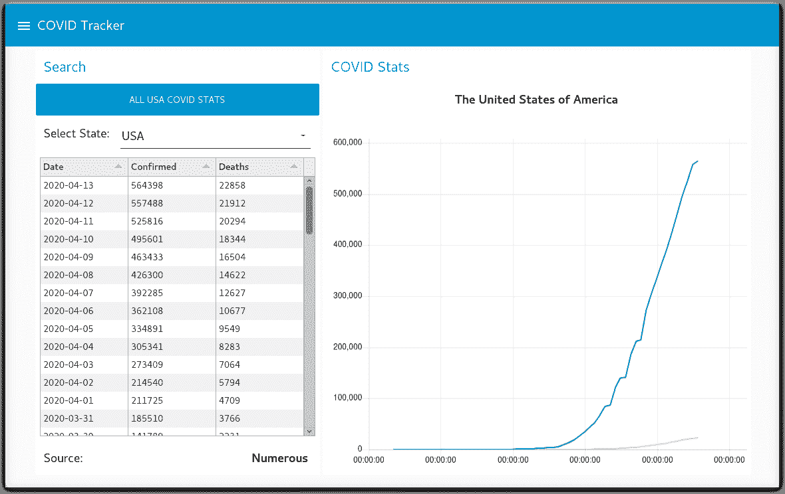

# 构建 Node-RED COVID-19 仪表板

> 原文：[`developer.ibm.com/zh/tutorials/build-a-node-red-covid-19-dashboard-using-twc-disease-tracker-api/`](https://developer.ibm.com/zh/tutorials/build-a-node-red-covid-19-dashboard-using-twc-disease-tracker-api/)

跟踪冠状病毒 (COVID-19) 的传播地点是对抗这种病毒的重要措施。在本教程中，我将向您展示如何通过 The Weather Company (TWC) 提供的 API 来访问 COVID-19 位置和感染数据，以及如何将这些数据整合到 Node-RED 仪表板的图表中。使用 Node-RED，按国家、州和县对 COVID-19 感染病例进行数据分析并实现数据可视化。



## 学习目标

在本教程中，您将学习以下内容：

*   了解 Node-RED，知道如何在本地和 IBM Cloud 上进行安装
*   浏览 node-red-contrib-twc-covid19-tracker Node-RED 节点
*   查看 TWC 疾病跟踪器 API 文档
*   试用 node-red-dashboard 图表和 node-red-node-ui-table 表
*   使用 TWC 疾病跟踪器 API 来构建 Call for Code COVID-19 疾病跟踪仪表板

## 前提条件

*   [在本地安装 Node-RED](https://nodered.org/docs/getting-started/)，或者在 IBM Cloud 中[创建 Node-RED 入门应用程序](https://developer.ibm.com/tutorials/how-to-create-a-node-red-starter-application/)。
*   您需要有一个 API 密钥才能使用 The Weather Company COVID-19 疾病跟踪 API。 [Call for Code](https://developer.ibm.com/cn/callforcode/) 参与者可以阅读服务条款，注册参与 [Call for Code 2020 COVID 挑战赛](https://developer.ibm.com/callforcode/getstarted/covid-19/)，并可在 [callforcode.weather.com](https://callforcode.weather.com) 上为此 Node-RED 节点申请 TWC API 密钥。

## 预估时间

完成本教程大约需要 30 分钟。

## 步骤

### 了解 Node-RED

[Node-RED](http://nodered.org) 是一种开源编程工具，能够以新颖有趣的方式将硬件设备、API 和在线服务连接在一起。它提供了一个基于浏览器的编辑器，使您可以轻松地使用选用板中的各种节点将不同的流连接在一起，只需单击即可将其部署到运行时。

### 安装 Node-RED 依赖节点

安装 Node-RED 之后，本教程会要求您添加一些其他依赖项：

*   [node-red-contrib-twc-covid19-tracker](https://flows.nodered.org/node/node-red-contrib-twc-covid19-tracker)
*   [node-red-node-ui-table](https://flows.nodered.org/node/node-red-node-ui-table)
*   [node-red-dashboard](https://flows.nodered.org/node/node-red-dashboard)

#### 本地安装说明

要在本地进行安装，可使用以下命令：

```
npm install node-red-node-ui-table node-red-dashboard node-red-contrib-twc-covid19-tracker 
```

#### IBM Cloud 安装说明

不必通过 Manage 面板来添加其他软件包，只需要使用 IBM Cloud Toolchain 和 IBM Cloud 中的 git 代码库将以下软件包添加到 `package.json` 中即可。提交更改，IBM Cloud Continuous Delivery 工具链将会构建和部署 Cloud Foundry 应用程序。

```
"node-red-node-ui-table":"0.x",
"node-red-dashboard":"2.x",
"node-red-contrib-twc-covid19-tracker":"0.x", 
```

### 浏览 node-red-contrib-twc-covid19-tracker Node-RED 节点

这个 Node-RED 软件包将在您的 Node-RED 面板中创建一个 **twc covid19 tracker** 节点。

**twc covid19 tracker** 节点通过地理代码、地点 ID 或邮政编码，查询国家（美国）、州、县级别的 COVID-19 统计信息的 60 天历史记录。

将节点安装到 Node-RED 面板中后，将节点拖到流中，然后双击 **twc covid tracker** 节点。在 **Properties** 对话框中，输入以下信息：

*   [callforcode.weather.com](https://callforcode.weather.com) 为您提供的 TWC API 密钥
*   指定节点将检索 **Country**、**State** 还是 **County** COVID-19 数据
*   指定您感兴趣的位置：**geocode**（经纬度）、**place ID** 或 **postal key**
*   通过经纬度、地点 ID 或邮政编码表示的地点。示例：
    *   40.74,-73.99
    *   327145917e06d09373dd2760425a88622a62d248fd97550eb4883737d8d1173b
    *   10001:US

在 Node-RED 右侧边栏中查看节点信息文档可获取技术信息，利用这些技术信息，可以通过 `msg.twcparams` json 对象以编程方式传递上述参数。


## 查看 TWC 疾病跟踪器 API 文档

The Weather Company 提供可供购买的 [TWC 天气数据包](https://business.weather.com/products/weather-data-packages)。本教程中的 Node-RED 节点实现了疾病跟踪 API 服务，并且对 Call for Code 参与者免费（请查看[服务条款](https://callforcode.weather.com/register/)）。

TWC 疾病跟踪器 API 使您可以跟踪给定位置的 COVID-19 疾病蔓延状况。它提供了有关活跃疾病的信息，包括过去 60 天内的确诊病例数、死亡人数和康复人数。

有关 The Weather Company 的疾病跟踪 API 的更多信息，可参阅[在线文档](https://docs.google.com/document/d/1VOOQ0yp_QFltYDerXvD-Ew03XdYZeysnvX86EcaTik0)。

此 API 将返回一个包含 COVID-19 数据的 JSON 对象数组，您可以将这个数组集成到仪表板或应用程序中。

## 试用 Node-RED 图表

**node-red-dashboard** 软件包在 Node-RED 面板中提供了多种 UI 元素，可用于构造仪表板。只需要很少的代码，便可以将这些仪表、图表、滑块、下拉列表、输入字段和按钮串联在一起，构建一个信息丰富的仪表板。

**node-red-node-ui-table** 软件包在 Node-RED 面板中提供了一个表元素，可用来构造功能强大的表格数据。

这些节点将连接在一起，构建一个 COVID-19 数据仪表板，通过图表形式直观呈现国家（美国）和各州的数据。

## 使用 TWC 疾病跟踪器 API 来构建 Call for Code COVID-19 疾病跟踪仪表板

[node-red-contrib-twc-covid19-tracker GitHub 代码库](https://github.com/call-for-code/node-red-contrib-twc-covid19-tracker)包含一系列显示了 COVID-19 统计信息的 Node-RED 仪表板示例。

[examples](https://github.com/call-for-code/node-red-contrib-twc-covid19-tracker/tree/master/examples) 文件夹中提供了两个示例。

*   通过导入 [covid19-api-test.json](https://github.com/call-for-code/node-red-contrib-twc-covid19-tracker/blob/master/examples/covid19-api-test.json) 流来测试每个 TWC COVID-19 API。


*   这是一个示例 Node-RED 仪表板，以图表形式显示 60 天的 COVID-19 历史数据。 这个流需要 node-red-dashboard 和 node-red-node-ui-table。导入此 [Node-RED-covid19-dashboard.json](https://github.com/call-for-code/node-red-contrib-twc-covid19-tracker/blob/master/examples/Node-RED-covid19-dashboard.json) 流。


### 部署 Node-RED 流

要部署 Node-RED 流，可在您的 UI 中单击红色的 **Deploy**。

要启动 Node-RED 仪表板，可单击右侧边栏中的 **dashboard** 选项卡。单击右上角的箭头图标。


## 构建 Call for Code COVID-19 仪表板解决方案

既然您已经完成了本教程，现在就可以修改这些示例流和您自己的 Node-RED 仪表板，构建一个 Call for Code COVID 数据可视化解决方案。作为一项可能的增强功能，您可以添加显示感染热点的地图，或者允许您的用户输入、选择或显示特定县的信息。

本文翻译自：[Build a Node-RED COVID-19 dashboard](https://developer.ibm.com/tutorials/build-a-node-red-covid-19-dashboard-using-twc-disease-tracker-api/)（2020-04-21）