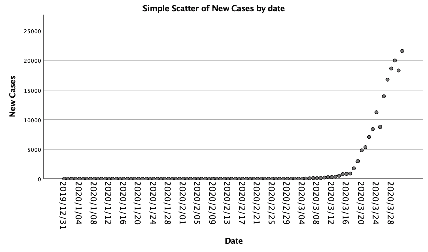

# 使用 IBM SPSS Statistics 分析 COVID-19 数据

> 原文：[`developer.ibm.com/zh/tutorials/use-ibm-spss-statistics-to-analyze-covid-19-data/`](https://developer.ibm.com/zh/tutorials/use-ibm-spss-statistics-to-analyze-covid-19-data/)

您可以使用 IBM SPSS Statistics 对数据（例如，由 COVID-19 疫情生成的数据）进行各种描述性和预测性分析。SPSS Statistics 具有一个易于使用的图形用户界面 (GUI)，但您通过 GUI 执行的操作，几乎都是由强大的命令语法语言在后台执行的。这种命令语法提供了灵活的编程式分析，可以保存指令以重现未来结果，并可以适应新的数据或问题。有关 SPSS Statistics 命令语法的信息，请参见[使用命令语法](https://www.ibm.com/support/knowledgecenter/SSLVMB_26.0.0/statistics_mainhelp_ddita/spss/base/command_syntax.html)。

此示例的数据来自 [full_data.csv](https://covid.ourworldindata.org/data/ecdc/full_data.csv) 文件，该文件是从数据详实的[冠状病毒疾病 (COVID-19) – 统计与研究](https://ourworldindata.org/coronavirus)网站获取的。这个网站包含大量有关 COVID-19 疫情的数据和其他方面的有用信息。该数据由 Hannah Ritchie 维护，并直接从[冠状病毒源数据](https://ourworldindata.org/coronavirus-source-data)下载。

*full_data.csv* 文件是在 2020 年 4 月 1 日下载的，其中包含 3 月份的完整 COVID-19 数据（基于欧洲疾病预防控制中心维护的时间表）。有关确切日期的详细信息，请参阅[冠状病毒疾病 (COVID-19) – 统计与研究](https://ourworldindata.org/coronavirus)中的说明。此处显示的数据值可能与其他来源的数据并不完全一致（原因有多种）。

## 将数据文件加载到 SPSS Statistics 中

由于 *full_data.csv* 数据文件不是原生的 SPSS Statistics 文件 (*.sav)，因此必须先将此文件导入应用程序。可以在[读取 CSV 文件](https://www.ibm.com/support/knowledgecenter/SSLVMB_26.0.0/statistics_mainhelp_ddita/spss/base/idh_read_csv_file.html)中找到有关通过 GUI 导入 *.csv 文件的说明。

命令语法还可用于将数据读取到 SPSS Statistics 中。

1.  在 SPSS Statistics 中选择 **File > New > Syntax**，打开一个新的 Syntax Editor 会话。

2.  将以下语法复制到 Syntax Editor 对话框中。

    ```
     PRESERVE.
     SET DECIMAL DOT.

     GET DATA  /TYPE=TXT
       /FILE="/<path>/full_data.csv"
       /ENCODING='UTF8'
       /DELIMITERS=","
       /QUALIFIER='"'
       /ARRANGEMENT=DELIMITED
       /FIRSTCASE=2
       /DATATYPEMIN PERCENTAGE=95.0
       /VARIABLES=
       date AUTO
       location AUTO
       new_cases AUTO
       new_deaths AUTO
       total_cases AUTO
       total_deaths AUTO
       /MAP.
     RESTORE.
     CACHE.
     EXECUTE.
     DATASET NAME DataSet1 WINDOW=FRONT. 
    ```

3.  在 `GET DATA` 命令的 `/FILE` 子命令中，更改 `<path>` 以引用 *full_data.csv* 文件在您的系统上所在的目录。

4.  选中上面的命令行，然后单击工具栏上绿色的 **Run Selection** 图标（也可以从菜单中选择 **Run > Selection**）。

文件结构相当简单。它包含一个日期变量、一个位置变量（指示国家或地区），还有一些变量用于提供每日新增病例数、新增死亡数、总病例数和总死亡数。除了提供全球的数据外，还有 199 个至少报告了一例 COVID-19 病例的特定地点的数据。

此文件总共包含 7996 行（称为记录或病例）。针对全球有 92 条记录，针对特定地点的记录数量则是可变的。一些地点直到数据涵盖的时间段之后才报告出现病例（对于部分地点来说，从 2019 年 12 月 31 日开始）。

## 转换日期变量

由于数据文件中的日期变量与任何 SPSS Statistics 定义日期格式均不匹配，因此必须编辑日期变量信息才能将其转换为 SPSS Statistics 可以识别的格式。以下命令用斜杠替换变量字符串中的短划线，将变量类型从字符串更改为日期，将变量分配给有序度量级别，向变量添加变量标签，并提供相同格式的计数（无小数）。

**注意：** 日期的有序度量级别非常有用，因为这在绘制图表时提供了变量灵活性（维护排序顺序，但将其标记为分类，某些图表功能需要这样做）。

1.  将以下语法复制到 Syntax Editor 对话框中。

    ```
     COMPUTE date=REPLACE(date,'-','/').
     EXECUTE.
     ALTER TYPE date (A10 = SDATE10).
     VARIABLE LEVEL date (ORDINAL).
     VARIABLE LABELS date 'Date'
         /location 'Location'
         /new_cases 'New Cases'
         /new_deaths 'New Deaths'
         /total_cases 'Total Cases'
         /total_deaths 'Total Deaths'.
     FORMATS new_cases TO total_deaths (F8.0). 
    ```

2.  选中上面的命令行，然后单击工具栏上绿色的 **Run Selection** 图标（也可以从菜单中选择 **Run > Selection**）。

## 按地点分析 COVID-19 数据

SPSS Statistics 提供多个选项，用于单独分析每个地点的数据。如果要对每个地点执行相同的分析，可以使用 [SPLIT FILE](https://www.ibm.com/support/knowledgecenter/SSLVMB_26.0.0/statistics_reference_project_ddita/spss/base/syn_split_file.html) 命令将数据提交到分析过程（每次一个 地点）。此命令可以生成完全独立的输出，也可以在输出表中以堆叠形式生成各个地点的结果。要关注特定的数据子集（例如全球或美国），可以过滤掉所有其他地点，或者创建仅包含感兴趣地点的新数据集。

以下命令可创建一个数据集，该数据集仅包含美国的数据。

1.  将以下语法复制到 Syntax Editor 对话框中。

    ```
     DATASET ACTIVATE DataSet1.
     DATASET COPY  US.
     DATASET ACTIVATE  US.
     FILTER OFF.
     USE ALL.
     SELECT IF (location = 'United States').
     EXECUTE. 
    ```

2.  选中上面的命令行，然后单击工具栏上绿色的 **Run Selection** 图标（也可以从菜单中选择 **Run > Selection**）。

### 生成直方图

以下命令可生成 COVID-19 每天新增病例的直方图。需要日期变量的有序分类度量级别才能生成直方图。

**注意：** 以下命令将调用 SPSS Statistics Chart Builder 绘图引擎。有关更多信息，请参阅[构建 图表](https://www.ibm.com/support/knowledgecenter/SSLVMB_26.0.0/statistics_mainhelp_ddita/spss/base/idh_idc_cg_help_main.html)（适用于 GUI）或 [GPL 简介](https://www.ibm.com/support/knowledgecenter/SSLVMB_26.0.0/statistics_reference_project_ddita/gpl/gpl_intro.html)（适用于命令语法）。

1.  将以下语法复制到 Syntax Editor 对话框中。

    ```
     GGRAPH
       /GRAPHDATASET NAME="graphdataset" VARIABLES=date new_cases MISSING=LISTWISE REPORTMISSING=NO
       /GRAPHSPEC SOURCE=INLINE.
     BEGIN GPL
       SOURCE: s=userSource(id("graphdataset"))
       DATA: date=col(source(s), name("date"), unit.category())
       DATA: new_cases=col(source(s), name("new_cases"))
       GUIDE: axis(dim(1), label("Date"))
       GUIDE: axis(dim(2), label("New Cases"))
       GUIDE: text.title(label("Simple Histogram of New Cases by date"))
       SCALE: linear(dim(2), include(0))
       ELEMENT: interval(position(date*new_cases), shape.interior(shape.square))
     END GPL. 
    ```

2.  选中上面的命令行，然后单击工具栏上绿色的 **Run Selection** 图标（也可以从菜单中选择 **Run > Selection**）。生成的直方图将显示在 SPSS Statistics Output Viewer 中。

    

### 生成散点图

通过使用新增病例与日期的散点图，也可以轻松地直观呈现该数据，如下面的代码所示。

1.  将以下语法复制到 Syntax Editor 对话框中。

    ```
     GGRAPH
       /GRAPHDATASET NAME="graphdataset" VARIABLES=date new_cases MISSING=LISTWISE REPORTMISSING=NO
       /GRAPHSPEC SOURCE=INLINE
       /FITLINE TOTAL=NO.
     BEGIN GPL
       SOURCE: s=userSource(id("graphdataset"))
       DATA: date=col(source(s), name("date"), unit.category())
       DATA: new_cases=col(source(s), name("new_cases"))
       GUIDE: axis(dim(1), label("Date"))
       GUIDE: axis(dim(2), label("New Cases"))
       GUIDE: text.title(label("Simple Scatter of New Cases by date"))
       SCALE: linear(dim(2), include(0))
       ELEMENT: point(position(date*new_cases))
     END GPL. 
    ```

2.  选中上面的命令行，然后单击工具栏上绿色的 **Run Selection** 图标（也可以从菜单中选择 **Run > Selection**）。生成的散点图将显示在 SPSS Statistics Output Viewer 中。

    

**注意：** 这两个图形都是使用 SPSS Statistics Chart Builder GUI 生成的。这里使用的 GPL（图形编程语言）基于 Leland Wilkinson 的图形语法，功能极其强大且非常灵活。

## 高级功能

如果您是数据建模新手，SPSS Statistics 提供的选项使您可以轻松地开始使用更复杂的方法，例如时间序列建模和非线性回归。

### Time Series Modeler

[TSMODEL](https://www.ibm.com/support/knowledgecenter/SSLVMB_26.0.0/statistics_reference_project_ddita/spss/trends/syn_tsmodel.html) 命令可以通过 [Time Series Modeler GUI](https://www.ibm.com/support/knowledgecenter/SSLVMB_26.0.0/statistics_mainhelp_ddita/spss/trends/idh_idd_tab_vars.html) 来访问，此命令包含 [Expert Modeler](https://www.ibm.com/support/knowledgecenter/SSLVMB_26.0.0/statistics_mainhelp_ddita/spss/trends/tsmodel_expmod_crit.html) 模式，该模式尝试为给定序列找到最佳模型。Expert Modeler 也具备自动检测异常值的功能。以下示例让 Expert Modeler 为新的病例系列选择模型，并基于现有数据预测之后 30 天的情况。

1.  将以下语法复制到 Syntax Editor 对话框中。

    ```
     PREDICT THRU 122.
     TSMODEL
        /MODELSUMMARY  PRINT=[MODELFIT]
        /MODELSTATISTICS  DISPLAY=YES MODELFIT=[ SRSQUARE]
        /MODELDETAILS  PRINT=[ PARAMETERS]
        /SERIESPLOT OBSERVED FORECAST
        /OUTPUTFILTER DISPLAY=ALLMODELS
        /SAVE  PREDICTED(Predicted)
        /AUXILIARY  CILEVEL=95 MAXACFLAGS=24
        /MISSING USERMISSING=EXCLUDE
        /MODEL DEPENDENT=new_cases
           PREFIX='Model'
        /EXPERTMODELER TYPE=[ARIMA EXSMOOTH]
        /AUTOOUTLIER  DETECT=ON. 
    ```

2.  选中上面的命令行，然后单击工具栏上绿色的 **Run Selection** 图标（也可以从菜单中选择 **Run > Selection**）。生成的 Time Series Modeler 图表将显示在 SPSS Statistics Output Viewer 中。


由 `TSMODEL` 过程的 Expert Modeler 拟合的相当复杂的 ARIMA（整合移动平均自回归模型）模型（含七个异常值）几乎完美地拟合了观测到的数据，但最后还是开始预测新病例数将永远成直线增长趋势（这显然不可能发生）。这个模型也 难以理解。

在瘟疫或流行病的早期阶段，新病例的增长通常作为时间的指数函数进行适当建模。虽然数据集中存在日期变量，但 SPSS Statistics 中的日期是以公历开始后的秒数来表示的，因此，使用诸如天数等度量来解释大多数模型更加容易。

下面的示例使用一个有用的 `$CASENUM` 系统变量（为连续病例编制索引），为数据集中的每个病例计算一个 `Day` 变量。

1.  将以下语法复制到 Syntax Editor 对话框中。

    ```
     COMPUTE Day=$CASENUM.
     EXECUTE. 
    ```

2.  选中上面的命令行，然后单击工具栏上绿色的 **Run Selection** 图标（也可以从菜单中选择 **Run > Selection**）。

### 非线性回归

接下来，我们使用天数的指数函数来拟合非线性回归模型。这种类型的模型需要全面指定模型的功能形式，包括参数命名和初始值配置。我们拟合的模型有两个参数，一个是截距 `b0`，另一个是增长参数 `b1`（按照以天数为单位的时间，进行幂运算）。

1.  将以下语法复制到 Syntax Editor 对话框中。

    ```
     MODEL PROGRAM  b0=.1 b1=1.2.
     COMPUTE  PRED=b0 * b1 ** Day.
     NLR new_cases
       /SAVE PRED. 
    ```

2.  选中上面的命令行，然后单击工具栏上绿色的 **Run Selection** 图标（也可以从菜单中选择 **Run > Selection**）。

    

    

这个模型也很好地拟合了数据，**R²** 值高于 0.96。增长参数 `b1` 的值约为 1.159。取 2 的对数与该值的对数之比，可以得到以天为单位的预测病例数翻倍时间（大约 4.7 天）。根据该模型，结果意味着平均每 4.7 天新病例增加近一倍。

让我们看看这两个模型的预测结果之间有何区别。[SUMMARIZE](https://www.ibm.com/support/knowledgecenter/SSLVMB_26.0.0/statistics_reference_project_ddita/spss/base/syn_summarize.html) 命令将列出这两个模型提供的日期、新增病例数以及预测和预报情况。

1.  将以下语法复制到 Syntax Editor 对话框中。

    ```
     SUMMARIZE
       /TABLES=Day new_cases Predicted_new_cases_Model_1 PRED
       /FORMAT=VALIDLIST NOCASENUM NOTOTAL
       /TITLE='Case Summaries'
       /FOOTNOTE 'Last two columns are predictions and forecasts from time series and exponential '+
         'nonlinear regression models.'
       /MISSING=VARIABLE
       /CELLS=NONE. 
    ```

2.  选中上面的命令行，然后单击工具栏上绿色的 **Run Selection** 图标（也可以从菜单中选择 **Run > Selection**）。


## 结束语

这两个模型都预测新病例数将持续增长，但指数非线性回归模型的预测呈爆炸式增长，预计到四月底，每天将新增超过 200 万病例！

人们经常引用或改写一位著名统计学家的名言：所有模型都是错的，但其中有一些是有用的。这两个模型都不正确，但是流行病学家知道，如果不进行检测，更简单的指数模型会更接近病毒感染的行为（也就是说，所有人都被病毒感染，乃至最终没有人可让病毒感染）。这就是为什么要采取极端（对于我们许多人来说，这都是前所未有的） 措施与 COVID-19 流行病斗争的原因所在。

在 SPSS Statistics 版本的 IBM Call for Code 中，您面临的挑战是使用 SPSS Statistics 以及任何完全公开可用的数据来构建模型和模型可视化对象，帮助理解 COVID-19 流行病的传播过程，以及我们面对冠状病毒所采取措施的效果。

本文翻译自：[Use IBM SPSS Statistics to analyze COVID-19 data](https://developer.ibm.com/technologies/analytics/tutorials/use-ibm-spss-statistics-to-analyze-covid-19-data/)（2020-4-15）