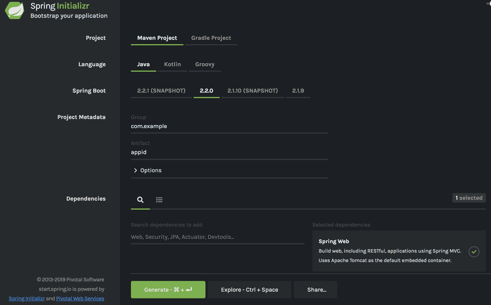
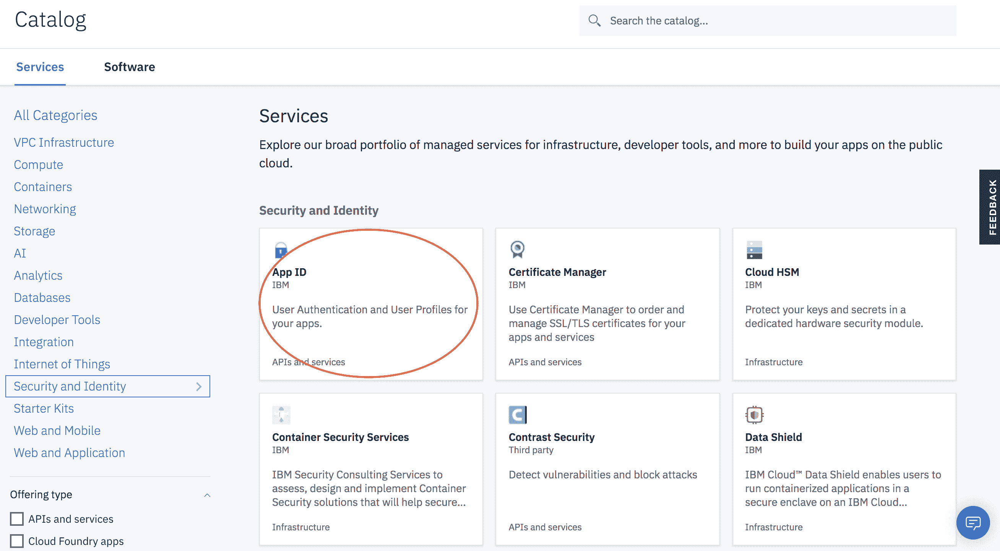
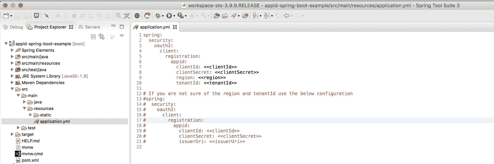
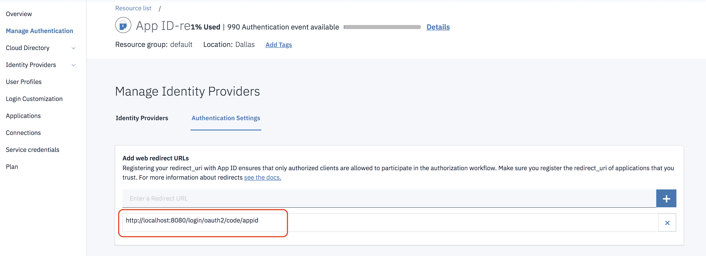
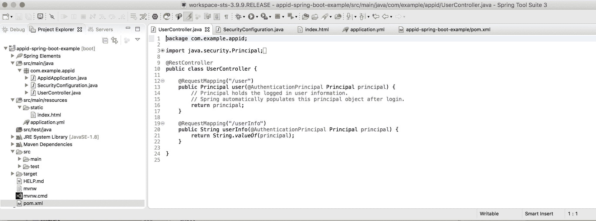
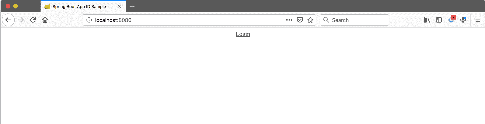
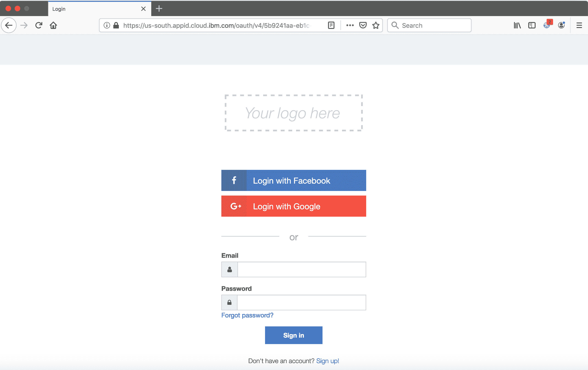

# 使用 App ID 保护 Spring Boot 应用程序

> 原文：[`developer.ibm.com/zh/tutorials/secure-a-spring-boot-application-with-app-id/`](https://developer.ibm.com/zh/tutorials/secure-a-spring-boot-application-with-app-id/)

在本教程中，学习如何使用 [App ID Spring Boot Starter](https://github.com/IBM/appid-spring-boot-starter)，它为 Spring Boot 应用程序开发者在其应用程序中利用 IBM Cloud App ID 提供一种轻松的方法。

[IBM Cloud App ID](https://cloud.ibm.com/docs/appid?topic=appid-about) 是一项云服务，使开发者能够轻松地向其应用程序添加认证和授权功能，同时该服务的所有运营方面都由 IBM Cloud Platform 处理。App ID 适用于希望保护其应用程序安全但没有资源来实施所有安全协议的开发者。该服务提供如下功能：Cloud Directory（云端高度可扩展的用户存储库）、企业身份联合、社交登录、SSO、可自定义的登录窗口小部件、灵活的访问控制和用户概要文件、多因子认证、可轻松进行应用程序检测的一组开源 SDK 等。

使用 App ID 有许多好处：

*   App ID 已与其他 IBM Cloud 组件（包括 IBM Cloud Kubernetes Service、Cloud Functions、Cloud Foundry、API Connect、Activity Tracker 等）深度集成，在轻松保护云原生应用程序方面提供无缝体验。

*   App ID 是一项管理服务，由 IBM 在 IBM Cloud 的所有区域中全权运营，并且符合多项认证标准，例如 GDPR、HIPAA、SOC、ISO、PCI 等。

## 学习目标

在本教程中，学习如何使用 [App ID Spring Boot Starter](https://github.com/IBM/appid-spring-boot-starter) 通过 App ID 保护 Spring Boot 应用程序。该示例将使用 IBM Cloud 上的 App ID 服务以及客户端用例（例如，Web 或移动应用程序），代表最终用户调用受保护的资源（例如，后端 API）。

您将执行以下步骤：

*   使用 Spring Initializr 创建 Spring Boot 应用程序。
*   在 IBM Cloud 上创建 App ID 服务实例。
*   将 App ID 服务配置添加到您的应用程序。
*   在 App ID 中添加 Web 重定向 URL。
*   将 App ID Spring Boot Starter 和其他必需依赖添加到 pom.xml。
*   添加 Configuration 类以配置安全性。
*   添加一些由 Spring Security 保护的 REST 端点，Spring Security 提供已登录用户的详细信息。
*   添加 HTML 页面以调用受保护的 REST 端点。
*   构建应用程序并从网页访问受保护的资源。

## 前提条件

要按照本教程中的步骤进行操作，您将需要满足以下条件：

*   您的计算机上的已安装 [Maven](https://maven.apache.org/) 和 [Java](https://adoptopenjdk.net/releases.html)
*   掌握有关如何构建和运行基于 Maven 的 [Spring Initializr](https://start.spring.io) 项目的知识
*   [IBM Cloud 帐户](https://cloud.ibm.com/registration?cm_sp=ibmdev-_-developer-tutorials-_-cloudreg)
*   掌握 Spring Boot 和 Spring Security 的基本知识

## 预估时间

本教程大约需要 30 分钟。

## 步骤

1

### 使用 Spring Initializr 创建 Spring Boot 应用程序

1.  在 [Spring Initializr](https://start.spring.io) 页面上，使用以下规范生成 `Maven Project`。

    *   **Language**: `Java`
    *   **Dependencies**: `Web`
    *   **Project Metadata**: 对于此示例，我们使用：
        *   **Group**: `com.example`
        *   **Artifact**: `appid`

    

2.  下载该项目并将其解压。

2

### 在 IBM Cloud 上创建 App ID 服务实例

从 IBM Cloud 目录 >“[Security and Identity](https://cloud.ibm.com/catalog?category=security&cm_sp=ibmdev-_-developer-tutorials-_-cloudreg)”类别选择 **App ID** 服务。



该服务的 Lite 版本可以免费试用。

3

### 将 App ID 服务配置添加到应用程序

1.  在 [IBM Cloud 仪表板](https://cloud.ibm.com/resources?cm_sp=ibmdev-_-developer-tutorials-_-cloudreg)上选择 App ID 实例。

2.  然后在左侧窗格中选择 **Applications**。

    如果没有列出任何应用程序，那么添加一个新应用程序。然后单击“View credentials”以显示应用程序凭证。

3.  编辑解压后的 Spring Initializr 项目，并将包含以下属性名称的配置添加到 `src/main/resources/application.yml` 文件：

    ```
    spring:
      security:
        oauth2:
          client:
            registration:
              appid:
                clientId: <<clientId>>
                clientSecret: <<clientSecret>>
                region: <<region>>
                tenantId: <<tenantId>> 
    ```

    或者，将配置添加到具有以下属性名称的 `src/main/resources/application.properties` 文件：

    ```
    spring.security.oauth2.client.registration.appid.clientId=<<clientId>>
    spring.security.oauth2.client.registration.appid.clientSecret=<<clientSecret>>
    spring.security.oauth2.client.registration.appid.region=<<region>>
    spring.security.oauth2.client.registration.appid.tenantId=<<tenantId>> 
    ```

    如果您不确定 `region` 和 `tenantId`，请添加以下配置：

    ```
    spring:
      security:
        oauth2:
          client:
            registration:
              appid:
                clientId: <<clientId>>
                clientSecret: <<clientSecret>>
                issuerUri: <<issuerUri>> 
    ```

    或者：

    ```
    spring.security.oauth2.client.registration.appid.clientId=<<clientId>>
    spring.security.oauth2.client.registration.appid.clientSecret=<<clientSecret>>
    spring.security.oauth2.client.registration.appid.issuerUri=<<issuerUri>> 
    ```

    

    `issuerUri`：URI 可以是 OpenID Connect 发现端点，也可以是 RFC 8414 定义的 OAuth 2.0 授权服务器元数据端点。

**注意**：不建议将凭证存储在您的应用程序中。在本教程中，我们这样做只是为了简单起见。

4

### 在 App ID 中添加 Web 重定向 URL

1.  当您位于 App ID 服务仪表板上时，转至 **Manage Authentication** > **Manage Identity Providers**。

2.  添加 `http://localhost:8080/login/oauth2/code/appid` 作为您的 Web 重定向 URL。



在 App ID 完成 Oauth2 流程后，将重定向到提供的 URL。

5

### 将 App ID Spring Boot Starter 和其他必需的依赖添加到 pom.xml

```
 <dependencies>
    <!-- App ID Starter-->
    <dependency>
        <groupId>com.ibm.cloud.appid</groupId>
        <artifactId>appid-spring-boot-starter</artifactId>
        <version>0.0.5</version>
    </dependency>
    <dependency>
        <groupId>org.springframework.boot</groupId>
        <artifactId>spring-boot-starter-web</artifactId>
    </dependency>
    <!-- adding jquery as a dependency, this will be used by the front-end UI -->
    <dependency>
        <groupId>org.webjars</groupId>
        <artifactId>jquery</artifactId>
        <version>2.1.1</version>
    </dependency>
    <!-- webjars-locator-core used by Spring to locate static assets in webjars without needing to know the exact versions -->
    <dependency>
        <groupId>org.webjars</groupId>
        <artifactId>webjars-locator-core</artifactId>
    </dependency>
    <dependency>
        <groupId>org.webjars</groupId>
        <artifactId>js-cookie</artifactId>
        <version>2.1.0</version>
    </dependency>
    <dependency>
        <groupId>org.webjars</groupId>
        <artifactId>bootstrap</artifactId>
        <version>3.2.0</version>
    </dependency>
</dependencies> 
```

6

### 添加 Configuration 类以配置安全性

创建 **SecurityConfiguration.java** 类，然后添加以下代码：

```
@Configuration
@EnableWebSecurity
public class SecurityConfiguration extends WebSecurityConfigurerAdapter {

    @Override
    protected void configure(HttpSecurity http) throws Exception {
        http
        .authorizeRequests()
        .antMatchers("/login**", "/user", "/userInfo").authenticated()
        .and()
        .oauth2Login();
    }
} 
```

在此处，我们将通过扩展 `WebSecurityConfigurerAdapter` 类并覆盖 configure 方法来配置安全性。

只有经过认证的用户才可以访问 `/user` 和 `/userInfo` 端点。

7

### 添加受保护的 REST 端点

要添加 REST 端点，请创建 **UserController.java** 类，然后添加以下代码：

```
@RestController
public class UserController {

    @RequestMapping("/user")
    public Principal user(@AuthenticationPrincipal Principal principal) {
        // Principal holds the logged in user information.
        // Spring automatically populates this principal object after login.
        return principal;
    }

    @RequestMapping("/userInfo")
    public String userInfo(@AuthenticationPrincipal Principal principal) {
        return String.valueOf(principal);
    }
} 
```

`/user` 端点为您提供已登录的用户对象（主要），`/userInfo` 端点将返回一个包含用户详细信息的字符串。

8

### 添加 HTML 页面以调用受保护的 REST 端点

在 `/appid-spring-boot-example/src/main/resources/static` 中创建 **index.html** 文件，然后添加以下代码，这些代码将显示已登录的用户信息：

```
<!DOCTYPE html>
<html lang="en">
    <head>
        <meta charset="UTF-8">
        <meta name="viewport" content="width=device-width, initial-scale=1.0">
        <title>Spring Boot App ID Sample</title>
        <link type="text/css" href="css/style.css" rel="stylesheet" />
        <script type="text/javascript" src="/webjars/jquery/jquery.min.js"></script>
        <script type="text/javascript" src="/webjars/js-cookie/js.cookie.js"></script>
        <script type="text/javascript">
            $.ajaxSetup({
                beforeSend : function(xhr, settings) {
                    if (settings.type == 'POST' || settings.type == 'PUT' || settings.type == 'DELETE' || settings.type == 'GET') {
                        if (!(/^http:.*/.test(settings.url) || /^https:.*/.test(settings.url))) {
                            // Only send the token to relative URLs i.e. locally.
                            xhr.setRequestHeader("X-XSRF-TOKEN", Cookies.get('XSRF-TOKEN'));
                        }
                        xhr.setRequestHeader("X-XSRF-TOKEN", Cookies.get('XSRF-TOKEN'));
                    }
                }
            });
            $.get("/user", function(data) {
                if (data.principal != null) {
                    $("#user").html(data.principal.attributes.name);
                    $("#userSub").html(data.principal.attributes.sub);
                    $("#userEmail").html(data.principal.attributes.email);
                    $("#provider").html(data.principal.attributes.identities[0].provider);
                    $(".unauthenticated").hide();
                    $(".authenticated").show();
                } else {
                    $(".unauthenticated").show();
                    $(".authenticated").hide();
                }
            }).fail(function() {
                $(".unauthenticated").show();
                $(".authenticated").hide();
            });

            <!-- In this case, we will call GET /userInfo, and this will give us back a string with userinfo details from Principal user -->
            $.get("/userInfo", function(data) {
                if (data.includes("Principal")) {
                    $("#userInfoString").html(data);
                    $(".unauthenticated").hide();
                    $(".authenticated").show();
                } else {
                    $(".unauthenticated").show();
                    $(".authenticated").hide();
                }
            }).fail(function() {
                $(".unauthenticated").show();
                $(".authenticated").hide();
            });
        </script>
    </head>
    <body>
        <div class="container unauthenticated" style="text-align: center;">
            <a href="/login">Login</a>
        </div>
        <div class="container authenticated" style="text-align: center;" >
            <strong>Logged in as: <span id="user"></span></strong>
            <br>
            <br>
            <strong>Sub: </strong><span id="userSub"></span>
            <br>
            <strong>Email: </strong><span id="userEmail"></span>
            <br>
            <strong>Provider: </strong><span id="provider"></span>
            <br>
            <br>
            <strong>User Profile Information: </strong>
            <br>
            <span id="userInfoString"></span>
            <br>
            <br>
       </div>
    </body>
</html> 
```

您的 Spring Boot 项目现在应如下所示：



9

### 构建并运行应用程序

1.  使用以下命令构建并运行您的应用程序：

    ```
    mvn clean
    mvn package spring-boot:run 
    ```

2.  在应用程序运行后，打开浏览器，然后转至 `http://localhost:8080`。您将转至登录屏幕。

3.  单击 “**Login**” 链接，该链接会将您转至 App ID 屏幕。

    

4.  在 App ID 页面上选择登录选项，这会转至身份提供者登录页面。

    

5.  在成功登录后，您将被重定向回至我们使用用户信息创建的样本应用程序。

## 结束语

通过 App ID Spring Boot Starter，可以使用 Spring 自动配置和 Spring Boot 属性，以 Spring Security 原生方式轻松地配置和使用 App ID。

可以在 [Github](https://github.com/IBM/appid-spring-boot-example) 中找到本教程的完整源代码。

## 反馈和资源

我们期待收到您的反馈和问题！

*   直接与 [Slack](https://ibm-container-service.slack.com/) 的开发团队联系。（如果需要，请参阅这些[操作说明](https://www.ibm.com/cloud/blog/announcements/get-help-with-ibm-cloud-app-id-related-questions-on-slack)以加入 IBM Cloud App ID 工作空间。）
*   如果您有关于 App ID 的技术问题，请将您的问题发布在 [Stack Overflow](https://stackoverflow.com/) 上，并使用 `ibm-appid` 标记问题。
*   有关服务和入门操作说明的问题，请您使用 [IBM Support 论坛](https://www.ibm.com/mysupport/s/forumshome?language=en_US) 。请包含 `appid` 标记。
*   如果您有更重要的问题，请在 IBM Cloud [支持中心](https://cloud.ibm.com/unifiedsupport/supportcenter?cm_sp=ibmdev-_-developer-tutorials-_-cloudreg)内开具支持凭单。

要了解有关 App ID 服务和入门的更多信息，请您查看以下链接：

*   [创建 App ID 实例](https://cloud.ibm.com/catalog/services/app-id?cm_sp=ibmdev-_-developer-tutorials-_-cloudreg)
*   [文档](https://cloud.ibm.com/docs/services/appid?topic=appid-about)
*   [技术白皮书](https://github.com/ibm-cloud-security/appid-documentation/raw/master/appid-whitepaper-latest.pdf) (PDF download)
*   [YouTube 视频教程系列](https://www.youtube.com/playlist?list=PLbAYXkuqwrX2WLQqR0LUtjT77d4hisvfK)

本文翻译自：[Secure a Spring Boot application with App ID](https://developer.ibm.com/tutorials/secure-a-spring-boot-application-with-app-id/)（2020-01-20）