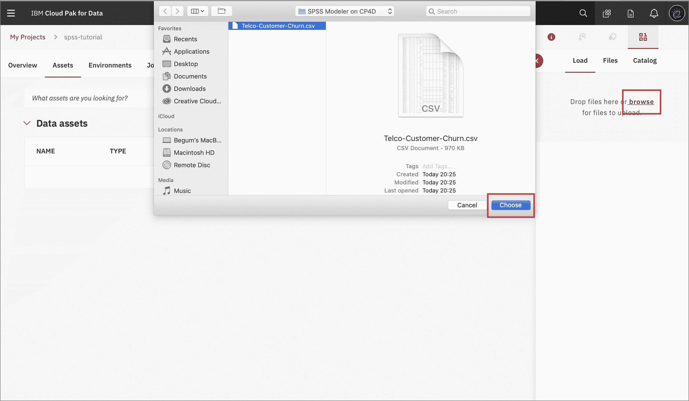
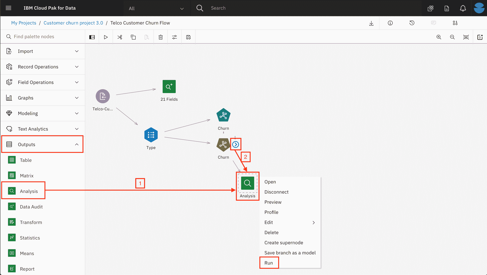
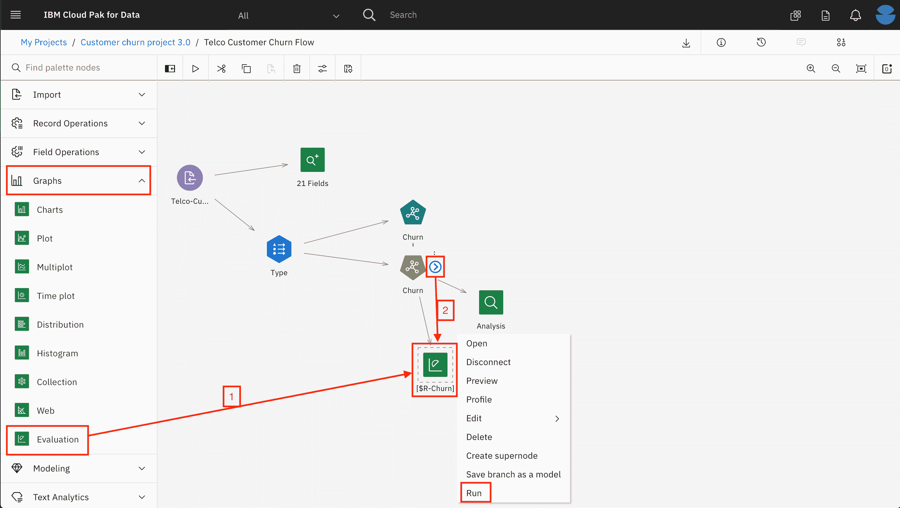

# 使用 IBM SPSS Modeler 快捷构建预测机器学习模型

> 原文：[`developer.ibm.com/zh/tutorials/build-an-ai-model-visually-with-spss-modeler-flow/`](https://developer.ibm.com/zh/tutorials/build-an-ai-model-visually-with-spss-modeler-flow/)

**本教程纳入 [IBM Cloud Pak for Data 快速入门学习路径](https://developer.ibm.com/zh/series/cloud-pak-for-data-learning-path/)**。

| 级别 | 主题 | 类型 |
| --- | --- | --- |
| 100 | [IBM Cloud Pak for Data 简介](https://developer.ibm.com/zh/articles/intro-to-cloud-pak-for-data) | 文章 |
| 101 | [利用 Data Virtualization 实现 Db2 Warehouse 数据虚拟化](https://developer.ibm.com/zh/tutorials/virtualizing-db2-warehouse-data-with-data-virtualization) | 教程 |
| 201 | [利用 Data Refinery 实现数据可视化](https://developer.ibm.com/zh/tutorials/data-visualization-with-data-refinery) | 教程 |
| 202 | [使用 Watson Knowledge Catalog 查找、准备和理解数据](https://developer.ibm.com/zh/tutorials/find-prepare-and-understand-data-with-watson-knowledge-catalog) | 教程 |
| 301A | [借助内置 Notebook 的 Watson Machine Learning 进行数据分析、建模以及部署](https://developer.ibm.com/zh/patterns/data-analysis-model-building-and-deploying-with-wml) | Pattern |
| 301B | [使用 AutoAI 自动构建模型](https://developer.ibm.com/zh/tutorials/automate-model-building-with-autoai) | 教程 |
| **301C** | **[使用 IBM SPSS Modeler 快捷构建预测机器学习模型](https://developer.ibm.com/zh/tutorials/build-an-ai-model-visually-with-spss-modeler-flow)** | **教程** |
| 401 | [利用 Watson OpenScale 监视模型](https://developer.ibm.com/zh/patterns/watson-openscale-with-watson-machine-learning-engine-on-icp4d) | Pattern |

在本教程中，我们将使用 [IBM Cloud Pak for Data](https://www.ibm.com/cn-zh/products/cloud-pak-for-data)，通过 [IBM SPSS Modeler](https://www.ibm.com/cn-zh/products/spss-modeler) 构建一个预测机器学习模型，判断某个电信客户是否会流失。IBM Cloud Pak for Data 是一个基于云的交互式协作环境，支持开发人员和数据科学家协同工作，从数据中获得洞察，并构建机器学习模型。

## 学习目标

完成本教程后，用户将了解：

*   如何将数据上传到 [IBM Cloud Pak for Data](https://www.ibm.com/cn-zh/products/cloud-pak-for-data)
*   如何创建 SPSS Modeler 流程
*   如何使用 SPSS 工具来检查数据和发掘洞察
*   如何使用 SPSS 修改和准备数据以创建 AI 模型
*   如何使用 SPSS 训练机器学习模型，并对结果进行评估。

## 前提条件

*   [IBM Cloud Pak for Data](https://www.ibm.com/cn-zh/products/cloud-pak-for-data)
*   SPSS Modeler Deploped on Cloud Pak for Data

## 预估时间

完成本教程大约需要 30 分钟。

## 步骤

1.  上传数据
2.  创建 SPSS Modeler 流程
3.  导入数据
4.  检查数据
5.  数据准备
6.  训练 ML 模型
7.  评估结果

### 第 1 步：上传数据

下载 Telco-Customer-Churn.csv 数据集。

在项目的 `Assets` 选项卡上，单击 `01/00` 图标。您可以拖放该文件，也可以单击 `browse` 来选择并上传 `Telco-Customer-Churn.csv` 文件。

### 第 2 步：创建一个 SPSS Modeler 流程

在项目的主页上，单击 **Add to Project** 按钮，然后选择 **Modeler Flow**。为流程提供一个有意义的名称，如“Telco Customer Cloun Flow”，然后单击 Create。

### 第 3 步：导入数据

1.  在 Import 部分中，将 `Data Asset` 节点拖放到画布上。双击该节点，然后单击 *Change data asset*。

    

2.  在 Assets 页面上打开 Data Assets 选项卡，选择您先前已上传的“Telco-Customer-Churn.csv”文件，然后单击 OK。

    

### 第 4 步：检查数据

1.  为了了解数据，打开 Output 选项卡，将 `Data Audit` 节点拖放到画布上。在 Data Audit 节点与 Data Asset 节点边上的两个小圆圈之间画一条线，将这两个节点连接起来。该节点将自动重命名为 *21 Fields*。

    

2.  单击 Data Audit 节点上的三个点，或右键单击该节点打开该节点的菜单，然后单击 Run。可以从右侧 Outputs 菜单查看输出结果。双击输出结果可查看有关数据的统计信息。

    

    

3.  单击顶部的项目名称以返回。

### 第 5 步：数据准备

1.  从 Field Operations 选项卡中，将 `Type` 节点拖放到画布上。将 Type 节点与 Data Asset 节点连接起来，然后双击 Type 节点进行必要的配置。

    

2.  单击 Read Values。检查每个字段的度量和角色是否正确。将 Churn 字段的角色从 Input 更改为 Target。然后单击 Save 关闭选项卡。

    

### 第 6 步：训练 ML 模型

1.  从 Modeling 选项卡中，将 `Random Forest` 节点添加到画布上，然后与 Type 节点相连接。该节点将自动重命名为 Churn。

    

2.  右键单击 Random Forest 节点，然后单击 Run。执行完成后，您将看到画布中添加了一个像金砖一样的 `Churn` 新节点。

    

3.  右键单击 Churn 金砖节点，然后选择 Preview 检查输出结果。

### 第 7 步：评估结果

1.  将 `Analysis` 节点从 Output 选项卡拖放到画布上。与 Churn 金砖节点相连接。右键单击 Analysis 节点，然后单击 Run。

    

2.  在右侧的 Outputs 选项卡中，双击 Analysis 输出以了解结果的精确度。右键单击该节点，再单击 Run。然后在 Outputs 菜单中双击 Analysis 输出。

    

3.  单击顶部的流程名称以返回。

4.  从 Graphs 选项卡，将 `Evaluation` 节点拖放到画布上，然后与 Churn 金砖节点相连接。

    

5.  右键单击 Evaluation 节点，再单击 Run。然后双击 R-Churn 输出，直观呈现该图形。单击流程名称以返回。

    

## 结束语

本教程演示了在 IBM Cloud Pak for Data 上的 IBM SPSS Modeler 中创建预测机器学习模型的小示例。本教程先介绍了如何将数据导入项目和建模器流程中，并为建模准备好数据。然后介绍了为数据选择适当算法和训练预测模型的步骤。最后介绍了如何直观呈现和评估经过训练的模型的结果。

本教程纳入 [IBM Cloud Pak for Data 快速入门学习路径](https://developer.ibm.com/zh/series/cloud-pak-for-data-learning-path/)。要继续学习本系列课程并了解 IBM Cloud Pak for Data 的更多信息，可查看下一个教程[利用 Watson OpenScale 监视模型](https://developer.ibm.com/zh/patterns/watson-openscale-with-watson-machine-learning-engine-on-icp4d/)。

本文翻译自：[Build a predictive machine learning model quickly and easily with IBM SPSS Modeler](https://developer.ibm.com/tutorials/build-an-ai-model-visually-with-spss-modeler-flow/)（2020-02-25）