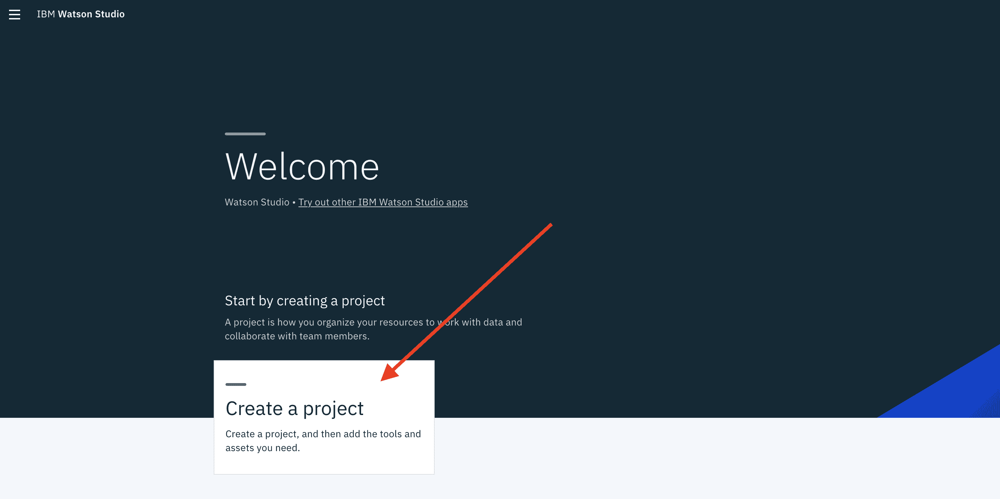
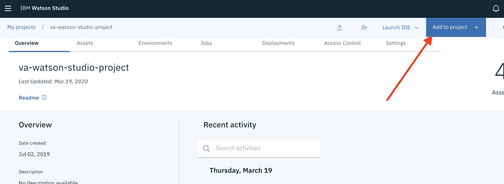
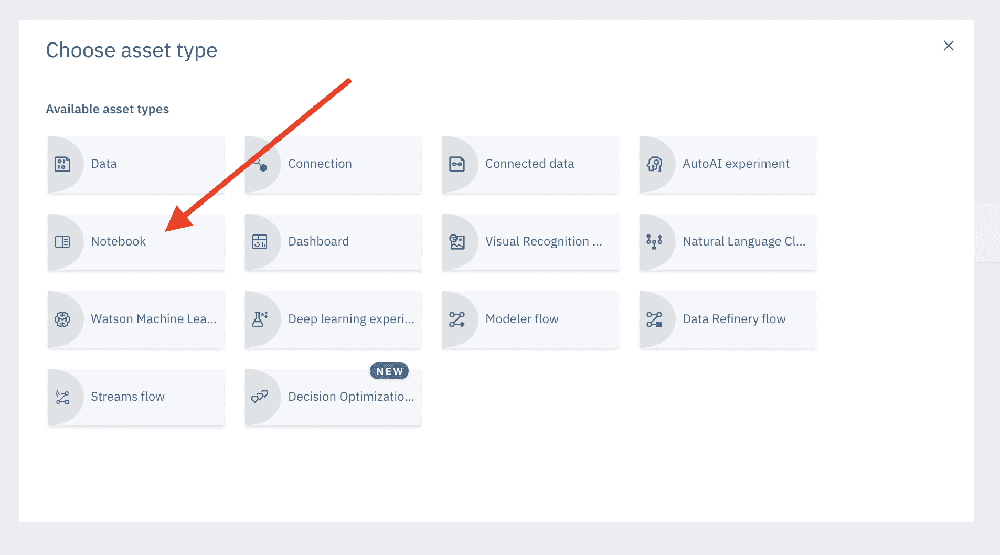
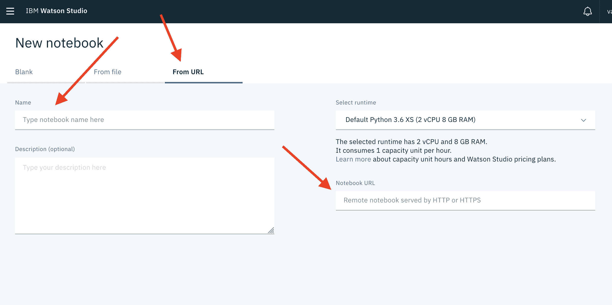

# 使用 The Weather Company 的 API 来跟踪 COVID-19 的进展

> 原文：[`developer.ibm.com/zh/tutorials/chart-covid-19-progression-with-the-weather-company-disease-tracker-api/`](https://developer.ibm.com/zh/tutorials/chart-covid-19-progression-with-the-weather-company-disease-tracker-api/)

## Weather Company Data Disease Tracker API

在 COVID-19（新型冠状病毒肺炎）这样的疫情中，跟踪疾病进展非常有用。The Weather Company 公司创建了 Data Disease Tracker API，此 API 可用于跟踪给定位置的疾病进展。它将提供活跃性疾病的相关信息，包括过去 60 天内的确诊病例数、死亡病例数和治愈病例数。

在本教程中，我将向您展示如何在 Watson Studio 中使用 Python 访问 Weather Company Data Disease Tracker API 端点。

## 获取 Weather Company API 密钥

如果您要参加 [Call for Code](https://developer.ibm.com/cn/callforcode/) 全球挑战赛，则可以访问 The Weather Company 的 API 来跟踪 COVID-19 疾病的进展。

请访问 [Call for Code Weather 网站](https://callforcode.weather.com/)并[注册](https://callforcode.weather.com/register)。将通过电子邮件向您发送一个限时的 API 密钥。可在[此处](https://callforcode.weather.com/documentation/)找到针对 Call for Code 的 The Weather Company API 文档。

## （可选）获取 HERE Location Services API 密钥

在使用应用程序时，您可以向其传递一个地理编码（例如“35.843686,-78.78548”）、邮政编码（例如 90210:US）或地址。如果传递的是地址，则应用程序将尝试使用 HERE Location Services 进行地理编码。

要访问 HERE Geocoding API，需要使用 API 密钥。遵循 [HERE 开发者门户](https://developer.here.com/ref/IBM_starterkit_Covid?create=Freemium-Basic)中的简要说明，生成一个免费的 [API 密钥](https://developer.here.com/documentation/authentication/dev_guide/topics/api-key-credentials.html)。

## 将 Notebook 导入到 IBM Watson Studio

1.  [登录到 IBM Watson Studio Cloud](https://dataplatform.cloud.ibm.com/auth/iamid/login?context=analytics?cm_sp=ibmdev-_-developer-tutorials-_-cloudreg)
2.  [创建一个项目](https://dataplatform.cloud.ibm.com/docs/content/wsj/getting-started/projects.html?cm_sp=ibmdev-_-developer-tutorials-_-cloudreg) 
3.  在该项目中，单击 **Add to Project** 
4.  选择 **Notebook** 
5.  在 **New Notebook** 页面上，选择 **From URL**
6.  输入该 Notebook 的 **Name**
7.  对于 **Notebook URL**，请输入该 Notebook 的 URL（可在[此 GitHub 代码库](https://github.com/Call-for-Code/twc-disease-tracker-api-python)中找到）：

    ```
     https://raw.githubusercontent.com/Call-for-Code/twc-disease-tracker-api-python/master/twc-disease-tracker-api.ipynb 
    ```

    

8.  单击 **Create**

此时会将该 Notebook 上载到该项目中并打开。

## 运行 Notebook

在该 Notebook 中：

1.  更新 **Set API keys** 部分下的单元，并设置 Weather Company Data API 密钥（例如 `TWC_APIKEY`）
2.  更新 **Set API keys** 部分下的单元，并设置 HERE Location Services API 密钥（例如 `HERE_APIKEY`）
3.  运行该 Notebook 并执行每一个单元

在该 Notebook 的 **Run** 部分中，您可以设置要获取其数据的位置。如果设置了 HERE API 密钥，则该位置可以是地理编码（例如 `42.3584,-71.0598`）、邮政编码（例如 `02109:US`）或地址（例如 `Boston, MA`）。

检查 **Add function to query TWC API to get most recent report** 部分，以了解疾病跟踪 API 端点的使用方式。

## 许可

此代码是在 Apache 2.0 下授予许可的。在[许可](https://github.com/Call-for-Code/twc-disease-tracker-api-python/blob/master/LICENSE)中提供了完整许可文本。

本文翻译者：[Track COVID-19’s progression with The Weather Company’s API](https://developer.ibm.com/tutorials/chart-covid-19-progression-with-the-weather-company-disease-tracker-api)（2020-4-21）