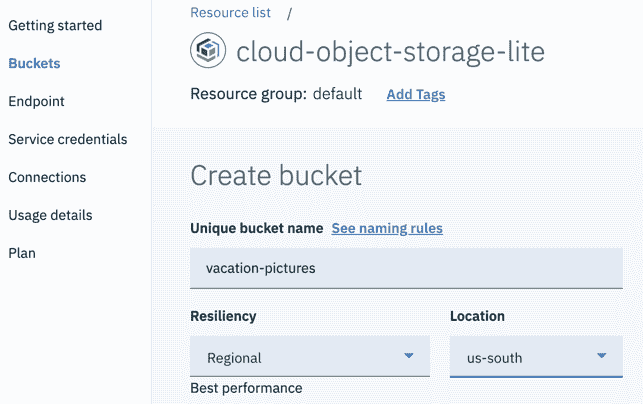

# 在 IBM Cloud Functions 中利用深度学习

> 原文：[`developer.ibm.com/zh/tutorials/leverage-deep-learning-in-apache-openwhisk-ibm-cloud-functions/`](https://developer.ibm.com/zh/tutorials/leverage-deep-learning-in-apache-openwhisk-ibm-cloud-functions/)

IBM Cloud Functions 是基于 [Apache OpenWhisk](https://openwhisk.apache.org/) 的功能即服务 (FaaS) 平台，可轻松构建和部署无服务器应用程序。

在本教程中，您将使用 [IBM Cloud Functions](https://cloud.ibm.com/functions/?cm_sp=ibmdev-_-developer-tutorials-_-cloudreg) 构建无服务器应用程序，该应用程序将监控 Cloud Object Storage 存储空间（bucket ）中的内容，并分析通过人工或自动化流程上传到存储空间的图像内容。为了便于说明，通过来自 [Model Asset eXchange](https://developer.ibm.com/zh/exchanges/models/) 的深度学习微服务执行分析，并将分析结果作为 JSON 文件存储在同一存储空间中。


您可以轻松地采用概述的方法，利用托管的认知服务（例如 [IBM Watson®](https://cloud.ibm.com/developer/watson/dashboard?cm_sp=ibmdev-_-developer-tutorials-_-cloudreg) 提供的服务），并将结果存储在非关系型数据存储库（如 [Cloudant®](https://www.ibm.com/cn-zh/cloud/cloudant/resources)）或关系数据库中。

## 学习目标

通过完成本入门教程，您将学习如何使用 Cloud Functions 监控 Cloud Object Storage 存储空间中的更改（新对象、更新的对象或已删除的对象），以及如何使用来自 Model Asset eXchange 的深度学习微服务近乎实时地自动分析这些对象。

在学完本教程后，您将了解如何使用 IBM Cloud CLI 为 Cloud Object Storage 存储空间设置更改监控，以及如何使用深度学习微服务近乎实时地从上传的对象（如图像、音频、视频或文本文件）中获取信息。

## 前提条件

要学习本教程，您必须：

*   具有一个 [IBM Cloud 帐户](https://cloud.ibm.com/registration?cm_sp=ibmdev-_-developer-tutorials-_-cloudreg)。
*   具有对 [Cloud Object Storage 实例](https://cloud.ibm.com/catalog/services/cloud-object-storage?cm_sp=ibmdev-_-developer-tutorials-_-cloudreg)的管理员访问权。（您可以使用 Lite 或 Standard 套餐实例来完成本教程。）本教程的说明引用了一个名为 `cloud-object-storage-lite` 的实例。必要时可将该名称替换为您的 Cloud Object Storage 实例名称。
*   安装 [IBM Cloud CLI](https://cloud.ibm.com/docs/cli?topic=cloud-cli-install-ibmcloud-cli&cm_sp=ibmdev-_-developer-tutorials-_-cloudreg) V0.19 或更高版本。参阅[这些说明](https://cloud.ibm.com/docs/cli?topic=cloud-cli-install-ibmcloud-cli#update-ibmcloud-cli&cm_sp=ibmdev-_-developer-tutorials-_-cloudreg)，了解如何检查已安装的版本和升级。
*   安装 [IBM Cloud Functions 插件](https://cloud.ibm.com/functions/learn/cli?cm_sp=ibmdev-_-developer-tutorials-_-cloudregi) V1.0.34 或更高版本。

如果您从未使用过 Cloud Functions，可在继续操作之前先简要[回顾一下概念](https://cloud.ibm.com/functions/learn/concepts?cm_sp=ibmdev-_-developer-tutorials-_-cloudreg)。

### 从 GitHub 下载教程工件

如果您在本地机器上安装了 GitHub 客户端，那么克隆[教程代码库](https://github.com/IBM/use-deep-learning-in-ibm-cloud-functions)：

```
git clone https://github.com/IBM/use-deep-learning-in-ibm-cloud-functions
cd use-deep-learning-in-ibm-cloud-functions 
```

如果您尚未安装 GitHub 客户端，那么[下载 ZIP 文件](https://github.com/IBM/use-deep-learning-in-ibm-cloud-functions/archive/master.zip)并解压缩。

## 预估时间

完成本教程大约需要 30 分钟。

## 步骤

要实现无服务器应用程序，您需要创建三个 Cloud Function 实体：

*   *Cloud Object Storage 触发器（trigger）*，每次将图像上传到 Cloud Object Storage 存储空间时都会触发该触发器
*   *操作（action）*，用于分析图像并将分析结果存储在同一个存储空间域中
*   *规则（rule）*，用于将触发器与操作关联


首先，在您的 Cloud Object Storage 实例中创建一个存储空间。

### 创建区域存储空间

您将要创建的无服务器应用程序会利用 Cloud Object Storage 触发器。这些触发器[支持 *us-east*、*us-south* 或 *eu-gb* 区域中的区域存储空间](https://cloud.ibm.com/docs/openwhisk?topic=cloud-functions-pkg_obstorage#pkg_obstorage_ev)，但不支持跨区域存储空间、单站点存储空间或其他区域的区域存储空间。

1.  在 Web 浏览器中打开 [IBM Cloud 资源列表](https://cloud.ibm.com/resources?cm_sp=ibmdev-_-developer-tutorials-_-cloudreg)，找到您的存储服务。
2.  选择 Cloud Object Storage 实例 `cloud-object-storage-lite`。
3.  创建无服务器应用程序将用于访问存储空间的服务凭证（分配*编写者*访问权）。 

4.  在 *us-east*、*us-south* 或 *eu-gb* 中创建区域存储空间。

    

> 在整个教程中，这些说明会提及一个名为 `vacation-pictures` 的存储空间。公有云中的存储空间共享一个全局名称空间，这意味着两个用户不能创建同名的存储空间。因此，当您按照教程步骤操作时，必须选择其他存储空间名称并使用自己的存储空间名称。

### 配置 IBM Cloud CLI

1.  打开终端窗口，启动 IBM Cloud CLI，然后使用您的 IBM ID 登录：

    `ibmcloud login`

2.  显示您的 IBM Cloud CLI 针对的区域、资源组和 Cloud Foundry API 端点。

    `ibmcloud target`

    输出可能如下所示：

    ```
    API endpoint:      https://cloud.ibm.com
    Region:            us-south
    User:              somebody@somewhere.com
    Account:           Somebody's Account (7...g)
    Resource group:    No resource group targeted, use 'ibmcloud target -g RESOURCE_GROUP'
    CF API endpoint:
    Org:
    Space: 
    ```

3.  如果列出的区域与您创建存储空间的区域不符，运行以下命令（将 `us-south` 替换为您所在区域）：

    `ibmcloud target -r us-south`

4.  如果未设置资源组目标，那么运行

    `ibmcloud target -g default`

5.  如果未设置 Cloud Foundry API 端点，那么运行

    `ibmcloud target --cf-api api.us-south.cf.cloud.ibm.com` 用适用于[您地区](https://cloud.ibm.com/docs/cloud-foundry-public?topic=cloud-foundry-public-endpoints#api-endpoint-options)的值替换掉 `api.us-south.cf.cloud.ibm.com`。

现在您已准备好开始构建无服务器应用程序。

### 创建 Cloud Object Storage 触发器

Cloud Object Storage 触发器是预先安装的 Cloud Functions 包。您可以使用它来侦听存储空间中对象的更改（添加、更改或删除）。每次发生此类更改时，都会触发该触发器。

在创建此触发器之前，您必须创建一个身份和访问（IAM）管理的名称空间，并将 Cloud Object Storage 实例的 *Notifications Manager* 角色分配给该名称空间。

[IAM 管理的名称空间](https://cloud.ibm.com/docs/openwhisk?topic=cloud-functions-namespaces)用于对相关的 Cloud Function 实体（例如触发器和操作）进行分组。例如，您可能将开发实体存储在一个名称空间中，将 QA 实体存储在第二个名称空间中，并将生产实体存储在第三个名称空间中。

> 如果您以前曾使用 Cloud Functions 来实现无服务器应用程序，那么可能熟悉基于 Cloud Foundry 的名称空间，这些名称空间服务于相同的目的，但不支持实现 Cloud Object Storage 存储空间监控所需的功能。

1.  创建 IAM 管理的 Cloud Functions 名称空间 `analyze_images`，其中将包含教程工件。如果您选择其他名称，确保在下面列出的命令中指定该名称：

    `ibmcloud fn namespace create analyze_images --description "identify objects in images"`

    > 要列出您的名称空间，运行 `ibmcloud fn namespace list`。

2.  将您的 IBM Cloud CLI 上下文设置为 `analyze_images` 名称空间。设置后，将在此名称空间中创建所有新的 Cloud Functions 实体：

    `ibmcloud fn property set --namespace analyze_images`

    > 要列出当前名称空间中的实体，可运行 `ibmcloud fn list`。

3.  为 `analyze_images` 名称空间[分配 Notifications Manager 角色](https://cloud.ibm.com/docs/openwhisk?topic=cloud-functions-pkg_obstorage#pkg_obstorage_auth)。在分配此角色后，Cloud Functions 就可以查看、修改和删除 Cloud Object Storage 存储空间的通知了。`source-service-instance-name` 参数标识名称空间 （`analyze_images`），`target-service-instance-name` 标识为其授予该角色的 Cloud Object Storage 服务实例 （`cloud-object-storage-lite`）：

    ```
    ibmcloud iam authorization-policy-create functions cloud-object-storage "Notifications Manager" --source-service-instance-name analyze_images --target-service-instance-name cloud-object-storage-lite 
    ```

    > 如果此命令失败并显示错误消息，表明未找到 Notifications Manager 角色，则说明您安装的 IBM Cloud CLI 或 Cloud Functions 插件版本太旧。升级到最新版本，然后重试。

现在已具备了相应的前提条件，您可以为所选名称空间和 Cloud Object Storage 实例创建 Cloud Object Storage 触发器。须记住，这些触发器只能监控区域存储空间更改。当前不支持跨区域和单站点存储空间。

1.  创建 Cloud Object Storage 触发器 `bucket_jpg_write_trigger`，只要将图像（扩展名为`.jpg`）成功添加到 Cloud Object Storage 存储空间 `vacation-pictures` 或在其中进行修改，就会触发该触发器：

    ```
    ibmcloud fn trigger create bucket_jpg_write_trigger --feed /whisk.system/cos/changes --param bucket vacation-pictures --param suffix ".jpg" --param event_types write 
    ```

    让我们回顾一下这三个参数：

    *   `bucket`：设置为 `vacation-pictures`，标识该触发器将监控的存储空间。
    *   `suffix`：可选参数（如 `prefix`，此处未使用），设置为 `.jpg`。该参数用于定义过滤器，该过滤器仅在添加或修改其键以 `.jpg` 结尾的对象时才会触发触发器。因此，当上传视频或（如您稍后所见）将分析结果存储在此存储空间中时，该触发器将不会触发。注意：如果要使用多个后缀（例如 `.jpg` 和 `.png`）进行过滤，那么必须为每个后缀创建一个触发器（例如 `bucket_jpg_write_trigger` 和 `bucket_png_write_trigger`）。前缀也是如此。
    *   `event_types`：另一个可选参数，设置为 `write`，用于标识触发该触发器的更改类型。 如果未指定，那么所有更改都将触发该触发器。

        > 在本教程中，我们不希望在删除图像时触发此触发器，因为无法从不存在的图片中获得任何其他见解。

    参阅[文档](https://cloud.ibm.com/docs/openwhisk?topic=cloud-functions-pkg_obstorage#pkg_obstorage_ev_ch_ref_trig)，获取支持的触发参数和值的完整列表。

    > 您可以通过运行 `ibmcloud fn trigger list` 来显示当前名称空间中的触发器列表。

2.  检查触发器属性：

    `ibmcloud fn trigger get bucket_jpg_write_trigger`

接下来，您将定义一个 Cloud Function 操作，其中包含用于处理图像的代码。

### 创建操作

操作（action）是一段代码，以一种受支持的编程语言（例如，Python 和 Node.js）编写而成。在本教程中，我们将创建一个操作，该操作可检测图像中的对象，并将结果存储在图像所在的 Cloud Object Storage 存储空间内的 JSON 文件中。

该操作需要多个输入参数：

*   添加到受监控存储空间或在该存储空间中修改的图像名称
*   存储空间名称
*   Cloud Object Storage 实例的连接信息，该操作的源代码可使用此信息从存储空间下载图像以及存储分析结果

触发器的有效负载中提供了图像名称和存储空间名称，但未提供连接信息。因此，您必须创建一个包，将 Cloud Object Storage 实例绑定到该包（这使其连接信息可用于包内的操作），并将分析操作存储在包内。

1.  创建名为 `manage_pictures` 的包：

    `ibmcloud fn package create manage_pictures`

    > 您可以通过运行 `ibmcloud fn package list` 来显示当前名称空间中的包列表。

2.  显示包属性：

    `ibmcloud fn package get manage_pictures`

    注意，不存在任何资源绑定：

    ```
     ...
     {
      "namespace": "...",
      "name": "manage_pictures",
      "version": "0.0.1",
      "publish": false,
      "binding": {}
     } 
    ```

3.  将 `cloud-object-storage-lite` Cloud Object Storage 实例绑定到 `manage_pictures` 包：

    `ibmcloud fn service bind cloud-object-storage manage_pictures --instance cloud-object-storage-lite`

    > 如果没有为此实例定义任何服务凭证，那么该操作将失败。如果定义了多个凭证，那么可以使用 `--keyname <credentials-name>` 参数指定期望的凭证。

4.  再次显示包属性：

    `ibmcloud fn package get manage_pictures`

    现在，输出应指示已定义参数 `__bx_creds`，*此包中的*操作可以访问该参数，并用它来连接到您在先前步骤中绑定到包的 `cloud-object-storage-lite` 实例：

    ```
    {
     "namespace": "...",
     "name": "manage_pictures",
     "version": "0.0.1",
     "publish": false,
     "parameters": [
         {
             "key": "__bx_creds",
             "value": {
                 "cloud-object-storage": {
                     "apikey": "...",
                     "cos_hmac_keys": {
                         "access_key_id": "...",
                         "secret_access_key": "..."
                     },
                     "credentials": "...",
                     "endpoints": "https://cos-service.bluemix.net/endpoints",
                     "instance": "cloud-object-storage-lite",
                     ...
                 }
             }
         }],
     ...
    } 
    ```

    在创建操作后，您将有机会立即查看相关的操作源代码。

5.  使用提供的 `actions/python/detect_objects.py` Python 源代码在 `manage_pictures` 包中创建 `bucket_write_action`。注意 `kind` 参数，该参数定义了 Cloud Functions 用于运行代码的运行时环境：

    `ibmcloud fn action update manage_pictures/bucket_write_action actions/python/detect_objects.py --kind python:3.7`

    > 您可以通过运行 `ibmcloud fn action list` 来显示当前名称空间中的操作列表。

6.  显示操作属性以查看运行时设置：

    `ibmcloud fn action get manage_pictures/bucket_write_action`

    您的 Cloud Object Storage 连接信息应作为参数列出。

7.  在 `actions/python/` 目录中查看操作的 `detect_objects.py` 源代码。

    > GitHub 代码库还在 `actions/js/` 中包含此操作（以及稍后提及的其他操作）的 Node.js 实现。

    该操作是使用 Python 实现的，并且使用 [Cloud Object Storage SDK](https://cloud.ibm.com/docs/services/cloud-object-storage/libraries?topic=cloud-object-storage-sdk-about) 来读写对象：

    *   将图像从指定的 Cloud Object Storage 存储空间加载到内存中。
    *   将图像发送到云托管的 [Object Detector（对象检测器）微服务](https://developer.ibm.com/zh/exchanges/models/all/max-object-detector/)，该微服务标识图像中所述对象的类型。

        > 为了便于说明，本教程应用程序已预先配置为利用[开源数据和 AI 技术中心](https://developer.ibm.com/code/open/centers/codait/about/)托管的评估微服务实例。评估实例绝不能用于生产目的。如果您计划定期使用微服务来分析数据，那么应按照“[在 Red Hat OpenShift 上部署深度学习模型](https://developer.ibm.com/zh/tutorials/deploy-a-model-asset-exchange-microservice-on-red-hat-openshift/)”中所述，在 Red Hat® OpenShift® 之类的容器平台上部署自己的副本。

    *   微服务返回的结果以 JSON 格式保存在图像所位于的存储空间中。
    *   操作将返回存储空间名称、对象的键、注释类型以及对象的注释键。

    > 注意，该操作可以处理任何编码的图像，即使您定义的触发器仅在上传 JPG 编码的图像时才会触发也如此。这就是为何将操作命名为 `bucket_write_action` 而不是 `bucket_jpg_write_action` 的动机。

至此，您已创建了 `bucket_jpg_write_trigger` 触发器和 `manage_pictures/bucket_write_action` 操作。但是，触发器尚未与操作相关联，因此在触发器触发时不会执行任何处理。

### 创建规则

规则将触发器与一个操作或一个序列（基本上是一组操作）相关联。在触发了触发器后，将执行关联的操作（或序列），并将触发器的有效负载作为参数传递。

1.  创建规则 `bucket_jpg_write_rule`，用于将 `bucket_jpg_write_trigger` 与 `manage_pictures/bucket_write_action` 关联：

    `ibmcloud fn rule create bucket_jpg_write_rule bucket_jpg_write_trigger manage_pictures/bucket_write_action`

    > 您可以通过运行 `ibmcloud fn rule list` 来显示当前名称空间中的规则列表。

2.  检查规则属性，以确认规则是处于活动状态，并将触发器与预期的操作相关联：

    `ibmcloud fn rule get bucket_jpg_write_rule`

    > 既然已创建了规则，每次将新的 JPG 图像上传到存储空间时，都会执行该操作。

3.  查看实现无服务器应用程序的 Cloud Function 实体：

    `ibmcloud fn list`

    如果输出如下所示，那么表示您已准备好测试该应用程序：

    ```
    packages
    /.../manage_pictures                  private
    actions
    /.../manage_pictures/bucket_write_action private python:3.7
    triggers
    /.../bucket_jpg_write_trigger         private
    rules
    /.../bucket_jpg_write_rule            private              active 
    ```

### 测试无服务器应用程序

使用 GUI 测试应用程序：

1.  将 JPG 图像上传到 `vacation-pictures` 存储空间，例如 `greenland.jpg`。几秒钟后，在存储空间中应该会显示一个名为 `annotations/greenland.json` 的新对象。

    

2.  将 PNG 图像（或具有 `.jpg` 以外扩展名的任何其他文件）上传到存储空间。由于 `bucket_jpg_write_trigger` 未触发，因此存储空间中不会显示任何新的 JSON 文件。

监控 Cloud Function 实体的执行情况：

1.  在浏览器中打开 [Cloud Functions 仪表板](https://cloud.ibm.com/functions/dashboard?cm_sp=ibmdev-_-developer-tutorials-_-cloudreg)。
2.  选择 **Monitor** 选项卡。
3.  从右侧的下拉列表中选择 *analyze_images* 名称空间。

    

4.  通过单击激活标识（上面截屏中的 `25...64`）打开 `manage_pictures/bucket_write_action` 的活动日志输出。该日志包含可能已生成的任何输出以及可能看起来如下所示的响应：

    ```
    "response":
       {
         "result":
           {
             "annotation_key":"annotations/greenland.json",
             "annotation_type":"max-object-detector",
             "bucket":"vacation-pictures",
             "key":"greenland.jpg"
           },
         "status":"success",
         "success":true
       } 
    ```

## 扩展无服务器应用程序

您可以通过更改操作代码以执行不同类型的分析（针对存储在 Cloud Object Storage 中的任何类型的介质），轻松扩展或定制无服务器应用程序。在本教程的结尾，您将更改操作代码以生成图像说明，并扩展应用程序，以在从存储空间中删除其关联图像时移除生成的 JSON 文件。

### 执行另一种分析

您之前创建的 `bucket_write_action`（在 `actions/python/detect_objects.py` 中实现）利用来自 [Model Asset eXchange](https://developer.ibm.com/exchanges/models/) 的微服务来检测图像中的对象。如果要执行另一种分析（例如，生成图像说明），那么可以修改操作源代码，调用另一个云服务来执行所需的任务。

本教程存储库包含 [Image Caption Generator（图像说明生成器）](https://developer.ibm.com/zh/exchanges/models/all/max-image-caption-generator/) 微服务的示例操作实现 `actions/python/generate_image_caption.py`。此实现与 `actions/python/detect_objects.py` 之间的主要区别在于所调用的服务 URL 和有效负载。

1.  更新 `bucket_write_action` 以生成图像说明：

    `ibmcloud fn action update manage_pictures/bucket_write_action actions/python/generate_image_caption.py --kind python:3.7`

2.  将 JPG 图像上传到 `manage_pictures` 存储空间，并验证生成的 JSON 文件是否包含描述图片内容的文本。

    ```
    [
     {
         "index": "0",
         "caption": "a dog jumping up to catch a frisbee",
         "probability": 0.001386373609780749
     },
     ...
    ] 
    ```

### 自动移除分析文件

每次从存储空间中删除图像时，您都可以轻松扩展无服务器应用程序以移除自动生成的 JSON 文件：

*   创建一个触发器，每次从存储空间中删除 JPG 文件时都会触发该触发器
*   创建一个删除操作，用于移除与图像关联的 JSON 文件
*   创建一条规则，用于将删除触发器与删除操作相关联

完成以下步骤：

1.  创建删除触发器。注意将 `event_types` 参数设置为 `delete`：

    ```
    ibmcloud fn trigger create bucket_jpg_delete_trigger --feed /whisk.system/cos/changes --param bucket vacation-pictures --param suffix ".jpg" --param event_types delete 
    ```

2.  创建删除操作。该操作的样本源代码位于 `actions/python/bucket_delete_action.py` 中：

    `ibmcloud fn action update manage_pictures/bucket_delete_action actions/python/delete_annotation.py --kind python:3.7`

3.  创建用于将触发器与操作关联的规则：

    `ibmcloud fn rule create bucket_jpg_delete_rule bucket_jpg_delete_trigger manage_pictures/bucket_delete_action`

4.  查看新创建的 Cloud Function 实体。

    `ibmcloud fn list`

    输出应如下所示：

    ```
    packages
    /.../manage_pictures                  private
    actions
    /.../manage_pictures/bucket_delete_action private python:3.7
    /.../manage_pictures/bucket_write_action private python:3.7
    triggers
    /.../bucket_jpg_delete_trigger        private
    /.../bucket_jpg_write_trigger         private
    rules
    /.../bucket_jpg_delete_rule           private              active
    /.../bucket_jpg_write_rule            private              active 
    ```

要测试更新的应用程序，应从 `vacation-pictures` 存储空间中移除先前上传的 JPG 图像。应自动删除相应的 JSON 文件。

### 支持其他对象类型

在本教程中，您已经创建了 Cloud Function 触发器，仅当上传 JPG 编码的图像时才会触发这些触发器。为了支持其他图像编码（例如 PNG），您需要添加其他触发器和规则，如[教程 GitHub 代码库](https://github.com/IBM/use-deep-learning-in-ibm-cloud-functions)中的 `create_serverless_app.*` shell 和批处理脚本所示。

## 结束语

在本教程中，您学习了如何创建一个无服务器应用程序，该应用程序可监控 Cloud Object Storage 存储空间的内容，并利用来自 Model Asset eXchange 的深度学习微服务来分析图像的内容。

要了解有关 Model Asset eXchange 的更多信息，可查看学习路径：Model Asset eXchange 简介。

要了解有关 IBM Cloud Functions 和常见用例的更多信息，可参阅文档中的“[我可以将 Cloud Functions 用于哪些方面？](https://cloud.ibm.com/functions/?cm_sp=ibmdev-_-developer-tutorials-_-cloudreg)”部分。

本文翻译自：[Leverage deep learning in IBM Cloud Functions](https://developer.ibm.com/tutorials/leverage-deep-learning-in-apache-openwhisk-ibm-cloud-functions/)（2020-04-17）