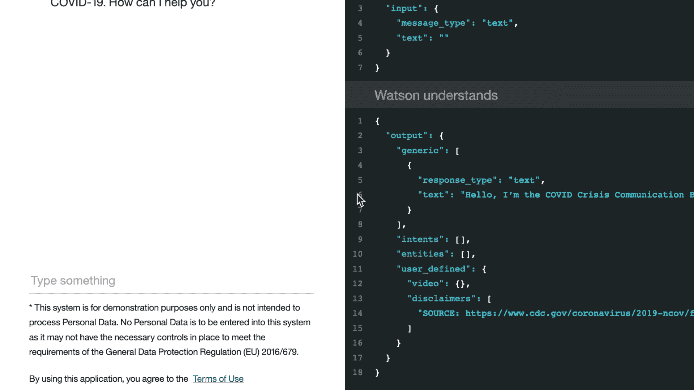

# 在网站上集成 COVID-19 危机通信聊天机器人

> 原文：[`developer.ibm.com/zh/tutorials/create-a-covid-19-chatbot-embedded-on-a-website/`](https://developer.ibm.com/zh/tutorials/create-a-covid-19-chatbot-embedded-on-a-website/)

本教程将引导您构建一个简单的 Node.js 应用程序并通过 Watson Assistant API 连接到 COVID-19（新型冠状病毒）聊天机器人。这些步骤来自 [assistant-simple 代码库](https://github.com/watson-developer-cloud/assistant-simple)，并针对 2020 年 Call for Code 挑战赛进行了改动。您可以使用本教程作为[新型冠状病毒挑战赛](https://developer.ibm.com/cn/callforcode/getstarted/covid-19/)项目的起始模板。

## 学习目标

在本教程中，您将：

1.  了解如何创建一个简单的 Node.js 应用程序。
2.  使用 IBM Watson Assistant API 将该应用程序连接到聊天机器人。
3.  在本地测试和运行该应用程序。
4.  在 IBM Cloud 上将该应用程序部署为 Cloud Foundry 应用程序。

下面是最终应用程序的演示：



## 前提条件

1.  注册一个 [IBM Cloud 帐户](https://www.ibm.com/account/reg/us-en/signup?formid=urx-42793&eventid=cfc-2020?cm_mmc=OSocial_Blog-_-Audience+Developer_Developer+Conversation-_-WW_WW-_-cfc-2020-ghub-starterkit-communication_ov75914&cm_mmca1=000039JL&cm_mmca2=10008917)。
2.  下载 [IBM Cloud CLI](https://cloud.ibm.com/docs/cli/index.html#overview)。您将使用 IBM Cloud CLI 把 Node.js 应用程序推送到云中。
3.  创建一个 [COVID-19 聊天机器人并将其连接到数据源](https://developer.ibm.com/zh/tutorials/crisis-communication-chatbot-watson-assistant-webhook-integration-discovery-covid-data/)。您需要从该聊天机器人处获取要在该 Node.js 应用程序中使用的凭证：

    *   登录到您的 IBM Cloud 帐户。
    *   转到 Resources 并打开您的 Watson Assistant 服务实例。
    *   您将被定向到 Watson Assistant 启动页面。单击 **Service Credentials** 以查看服务凭证。

        

    *   在配置以下应用程序时，您将使用这些凭证来填充 `.env` 文件。复制 JSON 并将其保存在某个地方，或者不要关闭这个窗口。

## 预估时间

完成本教程大约需要 30 分钟。

## 架构图

下图展示了网站聊天机器人回答 COVID-19 相关问题所使用的工作流程。


1.  用户访问一个配备了 COVID-19 聊天机器人的网站，并提出一个问题。
2.  Node.js Web 服务器调用在 IBM Cloud 中托管的 Watson Assistant 服务。
3.  Watson Assistant 利用自然语言理解和机器学习来提取用户问题的实体和意图。
4.  COVID-19 常见问题解答来源于美国疾病控制和预防中心（简称 CDC）的权威数据。
5.  Watson Assistant 调用基于 OpenWhisk 开源技术的 IBM Cloud Function。
6.  IBM Cloud Function 调用在 IBM Cloud 中运行的 Watson Discovery 服务。
7.  Watson Discovery 扫描新闻文章并提供相关文章作为响应。
8.  Watson Assistant 调用基于 OpenWhisk 开源技术的 IBM Cloud Function。
9.  IBM Cloud Function 调用 COVID-19 API 来获取统计信息。
10.  Watson Assistant 回复用户咨询。
11.  Node.js Web 服务器向用户显示聊天回复。

## 步骤

下面的步骤假设您已经创建了一个助手，导入了 COVID 技能，并获得了 Watson Assistant 服务的凭证。如果还没有，请先[完成本教程](https://developer.ibm.com/zh/tutorials/crisis-communication-chatbot-watson-assistant-webhook-integration-discovery-covid-data/)。

## 配置该应用程序

1.  [克隆代码库](https://github.com/Call-for-Code/Solution-Starter-Kit-Communication-2020)，然后使用 cd 命令进入 `starter-kit/covid-simple`。

2.  将 *.env.example* 文件复制到一个名为 *.env* 的文件中。

    ```
     cp .env.example .env 
    ```

3.  打开 *.env* 文件，并添加在上一步中获得的服务凭证。

    下面的示例 *.env* 文件配置了在美国东部地区托管的 Watson Assistant 服务实例的 `apikey` 和 `url`：

    ```
     ASSISTANT_IAM_APIKEY=X4rbi8vwZmKpXfowaS3GAsA7vdy17Qhxxxxxxxx
     ASSISTANT_URL=https://gateway-wdc.watsonplatform.net/assistant/api 
    ```

    *   如果您的服务实例使用 `username` 和 `password` 凭证，那么向 *.env* 文件中添加 `ASSISTANT_USERNAME` 和 `ASSISTANT_PASSWORD` 变量。

        下面的示例 *.env* 文件配置了在美国南部地区托管的 Watson Assistant 服务实例的 `username`、`password` 和 `url`：

        ```
        ASSISTANT_USERNAME=522be-7b41-ab44-dec3-xxxxxxxx
        ASSISTANT_PASSWORD=A4Z5BdGENxxxx
        ASSISTANT_URL=https://gateway.watsonplatform.net/assistant/api 
        ```

    *   但是，如果您的凭证包含一个 IAM API 密钥，那么将 `apikey` 和 `url` 复制到相关字段。

        ```
         {
            "apikey": "ca2905e6-7b5d-4408-9192-xxxxxxxx",
            "iam_apikey_description": "Auto generated apikey during resource-key ...",
            "iam_apikey_name": "auto-generated-apikey-62b71334-3ae3-4609-xxxxxxxx",
            "iam_role_crn": "crn:v1:bluemix:public:iam::::serviceRole:Manager",
            "iam_serviceid_crn": "crn:v1:bluemix:public:iam...",
            "url": "https://gateway-syd.watsonplatform.net/assistant/api"
          } 
        ```

        ```
        ASSISTANT_IAM_APIKEY=ca2905e6-7b5d-4408-9192-xxxxxxxx 
        ```

4.  将 `ASSISTANT_ID` 添加到前面的属性中：

    ```
     ASSISTANT_ID=522be-7b41-ab44-dec3-xxxxxxxx 
    ```

## 在本地运行

1.  安装依赖项：

    ```
     npm install 
    ```

2.  运行该应用程序：

    ```
     npm start 
    ```

3.  在浏览器中输入 `localhost:3000` 来查看该应用程序。

## 作为 Cloud Foundry 应用程序部署到 IBM Cloud

1.  使用 [IBM Cloud CLI](https://cloud.ibm.com/docs/cli/index.html#overview) 登录到 IBM Cloud：

    ```
     ibmcloud login 
    ```

2.  确定目标 Cloud Foundry 组织和空间：

    ```
     ibmcloud target --cf 
    ```

3.  编辑 *manifest.yml* 文件。将 **name** 字段更改为某个唯一值。
    例如 `- name: covid-assistant-simple-yourname`。

4.  部署该应用程序

    ```
     ibmcloud app push 
    ```

5.  通过应用程序 URL 来在线查看该应用程序。例如 `covid-assistant-simple-yourname.mybluemix.net`。

## 迎战新冠状病毒

现在，您已了解如何使用 Watson Assistant 构建一个聊天机器人以及如何在 IBM Cloud 上构建一个网站以便用户与聊天机器人进行互动。您可以在[官方文档](https://cloud.ibm.com/docs/services/assistant?topic=assistant-sample-apps)中找到一些其他 Watson Assistant 样本应用程序。

现在轮到您使用这些技术来大展拳脚，帮助应对新冠疫情，并通过接受[新型冠状病毒挑战赛](https://developer.ibm.com/cn/callforcode/getstarted/covid-19/)来为这次疫情做贡献。

本文翻译自：[Integrate a COVID-19 crisis communication chatbot on a website](https://developer.ibm.com/tutorials/create-a-covid-19-chatbot-embedded-on-a-website/)（2020-03-27）