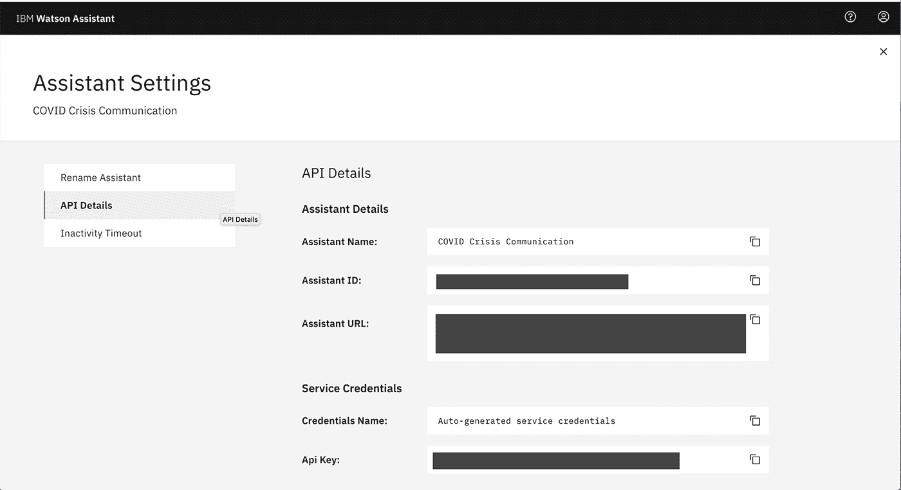
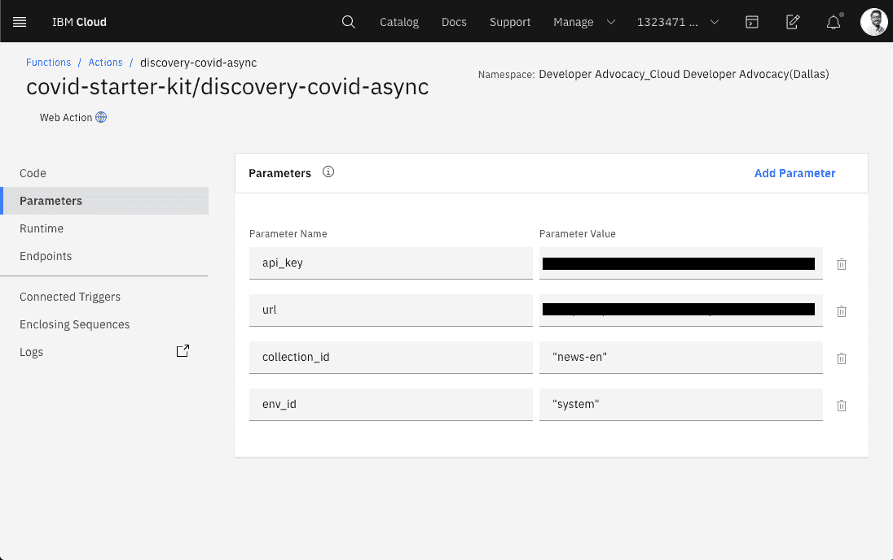

# 创建危机通信聊天机器人并连接到新闻和 COVID-19 数据源

> 原文：[`developer.ibm.com/zh/tutorials/crisis-communication-chatbot-watson-assistant-webhook-integration-discovery-covid-data/`](https://developer.ibm.com/zh/tutorials/crisis-communication-chatbot-watson-assistant-webhook-integration-discovery-covid-data/)

在危机时期，聊天机器人可以帮助人们快速找到所需的关键问题的答案。在像 COVID-19 这样的流行病期间，人们可能会尝试寻找有关检测、症状、社区响应和其他资源的基本信息。

本教程向您展示如何使用 IBM® Watson™ Assistant 创建危机通信聊天机器人，以及如何向 Watson Assistant 添加 webhook，以使用 Watson Discovery 和 COVID-19 API 来查询动态数据。

### 学习目标

在本教程中，您将学习以下内容：

*   配置 Watson Assistant 的实例
*   向您的 Watson Assistant 实例添加对话技能
*   将您的 Watson Assistant 与 Watson Discovery 相连接
*   创建 Cloud Functions
*   通过 Watson Assistant webhook 集成数据源

### 前提条件

注册一个 [IBM Cloud](https://www.ibm.com/account/reg/us-en/signup?formid=urx-42793&eventid=cfc-2020?cm_mmc=OSocial_Blog-_-Audience+Developer_Developer+Conversation-_-WW_WW-_-cfc-2020-ghub-starterkit-communication_ov75914&cm_mmca1=000039JL&cm_mmca2=10008917&cm_sp=ibmdev-_-developer-tutorials-_-cloudreg) 帐户。

[获得代码](https://github.com/Call-for-Code/Solution-Starter-Kit-Communication-2020)

### 预估时间

完成本教程大约需要 40 分钟。

## 通过设置 Watson Assistant 实例来创建您的聊天机器人

我们向您展示了如何使用 Watson Assistant 创建聊天机器人。利用 Watson Assistant 这款工具，您能够在任何应用程序、设备或通道中构建对话界面。

1.  在 [IBM Cloud Catalog](https://cloud.ibm.com/catalog/services/watson-assistant?cm_sp=ibmdev-_-developer-tutorials-_-cloudreg) 中，导航至 Services，并配置 **Watson Assistant** 的实例。

    

2.  启动 Watson Assistant 服务。

3.  单击 **Create Assistant**，并遵循这些[详细说明](https://cloud.ibm.com/docs/assistant?topic=assistant-assistant-add)了解如何创建一个助手。

    

4.  将 Watson Assistance 实例命名为 **COVID Crisis Communication**。

    

5.  针对这个助手单击 **Add dialog skill**。如果您有疑问，可[参阅文档](https://cloud.ibm.com/docs/assistant?topic=assistant-skill-dialog-add)。

    

    单击 **Import Skill > Choose JSON file**，然后导入 [`Covid Json`](https://github.com/Call-for-Code/Solution-Starter-Kit-Communication-2020/blob/master/starter-kit/assistant/skill-CDC-COVID-FAQ.json) 文件。

    

6.  返回至 All Assistants 页面。在操作菜单 ( **`⋮`** ) 中单击 **Settings**。

    

7.  在 Settings 选项卡上，单击左侧的 **API Details**，记录 `Assistant ID` 和 `API Key` 以供将来使用。

    

8.  返回至您的对话技能，单击侧边的 **Preview Link** 按钮，获取用于测试和验证您的助手的链接。

    

9.  向 Watson Assistant 聊天机器人提出一些有关 COVID-19 的问题。

    

## 将您的聊天机器人与数据源集成

既然您已经创建了启用 Watson Assistant 的聊天机器人，现在就需要将它连接到数据源。下一部分将向您展示如何通过将 webhook 添加到 Watson Assistant 来查询动态数据。

我们的危机通信聊天机器人使用两个不同的数据源：

*   [Watson Discovery](https://www.ibm.com/cloud/watson-discovery)
*   [COVID-19 API](https://covid19api.com/)

### 定义 webhook

首先，让我们看一下 webhook 的作用。*webhook* 是一种机制，支持您根据程序中发生的事项调出到外部程序。 在用于对话技能时，当助手处理启用了 webhook 的节点时，就会触发 webhook。webhook 会收集您在对话期间指定的数据或从用户收集的数据，并将其保存在上下文变量中。

它将数据作为 HTTP POST 请求的一部分发送到您在 webhook 定义中指定的 URL。接收 webhook 的 URL 是侦听方。它使用您在 webhook 定义中指定的传递给它的信息来执行预定义的操作，并且可以选择返回响应。

### 利用 Watson Discovery 获取新闻信息

1.  从您的 IBM Cloud 帐户转至 Watson Discovery。

    

2.  通过单击 **Create** 创建新的精简服务。

    

3.  记录 API 密钥和 URL。在接下来的步骤中需要这些信息。

    

4.  打开 Watson Discovery NEWS 服务，该服务是由 Watson Discovery 团队更新和维护的预填充发现数据集。

    

5.  从右上角打开 API 选项卡。记录 Collection ID 和 Environment ID。

    

### 创建 Cloud Functions

1.  在 IBM Cloud Catalog 中，转至 [IBM Cloud Functions](https://cloud.ibm.com/functions/?cm_sp=ibmdev-_-developer-tutorials-_-cloudreg)。

2.  单击 **Start Creating**。

    

3.  选择 **Create Action**。

    

4.  命名您的操作。从 Runtime 下拉列表中选择 **Node.js 10**。

    

5.  将代码替换为 [action/covid-webhook.js](https://github.com/Call-for-Code/Solution-Starter-Kit-Communication-2020/blob/master/starter-kit/webhook/action/covid-webhook.js)

    

6.  我们的代码具有两个主要部分。我们根据函数调用中发送的参数来决定是调用 COVID-19 API 还是 Watson Discovery。如果设置了 `type=api` 的查询参数，那么在[摘要端点](https://api.covid19api.com/summary)上调用 COVID-19 api。

    将采用以下格式返回数据：

    ```
     {
       Countries: [
         {
           Country: "",
           Slug: "",
           NewConfirmed: 0,
           TotalConfirmed: 0,
           NewDeaths: 0,
           TotalDeaths: 0,
           NewRecovered: 0,
           TotalRecovered: 0
         },
         {
           Country: " Azerbaijan",
           Slug: "-azerbaijan",
           NewConfirmed: 0,
           TotalConfirmed: 0,
           NewDeaths: 0,
           TotalDeaths: 0,
           NewRecovered: 0,
           TotalRecovered: 0
         },
         ...
       ]
     } 
    ```

7.  然后，您可以分析每个国家或地区的摘要列表，并进行汇总以获得合并的统计信息。如果选择了特定的国家或地区，那么可以在摘要响应中查找该国家或地区，然后返回该国家或地区的状态。

    例如，下面显示了 `type=api` 和 `country=US` 的响应。

    ```
     {
       "result": "Total Cases: 65778\nTotal Deaths: 942\nTotal Recovered: 361\n\nSource: Johns Hopkins CSSE"
     } 
    ```

8.  如果要调用 Discovery 服务，那么需要设置一些参数，使您可以调用启用了 IAM 的服务。单击左侧的 **Parameters** 选项卡。添加以下参数：`api_key`、`url`、`collection_id` 和 `env_id`。这些是您在前面的步骤中记录的来自 Watson Discovery 服务的值。

    

9.  将操作作为一项 Web 操作来启用。为此，请选择左侧的 **Endpoints** 选项卡。单击 **Enable as Web Action** 旁边的复选框。

    

10.  记录 HTTP URL。将它用作为您的助手的 webhook。您必须在此 URL 的末尾添加 `.json` 才能使其像 webhook 一样工作。

    

### 通过 Watson Assistant webhook 集成数据源

有关如何通过 webhook 集成数据源的详细说明，请查看我们的文档：[通过 Watson Assistant 进行编程调用](https://cloud.ibm.com/docs/assistant?topic=assistant-dialog-webhooks)。

以下是将 webhook 添加到 COVID-19 聊天机器人的具体步骤。

1.  启动您先前创建的 COVID-19 助手。通过您的 IBM Cloud 帐户，可在 Services > IBM Watson Assistant 下找到该助手。

    

2.  单击左侧的 **Options**。

    

3.  单击 **Webhooks** 选项卡。在 URL 文本框中，粘贴 Cloud Funciton 步骤中的 URL。确保在 URL 的末尾添加 `.json`。

    

4.  选择左侧导航中的 **Dialog**。

    

5.  打开要添加 webhook 调用的任何对话节点。

6.  在选择节点后，单击 **Customize**。

    

7.  通过在 Webhooks 部分中将开关按钮移至 **On** 来启用您的 webhook。单击 **Save**。

    

8.  添加您的 webhook 需要的任何参数。这些参数将作为查询参数发送。

    

9.  通过转至 Try It 选项卡并启动一个调用 webhook 的对话，测试您的 webhook 集成是否正常工作。

    

您可以轻松地使用 webhook 授权 Watson Assistant 访问许多外部 API 和数据库。

## 后续步骤

既然您已知道如何创建一个 COVID-19 聊天机器人并将其连接到 Watson Discovery 和 COVID-19 API，您还可以采用一些不同的集成路径。以下教程向您展示如何将此聊天机器人与 Slack、简单的 Web 应用程序或 Node-RED 仪表板相集成。

*   [在网站上集成 COVID-19 危机通信聊天机器人](https://developer.ibm.com/zh/tutorials/tutorials/create-a-covid-19-chatbot-embedded-on-a-website/)
*   [将您的 COVID-19 聊天机器人与 Slack 相集成](https://developer.ibm.com/zh/tutorials/create-crisis-communication-chatbot-integrate-slack/)
*   [将您的 COVID-19 聊天机器人与 Node-RED 相集成以启用语音命令](https://developer.ibm.com/zh/tutorials/create-a-voice-enabled-covid-19-chatbot-using-node-red/)

## 迎战 COVID-19

您现在已知道如何使用 Watson Assistant 构建聊天机器人，并将其连接到 Watson Discovery 和 COVID-19 API 数据源，从而及时地提供有关这一流行病的信息。接下来就轮到您使用这些技术来帮助应对这一流行病，并通过接受 [COVID-19 挑战赛](https://developer.ibm.com/cn/callforcode/getstarted/covid-19/)而有所作为！

本文翻译自：[Create a crisis communication chatbot and connect it to news and COVID-19 data sources](https://developer.ibm.com/tutorials/crisis-communication-chatbot-watson-assistant-webhook-integration-discovery-covid-data/)（2020-03-27）