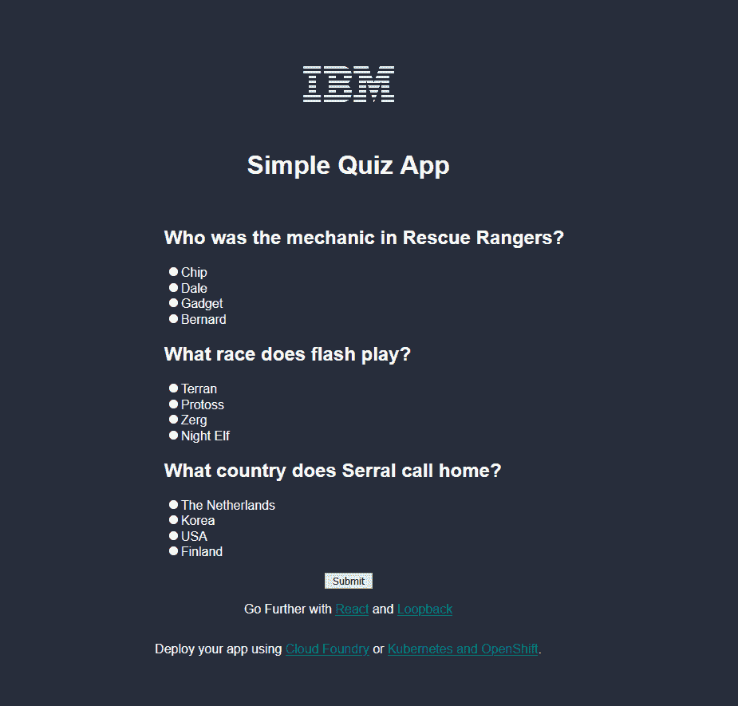
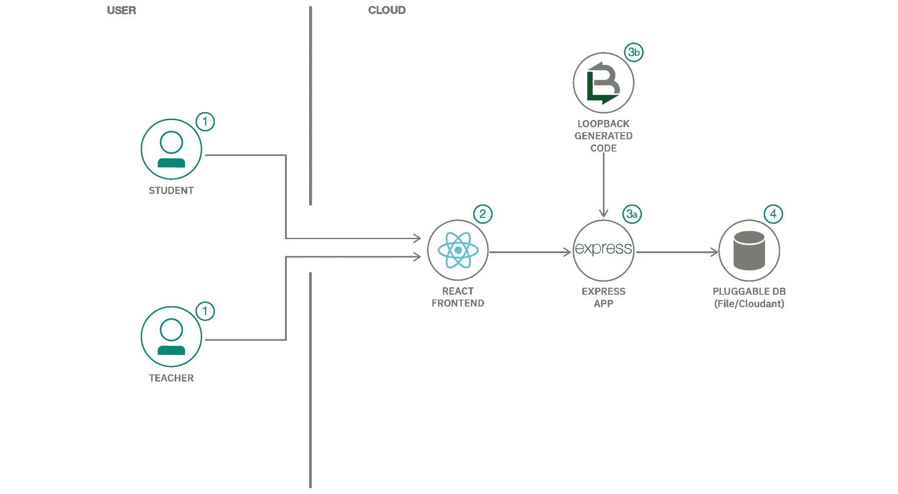
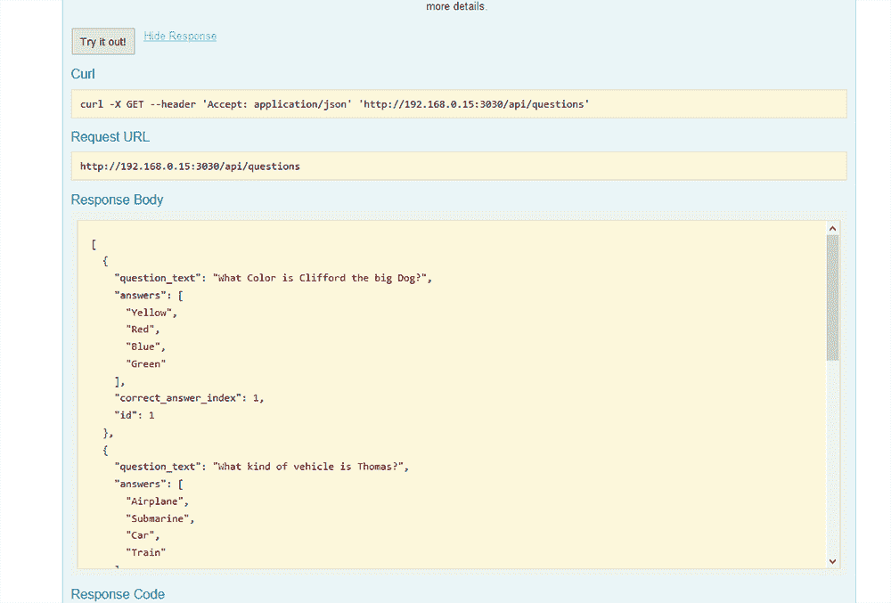
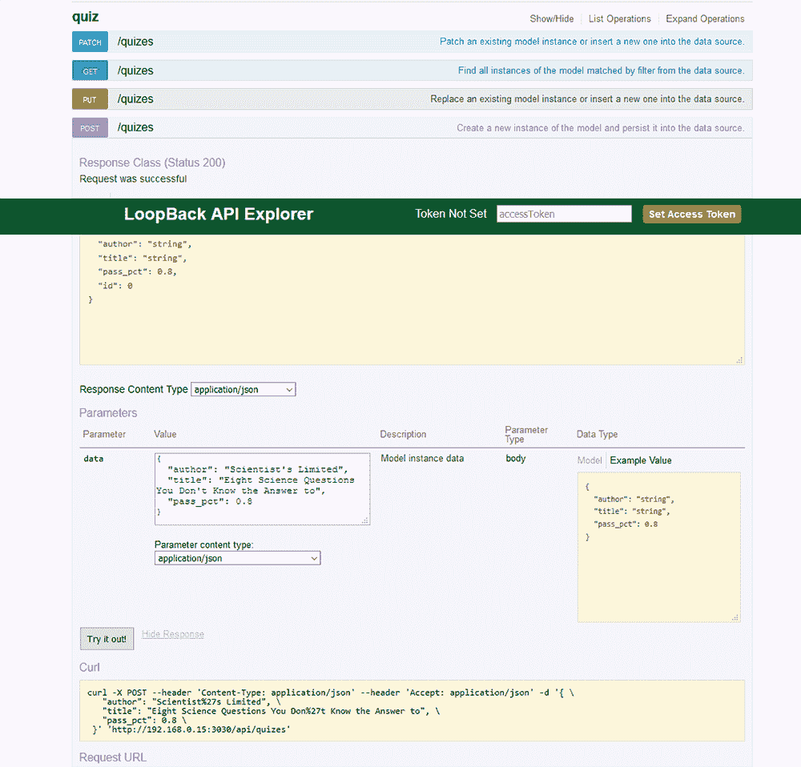
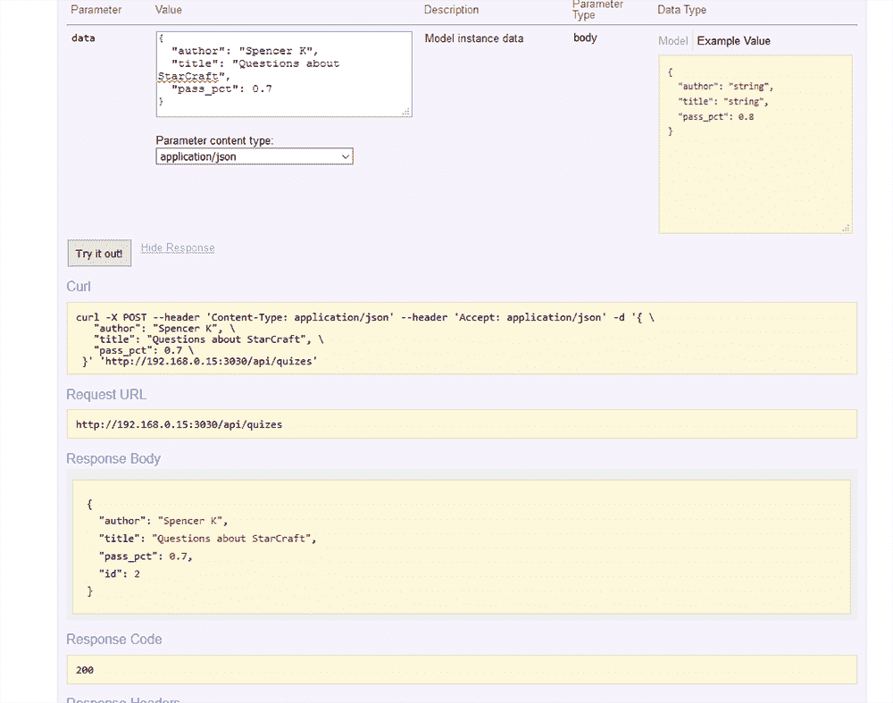

# 创建一个评估在线学习情况的测试应用

> 原文：[`developer.ibm.com/zh/tutorials/cfc-starter-kit-quiz-app-example/`](https://developer.ibm.com/zh/tutorials/cfc-starter-kit-quiz-app-example/)

随着人们为应对 COVID-19 疫情危机而采用线上学习和协作方式，开发者需要构建微服务来支持远程学习。在学习过程中，讲师需要能够评估学生对课程材料的理解情况。

本教程向您展示如何构建一个简单的测验应用来评估学习者的理解情况。该应用的主要优点就是它的灵活性：该入门工具包可以轻松地应用于短文应用、评分应用或其他教育工具。

Loopback 是一个开源工具，可为您的应用程序快速构建数据 API。无论您的特定应用程序的用途如何，Loopback 都能够让您快速编写应用程序逻辑，而不是数据处理代码。



您可以在随附的 [GitHub 代码库](https://github.com/Call-for-Code/cfc-covid-19-quiz-app)中找到本教程的代码和相关文件。

## 学习目标

完成本教程，您将学习如何创建一个简单的示例测验应用程序，该程序结合使用 Loopback 生成的 Express 应用和 React 前端。

## 前提条件

此示例的核心是从 Loopback 实用程序*生成的代码*。为清楚起见，我们使用了现已弃用的 Loopback 库 V3.0。这使应用更易于启动，但是您应该考虑升级到 Loopback V4 以获取最新功能和安全更新。

## 预估时间

完成本教程大约需要 30 分钟。

## 架构图



1.  用户导航到该站点。
2.  向用户呈现一个网站和一个 React 前端。
3.  (a) 用户在 Express 应用中执行操作。(b) LoopBack 生成的代码在 Express 应用中执行必需的任务。
4.  将更改保存在 PluggableDB 中。

## 1\. 设置您的环境

为充分利用该入门工具包，您应该考虑创建自己的 Loopback 应用。[速度超级快！（观看 YouTube 视频）](https://www.youtube.com/watch?v=iOMD27DjuO4)

但是，要启动此应用，应使用以下步骤。（**注意**：要使用预先创建的数据和 React 构建，可参阅下面的快速入门说明）。

1.  运行以下命令。

    ```
    npm install
    npm serve 
    ```

2.  在启动 API 后，导航至位于 [`localhost:3000/explorer`](https://localhost:3000/explorer) 处的 Swagger API 资源管理器。在这里，您可以立即开始将数据添加到 API 中。

    

3.  使用此 JSON blob 创建测验：

    ```
    {
     "author": "Scientist's Limited",
     "title": "Eight Science Questions You Don't Know the Answer to",
     "pass_pct": 0.8
    } 
    ```

    

4.  使用此 JSON blob 创建问题：

    ```
    {
      "question_text": "Which immobile ground unit has the longest range?",
      "answers": [
        "Siege Tank",
        "Spore Colony",
        "Photon Cannon",
        "Bunker (Marines"
      ],
      "correct_answer_index": 0,
      "quizId": 1
    } 
    ```

    

## 2\. 创建应用前端

在用户界面的 [React](https://reactjs.org/) 中对应用前端进行编码。如果您没有 React 使用经验，或者想要使用更简单的方法，那么可以使用 [Bootstrap](https://getbootstrap.com/) 和 [jQuery](https://jquery.com/) 等工具实现类似的结果。前端代码被编译一次，然后由 Loopback 生成的 Express 应用提供服务。

要构建和安装前端代码，可运行以下命令：

```
cd frontend
npm install
SKIP_PREFLIGHT_CHECK=true npm run build
# this creates a build in build/
rm -fr ../public/*
cp -r build/* ../public/ 
```

### 3\. 在 IBM Cloud 上部署

由于这是标准的 Express 应用程序，因此您可以使用 Cloud Foundry 或 Kubernetes 进行托管。 这里包含了 Dockerfile。

*   要使用 Cloud Foundry 进行部署，可遵循[这些步骤](https://github.com/IBM/nodejs-express-app#ibm-cloud-developer-tools)进行操作。

*   要使用 Kubernetes 进行部署，可使用 `deployment/deploy.yaml` 中包含的清单。**注意**：如果使用的是 Ingress，则必须使用集群的 Ingress 子域填充 Ingress 主机名。例如：

```
```
$ ibmcloud ks cluster get --cluster nibz-falco-test-2 | grep Ingress
Ingress Subdomain:              nibz-falco-test-2-5290c8c8e5797924dc1ad5d1b85b37c0-0000.us-east.containers.appdomain.cloud
``` 
```

## 快速入门说明

要跳过前面的所有步骤并*极*快速地开始操作（尽管我们希望您先学习前面的步骤！），您可以使用预加载的数据和前端代码的预构建版本：

```
```
npm install
cp examples/data.db data.db
cp -r examples/public/* public/
npm start
``` 
```

## 结束语

在本教程中，您学习了如何快速创建和配置应用，以评估学生对教学材料的吸收程度。您还看到了使测验应用适应其他教育要求的过程非常简单。您拥有创建简单而灵活的工具所需的一切，可以为从未有过在线学习的老师和学生提供帮助。

本文翻译自：[Create a quiz app to assess online learning](https://developer.ibm.com/tutorials/cfc-starter-kit-quiz-app-example/)（2020-03-27）