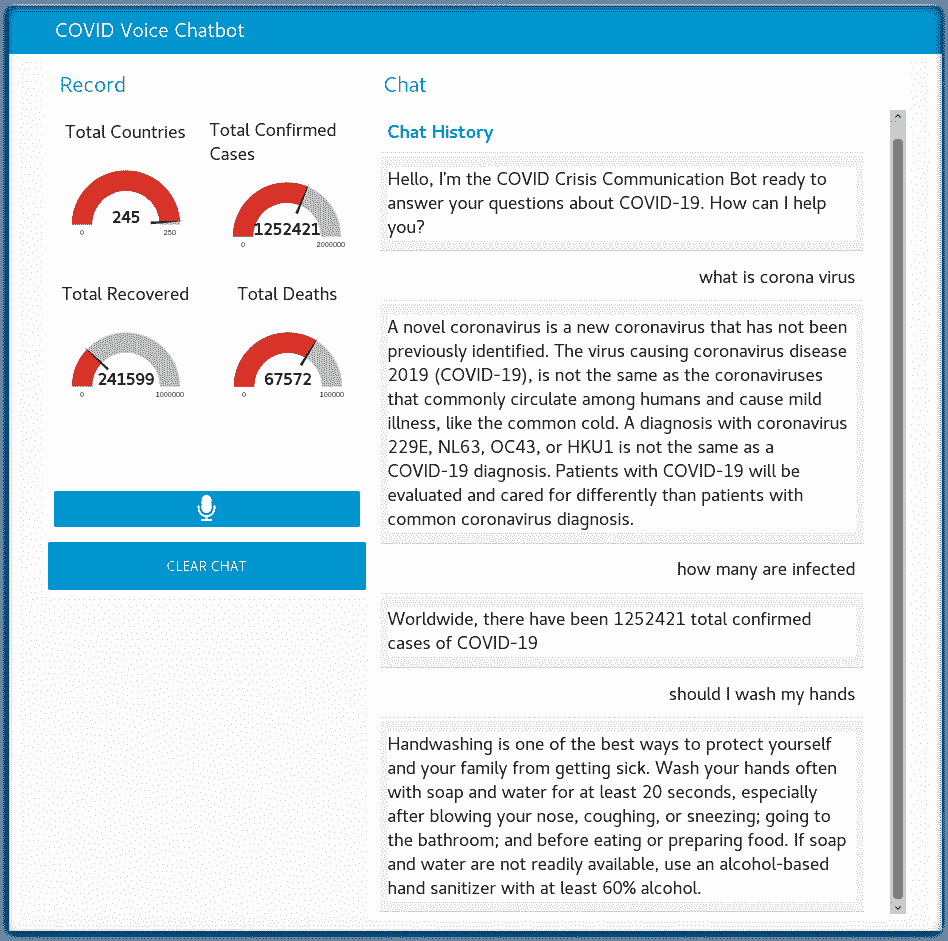
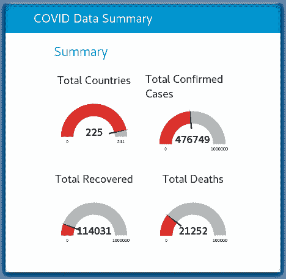

# 使用 Node-RED 创建支持语音的 COVID-19 聊天机器人

> 原文：[`developer.ibm.com/zh/tutorials/create-a-voice-enabled-covid-19-chatbot-using-node-red/`](https://developer.ibm.com/zh/tutorials/create-a-voice-enabled-covid-19-chatbot-using-node-red/)

学习如何使用 Node-RED 以及 IBM® Watson™ Assistant、Watson Speech to Text 和 Watson Text to Speech 服务来创建支持语音的聊天机器人。

## 学习目标

在本教程中，您将学习以下内容：

*   了解 Node-RED，知道如何在本地和 IBM Cloud 上进行安装
*   探索 node-red-node-watson Node-RED 节点
*   导入和部署 Watson Assistant 聊天机器人示例
*   构建 Call for Code COVID-19 危机通信支持语音的聊天机器人解决方案

## 前提条件

*   [在本地](https://nodered.org/docs/getting-started/)安装 Node-RED，或者在 IBM Cloud 中[创建 Node-RED Starter 应用程序](https://developer.ibm.com/tutorials/how-to-create-a-node-red-starter-application/)。

    在安装 Node-RED 之后，添加以下依赖项：

    ```
     npm install node-red-contrib-browser-utils node-red-dashboard node-red-node-watson node-red-contrib-play-audio 
    ```

*   创建 Watson Assistant COVID-19 危机通信聊天机器人。[遵循说明进行操作](https://developer.ibm.com/zh/tutorials/crisis-communication-chatbot-watson-assistant-webhook-integration-discovery-covid-data/)。

## 预估时间

完成本教程大约需要 30 分钟。

## 架构图

下图显示了 Node-RED 聊天机器人的工作流程，该聊天机器人可回答有关 COVID-19 的问题。


1.  用户使用 COVID-19 聊天机器人访问支持语音的 Node-RED 网站，并提出一个问题。
2.  Node-RED 将语音记录成 .wav 文件，并调用 IBM Cloud 中托管的 Watson Speech to Text 服务。
3.  Watson Speech to Text 使用机器学习来解码用户的语音。
4.  Watson Speech to Text 使用 COVID-19 问题的脚本来回复，Node-RED 则调用在 IBM Cloud 中托管的 Watson Assistant。
5.  Watson Assistant 使用自然语言理解问题，使用机器学习功能提取用户问题中的实体和意图。
6.  从美国疾病控制与预防中心的可靠数据中搜寻 COVID-19 常见问题解答信息。
7.  Watson Assistant 调用基于 OpenWhisk 开源技术的 IBM Cloud Function。
8.  IBM Cloud Function 调用在 IBM Cloud 中运行的 Watson Discovery。
9.  Watson Discovery 扫描新闻文章，并以相关文章进行响应。
10.  Watson Assistant 调用基于 OpenWhisk 开源技术的 IBM Cloud Function。
11.  IBM Cloud Function 调用 COVID-19 API 以获取统计信息。
12.  Watson Assistant 答复用户查询，Node-RED 将文本脚本发送到 Watson Text to Speech。
13.  Watson Text to Speech 使用用户语言对消息进行编码。
14.  Node-RED 向用户播放聊天回答 .wav 文件。
15.  用户聆听聊天回答。

## 步骤

### 了解 Node-RED

[Node-RED](http://nodered.org) 是一种开源编程工具，能够以新颖有趣的方式将硬件设备、API 和在线服务连接在一起。它提供了一个基于浏览器的编辑器，使您可以轻松地使用选用板中的各种节点将不同的流连接在一起，只需单击即可将其部署到运行时。

### 安装 Node-RED 依赖节点

在安装 Node-RED 之后，为学习本教程需要添加的依赖项：

*   [node-red-node-ui-microphone](https://flows.nodered.org/node/node-red-node-ui-microphone)
*   [node-red-dashboard](https://flows.nodered.org/node/node-red-dashboard)
*   [node-red-node-watson](https://flows.nodered.org/node/node-red-node-watson)
*   [node-red-contrib-play-audio](https://flows.nodered.org/node/node-red-contrib-play-audio)

```
npm install node-red-node-ui-microphone node-red-dashboard node-red-node-watson node-red-contrib-play-audio 
```

### 探索 node-red-node-watson Node-RED 节点

[node-red-node-watson GitHub 代码库](https://github.com/watson-developer-cloud/node-red-node-watson)包括用于 IBM Watson 服务的 Node-RED 节点的集合。该软件包可将以下节点添加到您的 Node-RED 选用板中。

*   Assistant：在应用程序中添加对话功能
*   Discovery：列出为 Watson Discovery 创建的环境
*   Language Identification：检测文本中使用的语言
*   Language Translator：将文本从一种语言翻译为另一种语言
*   Natural Language Classifier：使用机器学习算法为短文本输入返回最匹配的预定义类
*   Natural Language Understanding：分析文本，从概念、实体和关键字等内容中提取元数据
*   Personality Insights：使用语言分析从文本推断出认知和社交特征
*   Speech To Text：将包含语音的音频转换为文本
*   Text To Speech：将文本转换为语音
*   Tone Analyzer：发现、理解和修改文本中的语言音调
*   Visual Recognition：分析图像的视觉外观以了解其内容

### 导入和部署 COVID-19 危机通信聊天机器人示例

既然您已经安装了 Node-RED 依赖项，Watson 节点现在即可用于集成 Watson AI 服务。让我们构建一个支持语音的聊天机器人示例，该示例将使用 Watson Assistant、Watson Speech to Text 和 Watson Text to Speech。

1.  从 Call for Code 入门工具包中导入[流](https://github.com/Call-for-Code/Solution-Starter-Kit-Communication-2020/blob/master/starter-kit/node-red/flows/Node-RED-Voice-Enabled-Chatbot.json)。

2.  部署流。

    

### 在 IBM Cloud 上创建 Watson 服务

在成功执行流之前，您必须为 Watson Assistant 和 Watson Speech 节点配置新的服务实例和 API 密钥。

#### 创建 Watson Assistant 实例

1.  如果您尚未创建 [Watson Assistant 实例](https://cloud.ibm.com/catalog/services/watson-assistant?cm_sp=ibmdev-_-developer-tutorials-_-cloudreg)，现在就创建一个。

    

2.  [点击学习教程](https://www.ibm.com/developerworks/cn/cognitive/library/crisis-communication-chatbot-watson-assistant-webhook-integration-discovery-covid-data/index.html)为 COVID-19 配置一个 Watson Assistant 聊天机器人。

#### 创建 Watson Speech to Text 服务实例

1.  从 IBM Cloud Catalog 创建一个 [Watson Speech to Text 服务实例](https://cloud.ibm.com/catalog/services/speech-to-text?cm_sp=ibmdev-_-developer-tutorials-_-cloudreg)。

2.  单击 **Create**。

    

    Node-RED Watson Speech to Text 节点需要此新实例的 apikey 凭证。

3.  在创建 Watson Speech to Text 服务之后，单击 **Service credentials** (下图 1)。
4.  单击 **View credentials** (下图 2) 折叠器。
5.  复制 **apikey** (下图 3) 以在下一部分中使用。

    

#### 创建 Watson Text to Speech 服务实例

从 IBM Cloud Catalog 创建一个 [Watson Text to Speech 服务](https://cloud.ibm.com/catalog/services/text-to-speec?cm_sp=ibmdev-_-developer-tutorials-_-cloudregh)实例。

1.  单击 **Create**。

    

    Node-RED Watson Text to Speech 节点需要用于此新实例的 `apikey` 凭证。

2.  在创建 Watson Text to Speech 服务之后，单击 **Service credentials** (下图 1)。
3.  单击 **View credentials** (下图 2) 折叠器。
4.  复制 **apikey** (下图 3) 以在下一部分中使用。

    

### 使用 API 密钥启用 Watson Speech 节点

1.  双击 **speech to text** 节点，粘贴来自 Watson Speech to Text 服务实例的 API 密钥。
2.  单击 **Done**。

    

3.  双击 **text to speech** 节点，粘贴来自 Watson Text to Speech 服务实例的 API 密钥。

4.  单击 **Done**。

    

### 使用 COVID-19 工作空间 ID 和 API 密钥启用 Watson Assistant 节点

1.  双击 **assistant** 节点，然后将 Skill ID 粘贴到 Workspace ID 字段中，并粘贴 Assistant 服务端点 URL 以及来自 Watson Assistant 服务实例的 API 密钥。

2.  单击 **Done**。

    

### 解析意图和调用 API

Watson Assistant 返回与您的问题有关的意图。

*   `Switch` 节点将两个意图路由到 `http request` 节点，以向外部数据源查询当前 COVID 统计信息。
*   `Function` 节点将摘要统计信息汇总起来，并构建一个要说的句子。

### 部署 Node-RED 流

要部署 Node-RED 流，可在您的 UI 中单击红色 **Deploy**。

### 与您的 COVID-19 危机聊天机器人交谈

要与您的聊天机器人交谈，可单击 **microphone** 输入选项卡，询问有关 COVID 的问题。



当有人提出问题时，后端的 Node-RED 流如下图：


### 构建 Node-RED COVID 统计信息仪表板

**彩蛋**：该流包括一个 Node-RED 仪表板，其中具有若干可显示 COVID-19 统计信息的测量仪表。



*   以小时为单位，Node-RED 流调用 [covid19api](https://api.covid19api.com/summary) 相关 API 收集动态 COVID-19 感染统计数据。
*   相应国家的数据被汇总并更新表格。

### 了解有关仪表板代码的更多信息

本教程包含以下 Node-RED 流。


`http request` 节点使用 [public Covid-19 API](https://api.covid19api.com/summary) 来检索所有受感染国家的每日信息。

以下是来自相关 API 的 JSON 对象样例：

```
{"Country":"US","Slug":"us","NewConfirmed":18058,"TotalConfirmed":83836,"NewDeaths":267,"TotalDeaths":1209,"NewRecovered":320,"TotalRecovered":681}, 
```

然后，每个 “function” 节点汇总确认病例总数、死亡总数、恢复总数和国家总数，并将结果发送到相应的 “gauge” 节点。

“function” 节点代码如下：

```
let totalConfirmedCase = 0;

msg.payload.Countries.map(function(line){
    totalConfirmedCase += line.TotalConfirmed;
});

msg.payload = totalConfirmedCase;

return msg; 
```

您可以扩展上面的仪表板，从而使其包含来自 [covid19api](https://api.covid19api.com/summary) 的数据、图表、表格等相关信息。

## 构建 Call for Code 危机通信解决方案！

既然您已经完成了本教程，现在就可以修改这些示例流和 Node-RED 仪表板，构建一个 [Call for Code COVID-19 危机通信](https://developer.ibm.com/cn/callforcode/getstarted/covid-19/)解决方案。

本文翻译自：[Create a voice-enabled COVID-19 chatbot using Node-RED](https://developer.ibm.com/tutorials/create-a-voice-enabled-covid-19-chatbot-using-node-red/)（2020-03-27）