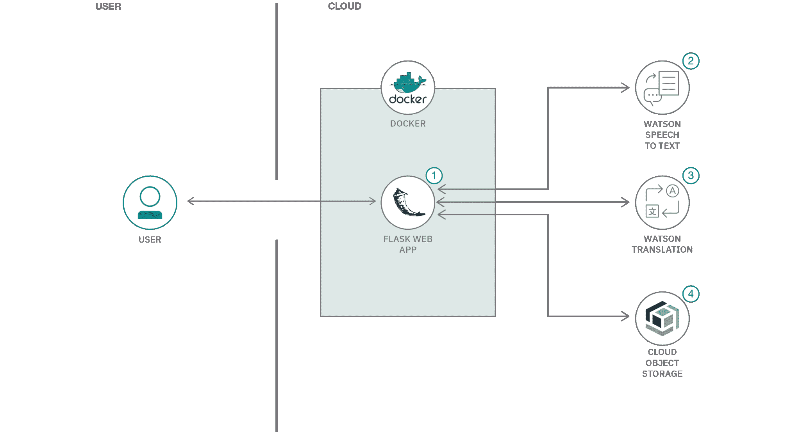

# 构建视频转录器服务

> 原文：[`developer.ibm.com/zh/tutorials/cfc-starter-kit-speech-to-text-app-example/`](https://developer.ibm.com/zh/tutorials/cfc-starter-kit-speech-to-text-app-example/)

在“在家学习”环境中，许多学生都喜欢上视频课程。视频课程是一种很好的学习方式，但有些学生或许适合其他学习方式，有些同学无法获得原始视频，那么讲师有时就需要提供笔记或指定的阅读材料。

冠状病毒和 COVID-19 大流行迅速增加了对所有类型在线教学材料的需求。您在本教程中构建的应用程序将使教师能够向使用视频和音频工具作为主要学习方式的学生提供额外的帮助。教师也可以很容易地为那些由于各种原因不能播放视频的学生提供书面指导。

本教程的代码和相关文件位于随附的 [GitHub 代码库](https://github.com/Call-for-Code/cfc-covid-19-video-transcriber)中。

## 学习目标

在本教程中，您将学习如何：

*   创建一个 Python 应用程序，用于通过 Watson Speech to Text 从教学视频中提取文本。
*   使用 Watson Language Translator 翻译文本，并将生成的转录文本存储在 IBM Cloud Object Storage 中。
*   创建一个 Vue.js 前端，让用户可以上传视频并接收所生成的转录文本。

## 前提条件

要完成本教程，您必须：

*   注册一个 [IBM Cloud](https://www.ibm.com/account/reg/us-en/signup?formid=urx-42793&eventid=cfc-2020?cm_mmc=OSocial_Blog-_-Audience+Developer_Developer+Conversation-_-WW_WW-_-cfc-2020-ghub-starterkit-education_ov75914&cm_mmca1=000039JL&cm_mmca2=10008917) 帐户。
*   安装 [`Python`](https://www.python.org/downloads/)。
*   安装 Python 打包工具 [`Pipenv`](https://pypi.org/project/pipenv/)。
*   安装 [`Node.js`](https://nodejs.org)。
*   安装 [`Yarn`](https://classic.yarnpkg.com/en/docs/install/)。

## 预估时间

完成本教程大约需要 30 分钟。

## 架构图



1.  用户浏览至站点，并上传一个视频文件。
2.  Watson Speech to Text 处理该音频并提取文本。
3.  （可选）Watson Translation 可以将该文本翻译成所需的语言。
4.  该应用程序将翻译后的文本作为文档存储在 Object Storage 中。

## 1\. 设置服务和 Object Storage

1.  登录到 [IBM Cloud](https://cloud.ibm.com?cm_sp=ibmdev-_-developer-tutorials-_-cloudreg) 并创建以下服务：

    *   [IBM Watson Speech to Text](https://www.ibm.com/cloud/watson-speech-to-text)
    *   [IBM Watson Language Translator](https://www.ibm.com/watson/services/language-translator/)
    *   [IBM Cloud Object Storage](https://www.ibm.com/cloud/object-storage)
2.  在项目根目录中创建一个 `.env` 文件，其中以环境变量形式包含以下服务凭证：

```
IAM_AUTHENTICATOR_STT=<api key for speech to text service>
IAM_AUTHENTICATOR_TRANSLATE=<api key for translation service>
LANGUAGE_TRANSLATOR_SERVICE=<translator service endpoint. e.g. https://api.eu-gb.language-translator.watson.cloud.ibm.com>
COS_API_KEY_ID=<cloud object storage api key>
COS_RESOURCE_CRN=<cloud object storage resource crn. e.g. crn:v1:bluemix:public:iam::::serviceRole:Writer>
COS_AUTH_ENDPOINT=<cloud object storage auth endpoint. e.g. https://iam.cloud.ibm.com/identity/token>
COS_ENDPOINT=<cloud object storage endpoint. e.g. https://s3.eu-gb.cloud-object-storage.appdomain.cloud>
COS_BUCKET_NAME=<cloud object storage bucket name. e.g. transcripts> 
```

## 2\. 安装并运行该应用程序

### 服务器

1.  如果还没有安装 [Python](https://www.python.org/downloads/) 和 [Pipenv](https://pypi.org/project/pipenv/)，请现在进行安装。

2.  从项目根目录中，下载项目依赖项：

    ```
     pipenv install 
    ```

3.  您可以使用一个 `manage.py` 文件来简化 Flask 应用程序的运行，并且无需配置环境变量即可运行该应用程序。要在本地运行该应用程序，请使用：

    ```
     python manage.py start 
    ```

`manage.py` 实用程序提供了多个适用于您的情况的运行命令：

*   `start`：通过 `gunicorn` 启动使用生产环境的服务器。
*   `run`：启动原生 Flask 开发服务器。这包括保存文件后的后端重新加载，并包含一个用于在浏览器中诊断运行时故障的 Werkzeug 堆栈跟踪调试器。
*   `livereload`：使用 `livereload` 包启动开发服务器。这包括后端重新加载以及动态前端浏览器重新加载。将会禁用 Werkzeug 堆栈跟踪调试器，仅在进行前端开发时才建议启用该调试器。
*   `debug`：启动原生 Flask 开发服务器，但已禁用原生重新加载器/跟踪器。这会保持公开调试端口，以便连接到 IDE（例如 PyCharm 的 `Attach to Local Process`）。

另外还提供了几个实用程序命令：

*   `build`：将项目目录中的 `.py` 文件编译为 `.pyc` 文件。
*   `test`：在项目的 `test` 目录中运行所有单元测试。

在浏览器中输入以下 URL 来运行服务器：`http://localhost:3000/`。

## 前端 UI

1.  如果您还没有安装 [`Node.js`](https://nodejs.org) 和 [`Yarn`](https://classic.yarnpkg.com/en/docs/install/)，请现在进行安装。

2.  在新终端中，切换到 `frontend` 目录并安装依赖项：

    ```
     cd frontend
     yarn install 
    ```

3.  启动前端应用程序：

    **针对开发环境进行编译和热重载**

    ```
     yarn serve 
    ```

    **针对生产环境进行编译和小型化**

    ```
     yarn build 
    ```

    **lint 和修订文件**

    ```
     yarn lint 
    ```

现在，在浏览器中输入以下 URL 来运行前端 UI：`http://localhost:8080/`。

## 3\. 部署该应用程序

以下指示信息适用于部署 Python Flask 服务器。要部署前端 UI，遵循 [Node.js 构建和部署教程](https://developer.ibm.com/node/getting-started-node-js-ibm-cloud/)。

### 部署到 IBM Cloud

通过首先克隆代码库，便可以[将此应用程序部署到 IBM Cloud](https://cloud.ibm.com/developer/appservice/starter-kits/python-flask-app?cm_sp=ibmdev-_-developer-tutorials-_-cloudreg) 或在本地构建。在该应用程序上线后，您就可以访问 `/health` 端点来构建云原生应用程序。

使用下面的按钮将该应用程序部署到 IBM Cloud。此选项会创建一个部署管道（配备了一个托管的 GitLab 项目和 DevOps 工具链）。您可以选择部署到 Cloud Foundry 或 Kubernetes 集群。[IBM Cloud DevOps](https://www.ibm.com/cloud/devops) 服务以一组工具集成的形式提供了工具链，这些工具链支持在 IBM Cloud 中执行开发、部署和操作任务。

 

### 在本地构建

要开始在本地构建该应用程序，您可以在本地运行该应用程序，也可以使用 [IBM Cloud Developer Tools](https://cloud.ibm.com/docs/cli?topic=cloud-cli-getting-started) 进行容器化，然后将其轻松部署到 IBM Cloud。

#### 原生应用程序开发

在安装并运行该应用程序时，上面的步骤 2 中涉及了原生应用程序开发。在浏览器中输入以下 URL 来运行该应用程序：`http://localhost:3000/`。

*   运行您的 [Swagger UI](http://swagger.io/swagger-ui/) 的位置：`/explorer`
*   运行您的 Swagger 定义 的位置：`/swagger/api`
*   运行状况端点：`/health`

可使用以下两个不同选项来调试 Flask 项目：

1.  运行 `python manage.py runserver` 以启动原生 Flask 开发服务器。该服务器随附了 Werkzeug 堆栈跟踪调试器，此调试器将在浏览器中显示运行时故障堆栈跟踪，能够在跟踪过程中随时检查对象。有关更多信息，请参阅 [Werkzeug 文档](http://werkzeug.pocoo.org/)。

2.  运行 `python manage.py debug` 以运行 Flask 开发服务器；此服务器公开了调试端口，但已关闭原生调试器/重新加载器。这会授予 IDE 的访问权，以便将自身连接到该进程（即，在 PyCharm 中使用 `Run` -> `Attach to Local Process`）。

您还可以使用 `scripts` 目录中的 Selenium UI 测试脚本来验证本地运行的应用程序的状态。

> **针对 Windows 用户的注意事项：**Windows 不支持 `gunicorn`。您可以在本地计算机上使用 `python manage.py run` 来启动服务器，也可以构建并启动 Dockerfile。

#### IBM Cloud Developer Tools

通过运行以下命令，在您的计算机上安装 [IBM Cloud Developer Tools](https://cloud.ibm.com/docs/cli?topic=cloud-cli-getting-started)：

```
curl -sL https://ibm.biz/idt-installer | bash 
```

通过运行以下命令，在 IBM Cloud 上创建一个应用程序：

```
ibmcloud dev create 
```

此时会创建和下载一个入门应用程序，其中包含本地开发和部署所必需的文件。

将使用 Docker 容器来编译该应用程序。要编译和运行该应用程序，请运行：

```
ibmcloud dev build
ibmcloud dev run 
```

此时会在本地启动该应用程序。准备好部署到 IBM Cloud on Cloud Foundry 或 Kubernetes 时，请运行以下命令之一：

```
ibmcloud dev deploy -t buildpack // to Cloud Foundry
ibmcloud dev deploy -t container // to K8s cluster 
```

您可以使用以下命令在本地构建和调试该应用程序：

```
ibmcloud dev build --debug
ibmcloud dev debug 
```

## 结束语

本教程向您展示了如何构建和部署一个可使用 Watson Speech to Text 来转录视频文件的应用程序。它还介绍了 Watson Language Translator 和 IBM Cloud Object Storage。您可以使用这个简单的应用程序作为基础，在此基础上添加一些更复杂的功能，从而创建一个稳定的学习应用程序，帮助讲师和学生改善他们的在线学习体验。

本文翻译自：[Build a video transcriber service](https://developer.ibm.com/tutorials/cfc-starter-kit-speech-to-text-app-example/)（2020-03-27）