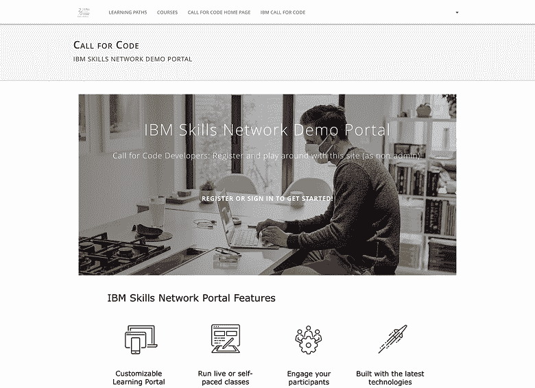
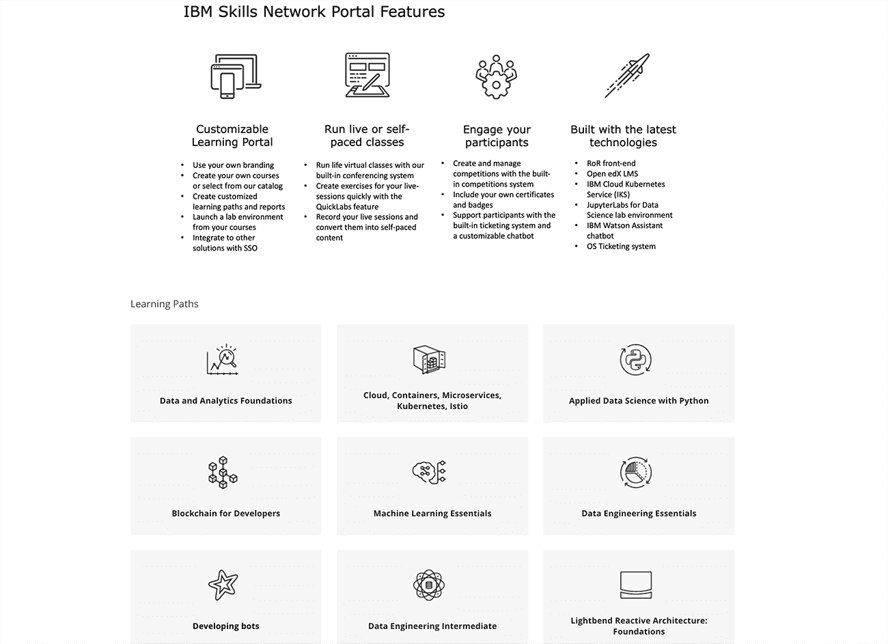

# 创建一个虚拟教室环境

> 原文：[`developer.ibm.com/zh/tutorials/cfc-starter-kit-skills-network-implementation/`](https://developer.ibm.com/zh/tutorials/cfc-starter-kit-skills-network-implementation/)

为了让讲师能够更轻松地与学生连线以便开展远程教育，在 2022 年 11 月之前，IBM 将允许您免费访问自己的 IBM Developer Skills Network 门户网站实例。

Skills Network 门户网站是属于您自己的在线学习环境。您可以根据自己受众（无论是年轻学生、技术人员还是任何专业团体）的需求来配置此门户网站。

查看[包含样本课程的交互式演示](https://callforcode.skillsnetwork.site/)。

## 学习目标

在本教程中，您将学习如何实现和配置自定义版本的 IBM Developer Skills Network 门户网站，以便开展在线教育。

## 前提条件

无。

## 预估时间

完成本教程中的任务大约需要 30 分钟。（可能需要几天时间才能获得新门户网站的访问权。）

## 步骤

要开始使用自己的 Skills Network 门户网站，请完成以下步骤。

### 1\. 填写表格

填写用于创建 IBM Developer Skills 门户网站实例的[申请表](https://developer.ibm.com/call-for-code-request-for-on-line-learning-portal/)。申请的处理时间不会超过 72 小时。您将收到一封电子邮件，其中提供了您需要执行的后续步骤。

*   Subdomain 字段是 URL 的一部分，位于 `skillsnetwork.site` 之前（例如 `my-site.skillsnetwork.site`）。所有 Skills Network 实例都遵循 `your-site-here.skillsnetwork.site` 模式。

*   将自动为您创建默认用户名、密码和 Skills Network 门户网站名称。生成的用户名将是名字和姓氏的组合，门户网站名称将与您为子域选择的名称相同。

*   首次登录时，系统会提示您更改默认密码。也可以从 Skills Network 门户网站的管理面板中更改门户网站名称和用户名。

### 2\. 配置门户网站

要查看管理面板并根据自己的需求来配置站点，可转到 `my-site.skillsnetwork.site/admin/settings/edit`，并将 `my-site` 替换为您的子域。注意以下功能：

*   **虚拟助手**：您可以在门户网站中集成 IBM Watson Assistant，以用于回答问题并提供帮助。转到 `my-site.skillsnetwork.site/admin/chatbot/edit` 并将 `my-site` 替换为您的子域。

*   **课程目录**：查找大量精选的 Skills Network 课程，并将这些课程添加到自己的门户网站中，以供学生学习。转到 my-site.skillsnetwork.site/admin/course_catalog 并将 `my-site` 替换为您的子域。

    

*   **博客帖子**：您可以创建博客帖子，而且您的受众可以看到这些博客帖子。可自己随意撰写任何主题！博客帖子很适合讨论一般的学习难题或者特定于您的受众的主题。在 Skills Network 知识库中查找[有关博客帖子的文章](https://support.skillsnetwork.site/knowledgebase/articles/1934698-enabling-and-using-the-blog-posts-feature)。要创建自己的博客帖子，请转到 `my-site.skillsnetwork.site/admin/blog_posts`，并将 `my-site` 替换为您的子域。

### 3\. 查找其他资源

IBM Developer Skills Network 拥有的文档库在不断扩大，可帮助您开始了解和执行特定的任务。

*   要开始创建自己的课程，请参阅 [How do I create a course on Studio?](https://support.skillsnetwork.site/knowledgebase/articles/1906603-how-do-i-create-a-course-on-studio)
*   要查看完整的 Skills Network 文档库，请参阅 [IBM Developer Skills Network 知识库](https://support.skillsnetwork.site/knowledgebase)。

## 结束语

在本教程中，您学习了如何申请、实现和配置 IBM Developer Skills Network 门户网站。现在，您可以根据自己的需求来自定义一个门户网站，并在其中填充现有课程或创建自己的课程。

本文翻译自：[Create a virtual classroom environment](https://developer.ibm.com/tutorials/cfc-starter-kit-skills-network-implementation/)（2020-03-27）