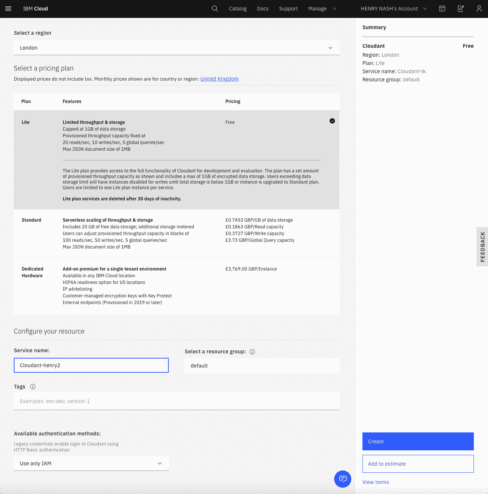
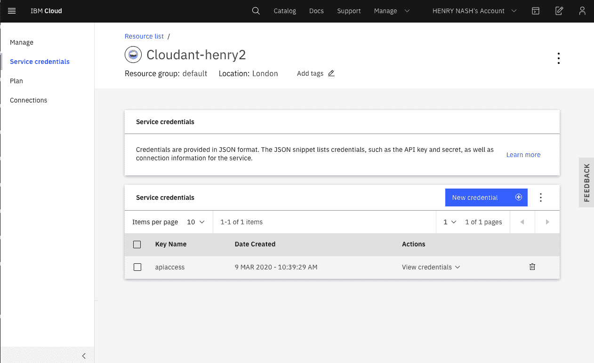

# 使用 Cloudant 部署 API 服务器和 CouchDB 实例创建气候评级系统

> 原文：[`developer.ibm.com/zh/tutorials/provision-a-couchdb-instance-using-cloudant-cfc-starter-kit-2/`](https://developer.ibm.com/zh/tutorials/provision-a-couchdb-instance-using-cloudant-cfc-starter-kit-2/)

虽然在住宅中转为使用清洁能源会对气候产生重大影响，但是商用方面的能源使用率往往高于家用方面（例如，住宅）。在商用能源消耗中，有很大一部分是用于制造我们所购买的产品。虽然我们购买的某些产品带有[能效等级](https://ec.europa.eu/info/energy-climate-change-environment/standards-tools-and-labels/products-labelling-rules-and-requirements/energy-label-and-ecodesign/about_en)，但是上面没有提供任何信息来告知最初用于制造产品的能源（即矿物能源和可再生能源）的数量和类型。如果我们能够比较不同制造商的产品所产生的气候影响（也许还包括对能源以外事物的影响比较，例如用水量），那该有多好啊！实际上是需要通过某种标签系统将综合气候影响等级呈现给消费者。 具体而言，就是对现有产品标签系统进行扩展，在其中包含综合气候影响等级 (CIR)，这样消费者就可以在销售点 (POS)（例如，实体店或网上店铺）看到这一信息。

这种气候影响等级最终可能包括：

*   使用时的能效（如今的许多产品都标有此项）
*   制造产品所用的能源（和能源组合），可表示为二氧化碳排放量
*   产品的预期寿命（便于更好地比较生产能源与使用能源）
*   制造产品时排出的其他（非二氧化碳）温室气体排放量（例如，从肥料）
*   其他消耗品（例如，制造产品时使用的水）
*   可回收性
*   可维修性（作为“Right to Repair”倡议的一部分）

设计此类标签系统的主要挑战之一是，它首先要为目标读者所理解，并且要全面涵盖其内容。我们设想最终将在产品上印刷此标签系统（与目前的能效标签或食品标签非常相似）。 但是，在此之前，我们希望支持使用智能手机进行 POS 扫描，将条形码转换为可见的等级。

最好还要包含对将产品运输到 POS 的过程中所产生的气候影响的评估。从定义上理解，很可能不会在产品上印刷这一信息（因为每个 POS 的影响可能不同），但是可以通过智能手机（知道位置）或在线查找并查看此信息。

创建这样的标签系统是一项庞大的全球性工作，这需要将许多底层组件、技术和协议融合在一起。如果要参加 2020 年 Call for Code 能源挑战赛，那么建议您尝试构建其中的部分组件，这样它们就可以结合在一起以形成这个综合标签系统。这些组件分为以下多个类别：

|  |  |
| --- | --- |
| 核心架构 | 使用提供的入门级工具包建立并运行支持 Consumer API 的基础系统。 |
| 等级显示 | 制定一些新颖的有趣方式来显示 CIR（例如，通过移动设备上的增强现实、在搜索引擎内以及在产品清单上）。 |
| 数据科学 | 确定将原始数据映射到所选标签的最佳方式？仅向消费者公布一串数字是行不通的，因为他们根本无法理解。如何尽可能精炼地概括原始数据？例如，将能源表示为产生的二氧化碳（即合并了能源量和可再生能源用量）或者将这二者分开，哪一种更好呢？如果某个产品的寿命较长但制造该产品所用的能源较多，那么它是否比寿命短但能耗低的产品更好？您可以将算法放在服务器端进行试验（即，将其输出包含在 API 返回的产品信息中），也可以在客户机端运行这些算法。另外，如何在提供大量产品的详细信息之前提供一些摘要数据（例如，按每个国家或地区的二氧化碳排放量进行排列）？ |
| 标签设计 | 进行试验（可能是用户测试），然后提出既全面又可为消费者所理解的标签设计。以食品标签和现有能源等级方面的经验为例。 |
| 其他设想 | 针对身为制造商、管理员和审核员的用户开发其他设想（和界面）。 |

如果要参加 2020 年 Call for Code 能源挑战赛，您需要了解本教程中的入门级工具包，以便建立并运行支持 Consumer API 的基础系统。也许您可以开发更好的架构？也许您可以添加上面列出的部分组件？

*注意：本入门级解决方案最初是在 2020 年 2 月 27 日至 28 日在瑞士日内瓦的联合国人权办公室创建，并在接下来的 4 周内进行了完善。它重点介绍了来自 JPMorgan Chase、Persistent Systems、IBM 和 Red Hat 的技术人员的贡献。*

## 学习目标

本教程提供了一个入门级解决方案，向您说明如何配置支持 Consumer API 的气候影响评级系统原型。 本教程提供了一个基本架构，让您可以尝试构建其他气候评级组件，包括：

*   CouchDB NoSQL 数据库层，其包含两个产品等级。
*   基本 API 服务器，用于在数据库中插入和查询数据。此 API 表示为 OpenAPI (Swagger) 文档，因此您可以构建自己的客户机。
*   在免费套餐中提供的部署工具，用于在 IBM Cloud 上进行部署。

该数据库中填充了一些初始示例数据，以便于您开展工作。


1.  用户将使用一个应用程序扫描产品条形码，然后该应用程序会调用气候影响评级 API 并传入条形码 ID。
2.  气候影响评级 API 将检索与该条形码 ID 匹配的等级数据。
3.  气候影响评级 API 将返回等级数据，供该应用程序对其进行格式化和适当显示。
4.  制造商可以通过气候影响评级 API（或者是通过保留的门户网站）来上载产品和等级数据。
5.  在将来，会在后台运行一个气候影响分析器以生成摘要数据，这样该 API 就可以处理更广泛的等级查询。

## 前提条件

您应该对通过 HTTP 调用 API 有基本的了解。您还应该深入了解如何使用 OpenAPI (Swagger)。 此外，您需要一个 [IBM Cloud 帐户](https://cloud.ibm.com/login?cm_sp=ibmdev-_-developer-tutorials-_-cloudreg)，并在本地计算机上安装了最新的 IBM Cloud 工具。

## 预估时间

完成本教程大约需要 30 分钟。

## 步骤

### 步骤 1：克隆代码库

克隆代码库，使计算机上具有 API 服务器的本地副本。

```
git clone https://github.com/Call-for-Code/Solution-Starter-Kit-Energy-2020.git 
```

将创建一个名为 `Solution-Starter-Kit-Energy-2020` 的目录，其中的 `example` 目录包含 API 服务器的源代码。

### 步骤 2：使用 Cloudant 配置 CouchDB 实例

登录到 IBM Cloud 并[使用 Cloudant 配置 CouchDB 实例](https://www.ibm.com/cloud/cloudant)。从目录中，选择 Databases 和 Cloudant 面板：


完成选择后，可以选择 Cloudant 套餐 —— 其中有一个用于进行简单测试的免费套餐，完全可用于运行此 CIR 示例。您应选择相应的区域，指定服务的名称，建议在 **Available authentication methods** 下选择 **Use only IAM**。您可以将其他设置保留为缺省值。准备就绪后，单击蓝色的 `Create` 按钮。



创建 Cloudant 实例后，便需要创建可供 CIR API 服务器用来与其通信的服务凭证。通过选择正在运行的 Cloudant 实例，可以从左侧菜单中选择 **Service credentials**：



创建新的服务凭证，指定其名称（具体命名无关紧要）：


创建凭证后，便可以通过选择 `view service credentials` 来显示凭证，然后复制凭证，以便在下一步中将其粘贴到 API 服务器的代码中：


### 步骤 3：准备 API 服务器

要准备 API 服务器，您需要粘贴在上一步中创建的服务凭证。在克隆的目录中，打开 `example/server.py` 文件，您会看到在该文件顶部附近定义了旧凭证：


您需要将此凭证替换为刚创建的凭证，例如：


保存该文件，然后 API 服务器即可运行！

### 步骤 4：运行 API 服务器

您可以在计算机上本地运行 API 服务器，也可以在 Docker 容器中运行该服务器。该服务器需要 python、flask 或 flaskrestx，因此您可能会发现在提供了 Docker 文件的容器中运行它更容易一些。

#### 在 Docker 容器中运行 API 服务器

如果您在计算机上设置了 Docker，那么可以构建并运行 API 服务器的 Docker 镜像。从克隆代码库中的 `example` 目录中运行以下命令：

```
docker build .-t cir-api-server
docker run -p 8080:8080 cir-api-server 
```

Docker 容器中的 flask 服务器应该会回显如下信息：

```
 * Serving Flask app "./server.py"
 * Environment: production
   WARNING: This is a development server.Do not use it in a production deployment.
   Use a production WSGI server instead.
 * Debug mode: off
 * Running on http://0.0.0.0:8080/ (Press CTRL+C to quit) 
```

然后，该 API 将在 `http://0.0.0.0:8080` 上可用。

#### 在本地运行 API 服务器

要在本地运行 API 服务器，您需要确保在本地计算机上已安装了所有依赖项。提供一个 Pipefile，以便 pipenv 能够安装特定依赖项 —— 首先需要确保已安装了 python（建议版本为 3.6.x）和 pipenv。下面是在 MacOS 上执行此操作的示例：

```
brew install python
pip install --user pipenv
pipenv install 
```

现在您已经安装了这些依赖项，可以开始运行 API 服务器本身（从克隆代码库中的 example 目录中运行）

```
pipenv run python ./server.py 
```

flask 服务器应该会回显如下信息：

```
 * Serving Flask app "server" (lazy loading)
 * Environment: production
   WARNING: This is a development server.Do not use it in a production deployment.
   Use a production WSGI server instead.
 * Debug mode: off
 * Running on http://127.0.0.1:5000/ (Press CTRL+C to quit) 
```

### 步骤 5：测试 API 端点

首次执行 API 时，API 服务器将创建产品 CIR 数据库并为其上载少量的虚拟数据，以便您可以进行试验。

如上所述，如果是在本地运行，那么将在 `127.0.0.1:5000` 上发布该 API，而如果是通过 Docker 来运行，那么将在 `http://0.0.0.0:8080` 上发布该 API。API 服务器将在以下根 URL 中呈现该 API 的 Swagger/OpenAPI 规范：


通过单击屏幕顶部的 swagger.json url，可以提取 Swagger 规范，以供 Swagger/OpenAPI 工具用于以所选语言生成客户机。

您还可以使用 curl 来执行简单的操作（在以下示例中，如果是在本地运行，请记住将 `127.0.0.1:5000` 替换为 url 端点）。

要检索给定条形码对应的产品 CIR，可以使用查询参数来执行 GET（如果是在本地运行，请记住将 `127.0.0.1:5000` 替换为 url 端点）：

```
curl "http://0.0.0.0:8080/v1/product?barcode_id=0125551234508" 
```

这应该会返回如下信息：

```
[{"id": "0125551234508", "barcode_id": "0125551234508", "type": "AIR CONDITIONER", "category": "SPLIT AIR-CONDITIONER", "model": "A-890AM", "brand": "Brand - A", "rating_data": {"efficiency": 4, "energy": 44.66160323, "CO2": 46.61812622, "otherGG": 61.61812622, "water": 241.0, "plastic": 1327.42056, "lifetime": 20.0, "recyclability": 9, "repairability": null}}] 
```

要检索所有产品，可以执行简单的 GET：

```
curl "http://0.0.0.0:8080/v1/product" 
```

这应该会返回产品列表：

您还可以创建新的产品条目

```
curl -d '{"barcode_id": "1125761234500", "type": "REFRIDGERATOR", "category": "FRIDGE_FREEZER", "model": "F-13876", "brand": "Brand - F", "rating_data": {"efficiency": 4, "energy": 44.66160323, "CO2": 46.61812622, "otherGG": 61.61812622, "water": 241.0, "plastic": 1327.42056, "lifetime": 20.0, "recyclability": 9}}' -X POST "http://0.0.0.0:8080/v1/product" -H "Content-Type: application/json" 
```

## 结束语

本教程提供了一个入门级解决方案，向您说明如何建立并运行支持 Consumer API 的基础系统。 本教程还提供了一个基本架构，让您可以尝试构建气候评级系统。

本文翻译自：[Create a climate rating system by deploying an API server and a CouchDB instance using Cloudant](https://developer.ibm.com/tutorials/provision-a-couchdb-instance-using-cloudant-cfc-starter-kit-2/)（2020-03-19）