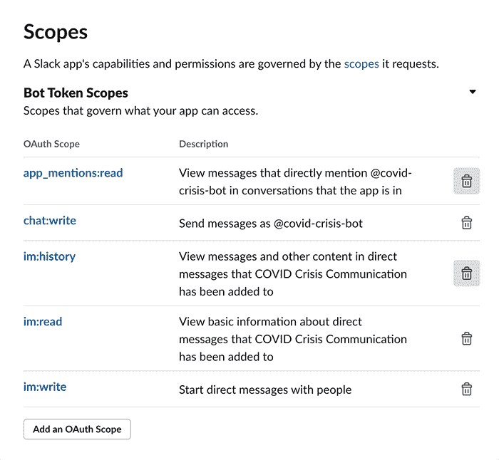

# 将您的 COVID-19 危机通信聊天机器人与 Slack 相集成

> 原文：[`developer.ibm.com/zh/tutorials/create-crisis-communication-chatbot-integrate-slack/`](https://developer.ibm.com/zh/tutorials/create-crisis-communication-chatbot-integrate-slack/)

在危机时期，聊天机器人可以帮助人们快速找到所需的关键问题的答案。在像 COVID-19 这样的流行病爆发之际，人们可能会搜索关于疾病发展或者在哪里进行检测的信息。在本教程中，我将向您展示如何将危机通信聊天机器人与 Slack 集成在一起，让用户能够更快地获得 COVID 相关问题的答案。

本教程为您提供了分步说明，介绍如何通过 Slack 正常启动并运行您的 [COVID 危机通信助手](https://developer.ibm.com/zh/tutorials/crisis-communication-chatbot-watson-assistant-webhook-integration-discovery-covid-data/)。

下图向您显示了结果。

## 学习目标

在本教程中，您将学习以下内容：

*   学习如何构建 Slack 应用程序
*   将您的 Slack 应用与 Watson Assistant 相集成
*   构建一个 Call for Code COVID 危机通信 Slack 聊天机器人解决方案

## 前提条件

*   一个 [IBM Cloud](https://www.ibm.com/account/reg/us-en/signup?formid=urx-42793&eventid=cfc-2020?cm_mmc=OSocial_Blog-_-Audience+Developer_Developer+Conversation-_-WW_WW-_-cfc-2020-ghub-starterkit-communication_ov75914&cm_mmca1=000039JL&cm_mmca2=10008917) 帐户
*   创建一个 [Watson Assistant COVID-19 危机通信聊天机器人](https://developer.ibm.com/zh/tutorials/crisis-communication-chatbot-watson-assistant-webhook-integration-discovery-covid-data/)
*   设置一个具有管理权限的 [Slack 工作空间](https://slack.com/help/articles/206845317-Create-a-Slack-workspace)

## 预估时间

在满足了前提条件之后，完成本教程大约需要 15 分钟。

## 架构图

下图显示了回答 COVID-19 相关问题的 Slack 聊天机器人的工作流程。

1.  用户调用一个 COVID-19 Slack 集成聊天机器人应用，并提出一个问题。
2.  Slack 应用调用 IBM Cloud 中托管的 Watson Assistant 服务。
3.  Watson Assistant 使用自然语言理解和机器学习提取用户问题的实体和意图。
4.  COVID-19 常见问题解答来源于美国疾病控制与预防中心的可靠数据。
5.  Watson Assistant 调用基于 OpenWhisk 开源技术的 IBM Cloud Function。
6.  IBM Cloud Function 调用在 IBM Cloud 中运行的 Watson Discovery 服务。
7.  Watson Discovery 扫描新闻文章，并以相关文章进行响应。
8.  Watson Assistant 调用基于 OpenWhisk 开源技术的 IBM Cloud Function。
9.  IBM Cloud Function 调用 COVID-19 API 以获取统计信息。
10.  Watson Assistant 答复 Slack 应用。
11.  Slack 应用向用户显示聊天答案。

## 步骤

在您的 Slack 工作空间和 [Watson Assistant 聊天机器人](https://developer.ibm.com/zh/tutorials/crisis-communication-chatbot-watson-assistant-webhook-integration-discovery-covid-data/)正常运行后，您可以将 Slack 与您的聊天机器人相集成。

1.  转到您的 COVID-19 危机通信助手，然后单击 **Add Integration**。

    

2.  在 Watson Assistant UI 中，向下滚动到“Third-party integration”部分，然后选择 **Slack**。

    

3.  首先，您必须创建一个 [Slack 应用](https://api.slack.com/apps)。单击 **Create New App**，命名您的应用程序，并指向一个 Slack 开发工作空间。您可以详细了解如何[创建 Slack 应用](https://api.slack.com/start)。

    

4.  在 Slack 应用 Settings 页面上，转到 Basic Information 选项卡，并找到 App Credentials 部分。从该部分复制您的验证令牌。

    

5.  在 Watson Assistant Slack Integration 页面上，将步骤 4 中的验证令牌粘贴到步骤 2 的适当区域中。

    

    这里的一个可选步骤是在 Basic Information 选项卡的 Display Information 部分中添加应用程序图标和应用程序名称。

    

6.  导航到 OAuth & Permissions 选项卡。在 Bot Token Scopes 部分中，单击 **Add an Oauth Scope**，然后选择以下作用域：`app_mentions:read`、`chat:write`、`im:history`、`im:read` 和 `im:write`。

    

7.  在 OAuth & Permissions 选项卡上，单击 **Install App to Workspace**，然后单击 **Allow**。您应该被重定向回 OAuth & Permissions 页面。

    

    > **注意**：确保将机器人用户 OAuth 访问令牌（以 `xoxb` 开头）复制到 Watson Assistant Slack Integration 页面上步骤 2 第 3 部分中的 OAuth 访问令牌字段和机器人用户 OAuth 访问令牌字段。

    

8.  在 Slack 应用 Settings 页面上，转到 Event Subscriptions 选项卡。对于 Enable Events 开关，单击 **On**。转到 Watson Assistant Slack Integration 页面的步骤 3，然后单击 **Generate Request URL**。将请求的 URL 粘贴到 Slack 应用 Settings 页面上，然后在 **Enable Events** 页面上进行验证。

    

9.  在 Event Subscriptions 选项卡上，找到 Subscribe to Bot Events 部分。单击 **Add Bot User Event**，然后选择要订阅的事件类型。至少应选择下列类型之一：

    *   `message.im`：侦听在直接消息通道中发布的消息事件
    *   `app_mention`：只侦听提及您的应用或机器人的消息事件

        

        保存更改。

10.  在 App Home 选项卡上，选择 **Edit**，然后输入虚拟助手的显示名称和默认用户名。单击 **Save**。启用 **Always Show My Bot as Online** 开关。

    

11.  在 Watson Assistant Slack Integration 页面上，单击 **Save Changes**。

12.  登录到您的 Slack 工作空间，然后单击 **Browse App**。找到您刚才创建的应用，将其添加到工作空间中。

    

13.  根据对话树中的意图和实体，通过提出问题来测试您的应用程序。如果收到回复，即表明您已经成功地集成了自己的 COVID-19 危机通信助手。恭喜！

## 结束语

既然您已经知道如何快速配置聊天机器人并将其连接到 Slack，现在您就可以使用新获得的知识为处理像 COVID-19 这样的危机创建自己的解决方案，并参加 Call for Code COVID-19 挑战赛。

本文翻译自：[Integrate your COVID-19 crisis communication chatbot with Slack](https://developer.ibm.com/tutorials/create-crisis-communication-chatbot-integrate-slack/)（2020-03-27）