# 使用抗灾能力入门工具包构建一个应用

> 原文：[`developer.ibm.com/zh/tutorials/disaster-resiliency-starter-kit-tutorial/`](https://developer.ibm.com/zh/tutorials/disaster-resiliency-starter-kit-tutorial/)

根据世界卫生组织提供的数据，在全球范围内，自然灾害每年造成约 9 万人死亡，近 1.6 亿人遭受影响。尤其是在过去十年里，恶劣天气事件发生的频率和强度双双增加；科学家们认为，气候变化是一个重要的导火索。

无论是第三方开源项目还是 IBM Cloud 服务，技术都可以帮助应对这些全球环境挑战。

本教程指导您围绕[抗灾能力入门工具包](https://github.com/Call-for-Code/Solution-Starter-Kit-Disasters-2020)构建一个入门应用程序。这个入门应用程序包含一个聊天机器人以及一个地图和路线服务。聊天机器人由 IBM® Watson™ Assistant 提供支持，可以回答有关突发洪灾的问题，地图和位置服务则由 HERE Technologies 公司提供。

## 前提条件

要学习本教程，您必须：

*   注册一个 [IBM Cloud](https://cocl.us/IBM_CLOUD_GCG) 帐户。
*   安装和配置 [IBM Cloud CLI](https://cloud.ibm.com/docs/cli?topic=cloud-cli-getting-started#overview)。
*   注册一个 [HERE](https://developer.here.com/ref/IBM_starterkit_Disasters2020?create=Freemium-Basic) 帐户。
*   安装适用于 iOS 的 [React Native CLI 依赖项](https://reactnative.dev/docs/getting-started.html)：
    *   [Node.js](https://nodejs.org/en/)
    *   [Watchman](https://facebook.github.io/watchman/docs/install)
    *   [Xcode](https://itunes.apple.com/us/app/xcode/id497799835?mt=12)
    *   [CocoaPods](https://guides.cocoapods.org/using/getting-started.html)
*   克隆 [Solution-Starter-Kit-Disasters-2020 代码库](https://github.com/Call-for-Code/Solution-Starter-Kit-Disasters-2020)。

## 预估时间

完成本教程大约需要 45 分钟。

## 步骤

1.  设置 Watson Assistant 的实例
2.  通过 HERE 开发者门户生成一个 API 密钥
3.  运行服务器
4.  运行移动应用程序

### 设置 Watson Assistant 的实例

登录到 IBM Cloud，并配置一个 Watson Assistant 实例。

1.  通过 [IBM Cloud 目录](https://cloud.ibm.com/catalog/services/watson*assistant?cm_sp=ibmdev-_-developer-tutorials-_-cloudreg)配置 **Watson Assistant** 的实例。

    *   选择一个套餐（**Lite** 套餐应该已足够）。
    *   在 **Service name** 中输入名称。
    *   单击 **Create**。

        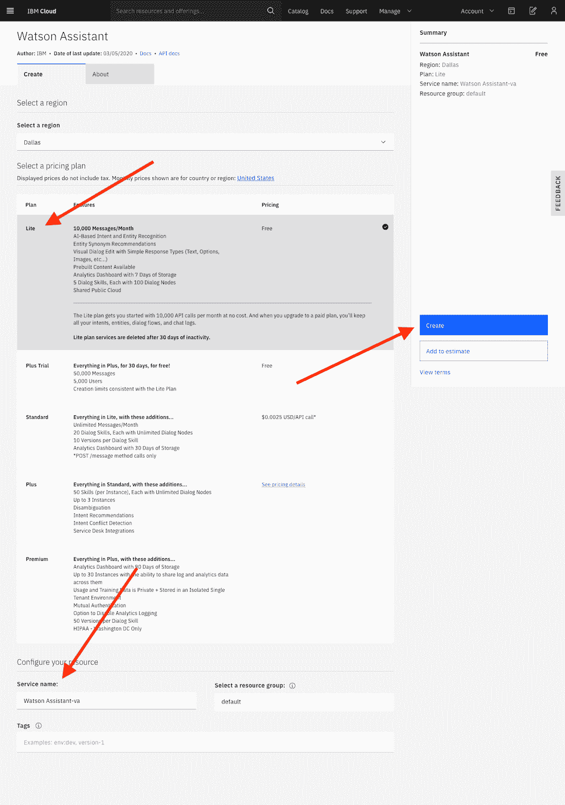

2.  启动 **Watson Assistant**。

    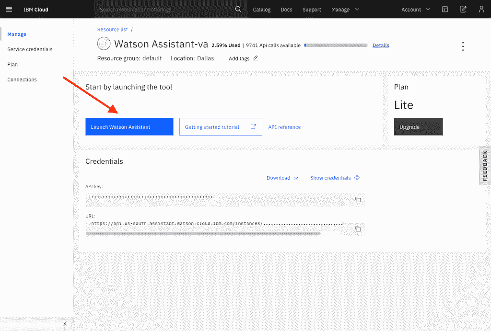

3.  [创建一个 **Assistant**](https://cloud.ibm.com/docs/assistant?topic=assistant-assistant-add)。

    *   单击 **Assistant** 菜单。
    *   单击 **Create assistant**。

        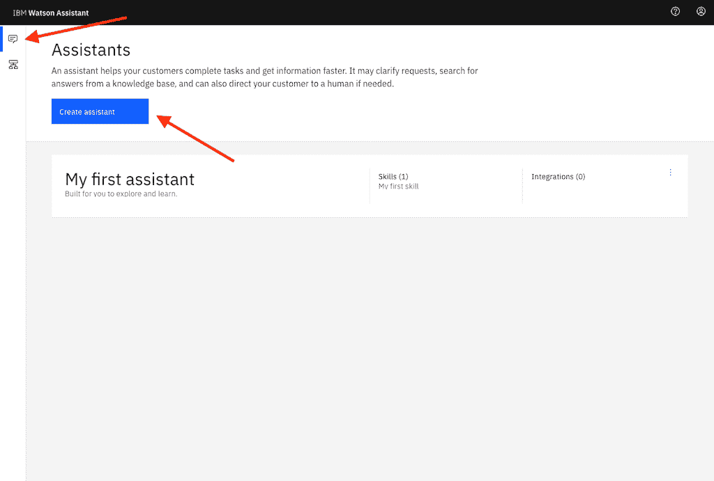

    *   在 **Name** 中输入名称，然后单击 **Create assistant**。

        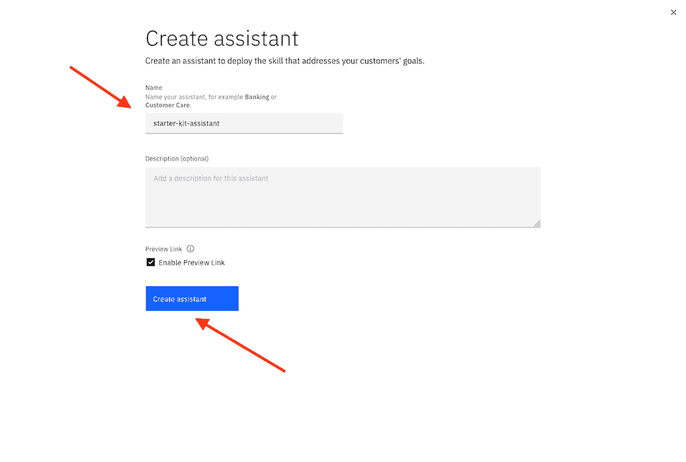

4.  通过从克隆的 [Solution-Starter-Kit-Disasters-2020 代码库](https://github.com/Call-for-Code/Solution-Starter-Kit-Disasters-2020)导入 [`starter-kit-flood-dialog-skill.json`](https://github.com/Call-for-Code/Solution-Starter-Kit-Disasters-2020/blob/master/starter-kit/assistant/starter-kit-flood-dialog-skill.json) 文件，向 **Assistant** [添加一个对话技能](https://cloud.ibm.com/docs/assistant?topic=assistant-skill-dialog-add)。

    *   单击 **Add dialog skill**。

        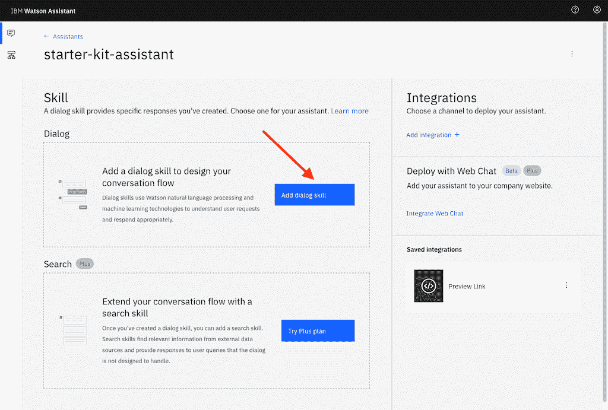

    *   选择 **Import skill** 选项卡。

    *   单击 **Choose JSON File**。
    *   浏览到 `starter-kit-flood-dialog-skill.json` 对话技能文件并选中该文件。
    *   单击 **Import**。

        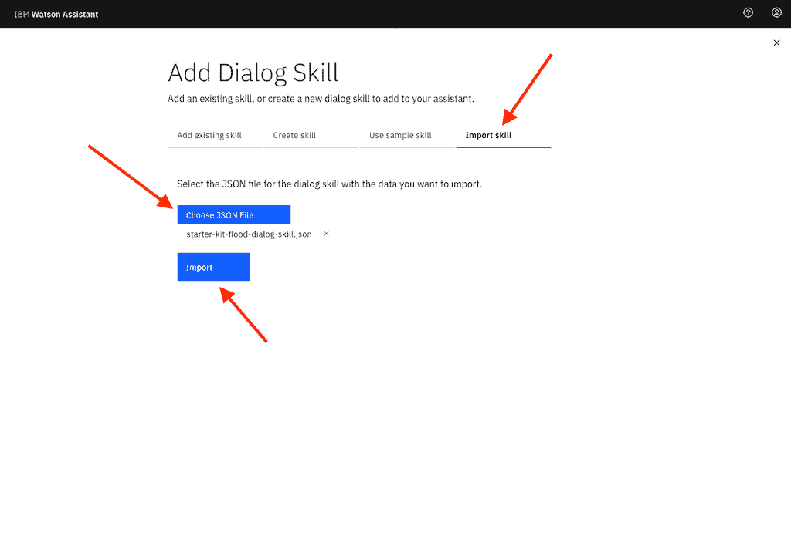

5.  单击助手的操作按钮，然后选择 **Settings**。

    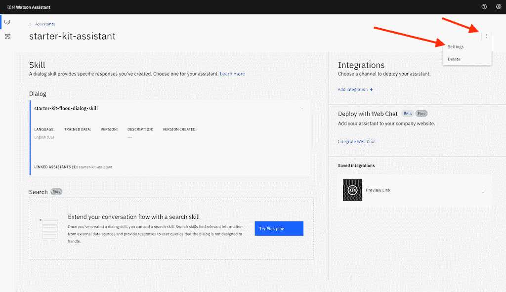

6.  选择 **API Details** 并记下 **Assistant ID** 和 **Api Key**。从 **Assistant URL** 中，记下基础 URL/域（例如，`https://api.us-south.assistant.watson.cloud.ibm.com` 或 `https://api.eu-gb.assistant.watson.cloud.ibm.com`），但不包括目录/路径。

    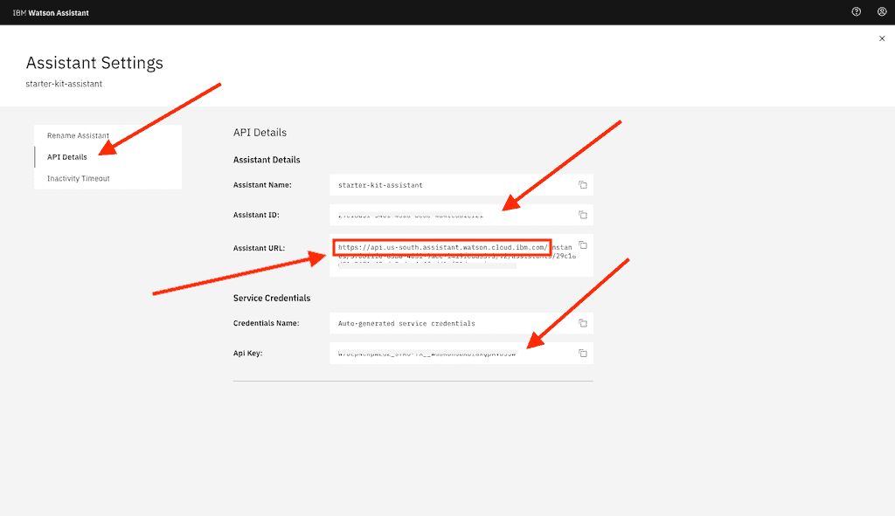

7.  转到 **Preview Link**，获取一个用于测试和验证对话技能的链接。

    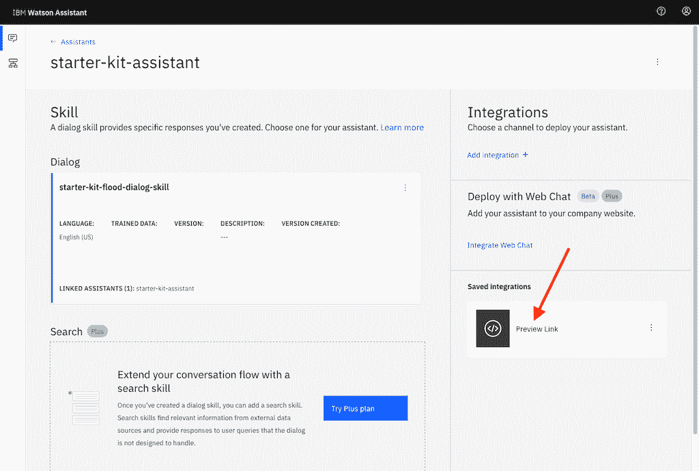

    *   单击 **Try it out and share the link** 部分中的 URL。

        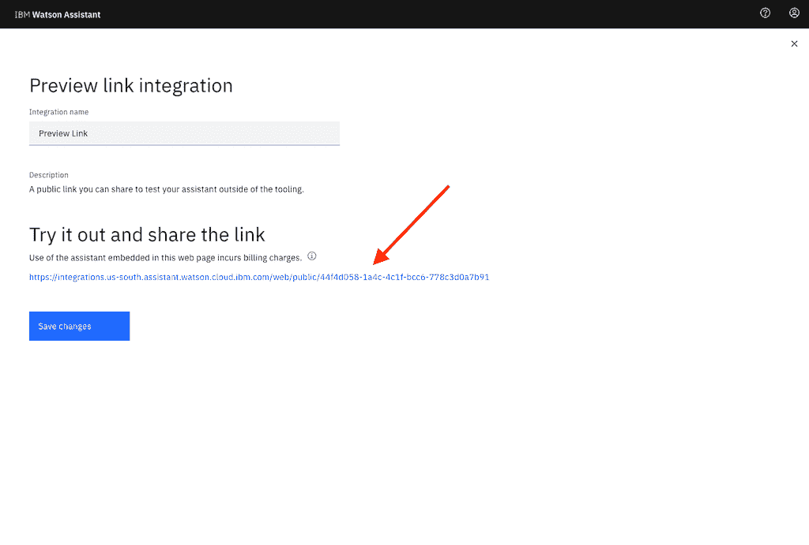

    *   向助手提出一个（洪灾）问题。

        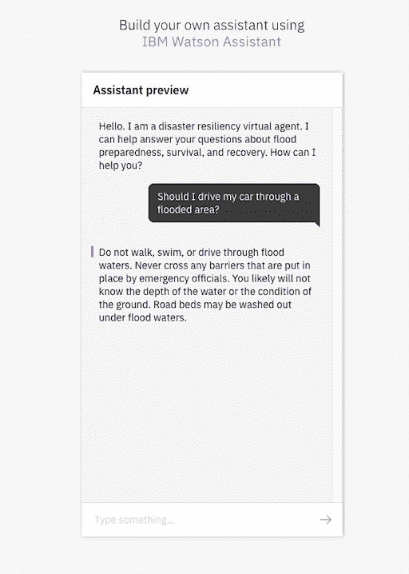

### 从 HERE 开发者门户生成 API 密钥

应用程序将 HRE 位置服务用于地图、搜索和路线设定。需要一个 API 密钥来访问这些服务。遵循 [HERE 开发者门户](https://developer.here.com/ref/IBM_starterkit_Disasters2020?create=Freemium-Basic)中的简要说明[生成一个 JavaScript API 密钥](https://developer.here.com/documentation/authentication/dev_guide/topics/api-key-credentials.html)。

### 运行服务器

设置并启动服务器应用程序：

1.  转到克隆的 [Solution-Starter-Kit-Disasters-2020 代码库](https://github.com/Call-for-Code/Solution-Starter-Kit-Disasters-2020)的 `starter-kit/server-app` 目录。

2.  复制 `starter-kit/server-app` 目录中的 [`.env.example`](https://github.com/Call-for-Code/Solution-Starter-Kit-Disasters-2020/blob/master/starter-kit/server-app/.env.example) 文件，然后创建一个名为 `.env` 的新文件。

3.  编辑新创建的 `.env` 文件，并使用从 Watson Assistant 中对话技能的“API Detail”页面获取的值更新 `ASSISTANT_ID` 和 `ASSISTANT_IAM_APIKEY` 值。

4.  编辑 [`manifest.yml`](https://github.com/Call-for-Code/Solution-Starter-Kit-Disasters-2020/blob/master/starter-kit/server-app/manifest.yml) 文件中 **name** 的值，将其更改为所需的应用程序名称（例如，*my-app-name*）。

5.  在终端中：

    1.  转到克隆的 [Solution-Starter-Kit-Disasters-2020 代码库](https://github.com/Call-for-Code/Solution-Starter-Kit-Disasters-2020)的 `starter-kit/server-app` 目录。

    2.  安装依赖项。

        ```
         npm install 
        ```

    3.  在本地启动服务器应用程序或者部署到 IBM Cloud。

        *   在本地运行：

            1.  启动应用程序。

                ```
                 npm start 
                ```

            2.  可以通过 `http://localhost:3000` 来访问服务器。

        *   部署到 IBM Cloud：

            1.  使用 IBM Cloud CLI 登录到您的 IBM Cloud 帐户。

                ```
                 ibmcloud login 
                ```

            2.  确定目标 Cloud Foundry 组织和空间。

                ```
                 ibmcloud target --cf 
                ```

            3.  将应用推送到 IBM Cloud。

                ```
                 ibmcloud app push 
                ```

            4.  可以使用 [`manifest.yml`](https://github.com/Call-for-Code/Solution-Starter-Kit-Disasters-2020/blob/master/starter-kit/server-app/manifest.yml) 文件中提供的**名称**，通过某个 URL 来访问服务器（例如 `https://my-app-name.bluemix.net`）。

### 运行移动应用程序

运行移动应用程序（使用 Xcode iOS Simulator）：

1.  转到克隆的 [Solution-Starter-Kit-Disasters-2020 代码库](https://github.com/Call-for-Code/Solution-Starter-Kit-Disasters-2020)的 `starter-kit/mobile-app` 目录。

2.  复制 `starter-kit/mobile-app` 目录中的 [`.env.example`](https://github.com/Call-for-Code/Solution-Starter-Kit-Disasters-2020/blob/master/starter-kit/mobile-app/.env.example) 文件，然后创建一个名为 `.env` 的文件。

3.  编辑新创建的 `.env` 文件。

    *   使用先前步骤中启动的服务器应用的 URL 来更新 `STARTER_KIT_SERVER_URL`。

    *   使用 HERE 开发者门户中生成的 API 密钥来更新 `HERE_APIKEY`。

4.  在终端中：

    1.  转到克隆的 [Solution-Starter-Kit-Disasters-2020 代码库](https://github.com/Call-for-Code/Solution-Starter-Kit-Disasters-2020)的 `starter-kit/mobile-app` 目录。

    2.  安装依赖项。

        ```
         npm install 
        ```

    3.  转到 `ios` 目录。

        ```
         cd ios 
        ```

    4.  安装 pod 依赖项。

        ```
         pod install 
        ```

    5.  返回到 `mobile-app` 目录。

        ```
         cd . 
        ```

    6.  在模拟器中启动应用。

        ```
         npm run ios 
        ```

## 结束语

在本教程中，我们构建了一个将 IBM 数据和 AI 产品与 HERE Technologies 的位置服务结合在一起的应用程序。该入门应用程序可以帮助您快速启动开发过程，迅速开始构建自己的解决方案。

本文翻译自：[Build an app using the Disaster Resiliency Starter Kit](https://developer.ibm.com/tutorials/disaster-resiliency-starter-kit-tutorial/)（2020-03-20）