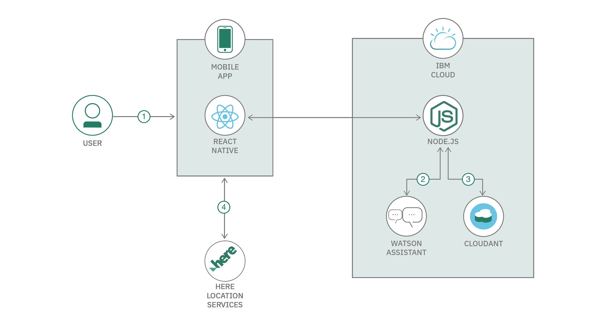
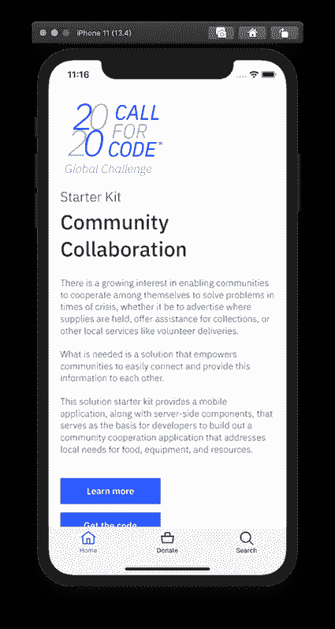
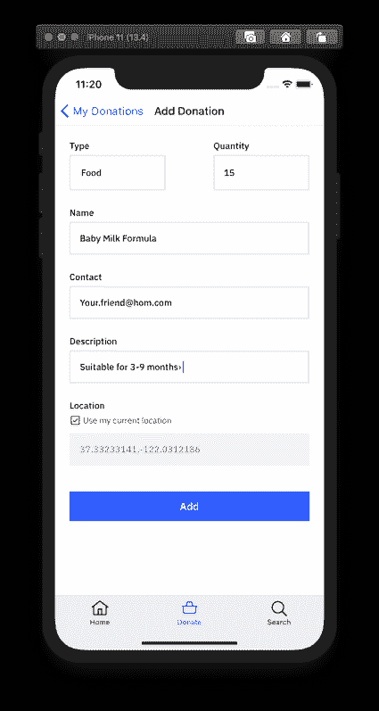
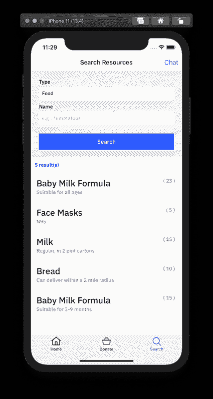
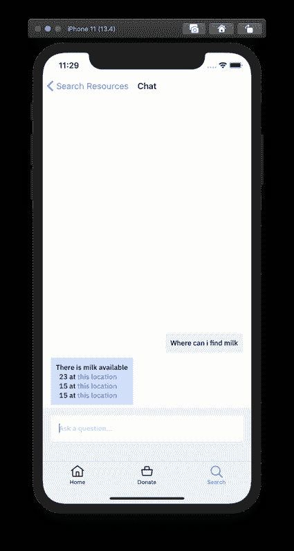
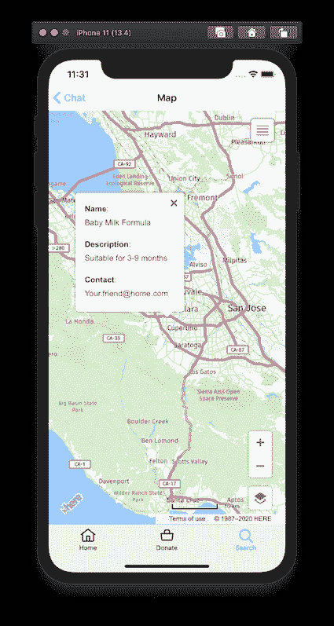
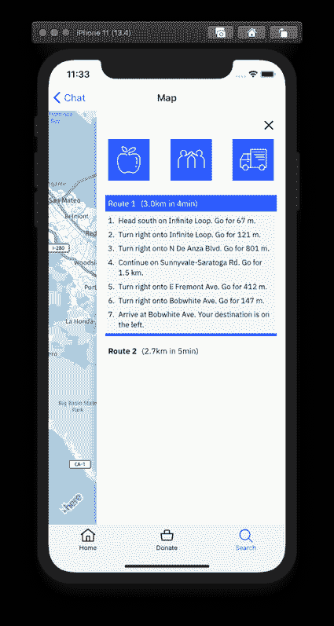

# 创建一个促进社区合作的移动应用

> 原文：[`developer.ibm.com/zh/tutorials/create-a-mobile-app-to-facilitate-community-collaboration/`](https://developer.ibm.com/zh/tutorials/create-a-mobile-app-to-facilitate-community-collaboration/)

人们日益希望在危机时期，各个社区能够相互合作，携手解决各种问题，不论是告知日用品的存放地点、协助开展募捐活动，还是提供志愿送货等其他当地服务。

例如，随着新型冠状病毒（ COVID-19 或 “Novel Coronavirus”）危机的爆发，美国联邦和地方政府可能正在推出一系列资助方案，但要尽快向最需要援助的地方提供帮助，最有效的方式就是地方级别的合作。传统的社交媒体是社区内部的一种沟通方式，但这种方式往往缺乏井然有序的结构，无法迅速发现亟需的帮助。

在目前的危机中，我们已经看到当地食物、医疗设备和其他用品出现供应短缺。此外，建议（或要求）的自我隔离和社交距离措施让人们无法轻松到达日用品库存充足的地点，从而让这个问题进一步恶化。

我们需要一个解决方案，能够助力各个社区轻松取得联系，相互提供这方面的信息。

## 学习目标

在本教程中，您将了解如何通过 IBM Cloud 将 React Native 前端和 Node.js 后端与 Watson Assistant、Cloudant 数据库和 HERE 位置服务连接起来。这为开发者提供了一个“启动台”，让他们能够快速开始构建一个集成的社区合作解决方案。

## 前提条件

*   注册一个 [IBM Cloud](https://www.ibm.com/account/reg/us-en/signup?formid=urx-42793&eventid=cfc-2020?cm_mmc=OSocial_Blog-_-Audience+Developer_Developer+Conversation-_-WW_WW-_-cfc-2020-ghub-starterkit-cooperation_ov75914&cm_mmca1=000039JL&cm_mmca2=10008917) 帐户。
*   安装和配置 [IBM Cloud CLI](https://cloud.ibm.com/docs/cli?topic=cloud-cli-getting-started#overview)。
*   注册一个 [HERE](https://developer.here.com/ref/IBM_starterkit_Disasters2020?create=Freemium-Basic) 帐户。
*   安装 [React Native CLI 依赖项](https://reactnative.dev/docs/getting-started.html)（适用于 iOS）。
    *   [Node.js](https://nodejs.org/en/)
    *   [Watchman](https://facebook.github.io/watchman/docs/install)
    *   [Xcode](https://itunes.apple.com/us/app/xcode/id497799835?mt=12)
    *   [CocoaPods](https://guides.cocoapods.org/using/getting-started.html)
*   克隆[代码库](https://github.com/Call-for-Code/Solution-Starter-Kit-Cooperation-2020)。

## 预估时间

完成本教程大约需要 20 到 30 分钟。

## 工作原理

供应商（Supplier）可以是常住居民、小型企业、志愿组织等。如果他们能够提供食物、日用品、资源或其他必需品，他们可以使用移动应用程序，并填写一份简短的表格，说明他们拥有的物资及数量。这些信息随后将存储在 IBM Cloud 的数据库中。

需要食物、日用品、资源或其他必需品的接收方（Receipient）可打开移动应用程序，使用聊天界面查找附近的日用品。例如，他们可能会键入“哪里有面包？”或者“有人能帮我取一下买的东西吗？”移动应用程序随后便会访问数据库（先要通过 Watson Assistant 理解问题），并显示一张地图，指出可在当地的哪些地方找到他们所需的物品。

### 流程

这个解决方案的初衷是将聊天界面 (Watson Assistant)、保存日用品库存状态的数据存储以及位置服务和实时信息结合起来，帮助用户获得所需信息。

1.  接收方用户启动移动应用，可跨多种服务访问信息。
2.  接收方用户可以向 Watson Assistant 提问，获得食物库存或可提供服务相关问题的答案。
3.  供应商用户可以发布他们可提供资源的库存情况，以及定位他们所需物品的地点。
4.  接收方用户可以使用 HERE 位置服务获取地理位置数据，绘制日用品取货（或发放）路线。

## 步骤

1.  设置 Watson Assistant 的实例
2.  使用 Cloudant 配置 CouchDB 实例
3.  通过 HERE 开发者门户生成一个 API 密钥
4.  运行服务器
5.  运行移动应用程序

### 1\. 设置 Watson Assistant 的实例

登录到 IBM Cloud，并配置一个 Watson Assistant 实例。

1.  通过 [IBM Cloud 目录](https://cloud.ibm.com/catalog/services/watson-assistant?cm_sp=ibmdev-_-developer-tutorials-_-cloudreg)配置 **Watson Assistant** 的实例。
2.  启动 Watson Assistant 服务。
3.  [创建一个 **Assistant**](https://cloud.ibm.com/docs/assistant?topic=assistant-assistant-add)。
4.  通过导入 `starter-kit-cooperation-dialog-skill.json` 文件，向 **Assistant** [添加一个对话技能（dialog skill）](https://cloud.ibm.com/docs/assistant?topic=assistant-skill-dialog-add)。
5.  回到 All Assistants 页面，从操作菜单 ( **`⋮`** ) 打开 **Settings**，然后单击 **API Details**。
6.  记下 **Assistant ID**、**API Key** 和 **Assistant URL**。对于 **Assistant URL**，记下基本 URL/域（例如 `https://api.us-south.assistant.watson.cloud.ibm.com` 或 `https://api.eu-gb.assistant.watson.cloud.ibm.com`），而不是完整的目录/路径。在下面的步骤 4 中，您将需要上述这三个值。

7.  转到 **Preview Link**，获取一个用于测试和验证对话技能的链接。

### 2\. 使用 Cloudant 配置一个 CouchDB 实例

登录 IBM Cloud，[使用 Cloudant 配置一个 CouchDB 实例](https://www.ibm.com/cloud/cloudant)。

1.  从目录中选择 Databases，然后选择 Cloudant 面板。
2.  选中后，您就可以选择自己的 Cloudant 套餐。这里有一个用于简单测试的免费套餐，该套餐足以运行这个 CIR 示例。您应该选择一个适当的区域，为服务提供一个名称，并且建议您选中 **Available authentication methods** 下面的 **Use only IAM**。您可以将其他设置保留默认值。准备就绪后，单击蓝色的 **Create** 按钮。
3.  创建 Cloudant 实例后，您需要创建一个服务凭证，以供 CIR API 服务器用来与该实例通信。选择运行的 Cloudant 实例后，您可以从左侧菜单中选择 **Service credentials**。创建一个新的服务凭证，并提供一个名称（随便起一个名字即可）。
4.  创建后，您可以通过选择 **view service credentials** 来显示凭证，然后复制该凭证，以便在步骤 4 中将其粘贴到 API 服务器的代码中。

### 3\. 从 HERE 开发者门户生成 API 密钥

应用程序将 HERE 位置服务用于地图、搜索和路线设定。

要访问这些服务，您将需要一个 API 密钥。遵循 [HERE 开发者门户](https://developer.here.com/ref/IBM_starterkit_Disasters2020?create=Freemium-Basic)中的操作说明[生成一个 JavaScript API 密钥](https://developer.here.com/documentation/authentication/dev_guide/topics/api-key-credentials.html)。

### 4\. 运行服务器

设置并启动服务器应用程序：

1.  转到克隆代码库的 `starter-kit/server-app` 目录。
2.  复制 `starter-kit/server-app` 目录中的 `.env.example` 文件，然后创建一个名为 `.env` 的新文件。
3.  编辑新创建的 `.env` 文件，并使用步骤 1 中 Watson Assistant 对话技能的 API Detail 页面中的值来更新 `ASSISTANT_URL`、`ASSISTANT_ID` 和 `ASSISTANT_IAM_APIKEY`。此外，使用在步骤 2 中创建的服务凭证值来更新 `CLOUDANT_ID` 和 `CLOUDANT_IAM_APIKEY`。（须注意，凭证中的 `username` 应该用于 `CLOUDANT_ID`）。
4.  编辑 `manifest.yml` 文件中的 **name** 值，将其更改为您的应用程序名称（例如，*my-app-name*）。
5.  在终端中：
    1.  转到克隆代码库的 `starter-kit/server-app` 目录。
    2.  安装依赖项：`npm install`。
    3.  在本地启动服务器应用程序或者部署到 IBM Cloud：
        *   在本地运行：
            1.  启动应用程序：`npm start`。
            2.  可以通过 `http://localhost:3000` 来访问服务器。
        *   部署到 IBM Cloud：
            1.  使用 IBM Cloud CLI 登录到您的 IBM Cloud 帐户：`ibmcloud login`。
            2.  确定目标 Cloud Foundry 组织和空间：`ibmcloud target --cf`。
            3.  将应用推送到 IBM Cloud：`ibmcloud app push`。
            4.  可以使用 `manifest.yml` 文件中提供的 **name**，通过某个 URL 来访问服务器（例如 `https://my-app-name.bluemix.net`）。

### 5\. 运行移动应用程序

运行移动应用程序（使用 Xcode iOS Simulator）：

1.  转到克隆代码库的 `starter-kit/mobile-app` 目录。
2.  复制 `starter-kit/mobile-app` 目录中的 `.env.example` 文件，然后创建一个名为 `.env` 的文件。
3.  编辑新创建的 `.env` 文件。
    *   使用先前步骤中启动的服务器应用的 URL 来更新 `STARTER_KIT_SERVER_URL`。
    *   使用 HERE 开发者门户中生成的 API 密钥来更新 `HERE_APIKEY`。
4.  在终端中：
    1.  转到 `starter-kit/mobile-app` 目录。
    2.  安装依赖项：`npm install`。
    3.  转到 `ios` 目录：`cd ios`。
    4.  安装 pod 依赖项：`pod install`。
    5.  返回到 `mobile-app` 目录：`cd ../`。
    6.  在模拟器中启动应用：`npm run ios`。您至少应该运行 iOS 13.0。
    7.  首次启动模拟器时，应确保在 Features 菜单中设置 Location 选项。

在模拟器中运行应用程序之后，您应该能够浏览各个屏幕，如下所示：

     

## 结束语

恭喜！您已经构建了一个 Call for Code 解决方案，让社区能够获取所需的重要资源，帮助找到可提供物资的供应商。现在，您可以在 IBM Cloud 中创建一个聊天机器人和数据库，从而对许多人的生活产生有意义的影响。您可以更改此代码，为社区创建新的解决方案，也可以在本教程的基础上创建新的应用程序。

***致谢：** 以下 IBM 员工也为这个入门工具包和教程的开发做出了贡献：Omer Arad、Robert Loredo、Debbie Kestin Schildkraut、John Swanson 和 Bruce Weed。*

本文翻译自：[Create a mobile app to facilitate community collaboration](https://developer.ibm.com/tutorials/create-a-mobile-app-to-facilitate-community-collaboration/)（2020-03-27）