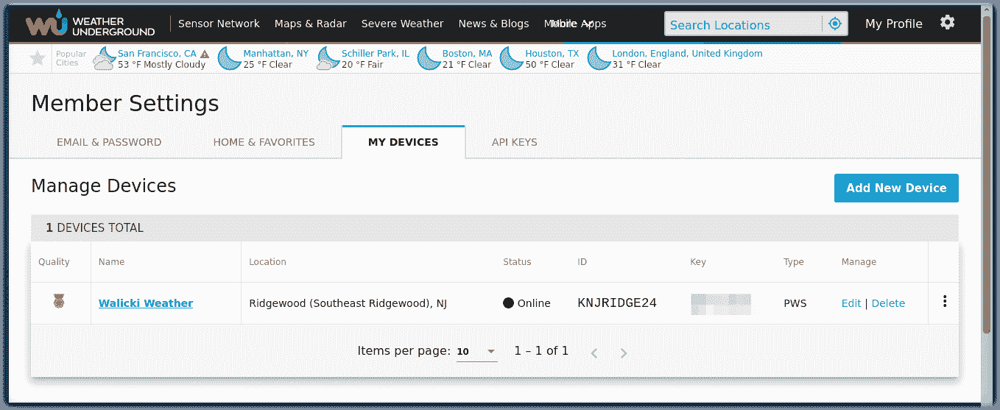
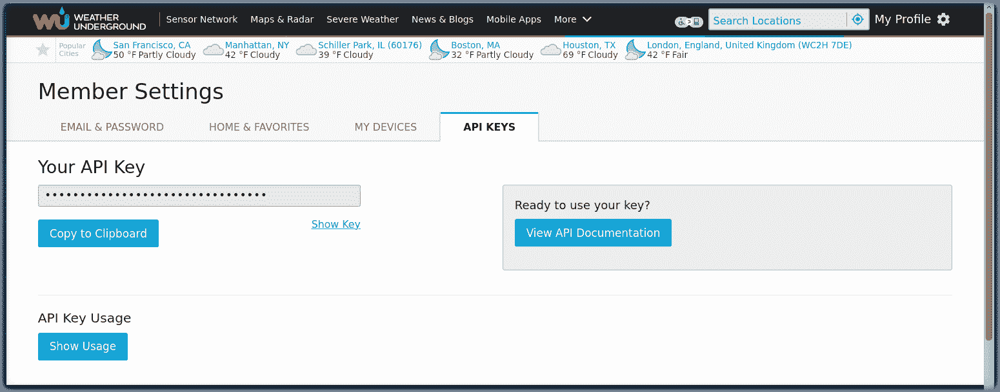
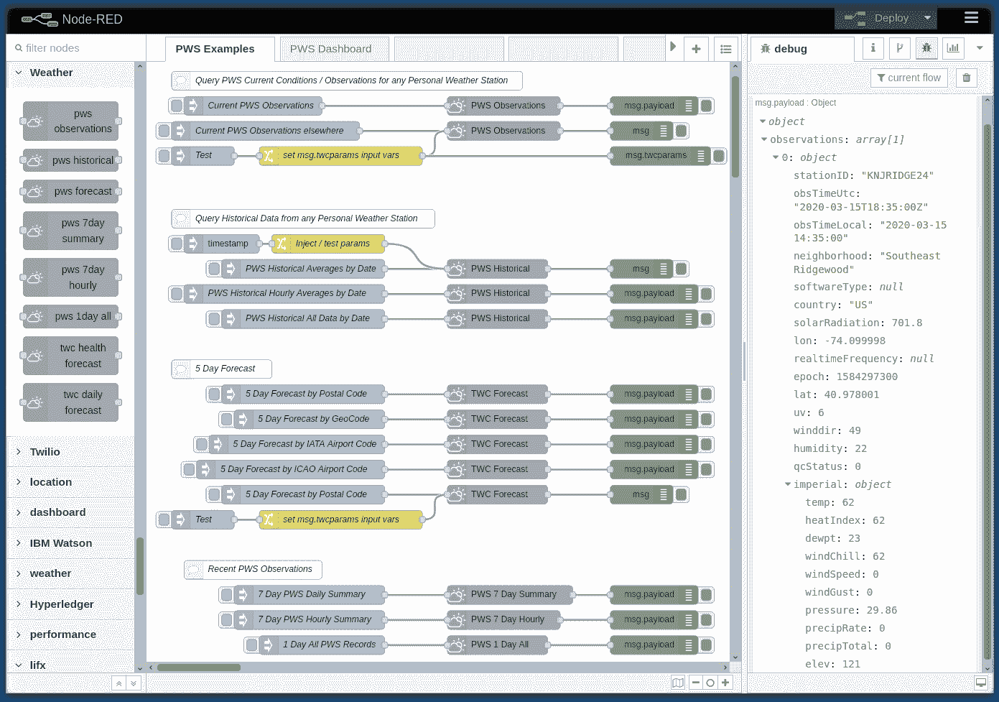
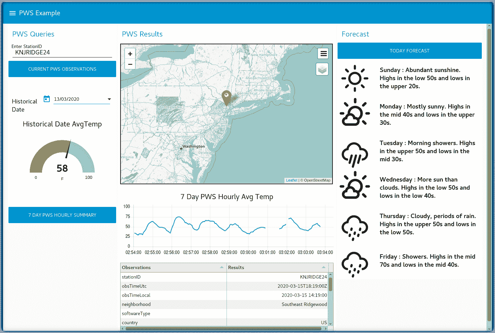
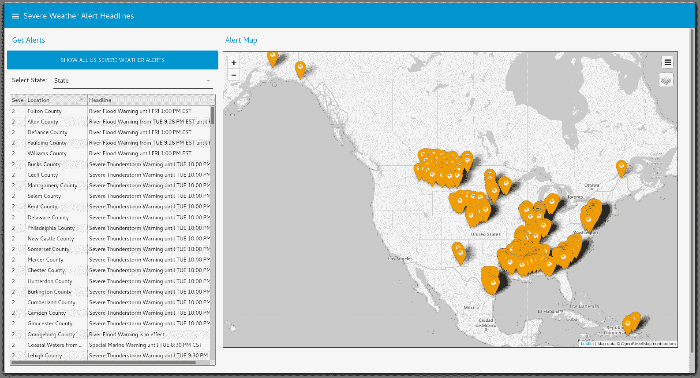
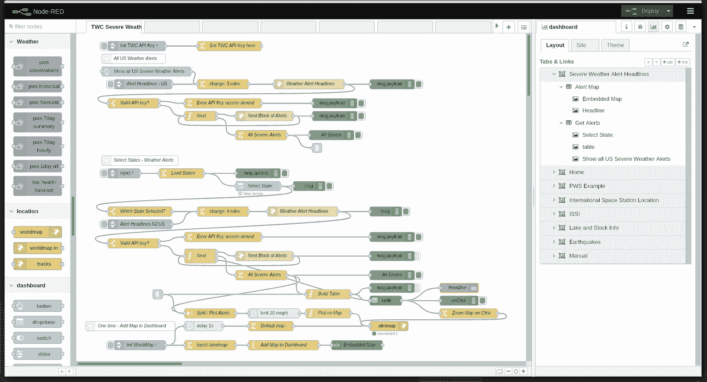

# 构建一个超本地化的气象仪表板

> 原文：[`developer.ibm.com/zh/tutorials/collect-display-hyperlocal-weather-data-from-a-pws-cfc-starter-kit-1/`](https://developer.ibm.com/zh/tutorials/collect-display-hyperlocal-weather-data-from-a-pws-cfc-starter-kit-1/)

了解如何使用个人气象站、Node-RED、Weather Underground 和 The Weather Company API 以及 node-red-contrib-twc-weather 节点来构建气象仪表板。本教程演示了如何显示来自住宅或农业气象站的超本地气象信息。

## 学习目标

在本教程中，您将执行以下操作：

*   学习个人气象站 (PWS) 的基础知识
*   将 PWS 连接到 Weather Underground (WU) 并在 WU 中查看 PWS 数据
*   注册获取 The Weather Company (TWC) API 密钥
*   开始使用 TWC API 文档
*   学习 Node-RED（本地和在 IBM Cloud 上）
*   探索 node-red-contrib-twc-weather Node-RED PWS 节点示例
*   导入/部署 Weather Dashboard 示例
*   在气象仪表板中显示 PWS 数据
*   使用 TWC API 构建恶劣天气警报地图 Node-RED 仪表板
*   构建 Call for Code 水资源可持续性解决方案

## 前提条件

*   已在[本地](https://nodered.org/docs/getting-started/)安装了 Node-RED 或者在 IBM Cloud 中[创建 Node-RED Starter 应用程序](https://developer.ibm.com/components/node-red/tutorials/how-to-create-a-node-red-starter-application/)。
*   在安装 Node-RED 后，可以添加以下依赖项：

```
npm install node-red-contrib-twc-weather node-red-dashboard node-red-node-ui-table node-red-contrib-web-worldmap 
```

*   将 PWS 数据发送到 `http://www.wunderground.com` 并检索 PWS API 密钥。
*   如果您没有 PWS，则仍然可以通过加入 [Call for Code](http://callforcode.weather.com)来获取一个能够访问大多数 TWC PWS API 的限时的 TWC API 密钥。

## 预估时间

完成本教程大约需要 30 分钟。

## 步骤

### 个人气象站简介

维基百科对于[个人气象站](https://en.wikipedia.org/wiki/Weather_station#Personal_weather_station)的定义是：一套由私人、俱乐部、协会或企业操作的气象测量仪器（获取和分发气象数据不属于该实体的业务运营范围）。个人气象站已经变得越来越先进，可以包含许多不同的传感器来测量气象状况。这些传感器可以在不同的模型之间变化，但大多数是用于测量风速、风向、室内外温度、室内外湿度、气压、降雨以及紫外线或太阳辐射。此外，还有一些传感器可用于测量土壤湿度、土壤温度和叶片湿度。

一个足够准确的个人气象站的价格不到 200 美元；平民科学爱好者和气象爱好者都能够买得起。

### 将 PWS 连接到 Weather Underground

许多品牌的 PWS 都可以连接到基于云的服务并向其发送气象数据。 Weather Underground 是 The Weather Company（一家 IBM 子公司）的一部分，它鼓励会员注册其 PWS 并将数据发送到 [`www.wunderground.com`](http://www.wunderground.com)。



会员可以在 Weather Underground 中查看其个人气象站数据：


### 获取 TWC API 密钥并开始使用 TWC API 文档

除了 wunderground.com 仪表板外，还可以通过 API 密钥和一组可靠的 TWC Restful API 来获取 PWS 数据。复制 API 密钥，然后单击 [**View API Documentation**](https://docs.google.com/document/d/1eKCnKXI9xnoMGRRzOL1xPCBihNV2rOet08qpE_gArAY) 按钮。



### 注册获取 TWC API 密钥

如果您没有个人气象站，则仍然可以通过参加 [2020 年 Call for Code](https://developer.ibm.com/zh/callforcode/) 来[注册](http://callforcode.weather.com)获取一个限时的 TWC API 密钥。此 API 密钥的有效期为 2020 年 3 月 1 日到 10 月 15 日。 使用此 API 密钥，您可以访问大多数的 TWC 个人气象站 API。 您可以使用此 API 密钥来完成本教程。

### 了解 Node-RED

[Node-RED](http://nodered.org) 是一个开源编程工具，可通过一种全新的有趣方式将硬件设备、API 和在线服务结合在一起。它提供了一个基于浏览器的编辑器，可以使用面板中的各种节点轻松地将流程连接到一起，只需一键便可以将这些流程部署到各自的运行时中。

遵循这些操作说明以在[本地](https://nodered.org/docs/getting-started/)安装 Node-RED 或者在 IBM Cloud 中[创建 Node-RED Starter 应用程序](https://developer.ibm.com/components/node-red/tutorials/how-to-create-a-node-red-starter-application/)。

### 安装 node-red-contrib-twc-weather 节点

在安装 Node-RED 后，可以添加本教程的以下依赖项：

*   [node-red-contrib-twc-weather](https://flows.nodered.org/node/node-red-contrib-twc-weather)
*   [node-red-dashboard](https://flows.nodered.org/node/node-red-dashboard)
*   [node-red-node-ui-table](https://flows.nodered.org/node/node-red-node-ui-table)
*   [node-red-contrib-web-worldmap](https://flows.nodered.org/node/node-red-contrib-web-worldmap)

```
npm install node-red-contrib-twc-weather node-red-dashboard node-red-node-ui-table node-red-contrib-web-worldmap 
```

### 探索 node-red-contrib-twc-weather Node-RED PWS 节点示例

[node-red-contrib-twc-weather GitHub 代码库](https://github.com/johnwalicki/node-red-contrib-twc-weather)中包含一个示例流程，在这个流程中将运用到每个 Node-RED [PWS API](https://docs.google.com/document/d/1eKCnKXI9xnoMGRRzOL1xPCBihNV2rOet08qpE_gArAY)。您可以单击每个节点并查看其“综合节点信息”选项卡来了解节点及其配置选项。将此 [PWS-Examples.json 流程](https://github.com/johnwalicki/node-red-contrib-twc-weather/blob/master/examples/PWS-Examples.json)导入到 Node-RED 编辑器中并**部署**该流程。 请记住要粘贴自己的 TWC PWS API 密钥。 如果您想查看个人气象站数据，但没有自己的 PWS，则可以使用 StationID **KNJRIDGE9** 在里奇伍德消防总部查询气象站数据。



### 导入/部署 Weather Dashboard 示例

现在，Node-RED node-red-contrib-twc-weather 节点可以查询气象数据，让我们来构建一个 Node-RED 气象仪表板，用于以地图、表格、仪表和统计图的形式显示个人气象站的当前数据和历史数据。使用 PWS API 密钥，可以访问通过 [weather-lite 图标](https://github.com/Paul-Reed/weather-icons-lite)显示的 TWC 5 天预报信息。此流程需要 node-red-dashboard、node-red-node-ui-table 和 node-red-contrib-web-worldmap。 导入此 [PWS-Dashboard.json 流程](https://github.com/johnwalicki/node-red-contrib-twc-weather/blob/master/examples/PWS-Dashboard.json)并**部署**该流程。

### 在气象仪表板中显示 PWS 数据

启动 Node-RED 仪表板，并尝试显示当前气象状况、预报和地图。Call for Code TWC API 密钥可能无法访问私有的 PWS 历史数据。



### 使用 TWC API 构建恶劣天气警报地图 Node-RED 仪表板

除了 node-red-contrib-twc-weather Node-RED 节点外，您还可以查看 [TWC 恶劣气象 API 文档](https://ibm.co/TWCswe)并使用 **http request** 节点和 API 密钥来直接进行调用。

[The Weather Company API](https://business.weather.com/products/weather-data-packages) 中包含一个可用于查询由[国家气象局](https://www.weather.gov/alerts)发出的所有最新[恶劣天气警报](https://business.weather.com/resource/brochure-the-weather-company-data-package-severe-weather)的 API。下一个示例将在 Node-RED 仪表板上显示这些恶劣天气警报。

此示例流程和 Node-RED 仪表板可以在 [Call for Code](https://developer.ibm.com/zh/callforcode/) 解决方案中使用。

### 在地图上显示恶劣天气警报



**获得代码：[恶劣天气警报的 Node-RED 流程](https://github.com/johnwalicki/Node-RED-Severe-Weather-Alert-Map/blob/master/flows/SevereWeatherAlertMap.flow)**

## 

## 结束语

### 构建 Call for Code 水资源可持续性解决方案！

现在，您已经完成了本教程，可以开始修改这些示例流程和 Node-RED 仪表板以构建 [Call for Code 水资源可持续性](https://developer.ibm.com/zh/callforcode/get-started/climate-change/water-sustainability/)解决方案。

本文翻译自：[Build a hyper-local weather dashboard](https://developer.ibm.com/tutorials/collect-display-hyperlocal-weather-data-from-a-pws-cfc-starter-kit-1/)（2020-03-17）