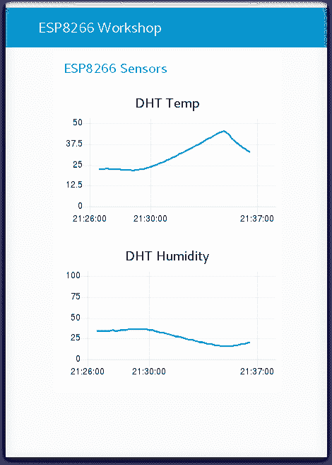

# 分析 IoT ESP8266 传感器数据

> 原文：[`developer.ibm.com/zh/tutorials/connect-a-soil-sensor-send-data-to-the-cloud-cfc-starter-kit-1/`](https://developer.ibm.com/zh/tutorials/connect-a-soil-sensor-send-data-to-the-cloud-cfc-starter-kit-1/)

*本教程是 [2020 年 Call for Code 全球挑战赛](https://developer.ibm.com/cn/callforcode/)的一部分。*

了解如何通过 MQTT 将 ESP8266 连接到 Watson IoT，并将环境数据从传感器以流的方式传输到 IBM Cloud。在本教程中，我们将从较高层面介绍一些步骤（来自我们的研讨会），帮助您了解 ESP8266 编程、IoT 安全性、MQTT、Watson IoT Platform、Node-RED、云存储、数据分析和可视化技术。

## 前提条件

在开始这个研讨会之前，您需要安装一些必备软件，并在 IBM Cloud 上有一个有效帐户。第 1 部分中提供了有关如何设置的详细信息。

## 步骤

1.  [第 1 部分](https://github.com/binnes/esp8266Workshop/blob/master/en/part1/README.md)：概述本课程，介绍硬件和开发工具，然后再对 ESP8266 设备编程，以便连接到本地 WiFi 网络并能够控制硬件。第 1 部分最后概述了 IBM Cloud（这是本次研讨会中使用的云平台），同时还确保您有一个具有所需资源的有效云帐户。

2.  [第 2 部分](https://github.com/binnes/esp8266Workshop/blob/master/en/part2/README.md)：研讨会的第二部分讨论 IBM Cloud 上的物联网服务，以及如何使用 MQTT 协议将设备连接到 IBM Cloud。本节还介绍了如何使用 SSL/TLS 安全性和证书来确保设备与云平台之间的安全连接。

3.  [第 3 部分](https://github.com/binnes/esp8266Workshop/blob/master/en/part3/README.md)：在本节中，我们将研究如何在 IBM Cloud 上使用名为 Node-RED 的低代码开发环境实现 IoT 解决方案的服务器端部分。您将创建一个仪表板来直观呈现 IoT 数据，并提供配置 ESP8266 设备的控件。服务器端应用程序还将控制连接到 ESP8266 的 LED。

4.  [第 4 部分](https://github.com/binnes/esp8266Workshop/blob/master/en/part4/README.md)：研讨会的最后一部分讨论如何使用分析技术从 IoT 数据中提取有用的信息。我们将向您介绍 IBM Cloud 上提供的分析服务，以及这些服务提供了哪些工具来帮助您从传感器数据中提取有用的信息。

本文翻译自：[Analyze IoT ESP8266 sensor data](https://developer.ibm.com/tutorials/connect-a-soil-sensor-send-data-to-the-cloud-cfc-starter-kit-1/)（2020-03-17）