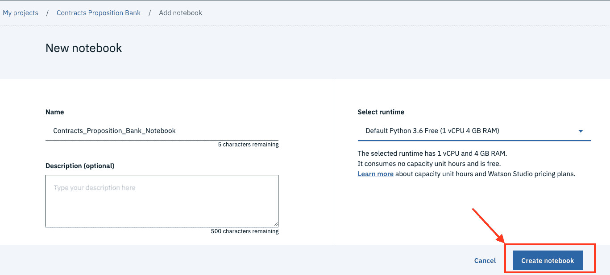

# Data Asset eXchange 入门

> 原文：[`developer.ibm.com/zh/tutorials/getting-started-with-the-data-asset-exchange/`](https://developer.ibm.com/zh/tutorials/getting-started-with-the-data-asset-exchange/)

[IBM® Data Asset eXchange (DAX)](https://developer.ibm.com/zh/exchanges/data/) 是一个供开发者和数据研究员在开放数据许可下查找免费开放数据集的在线中心。DAX 尤其侧重于[社区数据许可协议 (CDLA)](https://cdla.io/) 下的数据集。对于开发者，DAX 可以为人工智能 (AI) 开放数据集提供可信来源。这些数据集已经可以在企业 AI 应用程序中使用，并附带有相关的 Notebook 和教程。此外，DAX 还提供对各种 IBM 和 IBM 研究院数据集的特别访问，并提供与 [IBM Cloud](https://www.ibm.com/cloud) 和 AI 服务的各种集成。

目前，有 27 个跨不同领域的数据集，例如，音频、语言建模、时间序列、语音、图像等。通过在数据集登录页面中单击**获取此数据集**，可以从 Cloud Storage 下载数据集压缩包。

每个数据集均包括以下部分：

*   **概述**：数据集描述
*   **元数据**：关于数据格式、许可、领域、记录数量和数据大小的信息
*   **引用**：关于数据集作者和创建时间的信息

为帮助您开始使用数据集，DAX 提供了可处理数据的样本 Jupyter Notebook。

## 学习目标

通过完成本介绍性教程，了解如何在 Watson Studio 中使用这些 Notebook。

## 前提条件

要完成本教程，您需要：

*   一个 [IBM Cloud](https://cloud.ibm.com/login?cm_sp=ibmdev-_-developer-tutorials-_-cloudreg) 帐户。如果您还没有帐户，则可以注册一个免费的试用帐户。
*   [Watson Studio](https://dataplatform.cloud.ibm.com/?cm_sp=ibmdev-_-developer-tutorials-_-cloudreg)。如果您还没有 Watson Studio 实例，则可以[注册](https://dataplatform.cloud.ibm.com/?cm_sp=ibmdev-_-developer-tutorials-_-cloudreg)一个免费帐户。

## 预估时间

完成本教程大约需要 60 分钟。

## 使用样本项目探索数据集

Watson Studio 使用项目（project）来组织相关资源（例如，数据文件、Notebook 和模型）。某些 DAX 数据集包含一个样本项目，而样本项目中包含可用于执行数据清理、数据可视化、数据准备和数据建模的数据文件及 Notebook。在第一个模块中，您将执行以下操作：

*   导入 Weather 数据集的样本项目
*   探索项目资产
*   运行 Notebook

### 导入项目

1.  打开 [JFK Weather 数据集](https://developer.ibm.com/exchanges/data/all/jfk-weather-data/)。
2.  单击 **Explore in Watson Studio** 以打开此数据集的样本项目。

    

    此时会显示项目预览页面，其中提供了简短的项目摘要及其包含的资产。

    

3.  如果未显示 **Create project**，则先使用您的帐户登录。

4.  单击 **Create project** 以创建项目。此时会显示项目创建向导，并且已预先填写了项目名称和描述。

    

    在 Watson Studio 中，资产（例如，数据文件和 Notebook）存储在 Cloud Storage 中。在创建项目之前，必须将其与您帐户可访问的 Cloud Object Storage 实例相关联。

5.  从 **Define Storage** 部分的下拉菜单中选择存储服务实例（如果已显示），并跳过下一步。

    

6.  根据需要配置 Cloud Storage 服务实例。

    1.  单击 **Add**。

        

    2.  选择免费的 **Lite** 套餐或付费的 **Standard** 套餐，并创建服务。

        

    3.  单击 **Refresh**，并选择您刚配置的存储服务。

7.  单击 **Create** 来创建项目并关闭窗口。完成该操作后，将显示项目概述。

    

    项目视图分为以下几个选项卡：

    *   **Overview** – 获取项目资产和最新活动的摘要
    *   **Assets** – 获取项目中包含的 Notebook 和数据资产的列表
    *   **Environments** – 获取可用 Notebook 环境的概述
    *   **Jobs** – 查看调度的 Notebook 作业
    *   **Deployments** – 查看 Notebook 部署
    *   **Access Control** – 查看项目协作者列表
    *   **Settings** – 查看常规项目设置（例如，项目元数据和相关服务）
8.  在 **Overview** 选项卡中，滚动到 *Readme** 部分并查看此部分以了解有关项目内容的更多信息。

    

### 探索项目资产

现在，我们来查看已导入的项目中包含的部分资产。

1.  选择 **Assets** 选项卡。

    

    该项目包含一个名为 `jfk_weather.csv` 的 .CSV 格式数据文件以及两个 Python Notebook。

2.  单击 **Part 1 – Data Cleaning** Notebook 以在预览模式下将其打开。

滚动浏览该 Notebook 后，您会看到其代码输出单元是空的。您可通过打开项目 README 文件的预览链接来预览已完成的 Notebook。

要运行 Notebook，您必须在编辑模式下将其打开（将在下一节中执行此操作）。

### 运行 Notebook

1.  单击铅笔状的图标以在编辑模式下打开 Notebook。此时会启动运行时环境以用于运行该 Notebook。

    

2.  单击 **Run** 以运行该 Notebook 中的每个单元，并查看输出。

    

3.  单击路径导航条中的 **DAX Weather Project** 以返回项目概述。

    

4.  查看该 Notebook 的状态。您可以看到，即使您不再编辑该 Notebook，它的环境仍在继续运行。

    

    记住这一点很重要，因为正在运行的环境会消耗资源。Watson Studio 提供了一组默认的运行时环境，其中一些环境是免费的但可用资源有限。如果发现自己需要执行更多计算量大的代码块，那么您可能希望在另一个拥有更多资源（更多 RAM 和虚拟 CPU）的环境中运行这个 Notebook。默认情况下，如果您选择使用 Lite 层来设置 Watson Studio 项目，则每月将分配 50 个免费容量单位小时 (CUH) 。免费的 Tier 1 vCPU + 4 GB RAM 硬件配置在活动状态下不消耗任何 CUH。但是，这种余额可产生更多高级配置。您可以阅读有关 CUH 和 Watson Studio 运行时使用的[更多](https://dataplatform.cloud.ibm.com/docs/content/wsj/analyze-data/track-runtime-usage.html)内容（包括如何增加 CUH 余额）。

5.  停止活动的运行时环境。

    1.  在 **ACTIONS** 下，单击三个点（仅当将鼠标指针悬停在该区域时才会显示）。
    2.  选择 **Stop Kernel**。

        

    如果不再需要某个环境，请停止该环境。之所以要这样做，有两个理由：

    *   停止的环境不会消耗任何资源。因此，它不会占用您的 CUH 限额。
    *   您在任何时候都只能运行免费运行时环境的一个实例。

    您可通过再次单击三个点并选择 **Change environment** 来将不同的环境与 Notebook 相关联。

上面总结了 DAX Weather 样本项目的快速演练。如果您想拓展所学的知识，请尝试在第二个 Notebook 中进行一些新的数据探索，或者添加一个新的 Notebook 以使用清理过的数据构建一个天气预测模型。

在本模块中，您学习了如何：

*   将 DAX 数据集样本项目导入到 Watson Studio
*   浏览 Watson Studio 项目的菜单
*   运行 Notebook
*   停止和更改 Notebook 运行时环境

在下一个模块中，您将学习如何探索未打包在项目中的 DAX 数据集 Notebook。

## 使用 Notebook 探索数据集

DAX 上托管的某些数据集由单个 Notebook（而不是项目）进行补充。您可以将这些 Notebook 复制到现有项目中。在本模块中，您将执行以下操作：

*   在 Watson Studio 中创建项目
*   导入 DAX Notebook
*   运行 Notebook

### 创建项目

1.  浏览至 [IBM Watson](https://dataplatform.cloud.ibm.com/?cm_sp=ibmdev-_-developer-tutorials-_-cloudreg) 页面。
2.  如果系统提示您输入一个 ID，请提供您的帐户凭证。
3.  单击 *New project*。
4.  选择 **Create an empty project**。

    

    如果您感兴趣，可以阅读有关 [Watson Studio 项目](https://dataplatform.cloud.ibm.com/docs/content/wsj/getting-started/projects.html)的更多内容。

5.  输入项目 **Name** 和 **Description**。

6.  从 **Define Storage** 部分的下拉菜单中选择存储服务实例（如果已显示），并跳过下一步。

    

7.  根据需要配置 Cloud Storage 服务实例。

    1.  单击 **Add**。

        

    2.  选择免费的 **Lite** 套餐或付费的 **Standard** 套餐并创建服务。

        

    3.  单击 **Refresh**，并选择您刚配置的存储服务。

        

    4.  单击 **Create** 来创建项目。此时会显示项目概述。

        

现在，您已经有了一个项目，可以向其中导入样本 Notebook。

### 将样本 Notebook 复制到项目中

1.  打开 [Data Asset eXchange](https://developer.ibm.com/zh/exchanges/data/)。
2.  选择 **Contracts Proposition Bank** 数据集。
3.  在数据集页面上单击 **Try the notebook**。

    

4.  单击复制图标。

    

5.  从下拉列表中选择您刚刚创建的空项目。此时会显示 **New notebook** 向导。

    

6.  为此 Notebook 选择一个运行时环境。如果您不确定要选择哪个运行时环境，请根据您在第一个模块中学到的知识，选择 **Default Python 3.6 Free**。

    

7.  要探索此 Notebook，请单击 **Run** 以运行每个单元。

    

在本模块中，您学习了如何：

*   在 Watson Studio 中创建空项目
*   将 DAX 数据集样本 Notebook 导入到 Watson Studio
*   运行 Notebook

## 结束语

在本教程中，您了解了 Data Asset Exchange，并掌握了如何使用 Watson Studio 项目和 Notebook 来探索其数据集。

本文翻译自：[Get started with the Data Asset eXchange](https://developer.ibm.com/tutorials/getting-started-with-the-data-asset-exchange/)（2020-02-24）