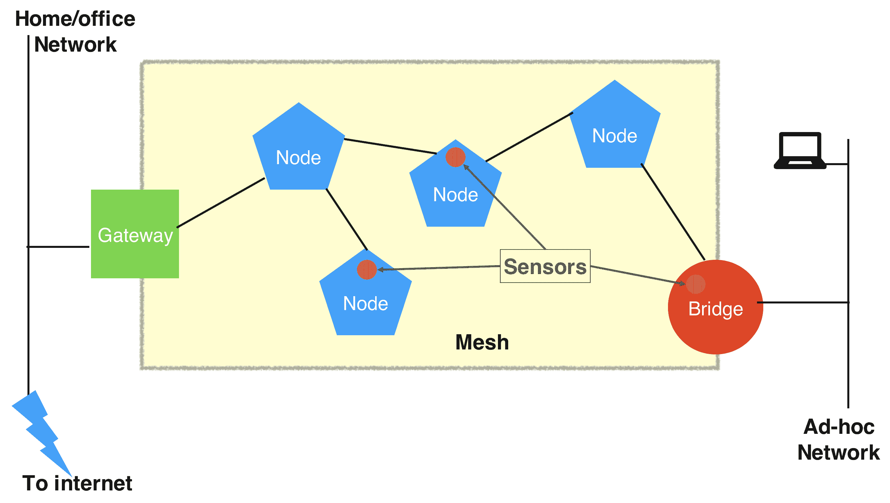
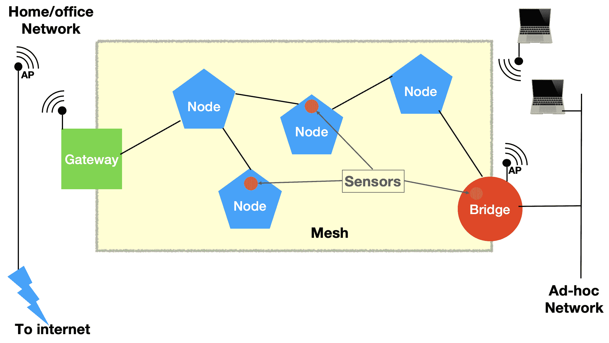

# 为 IoT Edge 配置网格网络

> 原文：[`developer.ibm.com/zh/tutorials/create-iot-mesh-network/`](https://developer.ibm.com/zh/tutorials/create-iot-mesh-network/)

本教程是 [2020 年 Call for Code 全球挑战赛](https://developer.ibm.com/cn/callforcode/) 的一部分。

2018 年 Call for Code 全球挑战赛大奖得主 Project Owl 实现了一个 IoT 硬件解决方案，在部署这个解决方案后便会创建一个网格网络。虽然网格网络拓扑并不是新鲜事物，随着 IoT 硬件的价格越来越低，网格网络成为了一个更加可行的 IoT 解决方案。

在本教程中，我们将介绍研讨会中以下操作所涉及的高级步骤：使用 Raspberry Pi 通过 wifi 设置网格网络，使用网格网络将传感器连接到 Internet 并允许其他未参与网格网络的设备通过网格网络连接到 Internet。 下图显示了此网格网络拓扑。

要详细了解网格网络的概念以及为何网格网络在 IoT 解决方案中大有用处，请阅读有关[网格网络]的研讨会部分([`github.com/binnes/WiFiMeshRaspberryPi/blob/master/part1/MESH.md)。`](https://github.com/binnes/WiFiMeshRaspberryPi/blob/master/part1/MESH.md)。)

为 IoT Edge 配置网格网络涉及到以下三个主要步骤：

1.  设置网格网络

2.  使用 wifi 连接网格网络

3.  创建一个可通过网格网络发送传感器数据的 IoT 应用

## 先决条件

这个网格网络需要至少 2 个 Raspberry Pi，使用 SD 卡来保存文件系统，并且每个 Pi 都需要电源。 还需要温湿传感器和一个 RGB LED 灯。 另外，还需要以太网连接，或者 wifi 连接，当然还需要 Internet 连接。

您可以使用 IBM Cloud 帐户完成本教程。

*   创建一个 [IBM Cloud 帐户](https://cloud.ibm.com/registration?cm_sp=ibmdev-_-developer-tutorials-_-cloudreg)。
*   登录到 [IBM Cloud](https://cloud.ibm.com/login?cm_sp=ibmdev-_-developer-tutorials-_-cloudreg)。

有关此项目的必备硬件、软件和知识的完整列表，请阅读研讨会 README [先决条件](https://github.com/binnes/WiFiMeshRaspberryPi/blob/master/README.md#prerequisites)部分。

1

## 设置网格网络

在第 1 步中，您通过 wifi 设置网格网络，并设置网格设备的网络访问。 您将使用以太网连接将网格网络连接到您的家庭或办公室网络，并允许非网格设备使用网格网络访问 Internet。

1a

### 通过 wifi 创建一个网格网络

我们使用 batman-adv 标准 Linux kernel 模块在 Raspberry Pi 上创建网格网络。该模块将使 Pi 能够通过网格网络发送网络流量。

遵循我们研讨会中[构建网格网络](https://github.com/binnes/WiFiMeshRaspberryPi/blob/master/part1/PIMESH.md) 一节中的步骤。

1b

### 设置网格设备的网络访问

现在您已经创建了网格网络，您需要允许网格网络的节点访问 Internet。为此，需要向网格网络添加网关设备。此外，您还需要允许非网格设备使用网格网络访问 Internet 和网格网络的其他节点。为此，需要向网格网络添加网桥设备。

完成我们研讨会中[网络访问](https://github.com/binnes/WiFiMeshRaspberryPi/blob/master/part1/ROUTE.md)一节中的步骤。

2

## 使用 wifi 连接网格网络

在可选的第 2 步中，您可以使用 wifi（而不是以太网）将网关设备连接到您的家庭或办公室网络，并将网桥设备转换为 wifi 热点，这样您就可以将连接 wifi 的设备连接到网格网络中。下图显示了使用 wifi 的网格网络。

如果您不需要启用 wifi 的网关或网桥设备，您可以跳过这一步，转到第 3 步。

2a

### 通过 wifi 将网关连接到网络

要将以太网连接转换为 wifi 连接，并通过网关设备利用 wifi 连接路由网格流量，请完成研讨会中 [wifi 网关](https://github.com/binnes/WiFiMeshRaspberryPi/blob/master/part2/WIFIGW.md)一节中的步骤。

2b

### 创建网桥接入点

要将网桥节点转换为接入点并使通过接入点的网络流量能够访问网格网络，请完成研讨会中 [wifi 网桥](https://github.com/binnes/WiFiMeshRaspberryPi/blob/master/part2/WIFIBRDG.md)一节中的步骤。

3

## 创建一个可通过网格网络发送传感器数据的 IoT 应用

最后，在第 3 步中，您将构建一个物联网应用程序，用于收集传感器数据并使用网格网络将传感器数据发送到 IBM Cloud。IBM Cloud 应用接收和处理传感器数据，并将命令发送回 Raspberry PI，以设置 Pi 上 LED 灯的颜色。

在这个步骤中，您连接传感器，安装 Node-RED 和一些 Node-RED 包，在 IBM Cloud 中创建 IoT 应用，并将传感器数据通过网格网络发送到 Watson IoT 平台。

完成研讨会的[第 3 部分](https://github.com/binnes/WiFiMeshRaspberryPi/tree/master/part3) 中的步骤。

## 结束语及后续步骤

通过本教程，我们试图揭秘为 IoT Edge 配置网格网络的过程。 你能想到其他可以利用网格网络的 IoT 解决方案吗？

本教程翻译自：[Configuring mesh networking for the IoT Edge](https://developer.ibm.com/technologies/iot/tutorials/create-iot-mesh-network)（2020-02-17）