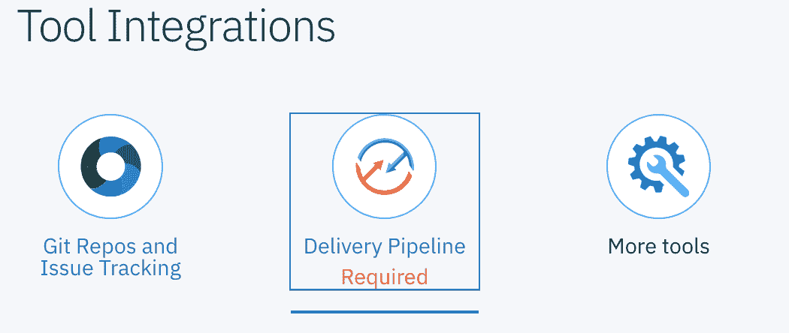
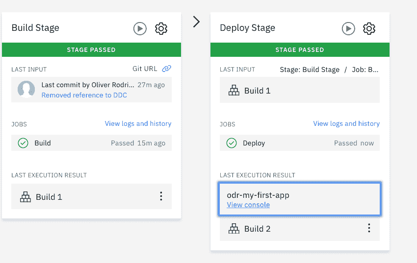

# 在 IBM Cloud 部署您的第一个应用程序

> 原文：[`developer.ibm.com/zh/tutorials/deploy-your-first-app-to-ibm-cloud/`](https://developer.ibm.com/zh/tutorials/deploy-your-first-app-to-ibm-cloud/)

在本次挑战中，您将学习如何使用自动化部署，通过 IBM Cloud DevOps Toolchain 将您的第一个 Cloud Foundry 应用程序部署到 IBM Cloud。工具链随后将构建应用程序，当您在稍后的步骤中单击 **Deploy to IBM Cloud** 按钮时，工具链会将应用程序部署到 IBM Cloud。

将为您创建的工具链如下所示：

此工具链包含四个组件：

1.  Issue（问题）管理，通过 IBM Cloud 上托管的 GitLab 实例来实现。
2.  IBM Cloud 上托管的 Git 存储库。
3.  Eclipse Orion Web IDE。
4.  Delivery Pipeline（交付管道），用于构建应用程序并部署到 IBM Cloud。

用于构建和部署应用程序的管道如下所示：

此管道有以下两个步骤：

1.  构建：将从将您的存储库中拉取应用程序代码并且将构建依赖项。
2.  部署：应用程序的构建工件随后将被部署到 IBM Cloud。

## 应用程序和工具链文件

这个简单的应用程序使用 Vue.js 框架来显示一个简单的单页应用程序。它使用 webpack 将前端文件打包成静态资产。然后，Node.js 和 Express 框架为应用程序提供服务。

Vue.js 应用程序文件位于[此挑战的存储库](https://github.com/omidmeh/ddc-challenge-1)的 `/src` 目录中。这些文件随后由 webpack 打包到 `/dist` 文件夹中。

Node.js 文件 `/bin/www` 和 `app.js` 使用 Express 来为前端应用程序提供服务，而 `/routes` 包含了用于将请求路由到主页的文件。

我们使用默认的[工具链模板](https://github.com/open-toolchain/default-toolchain)来构建工具链。

在此存储库中，`/.bluemix` 目录包含工具链和管道文件。

*   `toolchain.yml` 包含工具链的结构，包括克隆存储库、管道和 Web IDE 集成。

*   `pipeline.yml` 包含管道的定义，在此情况下，仅包含两个阶段：*构建*和*部署*。

## 前提条件

您必须首先注册一个 IBM Cloud 帐户才能完成本挑战。

## 预估时间

完成本挑战大约需要 10 分钟。

## 步骤

1.  单击下面的 **Deploy to IBM Cloud** 图片：

    

2.  系统将提示您登录 IBM Cloud。如果您尚未登录，请输入您的帐户信息。

3.  此时将打开工具链创建页面。为工具链输入一个新名称。记下在 **Select Region** 下面显示的区域，在后面的部分中您将需要使用此区域名称。区域不一定是下图中显示的 *Dallas*，因为工具链会尝试选择距离您最近的区域。

    

4.  在 Tool Integrations 部分中单击 **Delivery Pipeline**。您需要更新管道配置设置。

    

5.  单击 **IBM Cloud API Key** 字段旁边的 **Create** 按钮。此时将打开一个弹出窗口。

    

6.  此窗口询问是否要为该管道创建一个新的 API 秘钥。单击 **Create**。

    

7.  您将看到会显示 **Region**、**Space** 和 **Organization** 等信息。如果没有显示任何组织或空间，请更新 **Region** 字段。特别注意，如果系统选择了 *Washington DC*，请切换到 *Dallas* 地区。

    

8.  单击页面右上角的 **Create**。此时将显示新工具链。

9.  您可以单击管道查看正在构建的应用程序，也可以一直保留在工具链页面上，直到管道构建完成。
10.  在工具链页面中，单击 Deploy pipeline 磁贴上的 **View Console** 以转至应用程序控制台。

    

11.  单击 **Visit App URL** 以从 App Console 中打开应用程序。

    **注意**：由于 Internet Explorer 和 Microsoft Edge 的局限性，此应用程序将无法在这两种浏览器中显示。我们建议您改为使用 Firefox、Chrome 或 Safari 打开应用程序。

    

如果正确完成了所有步骤，您将在新应用程序的主页上看到以下图像：

## 结束语

在本挑战中，您使用 IBM Cloud DevOps Toolchains 部署了您的第一个应用程序，该工具链支持您自动构建应用程序并将其推送至 IBM Cloud。一定要探索您新部署的应用程序，并记住完成其他挑战。

本文翻译自：[Deploy your first app to IBM Cloud](https://developer.ibm.com/technologies/devops/tutorials/deploy-your-first-app-to-ibm-cloud)（2019-10-25）