# 在 Python 中使用 pandas 进行数据分析

> 原文：[`developer.ibm.com/zh/tutorials/data-analysis-in-python-using-pandas/`](https://developer.ibm.com/zh/tutorials/data-analysis-in-python-using-pandas/)

*本教程是 [2020 年 Call for Code 全球挑战赛](https://developer.ibm.com/cn/callforcode/)的一部分。* 本教程已纳入[使用 Python 执行数据分析](https://developer.ibm.com/zh/series/learning-path-data-analysis-using-python/)学习路径。

| 级别 | 主题 | 类型 |
| --- | --- | --- |
| 100 | [在 Python 中使用 pandas 执行数据分析](https://developer.ibm.com/zh/tutorials/data-analysis-in-python-using-pandas) | 教程 |
| 101 | [使用 Python 处理地理空间数据的简介](https://developer.ibm.com/zh/articles/introduction-to-geospatial-data-using-python/) | 文章 |
| 201a | [在 Python 中处理地理空间向量数据](https://developer.ibm.com/zh/tutorials/working-with-geospatial-vector-data-in-python/) | 教程 |
| **201b** | **[在 Python 中处理地理空间栅格数据](https://developer.ibm.com/zh/tutorials/working-with-geospatial-raster-data-in-python/)** | 教程 |

## Python 概述

您可能会认为 Python 只适用于开发者以及拥有计算机科学学位的人员。然而，Python 很适合初学者，即使是没有多少编码经验也无妨，因为 Python 免费、开源，并且可在任何平台上运行。Python 软件包文档很棒，在学习了[入门课程](https://cognitiveclass.ai/learn/data-science-with-python)之后，您就掌握了一定的基础。

Python 是一种通用的高级编程语言，不仅仅用于处理数据。例如，它适合于开发桌面 GUI 应用程序、网站和 Web 应用程序。然而，本教程关注的是数据，并且只涉及数据处理入门。

## 非结构化数据与结构化数据

数据大致分为非结构化数据和结构化数据。非结构化数据是大部分为格式自由、数据类型不一致的数据。医生的手写处方和从博客中收集的影评是两个非结构化数据的例子。同时，结构化数据是以特定格式提供的信息，因此易于阅读。NoSQL 数据库中的表，变量作为列，记录作为行或者键值对就是一个结构化数据的例子。

## pandas 简介

pandas 是一个开源的 Python 库，可提供高性能的数据处理和分析。将 Python 与 pandas 组合使用，无论数据来源如何，您都可以完成五个典型的数据处理和分析步骤：加载、准备、操作、建模和分析。

在使用 pandas 进行数据处理时，有很多选项。下面的列表显示了利用 pandas 可以完成的一些操作。

*   通过删除或替换缺失值来清理数据
*   转换数据格式
*   行排序
*   删除或添加行和列
*   合并或连接数据帧
*   以透视或重塑的方式汇总数据
*   创建可视化效果

这个列表只是列出了一小部分操作。要了解能够实现的更多操作，请参阅 pandas [文档](https://pandas.pydata.org/docs/)。

本教程使用包含伦敦各行政区信息的结构化数据向您介绍 pandas 一些最有趣的特性。您可以从 [data.gov.uk](https://data.gov.uk/dataset/248f5f04-23cf-4470-9216-0d0be9b877a8/london-borough-profiles-and-atlas) 下载本教程中使用的数据。

## Jupyter Notebooks 入门

您可以在一个程序中完成所有数据分析，而不必在文本文件中编写代码，然后又要在终端中使用 Python 命令运行代码。借助 [Jupyter Notebooks](https://jupyter.org/)，可以在任何浏览器中的一个窗口中编辑和查看代码、输出、表格和图表。顾名思义，Jupyter Notebooks 是一种 Notebook，可在一个位置保存您所有的想法和数据探索。在本教程中，您将使用 [IBM Watson Studio](https://dataplatform.cloud.ibm.com/docs/content/wsj/getting-started/overview-ws.html) 来运行 Notebook。为此，您需要一个免费的 IBM Cloud 帐户。下面的步骤会向您展示如何注册和开始。在 Notebook 启动和运行后，便可以浏览 Notebook。

## 先决条件

要完成本教程，您需要：

*   一个 [IBM Cloud](https://cloud.ibm.com?cm_sp=ibmdev-_-developer-tutorials-_-cloudreg) 帐户
*   [Watson Studio](https://dataplatform.cloud.ibm.com/docs/content/wsj/getting-started/overview-ws.html)

## 步骤

### 设置

1.  注册或登录 IBM Cloud。

2.  单击 Resources 页面顶部的 **Create Resource**。您将在左上角的汉堡包菜单下看到资源。

    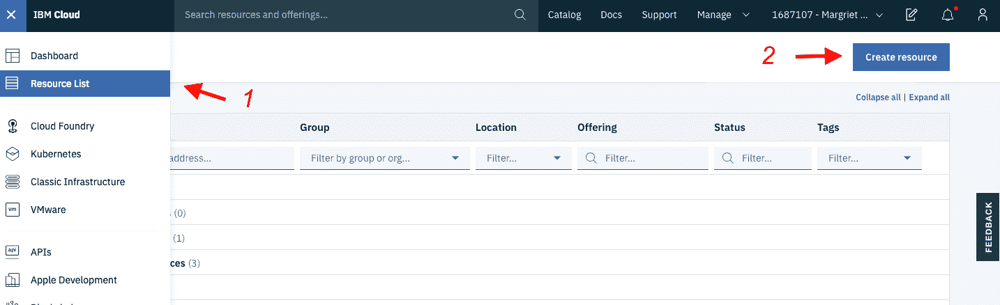

3.  搜索 **Watson Studio** 服务并单击该图块。

    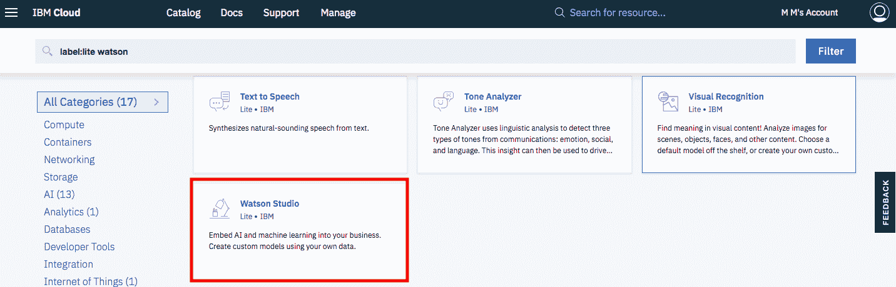

4.  选择 Lite 套餐，然后单击 **Create**。

5.  回到 Resources 列表，单击 Watson Studio 服务，然后单击 **Get Started**。

    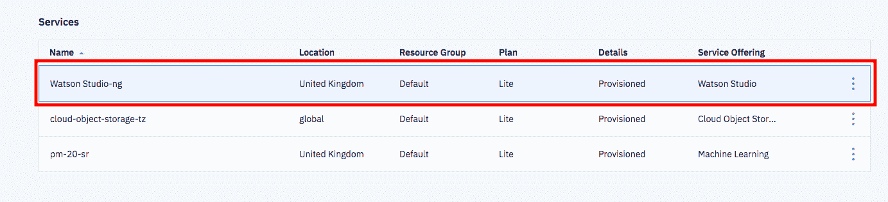

    您现在应该已经进入 Watson Studio 中了。

6.  单击 **Create a project** 或 **New project**。

7.  选择 **Create an empty project**。
8.  命名项目。
9.  选择一个现有的 Object Storage 服务实例，或者创建一个新的用于存储 Notebook 和数据。注意：返回到 Project 页面后别忘了单击刷新。
10.  单击 **Create**。

# 加载并运行一个 Notebook

1.  单击 **Add to project**，然后单击 **Notebook** 以添加新 Notebook。

    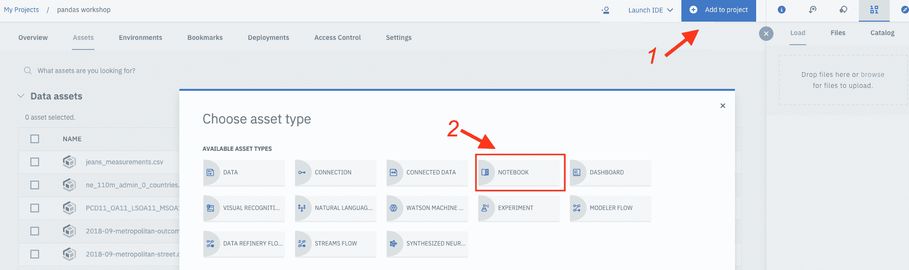

2.  下载 Notebook。

3.  从 **From File** 菜单中选择一个新 Notebook。
4.  选择下载的 Notebook。
5.  选择默认运行时。
6.  单击 **Create Notebook**。此时将加载 Notebook。
7.  运行该 Notebook。在打开的 Notebook 中，单击 **Run** 可一次运行一个单元。

## Notebook 概述

以下列表列出了在本教程中介绍的 pandas 的一些功能。

*   数据探索（加载数据、系列和数据帧）
*   数据转换（清理数据、选择数据、合并数据和分组数据）
*   数据可视化

与本教程相关联的 Notebook 可展示 pandas 的更详细功能。

# 数据探索

#### 加载数据

只要数据格式一致，并且有多个包含数字、文本或日期的记录，那么通常就可以用 pandas 读取数据。例如，可以使用以下命令，将 Excel 表中保存的逗号分隔的文本文件加载到 Notebook 中。

```
import pandas as pd
df = pd.read_csv('data.csv') 
```

您可以用类似方法加载[其他](https://pandas.pydata.org/pandas-docs/stable/user_guide/io.html) 格式的数据文件，如 HTML、JSON 或 Apache Parquet。

#### 系列和数据帧

`系列`是一个一维标签数组，可以包含任何类型的数据（例如，整数、字符串、浮点数或 Python 对象）。

```
s = pd.Series([1, 3, 5, np.nan, 6, 8])
s 
```

数据帧是一种二维数据结构。数据由行和列组成，可以以各种方式创建这些行和列。例如，可以加载文件，也可以使用 NumPy 数组和日期作为索引。[NumPy](https://numpy.org/) 是一个 Python 库，可处理多维数组和矩阵（矩阵中包含要对这些数组运行的大量算数函数集合）。

以下代码是数据帧 `df1` 的示例，其中以日期作为索引，以 6×4 的随机数数组作为值，列名称是 A、B、C 和 D。

```
dates = pd.date_range('20200101', periods=6)
numbers = np.random.randn(6, 4)
df1 = pd.DataFrame(numbers, index=dates, columns=['A', 'B', 'C', 'D'])
df1 
```

运行前面的代码将生成类似下图的输出。该 Notebook 展示了创建数据帧的另外几种方法。

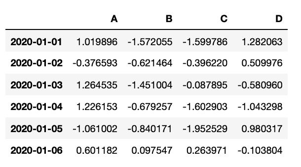

#### 选择数据

要选择数据，您可以使用 `.loc[]` 来访问带有标签的单独一行或者一组行和列。（这仅适用于设置为索引的列。）或者，使用 `.iloc[]` 按照某个位置来选择数据。

```
boroughs = df.copy()
boroughs = boroughs.set_index(['Code'])
boroughs.loc['E09000001', 'Inland_Area_(Hectares)'] 
```


```
boroughs.iloc[0] 
```

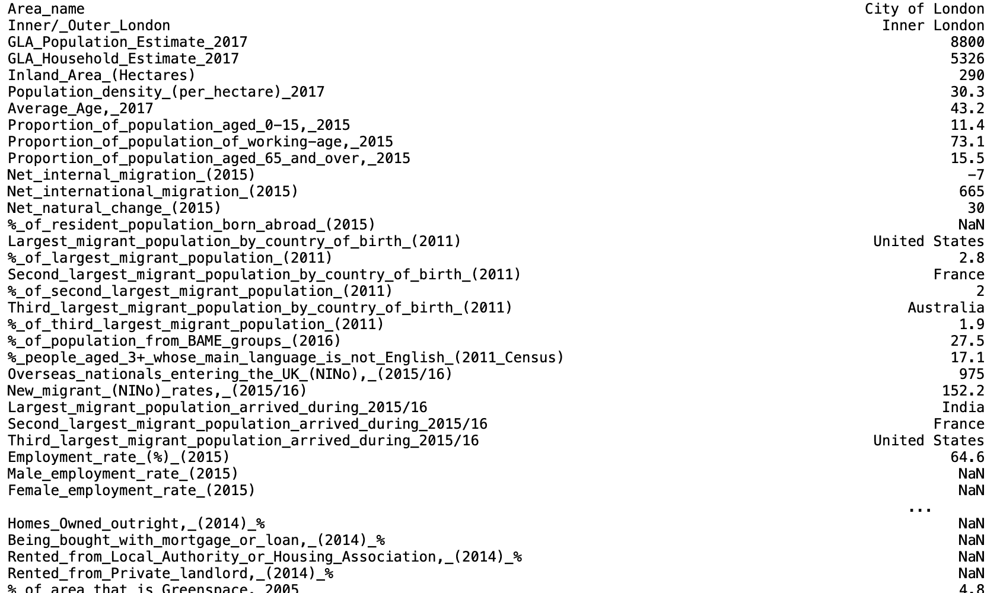

```
boroughs.iloc[:,1] 
```

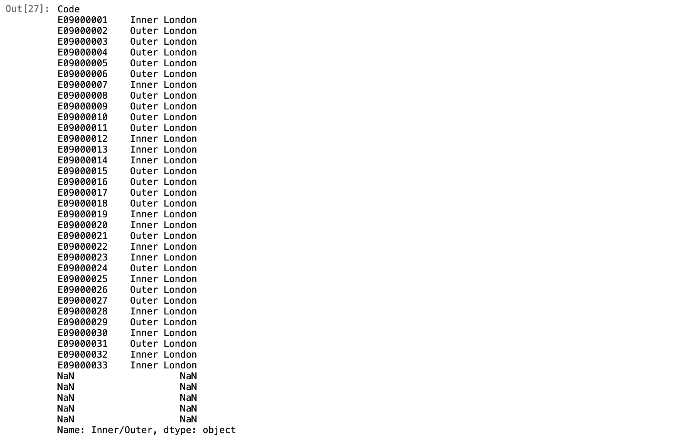

要根据特定条件选择行，可以使用布尔索引。这将使用数据帧中数据的实际值，而不是行和列标签或索引位置。可以使用 &、| 和 == 运算符来合并不同的列。

### 数据转换

#### 清洁数据

在探索数据时，总是需要转换才能获得分析、可视化或模型所需的格式。最好的学习方法是找到一个数据集并尝试用数据回答问题。在清理数据时，请检查以下几个方面：

*   数据是否整齐，如每个变量构成一列，每个观测构成一行，每种类型的观测单位形成一个表？
*   所有列是否采用正确的数据格式？
*   是否缺少值？
*   是否存在不切实际的异常值？

以下代码显示了如何使用 pandas 在数据集中添加列和删除可能不需要的列。

```
boroughs['new'] = 1
boroughs.head() 
```

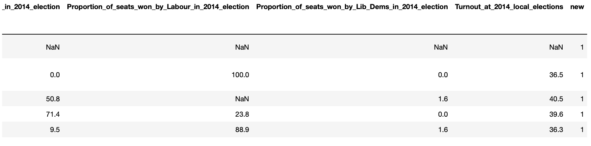

```
boroughs = boroughs.drop(columns='new')
boroughs.head() 
```

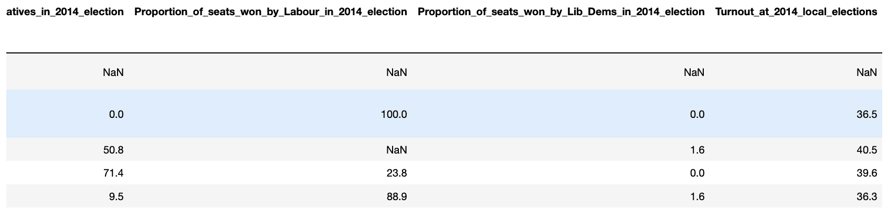

#### 合并数据

组合或合并数据时，pandas 有几个不同选项。[文档](https://pandas.pydata.org/pandas-docs/stable/user_guide/merging.html)介绍了这些示例。在该 Notebook 中，您将创建两个新的数据帧以探索如何合并数据。然后您将使用 `append()` 来合并这些数据帧。

```
data = {'city':       ['London','Manchester','Birmingham','Leeds','Glasgow'],
        'population': [9787426,  2553379,     2440986,    1777934,1209143],
        'area':       [1737.9,   630.3,       598.9,      487.8,  368.5 ]}
cities = pd.DataFrame(data)

data2 = {'city':       ['Liverpool','Southampton'],
        'population': [864122,  855569],
        'area':       [199.6,   192.0]}
cities2 = pd.DataFrame(data2)

cities = cities.append(cities2)
cities 
```

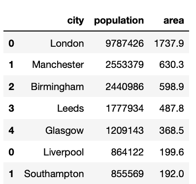

#### 分组数据

数据分组是一种快速对数据帧中的类进行求值的方法。

```
boroughs.groupby(['Inner/Outer']).mean() 
```

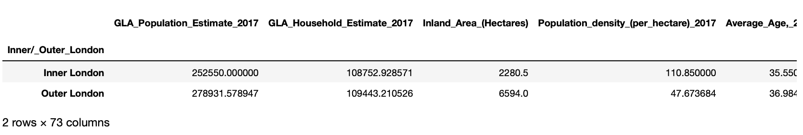

当有多个类别变量时，您可以创建一个嵌套索引。

```
boroughs.groupby(['Inner/Outer','Political control']).sum().head(8) 
```

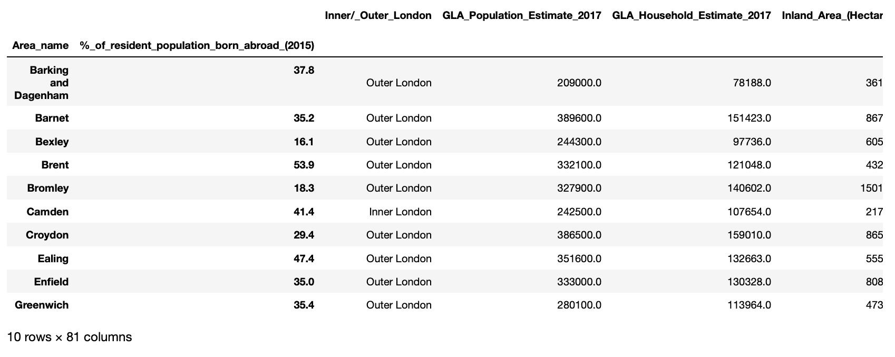

### 数据可视化

pandas 中的可视化使用 Matplotlib 库。此绘图库使用面向对象的 API 将绘图嵌入到应用程序中，例如折线图、直方图、散点图、图像图和 3D 图。在本教程中，我们使用 matplotlib.pyart，这是一组命令样式的函数，让 matplotlib 像 MATLAB 一样工作。

下面的示例通过直方图显示就业率的可视化图像。您可以更改箱数，以获得要在直方图中的输出结果。

```
%matplotlib inline

import matplotlib.pyplot as plt

boroughs = boroughs.reset_index()

boroughs['Employment_rate_(%)_(2015)'].plot.hist(bins=10); 
```

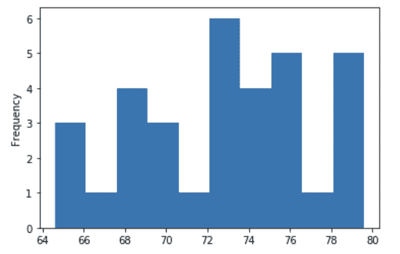

## 结束语

本教程向您介绍了安装 IBM Cloud、Watson Studio 和 Jupyter Notebook 的步骤。还概要介绍了使用 pandas 分析数据的方法，以及您可以自行运行并尝试使用的 Notebook。

本教程翻译自：[Data analysis in Python using pandas](https://developer.ibm.com/tutorials/data-analysis-in-python-using-pandas/)（2020-02-25）