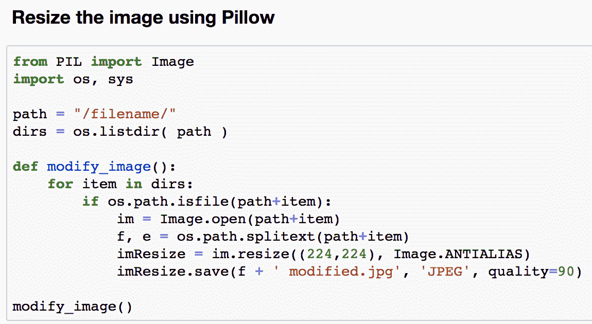
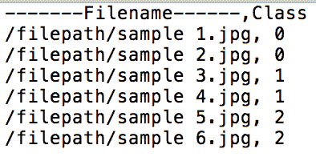
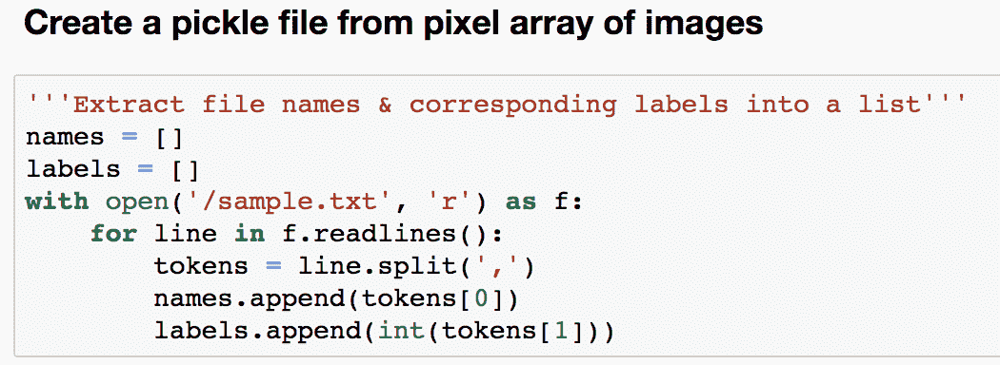
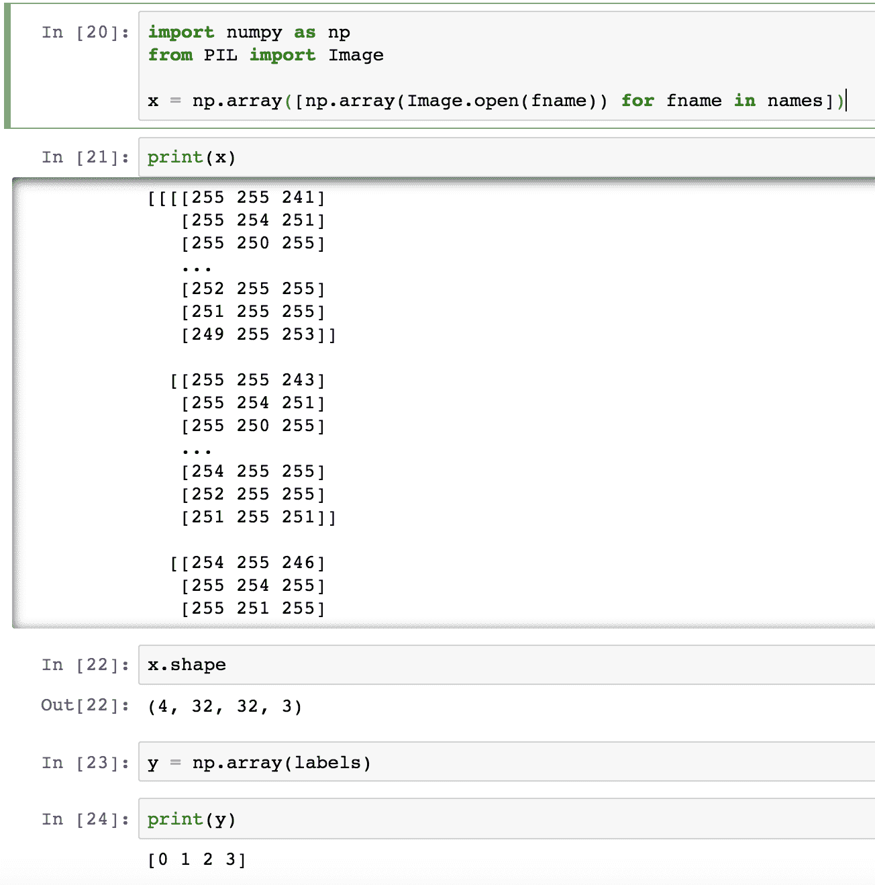
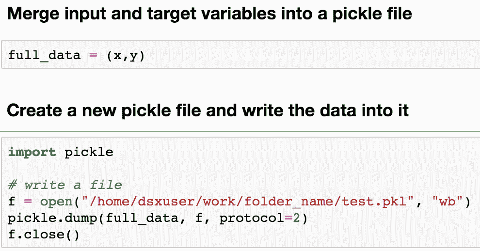
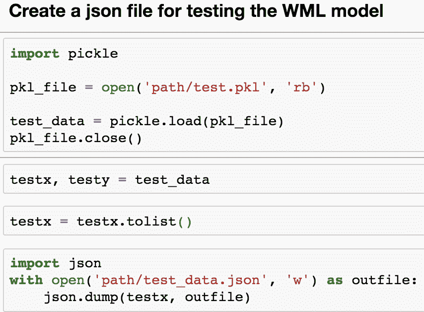
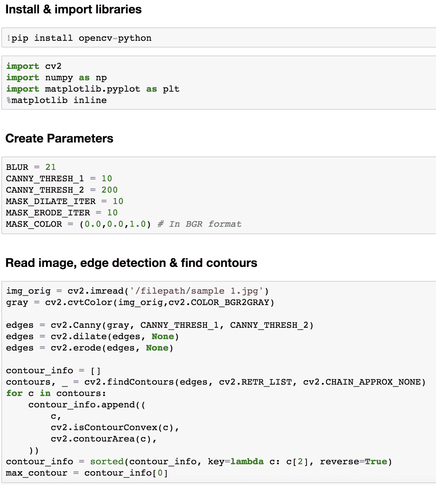
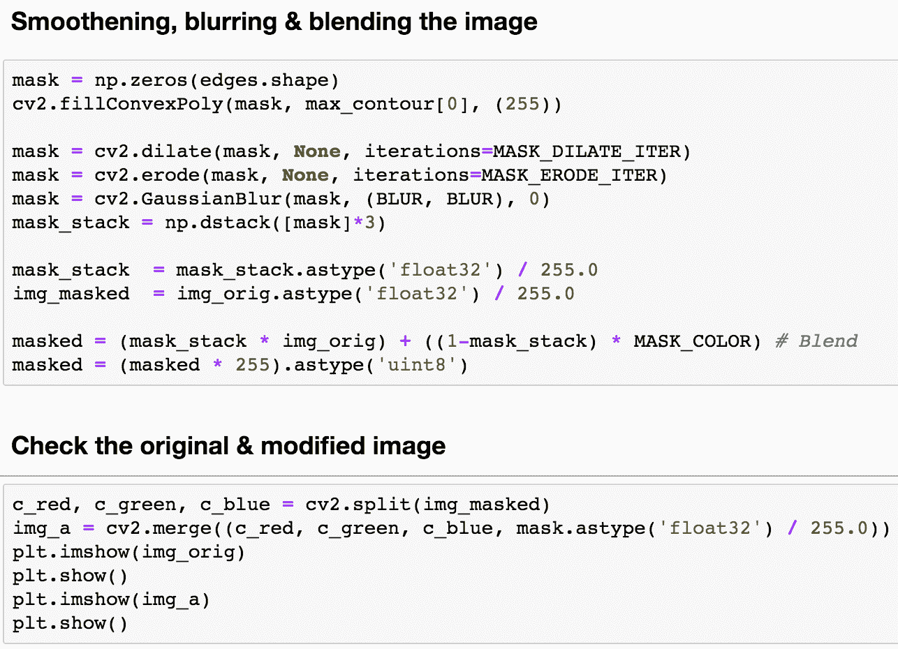
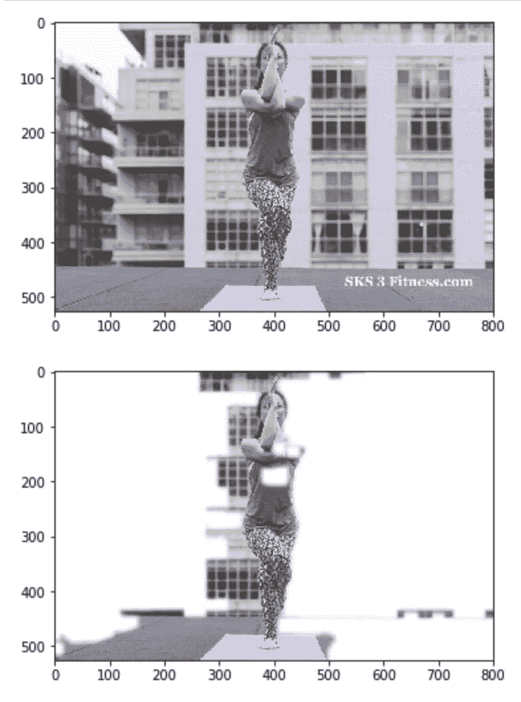

# 使用 Watson Studio 和 Deep Learning as a Service 对瑜伽姿势进行多类图像分类

> 原文：[`developer.ibm.com/zh/tutorials/image-preprocessing-for-computer-vision-usecases/`](https://developer.ibm.com/zh/tutorials/image-preprocessing-for-computer-vision-usecases/)

现在，计算机视觉技术日趋成熟，在某些情况下，机器必须根据图像类别对图像进行分类以帮助作出决策。在本教程中，我们演示了一种预处理图像的方法，能够删除不必要信息，帮助模型有效地学习图像的特征，从而提高准确性。本教程讨论了在将图像提取到模型构建过程之前，对图像进行预处理的几种方法。这些方法包括调整图像的大小，创建图像的像素阵列和使用 pickle 处理数据以及从图像中去除背景噪声。

本教程必须与[使用 Deep Learning as a Service 创建用于图像分类的预测系统](https://developer.ibm.com/cn/patterns/create-a-predictive-system-for-image-classification-using-deep-learning-as-a-service/) Code Pattern 一起使用，以实验预处理中的不同步骤，了解它们对结果的影响，也就是对图像分类的预测准确性的影响。

## 前提条件

要学习本教程，您应该了解 Python、计算机视觉、深度学习以及 IBM Cloud 环境和服务。

## 预估时间

完成本教程大约需要 45 到 60 分钟。

## 步骤

### 调整图像大小

调整图像大小是一个重要步骤，在这一步骤中，会将图像标准化并调整为特定形状，通常为 224/224。图像有不同的大小，为帮助模型更好地学习，您必须调整图像的大小以避免多余的填充。预先训练的模型还要求再将图像提取到模型之前调整图像大小。以下代码显示了如何使用 Pillow 调整图像大小。

### 使用 pickle 处理数据

使用 pickle 处理图像数据的主要原因是将图像从 .jpeg 或 .png 格式转换为输入的像素及格式。这种数组可帮助任何模型（机器学习、深度学习和预训练）学习图像特征并理解任何给定类的模式，从而提高模型的准确性。在以下步骤中，我们创建一个像素数组并将其写入 pickle 文件中。

1.  定义输入。

    

2.  通过图像的像素数组创建一个 pickle 文件。

    

3.  将原始图像数据转换为像素数组。 

4.  将输入变量和目标变量合并到 pickle 文件中，然后创建一个新的 pickle 文件并将数据写入其中。 

从先前的图像中，您可以使用文本文件定义输入和目标参数，将原始图像数据转换为像素数组，然后将它们转储到 pickle 文件中，以供深度学习模型使用。**对于 TensorFlow 或 Keras 等深度学习框架以及使用 Watson Machine Learning 中的超参数优化创建深度学习实验而言，必须执行此步骤。**重复此过程三遍，以创建、训练、测试和验证 pickle 文件。需要记住的另一点是，所有图像都应具有相同的大小，这样才能使用 pickle 处理数据，这就是为什么必须首先调整图像大小。

### 创建测试数据 JSON

如果必须提供 JSON 格式的测试数据才能让模型获取预测，则必须执行此步骤。Watson Machine Learning 要求输入数据为 JSON 格式才能实时评分。以下代码段读取 pickle 文件，将其拆分为输入和目标，然后将其写入到 JSON 文件中。

### 消除背景噪声

此步骤是通过删除图像背景来增强准确性。图像由特征组成，如果目标是识别人物或物体，那么我们可以尝试删除相关特征之外的所有其他特征。以下代码示例演示了我们如何尝试识别人物的姿势并删除大多数不相关的其他特征。

删除背景的其他一些方法包括：

*   分水岭方法
*   GrabCut 方法
*   背景减除器

还有更多资源可供探索，帮助您了解有关背景删除的更多信息。

## 结束语

在本教程中，我们讨论了图像预处理中包含的一些步骤。这些步骤可以帮助预处理图像，还可以增强模型的准确性。您应该尝试使用这些参数，并在必要的情况下添加新参数以获取所需的输出。这个列表并非详尽无遗，但可以帮助您入门。

图像分类深度学习方法的实现应该与[使用 Deep Learning as a Service 创建用于图像分类的预测系统](https://developer.ibm.com/cn/patterns/create-a-predictive-system-for-image-classification-using-deep-learning-as-a-service/) Code Pattern 一起使用。浏览之前的步骤并了解如何通过图像预处理来改进模型性能。

本教程翻译自：[Multiclass image classification of yoga postures using Watson Studio and Deep Learning as a Service](https://developer.ibm.com/technologies/vision/tutorials/image-preprocessing-for-computer-vision-usecases)（2019-11-04）