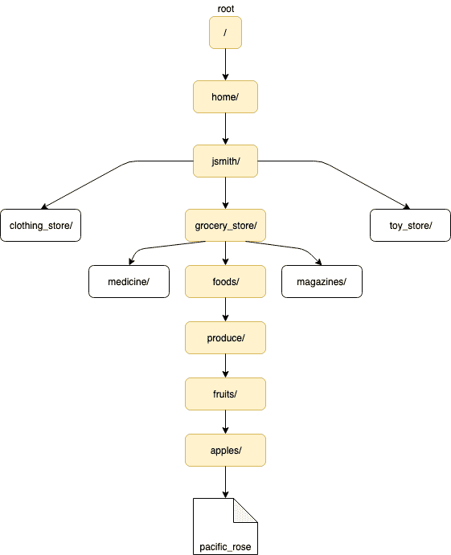

# Linux 基础知识：学习容器之前的必备知识

> 原文：[`developer.ibm.com/zh/tutorials/linux-basics-and-commands/`](https://developer.ibm.com/zh/tutorials/linux-basics-and-commands/)

为了获得部署、管理和维护现代云技术所需的技能，您需要了解大量有关当前主题的必备信息：Linux® 命令和概念。由于许多现代云技术都以 GNU/Linux 操作系统为核心，因此本教程将带您逐步了解 Linux 命令行界面 (CLI) 的一些基础知识，并且随着您阅读我们的一些有关 Docker 和 Kubernetes 的文章和教程以及我们的入门级 [Kubernetes 学习路径](https://developer.ibm.com/cn/blog/2020/kubernetes-learning-path/)，让您准备好使用 CLI。如果您是 Linux 新手，那么本教程可以为您提供简单的用法介绍。对于已经入门的用户，我希望本教程能使您想到一些命令概念，或许能向您介绍一些新知识。

## 文件和目录

我们首先专门介绍标准 GNU/Linux 操作系统的基本文件结构。标准 GNU/Linux 操作系统具有一种文件管理层次结构，用于组织计算机上存储的数据。确定特定数据的存储位置是开始了解操作系统的结构方式的初步课程之一。为了避免低估您现有的 Linux 体验，我暂时不讨论“Linux 文件系统层次结构简介”。更好的是，这里有一篇详实的文章，其中详细地介绍了[文件系统层次结构](https://www.linux.org/threads/file-hierarchy-standard-fhs.9999/)。这里，我们假设您知道学习方法，所以我将向您提供一些有关如何轻松浏览的提示（或者可能是一些提醒）。当您需要编辑文件，浏览文件系统，进行更改或观察配置时，您将需要此技能。

### 使用 cd 更改目录

`cd` 命令用于在[终端 shell](http://www.linuxcommand.org/lc3_lts0010.php) 中从当前目录更改为所需目录。浏览 GNU/Linux 文件系统的目录结构时，会频繁用到此命令。语法如下所示：

```
$ cd [directory] 
```

`[directory]` 参数是指您想要更改到的所需目录或目标目录，并且可以通过多种方式提供通过文件系统层次结构到达该目录的**路径**：

1.  绝对路径
2.  相对路径
3.  波浪号扩展
4.  特殊索引节点

#### 绝对路径

**绝对路径**是从[根目录](https://www.tldp.org/LDP/Linux-Filesystem-Hierarchy/html/the-root-directory.html)（通常用 `/` 表示）到文件系统层次结构中存在的目标目录或目标文件的“完整路径”。 下面的简明示例展示了绝对路径：

如果用户名是 `jsmith`，那么在标准 GNU/Linux 操作系统上，到其[主目录](https://www.tldp.org/LDP/Linux-Filesystem-Hierarchy/html/home.html)的绝对路径将为：

```
/home/jsmith 
```

*简明提示：在标准 GNU/Linux 操作系统上，您可以通过在命令提示符下键入 `cd` 进入主目录，不必指定目标目录。*

在上面提供的示例中，到目标目录的路径都相当短，但是在很多情况下，到目录的路径可能很长。在本文中，我们将使用如下所示的文件系统层次结构：



采用这种目录结构，到 `pacific_rose` 文件的绝对路径将如下所示：

```
/home/jsmith/grocery_store/foods/produce/fruits/apples/pacific_rose 
```

#### 相对路径

GNU/Linux 操作系统的真正强大之处在于其命令行界面 (CLI)。在 Linux 上执行任务常常会使用可输入命令的 CLI。每次需要时在命令行中键入完整路径会很麻烦，这时，相对路径便为我们提供了一些支持。

**相对路径**定义为目标目录（或文件）*相对于*当前工作目录的路径。我们再次使用上面的例子。如果当前工作目录为 `/home/jsmith/grocery_store/foods/produce/` 目录，那么进入 `fruits` 目录便很简单了：

```
$ cd fruits 
```

由于当前工作目录包含 `fruits` 子目录，因此上述命令有效，因为它使用相对路径。只要未在 `cd` 命令旁边指定绝对路径，您就几乎可以将其描述为操作系统做出的“假设”。现在您已经导航到 `fruits` 目录，所以可以使用 `pwd` 命令查看此目录的完整路径：

```
$ pwd
/home/jsmith/grocery_store/foods/produce/fruits 
```

`pwd`（或打印工作目录）命令对于查看当前工作目录非常方便（通常以绝对路径格式显示）。此命令显示了如何使用绝对路径和相对路径浏览文件系统层次结构。

#### 波浪号扩展

为了让更方便地浏览文件层次结构（特别是在用户的主目录下创建的文件层次结构），包含 **Bash Shell** 的标准 GNU/Linux 操作系统为我们提供了[波浪号扩展](https://www.gnu.org/software/bash/manual/html_node/Tilde-Expansion.html)，也可以帮助我们。为了说明波浪号扩展的含义，我们来看看下面的示例：

```
$ cd ~ 
```

以上命令中的波浪号 `~` 字符映射到 `$HOME` [环境变量](http://tldp.org/LDP/Bash-Beginners-Guide/html/sect_03_02.html#sect_03_02_01)的值，此值通常设置为当前用户的主目录。这意味着该变量的值将根据当前登录的用户而更改。在同一系统上，对于 Jane Smith，`cd ~` 命令会进入 `/home/jsmith` 目录，而对于 Mark Jones（以用户名 `mjones` 登录），同样的命令会进入 `/home/mjones` 目录。

下面是一些使用波浪号扩展的示例：

*   `~` – 映射到 $HOME 目录
*   `~/grocery_store` – $HOME 目录中存在的 `grocery_store` 子目录
*   `~mjones/grocery_store` – `mjones` 用户的 $HOME 目录中*专门*存在的 `grocery_store` 子目录

#### 特殊索引节点

为了深入探讨，我们简单谈谈*索引节点*。按照 [Ian D. Allen](http://teaching.idallen.com/dat2330/04f/notes/links_and_inodes.html) 的定义：*“在 Unix 上，组成目录或文件内容的数据集合不以某个名称存储；数据存储为称为数据结构的一部分，也称为索引节点。”*简而言之，目录和文件是映射到*索引节点编号*的名称，并且有许多“特殊索引节点”可用于浏览文件系统层次结构。为了说明，请看下面的示例：

`..`（双点）索引节点可用于更改到文件系统层次结构中的**父目录**（上移一层）：

```
$ cd .. 
```

您还可以通过将 `..`（双点）索引节点连接在一起，从而在文件系统层次结构中上移多层：

```
$ pwd
/home/jsmith/grocery_store/foods/produce/fruits
$ cd ../../
$ pwd
/home/jsmith/grocery_store/foods
$ 
```

在这里，我们将文件系统层次结构从 `fruits` 目录上移到 `foods` 目录（上移两层）。

`-`（短横线）可用于切换到上一个工作目录：

```
$ cd - 
```

如果您需要从一个目录浏览到另一个目录然后再返回，那么无论当前在文件系统层次结构中的哪个位置，都可以使用 `-`（短横线）返回到上一个工作目录。

### 使用 pushd/popd 更改目录

这为我们提供了 Linux 用户可用来浏览文件系统层次结构的另一种方法：`pushd`、`popd` 和 `dirs` 命令。这三个 shell 内置命令允许您操作[目录堆栈](https://www.gnu.org/software/bash/manual/html_node/The-Directory-Stack.html#The-Directory-Stack)，也就是最近访问过的目录的列表。用于存储最近访问过的目录列表的数据结构实际上是堆栈或 LIFO（后进先出）数据结构。`pushd` 可将当前目录更改为目标目录，并将这个新目录添加到堆栈中，而 `popd` 会删除堆栈顶部列出的目录，然后将目录更改为堆栈顶部的目录。

根据我的个人经验，`pushd` 和 `popd` 命令是我在自动化脚本中最常用的命令，这是一种创建所访问目录的“面包屑痕迹”的方式。当自动化任务要求您以特定方式或特定顺序更改文件（和目录）时，使用此列表将有所帮助。先前访问过的目录可以从堆栈中剥离并且可以轻松地重新访问。

`dirs` 命令是我最近偶尔使用的命令，但这个命令也很好用。此命令可用于查看目录堆栈自身，以查看最近访问过的目录的列表。此命令还有一些选项，可用于根据需要来管理堆栈。下面是 `pushd`、`popd` 和 `dirs` 命令用法的示例：

从 `/home/jsmith/grocery_store/foods/` 开始，我们将使用 `pushd` 来切换到 `produce` 目录：

```
$ pushd produce 
```

当前目录现在是 `/home/jsmith/grocery_store/foods/produce` 目录，由于我们已经使用了 `pushd` 来切换到此目录，所以这个目录已经被添加到目录堆栈中，如 `dirs` 命令所示：

```
$ dirs
/home/jsmith/grocery_store/foods/produce /home/jsmith/grocery_store/foods
$ 
```

注意，目录的列表（从左到右）是按照最近访问的时间列出的。我们将再次使用 `pushd` 来进入 `meats` 目录，然后再次查看目录堆栈：

```
$ pushd /home/jsmith/grocery_store/foods/meats
$ dirs
/home/jsmith/grocery_store/foods/meats /home/jsmith/grocery_store/foods/produce /home/jsmith/grocery_store/foods
$ 
```

目录列表现在已经增长为 3 个最近访问过的目录。现在，如果我们使用 `popd` 命令，则将删除堆栈顶部列出的目录，并将当前目录更改回 `/home/jsmith/grocery_store/foods/produce`，因为它现在是目录堆栈顶部列出的目录：

```
$ popd
$ pwd
/home/jsmith/grocery_store/foods/produce 
```

再看一下目录堆栈，我们会发现，该列表又回到了最近访问的两个目录：

```
$ dirs
/home/jsmith/grocery_store/foods/produce /home/jsmith/grocery_store/foods
$ 
```

有关 `pushd`、`popd` 和 `dirs` 命令可以使用的选项的列表，参阅 GNU.org Bash 手册的[目录堆栈 Builtin](https://www.gnu.org/software/bash/manual/html_node/Directory-Stack-Builtins.html#Directory-Stack-Builtins) 一章。

在接下来的文章和教程中，轻松地浏览目录结构肯定是不可或缺的方便技能，希望这篇关于浏览文件系统层次结构的简要介绍已经足够吸引您深入研究。

### 创建目录

我们已经讨论了目录浏览，现在让我们快速地介绍目录创建，可以通过 `mkdir` 命令来创建目录：

```
$ mkdir [target] 
```

在这一示例中，`[target]` 是您希望创建的目录的名称。执行后，`mkdir` 将在当前工作目录中创建此目录（因为未指定完整路径）。您还可以在文件系统层次结构的任何级别创建新目录，只要可以确定完整路径，并且您的用户帐户具有执行此操作的权限。例如：

```
$ mkdir /home/jsmith/grocery_store/foods/produce/veggies 
```

这将在 `home/jsmith/grocery_store/foods/produce` 目录中创建 `veggies` 目录。通常，您可能需要在文件系统层次结构中的同一级别上创建多个目录，在某些情况下，甚至需要创建全新的目录结构。此时，`-p` 命令选项就很有用了。下面是一个*更高级*的示例：

```
$ mkdir -p /home/jsmith/grocery_store/foods/meats/{beef,fish,chicken,pork/{bacon,sausage}} 
```

在此示例中，有几个概念在起作用。首先，`-p` 选项允许我们创建指定的“路径”，无论此路径中的目录先前是否已创建。使用括号，可以同时创建多个目录。这里，我们已经在 `meats` 目录中（*并非*先前创建的目录）创建了 `beef`、`fish`、`chicken` 和 `pork` 子目录。此外，我们还继续在 `pork` 目录下创建了两个子目录：`bacon` 和 `sausage` 子目录。 这样，您可以轻松地看到起作用的命令行的强大功能，只需一个命令即可创建全新的目录结构。

有关 `mkdir` 命令的更多信息，请参阅[这篇有关如何使用 mkdir 创建目录的 lifewire 文章](https://www.lifewire.com/create-directories-linux-mkdir-command-3991847)。

### 查看文件和目录

我们讨论了如何在标准 GNU/Linux 操作系统上浏览和创建目录。现在，我们将讨论如何列出目录、查看文件和编辑文件。除了基于 GUI 的应用程序之外，还有几种直接从 CLI 查看文件和目录的方法。

#### 使用 ls 查看目录内容

可以采用多种方法来使用 `ls` 命令查看目录内容。命令提示符下的简单 `ls` 以水平方式显示当前工作目录的内容：

```
$ ls 
```

还有几个常用的命令选项。例如，向命令中添加一个 `-l` 标志以显示目标目录的内容，包括文件/目录名称、权限、所有者、修改日期和文件/目录大小：

```
$ ls -l 
```

`-a` 选项可显示目录的内容，包括[隐藏文件](https://www.ghacks.net/2009/04/16/linux-tips-view-hidden-files/)，隐藏文件是指主要用于桌面的自定义和个性化以及用于应用程序配置的文件：

```
$ ls -a 
```

**ls 的不常用命令选项**

我们目前介绍的 `ls` 命令选项都是广泛采用的选项。然而，还有一些选项也很好用。下面是这些命名的简要列表：

| ls 命令 | 描述 |
| --- | --- |
| `ls -lh` | 通过将 `-l` 与 `-h` 组合，以“人类可读”格式来显示文件/目录大小。 |
| `ls -F` | 向输出中列出的子目录中附加 `/` |
| `ls -R` | 以递归方式列出子目录的内容 |
| `ls -r` | 以相反的顺序显示输出 |
| `ls -lS` | 显示按文件大小排序的输出，*最先*显示最大的文件 |
| `ls -ltr` | 将 `-l`、`-t` 和 `-r` 选项组合可显示按修改日期排序的输出，最新的文件*最后*显示 |

#### 使用 cat 查看文件

要查看文件内容，最简单的命令之一是 `cat` 命令。`cat` 是*“concatenate（拼接）”*的缩写，不仅用于查看文件的内容，还用于通过重定向输出来创建文件：

```
$ cat pacific_rose
This is a test file.
$ 
```

在这里，`pacific_rose` 文件包含文本“This is a test file.”`cat` 直接在终端窗口中显示此文件的内容，这是查看所包含内容的快速、简便方法。

与[重定向运算符](https://www.digitalocean.com/community/tutorials/an-introduction-to-linux-i-o-redirection)组合后，您也可以使用 `cat` 来创建文件：

```
$ cat > granny_smith 
```

以上命令将在当前工作目录中创建一个名为 `granny_smith` 的新文件。

```
$ cat apple1.txt apple2.txt apple3.txt > three_apples.txt 
```

如前所述，`cat` 是*“concatenate（拼接）”*的缩写，上面的示例说明了如何使用 `>` 重定向运算符将多个文件的内容组合成一个文件。

下面列出的命令标志（或选项）也可以方便地与 `cat` 命令一起使用：

*   `cat -n` 将在文件输出旁边显示行号。
*   `cat -e` 将在文件输出中显示行结尾和行空白，通常以 `$` 字符表示。
*   `cat -T` 将在文件输出中显示以制表符分隔的行。

有关如何使用 `cat` 命令的更多提示，请查看这篇[有关 cat 命令的 LINFO 文章](http://www.linfo.org/cat.html)。

#### 使用 more/less 查看文件

要在终端中直接查看文件，另外两种方法是使用 `more` 和 `less` 命令。`more` 和 `less` 都允许您查看文件的内容，在文件内容填满屏幕缓冲区时暂停文件输出。您可以选择在此时暂停，或按任意键继续查看剩余的输出。但是，`less` 命令略有不同。虽然在查看文件方面，`less` 命令与 `more` 命令功能相同，但使用 `less`，您还可以在输出中*后退*，而 `more` 命令只允许向前查看输出。

#### 终端文本编辑器 (vim/emacs/pico)

在实践中学习时，学习 Linux 通常需要您进行更改，以便创建配置文件、更新配置文件和/或从配置文件中删除信息。这些操作都可以通过使用大多数 Linux 操作系统上提供的文本编辑器来完成。这些文本编辑器包括：

*   vi/vim
*   emacs
*   pico

每个编辑器都有自己的优点、缺点和特色。下面是一个简短的资源列表，并非吹嘘这个编辑器比另一个编辑器更强大，而是为您提供每个编辑器的提示/技巧：

**vi/vim:**

*   [Learn vim For the Last Time: Tutorial and Primer](https://danielmiessler.com/study/vim/)

**emacs**

*   [Absolute Beginners Guide to emacs](http://www.jesshamrick.com/2012/09/10/absolute-beginners-guide-to-emacs/)

**pico**

*   [Basic Pico Commands](https://www.cs.colostate.edu/helpdocs/pico.html)

### 文件权限

随着您开始在[学习路径](https://developer.ibm.com/series/kubernetes-learning-path/)中学习更多内容，您最终会发现需要了解文件权限。作为 Linux 用户，我们可以精细地控制您作为用户可以对 Linux 操作系统上存储的文件执行的操作。在许多情况下，应该为文件和目录设置一定级别的权限才能让文件和目录生效，例如，让某个脚本变为可执行。我们简要介绍一下文件权限。

```
$ ls -l
-rw-r--r--  1 jdoe  staff  0 Mar 15 08:30 brisket.txt
-rw-r--r--  1 jdoe  staff  0 Mar 15 08:30 ground.txt
-rw-r--r--  1 jdoe  staff  0 Mar 15 08:30 ribs.txt
-rw-r--r--  1 jdoe  staff  0 Mar 15 08:30 tar_tar.txt 
```

在此示例目录列表中，文件权限由 `-rw-r--r--` 数据表示，将为目录中包含的每个文件提供此数据。在文件和目录上为 3 个帐户角色设置了权限：用户、组和其他（即其他所有人）。可以授予的权限为读 (r)、写 (w) 和执行 (x)。为了说明这一点，我们看看下表，其描述了对每个文件应用权限的方式（根据访问文件的帐户和组）：

如果我们从左到右阅读 `brisket.txt` 文件的文件权限（并且忽略第一个 `-` 字符），那么文件权限如下所示：

| 用户 | 组 | 其他 |
| --- | --- | --- |
| rw (读写) | r (读) | r (读) |

对文件或目录的完全访问权限将表示为 `rwx`。在此示例中，用户 `jdoe` 具有读写权限，`staff` 组具有读权限，所有其他用户均具有读权限。为了理解 UGO（用户、组、其他）的概念，我建议您通读[浅析 Linux 文件权限](https://www.linux.com/learn/getting-know-linux-file-permissions)一文以进行更深入了解。

#### 使用 chmod 更改权限

在某些情况下，需要修改应用于文件的权限。这时候，`chmod` 命令就派上用场了。如上所述，可以通过更改权限使 bash 脚本可执行（即，可以通过在命令行上调用脚本自身来“运行”）：

```
$ ls -l script_to_run.sh
-rw-r--r--  1 jdoe  staff  0 Mar 15 13:33 script_to_run.sh
$ chmod u+x script_to_run.sh
$ ls -l script_to_run.sh
-rwxr--r--  1 jdoe  staff  0 Mar 15 13:33 script_to_run.sh 
```

在以上示例中，`script_to_run.sh` 现在已经为用户添加了 `+x` 属性。 这意味着脚本现在可以由用户 `jdoe` 执行。

```
$ chmod ug+x script_to_run.sh
$ ls -l script_to_run.sh
-rwxr-xr--  1 jdoe  staff  0 Mar 15 13:33 script_to_run.sh 
```

以上示例将 `u`（用户）和 `g`（组）与 `chmod` 命令一起使用，说明了您还可以如何将帐户角色合并到一起来并行修改文件权限。`+` 字符添加可执行属性，相比之下，`-` 字符可删除此属性：

```
$ ls -l script_to_run.sh
-rwxr-xr--  1 jdoe  staff  0 Mar 15 13:33 script_to_run.sh
$ chmod ug-x script_to_run.sh # note the - character here
$ ls -l script_to_run.sh
-rw-r--r--  1 jdoe  staff  0 Mar 15 13:33 script_to_run.sh 
```

如您所见，`chmod` 是一个非常好用的命令，可用于根据需要微调文件权限。

## 基本的 Docker 命令

我们讨论了许多命令行示例，这些示例可以让您快速入门，让您在使用标准 GNU/Linux 操作系统时轻松浏览文件系统、查看和创建文件和目录以及自定义终端 shell。但是，由于本教程是作为深入研究更高级的 Docker、Kubernetes 和 Istio 教程和 Code Pattern 的入门材料，因此，我们简要列出一些 Docker 命令以帮助您入门：

### 构建 Docker 镜像

| 命令 | 描述 |
| --- | --- |
| `docker images` | 列出本地存储的镜像 |
| `docker rmi [IMG]` | 从本地镜像存储库中删除 `[IMG]` 镜像 |
| `docker build -t [TAG] .` | 通过当前工作目录中的 Dockerfile 构建一个 Docker 镜像，并将其标记为 `[TAG]`。 |

### 运行 Docker 镜像

| 命令 | 描述 |
| --- | --- |
| `docker run --name [CNT]` | 运行一个容器并将其命名为 `[CNT]` |
| `docker run -it` | 附加到容器的终端会话 |
| `docker rm -f $(docker ps -aq)` | 删除所有容器 |
| `docker ps` | 列出正在运行的容器 |

### 发放 Docker 镜像

| 命令 | 描述 |
| --- | --- |
| `docker pull` | 从容器注册表中拉取镜像 |
| `docker push [IMG]` | 将名为 [IMG] 的镜像推送到注册表 |

## 基本的 Kubernetes 命令

我们已经介绍了一些基本的 Docker 命令，我们再看几个对您有所帮助的好用 Kubernetes 命令。Kubernetes 采用 `kubectl`，这是一个针对 Kubernetes 集群运行命令的命令行界面工具。在下面，您将找到一些常用命令的简短列表，这些命令用于从 Kubernetes 部署中更新和/或提取数据：

### 列出 Kubernetes 资源

| 命令 | 描述 |
| --- | --- |
| `kubectl get services` | 列出当前名称空间中的所有 Kubernetes 服务 |
| `kubectl get pods --all-namespaces` | 列出*所有*名称空间中的所有 Pod |
| `kubectl get pods -o wide` | 从当前名称空间生成更详细的 Pod 输出 |
| `kubectl describe nodes [node-name]` | 显示节点 `[node-name]` 的简要描述 |
| `kubectl describe pods [pod-name]` | 显示 Pod `[pod-name]` 的简要描述 |

### 操作 Kubernetes 资源

| 命令 | 描述 |
| --- | --- |
| `kubectl create deployment foo --image=foo` | 部署 `foo` 的单个实例 |
| `kubectl create -f ./local-manifest.yaml` | 通过名为 `local-manifest.yaml` 的 Kubernetes 清单文件创建资源 |
| `kubectl delete -f ./bar.json` | 删除名为 `bar.json` 的文件中定义的 Pod |
| `kubectl delete pod,service silver gold` | 删除名称为 `silver` 和 `gold` 所有 Pod 和服务 |

有关 `kubectl` 命令的完整列表，请参阅：[`kubernetes.io/docs/reference/kubectl/cheatsheet/`](https://kubernetes.io/docs/reference/kubectl/cheatsheet/)。

## 结束语

本教程旨在作为命令行预热，随着您继续学习诸如 [Docker](https://www.docker.com/)、[Kubernetes](https://kubernetes.io/) 和 [Istio](https://istio.io/) 等容器技术，实现自我突破。在学习新技能之前，重温基础知识可能更有意义，我希望本教程中介绍的主题可以帮助您复习已掌握的知识或学习新知识。

## 后续步骤

完成本教程后，请务必查看 [Kubernetes 学习路径](https://developer.ibm.com/cn/blog/2020/kubernetes-learning-path/)中的后续步骤。如果您喜欢使用容器，还可以查看以下资源和 Code Pattern。

*   [开始创建 Kubernetes 集群](https://cloud.ibm.com/docs/containers?topic=containers-cs_cluster_tutorial#cs_cluster_tutorial&cm_sp=ibmdev-_-developer-tutorials-_-cloudreg)
*   [在 IBM Cloud Kubernetes Service 上运行 Istio](https://www.ibm.com/cloud/info/istio)，大规模连接、管理和保护微服务。
*   [在完全管理的专用注册表中管理 Docker 容器镜像](https://cloud.ibm.com/kubernetes/catalog/registry?cm_sp=ibmdev-_-developer-tutorials-_-cloudreg)
*   Code Pattern：[在私有集群和公共集群中使用 Istio](https://developer.ibm.com/cn/patterns/istio-for-multi-clusters-across-iks-and-icp/)
*   Code Pattern：[在 Kubernetes 上运行 Drupal Web 站点](https://developer.ibm.com/patterns/run-drupal-website-on-kubernetes/)

本文翻译自：[Linux basics: Prerequisites to learning about containers](https://developer.ibm.com/tutorials/linux-basics-and-commands/)（2019-03-21）