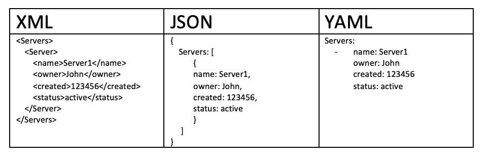
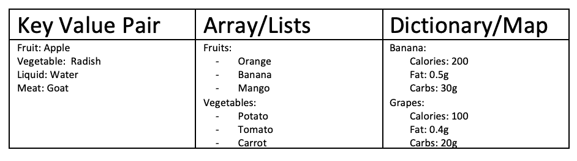
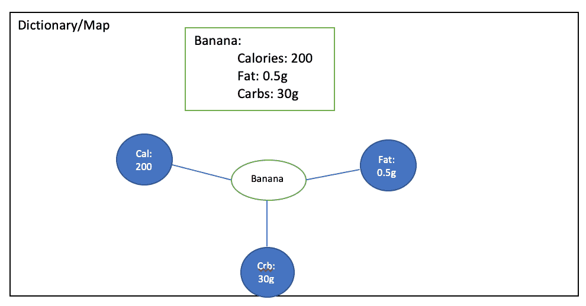
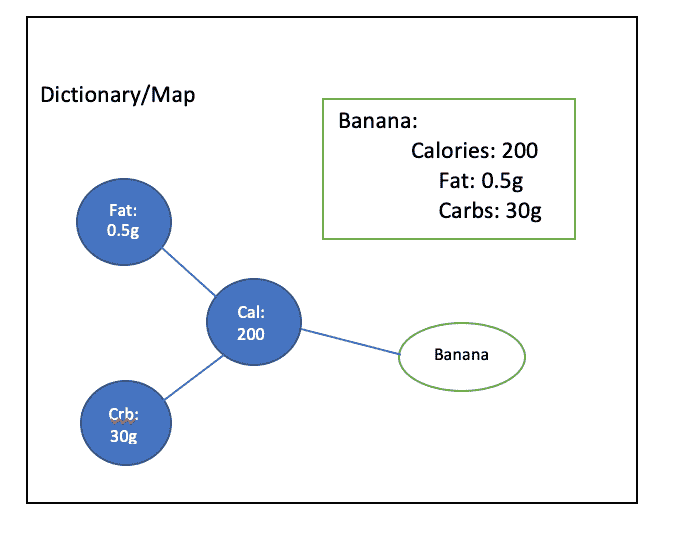
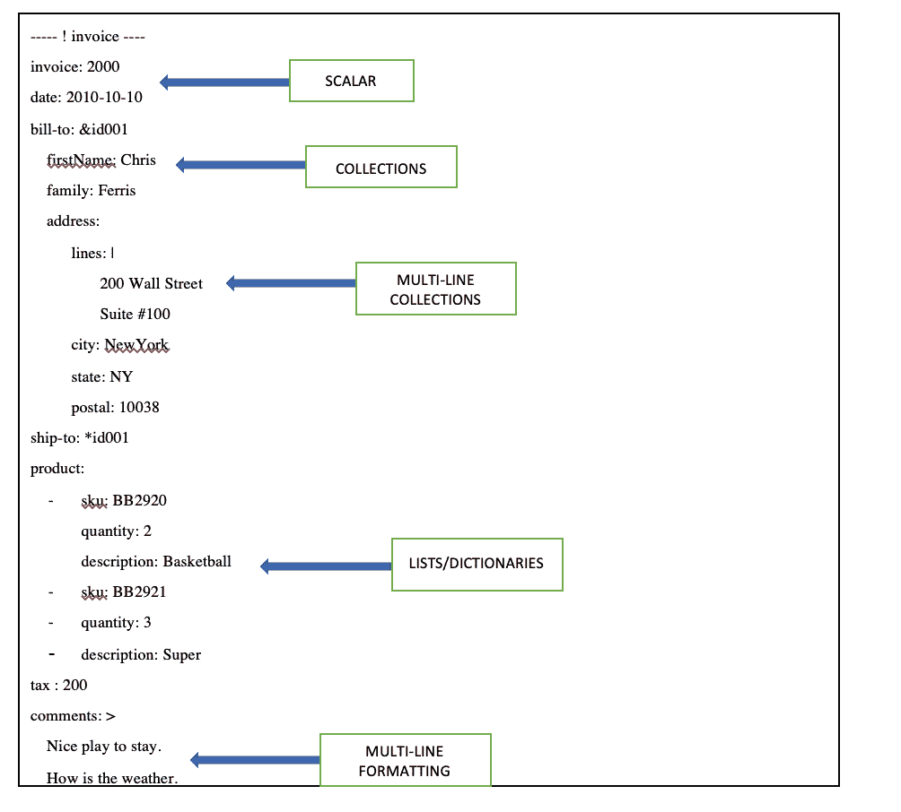
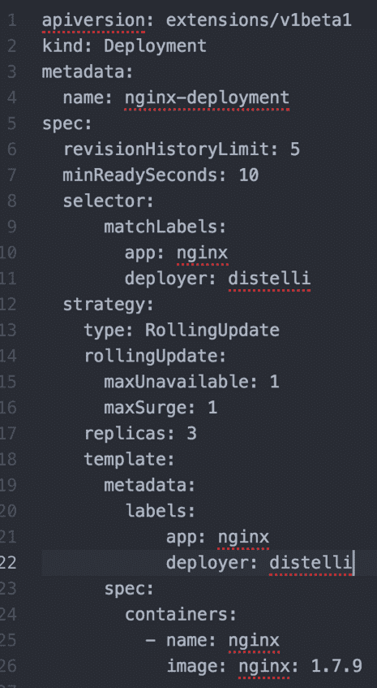

# Kubernetes 中的 YAML 基础知识

> 原文：[`developer.ibm.com/zh/tutorials/yaml-basics-and-usage-in-kubernetes/`](https://developer.ibm.com/zh/tutorials/yaml-basics-and-usage-in-kubernetes/)

在本教程中，您将学习 YAML 的结构以及关于如何编写 YAML 文件的基础知识。您将探索 Kubernetes 中使用的 YAML 文件示例。

## 目标

在本教程中，您将学习以下内容：

*   YAML 文件的定义
*   为何开发者要使用 YAML
*   YAML 与 JSON 和 XML 的关系
*   YAML 文件的基本结构
*   如何在 Kubernetes 中使用 YAML 文件

## 前提条件

本教程假定您已经了解了用于存储和传输数据的语言（例如 XML 和 JSON）的基础知识。

## YAML 文件的定义

在深入学习之前，您需要了解 YAML 的定义。按照 [www.yaml.org](https://yaml.org/) 的说法，“YAML 是一种适用于所有编程语言的人性化数据序列化标准。”

YAML 是专门为一些常见用例创建的，比如：

*   配置文件
*   日志文件
*   进程间消息传递
*   跨语言数据共享
*   对象持久性
*   复杂数据结构

## 为什么要使用 YAML

使用 YAML 文件有一些优点：

1.  YAML 文件易于人类阅读，具有表达性和可扩展性。
2.  YAML 文件易于实现和使用。
3.  可在编程语言之间轻松移植。
4.  与敏捷语言的原生数据结构相匹配。
5.  YAML 文件具有一致模型，支持通用工具。
6.  YAML 文件支持单通处理。
7.  使用方便，因此您无需再将所有的参数添加到命令行中。
8.  易于维护 – 可以将 YAML 文件添加到源控件中以跟踪更改。
9.  灵活便捷 – 可以使用 YAML 创建更加复杂的结构（相对于使用命令行可以创建的结构）

## 与 JSON 和 XML 的关系

XML 是许多领域的优先采用格式。XML 最初设计为与标准通用标记语言 (SGML) 向后兼容，后者旨在支持结构化文档。因此，XML 存在许多设计上的约束。

JSON 的设计理念是简单性和通用性，并且易于生成和解析。JSON 格式的可读性低，但是这种格式的数据每一种现代编程环境都可以轻松处理。

YAML 的设计目标是提升可读性，提供更加完善的信息模型。YAML 的生成和解析更加复杂，因此可以将其视为 JSON 的自然超集。每个 JSON 文件都是一个有效的 YAML 文件。

综上所述，在需要额外功能的情况下，可以轻松地从 JSON 迁移到 YAML。YAML 是从 XML 衍生而来。

## YAML 文件的结构

以下是 YAML 文件的构建块：

1.  键值对 – YAML 文件中的基本条目类型是键值对。键值对的格式是键和冒号，之后是空格，然后是值。
2.  数组/列表 – 列表会在列表名称下列出一些项目。列表的元素以 `-` 开头。可以有 `n` 个列表，但是，数组中各个元素的缩进非常重要。
3.  字典/地图 – YAML 文件的更复杂类型是字典和地图。

编写 YAML 文件时应遵守的一般准则

在编写 YAML 文件时，切记以下准则：

### 缩进和制表符的重要性

请考虑下图，其中包含了有关“Banana”的详细信息。有 3 个属性：

1.  Calories = 200
2.  Fat = 0.5g
3.  Carbs = 30g

假设使用了额外的缩进或制表符，那么 YAML 对象的整体含义将发生变化，如下所示。因此，在处理 YAML 文件时，我们需要注意缩进和制表符。

## YAML 基础知识的重要方面

创建 YAML 文件时需要重点关注的其他方面包括：

*   标量 – 您可以采用 “YYYY-MM-DD” 格式来表示日期，并为其分配一个 `date` 变量。
*   集合 – 假设您提到账单地址，并且送货地址与账单地址相同。然后，您使用 `&`，后跟以 ID 为开头的账单地址。如果您需要按照送货地址复制相同的地址，那么将 `*` 符号与账单地址中使用的相同 id 一起使用。这有助于降低数据的冗余。
*   多行集合 – 假设您有一个包含多行的地址行并且需要保持格式，那么使用 `I` 符号。
*   列表/字典 – 之前的章节中介绍了列表和字典。
*   多行格式 – 假设您有一个较长的字符串值，并且需要在多行中提及以保持格式，那么可以使用上面提到的 `>` 符号。

## YAML 在 Kubernetes 中的使用

了解了 YAML 文件的优点和基本构建块之后，我们来看一下如何在 Kubernetes 中使用 YAML。 Kubernetes 资源是通过声明的方式创建的，因此可以使用 YAML 文件。Kubernetes 资源（比如 Pod、服务和部署）是使用 YAML 文件创建的。

此示例有助于说明如何使用 YAML 创建部署资源： **注意：**此示例包含基本规范和高级规范。

以下是对各个字段的简要说明：

*   `replicas` – 告知 Kubernetes 在部署期间要创建的 Pod 的数量。通过修改此字段，可以轻松扩展容器化应用程序。
*   `spec.strategy.type` – 假设需要部署该应用程序的另一个版本，并且在部署阶段，您需要在不造成中断的情况下进行更新。[滚动更新策略](https://kubernetes.io/docs/tutorials/kubernetes-basics/update/update-intro/)允许 Kubernetes 通过一次更新一个 Pod 来更新服务，而不会造成中断。
*   `spec.strategy.rollingUpdate.maxUnavailable` – 滚动更新期间可能不可用的 Pod 的最大数量。
*   `spec.strategy.rollingUpdate.maxSurge` – 在超过所需 Pod 数量时可以调度的 Pod 的最大数量。
*   `spec.minReadySeconds` – 可选，是一个描述最短时间（以秒为单位）的整数，在此时间内，新 Pod 应处于就绪状态，其任何容器都不能崩溃才能将其视为可用。
*   `spec.revisionHistoryLimit` – 可选，是一个整数属性，用来明确告知 Kuberneres 在任何给定时间应保留多少个旧的副本集。
*   `spec.template.metadata.labels` – 向部署规范中添加标签。
*   `spec.selector` – 可选对象，用来告知 Kubernetes 部署控制器只能将匹配指定标签的 Pod 作为目标。因此，要将包含标签“app”和“deployer”的 Pod 作为目标，可以对我们的部署 yaml 进行以下修改。

从各个字段的说明中可以看出，YAML 文件确实可以以声明方式真正帮助您维护和控制 Kubernetes 资源。

YAML 将被视为事实上的配置文件标准。

## 后续步骤

您可以通过访问 [Kubernetes 研讨会材料](https://github.com/IBM/kube101/tree/master/workshop)来继续学习。

本文翻译自：[YAML basics in Kubernetes](https://developer.ibm.com/tutorials/yaml-basics-and-usage-in-kubernetes/)（2019-02-20）