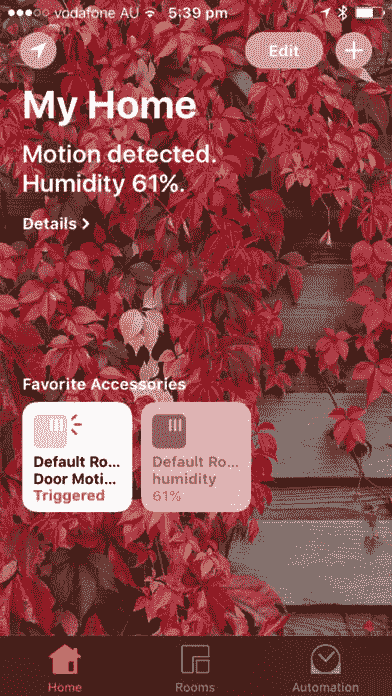
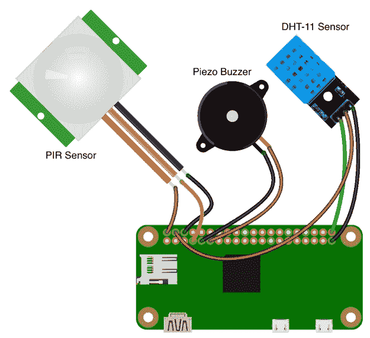
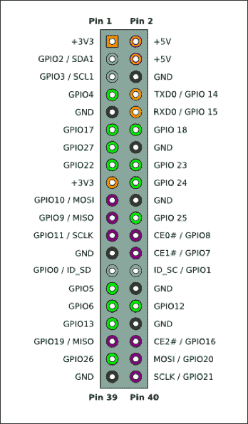
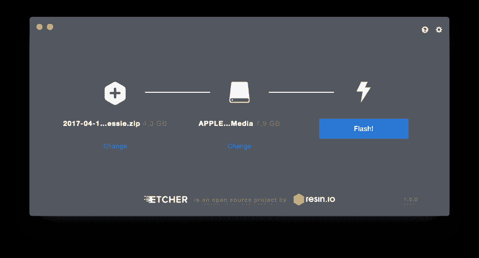
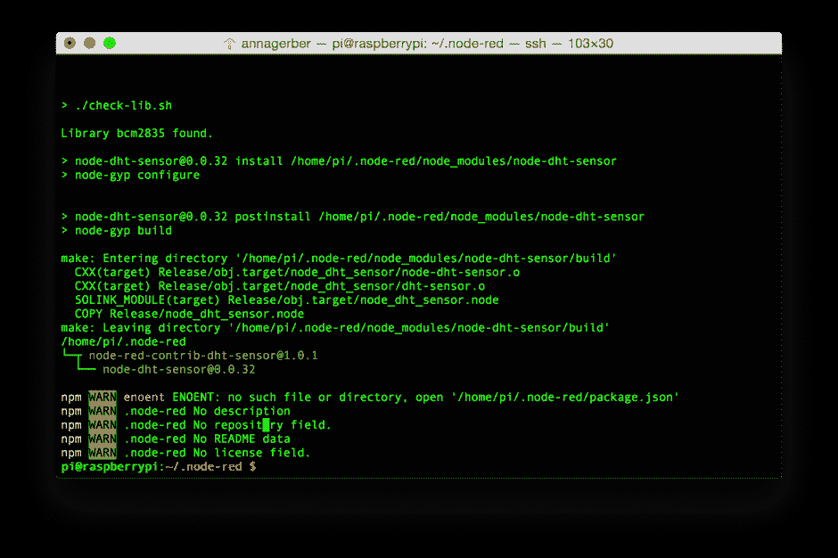
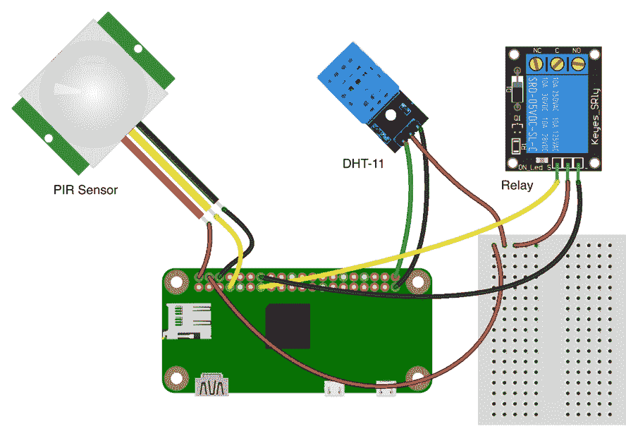
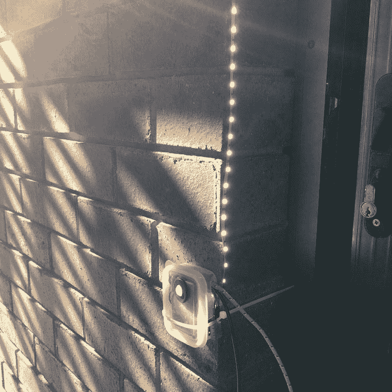

# 从构建简单家庭自动化系统开始开发 IoT 解决方案

> 原文：[`developer.ibm.com/zh/tutorials/iot-lp101-get-started-develop-iot-home-automation/`](https://developer.ibm.com/zh/tutorials/iot-lp101-get-started-develop-iot-home-automation/)

##### 学习路径：物联网开发入门

本文是 IoT 101 学习路径的一部分，是物联网开发人员的快速入门指南。

*   物联网概念和技能
*   物联网硬件指南
*   物联网网络指南
*   物联网平台
*   教程：构建一个简单的家庭自动化系统（本教程）

有时，最有效的家庭自动化项目恰恰是那些解决非常简单的问题的项目。

这里提供了我的简单的家庭自动化 IoT 解决方案。我在楼上戴着耳机工作时，很难听到门铃的声音，所以我要创建一个智能门铃系统：

*   我将在我家的前门添加一个运动传感器，只要有人来到前门，就会激活该传感器。
*   我还会添加一个温度和湿度传感器，用于随时监视前门外的天气条件，这样我离家外出时，如果需要外套或雨伞，我就不会忘记带它们。
*   我将使用 PIR 传感器在我天黑后回家时触发一个继电器，以打开一个 LED 灯带，让我更容易看清家门并开锁。

我将所有这些传感器公开为 [Apple Home Kit](https://developer.apple.com/homekit/) 设备。Home Kit 是 Apple 公司的家庭自动化框架，它允许您在运行 iOS10 的 iPhone 或 iPad 上使用 Home 应用程序读取传感器读数，控制家里安装的智能设备，所以我将能够从手机上看到传感器读数 (自定义 Home Kit Raspberry Pi 设备)。

**自定义 Home Kit Raspberry Pi 设备 {: #自定义-home-kit-raspberry-pi-设备}**



我将逐步介绍我是如何使用在 Raspberry Pi 上运行的 Node-RED，通过一些便宜的传感器和执行器构建我的家庭自动化解决方案的。您可以使用本教程来[培养 IoT 技能](https://www.ibm.com/developerworks/community/blogs/3302cc3b-074e-44da-90b1-5055f1dc0d9c/entry/just-getting-started-iot-consider-7-key-iot-concepts-skills?lang=zh)，建立一个类似的家庭自动化解决方案，或者可以在开始开发您自己的 IoT 解决方案时借鉴这些概念。

**家庭自动化教程 – 简介**

[https://cdnapisec.kaltura.com/p/1773841/sp/177384100/embedIframeJs/uiconf_id/39954662/partner_id/1773841?iframeembed=true&playerId=kaltura_player&entry_id=1_3hcufcrn&flashvars[akamaiHD.loadingPolicy]=preInitialize&flashvars[akamaiHD.asyncInit]=true&flashvars[twoPhaseManifest]=true&flashvars[streamerType]=hdnetworkmanifest&flashvars[localizationCode]=en&flashvars[leadWithHTML5]=true&flashvars[sideBarContainer.plugin]=true&flashvars[sideBarContainer.position]=left&flashvars[sideBarContainer.clickToClose]=true&flashvars[chapters.plugin]=true&flashvars[chapters.layout]=vertical&flashvars[chapters.thumbnailRotator]=false&flashvars[streamSelector.plugin]=true&flashvars[EmbedPlayer.SpinnerTarget]=videoHolder&flashvars[dualScreen.plugin]=true&flashvars[Kaltura.addCrossoriginToIframe]=true&&wid=1_900u1skf](https://cdnapisec.kaltura.com/p/1773841/sp/177384100/embedIframeJs/uiconf_id/39954662/partner_id/1773841?iframeembed=true&playerId=kaltura_player&entry_id=1_3hcufcrn&flashvars[akamaiHD.loadingPolicy]=preInitialize&flashvars[akamaiHD.asyncInit]=true&flashvars[twoPhaseManifest]=true&flashvars[streamerType]=hdnetworkmanifest&flashvars[localizationCode]=en&flashvars[leadWithHTML5]=true&flashvars[sideBarContainer.plugin]=true&flashvars[sideBarContainer.position]=left&flashvars[sideBarContainer.clickToClose]=true&flashvars[chapters.plugin]=true&flashvars[chapters.layout]=vertical&flashvars[chapters.thumbnailRotator]=false&flashvars[streamSelector.plugin]=true&flashvars[EmbedPlayer.SpinnerTarget]=videoHolder&flashvars[dualScreen.plugin]=true&flashvars[Kaltura.addCrossoriginToIframe]=true&&wid=1_900u1skf)

## 构建此 IoT 解决方案需要做的准备工作

要构建这个 IoT 解决方案，您需要基本熟悉 [JavaScript](https://www.ibm.com/developerworks/web/library/wa-javascriptstart/index.html) 和 [MQTT](http://www.ibm.com/developerworks/cn/iot/iot-mqtt-why-good-for-iot/index.html) 。

我使用 MacBook Pro 作为开发环境，但是任何拥有 Wifi 和等效软件的 Linux 或 Windows PC 应该都可以。我使用了以下软件和硬件来构建我的家庭自动化系统。

### 软件

*   命令行 SSH 客户端
*   文本编辑器，比如 Sublime Text 或 Atom
*   SD 卡成像软件 ([Etcher](https://etcher.io/))
*   Web 浏览器（首选 Google Chrome 或 Firefox）
*   Apple Home 应用程序（需要一台运行 iOS 10 的 Apple 设备，比如 iPhone 或 iPad）
*   Raspbian Buster（安装在 Raspberry Pi 的 micro SD 卡上）
*   [Node-RED](https://nodered.org/) ，已默认安装在 Raspberry Pi 上

### 硬件

*   无线网络路由器
*   Raspberry Pi 和附件：

    *   Raspberry Pi Zero W 或最新的 Raspberry Pi
    *   40 引脚排线座
    *   Raspberry Pi 盒子
    *   Micro USB 线和 USB 电源适配器（比如手机充电器）
    *   8 GB micro SD 卡和适配器，用于从计算机向卡中写入数据。一张空卡或预先安装了 Raspbian Buster 的卡。

    一个配备了所有这些附件的入门工具包，比如来自 AdaFruit 的[这个工具包](https://www.adafruit.com/product/3410)。

我要运行的家庭自动化设备由接入主电源的 USB 电源线供电，所以我无需考虑电池或电源管理方面的事情。由主电源供电还意味着，我不需要优先选择通常在商用家庭自动化系统中采用的低功耗网络技术，比如 Zigbee。

Wifi 是我为这个项目首选的网络技术，因为我家里已有 Wifi 网络，而且我的家庭自动化系统的作用范围只需要涵盖家里的局域网 (LAN)。Wifi 的另一个优势是具有高数据吞吐量，这意味着我应该能够顺利地从连接的传感器收集数据。要了解有关选择网络技术的更多信息，请参阅我的文章“[连接物联网中的所有事物](http://www.ibm.com/developerworks/cn/iot/library/iot-lp101-connectivity-network-protocols/index.html)”。

我选择使用 Raspberry Pi Zero W，但是您可以使用任何带 Wifi 的 Raspberry Pi。Raspberry Pi Zero W 是一个容易获取的、小型且便宜的单板计算机，其中内置了蓝牙和 Wifi，这使它成为需要接入现有 Wifi 网络或使用蓝牙集成用户设备的 IoT 解决方案的理想选择。Raspberry Pi 是电子爱好者中非常流行的一种开发板，所以有许多在线资源和兼容设备可为开发人员提供支持。我将运行的这个设备由接入主电源的 USB 电源线供电，所以我无需考虑电池或电源管理方面的事情。

要更详细了解为 IoT 项目选择硬件时要考虑的硬件需求，请阅读我的 [IoT 硬件指南](http://www.ibm.com/developerworks/cn/iot/library/iot-lp101-best-hardware-devices-iot-project/index.html)。

### 电子元件

*   [无源红外 (PIR) 传感器](https://www.adafruit.com/product/189)。我使用了 Keyestudio 热电传感器，但是任何兼容 Arduino 的数字 PIR 传感器应该都可以
*   [压电式蜂鸣器](https://www.adafruit.com/product/1536)
*   [DHT-11](https://www.adafruit.com/product/386) 或 [DHT-22](https://www.adafruit.com/product/385) 数字温度和湿度传感器模块
*   5V [继电器](https://www.amazon.com/Indicator-Light-Channel-Module-Arduino/dp/B00P7QDJD2)模块
*   [跳线](https://www.amazon.com/Haitronic-Multicolored-Breadboard-Arduino-raspberry/dp/B01LZF1ZSZ/)
*   12V [LED 灯带](https://www.amazon.com/WishShop-Strip-Light-NonwaterProof-White/dp/B01N3KPS10)和[电源适配器](https://www.amazon.com/Adapter-Transformers-Supply-Output-Listed/dp/B00DKSI0S8/)
*   小型无焊[电路试验板](https://www.amazon.com/Gikfun-Solderless-Prototype-Breadboard-Arduino/dp/B0146MGBWI/)。电路试验板是可选的，因为如果您愿意，可以始终将线路焊接到一起。
*   以下各种元件：

    *   一个用于容纳该设备的小塑料容器
    *   束线带
    *   双面胶

我选择了一个现成的[无源红外 (PIR)](https://en.wikipedia.org/wiki/Passive_infrared_sensor) 传感器来检测运动，选择了一个 DHT-11 数字温度和湿度传感器模块与我的设备相连。这些传感器都是便宜的 5V 数字传感器，而且同时兼容 Arduino 和 Raspberry Pi。Raspberry Pi 没有板载硬件模数转换器，所以与需要额外的模数转换器的模拟传感器相比，数字传感器是个不错的选择。我使用的输出元件包括一个压电式蜂鸣器元件和一个 5V 继电器及 12V LED 灯带。只要在原型设计期间检测到运动，蜂鸣器就会发出嘟嘟声；在系统的最后迭代期间，运动将触发继电器点亮灯带。

### 工具

*   飞利浦螺丝刀
*   雕刻刀
*   烙铁

## 将传感器连接到 Raspberry Pi 设备

按照此视频中的步骤连接 PIR 传感器、蜂鸣器及 DHT11 温度和湿度传感器。使用视频后面的图和表格帮助组装电路。

**家庭自动化教程 – 组装电路**

[https://cdnapisec.kaltura.com/p/1773841/sp/177384100/embedIframeJs/uiconf_id/39954662/partner_id/1773841?iframeembed=true&playerId=kaltura_player&entry_id=1_5a71tp66&flashvars[akamaiHD.loadingPolicy]=preInitialize&flashvars[akamaiHD.asyncInit]=true&flashvars[twoPhaseManifest]=true&flashvars[streamerType]=hdnetworkmanifest&flashvars[localizationCode]=en&flashvars[leadWithHTML5]=true&flashvars[sideBarContainer.plugin]=true&flashvars[sideBarContainer.position]=left&flashvars[sideBarContainer.clickToClose]=true&flashvars[chapters.plugin]=true&flashvars[chapters.layout]=vertical&flashvars[chapters.thumbnailRotator]=false&flashvars[streamSelector.plugin]=true&flashvars[EmbedPlayer.SpinnerTarget]=videoHolder&flashvars[dualScreen.plugin]=true&flashvars[Kaltura.addCrossoriginToIframe]=true&&wid=1_1wsap16r](https://cdnapisec.kaltura.com/p/1773841/sp/177384100/embedIframeJs/uiconf_id/39954662/partner_id/1773841?iframeembed=true&playerId=kaltura_player&entry_id=1_5a71tp66&flashvars[akamaiHD.loadingPolicy]=preInitialize&flashvars[akamaiHD.asyncInit]=true&flashvars[twoPhaseManifest]=true&flashvars[streamerType]=hdnetworkmanifest&flashvars[localizationCode]=en&flashvars[leadWithHTML5]=true&flashvars[sideBarContainer.plugin]=true&flashvars[sideBarContainer.position]=left&flashvars[sideBarContainer.clickToClose]=true&flashvars[chapters.plugin]=true&flashvars[chapters.layout]=vertical&flashvars[chapters.thumbnailRotator]=false&flashvars[streamSelector.plugin]=true&flashvars[EmbedPlayer.SpinnerTarget]=videoHolder&flashvars[dualScreen.plugin]=true&flashvars[Kaltura.addCrossoriginToIframe]=true&&wid=1_1wsap16r)

如果 Raspberry Pi 没有附带 GPIO 引脚，您需要首先在开发板上焊接这些引脚。我使用的电路如包含传感器和蜂鸣器的电路（参见致谢） 所示。

##### 包含传感器和蜂鸣器的电路（参见致谢）



对于每个元件，正引脚连接到 5V，负引脚接地 (GND)，数据引脚连接到 Raspberry Pi 引脚排线座上的 GPIO 引脚，如 Raspberry Pi 引脚排线座和 GPIO 引脚编号所示。在 Raspberry Pi 引脚排线座和 GPIO 引脚编号中，排线座中引脚的编号包含在中间列，而 Raspberry Pi GPIO 引脚标识符显示在第 3 列。表后的 Raspberry Pi GPIO 引脚（图像来源： [`elinux.org/File:Pi-GPIO-header.png`](http://elinux.org/File:Pi-GPIO-header.png)） 中提供了 Raspberry Pi 引脚的布局。

##### Raspberry Pi 引脚排线座和 GPIO 引脚编号

| 传感器/设备 | 引脚排线座编号 | GPIO 引脚编号 |
| --- | --- | --- |
| PIR 传感器 （显示在包含传感器和蜂鸣器的电路（参见致谢）的左上侧） | 7 | GPIO4 |
| 压电式蜂鸣器 （显示在包含传感器和蜂鸣器的电路（参见致谢）的中间） | 11 | GPIO17 |
| DHT-11 传感器 （显示在包含传感器和蜂鸣器的电路（参见致谢）的右侧） | 40 | GPIO21 |
| 继电器 （显示在包含继电器的家庭自动化电路（参见致谢）的右侧） | 13 | GPIO22 |

将元件与 Raspberry Pi GPIO 排线座相连时，请参阅 Raspberry Pi GPIO 引脚（图像来源：[`elinux.org/File:Pi-GPIO-header.png`](http://elinux.org/File:Pi-GPIO-header.png)） 中的引脚图。

##### Raspberry Pi GPIO 引脚（图像来源：[`elinux.org/File:Pi-GPIO-header.png`](http://elinux.org/File:Pi-GPIO-header.png)）



## 设置 Raspberry Pi

如果您选择使用一个带有 Wifi 适配器的不同 Raspberry Pi，可以通过以太网线对 Pi 进行初步设置，请观看 IBM Developer TV 上的 IoT 实践视频，了解如何[不使用键盘、鼠标或监视器设置 Pi](https://developer.ibm.com/tv/setting-up-your-raspberry-pi-without-a-keyboard-mouse-or-monitor/)。

Pi Zero 很小，所以开发板上没有针对 HDMI 或 USB 的全尺寸端口。可以添加一个 mini-HDMI 到 HDMI 转换线或适配器，也可以添加一个 micro-USB 便携适配器和 USB 集线器，以插入监视器、USB 鼠标和键盘。但是设置 Raspberry Pi 后，就不再需要这些外围元件了，所以我更喜欢跳过这些装置，在无头模式下配置 Pi Zero。

以下是为本教程设置 Raspberry Pi 的步骤：

*   在 micro SD 卡上安装最新的 Raspian 操作系统
*   向 micro SD 卡添加配置文件
*   启动 Raspberry Pi
*   启动并设置 Node-RED
*   安装其他 Node-RED 模块

### 在 micro SD 卡上安装最新版本的 Raspian 操作系统

如果使用的是预先安装了 Raspbian 的 micro SD 卡，可以跳过这一步。但是，如果最开始只有一张空白卡，则首先需要将最新版的 Raspbian 操作系统安装到该 micro SD 卡上。我使用的是一张 8 GB micro SD 卡，并使用一个 SD 卡适配器从我的 MacBook 设置该卡。您可以按照 [Raspberry Pi 网站上的操作说明](https://www.raspberrypi.org/documentation/installation/installing-images/README.md) 进行操作。

我没有计划在操作系统之间切换，所以对于本项目，我决定使用 Raspbian Buster 映像，而不是 NOOBS。我已经安装了 [Etcher](https://etcher.io/) 应用程序，所以将该映像闪存到 SD 卡很简单，只需选择下载的 .zip 文件，选择该 micro SD 卡，然后单击 **Flash** (使用 Etcher 将 Raspbian 安装到 micro SD 卡上)。

##### 使用 Etcher 将 Raspbian 安装到 micro SD 卡上



### 向 micro SD 卡添加配置文件

您还需要在 SD 卡上添加一些配置文件，以设置无线网络设置来将 Pi 连接到本地网络。

您需要将一个名为 `wpa_supplicant.conf` 的文件添加到 SD 卡的根目录中。此文件包含 Wifi 设置，包括网络密码和 SSID。使用 Sublime Text 或 Atom 等文本编辑器编辑该文件的内容，添加以下行，然后指定 `ssid` 和 `psk` 变量的值：

```
 network={
        ssid="<wifi network name>"
        psk="<wifi password>"
    } 
```

还需要将一个名为 `ssh` 的文件（该文件本身不需要包含任何内容）添加到 SD 卡的根目录。有了该文件，就会在 Pi 启动时启用 SSH。

### 启动 Raspberry Pi

现在可以将 micro SD 卡插入 Raspberry Pi 中，将 micro USB 线插入 Pi 上的电源插孔，然后为它通电。

假设您的无线路由器设置为通过 DHCP 自动向连接的设备分配 IP 地址，那么您不知道最初为您的 Pi 分配了哪个 IP 地址。但是，可以使用 `mDNS` 和 *.local* 特殊用途域名来找到并连接到 Pi，而无需知道它的 IP 地址。`mDNS` 的最常见实现是 Apple 的 Bonjour 服务。如果您在 Mac 上，此服务直接就能使用。在 Linux 上，此服务由 Avahi (Zeroconf) 提供。在 Windows 上，如果安装了 iTunes，那么您就已安装 Bonjour。如果未安装 Bonjour，让您的 Pi 正常运行的最快方式是安装 [Apple Bonjour 打印服务](https://support.apple.com/kb/DL999?locale=en_US)。

默认情况下，已为 Raspberry Pi 配置了主机名 *raspberrypi* 和默认用户 *pi*，所以您可以使用 SSH 连接到 Pi：

```
ssh pi@raspberrypi.local 
```

连接到 Pi 后，可以运行 `ifconfig` 命令来找到它的 IP 地址，或者在运行 node-red 时检查启动消息。如果不想安装 Bonjour 来使用 mDNS，您可能希望检查家庭路由器的 DNS 日志来找到 Pi 的 IP 地址，并将该 IP 地址替换为主机名 `raspberrypi.local`。

### 启动，设置 Node-RED 并安装 Node-RED 模块

观看 Node-RED Essentials 播放列表中的视频，以了解有关使用 Node-RED 的更多信息。

Node-RED 是一个开发工具，可在它的图形 Web 界面中将连接物理设备、API 和其他在线服务的 IoT 流连接在一起。Raspbian 中默认已安装 Node-RED 和 node.js，但是它捆绑的版本比较旧。所以，我启动 Raspberry Pi 后做的第一件事就是更新 Node-RED 和 node.js，并安装一些第三方模块来让 DHT-11 温度传感器和 Home Kit 更容易使用。

可以在 Node-RED 文档中进一步了解如何[在 Raspberry Pi 上运行 Node-RED](https://nodered.org/docs/hardware/raspberrypi)。

Node-RED 提供了一个图形 Web 界面用于设计 IoT 流。这些流将各种节点（代表物理设备及附加的传感器和执行器的节点，实现自定义功能的节点，以及为库或服务提供接口的节点）连接在一起，并指定如何在它们之间传递包含数据载荷的消息。我们可以通过安装更多 (contrib) 模块来添加更多种节点。模块可使用 Web 界面添加，只需转到 Web 界面右上角的菜单，选择 Manage palette，并在屏幕左侧边栏中的 Install 选项卡下搜索贡献的模块。

在此视频中，我通过 SSH 连接到 Raspberry Pi，启动并更新 Node-RED，然后安装要与 Apple [Home Kit](https://www.apple.com/ios/home/) 集成的 node-red-contrib-homekit 模块，所有操作都使用 Web 用户界面完成。

**注意：**尽管自录制此视频以来，Node-RED UI 有所更改，但是您执行的步骤仍然相同。

**家庭自动化教程 – 在 Raspberry Pi 上设置 Node-RED**

[https://cdnapisec.kaltura.com/p/1773841/sp/177384100/embedIframeJs/uiconf_id/39954662/partner_id/1773841?iframeembed=true&playerId=kaltura_player&entry_id=1_xpo24szi&flashvars[akamaiHD.loadingPolicy]=preInitialize&flashvars[akamaiHD.asyncInit]=true&flashvars[twoPhaseManifest]=true&flashvars[streamerType]=hdnetworkmanifest&flashvars[localizationCode]=en&flashvars[leadWithHTML5]=true&flashvars[sideBarContainer.plugin]=true&flashvars[sideBarContainer.position]=left&flashvars[sideBarContainer.clickToClose]=true&flashvars[chapters.plugin]=true&flashvars[chapters.layout]=vertical&flashvars[chapters.thumbnailRotator]=false&flashvars[streamSelector.plugin]=true&flashvars[EmbedPlayer.SpinnerTarget]=videoHolder&flashvars[dualScreen.plugin]=true&flashvars[Kaltura.addCrossoriginToIframe]=true&&wid=1_8p5qsyon](https://cdnapisec.kaltura.com/p/1773841/sp/177384100/embedIframeJs/uiconf_id/39954662/partner_id/1773841?iframeembed=true&playerId=kaltura_player&entry_id=1_xpo24szi&flashvars[akamaiHD.loadingPolicy]=preInitialize&flashvars[akamaiHD.asyncInit]=true&flashvars[twoPhaseManifest]=true&flashvars[streamerType]=hdnetworkmanifest&flashvars[localizationCode]=en&flashvars[leadWithHTML5]=true&flashvars[sideBarContainer.plugin]=true&flashvars[sideBarContainer.position]=left&flashvars[sideBarContainer.clickToClose]=true&flashvars[chapters.plugin]=true&flashvars[chapters.layout]=vertical&flashvars[chapters.thumbnailRotator]=false&flashvars[streamSelector.plugin]=true&flashvars[EmbedPlayer.SpinnerTarget]=videoHolder&flashvars[dualScreen.plugin]=true&flashvars[Kaltura.addCrossoriginToIframe]=true&&wid=1_8p5qsyon)

除了使用 Web 界面安装 Node-RED 模块，也可以在命令行使用 npm 安装模块。

例如，安装 homebridge 模块来允许与 Apple Home Kit 附件集成：

```
sudo npm install -g homebridge 
```

为了更加容易使用 DHT11 温度和湿度传感器，需要安装 node-red-contrib-dht-sensor 模块 ([`flows.nodered.org/node/node-red-contrib-dht-sensor`](https://flows.nodered.org/node/node-red-contrib-dht-sensor))。此模块的文档列出了它依赖的 BCM2835 库和 node-red-dht 模块。所以我们首先需要安装这些模块。

[`www.airspayce.com/mikem/bcm2835`](http://www.airspayce.com/mikem/bcm2835) 上提供了 BCM2835 库的安装说明和最新版本。从 Raspberry Pi 上的命令行，使用以下命令下载并安装这个库：

```
 cd ~
    wget http://www.airspayce.com/mikem/bcm2835/bcm2835-1.52.tar.gz
    tar xzf bcm2835-1.52.tar.gz
    cd bcm2835-1.52.tar.gz
    ./configure
    make
    sudo make check
    sudo make install 
```

安装该库后，切换到 *.node-red* 目录，使用 npm 安装 node-dht-sensor 和 node-red-contrib-dht 模块。

```
 cd ~/.node-red
    sudo npm install --unsafe-perm -g node-dht-sensor
    sudo npm install --unsafe-perm -g node-red-contrib-dht-sensor 
```

##### 从 mpm 安装 Node-RED -contrib-dht 模块



可以使用 `npm` 列出已安装在 `.node-red` 目录中的模块：

```
 npm ls --depth=0 
```

我发现在手动安装模块后重新启动 Node-RED 是个好主意：

```
 sudo service nodered restart 
```

安装 DHT 模块后，您会看到（Web 界面中的）Node-RED 面板中出现了额外的 DHT22 节点类型。

## 使用 Node-RED 创建流

我使用 Node-RED 设置我的家庭自动化系统的逻辑。我使用它从连接到 Raspberry Pi 的 GPIO 引脚的元件读取数据并控制这些元件。我将功能拆分到两个流中。第一个流读取 PIR 传感器读数，并在检测到运动时触发蜂鸣器。它还会向 Apple Home Kit 公开 PRI 传感器读数（可以在 [Apple 文档中了解 Home Kit](https://developer.apple.com/reference/homekit) 的更多信息）。第二个流读取温度和湿度传感器读数，并设置两个 Home Kit 设备，一个用于温度，另一个用于湿度，以便我能够从 Home 应用程序中看到这些传感器值。

### 为 PIR 运动传感器创建流

按照视频中的步骤，在 PIR 传感器与蜂鸣器之间设置一个 Node-RED 流，以便在 PIR 传感器检测到运动时，蜂鸣器就会发出嘟嘟声。我还配置了一个 Apple Home Kit 节点，以便可以在我手机上的 Apple Home 应用程序中显示运动传感器的状态。

**注意：**尽管自录制此视频以来，Node-RED UI 有所更改，但是您执行的步骤仍然相同。

**家庭自动化教程 – 构建 Node-RED 流**

[https://cdnapisec.kaltura.com/p/1773841/sp/177384100/embedIframeJs/uiconf_id/39954662/partner_id/1773841?iframeembed=true&playerId=kaltura_player&entry_id=1_i7o0pd88&flashvars[akamaiHD.loadingPolicy]=preInitialize&flashvars[akamaiHD.asyncInit]=true&flashvars[twoPhaseManifest]=true&flashvars[streamerType]=hdnetworkmanifest&flashvars[localizationCode]=en&flashvars[leadWithHTML5]=true&flashvars[sideBarContainer.plugin]=true&flashvars[sideBarContainer.position]=left&flashvars[sideBarContainer.clickToClose]=true&flashvars[chapters.plugin]=true&flashvars[chapters.layout]=vertical&flashvars[chapters.thumbnailRotator]=false&flashvars[streamSelector.plugin]=true&flashvars[EmbedPlayer.SpinnerTarget]=videoHolder&flashvars[dualScreen.plugin]=true&flashvars[Kaltura.addCrossoriginToIframe]=true&&wid=1_k42hw0x9](https://cdnapisec.kaltura.com/p/1773841/sp/177384100/embedIframeJs/uiconf_id/39954662/partner_id/1773841?iframeembed=true&playerId=kaltura_player&entry_id=1_i7o0pd88&flashvars[akamaiHD.loadingPolicy]=preInitialize&flashvars[akamaiHD.asyncInit]=true&flashvars[twoPhaseManifest]=true&flashvars[streamerType]=hdnetworkmanifest&flashvars[localizationCode]=en&flashvars[leadWithHTML5]=true&flashvars[sideBarContainer.plugin]=true&flashvars[sideBarContainer.position]=left&flashvars[sideBarContainer.clickToClose]=true&flashvars[chapters.plugin]=true&flashvars[chapters.layout]=vertical&flashvars[chapters.thumbnailRotator]=false&flashvars[streamSelector.plugin]=true&flashvars[EmbedPlayer.SpinnerTarget]=videoHolder&flashvars[dualScreen.plugin]=true&flashvars[Kaltura.addCrossoriginToIframe]=true&&wid=1_k42hw0x9)

您可以从[我的 GitHub 存储库中的 `MotionSensor.json` 文件](https://github.com/AnnaGerber/Home_Automation_with_Raspberry_Pi_and_HomeKit_Node-red)导入已完成的流的配置。

要导入流，可以转到 Web 界面右上角的汉堡形状菜单，选择 **Import From > Clipboard**，然后粘贴新流的配置。

### 为 DHT11 传感器创建流

按照此视频中的步骤，为 DHT11 温度和湿度传感器添加第二个流，并将这些传感器公开为 Apple Home Kit 设备，以便您在 Home 应用程序内读取温度（摄氏度）和相对湿度（百分比）。

**注意：**尽管自录制此视频以来，Node-RED UI 有所更改，但是您执行的步骤仍然相同。

**家庭自动化教程 – 构建更多 Node-RED 流**

[https://cdnapisec.kaltura.com/p/1773841/sp/177384100/embedIframeJs/uiconf_id/39954662/partner_id/1773841?iframeembed=true&playerId=kaltura_player&entry_id=1_jploja3z&flashvars[akamaiHD.loadingPolicy]=preInitialize&flashvars[akamaiHD.asyncInit]=true&flashvars[twoPhaseManifest]=true&flashvars[streamerType]=hdnetworkmanifest&flashvars[localizationCode]=en&flashvars[leadWithHTML5]=true&flashvars[sideBarContainer.plugin]=true&flashvars[sideBarContainer.position]=left&flashvars[sideBarContainer.clickToClose]=true&flashvars[chapters.plugin]=true&flashvars[chapters.layout]=vertical&flashvars[chapters.thumbnailRotator]=false&flashvars[streamSelector.plugin]=true&flashvars[EmbedPlayer.SpinnerTarget]=videoHolder&flashvars[dualScreen.plugin]=true&flashvars[Kaltura.addCrossoriginToIframe]=true&&wid=1_89dlltna](https://cdnapisec.kaltura.com/p/1773841/sp/177384100/embedIframeJs/uiconf_id/39954662/partner_id/1773841?iframeembed=true&playerId=kaltura_player&entry_id=1_jploja3z&flashvars[akamaiHD.loadingPolicy]=preInitialize&flashvars[akamaiHD.asyncInit]=true&flashvars[twoPhaseManifest]=true&flashvars[streamerType]=hdnetworkmanifest&flashvars[localizationCode]=en&flashvars[leadWithHTML5]=true&flashvars[sideBarContainer.plugin]=true&flashvars[sideBarContainer.position]=left&flashvars[sideBarContainer.clickToClose]=true&flashvars[chapters.plugin]=true&flashvars[chapters.layout]=vertical&flashvars[chapters.thumbnailRotator]=false&flashvars[streamSelector.plugin]=true&flashvars[EmbedPlayer.SpinnerTarget]=videoHolder&flashvars[dualScreen.plugin]=true&flashvars[Kaltura.addCrossoriginToIframe]=true&&wid=1_89dlltna)

可以从[我的 GitHub 存储库中的 `TemperatureAndHumiditySensor.json` 文件](https://github.com/AnnaGerber/Home_Automation_with_Raspberry_Pi_and_HomeKit_Node-red)导入已完成的温度和湿度传感器流。

可以通过将您创建的任何流公开为 JSON 格式来共享它们。要导出流，首先选择该流中的所有节点，然后转到汉堡形状的菜单并选择 **Export**（如果没有选择任何节点，会禁用导出选项）。

### 为 LED 灯带创建流

按照此视频中的步骤，向电路添加一个继电器来打开和关闭 LED 灯带，并使用 PIR 传感器触发此行为。我也逐步介绍了如何设置一个 Home Kit 设备来查看和控制 LED 灯带的状态。

**注意：**尽管自录制此视频以来，Node-RED UI 有所更改，但是您执行的步骤仍然相同。

**家庭自动化教程 – 添加一个继电器并更新 LED 灯带的流**

[https://cdnapisec.kaltura.com/p/1773841/sp/177384100/embedIframeJs/uiconf_id/39954662/partner_id/1773841?iframeembed=true&playerId=kaltura_player&entry_id=1_k0pwyoe8&flashvars[akamaiHD.loadingPolicy]=preInitialize&flashvars[akamaiHD.asyncInit]=true&flashvars[twoPhaseManifest]=true&flashvars[streamerType]=hdnetworkmanifest&flashvars[localizationCode]=en&flashvars[leadWithHTML5]=true&flashvars[sideBarContainer.plugin]=true&flashvars[sideBarContainer.position]=left&flashvars[sideBarContainer.clickToClose]=true&flashvars[chapters.plugin]=true&flashvars[chapters.layout]=vertical&flashvars[chapters.thumbnailRotator]=false&flashvars[streamSelector.plugin]=true&flashvars[EmbedPlayer.SpinnerTarget]=videoHolder&flashvars[dualScreen.plugin]=true&flashvars[Kaltura.addCrossoriginToIframe]=true&&wid=1_1ehsv8h5](https://cdnapisec.kaltura.com/p/1773841/sp/177384100/embedIframeJs/uiconf_id/39954662/partner_id/1773841?iframeembed=true&playerId=kaltura_player&entry_id=1_k0pwyoe8&flashvars[akamaiHD.loadingPolicy]=preInitialize&flashvars[akamaiHD.asyncInit]=true&flashvars[twoPhaseManifest]=true&flashvars[streamerType]=hdnetworkmanifest&flashvars[localizationCode]=en&flashvars[leadWithHTML5]=true&flashvars[sideBarContainer.plugin]=true&flashvars[sideBarContainer.position]=left&flashvars[sideBarContainer.clickToClose]=true&flashvars[chapters.plugin]=true&flashvars[chapters.layout]=vertical&flashvars[chapters.thumbnailRotator]=false&flashvars[streamSelector.plugin]=true&flashvars[EmbedPlayer.SpinnerTarget]=videoHolder&flashvars[dualScreen.plugin]=true&flashvars[Kaltura.addCrossoriginToIframe]=true&&wid=1_1ehsv8h5)

### 连接继电器

尽管在原型设计期间压电式蜂鸣器能够有效地提供门上的传感器是否正常工作的即时反馈，但是我发现，在我将它放在用作封箱的塑料盒中之后，它的声音不太大，所以我决定从电路的最终版本中移除它。移除压电式蜂鸣器也在封箱中留出了更多空间用来安装我的[继电器](https://en.wikipedia.org/wiki/Relay)，这个电控开关还是用于打开和关闭 LED 灯带。

连接继电器的电路图如包含继电器的家庭自动化电路（参见致谢）所示。根据表 1 中列出的信息，PIR 运动传感器连接到引脚 7，DHT11 温度和湿度传感器连接到引脚 40，继电器连接到引脚 13。

##### 包含继电器的家庭自动化电路（参见致谢）



每个元件都需要接地并连接到 5V 引脚，尽管 Pi Zero 上有很多接地引脚，但是只有两个 5V 引脚，所以可以使用一个小型电路试验板或者将一些线路焊接在一起，以在所有 3 个元件之间共享一个 5V 连接。

LED 灯带需要由一个单独的 12V 电源供电，并连接到继电器上通常是打开的（标为 NO）终端 (包含继电器的家庭自动化电路（参见致谢）)，以便激活继电器就会关闭这些终端，点亮 LED 灯带。

## 安装家庭自动化系统（智能门铃）

创建所有电路和 Node-RED 流之后，下一步是安装家庭自动化系统。我将所有线路和元件捆绑在一起，装在一个封箱中，这个外壳由透明塑料容器与用于 PIR 传感器和电线的保险开关组成。（我 3D 打印了一个定制的箱子并使用硅酮对它进行了防水处理，以制作一个更耐久的封箱。）

此视频逐步指导您连接继电器和 LED 灯带，以及将元件捆绑到一个原型封箱中。

**家庭自动化教程 – 将传感器和 Pi 组装到一个盒子中**

[https://cdnapisec.kaltura.com/p/1773841/sp/177384100/embedIframeJs/uiconf_id/39954662/partner_id/1773841?iframeembed=true&playerId=kaltura_player&entry_id=1_xlgqhmqs&flashvars[akamaiHD.loadingPolicy]=preInitialize&flashvars[akamaiHD.asyncInit]=true&flashvars[twoPhaseManifest]=true&flashvars[streamerType]=hdnetworkmanifest&flashvars[localizationCode]=en&flashvars[leadWithHTML5]=true&flashvars[sideBarContainer.plugin]=true&flashvars[sideBarContainer.position]=left&flashvars[sideBarContainer.clickToClose]=true&flashvars[chapters.plugin]=true&flashvars[chapters.layout]=vertical&flashvars[chapters.thumbnailRotator]=false&flashvars[streamSelector.plugin]=true&flashvars[EmbedPlayer.SpinnerTarget]=videoHolder&flashvars[dualScreen.plugin]=true&flashvars[Kaltura.addCrossoriginToIframe]=true&&wid=1_nu1u6kt9](https://cdnapisec.kaltura.com/p/1773841/sp/177384100/embedIframeJs/uiconf_id/39954662/partner_id/1773841?iframeembed=true&playerId=kaltura_player&entry_id=1_xlgqhmqs&flashvars[akamaiHD.loadingPolicy]=preInitialize&flashvars[akamaiHD.asyncInit]=true&flashvars[twoPhaseManifest]=true&flashvars[streamerType]=hdnetworkmanifest&flashvars[localizationCode]=en&flashvars[leadWithHTML5]=true&flashvars[sideBarContainer.plugin]=true&flashvars[sideBarContainer.position]=left&flashvars[sideBarContainer.clickToClose]=true&flashvars[chapters.plugin]=true&flashvars[chapters.layout]=vertical&flashvars[chapters.thumbnailRotator]=false&flashvars[streamSelector.plugin]=true&flashvars[EmbedPlayer.SpinnerTarget]=videoHolder&flashvars[dualScreen.plugin]=true&flashvars[Kaltura.addCrossoriginToIframe]=true&&wid=1_nu1u6kt9)

##### 已安装的家庭自动化系统原型



## 结束语及后续步骤

我循序渐进地介绍了使用 Node-RED 和集成的 Apple Home Kit，为一个基于 Raspberry-Pi 的基本家庭自动化系统搭建电路和设计流。

可以对此原型系统执行一些明显的改进，比如添加一个光线传感器，仅在 LED 灯带处于阴影或黑暗中时才点亮它。我的房门钥匙上有一个蓝牙低功耗标签 (Chipolo)，而且有一个 Node-RED Chipolo 模块用于读取这些标签，所以一种可供选择的改进是读取该标签，识别我何时接近家门，以便打开灯，而不是仅通过运动点亮灯。

因为这个家庭自动化系统只是原型，所以我没有重点介绍安全性，但是 Node-RED 在默认情况下是不受保护的。所以在安装此系统之前，下一步是添加身份验证并保护编辑器（参见 [`nodered.org/docs/security`](https://nodered.org/docs/security)）。

### 致谢

本教程中，我使用了来自以下 Fritzing 元件的电路图来创建自己的电路图：

*   AdaFruit 库：

    [`github.com/adafruit/Fritzing-Library/`](https://github.com/adafruit/Fritzing-Library/)

*   DHT11 传感器模块：

    [`fritzing.org/projects/ky-015-temperature-and-humidity-sensor-module`](http://fritzing.org/projects/ky-015-temperature-and-humidity-sensor-module)

*   PIR 传感器和继电器：

    [`github.com/rwaldron/fritzing-components/blob/master/components/keyes-relay.fzpz`](https://github.com/rwaldron/fritzing-components/blob/master/components/keyes-relay.fzpz)

本文翻译自：[Get started developing IoT solutions by building a simple home automation system](https://developer.ibm.com/tutorials/iot-lp101-get-started-develop-iot-home-automation/)（2020-01-31）