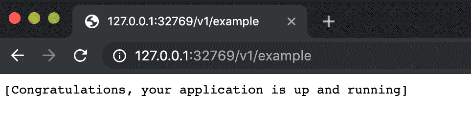

# 使用 Codewind 和您喜欢的 IDE 构建云原生 Java 应用程序

> 原文：[`developer.ibm.com/zh/tutorials/develop-a-cloud-native-java-application-using-codewind/`](https://developer.ibm.com/zh/tutorials/develop-a-cloud-native-java-application-using-codewind/)

[Eclipse Codewind](https://www.eclipse.org/codewind/) 是一个开源项目，可帮助开发者在他们喜欢的 IDE 中创建云原生应用程序。目前，Codewind 支持 Visual Studio Code、Eclipse IDE 和 Eclipse Che。

Codewind 使您能够通过模板创建应用程序，并支持在桌面上的 Docker 容器中启动、更新、测试和调试应用程序。Codewind 在 Kubernetes 上也支持这些功能。您可以使用 Codewind 将现有应用程序移至 Docker 和 Kuberenetes。Codewind 可进行验证来确保应用程序遵循最佳实践。

本教程向您展示了如何结合使用 Codewind 与 Eclipse 和 VS Code IDE 来开发云原生 Java 应用程序。

## 在 Eclipse IDE 上使用 Codewind

本部分向您展示了如何在 Eclipse IDE 上安装 Codewind 并使用它来构建 Java 应用程序。

### 前提条件

*   下载并安装最新的 [Eclipse IDE for Java EE Developers](https://www.eclipse.org/downloads/packages/release/)，或者使用现有安装。Eclipse IDE V4.11.0 及更高版本支持 Codewind。
*   安装 [Docker](https://docs.docker.com/install/)。

### 安装 Codewind

1.  打开 Eclipse IDE 并浏览至 **Help > Eclipse Marketplace**。
2.  搜索 Codewind。
3.  单击 **Install**。
4.  完成向导并根据需要接受许可证。 
5.  完成安装后，重新启动 Eclipse。
6.  在 Eclipse 中，浏览至 Window -> Show View -> Other…-> Codewind -> Codewind Explorer。 
7.  Codewind 需要安装其他 Docker 镜像才能运行。双击 Codewind Explorer 视图中的 Codewind 项目以完成安装。安装可能需要几分钟时间才能完成。 
8.  Codewind 在主目录（在 Mac 中为 ~/codewind-workspace）内创建一个名为 codewind-workspace 的文件夹来包含您的项目。

> > 可通过编辑器来访问该 `codewind-workspace`。如果您已经在 Eclipse IDE 中创建了 Codewind 项目，那么可通过 Visual Studio Code 的 Codewind 插件来访问这些项目，因为 codewind-workspace 文件夹在各个编辑器之间是兼容的。

### 项目模板

Codewind 提供了一组可用于创建项目的模板。提供了以下不同类型的模板：

*   `Standard Codewind templates`
*   `Kabanero Collections`
*   `Appsody Stacks - appsodyhub`

当前可用的模板包括：Go、Lagom Java、Node.js Express、Open Liberty、Python、Sprint Boot、Swift、WebSphere Liberty Microprofile、Loopback 等。

您可以创建自己的模板并使用它来创建项目。参阅 [Codewind 文档](https://www.eclipse.org/codewind/gettingstarted.html)，了解更多信息。

### 创建并运行 microprofile 项目

在本教程中，让我们使用 Codewind 中提供的 **WebSphere Liberty Microprofile** 模板来创建项目。

1.  在 Codewind Explorer 视图中，确保 Codewind 正在运行。如果 Codewind 未在运行，请单击 **Codewind** 来启动 Codewind。
2.  在启动时，展开 Codewind 项，右键单击 **Local Projects**，然后单击 **New Project**。
3.  输入项目名称，然后选择模板下的 **WebSphere Liberty MicroProfile**。单击 **Finish** 来创建项目。 
4.  创建一个新项目，其中包含云原生 Java 应用程序所需的所有目录和文件。请注意，使用必要的条目来创建 `Dockerfile` 和 `pom.xml`。您可以根据自己的需要来编辑这些文件。 
5.  自动构建、部署和启动项目。
6.  通过项目的上下文菜单，您可以在浏览器中打开应用程序、查看应用程序和构建日志、在调试模式下重新启动等等。参阅 [Codewind 文档](https://www.eclipse.org/codewind/gettingstarted.html)，获取上下文菜单项及其功能的列表。
7.  在 Codewind Explorer 视图中，右键单击在上一步中创建的项目，然后单击 **Open Application**。这会在缺省的 Eclipse 浏览器中打开该应用程序。您可以开始使用该应用程序。 

### 修改应用程序

您可以轻松地更改应用程序并部署这些更改。我们来修改 `src/main/java/application/rest/v1` 下的 Example.java 文件，让您瞧瞧更改应用程序是多么的简单。

1.  将显示消息更改为 `Congratulations, your modified application is up and running!!!`。
2.  保存该文件。
3.  稍等片刻，以便自动构建和部署这些更改。
4.  现在，通过在浏览器中调用 rest api [`localhost:xxxx/v1/example`](http://localhost:xxxx/v1/example) 来检查应用程序。您应该从浏览器中应用程序链接的主页中获取端口号。

此时应显示修改后的消息。我希望您能了解更改云原生应用程序并立即测试这些更改有多么容易。

您还可以修改应用程序来添加业务逻辑。添加业务逻辑时，您只需关注业务逻辑所需的内容，而不必考虑构建应用程序时的其他环境问题。

### 故障排除

查看[调试 Codewind 项目](https://www.eclipse.org/codewind/debugging.html)。

查看 [Codewind 故障排除准则](https://www.eclipse.org/codewind/troubleshooting.html)。

## 在 Visual Studio Code 上使用 Codewind

### 前提条件

*   下载并安装 [VS Code V1.28 或更高版本](https://code.visualstudio.com/download)。
*   安装 [Docker](https://docs.docker.com/install/)

### 为 Visual Studio Code 安装 Codewind

1.  启动 VS Code IDE。
2.  在菜单栏中的 View 下，单击 **Extenstions**。
3.  在搜索字段中，输入“Codewind”，然后点击 **Enter** 键。
4.  单击 Codewind 条目对应的 **Install** 来安装 Codewind。
5.  Codewind 需要安装其他 Docker 镜像才能运行。当提示您完成安装时，请选择 **Install**。安装可能需要几分钟时间才能完成。 

    现在已安装 Codewind。

6.  Codewind 在主目录（在 Mac 中为 ~/codewind-workspace）内创建一个名为 `codewind-workspace` 的文件夹来包含您的项目。

> > 您可通过编辑器来访问此 `codewind-workspace`。如果您已经在 Eclipse IDE 中创建了 Codewind 项目，那么可通过 Visual Studio Code 的 Codewind 插件来访问这些项目，因为 `codewind-workspace` 文件夹在各个编辑器之间是兼容的。

### Codewind 中的项目模板

Codewind 提供了一组可用于创建项目的模板。提供了以下不同类型的模板：

*   `Standard Codewind templates`
*   `Kabanero Collections`
*   `Appsody Stacks - appsodyhub`

当前可用的模板包括：Go、Lagom Java、Node.js Express、Open Liberty、Python、Sprint Boot、Swift、WebSphere Liberty Microprofile、Loopback 等。

您可以创建自己的模板并使用它来创建项目。参阅 [Codewind 文档](https://www.eclipse.org/codewind/)，了解更多信息。

### 创建并运行 Java 项目

1.  启动 VS Code IDE。
2.  在 Explorer 视图中，展开 Codewind，然后展开 Projects。
3.  右键单击 **Projects**，并选择 **Create New Project**。
4.  选择要用于创建项目的模板。在本教程中，请选择 **Standard Codewind templates**。
5.  然后选择一个模板。在此处选择 **WebSphere Liberty Microprofile** 条目。
6.  输入项目名称，然后点击 Enter 键。此时会创建一个新的 Java microprofile 项目，您可以在 Codewind 工作区中查看该项目。
7.  几分钟后，在完成构建和部署之后，该项目处于正在运行状态。处于正在运行状态后，右键单击 Codewind 视图中的 Python 项目，然后单击 **Open App**。 

您将在 Codewind 视图内的应用程序上下文菜单中看到更多选项。参阅 [Codewind 文档](https://www.eclipse.org/codewind/vsc-getting-started.html)，获取更多详细信息。

### 修改应用程序

更改应用程序并部署这些更改是一件非常容易的事情。我们来修改 `src/main/java/application/rest/v1` 下的 Example.java 文件。 

在进行修改之前，请查看 `curl http://127.0.0.1:xxxx/v1/example`（从应用程序上下文菜单中打开应用程序后，从浏览器中的应用程序链接的主页中获取端口号）的响应。在上图中，您可以在 VS Code 编辑器的终端视图中查看输出。

现在，让我们将显示消息修改为 `Congratulations, your modified application is up and running!!!`。保存该文件。稍等片刻，以便自动构建和部署这些更改。现在，请查看 `curl http://127.0.0.1:xxxx/v1/example` 的响应。此时应显示修改后的消息。更改云原生应用程序并立即测试这些更改就是这么容易。在 VS Code 编辑器的 Tremical 部分中查看以下 gif 图像中反映的更改。

然后，您可以继续修改此应用程序来添加业务逻辑。这样，您就可以专注于业务逻辑所需的内容，而不必考虑构建云原生应用程序时的其他环境问题。

### Codewind 故障排除指南

查看 [Codewind 故障排除指南](https://www.eclipse.org/codewind/troubleshooting.html)。

本文翻译自：[Build a cloud-native Java app using Codewind and your favorite IDE](https://developer.ibm.com/tutorials/develop-a-cloud-native-java-application-using-codewind/)（2019-10-15）